<a href="https://github.com/cheatsnake/backend-cheats/blob/master/README.md"><p align="center"></p></a>

This repository is a visual cheatsheet on the main topics in Backend-development. All material is divided into chapters that include different topics. There are three main parts to each topic:

-   **Visual part** - various images/tables/cheatsheets for better understanding (may not be available). All pictures and tables are made from scratch, specifically for this repository.
-   **Summary** - A very brief summary with a list of key terms and concepts. The terms are hyperlinked to the appropriate section on Wikipedia or a similar reference resource.
-   **References to sources** - resources where you may find complete information on a particular issue (they are hidden under a spoiler, which opens when clicked). If possible, the most authoritative sources are indicated, or those that provide information in as simple and comprehensible language as possible.

> 🌐 Available translations: [`English`](https://github.com/cheatsnake/backend-cheats/blob/master/README.md) [`Русский`](https://github.com/cheatsnake/backend-cheats/blob/master/README_RUS.md)

> 🤝 If you want to help the project, feel free to send your [issues](https://github.com/cheatsnake/backend-cheats/issues) or [pull requests](https://github.com/cheatsnake/backend-cheats/pulls).

> 🌙 For better experience enable [dark theme](https://github.com/settings/appearance).

<p><a name="top"></a></p>

## Contents

<table>
<tr><td width=33% valign=top>

-   [Network & Internet](#network--internet)
    * [How the Internet works](#how-the-internet-works)
    * [What is a domain name](#what-is-a-domain-name)
    * [IP address](#ip-address)
    * [What is DNS](#what-is-dns)
    * [Web application design](#web-application-design)
    * [Browsers and how they work](#browsers-and-how-they-work)
    * [VPN and Proxy](#vpn-and-proxy)
    * [Hosting](#hosting)
    * [OSI network model](#osi-network-model)
    * [HTTP Protocol](#http-protocol)
    * [TCP/IP stack](#tcpip-stack)
    * [Network problems](#network-problems)
    * [Network diagnostics](#network-diagnostics)
-   [PC device](#pc-device)
    * [Main components (hardware)](#main-components-hardware)
    * [Operating system design](#operating-system-design)
    * [Processes and threads](#processes-and-threads)
    * [Concurrency and parallelism](#concurrency-and-parallelism)
    * [Inter-process communication](#inter-process-communication)
</td><td width=33% valign=top>

-   [Linux basics](#linux-basics)
    * [Working with shell](#working-with-shell)
    * [Package manager](#package-manager)
    * [Bash scripts](#bash-scripts)
    * [Users, groups, and permissions](#users-groups-and-permissions)
    * [Working with processes](#working-with-processes)
    * [Working with SSH](#working-with-ssh)
    * [Network utils](#network-utils)
    * [Task scheduler](#task-scheduler)
    * [System logs](#system-logs)
    * [Main issues with Linux](#main-issues-with-linux)
-   [General knowledge](#general-knowledge)
    * [Numeral systems](#numeral-systems)
    * [Logical connective](#logical-connective)
    * [Data structures](#data-structures)
    * [Basic algorithms](#basic-algorithms)
    * [Algorithm complexity](#algorithm-complexity)
    * [Data storage formats](#data-storage-formats)
    * [Text encodings](#text-encodings)
</td><td valign=top>

-   [Programming Language](#programming-language)
    * [Classification of programming languages](#classification-of-programming-languages)
    * [Language Basics](#language-basics)
    * [Object-oriented programming](#object-oriented-programming)
    * [Server development](#server-development)
    * [Asynchronous programming](#asynchronous-programming)
    * [Multitasking](#multitasking)
    * [Advanced Topics](#advanced-topics)
    * [Code quality](#code-quality)
-   [Databases](#databases)
    * [Database classification](#database-classification)
    * [Relational database](#relational-database)
    * [MongoDB](#mongodb)
    * [Redis](#redis)
    * [ACID Requirements](#acid-requirements)
    * [Designing databases](#designing-databases)
-   [API development](#api-development)
    * [REST API](#rest-api)
    * [GraphQL](#graphql)
    * [WebSockets](#websockets)
    * [RPC (Remote Procedure Call)](#rpc-remote-procedure-call)
    * [WebRTC](#webrtc)
</td></tr>

<tr><td width=33% valign=top>

-   [Software](#security)
    * [Git version control system](#git-version-control-system)
    * [Docker](#docker)
    * [Postman/Insomnia](#postmaninsomnia)
    * [Web servers](#web-servers)
    * [Message brokers](#message-brokers)
    * [Ngrok](#ngrok)
    * [AI tools](#ai-tools)
-   [Security](#security)
    * [Web application vulnerabilities](#web-application-vulnerabilities)
    * [Environment variables](#environment-variables)
    * [Hashing](#hashing)
    * [Authentication and authorization](#authentication-and-authorization)
    * [SSL/TLS](#ssltls)
</td><td width=33% valign=top>

-   [Testing](#testing)
    * [Unit Tests](#unit-tests)
    * [Integration tests](#integration-tests)
    * [E2E tests](#e2e-tests)
    * [Load testing](#load-testing)
    * [Regression testing](#regression-testing)
-   [Deployment (CI/CD)](#deployment-cicd)
    * [Cloud services](#cloud-services)
    * [Container orchestration](#container-orchestration)
    * [Automation tools](#automation-tools)
    * [Monitoring and logs](#monitoring-and-logs)
-   [Optimization](#optimization)
    * [Profiling](#profiling)
    * [Benchmarks](#benchmarks)
    * [Caching](#caching)
    * [Load balancing](#load-balancing)
</td><td valign=top>

-   [Documentation](#documentation)
    * [Markdown](#markdown)
    * [Documentation inside code](#documentation-inside-code)
    * [API Documentation](#api-documentation)
    * [Static generators](#static-generators)
-   [Building Architecture](#building-architecture)
    * [Architectural Patterns](#architectural-patterns)
    * [Design patterns](#design-patterns)
    * [Monolithic and microservice architecture](#monolithic-and-microservice-architecture)
    * [Horizontal and vertical scaling](#horizontal-and-vertical-scaling)
-   [Additional and similar resources](#additional-and-similar-resources)
</td></tr>
</table>

## Network & Internet

[Internet](https://en.wikipedia.org/wiki/Internet) is a worldwide system that connects computer networks from around the world into a single network for storing/transferring information. The Internet was originally developed for the military. But soon it began to be implemented in universities, and then it could be used by private companies, which began to organize networks of providers that provide Internet access services to ordinary citizens. By early 2020, the number of Internet users exceeded 4.5 billion.

-   ### How the Internet works

    <p align="center"></p>

    Your computer does not have direct access to the Internet. Instead, it has access to your local network to which other devices are connected via a wired ([Ethernet](https://en.wikipedia.org/wiki/Ethernet)) or wireless (Wi-Fi) connection. The organizer of such a network is a special minicomputer - [router](<https://en.wikipedia.org/wiki/Router_(computing)>). This device connects you to your [Internet Service Provider (ISP)](https://en.wikipedia.org/wiki/Internet_service_provider), which in turn is connected to other higher-level ISPs. Thus, all these interactions make up the Internet, and your messages always transit through different networks before reaching the final recipient.

    -   [Host](<https://en.wikipedia.org/wiki/Host_(network)>)
        > Any device that is on any network.
    -   [Server](<https://en.wikipedia.org/wiki/Server_(computing)>)
        > A special computer on the network that serves requests from other computers.

    <p align="center">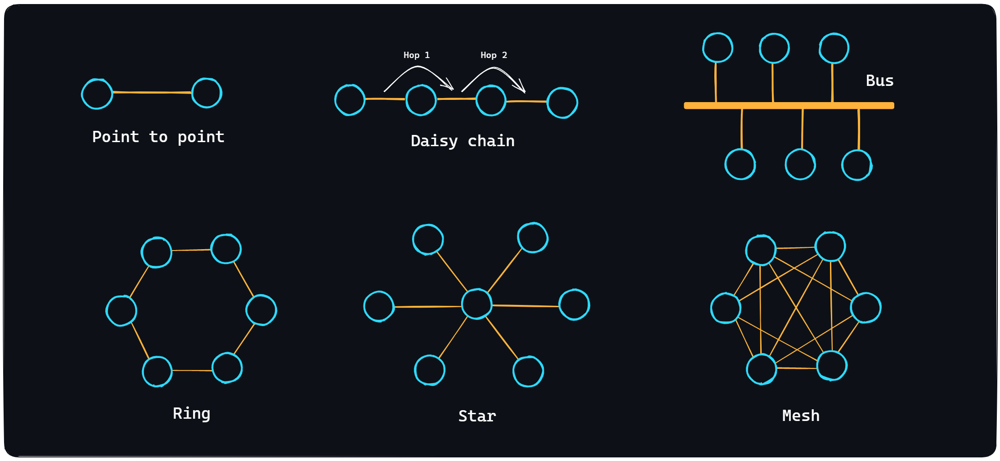</p>

    -   [Network topologies](https://en.wikipedia.org/wiki/Network_topology)
        > There are several topologies (ways of organizing a network): [Point to point](<https://en.wikipedia.org/wiki/Point-to-point_(telecommunications)>), [Daisy chain](<https://en.wikipedia.org/wiki/Daisy_chain_(electrical_engineering)>), [Bus](https://en.wikipedia.org/wiki/Bus_network), [Ring](https://en.wikipedia.org/wiki/Ring_network), [Star](https://en.wikipedia.org/wiki/Star_network) and [Mesh](https://en.wikipedia.org/wiki/Mesh_networking). The Internet itself cannot be referred to any one topology, because it is an incredibly complex system mixed with different topologies.

<details>
    <summary>🔗 <b>References</b></summary>

1. 📄 [**How does the Internet work?** – MDN](https://developer.mozilla.org/en-US/docs/Learn/Common_questions/How_does_the_Internet_work)
2. 📺 [**How does the internet work? (Full Course)** – YouTube](https://youtu.be/zN8YNNHcaZc)
3. 📺 [**What is a Server? Servers vs. Desktops Explained** – YouTube](https://youtu.be/UjCDWCeHCzY)
4. 📺 [**Network Topology** – YouTube](https://youtu.be/lnFeG4DOMcE)
5. 📺 [**Network Topologies (Star, Bus, Ring, Mesh, Ad hoc, Infrastructure, & Wireless Mesh Topology)** – YouTube](https://youtu.be/zbqrNg4C98U)
 </details>

<div align="right"><a href="#top">Contents ⬆️</a></div>

-   ### What is a domain name

    <p align="center">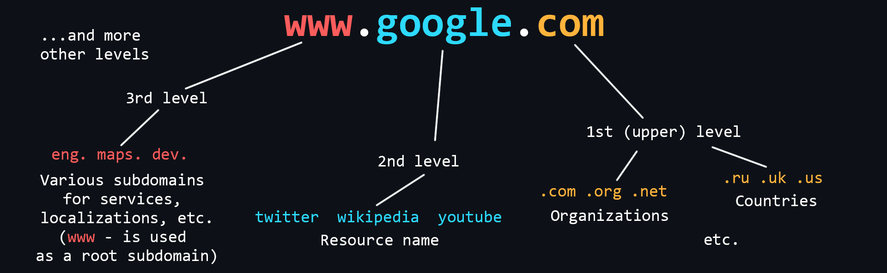</p>

    [Domain Names](https://en.wikipedia.org/wiki/Domain_name) are human-readable addresses of web servers available on the Internet. They consist of parts (levels) separated from each other by a dot. Each of these parts provides specific information about the domain name. For example country, service name, localization, etc.

    -   Who owns domain names
        > [The ICANN Corporation](https://en.wikipedia.org/wiki/ICANN) is the founder of the distributed domain registration system. It gives accreditations to companies that want to sell domains. In this way a competitive domain market is formed.
    -   How to buy a domain name
        > A domain name cannot be bought forever. It is leased for a certain period of time. It is better to buy domains from [accredited registrars](https://www.icann.org/en/accredited-registrars?filter-letter=a&sort-direction=asc&sort-param=name&page=1) (you can find them in almost any country).

<details>
    <summary>🔗 <b>References</b></summary>

1. 📄 [**What is a Domain Name?** – MDN](https://developer.mozilla.org/en-US/docs/Learn/Common_questions/What_is_a_domain_name)
2. 📺 [**A Beginners Guide to How Domain Names Work!** – YouTube](https://youtu.be/Y4cRx19nhJk)
 </details>

<div align="right"><a href="#top">Contents ⬆️</a></div>

-   ### IP address

    <p align="center"></p>

    [IP address](https://en.wikipedia.org/wiki/IP_address) is a unique numeric address that is used to recognize a particular device on the network.

    -   Levels of visibility
        > -   External and publicly accessible IP address that belongs to your ISP and is used to access the Internet by hundreds of other users.
        > -   The IP address of your router in your ISP's local network, the same IP address from which you access the Internet.
        > -   The IP address of your computer in the local (home) network created by the router, to which you can connect your devices. Typically, it looks like 192.168.XXX.XXX.
        > -   The internal IP address of the computer, inaccessible from the outside and used only for communication between the running processes. It is the same for everyone - 127.0.0.1 or just _localhost_.
    -   [Port](<https://en.wikipedia.org/wiki/Port_(computer_networking)>)
        > One device (computer) can run many applications that use the network. In order to correctly recognize where and which data coming over the network should be delivered (to which of the applications) a special numerical number - a port is used. That is, each running process on a computer which uses a network connection has its own personal port.
    -   [IPv4](https://en.wikipedia.org/wiki/IPv4)
        > Version 4 of the IP protocol. It was developed in 1981 and limits the address space to about 4.3 billion (2^32) possible unique addresses.
    -   [IPv6](https://en.wikipedia.org/wiki/IPv6)
        > Over time, the allocation of address space began to happen at a much faster rate, forcing the creation of a new version of the IP protocol to store more addresses. IPv6 is capable of issuing 2^128 (is huge number) unique addresses.

<details>
    <summary>🔗 <b>References</b></summary>

1. 📺 [**IP addresses. Explained** – YouTube](https://youtu.be/7_-qWlvQQtY)
2. 📺 [**Public IP vs. Private IP and Port Forwarding (Explained by Example)** – YouTube](https://youtu.be/92b-jjBURkw)
3. 📺 [**Network Ports Explained** – YouTube](https://youtu.be/g2fT-g9PX9o)
4. 📺 [**What is IP address and types of IP address - IPv4 and IPv6** – YouTube](https://youtu.be/8npT9AALbrI)
5. 📺 [**IP Address - IPv4 vs. IPv6 Tutorial** – YouTube](https://youtu.be/ThdO9beHhpA)
6. 📄 [**IP Address Subnet Cheat Sheet** – freeCodeCamp](https://www.freecodecamp.org/news/subnet-cheat-sheet-24-subnet-mask-30-26-27-29-and-other-ip-address-cidr-network-references/)
 </details>

<div align="right"><a href="#top">Contents ⬆️</a></div>

-   ### What is DNS

    <p align="center"></p>

    [DNS (Domain Name System)](https://en.wikipedia.org/wiki/DNS) is a decentralized Internet address naming system that allows you to create human-readable alphabetical names (domain names) corresponding to the numeric [IP addresses](#ip-address) used by computers.

    -   Structure of DNS
        > DNS consists of many independent nodes, each of which stores only those data that fall within its area of responsibility.
    -   [DNS Resolver](https://www.computerhope.com/jargon/d/dns-resolver.htm)
        > A server that is located in close proximity to your Internet Service Provider. It is the server that searches for addresses by domain name, and also caches them (temporarily storing them for quick retrieval in future requests).
    -   [DNS record types](https://en.wikipedia.org/wiki/List_of_DNS_record_types)
        > -   A record - associates the domain name with an IPv4 address.
        > -   AAAA record - links a domain name with an IPv6 address.
        > -   CNAME record - redirects to another domain name.
        > -   and others - MX record, NS record, PTR record, SOA record.

<details>
    <summary>🔗 <b>References</b></summary>

1. 📄 [**What is DNS? Domain Name System explained** – freeCodeCamp](https://www.freecodecamp.org/news/what-is-dns/)
2. 📺 [**DNS (Domain Name System) explained. Types of Domain Name Servers** – YouTube](https://youtu.be/JkEYOt08-rU)
3. 📺 [**DNS as Fast As Possible** – YouTube](https://youtu.be/Rck3BALhI5c)
4. 📄 [**All about DNS records** – Cloudflare](https://www.cloudflare.com/learning/dns/dns-records/)
5. 📺 [**DNS records explained (playlist)** – YouTube](https://youtube.com/playlist?list=PL_vyuxE-AO-DD94NKcCqd4iqwy5ah_pwq)
 </details>

<div align="right"><a href="#top">Contents ⬆️</a></div>

-   ### Web application design

    Modern [web applications](https://en.wikipedia.org/wiki/Web_application) consist of two parts: [Frontend and Backend](https://en.wikipedia.org/wiki/Frontend_and_backend). Thus implementing a [client-server model](https://en.wikipedia.org/wiki/Client%E2%80%93server_model).

    The tasks of the Frontend are:

    -   Implementation of the user interface (appearance of the application)
        > - A special markup language [HTML](https://en.wikipedia.org/wiki/HTML) is used to create web pages.
        > - [CSS](https://en.wikipedia.org/wiki/CSS) style language is used to style fonts, layout of content, etc.
        > - [JavaScript](https://en.wikipedia.org/wiki/JavaScript) programming language is used to add dynamics and interactivity. <br>
        > As a rule, these tools are rarely used in their pure form, as so-called [frameworks](https://2020.stateofjs.com/en-US/technologies/front-end-frameworks/) and [preprocessors](https://www.freecodecamp.org/news/css-preprocessors/) exist for more convenient and faster development. <br>
    -   Creating functionality for generating requests to the server
        > These are usually different types of input forms that can be conveniently interacted with.
    -   Receives data from the server and then processes it for output to the client

    Tasks of the Backend:

    -   Handling client requests
        > Checking for permissions and access, all sorts of validations, etc.
    -   Implementing business logic
        > A wide range of tasks can be implied here: working with databases, information processing, computation, etc. This is, so to speak, the heart of the Backend world. This is where all the important and interesting stuff happens.
    -   Generating a response and sending it to the client

<details>
    <summary>🔗 <b>References</b></summary>

1. 📄 [**Front-End vs. Back-End explained**](https://blog.teamtreehouse.com/i-dont-speak-your-language-frontend-vs-backend)
2. 📺 [**Everything You NEED to Know About WEB APP Architecture** – YouTube](https://youtu.be/sDlCSIDwpDs)
 </details>

<div align="right"><a href="#top">Contents ⬆️</a></div>

-   ### Browsers and how they work

    <p align="center"></p>

    [Browser](https://en.wikipedia.org/wiki/Web_browser) is a client which can be used to send requests to a server for files which can then be used to render web pages. In simple terms, a browser can be thought of as a program for viewing HTML files, which can also search for and download them from the Internet.

    -   Working Principle
        > Query handling, page rendering, and the tabs feature (each tab has its own process to prevent the contents of one tab from affecting the contents of the other).
    -   [Extensions](https://developer.chrome.com/docs/extensions/)
        > Allow you to change the browser's user interface, modify the contents of web pages, and modify the browser's network requests.
    -   [Chrome DevTools](https://developer.chrome.com/docs/devtools/overview/)
        > An indispensable tool for any web developer. It allows you to analyze all possible information related to web pages, monitor their performance, logs and, most importantly for us, track information about network requests.

<details>
    <summary>🔗 <b>References</b></summary>

1. 📄 [**How browsers work** – MDN](https://developer.mozilla.org/en-US/docs/Web/Performance/How_browsers_work)
2. 📄 [**How browsers work: Behind the scenes of modern web browsers** – web.dev](https://web.dev/howbrowserswork/)
3. 📄 [**Inside look at modern web browser** – Google](https://developer.chrome.com/blog/inside-browser-part1/)
4. 📺 [**What is a web browser?** – YouTube](https://youtu.be/QzohDuGk4mM)
5. 📺 [**Anatomy of the browser 101 (Chrome University 2019)** – YouTube](https://youtu.be/PzzNuCk-e0Y)
6. 📺 [**Chrome DevTools - Crash Course** – YouTube](https://youtu.be/gTVpBbFWry8)
7. 📺 [**Demystifying the Browser Networking Tab in DevTools** – YouTube](https://youtu.be/LBgfSwX4GDI)
8. 📺 [**21+ Browser Dev Tools & Tips You Need To Know** – YouTube](https://youtu.be/TcTSqhpm80Y)
 </details>

<div align="right"><a href="#top">Contents ⬆️</a></div>

-   ### VPN and Proxy

    <p align="center">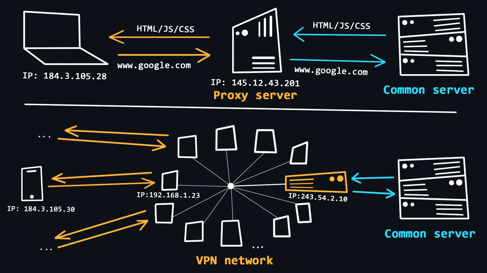</p>

    The use of VPNs and Proxy is quite common in recent years. With the help of these technologies, users can get basic anonymity when surfing the web, as well as bypass various regional blockages.

    -   [VPN (Virtual Private Network)](https://en.wikipedia.org/wiki/VPN)
        > A technology that allows you to become a member of a private network (similar to your local network), where requests from all participants go through a single public IP address. This allows you to blend in with the general mass of requests from other participants. <br>
        >
        > -   Simple procedure for connection and use. <br>
        > -   Reliable traffic encryption. <br>
        > -   There is no guarantee of 100% anonymity, because the owner of the network knows the IP-addresses of all participants. <br>
        > -   VPNs are useless for dealing with multi-accounts and some programs because all accounts operating from the same VPN are easily detected and blocked. <br>
        > -   Free VPNs tend to be heavily loaded, resulting in unstable performance and slow download speeds. <br>
    -   [Proxy (proxy server)](https://en.wikipedia.org/wiki/Proxy_server)
        > A proxy is a special server on the network that acts as an intermediary between you and the destination server you intend to reach. When you are connected to a proxy server all your requests will be performed on behalf of that server, that is, your IP address and location will be substituted. <br>
        >
        > -   The ability to use an individual IP address, which allows you to work with multi-accounts. <br>
        > -   Stability of the connection due to the absence of high loads. <br>
        > -   Connection via proxy is provided in the operating system and browser, so no additional software is required. <br>
        > -   There are proxy varieties that provide a high level of anonymity. <br>
        > -   The unreliability of free solutions, because the proxy server can see and control everything you do on the Internet. <br>

<details>
    <summary>🔗 <b>References</b></summary>

1. 📄 [**What is VPN? How It Works, Types of VPN** – kaspersky.com](https://www.kaspersky.com/resource-center/definitions/what-is-a-vpn)
2. 📺 [**VPN (Virtual Private Network) Explained** – YouTube](https://youtu.be/R-JUOpCgTZc)
3. 📺 [**What Is a Proxy and How Does It Work?** – YouTube](https://youtu.be/ayo2EUPTEkE)
4. 📺 [**What is a Proxy Server?** – YouTube](https://youtu.be/5cPIukqXe5w)
5. 📺 [**Proxy vs. Reverse Proxy (Explained by Example)** – YouTube](https://youtu.be/ozhe__GdWC8)
6. 📺 [**VPN vs. Proxy Explained Pros and Cons** – YouTube](https://youtu.be/npnqyRT77Zc)
 </details>

<div align="right"><a href="#top">Contents ⬆️</a></div>

-   ### Hosting

    <p align="center"></p>

    [Hosting](https://en.wikipedia.org/wiki/Web_hosting_service) is a special [service provided](https://en.wikipedia.org/wiki/Internet_hosting_service) by hosting providers, which allows you to rent space on a server (which is connected to the Internet around the clock), where your data and files can be stored. There are different options for hosting, where you can use not only the disk space of the server, but also the CPU power to run your network applications.

    -   [Virtual hosting](https://en.wikipedia.org/wiki/Virtual_hosting)
        > One physical server that distributes its resources to multiple tenants.
    -   [VPS/VDS](https://en.wikipedia.org/wiki/Virtual_private_server)
        > Virtual servers that emulate the operation of a separate physical server and are available for rent to the client with maximum privileges.
    -   [Dedicated server](https://en.wikipedia.org/wiki/Dedicated_hosting_service)
        > Renting a full physical server with full access to all resources. As a rule, this is the most expensive service.
    -   [Cloud hosting](https://en.wikipedia.org/wiki/Cloud_storage)
        > A service that uses the resources of several servers. When renting, the user pays only for the actual resources used.
    -   [Colocation](https://en.wikipedia.org/wiki/Colocation_centre)
        > A service that gives the customer the opportunity to install their equipment on the provider's premises.

<details>
    <summary>🔗 <b>References</b></summary>

1. 📄 [**What is Web Hosting?** – namecheap.com](https://www.namecheap.com/hosting/what-is-web-hosting-definition/)
2. 📺 [**What is Web Hosting and How Does It Work?** – YouTube](https://youtu.be/H8oAvyqQwew)
3. 📺 [**Different Hosting Types Explained** – YouTube](https://youtu.be/CtNWVmt9U1M)
4. 📄 [**Awesome Hosting** – GitHub](https://github.com/dalisoft/awesome-hosting)
 </details>

<div align="right"><a href="#top">Contents ⬆️</a></div>

-   ### OSI network model

    | №   | Level              | Used protocols       |
    | --- | ------------------ | -------------------- |
    | 7   | Application layer  | HTTP, DNS, FTP, POP3 |
    | 6   | Presentation layer | SSL, SSH, IMAP, JPEG |
    | 5   | Session layer      | APIs Sockets         |
    | 4   | Transport layer    | TCP, UDP             |
    | 3   | Network layer      | IP, ICMP, IGMP       |
    | 2   | Data link layer    | Ethernet, MAC, HDLC  |
    | 1   | Physical layer     | RS-232, RJ45, DSL    |

    [OSI (The Open Systems Interconnection model)](https://en.wikipedia.org/wiki/OSI_model) is a set of rules describing how different devices should interact with each other on the network. The model is divided into 7 layers, each of which is responsible for a specific function. All this is to ensure that the process of information exchange in the network follows the same pattern and all devices, whether it is a smart fridge or a smartphone, can understand each other without any problems.

    -   [Physical layer](https://en.wikipedia.org/wiki/Physical_layer)
        > At this level, bits (ones/zeros) are encoded into physical signals (current, light, radio waves) and transmitted further by wire ([Ethernet](https://en.wikipedia.org/wiki/Ethernet)) or wirelessly ([Wi-Fi](https://en.wikipedia.org/wiki/Wi-Fi)).
    -   [Data link layer](https://en.wikipedia.org/wiki/Data_link_layer)
        > Physical signals from layer 1 are decoded back into ones and zeros, errors and defects are corrected, and the sender and receiver [MAC addresses](https://en.wikipedia.org/wiki/MAC_address) are extracted.
    -   [Network layer](https://en.wikipedia.org/wiki/Network_layer)
        > This is where traffic routing, DNS queries and [IP packet](https://en.wikipedia.org/wiki/Internet_Protocol) generation take place.
    -   [Transport layer](https://en.wikipedia.org/wiki/Transport_layer)
        > The layer responsible for data transfer. There are two important protocols: <br>
        >
        > -   [TCP](https://en.wikipedia.org/wiki/Transmission_Control_Protocol) is a protocol that ensures reliable data transmission. TCP guarantees data delivery and preserves the order of the messages. This has an impact on the transmission speed. This protocol is used where data loss is unacceptable, such as when sending mail or loading web pages. <br>
        > -   [UDP](https://en.wikipedia.org/wiki/User_Datagram_Protocol) is a simple protocol with fast data transfer. It does not use mechanisms to guarantee the delivery and ordering of data. It is used e.g., in online games where partial packet loss is not crucial, but the speed of data transfer is much more important. Also, requests to DNS servers are made through UDP protocol.
    -   [Session layer](https://en.wikipedia.org/wiki/Session_layer)
        > Responsible for opening and closing communications (sessions) between two devices. Ensures that the session stays open long enough to transfer all necessary data, and then closes quickly to avoid wasting resources.
    -   [Presentation layer](https://en.wikipedia.org/wiki/Presentation_layer)
        > Transmission, encryption/decryption and data compression. This is where data that comes in the form of zeros and ones are converted into desired formats (PNG, MP3, PDF, etc.)
    -   [Application layer](https://en.wikipedia.org/wiki/Application_layer)
        > Allows the user's applications to access network services such as database query handler, file access, email forwarding.

<details>
    <summary>🔗 <b>References</b></summary>

1. 📄 [**Layers of OSI Model** – geeksForGeeks](https://www.geeksforgeeks.org/layers-of-osi-model/)
2. 📺 [**The OSI Model - Explained by Example** – YouTube](https://youtu.be/7IS7gigunyI)
3. 📺 [**TCP vs. UDP Crash Course** – YouTube](https://youtu.be/qqRYkcta6IE)
 </details>

<div align="right"><a href="#top">Contents ⬆️</a></div>

-   ### HTTP Protocol

    [HTTP (HyperText Transport Protocol)](https://en.wikipedia.org/wiki/Hypertext_Transfer_Protocol) is the most important protocol on the Internet. It is used to transfer data of any format. The protocol itself works according to a simple principle: request -> response.

    -   [Structure of HTTP messages](https://developer.mozilla.org/en-US/docs/Web/HTTP/Messages)
        > HTTP messages consist of a header section containing metadata about the message, followed by an optional message body containing the data being sent.

    <p align="center">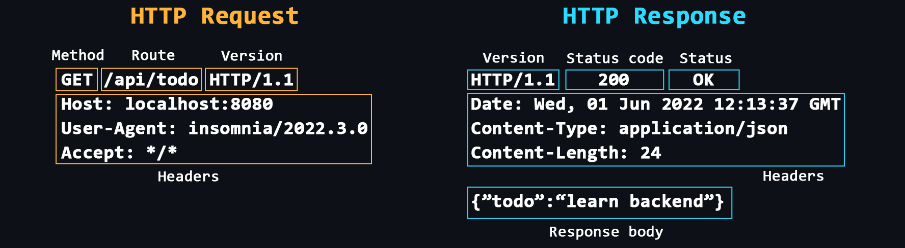</p>

    -   [Headers](https://developer.mozilla.org/en-US/docs/Web/HTTP/Headers)
        > Additional service information that is sent with the request/response. <br>
        > Common headers: [Host](https://developer.mozilla.org/en-US/docs/Web/HTTP/Headers/Host), [User-Agent](https://developer.mozilla.org/en-US/docs/Web/HTTP/Headers/User-Agent), [If-Modified-Since](https://developer.mozilla.org/en-US/docs/Web/HTTP/Headers/If-Modified-Since), [Cookie](https://developer.mozilla.org/en-US/docs/Web/HTTP/Headers/Cookie), [Referer](https://developer.mozilla.org/en-US/docs/Web/HTTP/Headers/Referer), [Authorization](https://developer.mozilla.org/en-US/docs/Web/HTTP/Headers/Authorization), [Cache-Control](https://developer.mozilla.org/en-US/docs/Web/HTTP/Headers/Cache-Control), [Content-Type](https://developer.mozilla.org/en-US/docs/Web/HTTP/Headers/Content-Type), [Content-Length](https://developer.mozilla.org/en-US/docs/Web/HTTP/Headers/Content-Length), [Last-Modified](https://developer.mozilla.org/en-US/docs/Web/HTTP/Headers/Last-Modified), [Set-Cookie](https://developer.mozilla.org/en-US/docs/Web/HTTP/Headers/Set-Cookie), [Content-Encoding](https://developer.mozilla.org/en-US/docs/Web/HTTP/Headers/Content-Encoding).
    -   [Request methods](https://developer.mozilla.org/en-US/docs/Web/HTTP/Methods)
        > Main: [GET](https://developer.mozilla.org/en-US/docs/Web/HTTP/Methods/GET), [POST](https://developer.mozilla.org/en-US/docs/Web/HTTP/Methods/POST), [PUT](https://developer.mozilla.org/en-US/docs/Web/HTTP/Methods/PUT), [DELETE](https://developer.mozilla.org/en-US/docs/Web/HTTP/Methods/DELETE). <br> Others: [HEAD](https://developer.mozilla.org/en-US/docs/Web/HTTP/Methods/HEAD), [CONNECT](https://developer.mozilla.org/en-US/docs/Web/HTTP/Methods/CONNECT), [OPTIONS](https://developer.mozilla.org/en-US/docs/Web/HTTP/Methods/OPTIONS), [TRACE](https://developer.mozilla.org/en-US/docs/Web/HTTP/Methods/TRACE), [PATCH](https://developer.mozilla.org/en-US/docs/Web/HTTP/Methods/PATCH).
    -   [Response status codes](https://developer.mozilla.org/en-US/docs/Web/HTTP/Status)
        > Each response from the server has a special numeric code that characterizes the state of the sent request. These codes are divided into 5 main classes:
        > -   **1хх** - Service information
        > -   **2хх** - Successful request
        > -   **3хх** - Redirect to another address
        > -   **4хх** - Client side error
        > -   **5хх** - Server side error
    -   [HTTPS](https://developer.mozilla.org/en-US/docs/Glossary/https)
        > Same HTTP, but with encryption support. Your apps should use HTTPS to be secure.
    -   [Cookie](https://developer.mozilla.org/en-US/docs/Web/HTTP/Cookies)
        > The HTTP protocol does not provide the ability to save information about the status of previous requests and responses. Cookies are used to solve this problem. Cookies allow the server to store information on the client side that the client can send back to the server. For example, cookies can be used to authenticate users or to store various settings.
    -   [CORS (Cross origin resource sharing)](https://developer.mozilla.org/en-US/docs/Web/HTTP/CORS)
        > A technology that allows one domain to securely receive data from another domain.
    -   [CSP (Content Security Policy)](https://developer.mozilla.org/en-US/docs/Web/HTTP/CSP)
        > A special header that allows you to recognize and eliminate certain types of web application vulnerabilities.
    -   [Evolution of HTTP](https://developer.mozilla.org/en-US/docs/Web/HTTP/Basics_of_HTTP/Evolution_of_HTTP)
        > - **HTTP/1.0**: Uses separate connections for each request/response, lacks caching support, and has plain text headers.
        > - **HTTP/1.1**: Introduces persistent connections, pipelining, the Host header, and chunked transfer encoding.
        > - **HTTP/2**: Supports multiplexing, header compression, server push, and support a binary data.
        > - **HTTP/3**: Built on [QUIC](https://developer.mozilla.org/en-US/docs/Glossary/QUIC), offers improved multiplexing, reliability, and better performance over unreliable networks.

<details>
    <summary>🔗 <b>References</b></summary>

1. 📄 [**How HTTP Works and Why it's Important** – freeCodeCamp](https://www.freecodecamp.org/news/how-the-internet-works/)
2. 📄 [**Hypertext Transfer Protocol (HTTP)** – MDN](https://developer.mozilla.org/en-US/docs/Web/HTTP)
3. 📺 [**Hyper Text Transfer Protocol Crash Course** – YouTube](https://youtu.be/0OrmKCB0UrQ)
4. 📺 [**Full HTTP Networking Course (5 hours)** – YouTube](https://youtu.be/2JYT5f2isg4)
5. 📄 [**HTTP vs. HTTPS – What's the Difference?** – freeCodeCamp](https://www.freecodecamp.org/news/http-vs-https/)
6. 📺 [**HTTP Cookies Crash Course** – YouTube](https://youtu.be/sovAIX4doOE)
7. 📺 [**Cross Origin Resource Sharing (Explained by Example)** – YouTube](https://youtu.be/Ka8vG5miErk)
8. 📺 [**When to use HTTP GET vs. POST?** – YouTube](https://youtu.be/K8HJ6DN23zI)
9. 📺 [**How HTTP/2 Works, Performance, Pros & Cons and More** – YouTube](https://youtu.be/fVKPrDrEwTI)
10. 📺 [**HTTP/2 Critical Limitation that led to HTTP/3 & QUIC** – YouTube](https://youtu.be/GriONb4EfPY)
11. 📺 [**304 Not Modified HTTP Status (Explained with Code Example and Pros & Cons)** – YouTube](https://youtu.be/0QHmHR55_Lo)
12. 📺 [**What is the Largest POST Request the Server can Process?** – YouTube](https://youtu.be/0QHmHR55_Lo)
</details>

<div align="right"><a href="#top">Contents ⬆️</a></div>

-   ### TCP/IP stack

    <p align="center">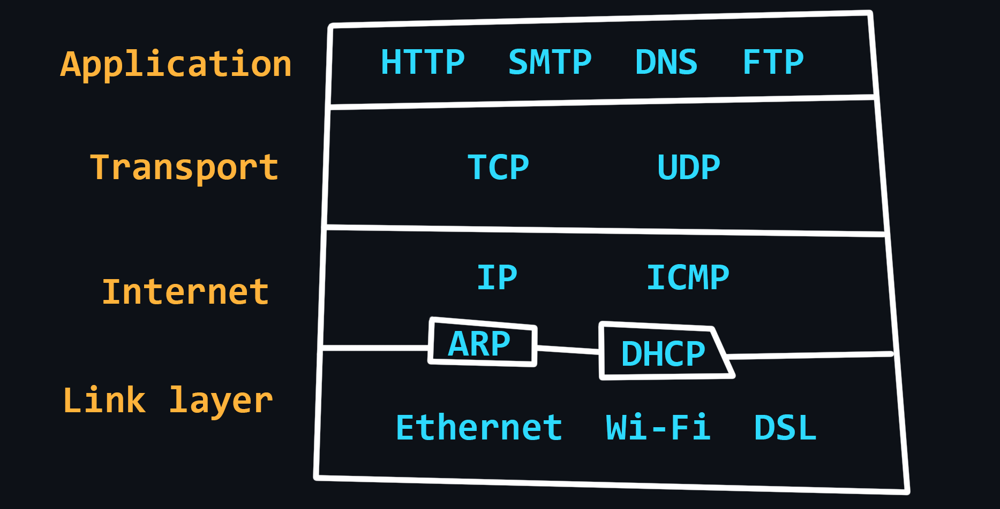</p>

    Compared to the [OSI model](#osi-network-model), the [TCP/IP](https://en.wikipedia.org/wiki/Internet_protocol_suite) stack has a simpler architecture. In general, the TCP/IP model is more widely used and practical, and the OSI model is more theoretical and detailed. Both models describe the same principles, but differ in the approach and protocols they include at their levels.

    - [Link layer](https://en.wikipedia.org/wiki/Link_layer)
        > Defines how data is transmitted over the physical medium, such as cables or wireless signals. <br>
        > Protocols: [Ethernet](https://en.wikipedia.org/wiki/Ethernet), [Wi-Fi](https://en.wikipedia.org/wiki/Wi-Fi), [Bluetooth](https://en.wikipedia.org/wiki/Bluetooth), [Fiber optic](https://en.wikipedia.org/wiki/Optical_fiber).
    - [Internet Layer](https://en.wikipedia.org/wiki/Internet_layer)
        > Routing data across different networks. It uses IP addresses to identify devices and routes data packets to their destination. <br>
        > Protocols: [IP](https://en.wikipedia.org/wiki/Internet_Protocol), [ARP](https://en.wikipedia.org/wiki/Address_Resolution_Protocol), [ICMP](https://en.wikipedia.org/wiki/Internet_Control_Message_Protocol), [IGMP](https://en.wikipedia.org/wiki/Internet_Group_Management_Protocol)
    - [Transport Layer](https://en.wikipedia.org/wiki/Transport_layer)
        > Data transmission between two devices. It uses protocols such as [TCP](https://en.wikipedia.org/wiki/Transmission_Control_Protocol) - reliable, but slow and [UDP](https://en.wikipedia.org/wiki/User_Datagram_Protocol) - fast, but unreliable.
    - [Application Layer](https://en.wikipedia.org/wiki/Application_layer)
        > Provides services to the end user, such as web browsing, email, and file transfer. It interacts with the lower layers of the stack to transmit data over the network. <br>
        > Protocols: [HTTP](#http-protocol), [FTP](https://en.wikipedia.org/wiki/File_Transfer_Protocol), [SMTP](https://en.wikipedia.org/wiki/Simple_Mail_Transfer_Protocol), [DNS](https://en.wikipedia.org/wiki/Domain_Name_System), [SNMP](https://en.wikipedia.org/wiki/Simple_Network_Management_Protocol).

<details>
    <summary>🔗 <b>References</b></summary>

1. 📄 [**What is the TCP/IP Model? Layers and Protocols Explained** – freeCodeCamp](https://www.freecodecamp.org/news/what-is-tcp-ip-layers-and-protocols-explained/)
2. 📺 [**What is TCP/IP?** – YouTube](https://youtu.be/PpsEaqJV_A0)
3. 📺 [**How TCP really works. Three-way handshake. TCP/IP Deep Dive** – YouTube](https://youtu.be/rmFX1V49K8U)
 </details>

<div align="right"><a href="#top">Contents ⬆️</a></div>

-   ### Network problems

    <p align="center">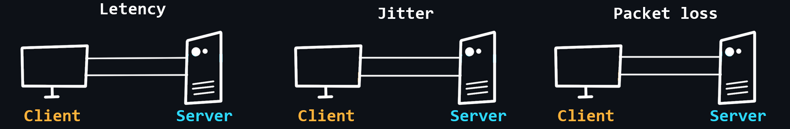</p>

    The quality of networks, including the Internet, is far from ideal. This is due to the complex structure of networks and their dependence on a huge number of factors. For example, the stability of the connection between the client device and its router, the quality of service of the provider, the power, and performance of the server, the physical distance between the client and the server, etc.

    -   [Latency](https://developer.mozilla.org/en-US/docs/Web/Performance/Understanding_latency)
        > The time it takes for a data packet to travel from sender to receiver. It depends more on the physical distance.
    -   [Packet loss](https://en.wikipedia.org/wiki/Packet_loss)
        > Not all packets traveling over the network can reach their destination. This happens most often when using wireless networks or due to [network congestion](https://en.wikipedia.org/wiki/Network_congestion).
    -   [Round Trip Time (RTT)](https://en.wikipedia.org/wiki/Round-trip_delay)
        > The time it takes for the data packet to reach its destination + the time to respond that the packet was received successfully.
    -   [Jitter](https://www.ir.com/guides/what-is-network-jitter)
        > Delay fluctuations, unstable ping (for example, 50ms, 120ms, 35ms...).
    -   [Packet reordering](https://wiki.geant.org/display/public/EK/PacketReordering)
        > The IP protocol does not guarantee that packets are delivered in the order in which they are sent.

<details>
    <summary>🔗 <b>References</b></summary>

1. 📄 [**Understanding latency** – MDN](https://developer.mozilla.org/en-US/docs/Web/Performance/Understanding_latency)
2. 📺 [**What is latency? What affects latency?** – YouTube](https://youtu.be/epAXDsq5SbE)
3. 📺 [**Basics of network bandwidth, latency, and jitter** – YouTube](https://youtu.be/WdbJdUh6W08)
4. 📺 [**Round Trip Time (RTT)** – YouTube](https://youtu.be/nT9F-USjtBg)
5. 📺 [**What Causes Packet Loss and How to Eliminate It In Your Network** – YouTube](https://youtu.be/Cg656nGbXe4)
 </details>

<div align="right"><a href="#top">Contents ⬆️</a></div>

-   ### Network diagnostics

    <p align="center"></p>

    -   [Traceroute](https://en.wikipedia.org/wiki/Traceroute)
        > A procedure that allows you to trace to which nodes, with which IP addresses, a packet you send before it reaches its destination. Tracing can be used to identify computer network related problems and to examine/analyze the network.
    -   [Ping scan](<https://en.wikipedia.org/wiki/Ping_(networking_utility)>)
        > The easiest way to check the server for performance.
    -   [Checking for packet loss](https://www.dnsstuff.com/packet-loss-test)
        > Due to dropped connections, not all packets sent over the network reach their destination.
    -   [Wireshark](https://en.wikipedia.org/wiki/Wireshark)
        > A powerful program with a graphical interface for analyzing all traffic that passes through the network in real time.

<details>
    <summary>🔗 <b>References</b></summary>

1. 📺 [**How does traceroute work?** – YouTube](https://youtu.be/G05y9UKT69s)
2. 📺 [**Traceroute (tracert) Explained - Network Troubleshooting** – YouTube](https://youtu.be/up3bcBLZS74)
3. 📺 [**Nmap - Host Discovery With Ping Sweep** – YouTube](https://youtu.be/LvCDaftsMwI)
4. 📺 [**Internet Troubleshooting - Pathping Packet Loss** – YouTube](https://youtu.be/VPdotNIXOgI)
5. 📺 [**Wireshark crash course (playlist)** – YouTube](https://youtube.com/playlist?list=PLBf0hzazHTGPgyxeEj_9LBHiqjtNEjsgt)
 </details>

<div align="right"><a href="#top">Contents ⬆️</a></div>

## PC device

-   ### Main components (hardware)

    -   [Motherboard](https://en.wikipedia.org/wiki/Motherboard)
        > The most important PC component to which all other elements are connected.
        >
        > -   [Chipset](https://en.wikipedia.org/wiki/Chipset) - set of electronic components that responsible for the communication of all motherboard components.
        > -   [CPU socket](https://en.wikipedia.org/wiki/CPU_socket) - socket for mounting the processor.
        > -   [VRM (Voltage Regulator Module)](https://en.wikipedia.org/wiki/Voltage_regulator_module) – module that converts the incoming voltage (usually 12V) to a lower voltage to run the processor, integrated graphics, memory, etc.
        > -   Slots for RAM.
        > -   Expansion slots [PCI-Express](https://en.wikipedia.org/wiki/PCI_Express) - designed for connection of video cards, external network/sound cards.
        > -   Slots [M.2](https://en.wikipedia.org/wiki/M.2) / [SATA](https://en.wikipedia.org/wiki/SATA) - designed to connect hard disks and SSDs.
    -   [CPU (Central processing unit)](https://en.wikipedia.org/wiki/Central_processing_unit)
        > The most important device that executes instructions (programme code). Processors only work with 1 and 0, so all programmes are ultimately a set of binary code.
        >
        > -   [Registers](https://en.wikipedia.org/wiki/Processor_register) - the fastest memory in a PC, has an extremely small capacity, is built into the processor and is designed to temporarily store the data being processed.
        > -   [Cache](https://en.wikipedia.org/wiki/CPU_cache) - slightly less fast memory, which is also built into the processor and is used to store a copy of data from frequently used cells in the main memory.
        > -   Processors can have different [architectures](https://en.wikipedia.org/wiki/Processor_design). Currently, the most common are the [x86](https://en.wikipedia.org/wiki/X86-64) architecture (desktop and laptop computers) and [ARM](https://en.wikipedia.org/wiki/ARM_architecture_family) (mobile devices as well as the latest Apple computers).
    -   [RAM (Random-access memory)](https://en.wikipedia.org/wiki/Random-access_memory)
        > Fast, low capacity memory (4-16GB) designed to temporarily store program code, as well as input, output and intermediate data processed by the processor.
    -   [Data storage](https://en.wikipedia.org/wiki/Data_storage)
        > Large capacity memory (256GB-1TB) designed for long-term storage of files and installed programmes.
    -   [GPU (Graphics card)](https://en.wikipedia.org/wiki/Graphics_card)
        > A separate card that translates and processes data into images for display on a monitor. This device is also called a discrete graphics card. Usually needed for those who do 3D modelling or play games. <br> [Built-in graphics card](https://en.wikipedia.org/wiki/Graphics_processing_unit#Integrated_graphics_processing_unit) is a graphics card built into the processor. It is suitable for daily work.
    -   [Network card](https://en.wikipedia.org/wiki/Network_interface_controller)
        > A device that receives and transmits data from other devices connected to the [local network](https://en.wikipedia.org/wiki/Local_area_network).
    -   [Sound card](https://en.wikipedia.org/wiki/Sound_card)
        > A device that allows you to process sound, output it to other devices, record it with a microphone, etc.
    -   [Power supply unit](<https://en.wikipedia.org/wiki/Power_supply_unit_(computer)>)
        > A device designed to convert the AC voltage from the mains to DC voltage.

<details>
    <summary>🔗 <b>References</b></summary>

1. 📄 [**Everything You Need to Know About Computer Hardware**](https://www.lifewire.com/computer-hardware-2625895)
2. 📄 [**Putting the "You" in CPU: explainer how your computer runs programs, from start to finish**](https://github.com/hackclub/putting-the-you-in-cpu)
3. 📺 [**What does what in your computer? Computer parts Explained** – YouTube](https://youtu.be/ExxFxD4OSZ0)
4. 📺 [**Motherboards Explained** – YouTube](https://youtu.be/b2pd3Y6aBag)
5. 📺 [**The Fetch-Execute Cycle: What's Your Computer Actually Doing?** – YouTube](https://youtu.be/Z5JC9Ve1sfI)
6. 📺 [**How a CPU Works in 100 Seconds // Apple Silicon M1 vs. Intel i9** – YouTube](https://youtu.be/vqs_0W-MSB0)
7. 📺 [**Arm vs. x86 - Key Differences Explained** – YouTube](https://youtu.be/AADZo73yrq4)
 </details>

<div align="right"><a href="#top">Contents ⬆️</a></div>

-   ### Operating system design

    <p align="center">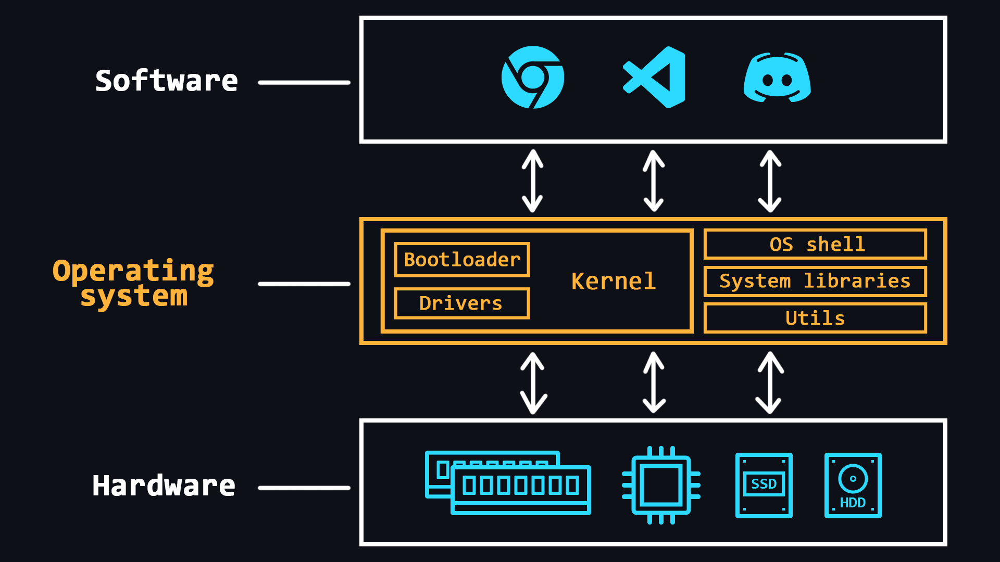</p>

    [Operating system (OS)](https://en.wikipedia.org/wiki/Operating_system) is a comprehensive software system designed to manage a computer's resources. With operating systems, people do not have to deal directly with the processor, RAM, or other parts of the PC.

    OS can be thought of as an abstraction layer that manages the hardware of a computer, thereby providing a simple and convenient environment for user software to run.

    -   Main features
        > -   RAM management (space allocation for individual programs)
        > -   Loading programs into RAM and their execution
        > -   Execution of requests from user's programs (inputting and outputting data, starting and stopping other programs, freeing up memory or allocating additional memory, etc.)
        > -   Interaction with input and output devices (mouse, keyboard, monitor, etc.)
        > -   Interaction with storage media (HDDs and SSDs)
        > -   Providing a user's interface (console shell or graphical interface)
        > -   Logging of software errors (saving logs)
    -   Additional functions (may not be available in all OSs)
        > -   Organize [multitasking](https://en.wikipedia.org/wiki/Computer_multitasking) (simultaneous execution of several programs)
        > -   Delimiting access to resources for each process
        > -   [Inter-process communication](https://en.wikipedia.org/wiki/Inter-process_communication) (data exchange, synchronisation)
        > -   Organize the protection of the operating system itself against other programs and the actions of the user
        > -   Provide multi-user mode and differentiate rights between different OS users (admins, guests, etc.)
    -   [OS kernel](<https://en.wikipedia.org/wiki/Kernel_(operating_system)>)
        > The central part of the operating system which is used most intensively. The kernel is constantly in memory, while other parts of the OS are loaded into and unloaded from memory as needed.
    -   [Bootloader](https://en.wikipedia.org/wiki/Bootloader)
        > The system software that prepares the environment for the OS to run (puts the hardware in the right state, prepares the memory, loads the OS kernel there and transfers control to it (the kernel).
    -   [Device drivers](https://en.wikipedia.org/wiki/Device_driver)
        > Special software that allows the OS to work with a particular piece of equipment.

<details>
    <summary>🔗 <b>References</b></summary>

1. 📄 [**What is an OS? Operating System Definition for Beginners** – freeCodeCamp](https://www.freecodecamp.org/news/what-is-an-os-operating-system-definition-for-beginners/)
2. 📄 [**Windows vs. macOS vs. Linux – Operating System Handbook** – freeCodeCamp](https://www.freecodecamp.org/news/an-introduction-to-operating-systems/)
3. 📺 [**Operating Systems: Crash Course Computer Science** – YouTube](https://youtu.be/26QPDBe-NB8)
4. 📺 [**Operating System Basics** – YouTube](https://youtu.be/9GDX-IyZ_C8)
5. 📺 [**Operating System in deep details (playlist)** – YouTube](https://youtube.com/playlist?list=PLBlnK6fEyqRiVhbXDGLXDk_OQAeuVcp2O)
6. 📄 [**Awesome Operating System Stuff** – GitHub](https://github.com/jubalh/awesome-os)
 </details>

<div align="right"><a href="#top">Contents ⬆️</a></div>

-   ### Processes and threads

    <p align="center">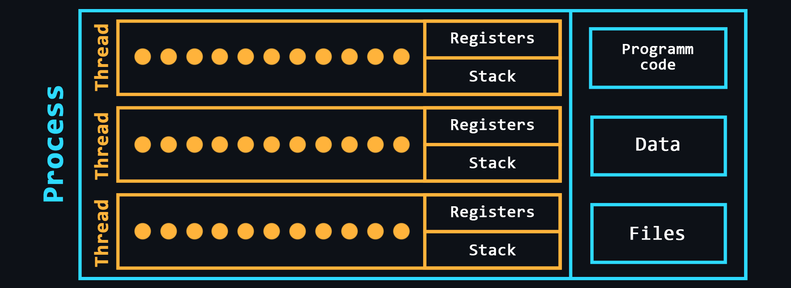</p>

    -   [Process](<https://en.wikipedia.org/wiki/Process_(computing)>)
        > A kind of container in which all the resources needed to run a program are stored. As a rule, the process consists of:
        >
        > -   Executable program code <br>
        > -   Input and output data <br>
        > -   [Call stack](https://en.wikipedia.org/wiki/Call_stack) (order of instructions for execution) <br>
        > -   [Heap](https://en.wikipedia.org/wiki/Memory_management#Manual_memory_management) (a structure for storing intermediate data created during the process) <br>
        > -   [Segment descriptor](https://en.wikipedia.org/wiki/Segment_descriptor) <br>
        > -   [File descriptor](https://en.wikipedia.org/wiki/File_descriptor) <br>
        > -   Information about the set of permissible powers <br>
        > -   Processor status information
    -   [Thread](<https://en.wikipedia.org/wiki/Thread_(computing)>)
        > An entity in which sequences of program actions (procedures) are executed. Threads are within a process and use the same address space. There can be multiple threads in a single process, allowing multiple tasks to be performed. These tasks, thanks to threads, can exchange data, use shared data or the results of other tasks.

<details>
    <summary>🔗 <b>References</b></summary>

1. 📺 [**Difference Between Process and Thread** – YouTube](https://youtu.be/O3EyzlZxx3g)
2. 📺 [**How Do CPUs Use Multiple Cores** – YouTube](https://youtu.be/S3I5WNHbnJ0)
3. 📺 [**What is Hyper Threading Technology** – YouTube](https://youtu.be/wnS50lJicXc)
 </details>

<div align="right"><a href="#top">Contents ⬆️</a></div>

-   ### Concurrency and parallelism

    <p align="center"></p>

    -   [Parallelism](https://en.wikipedia.org/wiki/Parallel_computing)
        > The ability to perform multiple tasks simultaneously using multiple processor cores, where each individual core performs a different task.
    -   [Concurrency](<https://en.wikipedia.org/wiki/Concurrency_(computer_science)>)
        > The ability to perform multiple tasks, but using a single processor core. This is achieved by dividing tasks into separate blocks of commands which are executed in turn, but switching between these blocks is so fast that for users it seems as if these processes are running simultaneously.

<details>
    <summary>🔗 <b>References</b></summary>

1. 📄 [**Concurrency, parallelism, and the many threads of Santa Claus** – freeCodeCamp](https://www.freecodecamp.org/news/concurrency-parallelism-and-the-many-threads-of-santa-claus/)
2. 📺 [**Concurrency vs. Parallelism** – YouTube](https://youtu.be/Y1pgpn2gOSg)
3. 📺 [**Concurrency is not Parallelism by Rob Pike** – YouTube](https://youtu.be/oV9rvDllKEg)
 </details>

<div align="right"><a href="#top">Contents ⬆️</a></div>

-   ### Inter-process communication

    A mechanism which allows to exchange data between threads of one or different processes. Processes can be run on the same computer or on different computers connected by a network. [Inter-process communication](https://en.wikipedia.org/wiki/Inter-process_communication) can be done in different ways.

    -   [File](https://en.wikipedia.org/wiki/Computer_file)
        > The easiest way to exchange data. One process writes data to a certain file, another process reads the same file and thus receives data from the first process.
    -   [Signal (IPC)](<https://en.wikipedia.org/wiki/Signal_(IPC)>)
        > Asynchronous notification of one process about an event which occurred in another process.
    -   [Network socket](https://en.wikipedia.org/wiki/Network_socket)
        > In particular, IP addresses and ports are used to communicate between computers using the TCP/IP protocol stack. This pair defines a socket (_socket_ corresponding to the address and port).
    -   [Semaphore](<https://en.wikipedia.org/wiki/Semaphore_(programming)>)
        > A counter over which only 2 operations can be performed: increasing and decreasing (and for 0 the decreasing operation is blocked).
    -   [Message passing](https://en.wikipedia.org/wiki/Message_passing) & [Message queue](https://en.wikipedia.org/wiki/Message_queue)
    -   [Pipelines](<https://en.wikipedia.org/wiki/Pipeline_(Unix)>)
        > Redirecting the output of one process to the input of another (similar to a pipe).

<details>
    <summary>🔗 <b>References</b></summary>

1. 📄 [**Interprocess Communications** – Microsoft](https://learn.microsoft.com/en-us/windows/win32/ipc/interprocess-communications)
2. 📺 [**Interprocess Communication** – YouTube](https://youtu.be/dJuYKfR8vec)
3. 📺 [**Inter Process Communication** – YouTube](https://youtu.be/W0BX6geRCDQ)
 </details>

<div align="right"><a href="#top">Contents ⬆️</a></div>

## Linux Basics

Operating systems based on [Linux kernel](https://en.wikipedia.org/wiki/Linux_kernel) are the standard in the world of server development, since most servers run on such operating systems. Using Linux on servers is profitable because it is free and open source, secure and works fast on cheap hardware.

There are a huge number of [Linux distributions](https://en.wikipedia.org/wiki/Linux_distribution) (preinstalled software bundles) to suit all tastes. One of the most popular is [Ubuntu](https://en.wikipedia.org/wiki/Ubuntu). This is where you can start your dive into server development.

[Install Ubuntu](https://ubuntu.com/download/desktop) on a separate PC or laptop. If this is not possible, you can use a special program [Virtual Box](https://www.virtualbox.org/wiki/Downloads) where you can [run other OS](https://www.virtualbox.org/manual/ch01.html#create-vm-wizard) on top of the main OS. You can also run [Docker](https://www.docker.com/products/docker-desktop) [Ubuntu image container](https://hub.docker.com/_/ubuntu) (Docker is a [separate topic](#docker) that is exists in this repository).

-   ### Working with shell

    [Shell](https://en.wikipedia.org/wiki/Shell_(computing)) (or console, terminal) is a computer program which is used to operate and control a computer by entering special text commands. Generally, servers do not have [graphical interfaces (GUI)](https://en.wikipedia.org/wiki/Graphical_user_interface), so you will definitely need to learn how to work with shells. The are many [Unix shells](https://en.wikipedia.org/wiki/Unix_shell), but most Linux distributions come with a [Bash shell](https://en.wikipedia.org/wiki/Bash_(Unix_shell)) by default.

    -   Basic commands for navigating the file system
        ```sh
        ls # list directory contents
        cd [PATH] # go to specified directory
        cd .. # move to a higher level (to the parent directory)
        touch [FILE] # create a file
        cat > [FILE] # enter text into the file (overwrite)
        cat >> [FILE] # enter text at the end of the file (append)
        cat/more/less [FILE] # to view the file contents
        head/tail [FILE] # view the first/last lines of a file
        pwd # print path to current directory
        mkdir [NAME] # create a directory
        rmdir [NAME] # delete a directory
        cp [FILE] [PATH] # copy a file or directory
        mv [FILE] [PATH] # moving or renaming
        rm [FILE] # deleting a file or directory
        find [STRING] # file system search
        du [FILE] # output file or directory size
        grep [PATTERN] [FILE] # print lines that match patterns
        ```
    -   Commands for help information
        ```sh
        man [COMMAND] # allows you to view a manual for any command
        apropos [STRING] # search for a command with a description that has a specified word
        man -k [STRING] # similar to the command above
        whatis [COMMAND] # a brief description of the command
        ```
    -   [Super user rights](https://en.wikipedia.org/wiki/Sudo)
        > Analogue to running as administrator in Windows
        ```sh
        sudo [COMMAND] # executes a command with superuser privileges
        ```
    -   Text editor
        > Study any in order to read and edit files freely through the terminal.
        > The easiest – [nano](https://en.wikipedia.org/wiki/GNU_nano).
        > Something in the middle - [micro](https://micro-editor.github.io/).
        > The most advanced – [Vim](<https://en.wikipedia.org/wiki/Vim_(text_editor)>).

<details>
    <summary>🔗 <b>References</b></summary>

1. 📄 [**31 Linux Commands Every Ubuntu User Should Know**](https://itsfoss.com/essential-ubuntu-commands/)
2. 📄 [**The Linux Command Handbook** – freeCodeCamp](https://www.freecodecamp.org/news/the-linux-commands-handbook/)
3. 📄 [**A to Z: List of Linux commands**](https://linuxhandbook.com/a-to-z-linux-commands/)
4. 📺 [**The 50 Most Popular Linux & Terminal Commands** – YouTube](https://youtu.be/ZtqBQ68cfJc)
5. 📺 [**Nano Editor Fundamentals** – YouTube](https://youtu.be/gyKiDczLIZ4)
6. 📺 [**Vim Tutorial for Beginners** – YouTube](https://youtu.be/RZ4p-saaQkc)
7. 📄 [**Awesome Terminals** – GitHub](https://github.com/cdleon/awesome-terminals)
8. 📄 [**Awesome CLI-apps** – GitHub](https://github.com/agarrharr/awesome-cli-apps)
 </details>

<div align="right"><a href="#top">Contents ⬆️</a></div>

-   ### Package manager

    The package manager is a utility that allows you to install/update software packages from the terminal.

    Linux distributions can be divided into several groups, depending on which package manager they use: [apt](<https://en.wikipedia.org/wiki/APT_(software)>) (in [Debian](https://en.wikipedia.org/wiki/Debian) based distributions), [RPM](https://en.wikipedia.org/wiki/RPM_Package_Manager) (the [Red Hat](https://en.wikipedia.org/wiki/Red_Hat_Enterprise_Linux) package management system) and [Pacman](https://en.wikipedia.org/wiki/Arch_Linux#Pacman) (the package manager in [Arch-like distributions](https://en.wikipedia.org/wiki/Arch_Linux))

    Ubuntu is based on Debian, so it uses apt (advanced packaging tool) package manager.

    -   Basic commands
        ```sh
        apt install [package] # install the package
        apt remove [package] # remove the package, but keep the configuration
        apt purge [package] # remove the package along with the configuration
        apt update # update information about new versions of packages
        apt upgrade # update the packages installed in the system
        apt list --installed # list of packages installed on the system
        apt list --upgradable # list of packages that need to be updated
        apt search [package] # searching for packages by name on the network
        apt show [package] # package information
        ```
    -   [aptitude](https://en.wikipedia.org/wiki/Aptitude_(software))
        > Interactive console utility for easy viewing of packages to install, update and uninstall them.
    -   Repository management
        > Package managers typically work with software repositories. These repositories contain a collection of software packages that are maintained and provided by the distribution's community or official sources.
        ```sh
        add-apt-repository [repository_url] # add a new repository
        add-apt-repository --remove [repository_url] # remove a repo
            # don\'t forget to update after this operations - apt update
        ```
        ```sh
        /etc/apt/sources.list # a file contains a list of configured repo links
        /etc/apt/sources.list.d # a directory contains files for third party repos
        ```
    -   [dpkg](https://en.wikipedia.org/wiki/Dpkg)
        > Low-level tool to install, build, remove and manage Debian packages.


<details>
    <summary>🔗 <b>References</b></summary>

1. 📺 [**Linux Crash Course - The apt Command** – YouTube](https://youtu.be/1kicKTbK768)
2. 📺 [**Linux Package Management | Debian, Fedora, and Arch Linux** – YouTube](https://youtu.be/lkii2cGuKao)
3. 📄 [**sudo apt-get update vs. upgrade – What is the Difference?** – freeCodeCamp](https://www.freecodecamp.org/news/sudo-apt-get-update-vs-upgrade-what-is-the-difference)
4. 📄 [**Repositories in Ubuntu**](https://help.ubuntu.com/community/Repositories/Ubuntu)
 </details>

<div align="right"><a href="#top">Contents ⬆️</a></div>

-   ### Bash scripts

    You can use scripts to automate the sequential input of any number of commands. In [Bash](<https://en.wikipedia.org/wiki/Bash_(Unix_shell)>) you can create different conditions (branching), loops, timers, etc. to perform all kinds of actions related to shell input.

    -   [Basics of Bash Scripts](https://github.com/cheatsnake/bash-scripts-by-example)
        > The most basic and frequently used features such as: variables, I/O, loops, conditions, etc.
    -   Practice
        > Solve challenges on sites like [HackerRank](https://www.hackerrank.com/domains/shell) and [Codewars](https://www.codewars.com/join?language=shell).
        > Start using Bash to automate routine activities on your computer. If you're already a programmer, create scripts to easily build your project, to install settings, and so on.
    -   [ShellCheck](https://github.com/koalaman/shellcheck) script analysis tool
        > It will point out possible mistakes and teach you best practices for writing really good scripts.
    -   Additional resources
        > Repositories such as [awesome bash](https://github.com/awesome-lists/awesome-bash) and [awesome shell](https://github.com/alebcay/awesome-shell) have entire collections of useful resources and tools to help you develop even more skills with Bash and shell in general.

<details>
    <summary>🔗 <b>References</b></summary>

1. 📄 [**Shell Scripting for Beginners** – freeCodeCamp](https://www.freecodecamp.org/news/shell-scripting-crash-course-how-to-write-bash-scripts-in-linux/)
2. 📺 [**Bash Scripting Full Course 3 Hours** – YouTube](https://youtu.be/e7BufAVwDiM)
3. 📄 [**HackerRank challenges for Bash with solutions**](https://github.com/Thomas-George-T/HackerRank-The-Linux-Shell-Challenges-Solutions)
 </details>

<div align="right"><a href="#top">Contents ⬆️</a></div>

-   ### Users, groups, and permissions

    Linux-based operating systems are multi-user. This means that several people can run many different applications at the same time on the same computer. For the Linux system to be able to "recognize" a user, he must be logged in, and therefore each user must have a unique name and a secret password.

    -   Working with users
        ```sh
        useradd [name] [flags] # create a new user
        passwd [name] # set a password for the user
        usermod [name] [flags] # edit a user
        usermod -L [name] # block a user
        usermod -U [name] # unblock a user
        userdel [name] [flags] # delete a user
        su [name] # switch to other user
        ```
    -   Working with groups
        ```sh
        groupadd [group] [flags] # create a group
        groupmod [group] [flags] # edit group
        groupdel [group] [flags] # delete group
        usermod -a -G [groups] [user] # add a user to groups
        gpasswd --delete [user] [groups] # remove a user from groups
        ```
    -   System files
        ```sh
        /etc/passwd # a file containing basic information about users
        /etc/shadow # a file containing encrypted passwords
        /etc/group # a file containing basic information about groups
        /etc/gshadow # a file containing encrypted group passwords
        ```

    On Linux, it is possible to share privileges between users, limit access to unwanted files or features, control available actions for services, and much more. On Linux, there are only three kinds of rights - read, write and execute - and three categories of users to which they can be applied - file owner, file group and everyone else.

    <p align="center">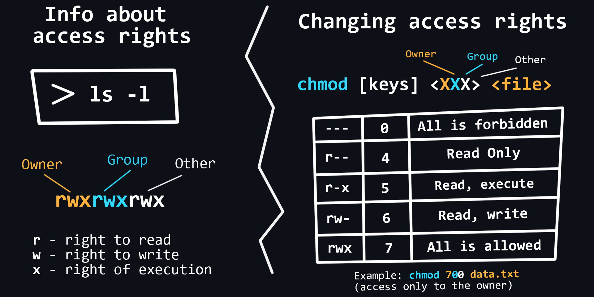</p>

    -   Basic commands for working with rights
        ```sh
        chown <user> <file> # changes the owner and/or group for the specified files
        chmod <rights> <file> # changes access rights to files and directories
        chgrp <group> <file> # allows users to change groups
        ```
    -   Extended rights [SUID and GUID](https://en.wikipedia.org/wiki/Setuid), [sticky bit](https://en.wikipedia.org/wiki/Sticky_bit)
    -   [ACL (Access control list)](https://en.wikipedia.org/wiki/Access-control_list)
        > An advanced subsystem for managing access rights.


<details>
    <summary>🔗 <b>References</b></summary>

1. 📄 [**Managing Users, Groups, and Permissions on Linux**](https://omarrrz-lounge.hashnode.dev/managing-users-groups-and-permissions-in-linux)
2. 📄 [**Linux User Groups Explained** – freeCodeCamp](https://www.freecodecamp.org/news/linux-user-groups-explained-how-to-add-a-new-group-a-new-group-member-and-change-groups/)
3. 📺 [**Linux Users and Groups** – YouTube](https://youtu.be/b-9j2jiCOEA)
4. 📄 [**An Introduction to Linux Permissions** – Digital Ocean](https://www.digitalocean.com/community/tutorials/an-introduction-to-linux-permissions)
5. 📄 [**File Permissions on Linux – How to Use the chmod Command** – freeCodeCamp](https://www.freecodecamp.org/news/file-permissions-in-linux-chmod-command-explained/)
6. 📺 [**Understanding File & Directory Permissions** – YouTube](https://youtu.be/4e669hSjaX8)
 </details>

<div align="right"><a href="#top">Contents ⬆️</a></div>

-   ### Working with processes

    Linux processes can be described as containers in which all information about the state of a running program is stored. Sometimes programs can hang and in order to force them to close or restart, you need to be able to manage processes.

    -   Basic Commands
        ```sh
        ps # display a snapshot of the processes of all users
        top # real-time task manager
        [command] & # running the process in the background, (without occupying the shell)
        jobs # list of processes running in the background
        fg [PID] # return the process back to the active mode by its number
         # You can press [Ctrl+Z] to return the process to the background
        bg [PID] # start a stopped process in the background
        kill [PID] # terminate the process by PID
        killall [program] # terminate all processes related to the program
        ```

<details>
    <summary>🔗 <b>References</b></summary>

1. 📄 [**How to Show Process Tree on Linux**](https://linuxhandbook.com/show-process-tree/)
2. 📄 [**How to Manage Linux Processes** – freeCodeCamp](https://www.freecodecamp.org/news/how-to-manage-linux-processes/)
3. 📄 [**How To Use ps, kill, and nice to Manage Processes on Linux** – Digital Ocean](https://www.digitalocean.com/community/tutorials/how-to-use-ps-kill-and-nice-to-manage-processes-in-linux)
4. 📺 [**Linux processes, init, fork/exec, ps, kill, fg, bg, jobs** – YouTube](https://youtu.be/TJzltwv7jJs)
 </details>

<div align="right"><a href="#top">Contents ⬆️</a></div>

-   ### Working with SSH

    [SSH](https://en.wikipedia.org/wiki/Secure_Shell) allows remote access to another computer's terminal. In the case of a personal computer, this may be needed to solve an urgent problem, and in the case of working with the server, remote access via SSH is an integral and regularly used practice.

    -   Basic commands
        ```sh
        apt install openssh-server # installing SSH (out of the box almost everywhere)
        service ssh start # start SSH
        service ssh stop # stop SSH
        ssh -p [port] [user]@[remote_host] # connecting to a remote machine via SSH
        ```
    -   [Passwordless login](https://www.redhat.com/sysadmin/passwordless-ssh)
        ```sh
        ssh-keygen -t rsa # RSA key generation for passwordless login
        ssh-copy-id -i ~/.ssh/id_rsa [user]@[remote_host] # copying a key to a remote machine
        ```
    -   Config files
        ```sh
        /etc/ssh/sshd_config # ssh server global config
        ~/.ssh/config # ssh server local config
        ~/.ssh/authorized_keys # file with saved public keys
        ```

<details>
    <summary>🔗 <b>References</b></summary>

1. 📄 [**What the hell is SSH?**](https://codingpastor.hashnode.dev/what-the-hell-is-ssh)
2. 📺 [**Learn SSH In 6 Minutes - Beginners Guide to SSH Tutorial** – YouTube](https://youtu.be/v45p_kJV9i4)
3. 📺 [**SSH Crash Course | With Some DevOps** – YouTube](https://youtu.be/hQWRp-FdTpc)
4. 📄 [**SSH config file for OpenSSH client**](https://www.ssh.com/academy/ssh/config)
5. 📄 [**Awesome SSH** – GitHub](https://github.com/moul/awesome-ssh)
 </details>

<div align="right"><a href="#top">Contents ⬆️</a></div>

-   ### Network utils

    For Linux there are many built-in and third-party utilities to help you configure your network, analyze it and fix possible problems.

    -   Simple utils
        ```bash
        ip address # show info about IPv4 and IPv6 addresses of your devices
        ip monitor # real time monitor the state of devices
        ifconfig # config the network adapter and IP protocol settings
        traceroute <host> # show the route taken by packets to reach the host
        tracepath <host> # traces the network host to destination discovering MTU
        ping <host> # check connectivity to host
        ss -at # show the list of all listening TCP connections
        dig <host> # show info about the DNS name server
        host <host | ip-address> # show the IP address of a specified domain
        mtr <host | ip-address> # combination of ping and traceroute utilities
        nslookup # query Internet name servers interactively
        whois <host> # show info about domain registration
        ifplugstatus # detect the link status of a local Linux ethernet device
        iftop # show bandwidth usage
        ethtool <device name> # show detalis about your ethernet device
        nmap # tool to explore and audit network security
        bmon # bandwidth monitor and rate estimator
        firewalld # add, configure and remove rules on firewall
        ipref # perform network performance measurement and tuning
        speedtest-cli # check your network download/upload speed
        wget <link> # download files from the Internet
        ```
    -   [`tcpdump`](https://en.wikipedia.org/wiki/Tcpdump)
        > A console utility that allows you to intercept and analyze all network traffic passing through your computer.
    -   [`netcat`](https://en.wikipedia.org/wiki/Netcat)
        > Utility for reading from and writing to network connections using TCP or UDP. It includes port scanning, transferring files, and port listening: as with any server, it can be used as a [backdoor](<https://en.wikipedia.org/wiki/Backdoor_(computing)>).
    -   [`iptables`](https://en.wikipedia.org/wiki/Iptables)
        > User-space utility program that allows to configure the IP packet filter rules of the Linux kernel firewall, implemented as different Netfilter modules. The filters are organized in different tables, which contain chains of rules for how to treat network traffic packets.
    -   [`curl`](https://en.wikipedia.org/wiki/CURL)
        > Command-line tool for transferring data using various network protocols.

<details>
    <summary>🔗 <b>References</b></summary>

1. 📄 [**21 Basic Linux Networking Commands You Should Know**](https://itsfoss.com/basic-linux-networking-commands/)
2. 📄 [**Using tcpdump Command on Linux to Analyze Network**](https://linuxhandbook.com/tcpdump-command/)
3. 📺 [**tcpdump - Traffic Capture & Analysis** – YouTube](https://youtu.be/1lDfCRM6dWk)
4. 📺 [**tcpdumping Node.js server** – YouTube](https://youtu.be/g_tmQ5G-T2w)
5. 📄 [**Beginner’s guide to Netcat for hackers**](https://medium.com/@HackTheBridge/beginners-guide-to-netcat-for-hackers-55abe449991d)
6. 📄 [**Iptables Tutorial**](https://linuxhint.com/iptables-tutorial/)
7. 📄 [**An intro to cURL: The basics of the transfer tool**](https://blog.logrocket.com/an-intro-to-curl-the-basics-of-the-transfer-tool/)
8. 📺 [**Basic cURL Tutorial** – YouTube](https://youtu.be/7XUibDYw4mc)
9. 📺 [**Using cURL better - tutorial by cURL creator Daniel Stenberg** – YouTube](https://youtu.be/I6id1Y0YuNk)
10. 📄 [**Awesome console services** – GitHub](https://github.com/chubin/awesome-console-services)
</details>

<div align="right"><a href="#top">Contents ⬆️</a></div>

-   ### Task scheduler

    <p align="center">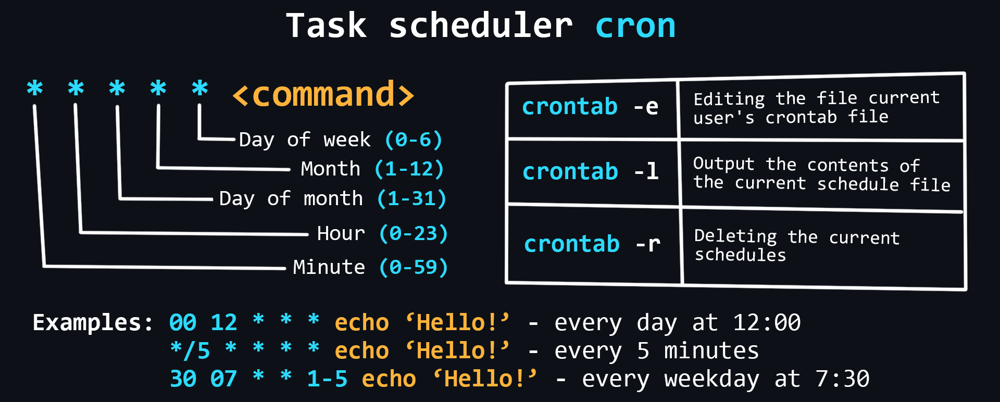</p>

    Schedulers allow you to flexibly manage the delayed running of commands and scripts. Linux has a built-in [cron](https://en.wikipedia.org/wiki/Cron) scheduler that can be used to easily perform necessary actions at certain intervals.

    -   Main commands
        ```bash
        crontab -e # edit the crontab file of the current user
        crontab -l # output the contents of the current schedule file
        crontab -r # deleting the current schedule file
        ```
    -   Files and directories
        ```sh
        /etc/crontab # base config
        /etc/cron.d/ # a dir with crontab files used to manage the entire system

         # dirs where you can store scripts that runs:
        /etc/cron.daily/ # every day
        /etc/cron.weekly/ # every week
        /etc/cron.monthly/ # every month
        ```

<details>
    <summary>🔗 <b>References</b></summary>

1. 📄 [**How to schedule and manage tasks using crontab** – dev.to](https://dev.to/shaikh/how-to-schedule-and-manage-tasks-using-crontab-20dj)
2. 📺 [**Cron Jobs For Beginners | Linux Task Scheduling** – YouTube](https://youtu.be/v952m13p-b4)
3. 📄 [**How to Check Crontab logs on Linux**](https://linuxhandbook.com/check-crontab-logs/)
 </details>

<div align="right"><a href="#top">Contents ⬆️</a></div>

-   ### System logs

    [Log files](https://en.wikipedia.org/wiki/Logging_(computing)) are special text files that contain all information about the operation of a computer, program, or user. They are especially useful when bugs and errors occur in the operation of a program or server. It is recommended to periodically review log files, even if nothing suspicious happens.

    -   Main log files
        ```bash
        /var/log/syslog or /var/log/messages # information about the kernel,
        # various services detected, devices, network interfaces, etc.
        /var/log/auth.log or /var/log/secure # user authorization information
        /var/log/faillog # failed login attempts
        /var/log/dmesg # information about device drivers
        /var/log/boot.log # operating system boot information
        /var/log/cron # cron task scheduler report
        ```
    -   [lnav utility](https://lnav.org/)
        > Designed for easy viewing of log files (highlighting, reading different formats, searching, etc.)
    -   Log rotation with [logrotate](https://github.com/logrotate/logrotate)
        > Allows you to configure automatic deletion (cleaning) of log files so as not to clog memory.
    -   [Demon journald](https://manpages.ubuntu.com/manpages/bionic/man1/journalctl.1.html)
        > Collects data from all available sources and stores it in binary format for convenient and dynamic control.

<details>
    <summary>🔗 <b>References</b></summary>

1. 📺 [**Linux Crash Course - Understanding Logging** – YouTube](https://youtu.be/6uP_f_z3CbM)
2. 📺 [**Linux Monitoring and Logging** – YouTube](https://youtu.be/kZ5LhS6fThM)
3. 📄 [**3 ways to watch logs in real time on Linux**](https://linuxhandbook.com/watch-logs-real-time/)
4. 📄 [**Analyzing logs on Linux with journalctl command**](https://linuxhandbook.com/journalctl-command/)
5. 📄 [**Linux File Structure Explained**](https://shubhsharma19.hashnode.dev/linux-file-structure-explained)
 </details>

<div align="right"><a href="#top">Contents ⬆️</a></div>

-   ### Main issues with Linux

    -   Software installation and package management issues
        > - [Unmet dependencies](https://fedingo.com/how-to-resolve-unmet-dependencies-in-ubuntu/) - occurs when package fails to install or update.
        > - [Dependency errors and conflicts](https://ubunlog.com/en/how-to-fix-dependency-errors-in-ubuntu-and-derivatives/)
    -   [Problems with drivers](https://askubuntu.com/a/496654)
        > All free Linux drivers are built right into its kernel. Therefore, everything should work "out of the box" after installing the system (problems may occur with brand new hardware which has just been released on the market). Drivers whose source code is closed are considered proprietary and are not included in the kernel but are installed manually (like Nvidia graphics drivers).
    -   File system issues
        > - Check disk space availability using the `df` command and ensure that critical partitions are not full.
        > - Use the `fsck` command to check and repair [file system inconsistencies](https://www3.rocketsoftware.com/rocketd3/support/documentation/d3nt/91/refman/index.htm#definitions/file_inconsistency.htm).
        > - In case of data loss or accidental deletion, use data recovery tools like [`extundelete`](https://extundelete.sourceforge.net/) or [`testdisk`](https://github.com/cgsecurity/testdisk).
    -   Performance and resource management
        > - Check system resource usage, including CPU, memory, and disk space, using `free`, `df`, or `du` commands.
        > - Identify resource-intensive processes using tools like `top`, `htop`, or `systemd-cgtop`.
        > - Disable unnecessary [startup services](https://askubuntu.com/questions/48321/how-do-i-start-applications-automatically-on-login) or [background processes](https://askubuntu.com/questions/636129/how-can-i-see-background-process-in-ubuntu-and-kill-unnecessary-processes) to improve performance.
    -   Network connectivity issues
        > - Use the ping command to check network connectivity to a specific host or IP address.
        > - Check the [network settings](https://ubuntu.com/server/docs/network-configuration), such as IP configuration, [DNS settings](https://unix.stackexchange.com/questions/494324/how-to-setup-dns-manually-on-linux), and [firewall rules](https://www.redhat.com/sysadmin/firewalld-linux-firewall).
    -   Problems with kernel
        > [Kernel panic](https://en.wikipedia.org/wiki/Kernel_panic) - can occur due to an error when mounting the root file system.
        > This is best helped by the skill of reading the logs to find problems (`dmesg` command).

<details>
    <summary>🔗 <b>References</b></summary>

1. 📺 [**Linux Drivers Explained** – YouTube](https://youtu.be/s8t0AWmHvUM)
2. 📺 [**How Do Linux Kernel Drivers Work?** – YouTube](https://youtu.be/juGNPLdjLH4)
 </details>

<div align="right"><a href="#top">Contents ⬆️</a></div>

## General knowledge

-   ### Numeral systems

    [Numeral system](https://en.wikipedia.org/wiki/Numeral_system) is a set of symbols and rules for denoting numbers. In computer science, it is customary to distinguish four main number systems: binary, octal, decimal, and hexadecimal. It is connected, first of all, with their use in various branches of programming.

    -   [Binary number](https://en.wikipedia.org/wiki/Binary_number)
        > The most important system for computing technology. Its use is justified by the fact that the logic of the processor is based on only two states (on/off, open/closed, high/low, true/false, yes/no, high/low).

    <p align="center"></p>

    -   [Octal](https://en.wikipedia.org/wiki/Octal)
        > It is used e.g., on Linux systems to grant access rights.

    <p align="center"></p>

    -   [Decimal](https://en.wikipedia.org/wiki/Decimal)
        > A system that is easy to understand for most people.
    -   [Hexadecimal](https://en.wikipedia.org/wiki/Hexadecimal)
        > The letters A, B, C, D, E, F are additionally used for recording. It is widely used in low-level programming and computer documentation because the minimum addressable memory unit is an 8-bit byte, the values of which are conveniently written in two hexadecimal digits.

    <p align="center"></p>

    -   Translation between different number systems
        > You can try [online converter](https://cheatsnake.github.io/NSConverter/) for a better understanding.

<details>
    <summary>🔗 <b>References</b></summary>

1. 📺 [**Number Systems Introduction - Decimal, Binary, Octal & Hexadecimal** – YouTube](https://youtu.be/FFDMzbrEXaE)
1. 📄 [**Number System in Maths** – GeeksGorGeeks](https://www.geeksforgeeks.org/number-system-in-maths/)
 </details>

<div align="right"><a href="#top">Contents ⬆️</a></div>

-   ### Logical connective

    [Logical connective](https://en.wikipedia.org/wiki/Logical_connective) are widely used in programming to handle boolean types (true/false or 1/0). The result of a boolean expression is also a value of a boolean type.

    <table>
    <tr><td width=33% valign=top>

    AND
    | a | b | a AND b |
    |---|---|:-------:|
    | 0 | 0 | 0       |
    | 0 | 1 | 0       |
    | 1 | 0 | 0       |
    | 1 | 1 | 1       |

    </td><td width=33% valign=top>

    OR
    | a | b | a OR b |
    |---|---|:-------:|
    | 0 | 0 | 0       |
    | 0 | 1 | 1       |
    | 1 | 0 | 1       |
    | 1 | 1 | 1       |
    </td><td valign=top>

    XOR
    | a | b | a XOR b |
    |---|---|:-------:|
    | 0 | 0 | 0       |
    | 0 | 1 | 1       |
    | 1 | 0 | 1       |
    | 1 | 1 | 0       |
    </td></tr>
    </table>

    -   Basic logical operations
        > They are the basis of other all kinds of operations. <br>
        > There are three in total: [Operation AND (&&, Conjunction)](https://en.wikipedia.org/wiki/Logical_conjunction), [operation OR (||, Disjunction)](https://en.wikipedia.org/wiki/Logical_disjunction), [operation NOT (!, Negation)](https://en.wikipedia.org/wiki/Negation).
    -   Operation [Exclusive OR (XOR, Modulo 2 Addition)](https://en.wikipedia.org/wiki/Exclusive_or)
        > An important operation that is fundamental to coding theory and computer networks.
    -   [Truth Tables](https://en.wikipedia.org/wiki/Truth_table)
        > For logical operations, there are special tables that describe the input data and the return result.
    -   Priority of operations
        > The `NOT` operator has the highest priority, followed by the `AND` operator, and then the `OR` operator. You can change this behavior using round brackets.

<details>
    <summary>🔗 <b>References</b></summary>

1. 📺 [**Logical Operators − Negation, Conjunction & Disjunction** – YouTube](https://youtu.be/6kYngPvoGxU)
2. 📺 [**Logical Operators − Exclusive OR** – YouTube](https://youtu.be/m2mf6I3g2-c)
 </details>

<div align="right"><a href="#top">Contents ⬆️</a></div>

-   ### Data structures

    [Data structures](https://en.wikipedia.org/wiki/Data_structure) are containers in which data is stored according to certain rules. Depending on these rules, the data structure will be effective in some tasks and ineffective in others. Therefore, it is necessary to understand when and where to use this or that structure.

    -   [Array](<https://en.wikipedia.org/wiki/Array_(data_structure)>)
        > A data structure that allows you to store data of the same type, where each element is assigned a different sequence number.

    <p align="center">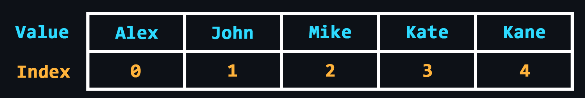</p>

    -   [Linked list](https://en.wikipedia.org/wiki/Linked_list)
        > A data structure where all elements, in addition to the data, contain references to the next and/or previous element. There are 3 varieties:
        >
        > -   A [singly linked list](https://en.wikipedia.org/wiki/Linked_list#Singly_linked_list) is a list where each element stores a link to the next element only (one direction).
        > -   A [doubly linked list](https://en.wikipedia.org/wiki/Doubly_linked_list) is a list where the items contain links to both the next item and the previous one (two directions).
        > -   A [circular linked list](https://en.wikipedia.org/wiki/Linked_list#Circular_linked_list) is a kind of bilaterally linked list, where the last element of the ring list contains a pointer to the first and the first to the last.

    <p align="center"></p>

    -   [Stack](<https://en.wikipedia.org/wiki/Stack_(abstract_data_type)>)
        > Structure where data storage works on the principle of _last in - first out_ (LIFO).

    <p align="center">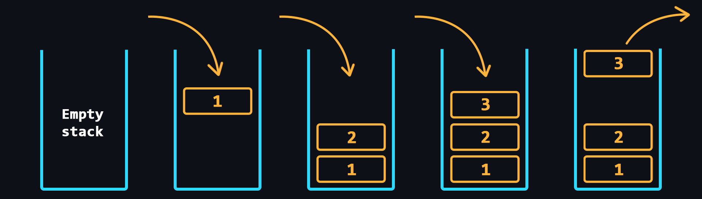</p>

    -   [Queue](<https://en.wikipedia.org/wiki/Queue_(abstract_data_type)>)
        > Structure where data storage is based on the principle of _first in - first out_ (FIFO).

    <p align="center"></p>

    -   [Hash table](https://en.wikipedia.org/wiki/Hash_table)
        > In other words, it is an associative array. Here, each of the elements is accessed with a corresponding key value, which is calculated using [hash function](https://en.wikipedia.org/wiki/Hash_function) according to a certain algorithm.

    <p align="center">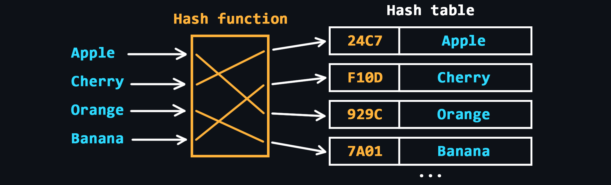</p>

    -   [Tree](<https://en.wikipedia.org/wiki/Tree_(data_structure)>)
        > Structure with a hierarchical model, as a set of related elements, usually not ordered in any way.

    <p align="center"></p>

    -   [Heap](<https://en.wikipedia.org/wiki/Heap_(data_structure)>)
        > Similar to the tree, but in the heap, the items with the largest key is the root node (max-heap). But it may be the other way around, then it is a min heap.

    <p align="center"></p>

    -   [Graph](<https://en.wikipedia.org/wiki/Graph_(discrete_mathematics)>)
        > A structure that is designed to work with a large number of links.

    <p align="center">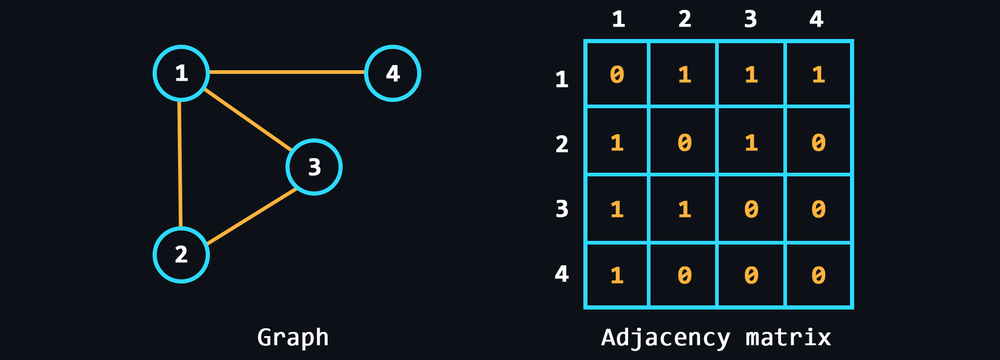</p>

<details>
    <summary>🔗 <b>References</b></summary>

1. 📺 [**10 Key Data Structures We Use Every Day** – YouTube](https://youtu.be/ouipSd_5ivQ)
2. 📺 [**CS50 2022 - Lecture about Data Structures** – YouTube](https://youtu.be/X8h4dq9Hzq8)
3. 📺 [**Data Structures Easy to Advanced Course** – YouTube](https://youtu.be/RBSGKlAvoiM)
4. 📄 [**Free courses to learn data structures and algorithms in depth** – freeCodeCamp](https://www.freecodecamp.org/news/these-are-the-best-free-courses-to-learn-data-structures-and-algorithms-in-depth-4d52f0d6b35a/)
5. 📄 [**Data Structures: collection of topics** – GeeksForGeeks](https://www.geeksforgeeks.org/data-structures/)
6. 📄 [**JavaScript Data Structures and Algorithms** – GitHub](https://github.com/trekhleb/javascript-algorithms)
7. 📄 [**Go Data Structures** – GitHub](https://github.com/emirpasic/gods)
 </details>

<div align="right"><a href="#top">Contents ⬆️</a></div>

-   ### Basic algorithms

    [Algorithms](https://de.wikipedia.org/wiki/Algorithmus) refer to sets of sequential instructions (steps) that lead to the solution of a given problem. Throughout human history, a huge number of algorithms have been invented to solve certain problems in the most efficient way. Accordingly, the correct choice of algorithms in programming will allow you to create the fastest and most resource-intensive solutions.

    > There is a very good book about algorithms for beginners – [Grokking algorithms](https://edu.anarcho-copy.org/Algorithm/grokking-algorithms-illustrated-programmers-curious.pdf). You can start [learning a programming language](#programming-language) in parallel with reading it.

    -   [Binary search](https://en.wikipedia.org/wiki/Binary_search_algorithm)
        > Maximum efficient search algorithm for sorted lists.
    -   [Selection sort](https://en.wikipedia.org/wiki/Selection_sort)
        > At each step of the algorithm, the minimum element is searched for and then swapped with the current iteration element.
    -   [Recursion](https://en.wikipedia.org/wiki/Recursion)
        > When a function can call itself and so on to infinity. On the one hand, recursion-based solutions look very elegant, but on the other hand, this approach quickly leads to Stack Overflow and is recommended to be avoided.
    -   [Bubble sort](https://en.wikipedia.org/wiki/Bubble_sort)
        > At each iteration neighboring elements are sequentially compared, and if the order of the pair is wrong, the elements are swapped.
    -   [Quicksort](https://en.wikipedia.org/wiki/Quicksort)
        > Improved bubble sorting method.
    -   [Breadth-first search](https://en.wikipedia.org/wiki/Breadth-first_search)
        > Allows finding all shortest paths from a given vertex of the graph.
    -   [Dijkstra's algorithm](https://en.wikipedia.org/wiki/Dijkstra%27s_algorithm)
        > Finds the shortest paths between all vertices of a graph and their length.
    -   [Greedy algorithm](https://en.wikipedia.org/wiki/Greedy_algorithm)
        > An algorithm that at each step makes locally the best choice in the hope that the final solution will be optimal.

<details>
    <summary>🔗 <b>References</b></summary>

1. 📄 [**Code for the book Grokking Algorithms** – GitHub](https://github.com/egonSchiele/grokking_algorithms)
2. 📺 [**Algorithms and Data Structures Tutorial** – YouTube](https://youtu.be/8hly31xKli0)
3. 📄 [**Largest open-source algorithm library**](https://the-algorithms.com/)
4. 📺 [**Sorting Algorithms Explained Visually** – YouTube](https://youtu.be/RfXt_qHDEPw)
 </details>

<div align="right"><a href="#top">Contents ⬆️</a></div>

-   ### Algorithm complexity

    <p align="center">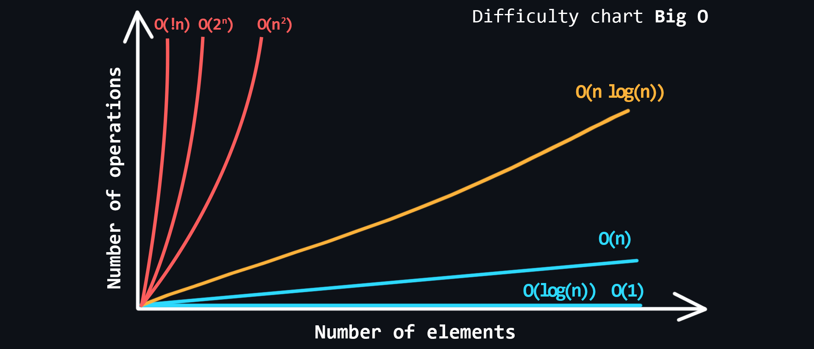</p>

    In the world of programming there is a special unit of measure [Big O notation](https://en.m.wikipedia.org/wiki/Big_O_notation). It describes how the complexity of an algorithm increases with the amount of input data. Big O estimates how many actions (steps/iterations) it takes to execute the algorithm, while always showing the worst case scenario.

    -   Main types of complexity
        > -   Constant O(1) – the fastest. <br>
        > -   Linear O(n) <br>
        > -   Logarithmic O(log n) <br>
        > -   Linearimetric O(n \* log n) <br>
        > -   Quadratic O(n^2) <br>
        > -   Stepwise O(2^n) <br>
        > -   Factorial O(n!) – the slowest. <br>
    -   [Time complexity](https://en.wikipedia.org/wiki/Time_complexity)
        > When you know in advance on which machine the algorithm will be executed, you can measure the execution time of the algorithm. Again, on very good hardware the execution time of the algorithm can be quite acceptable, but the same algorithm on a weaker hardware can run for hundreds of milliseconds or even a few seconds. Such delays will be very sensitive if your application handles user requests over the network.
    -   [Space complexity](https://en.wikipedia.org/wiki/Space_complexity)
        > In addition to time, you need to consider how much memory is spent on the work of an algorithm. It is important when you're working with limited memory resources.

<details>
    <summary>🔗 <b>References</b></summary>

1. 📄 [**Big O Algorithm Complexity cheatsheet**](https://www.bigocheatsheet.com/)
2. 📺 [**Big O Notation - Full Course** – YouTube](https://youtu.be/Mo4vesaut8g)
 </details>

<div align="right"><a href="#top">Contents ⬆️</a></div>

-   ### Data storage formats

    Different file formats can be used to store and transfer data over the network. Text files are human-readable, so they are used for configuration files, for example. But transferring data in text formats over the network is not always rational, because they weigh more than their corresponding binary files.

    -   Text formats

        -   [JSON (JavaScript Object Notation)](https://en.wikipedia.org/wiki/JSON)
            > Represents an object in which data is stored as key-value pairs.
        -   [XML (eXtensible Markup Language)](https://en.wikipedia.org/wiki/XML)
            > The format is closer to HTML. Here the data is wrapped in opening and closing tags.
        -   [YAML (Yet Another Markup Language)](https://en.wikipedia.org/wiki/YAML)
            > The format is close to markup languages like HTML. Minimalist, because it has no opening or closing tags. Easy to edit.
        -   [TOML (Tom's Obvious Minimal Language)](https://en.wikipedia.org/wiki/TOML)
            > A minimal configuration file format that's easy to read due to obvious semantics. TOML is designed to map unambiguously to a hash table. TOML should be easy to parse into data structures in a wide variety of languages.

    -   Binary formats
        -   [Message Pack](https://msgpack.org/)
            > Binary analog of JSON. Allows you to pack data 15-20% more efficiently.
        -   [BSON (Binary JavaScript Object Notation)](https://en.wikipedia.org/wiki/BSON)
            > It is a superset of JSON, including additionally regular expressions, binary data and dates.
        -   [ProtoBuf (Protocol Buffers)](https://en.wikipedia.org/wiki/Protocol_Buffers)
            > Binary alternative to XML text format. Simpler, more compact and faster.

    -   Image formats
        -   [JPEG (Joint Photographic Experts Group)](https://en.wikipedia.org/wiki/JPEG)
            > It is best suited for photographs and complex images with a wide range of colors. JPEG images can achieve high compression ratios while maintaining good image quality, but repeated editing and saving can result in loss of image fidelity.
        -   [PNG (Portable Network Graphics)](https://en.wikipedia.org/wiki/PNG)
            > It is a lossless compression format that supports transparency. It is commonly used for images with sharp edges, logos, icons, and images that require transparency. PNG images can have a higher file size compared to JPEG, but they retain excellent quality without degradation during repeated saves.
        -   [GIF (Graphics Interchange Format)](https://en.wikipedia.org/wiki/GIF)
            > Used for simple animations and low-resolution images with limited colors. It supports transparency and can be animated by displaying a sequence of frames.
        -   [SVG (Scalable Vector Graphics)](https://en.wikipedia.org/wiki/SVG)
            > XML-based vector image format defined by mathematical equations rather than pixels. SVG images can be scaled to any size without losing quality and are well-suited for logos, icons, and graphical elements.
        -   [WebP](https://en.wikipedia.org/wiki/WebP)
            > Modern image format developed by Google. It supports both lossy and lossless compression, providing good image quality with smaller file sizes compared to JPEG and PNG. WebP images are optimized for web use and can include transparency and animation.

    -   Video formats
        -   [MP4 (MPEG-4 Part 14)](https://en.wikipedia.org/wiki/MP4_file_format)
            > Widely used video format that supports high-quality video compression, making it suitable for streaming and storing videos. MP4 files can contain both video and audio.
        -   [AVI (Audio Video Interleave)](https://en.wikipedia.org/wiki/Audio_Video_Interleave)
            > Is a multimedia container format developed by Microsoft. It can store audio and video data in a single file, allowing for synchronized playback. However, they tend to have larger file sizes compared to more modern formats.
        -   [MOV (QuickTime Movie)](https://www.adobe.com/creativecloud/video/hub/guides/what-is-an-mov-video.html)
            > Is a video format developed by Apple for use with their QuickTime media player. It is widely used with Mac and iOS devices. MOV files can contain both video and audio, and they offer good compression and quality, making them suitable for editing and professional use.
        -   [WEBM](https://en.wikipedia.org/wiki/WebM)
            > Best for videos embedded on your personal or business website. It is lightweight, load quickly and stream easily.

    -   Audio formats
        -   [MP3 (MPEG-1 Audio Layer 3)](https://en.wikipedia.org/wiki/MP3)
            > The most popular audio format known for its high compression and small file sizes. It achieves this by removing some of the audio data that may be less perceptible to the human ear. Suitable for music storage, streaming, and sharing.
        -   [WAV (Waveform Audio File Format)](https://en.wikipedia.org/wiki/WAV)
            > Is an uncompressed audio format that stores audio data in a lossless manner, resulting in high-quality sound reproduction. WAV files are commonly used in professional audio production and editing due to their accuracy and fidelity. However, they tend to have larger file sizes compared to compressed formats.
        -   [AAC (Advanced Audio Coding)](https://en.wikipedia.org/wiki/Advanced_Audio_Coding)
            > Is a widely used audio format known for its efficient compression and good sound quality. It offers better sound reproduction at lower bit rates compared to MP3. AAC files are commonly used for streaming music, online radio, and mobile devices, as they deliver good audio quality while conserving bandwidth and storage.

<details>
    <summary>🔗 <b>References</b></summary>

1. 📺 [**Data Formats: XML, JSON, and YAML** – YouTube](https://youtu.be/JQO-x8rzNVI)
2. 📺 [**Serialization formats: JSON and Protobuf** – YouTube](https://youtu.be/uGYZn6xk-hA)
3. 📺 [**Protocol Buffers Crash Course** – YouTube](https://youtu.be/46O73On0gyI)
4. 📺 [**Explaining Image File Formats** – YouTube](https://youtu.be/WblPwVq9KnU)
5. 📺 [**What's the difference between a JPEG, PNG, GIF, etc…?** – YouTube](https://youtu.be/ww12lImOJ38)
 </details>

<div align="right"><a href="#top">Contents ⬆️</a></div>

-   ### Text encodings

    Computers work only with numbers, or more precisely, only with 0 and 1. It is already clear how to convert numbers from different number systems to binary. But you can't do that with text. That's why special tables called [encodings](https://en.wikipedia.org/wiki/Character_encoding) were invented, in which text characters are assigned numeric equivalents.

    -   [ASCII (American standard code for information interchange)](https://en.wikipedia.org/wiki/ASCII)
        > The simplest encoding created specifically for the American alphabet. Consists of 128 characters.
    -   [Unicode](https://en.wikipedia.org/wiki/Unicode)
        > This is an international character table that, in addition to the English alphabet, contains the alphabets of almost all countries. It can hold more than a million different characters (the table is currently incomplete).
    -   [UTF-8 (Unicode Transformation Format)](https://en.wikipedia.org/wiki/UTF-8)
        > UTF-8 is a variable-length encoding that can be used to represent any Unicode character.
    -   [UTF-16](https://en.wikipedia.org/wiki/UTF-16)
        > Its main difference from UTF-8 is that its structural unit is not one but two bytes. That is, in UTF-16 any Unicode character can be encoded by either two or four bytes.

<details>
    <summary>🔗 <b>References</b></summary>

1. 📺 [**Unicode, in friendly terms: ASCII, UTF-8 and more** – YouTube](https://youtu.be/ut74oHojxqo)
2. 📄 [**Understanding the ASCII Table**](https://linuxhandbook.com/ascii-table/)
3. 📺 [**Unicode Encoding! UTF-32, UCS-2, UTF-16, & UTF-8!** – YouTube](https://youtu.be/uTJoJtNYcaQ)
</details>

<div align="right"><a href="#top">Contents ⬆️</a></div>

## Programming Language

At this stage you have to choose one programming language to study. There is plenty of information on various languages in the Internet (books, courses, thematic sites, etc.), so you should have no problem finding information.

> Below is a list of specific languages that [personally, in my opinion](https://github.com/cheatsnake) are good for backend development (⚠️ may not agree with the opinions of others, including those more competent in this matter).

-   [Python](<https://en.wikipedia.org/wiki/Python_(programming_language)>)
    > A very popular language with a wide range of applications. Easy to learn due to its simple syntax.
-   [JavaScript](https://en.wikipedia.org/wiki/JavaScript)
    > No less popular and practically the only language for full-fledged Web-development. Thanks to the platform [Node.js](https://en.wikipedia.org/wiki/Node.js) last few years is gaining popularity in the field of backend development as well.
-   [Go](<https://en.wikipedia.org/wiki/Go_(programming_language)>)
    > A language created internally by Google. It was created specifically for high-load server development. Minimalist syntax, high performance and rich standard library.
-   [Kotlin](<https://en.wikipedia.org/wiki/Kotlin_(programming_language)>)
    > A kind of modern version of [Java](<https://en.wikipedia.org/wiki/Java_(programming_language)>). Simpler and more concise syntax, better type-safety, built-in tools for multi-threading. One of the best choices for Android development.

Find a good book or online tutorial in English at [this repository](https://github.com/EbookFoundation/free-programming-books/blob/main/books/free-programming-books-langs.md). There is a large collection for different languages and frameworks.

Look for a special [awesome repository](https://github.com/sindresorhus/awesome#programming-languages) - a resource that contains a huge number of useful links to materials for your language (libraries, cheat sheets, blogs, and other various resources).

<div align="right"><a href="#top">Contents ⬆️</a></div>

-   ### Classification of programming languages

    There are many programming languages. They are all created for a reason. Some languages may be very specific and used only for certain purposes. Also, different languages may use different approaches to writing programs. They may even run differently on a computer. In general, there are many different [classifications](https://en.wikipedia.org/wiki/Category:Programming_language_classification), which would be useful to understand.

    -   Depending on language level
        -   [Low level languages](https://en.wikipedia.org/wiki/Low-level_programming_language)
            > As close to [machine code](https://en.wikipedia.org/wiki/Machine_code), complex to write, but as productive as possible. As a rule, it provides access to all of the computer's resources.
        -   [High-level languages](https://en.wikipedia.org/wiki/High-level_programming_language)
            > They have a fairly high level of abstraction, which makes them easy to write and easy to use. As a rule, they are safer because they do not provide access to all of the computer's resources.
    -   Depending on [implementation](https://en.wikipedia.org/wiki/Programming_language_implementation)
        -   [Compilation](https://en.wikipedia.org/wiki/Compiler)
            > Allows you to convert the source code of a program to an executable file.
        -   [Interpretation](<https://en.wikipedia.org/wiki/Interpreter_(computing)>)
            > The source code of a program is translated and immediately executed (interpreted) by a special interpreter program.
        -   [Virtual machine](https://en.wikipedia.org/wiki/Virtual_machine)
            > In this approach, the program is not compiled into a machine code, but into machine-independent low-level code - [bytecode](https://en.wikipedia.org/wiki/Bytecode). This bytecode is then executed by the virtual machine itself.
    -   [Depending on the programming paradigm](https://en.wikipedia.org/wiki/Programming_paradigm)
        -   [Imperative](https://en.wikipedia.org/wiki/Imperative_programming)
            > Focuses on describing the steps to solve a problem through a sequence of statements or commands.
        -   [Declarative](https://en.wikipedia.org/wiki/Declarative_programming)
            > Focuses on describing what the program should do, rather than how it should do it. Examples of declarative languages include SQL and HTML.
        -   [Functional](https://en.wikipedia.org/wiki/Functional_programming)
            > Based on the idea of treating computation as the evaluation of mathematical functions. It emphasizes [immutability](https://en.wikipedia.org/wiki/Immutable_object), avoiding [side effects](https://en.wikipedia.org/wiki/Side_effect_(computer_science)), and using [higher-order functions](https://en.wikipedia.org/wiki/Higher-order_function). Examples of functional languages include Haskell, Lisp, and Clojure.
        -   [Object-Oriented](https://en.wikipedia.org/wiki/Object-oriented_programming)
            > Revolves around creating objects that contain both data and behavior, with the goal of modeling real-world concepts. Examples of object-oriented languages include Java, Python, and C++.
        -   [Concurrent](https://en.wikipedia.org/wiki/Concurrent_computing)
            > Focused on handling multiple tasks or threads at the same time, and is used in systems that require high performance and responsiveness. Examples of concurrent languages include Go and Erlang.

<details>
    <summary>🔗 <b>References</b></summary>

1. 📄 [**Classifying Programming Languages**](https://cs.lmu.edu/~ray/notes/pltypes/)
2. 📺 [**What are the Types of Programming Languages?** – YouTube](https://youtu.be/Mo4vesaut8g)
3. 📺 [**Functional Programming in 40 Minutes** – YouTube](https://youtu.be/0if71HOyVjY)
4. 📺 [**The Art of Functional Programming** – YouTube](https://youtu.be/pNIWiTdsPV4)
 </details>

<div align="right"><a href="#top">Contents ⬆️</a></div>

-   ### Language Basics

    By foundations are meant some fundamental ideas present in every language.

    -   Variables and constants
        > Are names assigned to a memory location in the program to store some data.
    -   Data types
        > Define the type of data that can be stored in a variable. The main data types are integers, floating point numbers, symbols, strings, and boolean.
    -   Operators
        > Used to perform operations on variables or values. Common operators include arithmetic operators, comparison operators, logical operators, and assignment operators.
    -   Flow control
        > Loops, conditions `if else`, `switch case` statements.
    -   Functions
        > Are blocks of code that can be called multiple times in a program. They allow for code reusability and modularization. Functions are an important concept for understanding the scope of variables.
    -   Data structures
        > Special containers in which data are stored according to certain rules. Main data structures are arrays, maps, trees, graphs.
    -   Standard library
        > This refers to the language's built-in features for manipulating data structures, working with the file system, network, cryptography, etc.
    -   Error handling
        > Used to handle unexpected events that can occur during program execution.
    -   [Regular expressions](https://github.com/cheatsnake/regex-by-example)
        > A powerful tool for working with strings. Be sure to familiarize yourself with it in your language, at least on a basic level.
    -   Modules
        > Writing the code of the whole program in one file is not at all convenient. It is much more readable to break it up into smaller modules and import them into the right places.
    -   Package Manager
        > Sooner or later, there will be a desire to use third-party libraries.

    After mastering the minimal base for writing the simplest programs, there is not much point in continuing to learn without having specific goals (without practice, everything will be forgotten). You need to think of/find something that you would like to create yourself (a game, a chatbot, a website, a mobile/desktop application, whatever). For inspiration, check out these repositories: [Build your own x](https://github.com/codecrafters-io/build-your-own-x) and [Project based learning](https://github.com/practical-tutorials/project-based-learning).

    At this point, the most productive part of learning begins: You just look for all kinds of information to implement your project. Your best friends are Google, YouTube, and Stack Overflow.

<details>
    <summary>🔗 <b>References</b></summary>

1. 📺 [**CS50 2022 – Harvard University's course about programming** – YouTube](https://youtube.com/playlist?list=PLeLzIg9tqA3LQW-RiFA8zJUBcTKqUVLMU)
2. 📺 [**Harvard CS50’s Web Programming with Python and JavaScript** – YouTube](https://youtu.be/vzGllw18DkA)
3. 📄 [**Free Interactive Python Tutorial**](https://www.learnpython.org/)
4. 📺 [**Harvard CS50’s Introduction to Programming with Python** – YouTube](https://youtu.be/nLRL_NcnK-4)
5. 📺 [**Python Tutorial for Beginners** – YouTube](https://youtu.be/8124kv-632k)
6. 📄 [**Python cheatsheet** – Learn X in Y minutes](https://learnxinyminutes.com/docs/python/)
7. 📄 [**Python cheatsheet** – quickref.me](https://quickref.me/python)
8. 📄 [**Free Interactive JavaScript Tutorial**](https://www.learn-js.org/)
9. 📺 [**JavaScript Programming - Full Course** – YouTube](https://youtu.be/jS4aFq5-91M)
10. 📄 [**The Modern JavaScript Tutorial**](https://javascript.info/)
11. 📄 [**JavaScript cheatsheet** – Learn X in Y minutes](https://learnxinyminutes.com/docs/javascript/)
12. 📄 [**JavaScript cheatsheet** – quickref.me](https://quickref.me/javascript)
13. 📄 [**Go Tour – learn most important features of the language**](https://go.dev/tour/list)
14. 📺 [**Learn Go Programming - Go Tutorial for Beginners** – YouTube](https://youtu.be/YS4e4q9oBaU)
15. 📄 [**Go cheatsheet** – Learn X in Y minutes](https://learnxinyminutes.com/docs/go/)
16. 📄 [**Go cheatsheet** – quickref.me](https://quickref.me/golang)
17. 📄 [**Learn Go by Examples**](https://golangbyexample.com/)
18. 📄 [**Get started with Kotlin**](https://kotlinlang.org/docs/getting-started.html)
19. 📺 [**Learn Kotlin Programming – Full Course for Beginners** – YouTube](https://youtu.be/EExSSotojVI)
20. 📄 [**Kotlin cheatsheet** – Learn X in Y minutes](https://learnxinyminutes.com/docs/kotlin/)
21. 📄 [**Kotlin cheatsheet** – devhints.io](https://devhints.io/kotlin)
22. 📄 [**Learn Regex step by step, from zero to advanced**](https://regexlearn.com)
23. 📄 [**Projectbook – The Great Big List of Software Project Ideas**](https://projectbook.code.brettchalupa.com/)
</details>

<div align="right"><a href="#top">Contents ⬆️</a></div>

-   ### Object-oriented programming

    [OOP](https://en.wikipedia.org/wiki/Object-oriented_programming) is one of the most successful and convenient approaches for modeling real-world things. This approach combines several very important principles which allow writing modular, extensible, and loosely coupled code.

    -   Understanding [Classes](<https://en.wikipedia.org/wiki/Class_(computer_programming)>)
        > A class can be understood as a custom data type (a kind of template) in which you describe the structure of future objects that will implement the class. Classes can contain `properties` (these are specific fields in which data of a particular data type can be stored) and `methods` (these are functions that have access to properties and the ability to manipulate, modify them).
    -   Understanding [objects](<https://en.wikipedia.org/wiki/Object_(computer_science)>)
        > An object is a specific implementation of a class. If, for example, the _name_ property with type _string_ is described in a class, the object will have a specific value for that field, for example _"Alex"_.
    -   [Inheritance principle](<https://en.wikipedia.org/wiki/Inheritance_(object-oriented_programming)>)
        > Ability to create new classes that inherit properties and methods of their parents. This allows you to reuse code and create a hierarchy of classes.
    -   [Encapsulation principle](<https://en.wikipedia.org/wiki/Encapsulation_(computer_programming)>)
        > Ability to hide certain properties/methods from external access, leaving only a simplified interface for interacting with the object.
    -   [Polymorphism principle](<https://en.wikipedia.org/wiki/Polymorphism_(computer_science)>)
        > The ability to implement the same method differently in descendant classes.
    -   [Composition](https://en.wikipedia.org/wiki/Composition_over_inheritance) over inheritance
        > Often the principle of `inheritance` can complicate and confuse your program if you do not think carefully about how to build the future hierarchy. That is why there is an alternative (more flexible) approach called composition. In particular, Go language lacks classes and many OOP principles, but widely [uses composition](https://golangbyexample.com/oop-inheritance-golang-complete).
    -   [Dependency injection (DI)](https://en.wikipedia.org/wiki/Dependency_injection)
        > Dependency injection is a popular OOP pattern that allows objects to receive their dependencies (other objects) from the outside rather than creating them internally. It promotes loose coupling between classes, making code more modular, maintainable, and easier to test.

<details>
    <summary>🔗 <b>References</b></summary>

1. 📺 [**Intro to Object Oriented Programming - Crash Course** – YouTube](https://youtu.be/SiBw7os-_zI)
2. 📄 [**OOP Meaning – What is Object-Oriented Programming?** – freeCodeCamp](https://www.freecodecamp.org/news/what-is-object-oriented-programming/)
3. 📺 [**OOP in Python (CS50 lecture)** – YouTube](https://youtu.be/SiBw7os-_zI)
4. 📄 [**OOP tutorial from Python docs**](https://docs.python.org/3/tutorial/classes.html)
5. 📺 [**OOP in JavaScript: Made Super Simple** – YouTube](https://youtu.be/PFmuCDHHpwk)
6. 📄 [**OOP in Go by examples**](https://golangbyexample.com/golang-comprehensive-tutorial/#OOPS_in_Golang)
7. 📺 [**Object Oriented Programming is not what I thought - Talk by Anjana Vakil** – YouTube](https://youtu.be/TbP2B1ijWr8)
8. 📺 [**The Flaws of Inheritance (tradeoffs between Inheritance and Composition)** – YouTube](https://youtu.be/hxGOiiR9ZKg)
9. 📺 [**Dependency Injection, The Best Pattern** – YouTube](https://youtu.be/J1f5b4vcxCQ?si=9kgJNwZgMFd7r7fX)
 </details>

<div align="right"><a href="#top">Contents ⬆️</a></div>

-   ### Server development

    -   Understand sockets
        > A socket is an endpoint of a two-way communication link between two programs running over a network. You need to know how to create, connect, send, and receive data over sockets.
    -   Running a local TCP, UDP and HTTP servers
        > These protocols are the most important, you need to understand the intricacies of working with each of them.
    -   Handing out static files
        > You need to know how to host HTML pages, pictures, PDF documents, music/video files, etc.
    -   Routing
        > Creation of endpoints (URLs) which will call the appropriate handler on the server when accessed.
    -   Processing requests
        > As a rule, HTTP handlers have a special object which receives all information about user request (headers, method, request body, query parameters and so on)
    -   Processing responses
        > Sending an appropriate message to a received request (HTTP status and code, response body, headers, etc.)
    -   Error handling
        > You should always be prepared for the possibility that something will go wrong: the user will send incorrect data, the database will not perform the operation, or an unexpected error will simply occur in the application. It is necessary for the server not to crash, but to send a response with information about the error.
    -   [Middleware](https://www.ibm.com/topics/middleware)
        > An intermediate component between the application and the server. It used for handling authentication, validation, caching data, logging requests, and so on.
    -   Sending requests
        > Often, within one application, you will need to access another application over the network. That's why it's important to be able to send HTTP requests using the built-in features of the language.
    -   [Template processor](https://en.wikipedia.org/wiki/Template_processor)
        > Is a special module that uses a more convenient syntax to generate HTML based on dynamic data.

<details>
    <summary>🔗 <b>References</b></summary>

1. 📄 [**Learn Django – Python-based web framework**](https://www.djangoproject.com/start/)
2. 📺 [**Python Django 7 Hour Course** – YouTube](https://youtu.be/PtQiiknWUcI)
3. 📄 [**A curated list of awesome things related to Django** – GitHub](https://github.com/wsvincent/awesome-django)
4. 📺 [**Python Web Scraping for Beginners** – YouTube](https://youtu.be/mBoX_JCKZTE)
5. 📺 [**Build servers in pure Node.js** – YouTube](https://youtu.be/_1xa8Bsho6A)
6. 📄 [**Node.js HTTP Server Examples – GitHub**](https://github.com/HowProgrammingWorks/NodeServer)
7. 📄 [**Learn Express – web framework for Node.js**](https://developer.mozilla.org/en-US/docs/Learn/Server-side/Express_Nodejs)
8. 📺 [**Express.js 2022 Course** – YouTube](https://youtube.com/playlist?list=PL_cUvD4qzbkwp6pxx27pqgohrsP8v1Wj2)
9. 📄 [**A curated list of awesome Express.js resources** – GitHub](https://github.com/rajikaimal/awesome-express)
10. 📄 [**How to build servers in Go**](https://eli.thegreenplace.net/2021/rest-servers-in-go-part-1-standard-library/)
11. 📺 [**Golang server development course** – YouTube](https://youtube.com/playlist?list=PLzUGFf4GhXBL4GHXVcMMvzgtO8-WEJIoY)
12. 📄 [**Web services in Go** – GitBook](https://astaxie.gitbooks.io/build-web-application-with-golang/content/en/08.0.html)
13. 📄 [**List of libraries for working with network in Go** – GitHub](https://github.com/avelino/awesome-go#networking)
14. 📄 [**Learn Ktor – web framework for Kotlin**](https://ktor.io/learn/)
15. 📺 [**Ktor - REST API Tutorials** – YouTube](https://youtube.com/playlist?list=PLFmuMD2V4CkyR0Pa42Cqu5mIhH17uG8nN)
16. 📄 [**Kotlin for server side**](https://kotlinlang.org/docs/server-overview.html)
</details>

<div align="right"><a href="#top">Contents ⬆️</a></div>

-   ### Asynchronous programming

    [Asynchronous programming](https://en.wikipedia.org/wiki/Asynchrony_(computer_programming)) is an efficient way to write programs with a large number of [I/O (input/output) operations](https://en.wikipedia.org/wiki/Input/output). Such operations may include reading files, requesting to a database or remote server, reading user input, and so on. In these cases, the program spends a lot of time waiting for external resources to respond, and asynchronous programming allows the program to perform other tasks while waiting for the response.

    -   [Callback](https://en.wikipedia.org/wiki/Callback_(computer_programming))
        > This is function that is passed as an argument to another function and is intended to be called by that function at a later time. The purpose of a callback is to allow the calling function to continue executing while the called function performs a time-consuming or asynchronous task. Once the task is complete, the called function will invoke the callback function, passing it any necessary data as arguments.
    -   [Event-driven architecture (EDA)](https://en.wikipedia.org/wiki/Event-driven_architecture)
        > A popular approach to writing asynchronous programs. The logic of the program is to wait for certain events and process them as they arrive. This can be useful in web applications that need to handle a large number of concurrent connections, such as chat applications or real-time games.
    -   Asynchronous in particular languages
        > - In Python, asynchronous programming can be done using the [asyncio module](https://docs.python.org/3/library/asyncio.html), which provides an event loop and coroutine-based API for concurrency. There are also other third-party libraries like [Twisted](https://github.com/twisted/twisted) and [Tornado](https://github.com/tornadoweb/tornado) that provide asynchronous capabilities.
        > - In JavaScript, asynchronous programming is commonly achieved through the use of [promises](https://javascript.info/promise-basics), [callbacks](https://javascript.info/callbacks), [async/await syntax](https://javascript.info/async-await) and the [event loop](https://javascript.info/event-loop).
        > - Go has built-in support for concurrency through [goroutines and channels](https://go.dev/tour/concurrency/1), which allow developers to write asynchronous code that can communicate and synchronize across multiple threads.
        > - Kotlin provides [coroutines](https://kotlinlang.org/docs/coroutines-overview.html) are similar to JavaScript's async/await and Python's asyncio, and can be used with a variety of platforms and frameworks.

<details>
    <summary>🔗 <b>References</b></summary>

1. 📺 [**Synchronous vs. Asynchronous Applications (Explained by Example)** – YouTube](https://youtu.be/N5Ky-mz6n-8)
2. 📄 [**Async IO in Python: A Complete Walkthrough**](https://realpython.com/async-io-python/)
3. 📄 [**Asynchronous Programming in JavaScript – Guide for Beginners** – freeCodeCamp](https://www.freecodecamp.org/news/asynchronous-programming-in-javascript/)
4. 📄 [**A roadmap for asynchronous programming in JavaScript**](https://exploringjs.com/impatient-js/ch_async-js.html#roadmap-async-functions)
5. 📺 [**Master Go Programming With These Concurrency Patterns** – YouTube](https://youtu.be/qyM8Pi1KiiM)
6. 📺 [**Kotlin coroutines: new ways to do asynchronous programming** – YouTube](https://youtu.be/WlGEOu-Ka-E)
 </details>

<div align="right"><a href="#top">Contents ⬆️</a></div>

-   ### Multitasking

    Computers today have processors with several physical and virtual cores, and if we take into account server machines, their number can reach up to hundreds. All of these available resources would be good to use to the fullest, for maximum application performance. That is why modern server development cannot do without implementing [multitasking](https://en.wikipedia.org/wiki/Computer_multitasking) and [paralleling](https://en.wikipedia.org/wiki/Parallel_computing).

    -   How it works
        > Multitasking refers to the concurrent execution of multiple [threads](#processes-and-threads) of control within a single program. A thread is a lightweight process that runs within the context of a [process](#processes-and-threads), and has its own stack, program counter, and register set. Multiple threads can share the resources of a single process, such as memory, files, and I/O devices. Each thread executes independently and can perform a different task or part of a task.
    -   Multitasking types
        > - [Cooperative multitasking](https://en.wikipedia.org/wiki/Cooperative_multitasking): each program or task voluntarily gives up control of the CPU to allow other programs or tasks to run. Each program or task is responsible for yielding control to other programs or tasks at appropriate times. This approach requires programs or tasks to be well-behaved and to avoid monopolizing the CPU. If a program or task does not yield control voluntarily, it can cause the entire system to become unresponsive. Cooperative multitasking was commonly used in early operating systems and is still used in some embedded systems or real-time operating systems.
        > - [Preemptive multitasking](https://en.wikipedia.org/wiki/Preemption_(computing)): operating system forcibly interrupts programs or tasks at regular intervals to allow other programs or tasks to run. The operating system is responsible for managing the CPU and ensuring that each program or task gets a fair share of CPU time. This approach is more robust than cooperative multitasking and can handle poorly behaved programs or tasks that do not yield control. Preemptive multitasking is used in modern operating systems, such as Windows, macOS, Linux, and Android.
    -   Main problems and difficulties
        > - [Race conditions](https://en.wikipedia.org/wiki/Race_condition): When multiple threads access and modify shared data concurrently, race conditions can occur, resulting in unpredictable behavior or incorrect results.
        > - [Deadlocks](https://en.wikipedia.org/wiki/Deadlock): Occur when two or more threads are blocked waiting for resources that are held by other threads, resulting in a deadlock.
        > - Debugging: Multitasking programs can be difficult to debug due to their complexity and non-deterministic behavior. You need to use advanced debugging tools and techniques, such as thread dumps, profilers, and logging, to diagnose and fix issues.
    -   Synchronizing primitives
        > Needed to securely exchange data between different threads.
        > - [Semaphore](https://en.wikipedia.org/wiki/Semaphore_(programming)): It is essentially a counter that keeps track of the number of available resources and can block threads or processes that try to acquire more than the available resources.
        > - [Mutex](https://en.wikipedia.org/wiki/Mutual_exclusion): (short for mutual exclusion) allows only one thread or process to access the resource at a time, ensuring that there are no conflicts or race conditions.
        > - [Atomic operations](https://en.wikipedia.org/wiki/Linearizability): operations that are executed as a single, indivisible unit, without the possibility of interruption or interference by other threads or processes.
        > - [Condition variables](https://en.wikipedia.org/wiki/Monitor_(synchronization)): allows threads to wait for a specific condition to be true before continuing execution. It is often used in conjunction with a mutex to avoid busy waiting and improve efficiency.
    -   Working with particular language
        > - In Python you can see [threading](https://docs.python.org/3/library/threading.html) and [multiprocessing](https://docs.python.org/3/library/multiprocessing.html) modules.
        > - In Node.js you can work with [worker threads](https://nodejs.org/api/worker_threads.html#worker-threads), [cluster module](https://nodejs.org/api/cluster.html#cluster) and [shared array buffers](https://developer.mozilla.org/en-US/docs/Web/JavaScript/Reference/Global_Objects/SharedArrayBuffer).
        > - Go has incredible [goroutines and channels](https://go.dev/tour/concurrency/1).
        > - Kotlin provides [coroutines](https://kotlinlang.org/docs/coroutines-overview.html).

<details>
    <summary>🔗 <b>References</b></summary>

1. 📺 [**Multithreading Code - Computerphile** – YouTube](https://youtu.be/7ENFeb-J75k)
2. 📺 [**Threading vs. multiprocessing in Python** – YouTube](https://youtu.be/AZnGRKFUU0c)
3. 📺 [**When is Node.js Single-Threaded and when is it Multi-Threaded?** – YouTube](https://youtu.be/gMtchRodC2I)
4. 📺 [**How to use Multithreading with "worker threads" in Node.js?** – YouTube](https://youtu.be/MuwJJrfIfsU)
5. 📺 [**Concurrency in Go** – YouTube](https://youtube.com/playlist?list=PLsc-VaxfZl4do3Etp_xQ0aQBoC-x5BIgJ)
6. 📺 [**Kotlin coroutines** – YouTube](https://youtube.com/playlist?list=PLQkwcJG4YTCQcFEPuYGuv54nYai_lwil_)
7. 📄 [**Multithreading in practice** – GitHub](https://github.com/thanhit95/multi-threading)
 </details>

<div align="right"><a href="#top">Contents ⬆️</a></div>

-   ### Advanced Topics

    -   [Garbage collector](<https://en.wikipedia.org/wiki/Garbage_collection_(computer_science)>)
        > A process that has made high-level languages very popular - it allows the programmer not to worry about memory allocation and freeing. Be sure to familiarize yourself with the subtleties of its operation in your own language.
    -   [Debugger](https://en.wikipedia.org/wiki/Debugging)
        > Handy tool for analyzing program code and identifying errors.
    -   [Compilers](https://en.wikipedia.org/wiki/Compiler), [interpreters](https://en.wikipedia.org/wiki/Interpreter_(computing)) and [virtual machines](https://en.wikipedia.org/wiki/Virtual_machine)
        > Depending on what your language uses, you can explore in detail the process of converting your code to machine code (a set of zeros and ones). As a rule, compilation/interpretation/virtualization processes consist of several steps. By understanding them you can optimize your programs for faster builds and efficient execution.

<details>
    <summary>🔗 <b>References</b></summary>

1. 📺 [**Garbage Collection (Mark & Sweep)** – YouTube](https://youtu.be/c32zXYAK7CI)
2. 📺 [**How to Use a Debugger - Debugger Tutorial** – YouTube](https://youtu.be/7qZBwhSlfOo)
3. 📄 [**Understanding The Python Interpreter** – medium](https://medium.com/fintechexplained/understanding-the-python-interpreter-7ecf8ac9f34c)
4. 📄 [**How Node.js works - JavaScript runtime environment** – freeCodeCamp](https://www.freecodecamp.org/news/what-exactly-is-node-js-ae36e97449f5/)
5. 📄 [**How Compilers Work**](https://www.baeldung.com/cs/how-compilers-work)
6. 📄 [**The Magic Behind Compilers** – medium](https://medium.com/swlh/the-magic-behind-compilers-part-1-f99bf45688f7)
7. 📄 [**Overview of the сompiler in Go** – medium](https://medium.com/swlh/the-magic-behind-compilers-part-1-f99bf45688f7)
 </details>

<div align="right"><a href="#top">Contents ⬆️</a></div>

-   ### Code quality

    During these long years that programming has existed, a huge amount of code, programs, and entire systems have been written. And as a consequence, there have been all sorts of problems in the development of all this. First of all they were related to scaling, support, and the entry threshold for new developers. Clever people, of course, did not sit still and started to solve these problems, thus creating so-called patterns/principles/approaches for writing high-quality code.

    By learning programming best practices, you will not only make things better for yourself, but also for others, because other developers will be working with your code.

    -   [DRY (Don't Repeat Yourself)](https://en.wikipedia.org/wiki/Don%27t_repeat_yourself)
    -   [KISS (Keep It Simple, Stupid)](https://en.wikipedia.org/wiki/KISS_principle)
    -   [YAGNI (You Aren't Gonna Need It)](https://en.wikipedia.org/wiki/You_aren%27t_gonna_need_it)
    -   [SOLID principles](https://en.wikipedia.org/wiki/SOLID)
    -   [GRASP (General Responsibility Assignment Software Patterns)](<https://en.wikipedia.org/wiki/GRASP_(object-oriented_design)>)

    For many languages there are special style guides and coding conventions. They usually compare the right and wrong way of writing code and explain why this is the case.

    -   [Python style guide by Google](https://github.com/google/styleguide/blob/gh-pages/pyguide.md)
    -   [Python best practices guidebook](https://github.com/realpython/python-guide)
    -   [JavaScript style guide by Airbnb](https://github.com/airbnb/javascript)
    -   [Node.js best practices list](https://github.com/goldbergyoni/nodebestpractices)
    -   [Effective Go - official coding conventions](https://go.dev/doc/effective_go)
    -   [Go style guide by Uber](https://github.com/uber-go/guide)
    -   [Kotlin official coding conventions](https://kotlinlang.org/docs/coding-conventions.html)
    -   [and other…](https://github.com/kciter/awesome-style-guide)

<details>
    <summary>🔗 <b>References</b></summary>

1. 📄 [**KISS, SOLID, YAGNI And Other Fun Acronyms**](https://blog.bitsrc.io/kiss-solid-yagni-and-other-fun-acronyms-b5d207530335)
2. 📺 [**Naming Things in Code** – YouTube](https://youtu.be/-J3wNP6u5YU)
3. 📺 [**Why You Shouldn't Nest Your Code** – YouTube](https://youtu.be/CFRhGnuXG-4)
4. 📺 [**Why you shouldn't write comments in your code** – YouTube](https://youtu.be/Bf7vDBBOBUA)
5. 📺 [**How principled coders outperform the competition** – YouTube](https://youtu.be/q1qKv5TBaOA)
6. 📺 [**Uncle Bob SOLID principles** – YouTube](https://youtu.be/zHiWqnTWsn4)
7. 📄 [**SOLID Principles explained in Python** – medium](https://towardsdev.com/solid-principles-explained-635ad3608b20)
8. 📄 [**SOLID Principles in JavaScript** – freeCodeCamp](https://www.freecodecamp.org/news/solid-principles-for-programming-and-software-design/)
9. 📄 [**Google style guides** – GitHub](https://github.com/google/styleguide)

 </details>

<div align="right"><a href="#top">Contents ⬆️</a></div>

## Databases

[Databases (DB)](https://en.wikipedia.org/wiki/Database) – a set of data that are organized according to certain rules (for example, a library is a database for books).

[Database management system (DBMS)](https://en.wikipedia.org/wiki/Database#Database_management_system) is a software that allows you to create a database and manipulate it conveniently (perform various operations on the data). An example of a DBMS is a librarian. He can easily and efficiently work with the books in the library: give out requested books, take them back, add new ones, etc.

-   ### Database classification

    Databases can differ significantly from each other and therefore have different areas of application. To understand what database is suitable for this or that task, it is necessary to understand the classification.

    -   [Relational DB](https://en.wikipedia.org/wiki/Relational_model)
        > These are repositories where data is organized as a set of tables (with rows and columns). Interactions between data are organized on the basis of links between these tables. This type of database provides fast and efficient access to structured information.
    -   [Object-oriented DB](https://en.wikipedia.org/wiki/Object_database)
        > Here data is represented as objects with a set of attributes and methods. Suitable for cases where you need high-performance processing of data with a complex structure.
    -   [Distributed DB](https://en.wikipedia.org/wiki/Distributed_database)
        > Composed of several parts located on different computers (servers). Such databases may completely exclude information duplication, or completely duplicate it in each distributed copy (for example, as [Blockchain](https://en.wikipedia.org/wiki/Blockchain)).
    -   [NoSQL](https://en.wikipedia.org/wiki/NoSQL)
        > Stores and processes unstructured or weakly structured data. This type of database is subdivided into subtypes:
        >
        > -   [Key–value DB](https://en.wikipedia.org/wiki/Key%E2%80%93value_database) <br>
        > -   [Column family DB](https://en.wikipedia.org/wiki/Column_family) <br>
        > -   [Document-oriented DB](https://en.wikipedia.org/wiki/Document-oriented_database) (store data as a hierarchy of documents) <br>
        > -   [Graph DB](https://en.wikipedia.org/wiki/Graph_database) (are used for data with a large number of links)

<details>
    <summary>🔗 <b>References</b></summary>

1. 📄 [**Comparing database types: how database types evolved to meet different needs**](https://www.prisma.io/dataguide/intro/comparing-database-types)
2. 📄 [**SQL vs. NoSQL Database – A Complete Comparison**](https://backendless.com/sql-vs-nosql-database-a-complete-comparison/)
3. 📺 [**7 Database Paradigms** – YouTube](https://youtu.be/W2Z7fbCLSTw)
 </details>

<div align="right"><a href="#top">Contents ⬆️</a></div>

-   ### Relational database

    The most popular relational databases: [MySQL](https://en.wikipedia.org/wiki/MySQL), [PostgreSQL](https://en.wikipedia.org/wiki/PostgreSQL), [MariaDB](https://en.wikipedia.org/wiki/MariaDB), [Oracle](https://en.wikipedia.org/wiki/Oracle_Database). A special language [SQL (Structured Query Language)](https://postgrespro.com/docs/postgresql/14/sql) is used to work with these databases. It is quite simple and intuitive.

    -   [SQL basics](https://github.com/cheatsnake/sql-by-example/blob/master/README.md)
        > Learn the basic cycle of creating/receiving/updating/deleting data. Everything else as needed.
    -   Merging tables
        -   Querying data from multiple tables
            > Operator `JOIN`; Combinations with other operators; `JOIN` types.
        -   Relationships between tables
            > References from one table to another; foreign keys.
    -   [Subquery Expressions](https://postgrespro.com/docs/postgresql/14/functions-subquery)
        > Query inside another SQL query.
    -   [Indexes](https://postgrespro.com/docs/postgresql/14/indexes-intro)
        > Data structure that allows you to quickly determine the position of the data of interest in the database.
    -   [Transactions](https://postgrespro.com/docs/postgresql/14/tutorial-transactions)
        > Sequences of commands that must be executed completely, or not executed at all.
        -   Command `START TRANSACTION`
        -   Commands `COMMIT` and `ROLLBACK`
    -   Working with a programming language
        > To do this, you need to install a database driver (adapter) for your language. (For example [psycopg2](https://github.com/psycopg/psycopg2) for Python, [node-postgres](https://github.com/brianc/node-postgres) for Node.js, [pgx](https://github.com/jackc/pgx) for Go)
    -   [ORM (Object-Relational Mapping)](https://en.wikipedia.org/wiki/Object%E2%80%93relational_mapping) libraries
        > Writing SQL queries in code is difficult. It's easy to make mistakes and typos in them, because they are just strings that are not validated in any way. To solve this problem, there are so-called ORM libraries, which allow you to execute SQL queries as if you were simply calling methods on an object. Unfortunately, even with them all is not so smooth, because "under the hood" queries that are generated by these libraries are not the most optimal in terms of performance (so be prepared to work with ORM, as well as with pure SQL). <br> Popular ORMs: [SQLAlchemy](https://github.com/sqlalchemy/sqlalchemy) for Python, [Prisma](https://github.com/prisma/prisma) for Node.js, [GORM](https://github.com/go-gorm/gorm) for Go.
    -   [Optimization and performance](https://postgrespro.ru/docs/postgresql/14/performance-tips)

<details>
    <summary>🔗 <b>References</b></summary>

1. 📺 [**SQL Crash Course - Beginner to Intermediate** – YouTube](https://youtu.be/nWeW3sCmD2k)
2. 📺 [**SQL Tutorial for Beginners (and Technical Interview Questions Solved)** – YouTube](https://youtu.be/-fW2X7fh7Yg)
3. 📺 [**SQL Tutorial - Full Database Course for Beginners** – YouTube](https://youtu.be/HXV3zeQKqGY)
4. 📺 [**MySQL - The Basics. Learn SQL in 23 Easy Steps** – YouTube](https://youtu.be/Cz3WcZLRaWc)
5. 📄 [**MySQL command-line client commands**](https://www.mysqltutorial.org/mysql-cheat-sheet.aspx)
6. 📺 [**Learn PostgreSQL Tutorial - Full Course for Beginners** – YouTube](https://youtu.be/qw--VYLpxG4)
7. 📄 [**Postgres Cheat Sheet**](https://postgrescheatsheet.com)
8. 📺 [**Database Indexing Explained (with PostgreSQL)** – YouTube](https://youtu.be/-qNSXK7s7_w)
9. 📄 [**SQL Indexing and Tuning e-Book**](https://use-the-index-luke.com/)
10. 📺 [**What is a Database transaction?** – YouTube](https://youtu.be/P80Js_qClUE)
11. 📺 [**SQL Server Performance Essentials – Full Course** – YouTube](https://youtu.be/HvxmF0FUwrM)
12. 📺 [**ORM: The Good, the Great, and the Ugly** – YouTube](https://youtu.be/3EvhK7-DlZA)
13. 📺 [**I Would Never Use an ORM, by Matteo Collina** – YouTube](https://youtu.be/qfRQ5zhYuJE)
14. 📄 [**Awesome SQL** – GitHub](https://github.com/danhuss/awesome-sql)
</details>

<div align="right"><a href="#top">Contents ⬆️</a></div>

-   ### MongoDB

    [MongoDB](https://en.wikipedia.org/wiki/MongoDB) is a popular [NoSQL](https://en.wikipedia.org/wiki/NoSQL) database that stores data in flexible, JSON-like documents, allowing for dynamic and scalable data structures. It offers high performance, horizontal scalability, and a powerful query language, making it a preferred choice for modern web applications.

    -   [Basic commands](https://www.mongodb.com/developer/products/mongodb/cheat-sheet/)
        > Learn the basic cycle of creating/reading/updating/deleting data. Everything else as needed.
    -   [Aggregations](https://www.mongodb.com/docs/manual/aggregation)
        > MongoDB provides a powerful aggregation framework for performing complex queries and calculations. Learn how to use aggregation pipelines.
    -   Working with [Indexes](https://www.mongodb.com/docs/manual/indexes)
        > Indexing is an important concept in MongoDB for improving performance.
    -   Working with a programming language
        > For this you need to install [MongoDB driver](https://www.mongodb.com/docs/drivers) for your language.
    -   [Best practices](https://www.mongodb.com/developer/products/mongodb/mongodb-schema-design-best-practices/)
        > Learn best practices for schema design, indexing, and query optimization. Read up on these to ensure your applications are performant and scalable.
    -   [Scaling](https://www.mongodb.com/basics/scaling)
        > Learn about scaling to handle large datasets and high traffic. MongoDB provides sharding and replica sets for scaling horizontally and vertically.

<details>
    <summary>🔗 <b>References</b></summary>

1. 📺 [**MongoDB in 100 Seconds** – YouTube](https://youtu.be/-bt_y4Loofg)
2. 📺 [**MongoDB Crash Course 2022** – YouTube](https://youtu.be/2QQGWYe7IDU)
3. 📄 [**MongoDB — Complete Guide**](https://faun.pub/mongodb-com-50d2f3016c2b)
4. 📄 [**MongoDB Cheat Sheet**](https://www.mongodb.com/developer/products/mongodb/cheat-sheet/)
5. 📺 [**MongoDB Tutorial For Beginners (playlist)** – YouTube](https://youtube.com/playlist?list=PLp50dWW_m40UWFSV6PTgYzciZJIxgHy7Q)
6. 📄 [**Awesome MongoDB** – GitHub](https://github.com/ramnes/awesome-mongodb)
 </details>

<div align="right"><a href="#top">Contents ⬆️</a></div>

-   ### Redis

    [Redis](https://redis.io/) is a fast data storage working with _key-value_ structures. It can be used as a database, cache, message broker or queue.

    -   Data types
        > String / Bitmap / Bitfield / List / Set / Hash / Sorted sets / Geospatial / Hyperlog / Stream
    -   Basic operations
        ```bash
        SET key "value" # setting the key with the value "value"
        GET key # retrieve a value from the specified key
        SETNX key "data" # setting the value / creation of a key
        MSET key1 "1" key2 "2" key3 "3" # setting multiple keys
        MGET key1 key2 key3 # getting values for several keys at once
        DEL key # remove the key-value pair
        INCR someNumber # increase the numeric value by 1
        DECR someNumber # decrease the numeric value by 1
        EXPIRE key 1000 # set a key life timer of 1000 seconds
        TTL key # get information about the lifetime of the key-value pair
            # -1 the key exists, but has no expiration date
            # -2 the key does not exist
            # <another number> key lifetime in seconds
        SETEX key 1000 "value" # consolidation of commands SET and EXPIRE
        ```
    -   Transactions
        > `MULTI` — start recording commands for the transaction. <br> `EXEC` — execute the recorded commands. <br> `DISCARD` — delete all recorded commands. <br> `WATCH` — command that provides execution only if other clients have not changed the value of the variable. Otherwise, EXEC will not execute the written commands.

<details>
    <summary>🔗 <b>References</b></summary>

1. 📺 [**Redis in 100 Seconds** – YouTube](https://youtu.be/G1rOthIU-uo)
2. 📺 [**Redis In-Memory Database Crash Course** – YouTube](https://youtu.be/V7FPk4J10KI)
3. 📺 [**Redis Course - In-Memory Database Tutorial** – YouTube](https://youtu.be/XCsS_NVAa1g)
4. 📺 [**Redis Crash Course - Transactions** – YouTube](https://youtu.be/5seIrOGYHPo)
5. 📺 [**Python and Redis Tutorial - Caching API Responses** – YouTube](https://youtu.be/_8lJ5lp8P0U)
6. 📺 [**Top 5 Redis Use Cases** – YouTube](https://youtu.be/a4yX7RUgTxI)
7. 📄 [**How To Run Transactions in Redis** – Digital Ocean](https://www.digitalocean.com/community/cheatsheets/how-to-run-transactions-in-redis)
8. 📄 [**Redis cheatsheet** – QuickRef](https://quickref.me/redis)
9. 📄 [**Awesome Redis** – GitHub](https://github.com/JamzyWang/awesome-redis)
 </details>

<div align="right"><a href="#top">Contents ⬆️</a></div>

-   ### ACID Requirements

    [ACID](https://en.wikipedia.org/wiki/ACID) is an acronym consisting of the names of the four main properties that guarantee the reliability of transactions in the database.

    -   [Atomicity](<https://en.wikipedia.org/wiki/Atomicity_(database_systems)>)
        > Guarantees that the transaction will be executed completely or not executed at all.
    -   [Consistency](<https://en.wikipedia.org/wiki/Consistency_(database_systems)>)
        > Ensures that each successful transaction captures only valid results (any inconsistencies are excluded).
    -   [Isolation](<https://en.wikipedia.org/wiki/Isolation_(database_systems)>)
        > Guarantees that one transaction cannot affect the other in any way.
    -   [Durability](<https://en.wikipedia.org/wiki/Durability_(database_systems)>)
        > Guarantees that the changes made by the transaction are saved.

<details>
    <summary>🔗 <b>References</b></summary>

1. 📺 [**ACID Transactions (Explained by Example)** – YouTube](https://youtu.be/pomxJOFVcQs)
2. 📺 [**Relational Database Atomicity Explained By Example** – YouTube](https://youtu.be/6vqzOjfZDco)
3. 📺 [**ACID Properties in DBMS With Examples | In-depth Explanation** – YouTube](https://youtu.be/clPPKgYJC10)
4. 📄 [**How SQLite Helps You Do ACID**](https://fly.io/blog/sqlite-internals-rollback-journal/)
 </details>

<div align="right"><a href="#top">Contents ⬆️</a></div>

-   ### Designing databases

    [Database design](https://en.wikipedia.org/wiki/Database_design) is a very important topic that is often overlooked. A well-designed database will ensure long-term scalability and ease of data maintenance. There are several basic steps in database design:

    - Definition of entities
        > An entity is an object, concept, or event that has its own set of attributes. For example, if you're designing a database for a library, entities might include books, authors, publishers, and borrowers.
    - Define the attributes to each entity
        > Each entity has a set of specific attributes. For example, attributes of a book might include its title, author, ISBN, and publication date. Each attribute has a specific data type, be it a string, an integer, a boolaen, and so on.
    - Add constraints
        > Attribute values may have certain limitations. For example, strings can only be unique or have a limit on the maximum number of characters.
    - Define relationships
        > Entities can be linked to one another by one type of relationship: [one to one](https://vertabelo.com/blog/one-to-one-relationship-in-database/), [one to many](https://vertabelo.com/blog/one-to-many-relationship/) or [many to many](https://vertabelo.com/blog/many-to-many-relationship/). For example, a book might have one or more authors, and an author might write one or more books. You can represent these relationships by creating a foreign key in one table that references the primary key in another table.
    - [Normalization](https://en.wikipedia.org/wiki/Database_normalization)
        > It is the process of separating data into separate related tables. Normalization eliminates [data redundancy](https://en.wikipedia.org/wiki/Data_redundancy) and thus avoids data integrity violations when data changes.
    - Optimize for performance
        > Create indexes on frequently queried columns, tune the database configuration, and optimize the queries that you use to access the data.

<details>
    <summary>🔗 <b>References</b></summary>

1. 📺 [**How to Create a Database Design From an Idea** – YouTube](https://youtu.be/5RpUmDEsn1k)
2. 📺 [**Database Design Course - Learn how to design and plan a database for beginners** – YouTube](https://youtu.be/ztHopE5Wnpc)
3. 📺 [**7 Database Design Mistakes to Avoid (With Solutions)** – YouTube](https://youtu.be/s6m8Aby2at8)
4. 📄 [**Dbdiagram – simple tool to draw ER diagrams**](https://dbdiagram.io/home)
 </details>

<div align="right"><a href="#top">Contents ⬆️</a></div>

## API development

[API (Application Programming Interface)](https://en.wikipedia.org/wiki/API) an interface which describes a certain set of rules by which different programs (applications, bots, websites...) can interact with each other. With API calls you can execute certain functions of a program without knowing how it works.

When developing server applications, [different API formats](https://youtu.be/4vLxWqE94l4) can be used, depending on the tasks and requirements.

-   ### REST API

    [REST (Representational State Transfer)](https://ru.wikipedia.org/wiki/REST) an architectural approach that describes a set of rules for how a programmer organizes the writing of server application code so that all systems can easily exchange data and the application can be easily scaled. When building a REST API, HTTP protocol methods are widely used.

    Basic rules for writing a good REST API:

    -   Using HTTP methods
        > As a rule, a single URL route is used to work on a particular data model (e.g., for users - `/api/user`). To perform different operations (get/create/edit/delete), this route must implement handlers for the corresponding HTTP methods (GET/POST/PUT/DELETE).
    -   Use of plural names
        > For example, a URL to retrieve one user by ID looks like this: `/user/42`, and to retrieve all users like this: `/users`.
    -   Sending the appropriate HTTP response codes
        > The most commonly used: [200](https://developer.mozilla.org/en/docs/Web/HTTP/Status/200), [201](https://developer.mozilla.org/en-US/docs/Web/HTTP/Status/201), [204](https://developer.mozilla.org/en-US/docs/Web/HTTP/Status/204), [304](https://developer.mozilla.org/en-US/docs/Web/HTTP/Status/304), [400](https://developer.mozilla.org/en-US/docs/Web/HTTP/Status/400), [401](https://developer.mozilla.org/en-US/docs/Web/HTTP/Status/401), [403](https://developer.mozilla.org/en-US/docs/Web/HTTP/Status/403), [404](https://developer.mozilla.org/en-US/docs/Web/HTTP/Status/404), [405](https://developer.mozilla.org/en-US/docs/Web/HTTP/Status/405), [410](https://developer.mozilla.org/en-US/docs/Web/HTTP/Status/410), [415](https://developer.mozilla.org/en-US/docs/Web/HTTP/Status/415), [422](https://developer.mozilla.org/en-US/docs/Web/HTTP/Status/422), [429](https://developer.mozilla.org/en-US/docs/Web/HTTP/Status/429).
    -   [Versioning](https://github.com/NationalBankBelgium/REST-API-Design-Guide/wiki/REST-API-Versioning)
        > Over time you may want or need to fundamentally change the way your REST API service works. To avoid breaking applications using the current version, you can leave it where it is and implement the new version over a different URL route, e.g., `/api/v2`.

    [API Design](https://twirl.github.io/The-API-Book/index.html)
    > API development and design is a very important and responsible moment, as your API functionality will be used by other developers and systems to integrate with your service. Mistakes made during design can negatively affect not only the growth opportunities of your service, but also many others that depend on yours.

<details>
    <summary>🔗 <b>References</b></summary>

1. 📄 [**What Is RESTful API?** – AWS](https://aws.amazon.com/what-is/restful-api/?nc1=h_ls)
2. 📺 [**What is REST API?** – YouTube](https://youtu.be/lsMQRaeKNDk)
3. 📺 [**APIs for Beginners 2023 - How to use an API (Full Course)** – YouTube](https://youtu.be/WXsD0ZgxjRw)
4. 📺 [**Build Web APIs with Python – Django REST Framework Course** – YouTube](https://youtu.be/tujhGdn1EMI)
5. 📺 [**Build an API from Scratch with Node.js Express** – YouTube](https://youtu.be/-MTSQjw5DrM)
6. 📺 [**Build REST API on Vanilla Node.js** – YouTube](https://youtu.be/_1xa8Bsho6A)
7. 📺 [**Build a REST API with Go** – YouTube](https://youtu.be/d_L64KT3SFM)
8. 📺 [**Spring Kotlin - Building a REST API Tutorial** – YouTube](https://youtube.com/playlist?list=PLNnNHr-wCfobAxSkuxMqFGdpA8E5cLR6w)
9. 📄 [**REST API design full guide** – GitHub](https://github.com/NationalBankBelgium/REST-API-Design-Guide/wiki)
10. 📄 [**Awesome REST** – GitHub](https://github.com/marmelab/awesome-rest)
 </details>

<div align="right"><a href="#top">Contents ⬆️</a></div>

-   ### GraphQL

    [GraphQL](https://en.wikipedia.org/wiki/GraphQL) is a query language and server-side runtime for APIs that allows you to retrieve and modify data from a server using a single URL endpoint. It provides several benefits, including the ability to retrieve only the data you need (reducing traffic consumption), aggregation of data from multiple sources and a strict type system for describing data.

    -   [Schema and types](https://graphql.org/learn/schema/)
        > Learn how to describe data using GraphQL schema and general types.
    -   [Queries and Mutations](https://graphql.org/learn/queries/)
        > Queries are used to retrieve data from a server, while Mutations are used to modify (create, update or delete) data on a server.
    -   [Resolvers](https://www.apollographql.com/docs/apollo-server/data/resolvers/)
        > Resolvers are functions that determine how to retrieve the data for a particular field in the GraphQL schema.
    -   [Data sources](https://www.apollographql.com/docs/apollo-server/v2/data/data-sources/)
        > Are places where you retrieve data from, such as databases or APIs. Data sources are connected to the GraphQL server through resolvers.
    -   [Performance optimization](https://www.toptal.com/graphql/graphql-internal-api-optimization)
    -   [Best Practices](https://graphql.org/learn/best-practices/)

<details>
    <summary>🔗 <b>References</b></summary>

1. 📺 [**What Is GraphQL? REST vs. GraphQL** – YouTube](https://youtu.be/yWzKJPw_VzM)
2. 📄 [**Why use GraphQL?**](https://www.apollographql.com/blog/graphql/basics/why-use-graphql/)
3. 📄 [**Learn GraphQL from zero to production**](https://www.howtographql.com/)
4. 📺 [**Python with GraphQL tutorial** – YouTube](https://youtu.be/ZUrNFhG3LK4)
5. 📺 [**Modern GraphQL with Node.js Crash Course** – YouTube](https://youtu.be/qux4-yWeZvo)
6. 📺 [**GraphQL in Go - GQLGen Tutorial** – YouTube](https://youtu.be/O6jYy421tGw)
7. 📄 [**Awesome list of GraphQL** – GitHub](https://github.com/chentsulin/awesome-graphql)
 </details>

<div align="right"><a href="#top">Contents ⬆️</a></div>

-   ### WebSockets

    [WebSockets](https://en.wikipedia.org/wiki/WebSocket) is an advanced technology that allows you to open a persistent bidirectional network connection between the client and the server. With its API you can send a message to the server and receive a response without making an HTTP request, thereby implementing real-time communication.

    The basic idea is that you do not need to send requests to the server for new information. When the connection is established, the server itself will send a new batch of data to connected clients as soon as that data is available. Web sockets are widely used to create chat rooms, online games, trading applications, etc.

    -   Opening a web socket
        > Sending an HTTP request with a specific set of headers: `Connection: Upgrade`, `Upgrade: websocket`, `Sec-WebSocket-Key`, `Sec-WebSocket-Version`.
    -   Connection states
        > `CONNECTING`, `OPEN`, `CLOSING`, `CLOSED`.
    -   Events
        > `Open`, `Message`, `Error`, `Close`.
    -   Connection closing codes
        > `1000`, `1001`, `1006`, `1009`, `1011`, [etc.](https://github.com/Luka967/websocket-close-codes)

<details>
    <summary>🔗 <b>References</b></summary>

1. 📺 [**A Beginner's Guide to WebSockets** – YouTube](https://youtu.be/8ARodQ4Wlf4)
2. 📺 [**WebSockets Crash Course - Handshake, Use-cases, Pros & Cons and more** – YouTube](https://youtu.be/2Nt-ZrNP22A)
3. 📄 [**Introducing WebSockets - Bringing Sockets to the Web**](https://web.dev/websockets-basics)
4. 📺 [**WebSockets with Python tutorial** – YouTube](https://youtu.be/lv0oEnQY1pM)
5. 📺 [**WebSockets with Node.js tutorial** – YouTube](https://youtu.be/1BfCnjr_Vjg)
6. 📺 [**WebSockets with Go tutorial** – YouTube](https://youtu.be/JuUAEYLkGbM)
7. 📄 [**Awesome WebSockets** – GitHub](https://github.com/facundofarias/awesome-websockets)
 </details>

<div align="right"><a href="#top">Contents ⬆️</a></div>

-   ### RPC (Remote Procedure Call)

    [RPC](https://en.wikipedia.org/wiki/Remote_procedure_call) is simply a function call to the server with a set of specific arguments, which returns the response usually encoded in a certain format, such as JSON or XML. There are several protocols that implement RPC.

    -   XML-based protocols
        > There are two main protocols: [XML-RPC](https://en.wikipedia.org/wiki/XML-RPC) and [SOAP (Simple Object Access Protocol)](https://en.wikipedia.org/wiki/SOAP) <br>
        > They are considered deprecated and not recommended for new projects because they are heavyweight and complex compared to newer alternatives such as REST, GraphQL and newer RPC protocols.
    -   [JSON-RPC](https://en.wikipedia.org/wiki/JSON-RPC)
        > A protocol with a very simple [specification](https://www.jsonrpc.org/specification). All requests and responses are serialized in JSON format.
        > - A request to the server includes: `method` - the name of the method to be invoked; `params` - object or array of values to be passed as parameters to the defined method; `id` - identifier used to match the response with the request.
        > - A response includes: `result` - data returned by the invoked method; `error` - object with error or null for success; `id` - the same as in the request.
    -   [gRPC](https://en.wikipedia.org/wiki/GRPC)
        > RPC framework developed by Google. It works by defining a service using [Protocol Buffers](https://en.wikipedia.org/wiki/Protocol_Buffers), a language-agnostic binary serialization format, that generates to client and server code for various programming languages.
        > - Understand [protobuf fundamentals](https://protobuf.dev/programming-guides/proto3/).
        > - See tutorials for your language: [Python](https://grpc.io/docs/languages/python/quickstart/), [Node.js](https://grpc.io/docs/languages/node/basics/), [Go](https://grpc.io/docs/languages/go/quickstart/), [Kotlin](https://grpc.io/docs/languages/kotlin/quickstart/), etc.
        > - Learn [style guides](https://protobuf.dev/programming-guides/style/).
<details>
    <summary>🔗 <b>References</b></summary>

1. 📺 [**What is RPC? gRPC Introduction** – YouTube](https://youtu.be/gnchfOojMk4)
2. 📄 [**Learning gRPC with an Example**](https://blog.devgenius.io/learning-grpc-with-an-example-8b4931bd90c8)
3. 📺 [**gRPC Crash Course - Modes, Examples, Pros & Cons and more** – YouTube](https://youtu.be/Yw4rkaTc0f8)
4. 📺 [**This is why gRPC was invented** – YouTube](https://youtu.be/u4LWEXDP7_M)
5. 📺 [**gRPC with Python - microservice complete tutorial** – YouTube](https://youtu.be/E0CaocyNYKg)
6. 📺 [**Implementing a gRPC client and server in TypeScript with Node.js** – YouTube](https://youtu.be/H0c4Wjl4kRQ)
7. 📺 [**Build a gRPC server with Go - Step-by-step tutorial** – YouTube](https://youtu.be/gbrPMv_GuQY)
8. 📄 [**Awesome gRPC** – GitHub](https://github.com/grpc-ecosystem/awesome-grpc)
 </details>

<div align="right"><a href="#top">Contents ⬆️</a></div>

-   ### WebRTC

    [WebRTC](https://en.wikipedia.org/wiki/WebRTC) an open-source project for streaming data (video, audio) in a browser. WebRTC operation is based on [peer to peer connection](https://en.wikipedia.org/wiki/Peer-to-peer), however, there are implementations that allow you to organize complex group sessions. For example, the video-calling service [Google Meet](https://en.wikipedia.org/wiki/Google_Meet) makes extensive use of WebRTC.

<details>
    <summary>🔗 <b>References</b></summary>

1. 📺 [**WebRTC Crash Course** – YouTube](https://youtu.be/FExZvpVvYxA)
2. 📄 [**Everything You Ever Wanted To Know About WebRTC**](https://blog.openreplay.com/everything-you-ever-wanted-to-know-about-webrtc/)
3. 📄 [**HTTP, WebSocket, gRPC or WebRTC: Which Communication Protocol is Best For Your App?**](https://getstream.io/blog/communication-protocols/)
 </details>

<div align="right"><a href="#top">Contents ⬆️</a></div>

## Software

-   ### Git version control system

    [Git](https://en.wikipedia.org/wiki/Git) a special system for managing the history of changes to the source code. Any changes that are made to Git can be saved, allowing you to rollback (revert) to a previously saved copy of the project. Git is currently the standard for development.

    -   [Basic commands](https://github.com/cheatsnake/quick-git#basic-commands)
    -   [Viewing commits & logs](https://github.com/cheatsnake/quick-git#information-about-commits)
        > Commit is a record in the repository history that represents information about changes to files.
    -   [Working with branches](https://github.com/cheatsnake/quick-git#working-with-branches)
        > Branch is a sequence of commits.
    -   [Remote repositories](https://github.com/cheatsnake/quick-git#remote-repositories)
        > A repository is a place where the source code and change history (commits) of your project is stored.
    -   [Commit deletions and rollbacks](https://github.com/cheatsnake/quick-git#commit-deletions-and-rollbacks)
    -   [Merge conflict](https://stackoverflow.com/a/163659/21100330)
        > A situation where two branches have different changes in the same location and Git cannot automatically merge them.
    -   [.gitignore](https://git-scm.com/docs/gitignore)
        > A special file to exclude specific files or patterns (e.g., build artifacts) from tracking.
    -   [Git style guide](https://github.com/agis/git-style-guide#table-of-contents)
        > Learn best practices popular in the community.

<details>
    <summary>🔗 <b>References</b></summary>

1. 📺 [**Git It? How to use Git and GitHub** – YouTube](https://youtu.be/HkdAHXoRtos)
2. 📺 [**Git and GitHub for Beginners - Crash Course** – YouTube](https://youtu.be/RGOj5yH7evk)
3. 📺 [**13 Advanced (but useful) Git Techniques and Shortcuts** – YouTube](https://youtu.be/RGOj5yH7evk)
4. 📄 [**Understanding Git through images** – dev.to](https://dev.to/nopenoshishi/understanding-git-through-images-4an1)
5. 📄 [**Learn Git concepts, not commands** – GitHub](https://github.com/UnseenWizzard/git_training)
6. 📄 [**Git Cheat Sheet – 50 Git Commands You Should Know** – freeCodeCamp](https://www.freecodecamp.org/news/git-cheat-sheet/)
7. 📄 [**Git Commit Patterns** – dev.to](https://dev.to/hornet_daemon/git-commit-patterns-5dm7)
8. 📄 [**Collection of .gitignore templates** – GitHub](https://github.com/github/gitignore)
 </details>

<div align="right"><a href="#top">Contents ⬆️</a></div>

-   ### Docker

    [Docker](<https://en.wikipedia.org/wiki/Docker_(software)>) a special program that allows you to run isolated sandboxes (containers) with different preinstalled environments (be it a specific operating system, a database, etc.). [Containerization](https://en.wikipedia.org/wiki/OS-level_virtualization) technology, that Docker provides is similar to virtual machines, but unlike virtual machines, containers use the host OS kernel, which requires far fewer resources.

    -   Docker image
        > A special fixed template that contains a description of the environment to run the application (OS, source code, libraries, environment variables, configuration files, etc.). The images can be downloaded from [official site](https://hub.docker.com/search?type=image) and used to create your own.
    -   Docker container
        > An isolated environment created from an image. It is essentially a running process on a computer which internally contains the environment described in the image.
    -   Console commands
        ```bash
        docker pull [image_name] # Download the image
        docker images  # List of available images
        docker run [image_id] # Running a container based on the selected image
            # Some flags for the run command:
            -d # Starting with a return to the console
            --name [name] # Name the container
            --rm # Remove the container after stopping
            -p [local_port][port_iside_container] # Port forwarding
        docker build [path_to_Dockerfile] # Creating an image based on a Dockerfile
        docker ps # List of running containers
        docker ps -a # List of all containers
        docker stop [id/container_name] # Stop the container
        docker start [id/container_name] # Start an existing container
        docker attach [id/container_name] # Connect to the container console
        docker logs [id/container_name] # Output the container logs
        docker rm [id/container_name] # Delete container
        docker container prune # Delete all containers
        docker rmi [image_id] # Delete image
        ```
    -   Instructions for [Dockerfile](https://docs.docker.com/engine/reference/builder/)
        > Dockerfile is a file with a set of instructions and arguments for creating images.
        ```bash
        FROM [image_name] # Setting a base image
        WORKDIR [path] # Setting the root directory inside the container
        COPY [path_relative_Dockerfile] [path_in_container] # Copying files
        ADD [path] [path] # Similar to the command above
        RUN [command] # A command that runs only when the image is initialized
        CMD ["command"] # The command that runs every time you start the container
        ENV KEY="VALUE" # Setting Environment Variables
        ARG KEY=VALUE # Setting variables to pass to Docker during image building
        ENTRYPOINT ["command"] # The command that runs when the container is running
        EXPOSE port/protocol # Indicates the need to open a port
        VOLUME ["path"] # Creates a mount point for working with persistent storage
        ```
    -   [Docker-compose](https://docs.docker.com/compose/)
        > A tool for defining and running multi-container Docker applications. It allows you to define the services that make up your application in a single file, and then start and stop all of the services with a single command. In a sense, it is a Dockerfile on maximal.

<details>
    <summary>🔗 <b>References</b></summary>

1. 📺 [**Learn Docker in 7 Easy Steps - Full Beginner's Tutorial** – YouTube](https://youtu.be/gAkwW2tuIqE)
2. 📺 [**Never install locally** – YouTube](https://youtu.be/J0NuOlA2xDc)
3. 📺 [**Docker Crash Course Tutorial (playlist)** – YouTube](https://youtube.com/playlist?list=PL4cUxeGkcC9hxjeEtdHFNYMtCpjNBm3h7)
4. 📄 [**The Ultimate Docker Cheat Sheet**](https://dockerlabs.collabnix.com/docker/cheatsheet/)
5. 📺 [**Docker Compose Tutorial** – YouTube](https://youtu.be/HG6yIjZapSA)
6. 📺 [**Docker networking – everything you need to know** – YouTube](https://youtu.be/bKFMS5C4CG0)
7. 📄 [**Awesome Docker** – GitHub](https://github.com/veggiemonk/awesome-docker)
8. 📄 [**What Is a Dockerfile And How To Build It – Best Practices** – Spacelift](https://spacelift.io/blog/dockerfile)
 </details>

<div align="right"><a href="#top">Contents ⬆️</a></div>

-   ### Postman/Insomnia

    When creating a server application, it is necessary to test its workability. This can be done in different ways. One of the easiest is to use the console utility [cURL](https://en.wikipedia.org/wiki/CURL). But this is good for very simple applications. Much more efficient is to use special software for testing, which have a user-friendly interface and all the necessary functionality to create collections of queries.

    -   [Postman](https://www.postman.com/)
        > A very popular and feature-rich program. It definitely has everything you might need and more: from the trivial creation of collections to raising mock-servers. The basic functionality of the application is free of charge.
    -   [Insomnia](https://insomnia.rest/)
        > Not as popular, but a very nice tool. The interface in Insomnia, minimalist and clear. It has less functionality, but everything you need: collections, variables, work with GraphQL, gRPC, WebSocket, etc. It is possible to install third-party plugins.

<details>
    <summary>🔗 <b>References</b></summary>

1. 📺 [**What is Postman? How to use Postman? Tool For Beginners** – YouTube](https://youtu.be/E0f9DUEN_jI)
2. 📺 [**Postman Beginner's Course - API Testing** – YouTube](https://youtu.be/VywxIQ2ZXw4)
3. 📺 [**Postman API Test Automation for Beginners** – YouTube](https://youtu.be/zp5Jh2FIpF0?si=A1UMThcDUhxLj8ye)
4. 📺 [**Insomnia API Client Tutorial** – YouTube](https://youtu.be/x2AlTaFJJxs)
5. 📺 [**Insomnia Tutorial: API Design, Testing, and Collaboration** – YouTube](https://youtu.be/fzLPHpOP3Wc)
 </details>

<div align="right"><a href="#top">Contents ⬆️</a></div>

-   ### Web servers

    <p align="center">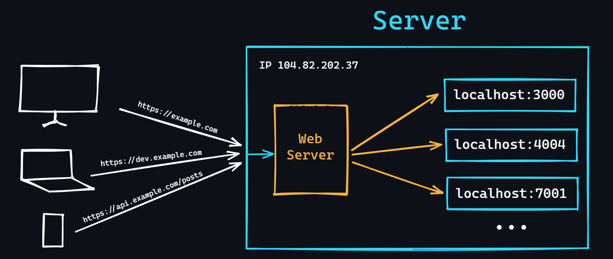</p>

    A [web server](https://en.wikipedia.org/wiki/Web_server) is a program designed to handle incoming HTTP requests. In addition, it can keep error logs (logs), perform authentication and authorization, store rules for file processing, etc.

    -   What is it for?
        > Not all languages can have a built-in web server (e.g., PHP). Therefore, to run web applications written in such languages, a third-party one is needed. <br>
        > A single server (virtual or dedicated) can run several applications, but only one external IP address. A configured web server solves this problem and can redirect incoming requests to the right applications.
    -   Popular web servers
        > [Nginx](https://en.wikipedia.org/wiki/Nginx) – the most popular at the moment. <br>
        > [Apache](https://en.wikipedia.org/wiki/Apache_HTTP_Server) – also popular, but already giving up its position. <br>
        > [Caddy](<https://en.wikipedia.org/wiki/Caddy_(web_server)>) – a fairly young web server with great potential.

<details>
    <summary>🔗 <b>References</b></summary>

1. 📺 [**What are web servers and how do they work** – YouTube](https://youtu.be/JhpUch6lWMw)
2. 📺 [**Web Server Concepts and Examples** – YouTube](https://youtu.be/9J1nJOivdyw)
3. 📺 [**The NGINX Crash Course** – YouTube](https://youtu.be/7VAI73roXaY)
4. 📺 [**Nginx Server Complete Course** – YouTube](https://youtu.be/tMtFZdaaIhk)
5. 📄 [**6 Best Courses to learn Nginx in depth** – medium](https://medium.com/javarevisited/best-courses-to-learn-nginx-in-36ed9ccca804)
6. 📄 [**NGINX: Advanced Load Balancer, Web Server, & Reverse Proxy** – dev.to](https://dev.to/lovepreetsingh/nginx-advanced-load-balancer-web-server-reverse-proxy-4i23)
7. 📄 [**Awesome NGINX** – GitHub](https://github.com/agile6v/awesome-nginx)
</details>

<div align="right"><a href="#top">Contents ⬆️</a></div>

-   ### Message brokers

    <p align="center">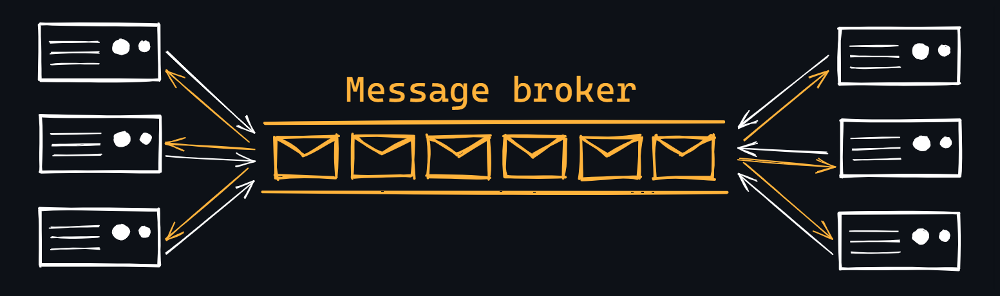</p>

    When creating a large-scale backend system, the problem of communication between a large number of microservices may arise. In order not to complicate existing services (establish a reliable communication system, distribute the load, provide for various errors, etc.) you can use a separate service, which is called a [message broker](https://en.wikipedia.org/wiki/Message_broker) (or message queue).

    The broker takes the responsibility of creating a reliable and fault-tolerant system of communication between services (performs balancing, guarantees delivery, monitors recipients, maintains logs, buffering, etc.)

    A message is an ordinary HTTP request/response with data of a certain format.

    -   [RabbitMQ](https://en.wikipedia.org/wiki/RabbitMQ) - specializes in message queuing and supports various messaging patterns, including publish/subscribe and point-to-point communication.
    -   [Apache Kafka](https://en.wikipedia.org/wiki/Apache_Kafka) - excels in handling large-scale, real-time data streams and offers high throughput, fault tolerance, and horizontal scalability.
    -   [NATS](https://nats.io/) - known for its simplicity, speed, and lightweight design, making it ideal for building fast and efficient distributed systems.

<details>
    <summary>🔗 <b>References</b></summary>

1. 📺 [**What is a Message Queue and When should you use Messaging Queue Systems** – YouTube](https://youtu.be/W4_aGb_MOls)
2. 📺 [**What is a Message Queue?** – YouTube](https://youtu.be/xErwDaOc-Gs)
3. 📄 [**Understanding RabbitMQ** – medium](https://medium.com/swlh/understanding-rabbitmq-11d710e40a38)
4. 📺 [**RabbitMQ course (playlist)** – YouTube](https://youtube.com/playlist?list=PLrwNNiB6YOA3Z3JfOUMKE6PmnpmVAJgTK)
 </details>

<div align="right"><a href="#top">Contents ⬆️</a></div>

-   ### Ngrok

    [Ngrok](https://ngrok.com/) is a tool for creating public [tunnels](https://en.wikipedia.org/wiki/Tunneling_protocol) on the Internet that allows local network applications (web servers, websites, bots, etc.) to be accessible from outside.

    - How does it work?
        > Ngrok creates a temporary public URL that can be used to access your local server from the Internet. Once Ngrok is started, you have access to the console, where you can monitor requests, handling, and responses to those requests, and configure additional features such as authentication and encryption.
    - What to use it for?
        > For example, to test web sites and APIs, to demonstrate running applications on a local server, to access local network applications over the Internet without having to set up a router, firewall, proxy server, etc.

<details>
    <summary>🔗 <b>References</b></summary>

1. 📺 [**Expose Local WebSocket, HTTP and HTTPS WebServers to the Public Internet with Ngrok** – YouTube](https://youtu.be/pR2qNnVIuKE)
 </details>

<div align="right"><a href="#top">Contents ⬆️</a></div>

-   ### AI tools

    Artificial intelligence systems have made an incredible leap recently. Every day there are more and more tools that can write code for you, generate documentation, do code reviews, help you learn new technologies, and so on. Many people are still skeptical about the capabilities and quality of content that AI creates. But at least by now, a lot of time and resources can be saved to increase the productivity of any developer.

    -   [ChatGPT](https://en.wikipedia.org/wiki/ChatGPT)
        > The highest quality [LLM](https://en.wikipedia.org/wiki/Large_language_model) at the moment. Works like a normal chatbot and has no problem understanding human speech in several languages.
    -   [Bard](https://en.wikipedia.org/wiki/Bard_(chatbot))
        > Developed by Google as an alternative and direct competitor to ChatGPT.
    -   [GitHub Copilot](https://en.wikipedia.org/wiki/GitHub_Copilot)
        > AI-powered code completion tool developed by GitHub in collaboration with developers of ChatGPT. It integrates with popular code editors and provides real-time suggestions and completions for code as you write.
    -   [Tabnine](https://www.tabnine.com/)
        > An alternative to GitHub Copilot that provides context-sensitive code suggestions based on patterns it learns from millions of publicly available code repositories.

<details>
    <summary>🔗 <b>References</b></summary>

1. 📄 [**Awesome ChatGPT Prompts** – GitHub](https://github.com/f/awesome-chatgpt-prompts)
2. 📺 [**ChatGPT Tutorial for Developers - 38 Ways to 10x Your Productivity** – YouTube](https://youtu.be/sTeoEFzVNSc)
3. 📺 [**GitHub Copilot in 7 Minutes** – YouTube](https://youtu.be/hPVatUSvZq0)
 </details>

<div align="right"><a href="#top">Contents ⬆️</a></div>

## Security

-   ### Web application vulnerabilities

    -   [Cross-site scripting (XSS)](https://en.wikipedia.org/wiki/Cross-site_scripting)
        > An attack that allows an attacker to inject malicious code through a website into the browsers of other users.
    -   [SQL injection](https://en.wikipedia.org/wiki/SQL_injection)
        > An attack is possible if the user input that is passed to the SQL query is able to change the meaning of the statement or add another query to it.
    -   [Cross-site request forgery (CSRF)](https://en.wikipedia.org/wiki/Cross-site_request_forgery)
        > When a site uses a POST request to perform a transaction, the attacker can forge a form, such as in an email, and send it to the victim. The victim, who is an authorized user interacting with this email, can then unknowingly send a request to the site with the data that the attacker has set.
    -   [Clickjacking](https://en.wikipedia.org/wiki/Clickjacking)
        > The principle is based on the fact that an invisible layer is placed on top of the visible web page, in which the page the intruder wants is loaded, while the control (button, link) needed to perform the desired action is combined with the visible link or button the user is expected to click on.
    -   [Denial of Service (DoS attack)](https://en.wikipedia.org/wiki/Denial-of-service_attack)
        > A hacker attack that overloads the server running the web application by sending a huge number of requests.
    -   [Man-in-the-Middle attack](https://en.wikipedia.org/wiki/Man-in-the-middle_attack)
        > A type of attack in which an attacker gets into the chain between two (or more) communicating parties to intercept a conversation or data transmission.
    -   Incorrect security configuration
        > Using default configuration settings can be dangerous because it is common knowledge. For example, a common vulnerability is that network administrators leave the default logins and passwords _admin:admin_.

<details>
    <summary>🔗 <b>References</b></summary>

1. 📺 [**7 Security Risks and Hacking Stories for Web Developers** – YouTube](https://youtu.be/4YOpILi9Oxs)
2. 📄 [**Top 10 Web Application Security Risks**](https://owasp.org/www-project-top-ten/)
3. 📺 [**Web App Vulnerabilities - DevSecOps Course for Beginners** – YouTube](https://youtu.be/F5KJVuii0Yw)
4. 📺 [**DDoS Attack Explained** – YouTube](https://youtu.be/ilhGh9CEIwM)
5. 📺 [**Securing Web Applications – MIT lecture** – YouTube](https://youtu.be/WlmKwIe9z1Q)
6. 📺 [**Scan for Vulnerabilities on Any Website Using Nikto** – YouTube](https://youtu.be/K78YOmbuT48)
7. 📺 [**OWASP API Security Top 10 Course** – YouTube](https://youtu.be/YYe0FdfdgDU)
 </details>

<div align="right"><a href="#top">Contents ⬆️</a></div>

-   ### Environment variables

    Often your applications may use various tokens (e.g., to access a third-party paid API), logins and passwords (to connect to a database), various secret keys for signatures and so on. All this data should not be known and available to outsiders, so you can't leave them in the program code in any case. To solve this problem, there are environment variables.

    -   The `.env` file
        > A special file in which you can store all environment variables.
    -   Parsing the `.env` file
        > Variables are passed to the program using command line arguments. To do the same with the `.env` file, you need to use a special library for your language.
    -   Storage and transfer `.env` files
        > Learn how to upload `.env` files to the hosting services and remember that such files cannot be committed to remote repositories, so do not forget to add them to exceptions via the `.gitignore` file.

<details>
    <summary>🔗 <b>References</b></summary>

1. 📺 [**How to use environment variables in a Python script** – YouTube](https://youtu.be/ed2NGpsws8Y)
2. 📺 [**Configure Node.js Environment Variables for Local Development & Production** – YouTube](https://youtu.be/gfyQzeBlLTI)
3. 📺 [**Golang Environment Variables** – YouTube](https://youtu.be/mnCgl-iwPak)
 </details>

<div align="right"><a href="#top">Contents ⬆️</a></div>

-   ### Hashing

    <p align="center">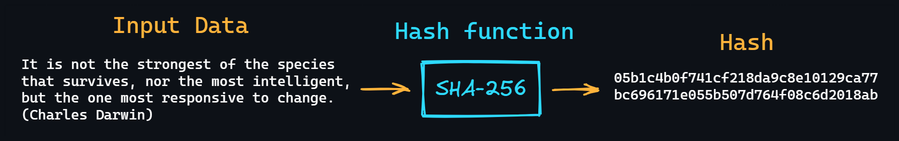</p>

    Cryptographic algorithms based on [hash functions](https://en.wikipedia.org/wiki/Hash_function) are widely used for network security.

    -   Hashing
        > The process of converting an array of information (from a single letter to an entire literary work) into a unique short string of characters (called hash), which is unique to that array of information. Moreover, if you change even one character in this information array, the new hash will differ dramatically. <br>
        > Hashing is an irreversible process, that is, the resulting hash cannot be recovered from the original data.
    -   [Checksums](https://en.wikipedia.org/wiki/Checksum)
        > Hashes can be used as checksums that serve as proof of data integrity.
    -   [Collisions](https://en.wikipedia.org/wiki/Hash_collision)
        > Cases where hashing different sets of information results in the same hash.
    -   [Salt (in cryptography)](<https://en.wikipedia.org/wiki/Salt_(cryptography)>)
        > A random string of data, which is added to the input data before hashing, to calculate the hash. This is necessary to make brute-force hacking more difficult.

    Popular hashing algorithms:

    -   [SHA family (Secure Hash Algorithm)](https://en.wikipedia.org/wiki/Secure_Hash_Algorithms)
        > [SHA-256](https://en.wikipedia.org/wiki/SHA-2) is the most popular encryption algorithm. It is used, for example, in [Bitcoin](https://en.wikipedia.org/wiki/Bitcoin).
    -   MD family (Message Digest)
        > The most popular algorithm of the family is [MD5](https://en.wikipedia.org/wiki/MD5). It is now considered very vulnerable to collisions (there are even collision generators for MD5).
    -   [BLAKE](<https://en.wikipedia.org/wiki/BLAKE_(hash_function)>) family
    -   [RIPEMD](https://en.wikipedia.org/wiki/RIPEMD) family
    -   [Streebog](https://en.wikipedia.org/wiki/Streebog)

<details>
    <summary>🔗 <b>References</b></summary>

1. 📺 [**What is Hashing? Hash Functions Explained Simply** – YouTube](https://youtu.be/2BldESGZKB8)
2. 📺 [**Passwords & hash functions (Simply Explained)** – YouTube](https://youtu.be/cczlpiiu42M)
3. 📺 [**Hashing Algorithms and Security - Computerphile** – YouTube](https://youtu.be/b4b8ktEV4Bg)
4. 📺 [**SHA: Secure Hashing Algorithm - Computerphile** – YouTube](https://youtu.be/DMtFhACPnTY)
5. 📺 [**How secure is 256 bit security?** – YouTube](https://youtu.be/DMtFhACPnTY)
 </details>

<div align="right"><a href="#top">Contents ⬆️</a></div>

-   ### Authentication and authorization

    [Authentication](https://en.wikipedia.org/wiki/Authentication) is a procedure that is usually performed by comparing the password entered by the user with the password stored in the database.
    Also, this often includes [identification](<https://en.wikipedia.org/wiki/Identification_(information)>) - a procedure for identifying the user by his unique identifier (usually a regular login or email). This is needed to know exactly which user is being authenticated.

    [Authorization](https://en.wikipedia.org/wiki/Authorization) - the procedure of granting access rights to a certain user to perform certain operations. For example, ordinary users of the online store can view products and add them to cart. But only administrators can add new products or delete existing ones.

    -   [Basic Authentication](https://developer.mozilla.org/en-US/docs/Web/HTTP/Authentication)
        > The simplest authentication scheme where the username and password of the user are passed in the [Authorization](https://developer.mozilla.org/en-US/docs/Web/HTTP/Headers/Authorization) header in unencrypted (base64-encoded) form. It is relatively secure when using HTTPS.
    -   [SSO (Single Sign-On)](https://en.wikipedia.org/wiki/Single_sign-on)
        > Technology that implements the ability to move from one service to another (not related to the first), without reauthorization.
    -   [OAuth / OAuth 2.0](https://en.wikipedia.org/wiki/OAuth)
        > Authorization protocol, which allows you to register in various applications using popular services (Google, Facebook, GitHub, etc.)
    -   [OpenID](https://en.wikipedia.org/wiki/OpenID)
        > An open standard that allows you to create a single account for authenticating to multiple unrelated services.
    -   [JWT (JSON Web Token)](https://en.wikipedia.org/wiki/JSON_Web_Token)
        > An authentication standard based on access tokens. Tokens are created by the server, signed with a secret key and transmitted to the client, who then uses the token to verify his identity.

<details>
    <summary>🔗 <b>References</b></summary>

1. 📺 [**HTTP Basic Authentication explained** – YouTube](https://youtu.be/EeNzWUcPaFY)
2. 📺 [**What Is Single Sign-on (SSO)? How It Works** – YouTube](https://youtu.be/O1cRJWYF-g4)
3. 📺 [**OAuth 2 explained in very simple terms** – YouTube](https://youtu.be/THs9QUUXVhk)
4. 📺 [**OpenID Connect explained** – YouTube](https://youtu.be/PsbIGfvX900)
5. 📺 [**What Is JWT and Why Should You Use JWT** – YouTube](https://youtu.be/7Q17ubqLfaM)
 </details>

<div align="right"><a href="#top">Contents ⬆️</a></div>

-   ### SSL/TLS

    [SSL (Secure Socket Layer)](https://en.wikipedia.org/wiki/Transport_Layer_Security#SSL_1.0,_2.0,_and_3.0) and [TLS (Transport Layer Security)](https://en.wikipedia.org/wiki/Transport_Layer_Security) are cryptographic protocols that allow secure transmission of data between two computers on a network. These protocols work essentially the same and there are no differences. SSL is considered obsolete, although it is still used to support older devices.

    -   [Certificate Authority (CA)](https://en.wikipedia.org/wiki/Certificate_authority)
        > TLS/SSL uses digital certificates issued by a certificate authority. One of the most popular is [Let’s Encrypt](https://en.wikipedia.org/wiki/Let%27s_Encrypt).
    -   Certificate configuration and installation
        > You need to know how to generate certificates and install them properly to make your server work over HTTPS.
    -   [Handshake process](https://en.wikipedia.org/wiki/Transport_Layer_Security#TLS_handshake)
        > To establish a secure connection between the client and the server, a special process must take place which includes the exchange of secret keys and information about encryption algorithms.

<details>
    <summary>🔗 <b>References</b></summary>

1. 📺 [**SSL, TLS, HTTPS Explained** – YouTube](https://youtu.be/j9QmMEWmcfo)
2. 📺 [**Transport Layer Security, TLS 1.2 and 1.3 (Explained by Example)** – YouTube](https://youtu.be/AlE5X1NlHgg)
3. 📺 [**Let's Encrypt Explained: Free SSL** – YouTube](https://youtu.be/jrR_WfgmWEw)
4. 📺 [**How to Install a Free SSL Certificate with Let's Encrypt** – YouTube](https://youtu.be/PGDx3xxLGgA)
 </details>

<div align="right"><a href="#top">Contents ⬆️</a></div>

## Testing

Testing is the process of assessing that all parts of the program behave as expected of them. Covering the product with the proper amount of testing, allows you to quickly check later to see if anything in the application is broken after adding new or changing old functionality.

-   ### Unit Tests

    The simplest kind of tests. As a rule, about 70-80% of all tests are exactly [unit-tests](https://en.wikipedia.org/wiki/Unit_testing). "Unit" means that not the whole system is tested, but small and separate parts of it (functions, methods, components, etc.) in isolation from others. All dependent external environment is usually covered by [mocks](https://en.wikipedia.org/wiki/Mock_object).

    -   What are the benefits of unit tests?
        > To give you an example, let's imagine a car. Its "units" are the engine, brakes, dashboard, etc. You can check them individually before assembly and, if necessary, replace or repair them. But you can assemble the car without having tested the units, and it will not go. You will have to disassemble everything and check every detail.
    -   What do I need to start writing unit tests?
        > As a rule, the means of the standard language library are enough to write quality tests. But for more convenient and faster writing of tests, it is better to use third-party tools. For example:
        >
        > -   For , it uses [pytest](https://docs.pytest.org), although the standard [unittest](https://docs.python.org/3/library/unittest.html) is enough to start with.
        > -   For JavaScript/TypeScript, the best choices are [Jest](https://jestjs.io/).
        > -   For Go – [testify](https://github.com/stretchr/testify).
        > -   [And so on...](https://github.com/atinfo/awesome-test-automation#awesome-test-automation)

<details>
    <summary>🔗 <b>References</b></summary>

1. 📺 [**Software Testing Explained in 100 Seconds** – YouTube](https://youtu.be/u6QfIXgjwGQ)
2. 📄 [**How to write your first Unit Test** – medium](https://medium.com/geekculture/how-to-write-your-first-unit-test-in-multiple-programming-languages-6d158d362b3d)
3. 📺 [**Testing JavaScript with Cypress – Full Course** – YouTube](https://youtu.be/u8vMu7viCm8?si=wYAoeR87-dPOIRA4)
4. 📺 [**How To Write Unit Tests For Existing Python Code** – YouTube](https://youtu.be/ULxMQ57engo)
5. 📺 [**Learn How to Test your JavaScript Application** – YouTube](https://youtu.be/ajiAl5UNzBU)
6. 📺 [**Golang Unit Testing and Mock Testing Tutorial** – YouTube](https://youtu.be/XQzTUa9LPU8)

 </details>

<div align="right"><a href="#top">Contents ⬆️</a></div>

-   ### Integration tests

    [Integration testing](https://en.wikipedia.org/wiki/Integration_testing) involves testing individual modules (components) in conjunction with others (that is, in integration). What was covered by a stub during Unit testing is now an actual component or an entire module.

    -   Why it's needed?
        > Integration tests are the next step after units. Having tested each component individually, we cannot yet say that the basic functionality of the program works without errors. Potentially, there may still be many problems that will only surface after the different parts of the program interact with each other.
    -   Strategies for writing integration tests
        > -   **Big Bang**: Most of the modules developed are connected together to form either the whole system or most of it. If everything works, you can save a lot of time this way.
        > -   **incremental approach**: By connecting two or more logically connected modules and then gradually adding more and more modules until the whole system is tested.
        > -   **Bottom-up approach**: each module at lower levels is tested with the modules of the next higher level until all modules have been tested.

<details>
    <summary>🔗 <b>References</b></summary>

1. 📺 [**Unit testing vs. integration testing** – YouTube](https://youtu.be/pf6Zhm-PDfQ)
2. 📺 [**PyTest REST API Integration Testing with Python** – YouTube](https://youtu.be/7dgQRVqF1N0)
3. 📄 [**Integration Testing – Software testing fundamentals**](https://softwaretestingfundamentals.com/integration-testing/)
 </details>

<div align="right"><a href="#top">Contents ⬆️</a></div>

-   ### E2E tests

    <p align="center">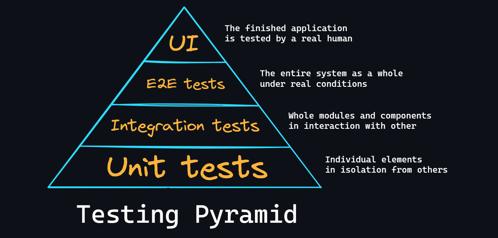</p>

    End-to-end tests imply checking the operation of the entire system as a whole. In this type of testing, the environment is implemented as close to real-life conditions as possible. We can draw the analogy that a robot sits at the computer and presses the buttons in the specified order, as a real user would do.

    -   When to use?
        > E2E is the most complex type of test. They take a long time to write and to execute, because they involve the whole application. So if your application is small (e.g., you are the only one developing it), writing Unit and some integration tests will probably be enough.

<details>
    <summary>🔗 <b>References</b></summary>

1. 📄 [**What is End-to-End Testing and When Should You Use It?** – freeCodeCamp](https://www.freecodecamp.org/news/end-to-end-testing-tutorial/)
2. 📺 [**End to End Testing - Explained** – YouTube](https://youtu.be/68xvfrxlEYo)
3. 📺 [**Testing Node.js Server with Jest and Supertest** – YouTube](https://youtu.be/FKnzS_icp20)
4. 📺 [**End to End - Test Driven Development (TDD) to create a REST API in Go** – YouTube](https://youtu.be/tG9dPO6fe4E)
5. 📺 [**How to test HTTP handlers in Go** – YouTube](https://youtu.be/Ztk9d78HgC0)
6. 📄 [**Awesome Testing** – GitHub](https://github.com/TheJambo/awesome-testing)
 </details>

<div align="right"><a href="#top">Contents ⬆️</a></div>

-   ### Load testing

    When you create a large application that needs to serve a large number of requests, there is a need to test this very ability to withstand heavy loads. There are many utilities available to create [artificial load](https://en.wikipedia.org/wiki/Load_testing).

    -   [JMeter](https://en.wikipedia.org/wiki/Apache_JMeter)
        > User-friendly interface, cross-platform, multi-threading support, extensibility, excellent reporting capabilities, support for many protocols for queries.
    -   [LoadRunner](https://en.wikipedia.org/wiki/LoadRunner)
        > It has an interesting feature of virtual users, who do something with the application under test in parallel. This allows you to understand how the work of some users actively doing something with the service affects the work of others.
    -   [Gatling](<https://en.wikipedia.org/wiki/Gatling_(software)>)
        > A very powerful tool oriented to more experienced users. The Scala programming language is used to describe the scripts.
    -   [Taurus](https://gettaurus.org/)
        > A whole framework for easier work on JMeter, Gatling and so on. JSON or YAML is used to describe tests.

<details>
    <summary>🔗 <b>References</b></summary>

1. 📺 [**Getting started with API Load Testing (Stress, Spike, Load, Soak)** – YouTube](https://youtu.be/r-Jte8Y8zag)
2. 📄 [**How to Load Test: A developer’s guide to performance testing** – medium](https://rhamedy.medium.com/how-to-load-test-a-developers-guide-to-performance-testing-5264faaf4e33)
 </details>

<div align="right"><a href="#top">Contents ⬆️</a></div>

-   ### Regression testing

    [Regression testing](https://en.wikipedia.org/wiki/Regression_testing) is a type of testing aimed at detecting errors in already tested portions of the source code.

    -   Why use it?
        > Statistically, the reappearance of the same bugs in code is quite frequent. And, most interestingly, the patches/fixes issued for them also stop working in time. Therefore, it is considered good practice to create a test for it when fixing a bug and run it regularly for next modifications.

<details>
    <summary>🔗 <b>References</b></summary>

1. 📄 [**What Is Regression Testing? Definition, Tools, Method, And Example**](https://www.softwaretestinghelp.com/regression-testing-tools-and-methods/)
2. 📺 [**Regression testing – What, Why, When, and How to Run It?** – YouTube](https://youtu.be/AWX6WvYktwk)
3. 📺 [**Top-5 Tools for Regression Testing** – YouTube](https://youtu.be/HZvqfuADX8g)
 </details>

<div align="right"><a href="#top">Contents ⬆️</a></div>

## Deployment (CI/CD)

-   ### Cloud services

    Before you can deploy your code, you need to decide where you want to host it. You can rent your own server or use the services of cloud providers, which have great functionality for process automation, monitoring, load balancing, data storing and so on.

    -   [AWS (Amazon Web Services)](https://docs.aws.amazon.com/whitepapers/latest/aws-overview/introduction.html)
        > Provides a wide range of services for computing, storage, database management, networking, security, and more. AWS is one of the oldest and most established cloud service providers.
    -   [Google Cloud](https://cloud.google.com/docs/overview)
        > It is known for its focus on machine learning and artificial intelligence, as well as its integration with other Google services like Google Analytics and Google Maps.
    -   [Microsoft Azure](https://azure.microsoft.com/en-us/explore)
        > Azure is known for its integration with other Microsoft services like Office 365 and Dynamics 365, as well as its support for a wide range of programming languages and frameworks.
    -   [Digital Ocean](https://www.digitalocean.com/)
        > This service provides virtual private servers (VPS) for developers and small businesses. It is also known for its simplicity and ease of use, as well as its competitive pricing.
    -   [Heroku](https://www.heroku.com/what)
        > Heroku is known for its ease of use and integration with popular development tools like Git, as well as its support for multiple programming languages and frameworks. It was a very popular choice for open source projects as long as there was a free plan (it costs money now).

    As a rule, all of these services have an intuitive simple interface, detailed documentation, as well as many video tutorials on YouTube.

<details>
    <summary>🔗 <b>References</b></summary>

1. 📺 [**Big vs. Small Public Cloud Providers** – YouTube](https://youtu.be/LJomGBuBDaU)
2. 📺 [**Top 50+ AWS Services Explained in 10 Minutes** – YouTube](https://youtu.be/JIbIYCM48to)
3. 📺 [**AWS Certified Cloud Practitioner Certification Course** – YouTube](https://youtu.be/SOTamWNgDKc)
4. 📄 [**Awesome AWS (list of libraries, open source repos, guides, blogs) – GitHub**](https://github.com/donnemartin/awesome-aws)
5. 📺 [**Google Cloud Associate Cloud Engineer Course** – YouTube](https://youtu.be/jpno8FSqpc8)
6. 📄 [**Awesome Google Cloud Platform – GitHub**](https://github.com/GoogleCloudPlatform/awesome-google-cloud)
7. 📺 [**Microsoft Azure Fundamentals Certification Course** – YouTube](https://youtu.be/NKEFWyqJ5XA)
8. 📺 [**Full DigitalOcean Crash Course** – YouTube](https://youtu.be/9ZUHSW1tTiU)
9. 📄 [**Awesome Digital Ocean – GitHub**](https://github.com/jonleibowitz/awesome-digitalocean)
 </details>

<div align="right"><a href="#top">Contents ⬆️</a></div>

-   ### Container orchestration

    Container orchestration is the process of managing and automating the deployment, scaling, and maintenance of containerized applications and dependencies into a portable, lightweight container format to use them in a cluster of machines.

    -   Docker in production
        > The easiest way to manage containers is to use Docker directly, following a list of rules to keep your applications stable and safe in a production environment.
        > - Store your Docker images in a private registry to prevent unauthorized access and ensure security.
        > - Use secure authentication mechanisms for access to your Docker registry and implement security measures such as firewall rules to limit access to your Docker environment.
        > - Keep the size of your containers as small as possible by minimizing the number of unnecessary packages and dependencies.
        > - Use separate containers for different services (ex. application server, database, cache, metrics etc.).
        > - Use Docker volumes to store persistent data such as database files, logs, and configuration files.
    -   [Docker swarm](https://docs.docker.com/engine/swarm/)
        > It is a native orchestration tool for Docker to manage, scale and automate tasks such as container updates, recovery, traffic balancing, [service discovery](https://devopscube.com/service-discovery-explained/) and so on.
    -   [Kubernetes](https://en.wikipedia.org/wiki/Kubernetes) (K8s)
        > Is a very popular orchestration platform that can work with a variety of container runtimes including Docker. Kubernetes offers a more comprehensive set of features (than Docker swarm), including advanced scheduling, storage orchestration, and self-healing capabilities.

<details>
    <summary>🔗 <b>References</b></summary>

1. 📄 [**How To Optimize Docker Images for Production** – Digital Ocean](https://www.digitalocean.com/community/tutorials/how-to-optimize-docker-images-for-production)
2. 📄 [**Docker Compose in production**](https://docs.docker.com/compose/production/)
3. 📄 [**Top 8 Docker Best Practices for using Docker in Production** – dev.to](https://dev.to/techworld_with_nana/top-8-docker-best-practices-for-using-docker-in-production-1m39)
4. 📺 [**Best practices around creating a production web app with Docker and Docker Compose** – YouTube](https://youtu.be/vYpPGCaKs3I)
5. 📺 [**Docker Swarm Tutorial** – YouTube](https://youtu.be/Tm0Q5zr3FL4)
6. 📄 [**Awesome Swarm** – GitHub](https://github.com/BretFisher/awesome-swarm)
7. 📄 [**Kubernetes vs. Docker Swarm – What is the Difference?**](https://www.freecodecamp.org/news/kubernetes-vs-docker-swarm-what-is-the-difference/)
8. 📄 [**Kubernetes Roadmap**](https://roadmap.sh/kubernetes)
9. 📄 [**Kubernetes Learning Roadmap** – GitHub](https://github.com/techiescamp/kubernetes-learning-path)
10. 📺 [**Docker Containers and Kubernetes Fundamentals – Full Hands-On Course** – YouTube](https://youtu.be/kTp5xUtcalw)
11. 📺 [**Kubernetes Course - Full Beginners Tutorial (Containerize Your Apps!)** – YouTube](https://youtu.be/d6WC5n9G_sM)
12. 📄 [**Awesome Kubernetes Resources – GitHub**](https://github.com/tomhuang12/awesome-k8s-resources)
 </details>

<div align="right"><a href="#top">Contents ⬆️</a></div>

-   ### Automation tools

    To streamline the process of building, testing, deploying code changes, integrate with other tools in the development ecosystem, such as code repositories, issue trackers, monitoring systems to provide a more comprehensive development workflow you can use some automation tools and services.

    -   [GitHub Actions](https://docs.github.com/en/actions)
        > CI/CD tool built into the GitHub platform, which enables developers to automate workflows for their repositories. A great choice if you already use GitHub. There are a large number of pre-built actions. One of the most useful feature is ability to trigger workflows based on various events, such as pull requests or other repository activity.
    -   [Jenkins](https://en.wikipedia.org/wiki/Jenkins_(software))
        > Highly configurable and extensible open source tool with a large ecosystem of plugins available to customize its functionality. Jenkins can be used in various environments, including on-premise, cloud-based and hybrid setups.
    -   [Circle CI](https://en.wikipedia.org/wiki/CircleCI)
        > It is a cloud-based CI/CD platform designed to be fast and easy to set up, with a focus on developer productivity. Circle CI integrates with various cloud-based services, such as AWS, Google Cloud and Microsoft Azure. You can also host it locally on your network.
    -   [Travis CI](https://en.wikipedia.org/wiki/Travis_CI)
        > It is also a cloud-based CI/CD platform. It can be easily integrated with GitHub or Bitbucket. Travis CI supports multiple programming languages and frameworks. It also can be hosted as your local platform.

<details>
    <summary>🔗 <b>References</b></summary>

1. 📺 [**GitHub Actions: The Full Course - Learn by Doing (playlist)** – YouTube](https://youtube.com/playlist?list=PLArH6NjfKsUhvGHrpag7SuPumMzQRhUKY)
2. 📄 [**Awesome GitHub Actions – GitHub**](https://github.com/sdras/awesome-actions)
3. 📺 [**Learn Jenkins! Complete Jenkins Course - Zero to Hero** – YouTube](https://youtu.be/6YZvp2GwT0A)
4. 📺 [**CircleCI Tutorial for Beginners | Learn CircleCI In 30 Minutes** – YouTube](https://youtu.be/_XaYv9zvHUk)
5. 📺 [**Travis CI Complete Tutorial for DevOps Engineers** – YouTube](https://youtu.be/xLWDOLhTH38)
 </details>

<div align="right"><a href="#top">Contents ⬆️</a></div>

-   ### Monitoring and logs

    Logs capture detailed information about events, errors, and activities within your applications, facilitating troubleshooting and debugging processes. They provide a historical record of system behavior, allowing you to investigate issues, understand root causes, and improve overall system reliability and stability.

    -   Libraries for your lang
        > The easiest way to log an application is to use the tools of the standard language library or third-party packages. For example, in Python you can use [logging module](https://docs.python.org/3/library/logging.html) or [Loguru](https://github.com/Delgan/loguru). In Node.js – [Winston](https://github.com/winstonjs/winston), [Pino](https://github.com/pinojs/pino). And in Go – [log package](https://pkg.go.dev/log), [Logrus](https://github.com/sirupsen/logrus).
    -   [Loki](https://go2.grafana.com/loki-grafana-cloud.html)
        > Designed to collect log data from various sources and provides fast searching and filtering capabilities.
    -   [Graylog](https://github.com/Graylog2/graylog2-server)
        > Comprehensive log management platform that also centralizes log data from different sources. Graylog offers features like log ingestion, indexing, searching, and analysis.
    -   ELK Stack ([Elasticsearch](https://en.wikipedia.org/wiki/Elasticsearch), [Logstash](https://www.elastic.co/logstash/), [Kibana](https://www.elastic.co/kibana/))
        > Is a combination of three open-source tools used for log management and analysis. Elasticsearch is a distributed search and analytics engine that stores and indexes logs. Logstash is a log ingestion and processing pipeline that collects, filters, and transforms log data. Kibana is a web interface that allows you to search, visualize, and analyze logs stored in Elasticsearch.

    Metrics help track key performance indicators, resource utilization, and system behavior, enabling you to identify bottlenecks, optimize performance, and ensure efficient resource allocation.

    -   [Prometheus](https://en.wikipedia.org/wiki/Prometheus_(software))
        > Open-source monitoring system that can collect metrics data from various sources. It employs a pull-based model, periodically scraping targets to collect metrics. The collected data is stored in a time-series database, allowing for powerful querying and analysis. Prometheus provides a flexible query language and a user-friendly interface to visualize and monitor metrics. It also includes an alerting system to define and trigger alerts based on specified rules and thresholds.
    -   [Grafana](https://en.wikipedia.org/wiki/Grafana)
        > Tool for visualization and monitoring. It allows you to create visually appealing dashboards and charts to analyze and monitor metrics data from various sources, including databases and monitoring systems like Prometheus and InfluxDB.
    -   [InfluxDB](https://en.wikipedia.org/wiki/InfluxDB)
        > Time-series database designed specifically for storing and querying metrics and events data. Offers a simple and flexible query language to extract valuable insights from the stored data. With its focus on time-series data, InfluxDB allows for easy aggregation, downsampling, and retention policies.

<details>
    <summary>🔗 <b>References</b></summary>

1. 📺 [**Grafana Loki a log aggregation system for everything** – YouTube](https://youtu.be/h_GGd7HfKQ8)
2. 📺 [**Graylog guide to getting started log management** – YouTube](https://youtu.be/DwYwrADwCmg)
3. 📺 [**Overview of the Elastic Stack (formerly ELK stack)** – YouTube](https://youtu.be/Hqn5p67uev4)
4. 📄 [**Awesome Elasticsearch – GitHub**](https://github.com/dzharii/awesome-elasticsearch)
5. 📺 [**How Prometheus Monitoring works** – YouTube](https://youtu.be/h4Sl21AKiDg)
6. 📄 [**Awesome Prometheus – GitHub**](https://github.com/roaldnefs/awesome-prometheus)
7. 📺 [**Server Monitoring: Prometheus and Grafana Tutorial** – YouTube](https://youtu.be/9TJx7QTrTyo)
8. 📺 [**InfuxDB: Overview, Key Concepts and Demo** – YouTube](https://youtu.be/gb6AiqCJqP0)
 </details>

<div align="right"><a href="#top">Contents ⬆️</a></div>

## Optimization

-   ### Profiling

    [Profiling](<https://en.wikipedia.org/wiki/Profiling_(computer_programming)>) is a program performance analysis, which reveals bottlenecks where the highest CPU and/or memory load occurs.

    -   What is it for?
        > The information obtained after profiling can be very useful for performance optimization. Profiling can also be useful for debugging the program to find bugs and errors.
    -   When should this be done?
        > As needed - when there are obvious problems or suspicions.
    -   What specific tools are there for this?
        > For Python, use: [cProfile](https://docs.python.org/3/library/profile.html), [line_profiler](https://github.com/pyutils/line_profiler). <br>
        > For Node.js: [built-in Profiler](https://nodejs.org/en/docs/guides/simple-profiling/), [Clinic.js](https://github.com/clinicjs/node-clinic), [Trace events module](https://nodejs.org/api/tracing.html). <br>
        > For Go: [runtime/pprof](https://go.dev/blog/pprof), [trace utility](https://go.dev/doc/diagnostics#tracing).

<details>
    <summary>🔗 <b>References</b></summary>

1. 📺 [**Optimize Your Python Programs: Code Profiling with cProfile** – YouTube](https://youtu.be/BZzb_Wpag_M)
2. 📺 [**A New Way to Profile Node.js** – YouTube](https://youtu.be/ASv8188AkVk)
3. 📺 [**Go (Golang) Profiling Tutorial** – YouTube](https://youtu.be/HEwSkhr_8_M)
4. 📄 [**Awesome utilities for performance profiling** – GitHub](https://github.com/msaroufim/awesome-profiling)
 </details>

<div align="right"><a href="#top">Contents ⬆️</a></div>

-   ### Benchmarks

    [Benchmark](<https://en.wikipedia.org/wiki/Benchmark_(computing)>) (in software) is a tool for measuring the execution time of program code. As a rule, the measurement is done by multiple runs of the same code (or a certain part of it), where the average time is then calculated, and can also provide information about the number of operations performed and the amount of memory allocated.

    -   What is it for?
        > Benchmarks are useful for both evaluating performance and choosing the most effective solution to the problem at hand.
    -   What specific tools are there for this?
        > For Python: [timeit](https://docs.python.org/3/library/timeit.html), [pytest-benchmark](https://github.com/ionelmc/pytest-benchmark). <br>
        > For Node.js: [console.time](https://nodejs.org/api/console.html#consoletimelabel), [Artillery](https://github.com/artilleryio/artillery). <br>
        > For Go: [testing.B](https://pkg.go.dev/testing#hdr-Benchmarks), [Benchstat](https://pkg.go.dev/golang.org/x/perf/cmd/benchstat).

    There are benchmarks to measure the performance of networked applications, where you can get detailed information about the average request processing time, the maximum number of supported connections, data transfer rates and so on ([see list of HTTP benchmarks](https://github.com/denji/awesome-http-benchmark)).

<details>
    <summary>🔗 <b>References</b></summary>

1. 📺 [**Premature Optimization** – YouTube](https://youtu.be/tKbV6BpH-C8)
2. 📺 [**Professional Benchmarking in Python** – YouTube](https://youtu.be/DBoobQxqiQw)
3. 📺 [**JavaScript tips — Measuring performance using console.time** – YouTube](https://youtu.be/WumrqNOO8dk)
4. 📺 [**Go (Golang) Benchmark Tutorial** – YouTube](https://youtu.be/L-BkH-_lXpk)
 </details>

<div align="right"><a href="#top">Contents ⬆️</a></div>

-   ### Caching

    [Caching](https://aws.amazon.com/caching) is one of the most effective solutions for optimizing the performance of web applications. With caching, you can reuse previously received resources (static files), thereby reducing latency, reducing network traffic, and reducing the time it takes to fully load content.

    <p align="center">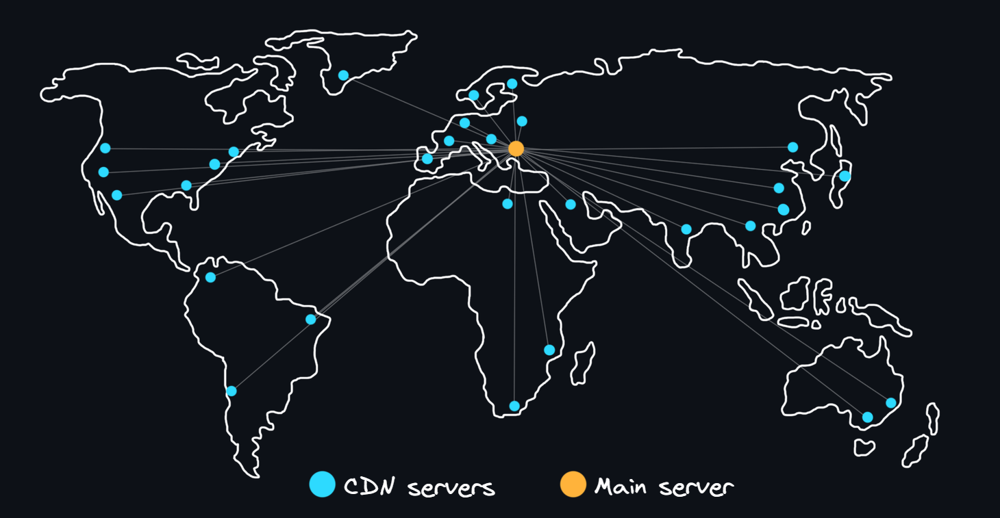</p>

    -   [CDN (Content Delivery Network)](https://en.wikipedia.org/wiki/Content_delivery_network)
        > A system of servers located around the world. Such servers allow you to store duplicate static content and deliver it much faster to users who are in close geographical proximity. Also when using CDN reduces the load on the main server.
    -   Browser-based (client-side) caching
        > Based on loading pages and other static data from the local cache. To do this, the browser (client) is given special headers: [304 Not Modified](https://developer.mozilla.org/en-US/docs/Web/HTTP/Status/304), [Expires](https://developer.mozilla.org/en-US/docs/Web/HTTP/Headers/Expires), [Strict-Transport-Security](https://developer.mozilla.org/en-US/docs/Web/HTTP/Headers/Strict-Transport-Security).
    -   [Memcached](https://en.wikipedia.org/wiki/Memcached)
        > A daemon program that implements high-performance RAM caching based on _key-value_ pairs. Unlike [Redis](#redis) it cannot be a reliable and long-term storage, so it is only suitable for caches.

<details>
    <summary>🔗 <b>References</b></summary>

1. 📺 [**How Caching Works? | Why is Caching Important?** – YouTube](https://youtu.be/ASP7O5fDpSg)
2. 📺 [**Basic Caching Techniques Explained** – YouTube](https://youtu.be/ccemOqDrc2I)
3. 📺 [**HTTP Caching with E-Tags - (Explained by Example)** – YouTube](https://youtu.be/TgZnpp5wJWU)
4. 📺 [**What Is A CDN? How Does It Work?** – YouTube](https://youtu.be/RI9np1LWzqw)
5. 📺 [**Everything you need to know about HTTP Caching** – YouTube](https://youtu.be/HiBDZgTNpXY)
6. 📺 [**Memcached Architecture - Crash Course with Docker, Telnet, Node.js** – YouTube](https://youtu.be/NCePGsRZFus)
 </details>

<div align="right"><a href="#top">Contents ⬆️</a></div>

-   ### Load balancing

    <p align="center">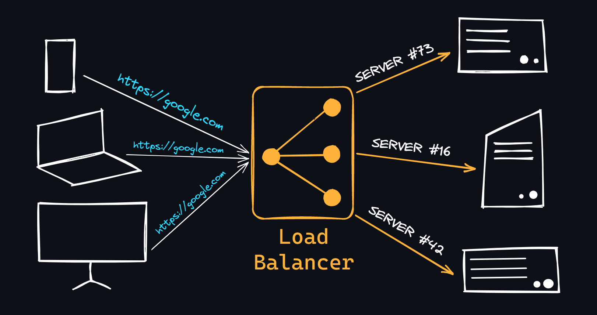</p>

    When the entire application code is maximally optimized and the server capacity is reaching its limits, and the load keeps growing, you have to resort to the [clustering](https://en.wikipedia.org/wiki/Computer_cluster) and [balancing](https://en.wikipedia.org/wiki/Load_balancing_(computing)) mechanisms. The idea is to combine groups of servers into clusters, where the load is distributed between them using special methods and algorithms, called balancing.

    -   Balancing at the network level
        > -   **DNS Balancing**. For one domain name is allocated several IP-addresses and the server to which the request will be redirected is determined by an algorithm [Round Robin](https://en.wikipedia.org/wiki/Round-robin_DNS).
        > -   **Building a [NLB cluster](https://learn.microsoft.com/en-us/windows-server/networking/technologies/network-load-balancing)**. Used to manage two or more servers as one virtual cluster.
        > -   **Balancing by territory**. An example is the [Anycast mailing method](https://en.wikipedia.org/wiki/Anycast).
    -   Balancing on the transport level
        > Communication with the client is locked to the balancer, which acts as a proxy. It communicates with servers on its own behalf, passing information about the client in additional data and headers. Example – [HAProxy](https://en.wikipedia.org/wiki/HAProxy).
    -   Balancing at the application level
        > The balancer analyzes client requests and redirects them to different servers depending on the nature of the requested content. Examples are [Upstream module in Nginx](https://nginx.org/en/docs/http/ngx_http_upstream_module.html) (which is responsible for balancing) and [pgpool](https://www.pgpool.net/mediawiki/index.php/Main_Page) from the PostgreSQL database (for example, it can be used to distribute read requests to one server and write requests to another).
    -   Balancing algorithms
        > -   [**Round Robin**](https://en.wikipedia.org/wiki/Round-robin_scheduling). Each request is sent in turn to each server (first to the first, then to the second and so on in a circle).
        > -   [**Weighted Round Robin**](https://en.wikipedia.org/wiki/Weighted_round_robin). Improved algorithm Round Robin, which also takes into account the performance of the server.
        > -   **Least Connections**. Each subsequent request is sent to the server with the smallest number of supported connections.
        > -   **Destination Hash Scheduling**. The server that processes the request is selected from a static table based on the recipient's IP address.
        > -   **Source Hash Scheduling**. The server that will process the request is selected from the table by the sender's IP address.
        > -   [**Sticky Sessions**](https://docs.aws.amazon.com/elasticloadbalancing/latest/application/sticky-sessions.html). Requests are distributed based on the user's IP address. Sticky Sessions assumes that requests from the same client will be routed to the same server rather than bouncing around in a pool.

<details>
    <summary>🔗 <b>References</b></summary>

1. 📺 [**What is a Load Balancer?** – YouTube](https://youtu.be/sCR3SAVdyCc)
2. 📺 [**Learn Load Balancing right now** – YouTube](https://youtu.be/LlbTSfc4biw)
3. 📺 [**Load Balancing with NGINX** – YouTube](https://youtu.be/a41jxGP9Ic8)
4. 📺 [**Load Balancers id depth** – YouTube](https://youtu.be/galcDRNd5Ow)
 </details>

<div align="right"><a href="#top">Contents ⬆️</a></div>

## Documentation

-   ### Markdown

    A standard in the development world. An incredibly simple, yet powerful markup language for describing your projects. As a matter of fact, the resource you are reading right now is written with [Markdown](https://en.wikipedia.org/wiki/Markdown).

    -   [Markdown cheatsheet](https://github.com/adam-p/markdown-here/wiki/Markdown-Cheatsheet)
        > A cheatsheet on all the syntactic possibilities of the language.
    -   [Awesome Markdown](https://github.com/BubuAnabelas/awesome-markdown)
        > A collection of various resources for working with Markdown.
    -   [Awesome README](https://github.com/matiassingers/awesome-readme)
        > A collection of beautiful README.md files (this is the main file of any repository on GitHub that uses Markdown).
    -   Markdown for your notes
        > Markdown is not only used for writing documentation. This incredible tool is great for learning - creating digital notes. Personally, I use [Obsidian editor](https://obsidian.md/) for outlining new material.

<details>
    <summary>🔗 <b>References</b></summary>

1. 📺 [**How To Write a USEFUL README On GitHub** – YouTube](https://youtu.be/E6NO0rgFub4)
2. 📺 [**Obsidian As A Second Brain: The ULTIMATE Tutorial** – YouTube](https://youtu.be/WqKluXIra70)
 </details>

<div align="right"><a href="#top">Contents ⬆️</a></div>

-   ### Documentation inside code

    For every modern programming language there are [special tools](https://en.wikipedia.org/wiki/Documentation_generator) which allow you to write documentation directly in the program code. So you can read the description of methods, functions, structures and so on right inside your IDE. As a rule, this kind of documentation is done in the form of ordinary comments, taking into account some syntactic peculiarities.

    -   Why do you need it?
        > To make your work and the work of other developers easier. In the long run this will save more time than _traveling through the code_ to figure out how everything works, what parameters to pass to functions or to find out what methods this or that class has. Over time, you will inevitably forget your own code, so already written documentation will be useful to you personally.
    -   What does it take to get started?
        > For each language, it's different. Many have their own well-established approaches:
        >
        > -   [Docstring](https://peps.python.org/pep-0257/) for Python.
        > -   [JSDoc](https://github.com/jsdoc/jsdoc) for JavaScript.
        > -   [Godoc](https://go.dev/doc/comment) for Go.
        > -   [KDoc and Dokka](https://kotlinlang.org/docs/kotlin-doc.html) for Kotlin.
        > -   [Javadoc](https://en.wikipedia.org/wiki/Javadoc) for Java.
        > -   And look for others on request: `documentation engine for <your lang>`.

<details>
    <summary>🔗 <b>References</b></summary>

1. 📺 [**How To Use Developer Documentation** – YouTube](https://youtu.be/s1PLS3SQHQ0)
2. 📺 [**How to use JSDoc - Basics & Introduction** – YouTube](https://youtu.be/Nqv6UkTROak)
3. 📺 [**Godocs - Effortless documentation for your go packages** – YouTube](https://youtu.be/80VT3xexcWs)
 </details>

<div align="right"><a href="#top">Contents ⬆️</a></div>

-   ### API Documentation

    Easy-to-understand documentation will allow other users to understand and use your product faster. Writing documentation from scratch is a tedious process. There are common specifications and auto-generation tools to solve this problem.

    -   [OpenAPI](https://en.wikipedia.org/wiki/OpenAPI_Specification)
        > A specification that describes how the API should be documented so that it is readable by humans and machines alike.
    -   [Swagger](https://swagger.io/)
        > A set of tools that allows you to create convenient API documentation based on the OpenAPI specification.
    -   [Swagger UI](https://swagger.io/tools/swagger-ui/)
        > A tool that allows you to automatically generate interactive documentation, which you can not only read but also actively interact with it (send HTTP requests).
    -   [Swagger editor](https://editor.swagger.io/)
        > A kind of playground in which you can write documentation and immediately see the result of the generated page. You can use YAML or JSON format file for this.
    -   [Swagger codegen](https://swagger.io/tools/swagger-codegen/)
        > Allows you to automatically create API client libraries, server stubs and documentation.

<details>
    <summary>🔗 <b>References</b></summary>

1. 📺 [**REST API and OpenAPI: It’s Not an Either/Or Question** – YouTube](https://youtu.be/pRS9LRBgjYg)
2. 📺 [**Swagger API documentation with Django REST Framework** – YouTube](https://youtu.be/fbIFdWj8PsY)
3. 📺 [**Node.js Swagger API Documentation Tutorial Using Swagger JSDoc** – YouTube](https://youtu.be/S8kmHtQeflo)
4. 📺 [**Go Microservices: REST APIs - OpenAPI / Swagger** – YouTube](https://youtu.be/HwtOAc0M08o)
 </details>

<div align="right"><a href="#top">Contents ⬆️</a></div>

-   ### Static generators

    Over time, when your project grows and has many modules, one README page on GitHub may not be enough. It will be appropriate to create a separate site for the documentation of your project. You don't need to learn how to make it, because there are many generators for creating nice-looking and handy documentation.

    -   [GitBook](https://www.gitbook.com/)
        > Probably the most popular documentation generator using GitHub/Git and Markdown.
    -   [Docusaurus](https://docusaurus.io/)
        > Open-source generator from Facebook (Meta).
    -   [MkDocs](https://www.mkdocs.org/)
        > A simple and widely customizable Markdown documentation generator.
    -   [Slate](https://slatedocs.github.io/slate)
        > Minimalistic documentation generator for REST API.
    -   [Docsify](https://docsify.js.org)
        > Another simple, light and minimalistic static generator.
    -   [Astro](https://astro.build/)
        > A generator with a modern and advanced design.
    -   [mdBook](https://rust-lang.github.io/mdBook/)
        > A static generator from the developers of the Rust language.
    -   [And others...](https://jamstack.org/generators/)

<details>
    <summary>🔗 <b>References</b></summary>

1. 📺 [**Build a Markdown Documentation Site with Docusaurus (Step-by-Step)** – YouTube](https://youtu.be/2R53Y7eP45k)
2. 📺 [**Create template layouts for your HTML with Astro SSG** – YouTube](https://youtu.be/o7iQAF2EvUU)
 </details>

<div align="right"><a href="#top">Contents ⬆️</a></div>

## Building architecture

-   ### Architectural patterns

    -   [Layered](https://ducmanhphan.github.io/2020-02-20-Layered-architecture-pattern/)
        > Used to structure programs that can be decomposed into groups of subtasks, each of which is at a particular level of abstraction. Each layer provides services to the next higher layer.
    -   [Client-server](https://en.wikipedia.org/wiki/Client%E2%80%93server_model)
        > The server component will provide services to multiple client components. Clients request services from the server and the server provides relevant services to those clients.
    -   [Master-slave](<https://en.wikipedia.org/wiki/Master/slave_(technology)>)
        > The master component distributes the work among identical slave components, and computes a final result from the results which the slaves return.
    -   [Pipe-filter](https://learn.microsoft.com/en-us/azure/architecture/patterns/pipes-and-filters)
        > Each processing step is enclosed within a filter component. Data to be processed is passed through pipes. These pipes can be used for buffering or for synchronization purposes.
    -   [Broker pattern](https://en.wikipedia.org/wiki/Broker_pattern)
        > A broker component is responsible for the coordination of communication among components.
    -   [Peer-to-peer](https://en.wikipedia.org/wiki/Peer-to-peer)
        > Peers may function both as a client, requesting services from other peers, and as a server, providing services to other peers. A peer may act as a client or as a server or as both, and it can change its role dynamically with time.
    -   [Event-bus](https://medium.com/elixirlabs/event-bus-implementation-s-d2854a9fafd5)
        > Has 4 major components; event source, event listener, channel and event bus. Sources publish messages to particular channels on an event bus.
    -   [Model-view-controller](https://en.wikipedia.org/wiki/Model%E2%80%93view%E2%80%93controller)
        > Separate internal representations of information from the ways information is presented to, and accepted from, the user.
    -   [Blackboard](<https://en.wikipedia.org/wiki/Blackboard_(design_pattern)>)
        > Useful for problems for which no deterministic solution strategies are known.
    -   [Interpreter](https://en.wikipedia.org/wiki/Interpreter_pattern)
        > Used for designing a component that interprets programs written in a dedicated language.

<details>
    <summary>🔗 <b>References</b></summary>

1. 📄 [**10 Common Software Architectural Patterns in a nutshell**](https://towardsdatascience.com/10-common-software-architectural-patterns-in-a-nutshell-a0b47a1e9013)
2. 📺 [**10 Architecture Patterns Used In Enterprise** – YouTube](https://youtu.be/BrT3AO8bVQY)
 </details>

<div align="right"><a href="#top">Contents ⬆️</a></div>

-   ### Design patterns

    -   Creational Patterns
        > Provide various object creation mechanisms, which increase flexibility and reuse of existing code.
        -   [Factory](https://refactoring.guru/design-patterns/factory-method)
        -   [Abstract factory](https://refactoring.guru/design-patterns/abstract-factory)
        -   [Builder](https://refactoring.guru/design-patterns/builder)
        -   [Prototype](https://refactoring.guru/design-patterns/prototype)
        -   [Singleton](https://refactoring.guru/design-patterns/singleton)
    -   Structural Patterns
        > Explain how to assemble objects and classes into larger structures, while keeping these structures flexible and efficient.
        -   [Adapter](https://refactoring.guru/design-patterns/adapter)
        -   [Bridge](https://refactoring.guru/design-patterns/bridge)
        -   [Composite](https://refactoring.guru/design-patterns/composite)
        -   [Decorator](https://refactoring.guru/design-patterns/decorator)
        -   [Facade](https://refactoring.guru/design-patterns/facade)
        -   [Flyweight](https://refactoring.guru/design-patterns/flyweight)
        -   [Proxy](https://refactoring.guru/design-patterns/proxy)
    -   Behavioral Patterns
        > Concerned with algorithms and the assignment of responsibilities between objects.
        -   [Chain of Responsibility](https://refactoring.guru/design-patterns/chain-of-responsibility)
        -   [Command](https://refactoring.guru/design-patterns/command)
        -   [Iterator](https://refactoring.guru/design-patterns/iterator)
        -   [Mediator](https://refactoring.guru/design-patterns/mediator)
        -   [Memento](https://refactoring.guru/design-patterns/memento)
        -   [Observer](https://refactoring.guru/design-patterns/observer)
        -   [State](https://refactoring.guru/design-patterns/state)
        -   [Strategy](https://refactoring.guru/design-patterns/strategy)
        -   [Template](https://refactoring.guru/design-patterns/template-method)
        -   [Visitor](https://refactoring.guru/design-patterns/visitor)

<details>
    <summary>🔗 <b>References</b></summary>

1. 📄 [**Design Patterns Cheat Sheet**](http://www.lug.or.kr/files/cheat_sheet/design_pattern_cheatsheet_v1.pdf)
2. 📄 [**Free book on design patterns for building powerful web apps**](https://www.patterns.dev/)
3. 📺 [**10 Design Patterns Explained in 10 Minutes** – YouTube](https://youtu.be/tv-_1er1mWI)
4. 📺 [**Design Patterns with examples in Python** – YouTube](https://youtu.be/tAuRQs_d9F8)
5. 📺 [**Design Patterns with examples in JavaScript** – YouTube](https://youtube.com/playlist?list=PLFKDYTlP3abzwWleHq1WHcKyi8nCPY74s)
6. 📺 [**Design Patterns with examples in Go** – YouTube](https://youtube.com/playlist?list=PLfyLecA5DLOcUXmgk3BLDgWQvBoHbea2m)
 </details>

<div align="right"><a href="#top">Contents ⬆️</a></div>

-   ### Monolithic and microservice architecture

    <p align="center">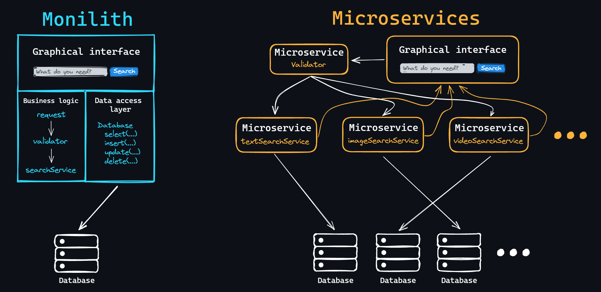</p>

    A monolith is a complete application that contains a single code base (written in a single technology stack and stored in a single repository) and has a single entry point to run the entire application. This is the most common approach for building applications alone or with a small team.

    -   Advantages:
        > -   Ease of development (everything in one style and in one place). <br>
        > -   Ease of deployment. <br>
        > -   Easy to scale at the start.
    -   Disadvantages:
        > -   Increasing complexity (as the project grows, the entry threshold for new developers increases). <br>
        > -   Time to assemble and start up is growing. <br>
        > -   Making it harder to add new functionality that affects old functionality. <br>
        > -   It is difficult (or impossible) to apply new technologies.

    A microservice is also a complete application with a single code base. But, unlike a monolith, such an application is responsible for only one functional unit. That is, it is a small service that solves only one task, but well.

    -   Advantages:
        > -   Each individual microservice can have its own technology stack and be developed independently. <br>
        > -   Easy to add new functionality (just create a new microservice). <br>
        > -   A lower entry threshold for new developers. <br>
        > -   Low time required for buildings and startups.
    -   Disadvantages:
        > -   The complexity of implementing interaction between all microservices. <br>
        > -   More difficult to operate than several copies of the monolith. <br>
        > -   Complexity of performing transactions. <br>
        > -   Changes affecting multiple microservices must be coordinated.

<details>
    <summary>🔗 <b>References</b></summary>

1. 📺 [**What are Microservices?** – YouTube](https://youtu.be/CdBtNQZH8a4)
2. 📺 [**Microservices Explained and their Pros & Cons** – YouTube](https://youtu.be/T-m7ZFxeg1A)
3. 📺 [**Microservice Architecture and System Design with Python & Kubernetes – Full Course** – YouTube](https://youtu.be/hmkF77F9TLw)
4. 📺 [**Node.js Microservices Full Course - Event-Driven Architecture with RabbitMQ** – YouTube](https://youtu.be/Zc2mQSQXoS4)
5. 📺 [**Building Microservices in Go (playlist)** – YouTube](https://youtube.com/playlist?list=PL7yAAGMOat_Fn8sAXIk0WyBfK_sT1pohu)
6. 📄 [**Awesome Microservices: collection of principles and technologies** – GitHub](https://github.com/mfornos/awesome-microservices)
7. 📄 [**Patterns for Microservices**](https://microservices.io/patterns/index.html)
 </details>

<div align="right"><a href="#top">Contents ⬆️</a></div>

-   ### Horizontal and vertical scaling

    <p align="center">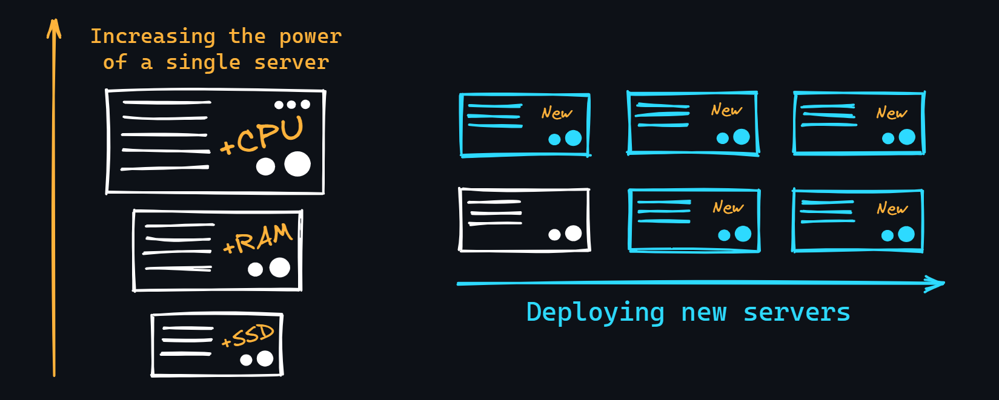</p>

    Over time, when the load on your application starts to grow (more users come, new functionality appears and, as a consequence, more CPU time is involved), it becomes necessary to increase the server capacity. There are [2 main approaches](<https://en.wikipedia.org/wiki/Scalability#Horizontal_(scale_out)_and_vertical_scaling_(scale_up)>) for this:

    -   Vertical scaling
        > It means increasing the capacity of the existing server. For example, this may include increasing the size of RAM, installing faster storage or increasing its volume, as well as the purchase of a new processor with a high clock frequency and/or a large number of cores and threads. Vertical scaling has its own limit, because we cannot increase the capacity of a single server for a long time.
    -   Horizontal scaling
        > The process of deploying new servers. This approach requires building a robust and scalable architecture that allows you to distribute the logic of the entire application across multiple physical machines.

<details>
    <summary>🔗 <b>References</b></summary>

1. 📺 [**System Design: What is Horizontal vs. Vertical Scaling?** – YouTube](https://youtu.be/p1YQU5sEz4g)
2. 📄 [**Vertical vs. Horizontal Scaling: Which one to choose**](https://middleware.io/blog/vertical-vs-horizontal-scaling/)
 </details>

<div align="right"><a href="#top">Contents ⬆️</a></div>

## Additional and similar resources

-   [Backend Developer Roadmap: Learn to become a modern backend developer](https://roadmap.sh/backend)
-   [Hussein Nasser – YouTube channel about network engineering](https://www.youtube.com/c/HusseinNasser-software-engineering)
-   [A curated and opinionated list of resources for Backend developers](https://github.com/zhashkevych/awesome-backend)
-   [Most important skills for Backend Developer](https://www.crio.do/blog/backend-development-career/)
-   [System Design Course](https://github.com/karanpratapsingh/system-design)
-   [Awesome Sysadmin: A curated list of open source sysadmin resources](https://github.com/awesome-foss/awesome-sysadmin)
-   [Awesome Network Automation](https://github.com/networktocode/awesome-network-automation)
-   [Computer Science courses with video lectures](https://github.com/Developer-Y/cs-video-courses)
-   [How To Secure A Linux Server](https://github.com/imthenachoman/How-To-Secure-A-Linux-Server)
-   [Mindmaps for cyber security](https://github.com/Ignitetechnologies/Mindmap)
-   [Awesome CTO – resources for Chief Technology Officers and VP R&D](https://github.com/kuchin/awesome-cto)
-   [Domain-Driven Design, software architecture, design patterns, best practices](https://github.com/Sairyss/domain-driven-hexagon)
-   [Best practices, tools, and guidelines for backend development](https://github.com/Sairyss/backend-best-practices)
-   [Resources related to distributed systems, system design, microservices, scalability, and performance](https://github.com/Sairyss/system-design-patterns)
-   [System Design 101: Explain complex systems using visuals and simple terms](https://github.com/ByteByteGoHq/system-design-101)

<p></p>
<div align="center">Made with 💙</div>
<div align="center"><a href="https://github.com/cheatsnake/backend-cheats/blob/master/LICENSE">LICENSE</a> 2022-Present</div
