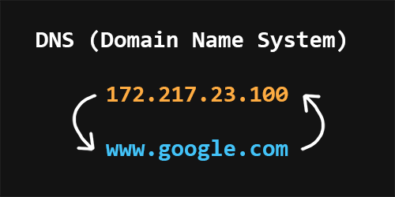

# Backend cheats

## Сеть и интернет

**Интернет** - это всемирная система объединяющая компьютерные сети со всего мира в единую сеть для хранения/передачи информации. К началу 2020 года количество пользователей в сети интерент перевалило за 4.5 млрд человек.

[Интернет — Википедия (wikipedia.org)](https://ru.wikipedia.org/wiki/%D0%98%D0%BD%D1%82%D0%B5%D1%80%D0%BD%D0%B5%D1%82)

[История Интернета — Википедия (wikipedia.org)](https://ru.wikipedia.org/wiki/%D0%98%D1%81%D1%82%D0%BE%D1%80%D0%B8%D1%8F_%D0%98%D0%BD%D1%82%D0%B5%D1%80%D0%BD%D0%B5%D1%82%D0%B0)

### Как устроен интернет

Ваш компьютер никогда не был связан с интернетом напрямую. Вместо этого, он видит только свою локальную сеть, в которую проводным (Ethernet) или беспроводным (Wi-Fi, Bluetooth) путем подключены другие устройства.

Для связи с интернетом в вашей локальной находиться специальный мини-компьютер - **маршрутизатор**. Далее этот маршрутизатор связывает вас с интернет-провайдером, который в свою очередь связан с другими провайдерами более высокого уровня. Таким образом, ваше сообщение, пройдя транзитом через сеть нескольких провайдеров, достигнет сеть назначения.

[Как работает Интернет - MDN (mozilla.org)](https://developer.mozilla.org/ru/docs/Learn/Common_questions/How_does_the_Internet_work)

[Основы программирования. Как работают сети? - YouTube](https://www.youtube.com/watch?v=k_0BAtyaDio&ab_channel=Winderton)

### Браузеры и как они работают

Большинство пользователей используют именно браузеры для работы в сети Интернет. Браузер - это клиент, с помощью которого можно отправлять запросы на сервер для получения файлов, которые впоследствии используются для отрисовки web-страниц.

[Как работают браузеры - MDN (mozilla.org)](https://developer.mozilla.org/ru/docs/Web/Performance/How_browsers_work)

### Что такое DNS

**DNS (Domain Name System)** - это децентрализованная система именования интернет-ресурсов, которая позволяет создавать удобные для человека буквеные наименования соответствующие числовым IP-адрессам, которые используются компьютерами.

[Система доменных имен DNS | Курс "Компьютерные сети" - YouTube](https://www.youtube.com/watch?v=B0J0c0KLtbQ&ab_channel=AndreySozykin)

[DNS — Википедия (wikipedia.org)](https://ru.wikipedia.org/wiki/DNS)

### Что такое доменное имя

### Хостинг

### TCP протокол

### UDP протокол

### Проблемы сети

### IPv4 и IPv6

### Трассировка маршрутов

## Протокол HTTP

### Формат протокола

### Откладка сети в Chrome Dev Tools

### Методы HTTP-запросов

### Коды ответов

### Заголовки

### Cookie

### CORS

### CSP

### Безопасность (HTTPS)

### Различия HTTP 1.0 и HTTP 1.1

### HTTP 2

### HTTP 3

### Работа с HTTP через терминал

### WebSockets

### API форматы

### Web сервера

#### NGNX

#### Apache httpd

## Общие знания

### Структуры данных

#### Хэш-таблицы

#### Очередь и стек

#### Связанные списки

#### Двусвязные списки

### Форматы хранения данных

#### Текстовые

JSON, YAML, XML

#### Бинарные

Message Pack, BSON, ProtoBuf

### Криптография

#### Хэши и хеш-функции

#### Цифровые подписи

#### Соль для подписей

#### Коллизия хэшей

## Язык программирования

Выберите для изучения один из языков _(Спсиок составлен по помему личному мнению)_:

-   [Go](https://github.com/avelino/awesome-go)
-   [JavaScript (Node.js)](https://github.com/sindresorhus/awesome-nodejs)
-   [Python](https://github.com/vinta/awesome-python)

### Базовые знания

#### Примитивные типы данных

#### Функции

#### Набор, массив, хеш-таблица, кортеж

#### Объекты/классы/структуры, прототипы/интерфейсы/миксины

#### Ссылки, указатели

#### Область видимости переменных

#### Garbage Collector

#### Преобразование типов

#### Слабая/сильная типизация в коде

#### Битовые операции

#### Обработка ошибок

### Распараллеливание

#### Процессы

#### Потоки

#### КоРутины

#### Проблемы Распараллеливания

#### Атомарные операции

#### Блокировки

### Пакетный менеджер

### Отладчик

### Запуск HTTP-сервера

### Кэширование

### Шаблонизация

### Ввод / Вывод (IO)

## Базовое ПО

### Система контроля версий Git

### Контейнеризация и Docker

### Postman / Insomnia

## Базы данных

### Реляционные базы данных

### Документоориентированные базы данных

### Redis

### Проблемы баз данных

## Дополнительные материалы и источники

-   [Backend Developer Roadmap: Learn to become a modern backend developer](https://roadmap.sh/backend)
-   [bzick/oh-my-backend: Backend Roadmap (from Junior to Senior)](https://github.com/bzick/oh-my-backend)
-   [zhashkevych/awesome-backend: 🚀 A curated and opinionated list of resources (English & Russian) for Backend developers](https://github.com/zhashkevych/awesome-backend)
