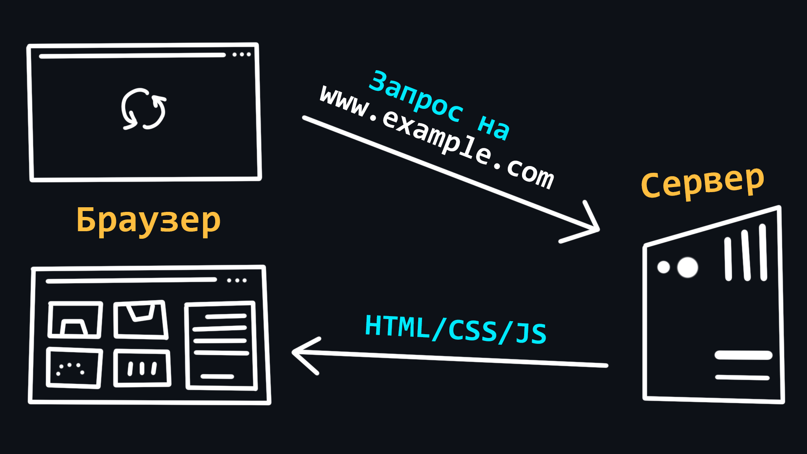
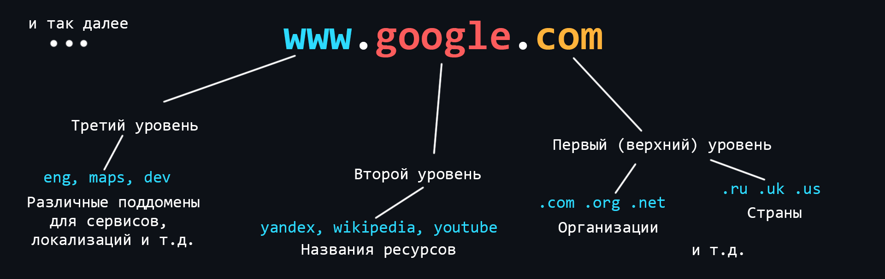
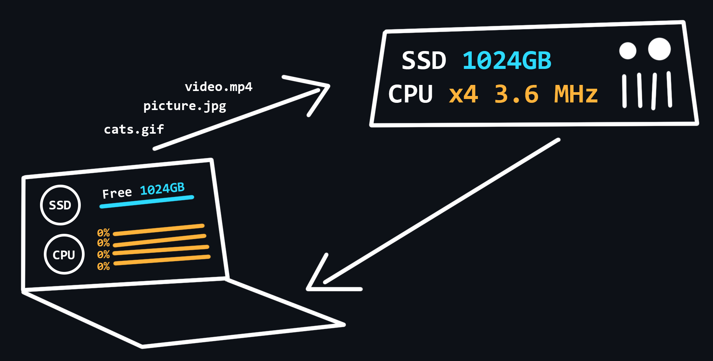
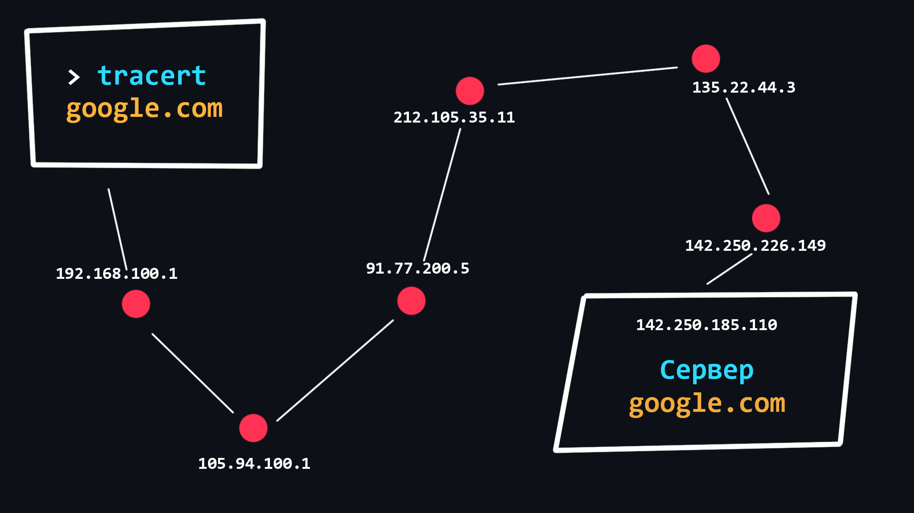

# Backend cheats

Данный репозиторий представляет собой наглядную шпаргалку по основным темам в области Backend-разработки. Весь материал разбит на темы и подтемы. Структура материала состоит из 3 частей:

-   **Визуальная часть** - различные изображения/таблицы для лучшего понимания (может отсутствовать). Все рисунки и таблицы сделаны с нуля, специально для этого репозитория.
-   **Краткое описание** - очень краткая выжимка информации, позволяющая понять лишь основную суть.
-   **Ссылки на источники** - ресурсы, где можно найти полную информацию по конкретному вопросу. По возможности мы стараемся указывать максимально авторитетные источники, либо же те, которые предоставляют информацию максимально простым и понятным языком.

## Содержание

## Сеть и интернет

**Интернет** - это всемирная система объединяющая компьютерные сети со всего мира в единую сеть для хранения/передачи информации. Изначально Интернет разрабатывался для нужд военных. Но вскоре он стал внедряться в учреждения образования (университеты), а затем его смогли использовать частные компании, которые начали организовывать сети провайдеров, предоставляющие услуги доступа в Интернет обычным гражданам. К началу 2020 года количество пользователей в сети Интернет перевалило за 4.5 млрд человек.

[Интернет — Википедия (wikipedia.org)](https://ru.wikipedia.org/wiki/%D0%98%D0%BD%D1%82%D0%B5%D1%80%D0%BD%D0%B5%D1%82)

[История Интернета — Википедия (wikipedia.org)](https://ru.wikipedia.org/wiki/%D0%98%D1%81%D1%82%D0%BE%D1%80%D0%B8%D1%8F_%D0%98%D0%BD%D1%82%D0%B5%D1%80%D0%BD%D0%B5%D1%82%D0%B0)

-   ### Как устроен Интернет

    

Ваш компьютер никогда не был связан с Интернетом напрямую. Вместо этого, он видит только свою локальную сеть, в которую проводным (Ethernet) или беспроводным (Wi-Fi, Bluetooth) путем подключены другие устройства.

Для связи с Интернетом в вашей локальной находиться специальный мини-компьютер - **маршрутизатор**. Далее этот маршрутизатор связывает вас с интернет-провайдером, который в свою очередь связан с другими провайдерами более высокого уровня. Таким образом, ваше сообщение, пройдя транзитом через сеть нескольких провайдеров, достигнет сеть назначения.

`Хост` _(host - принимающий)_ - любое устройство, которое находится в какой-либо сети.

`Сервер` _(serve - обслуживать)_ - специальный компьютер в сети, который обслуживает запросы поступающие от других компьютеров.

[Как работает Интернет - MDN (mozilla.org)](https://developer.mozilla.org/ru/docs/Learn/Common_questions/How_does_the_Internet_work)

[Основы программирования. Как работают сети? - YouTube](https://www.youtube.com/watch?v=k_0BAtyaDio&ab_channel=Winderton)

[Хост — что это такое и как он работает](https://anisim.org/articles/host/)

[Сервер — Википедия (wikipedia.org)](<https://ru.wikipedia.org/wiki/%D0%A1%D0%B5%D1%80%D0%B2%D0%B5%D1%80_(%D0%B0%D0%BF%D0%BF%D0%B0%D1%80%D0%B0%D1%82%D0%BD%D0%BE%D0%B5_%D0%BE%D0%B1%D0%B5%D1%81%D0%BF%D0%B5%D1%87%D0%B5%D0%BD%D0%B8%D0%B5)>)

[Что такое сервер и как он работает](https://timeweb.com/ru/community/articles/chto-takoe-server-i-kak-on-rabotaet)

-   ### Браузеры и как они работают

    

Браузер - это клиент, с помощью которого можно отправлять запросы на сервер для получения файлов, которые впоследствии используются для отрисовки web-страниц. Большинство пользователей используют именно браузеры для работы в сети Интернет.

[Как работают браузеры — MDN (mozilla.org)](https://developer.mozilla.org/ru/docs/Web/Performance/How_browsers_work)

[Браузер — Википедия (wikipedia.org)](https://ru.wikipedia.org/wiki/%D0%91%D1%80%D0%B0%D1%83%D0%B7%D0%B5%D1%80)

-   ### Что такое DNS

    

**DNS (Domain Name System)** - это децентрализованная система именования адрессов в Интернете, которая позволяет создавать удобные для человека буквеные наименования (доменные имена) соответствующие числовым IP-адрессам, которые используются компьютерами.

`IP-адресс` - уникальный идентификатор устройства находящегося в какой-либо сети.

[Система доменных имен DNS | Курс "Компьютерные сети" — YouTube](https://www.youtube.com/watch?v=B0J0c0KLtbQ&ab_channel=AndreySozykin)

[DNS — Википедия (wikipedia.org)](https://ru.wikipedia.org/wiki/DNS)

[IP адрес — HackWare.ru](https://hackware.ru/?p=11589)

[IP-адрес — Википедия (wikipedia.org)](https://ru.wikipedia.org/wiki/IP-%D0%B0%D0%B4%D1%80%D0%B5%D1%81)

-   ### Что такое доменное имя

    

Доменные имена представляют собой человеко-читаемые адреса веб-серверов, доступных в Интернете. Они состоят из частей (уровней) разделенных между собой точкой. Каждая из этих частей предоставляет специфическую информацию о доменном имени. Например страну, название сервиса, локализацию и т.д.

[Что такое доменные имена - MDN (mozilla.org)](https://developer.mozilla.org/ru/docs/Learn/Common_questions/What_is_a_domain_name)

-   ### Хостинг

    

**Хостинг** _(hosting)_ - специальная услуга, предоставляемая хостинг-провайдерами, которая позволяет арендовать пространство на сервере (который круглосуточно подключён к сети Интернет), где могут храниться ваши данные и файлы. Существуют различные варианты хостинга, где вы можете использовать не только дисковое пространство сервера, но и так же процессорную мощность для работы ваших сетевых приложений.

[Хостинг: варианты, сравнения, пользовательская статистика - habr.com](https://habr.com/ru/company/ruvds/blog/443522/)

[Хостинг: что это, зачем и как выбрать](https://vc.ru/services/74241-hosting-chto-eto-zachem-i-kak-vybrat)

-   ### TCP протокол

-   ### UDP протокол

-   ### Проблемы сети

-   ### IPv4 и IPv6

    

IPv4 и IPv6 соответственно 4 и 6 версии IP-адресса. IPv4 разработана в 1981 году и ограничивает адрессное пространство около 4.3 млрд (2^32) возможными уникальными адрессами. Вскоре распределение адресного пространства стало происходить значительно более быстрыми темпами, что вынудило создание новой версии IP-адресса для хранения большего количества адрессов. IPv6 способен обеспечить более 300 млн IP-адресов на каждого жителя Земли.

[IPv4 — Википедия (wikipedia.org)](https://ru.wikipedia.org/wiki/IPv4)

[IPv6 — Википедия (wikipedia.org)](https://ru.wikipedia.org/wiki/IPv6)

[В чём разница между протоколами IPv4 и IPv6](https://proxys.io/ru/blog/proksi-info/ipv4-i-ipv6)

-   ### Трассировка маршрутов

    

**Трассировка маршрута** - процедура, позволяющая отследить по каким узлам, с какими IP адресами, передаётся отправленный вами пакет прежде чем он достигнет точки назначения. Трассировка может применяться для выявления связанных с работой компьютерной сети проблем, а также для исследования/анализа сети.

[Трассировка сетевого маршрута — HackWare.ru](https://hackware.ru/?p=9210#12)

[Traceroute — Википедия (wikipedia.org)](https://ru.wikipedia.org/wiki/Traceroute)

## Протокол HTTP

-   ### Формат протокола

-   ### Методы HTTP-запросов

-   ### Коды ответов

-   ### Заголовки

-   ### Cookie

-   ### CORS

-   ### CSP

-   ### Безопасность (HTTPS)

-   ### Различия HTTP 1.0 и HTTP 1.1

-   ### HTTP 2

-   ### HTTP 3

-   ### Откладка сети в Chrome Dev Tools

-   ### Работа с HTTP через терминал

-   ### WebSockets

-   ### API форматы

-   ### Web сервера

    -   #### NGNX

    -   #### Apache httpd

## Общие знания

-   ### Структуры данных

    -   #### Хэш-таблицы

    -   #### Очередь и стек

    -   #### Связанные списки

    -   #### Двусвязные списки

-   ### Форматы хранения данных

-   #### Текстовые

JSON, YAML, XML

-   #### Бинарные

Message Pack, BSON, ProtoBuf

-   ### Криптография

    -   #### Хэши и хеш-функции

    -   #### Цифровые подписи

    -   #### Соль для подписей

    -   #### Коллизия хэшей

## Язык программирования

Выберите для изучения один из языков _(спсиок составлен по моему личному мнению)_:

-   [Go](https://github.com/avelino/awesome-go)
-   [JavaScript (Node.js)](https://github.com/sindresorhus/awesome-nodejs)
-   [Python](https://github.com/vinta/awesome-python)

*   ### Базовые знания

    -   #### Примитивные типы данных

    -   #### Функции

    -   #### Набор, массив, хеш-таблица, кортеж

    -   #### Объекты/классы/структуры, прототипы/интерфейсы/миксины

    -   #### Ссылки, указатели

    -   #### Область видимости переменных

    -   #### Сборщик мусора

    -   #### Преобразование типов

    -   #### Слабая/сильная типизация в коде

    -   #### Битовые операции

    -   #### Обработка ошибок

*   ### Распараллеливание

    -   #### Процессы

    -   #### Потоки

    -   #### КоРутины

    -   #### Проблемы распараллеливания

    -   #### Атомарные операции

    -   #### Блокировки

*   ### Пакетный менеджер

*   ### Отладчик

*   ### Запуск HTTP-сервера

*   ### Кэширование

*   ### Шаблонизация

*   ### Ввод / Вывод (IO)

## Базовое ПО

-   ### Система контроля версий Git

-   ### Контейнеризация и Docker

-   ### Postman / Insomnia

## Базы данных

-   ### Реляционные базы данных

-   ### Документоориентированные базы данных

-   ### Redis

-   ### Проблемы баз данных

## Дополнительные материалы и источники

-   [Backend Developer Roadmap: Learn to become a modern backend developer](https://roadmap.sh/backend)
-   [bzick/oh-my-backend: Backend Roadmap (from Junior to Senior)](https://github.com/bzick/oh-my-backend)
-   [zhashkevych/awesome-backend: 🚀 A curated and opinionated list of resources (English & Russian) for Backend developers](https://github.com/zhashkevych/awesome-backend)
