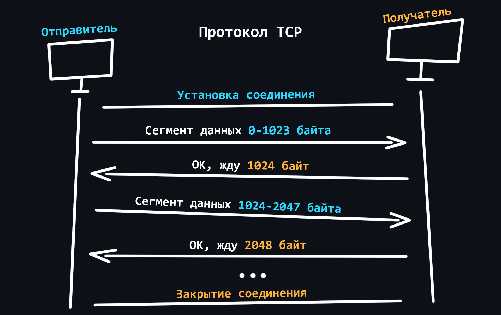
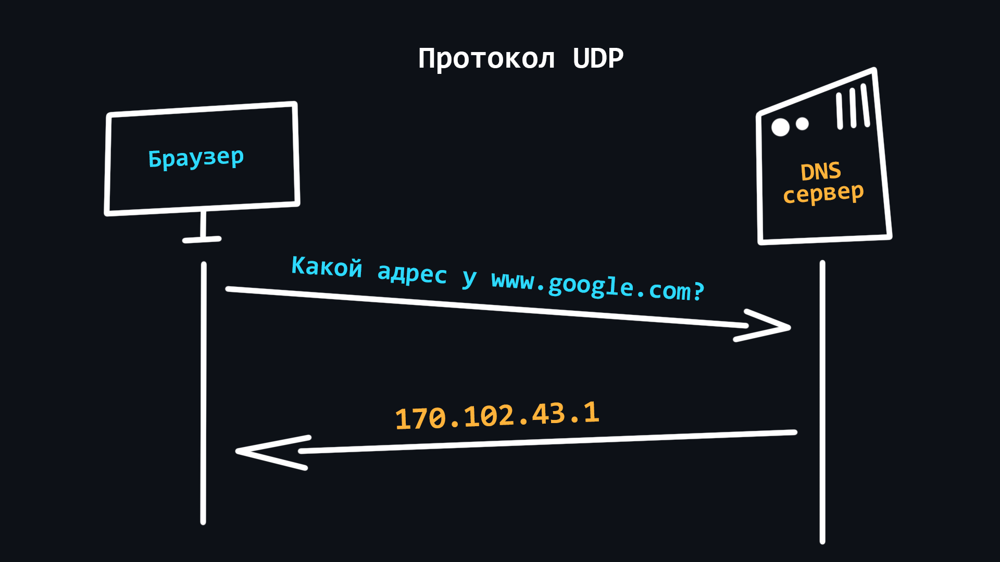
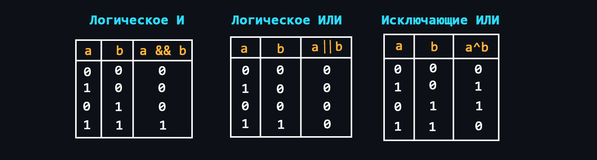

<a href="https://github.com/cheatsnake/backend-cheats/blob/master/README.md"><p align="center"></p></a>

Данный репозиторий представляет собой наглядную шпаргалку по основным темам в области Backend-разработки. Весь материал разбит на темы и подтемы. Структура материала состоит из трех частей:

-   **Визуальная часть** - различные изображения/таблицы/шпаргалки для лучшего понимания (может отсутствовать). Все рисунки и таблицы сделаны с нуля, специально для этого репозитория.
-   **Краткое описание** - очень краткая выжимка информации с перечнем основных терминов и понятий. На термины навешиваются гиперссылки ведущие на соответсвующий раздел в Википедии или подобном справочном ресурсе.
-   **Ссылки на источники** - ресурсы, где можно найти полную информацию по конкретному вопросу. По возможности, указываются максимально авторитетные источники, либо же те, которые предоставляют информацию максимально простым и понятным языком.

> 🛠 Репозиторий находится в стадии активной разработки, поэтому постоянно обновляется и дополняется

> 🤝 Если вы хотите помочь проекту, не стесняйтесь присылать свои [пулл реквесты](https://github.com/cheatsnake/backend-cheats/pulls)

> 📝 The translation into English will be start after all the main topics have been completed

<p><a name="top"></a></p>

## Содержание

<details>
    <summary><a href="#сеть-и-интернет">1. Сеть и интернет</a></summary>
    
-   [Как устроен интернет](#как-устроен-интернет)
-   [Что такое доменное имя](#что-такое-доменное-имя)
-   [Что такое DNS](#что-такое-dns)
-   [Устройство веб-приложений](#устройство-веб-приложений)
-   [Браузеры и как они работают](#браузеры-и-как-они-работают)
-   [VPN и Proxy](#vpn-и-proxy)
-   [Хостинг](#хостинг)
-   [Протокол HTTP](#протокол-http)
-   [Cтек протоколов TCP/IP](#cтек-протоколов-tcpip)
-   [IPv4 и IPv6](#ipv4-и-ipv6)
-   [Проблемы сети](#проблемы-сети)
-   [Диагностика сети](#диагностика-сети)
</details>

<details>
    <summary><a href="#операционные-системы">2. Операционные системы</a></summary>
    
-   [Как работают ОС](#как-работают-ос)
-   [Процессы и потоки](#процессы-и-потоки)
-   [Конкурентность и параллелизм](#конкурентность-и-параллелизм)
-   [Менеджер памяти](#менеджер-памяти)
-   [Межпроцессорное взаимодействие](#межпроцессорное-взаимодействие)
-   [Ввод и вывод (I/O)](#ввод-и-вывод-io)
</details>


<details>
    <summary><a href="#основы-linux">3. Основы Linux</a></summary>
    
-   [Работа с терминалом](#работа-с-терминалом)
-   [Менеджер пакетов](#менеджер-пакетов)
-   [Скрипты Bash](#скрипты-bash)
-   [Пользователи](#пользователи)
-   [Права доступа](#права-доступа)
-   [Работа с процессами](#работа-с-процессами)
-   [Работа с SSH](#работа-с-ssh)
-   [Планировщик задач](#планировщик-задач)
-   [Системные логи](#системные-логи)
-   [Проблемы в Linux](#проблемы-в-linux)
</details>


<details>
    <summary><a href="#общие-знания">4. Общие знания</a></summary>
    
-   [Системы счисления](#системы-счисления)
-   [Логические операции](#логические-операции)
-   [Структуры данных](#структуры-данных)
-   [Базовые алгоритмы](#базовые-алгоритмы)
-   [Оценка сложности алгоритмов](#оценка-сложности-алгоритмов)
-   [Форматы хранения данных](#форматы-хранения-данных)
-   [Кодировки текста](#кодировки-текста)
</details>


<details>
    <summary><a href="#язык-программирования">5. Язык программирования</a></summary>
    
-   [Классификация языков программирования](#классификация-языков-программирования)
-   [Основы языка](#основы-языка)
-   [Разработка серверов](#разработка-серверов)
-   [Многопоточность](#многопоточность)
-   [Продвинутые темы](#продвинутые-темы)
-   [Качество кода](#качество-кода)
</details>

<details>
    <summary><a href="#базы-данных">6. Базы данных</a></summary>
    
-   [Классификация баз данных](#классификация-баз-данных)
-   [Реляционная база данных](#реляционная-база-данных)
-   [MongoDB](#mongodb)
-   [Требования ACID](#требования-acid)
-   [Проектирование баз данных](#проектирование-баз-данных)
</details>

<details>
    <summary><a href="#разработка-api">7. Разработка API</a></summary>
    
-   [REST API](#rest-api)
-   [GraphQL](#graphql)
-   [WebSockets](#websockets)
-   [RPC и gRPC](#rpc-и-grpc)
-   [WebRTC](#webrtc)
</details>

<details>
    <summary><a href="#программное-обеспечение">8. Программное обеспечение</a></summary>
    
-   [Система контроля версий Git](#система-контроля-версий-git)
-   [Docker](#docker)
-   [Postman/Insomnia](#postmaninsomnia)
-   [Веб-сервера](#веб-сервера)
-   [Брокеры сообщений](#брокеры-сообщений)
</details>

<details>
    <summary><a href="#кэширование">9. Кэширование</a></summary>
    
-   [CDN](#cdn)
-   [Client side](#client-side)
-   [Redis](#redis)
-   [Memcached](#memcached)
</details>

<details>
    <summary><a href="#безопасность">10. Безопасность</a></summary>
    
-   [Уязвимости веб-приложений](#уязвимости-веб-приложений)    
-   [Переменные окружения](#переменные-окружения)
-   [Криптография](#криптография)
-   [Аунтификация и авторизация](#аунтификация-и-авторизация)
-   [SSL/TLS](#ssltls)
</details>

<details>
    <summary><a href="#тестирование">11. Тестирование</a></summary>
    
-   [Unit-тесты](#unit-тесты)
-   [Интеграционные тесты](#интеграционные-тесты)
-   [Функциональные тесты](#функциональные-тесты)
-   [E2E тесты](#e2e-тесты)
-   [Нагрузочное тестирование](#нагрузочное-тестирование)
-   [Регрессионное тестирование](#регрессионное-тестирование)
</details>

<details>
    <summary><a href="#документирование">12. Документирование</a></summary>
    
-   [Markdown](#markdown)
-   [Документация внутри кода](#документация-внутри-кода)
-   [Документирование API](#документирование-api)
-   [Генераторы статики](#генераторы-статики)
</details>

<details>
    <summary><a href="#построение-архитектуры">13. Построение архитектуры</a></summary>
    
-   [Архитектурные шаблоны](#архитектурные-шаблоны)
-   [Паттерны проектирования](#паттерны-проектирования)
-   [Монолитная и микросервисная архитектура](#монолитная-и-микросервисная-архитектура)
-   [Горизонтальное и вертикальное масштабирование](#горизонтальное-и-вертикальное-масштабирование)
</details>

## Сеть и интернет

[Интернет](https://ru.wikipedia.org/wiki/%D0%98%D0%BD%D1%82%D0%B5%D1%80%D0%BD%D0%B5%D1%82) - это всемирная система объединяющая компьютерные сети со всего мира в единую сеть для хранения/передачи информации. Изначально Интернет разрабатывался для военных. Но вскоре он стал внедряться в учреждения образования (университеты), а затем его смогли использовать частные компании, которые начали организовывать сети провайдеров, предоставляющие услуги доступа в Интернет обычным гражданам. К началу 2020 года количество пользователей в сети Интернет перевалило за 4.5 млрд человек.

-   ### Как устроен Интернет

    <p align="center"></p>

    Ваш компьютер никогда не был связан с Интернетом напрямую. Поскольку он способен видеть только свою локальную сеть, в которую проводным ([Ethernet](https://ru.wikipedia.org/wiki/Ethernet)) или беспроводным (Wi-Fi, Bluetooth) путем подключены другие устройства. Для связи с Интернетом в вашей локальной сети находиться специальный мини-компьютер – [маршрутизатор](https://ru.wikipedia.org/wiki/Маршрутизатор). Далее он связывает вас с [интернет-провайдером](https://ru.wikipedia.org/wiki/%D0%98%D0%BD%D1%82%D0%B5%D1%80%D0%BD%D0%B5%D1%82-%D0%BF%D1%80%D0%BE%D0%B2%D0%B0%D0%B9%D0%B4%D0%B5%D1%80), который в свою очередь связан с другими провайдерами более высокого уровня. Таким образом, ваше сообщение, проходит транзитом через сеть нескольких провайдеров, прежде чем достигнет сеть назначения.

    Интернет – это всего лишь длинный провод, к которому напрямую присоединены небольшое количество [провайдеров первого уровня](https://ru.wikipedia.org/wiki/Tier-1-%D0%BE%D0%BF%D0%B5%D1%80%D0%B0%D1%82%D0%BE%D1%80%D1%8B). Провайдеры уровня ниже просто арендуют доступ.

    -   [Хост](https://ru.wikipedia.org/wiki/Хост)
        > _(host - принимающий)_ любое устройство, которое находится в какой-либо сети.
    -   [Сервер](<https://ru.wikipedia.org/wiki/Сервер_(аппаратное_обеспечение)>)
        > _(serve - обслуживать)_ специальный компьютер в сети, который обслуживает запросы поступающие от других компьютеров.

<details>
    <summary>🔗 <b>Ссылки на материалы</b></summary>

1. 📄 [**Как работает Интернет** – MDN (mozilla.org)](https://developer.mozilla.org/ru/docs/Learn/Common_questions/How_does_the_Internet_work)
1. 📺 [**Основы программирования. Как работают сети?** – YouTube](https://www.youtube.com/watch?v=k_0BAtyaDio&ab_channel=Winderton)
1. 📄 [**Кому принадлежит сеть Интернет?**](https://setphone.ru/stati/komu-prinadlezhit-set-internet/)
1. 📄 [**Что такое сервер и как он работает**](https://timeweb.com/ru/community/articles/chto-takoe-server-i-kak-on-rabotaet)
1. 📄 [**Хост — что это такое и как он работает**](https://anisim.org/articles/host/)
</details>

<div align="right"><a href="#top">Содержание ⬆️</a></div>

-   ### Что такое доменное имя

    <p align="center"></p>

    [Доменные имена](https://ru.wikipedia.org/wiki/%D0%94%D0%BE%D0%BC%D0%B5%D0%BD%D0%BD%D0%BE%D0%B5_%D0%B8%D0%BC%D1%8F) - это человеко-читаемые адреса веб-серверов, доступных в Интернете. Они состоят из частей (уровней) разделенных между собой точкой. Каждая из этих частей предоставляет специфическую информацию о доменном имени. Например страну, название сервиса, локализацию и т.д.<br><br>

    -   Кто владеем доменными именами
        > Корпорация [ICANN](https://ru.wikipedia.org/wiki/ICANN) является основателем распределённой системы регистрации доменов. Она выдаёт аккредитации компаниям, которые хотят заниматься продажей доменов. Таким образом формируется конкурентный доменный рынок. 
    -   Как купить доменное имя
        > Доменное имя нельзя купить навсегда. Оно выдается в аренду на определенный срок. Покупать домены лучше у [аккредитованных регистраторов](https://www.icann.org/en/accredited-registrars?filter-letter=a&sort-direction=asc&sort-param=name&page=1) (найти их можно почти в любой стране).

<details>
    <summary>🔗 <b>Ссылки на материалы</b></summary>

1. 📄 [**Что такое доменные имена** – MDN (mozilla.org)](https://developer.mozilla.org/ru/docs/Learn/Common_questions/What_is_a_domain_name)
1. 📄 [**Как работают домены**](https://temoto.github.io/a/kak-rabotayut-domeny.html)
1. 📄 [**Доменное имя в призме закона** – habr.com](https://habr.com/ru/post/557786/)
</details>

<div align="right"><a href="#top">Содержание ⬆️</a></div>

-   ### Что такое DNS

    <p align="center"></p>

    [DNS (Domain Name System)](https://ru.wikipedia.org/wiki/DNS) - это децентрализованная система именования адресов в Интернете, которая позволяет создавать удобные для человека буквеные наименования (доменные имена) соответствующие числовым IP-адресам, которые используются компьютерами.

    -   [IP-адрес](https://ru.wikipedia.org/wiki/IP-%D0%B0%D0%B4%D1%80%D0%B5%D1%81)
        > Специальный номерной идентификатор который используется для распознования того или иного устройства в сети.
    -   [Порт](https://ru.wikipedia.org/wiki/%D0%9F%D0%BE%D1%80%D1%82_(%D0%BA%D0%BE%D0%BC%D0%BF%D1%8C%D1%8E%D1%82%D0%B5%D1%80%D0%BD%D1%8B%D0%B5_%D1%81%D0%B5%D1%82%D0%B8))
        > На одном устройстве (компьютере) может работать множество приложений, которые используют сеть. Для того, чтобы правильно распознать, куда и какие данные, пришедшие по сети, нужно доставить (в какое из приложений) используется специальный числовой номер – порт. То есть, каждый запущенный процесс на компьютере, который использует сетевое подключение, имеет свой личный порт.

<details>
    <summary>🔗 <b>Ссылки на материалы</b></summary>

1. 📄 [**Что такое DNS-сервер простыми словами**](https://guides.hexlet.io/ru/dns/)
1. 📺 [**Система доменных имен DNS** — YouTube](https://www.youtube.com/watch?v=B0J0c0KLtbQ&ab_channel=AndreySozykin)
1. 📄 [**Как это работает: Пара слов о DNS** – habr.com](https://habr.com/ru/company/1cloud/blog/309018/)
1. 📄 [**IP адрес**](https://hackware.ru/?p=11589)
1. 📄 [**Всё об IP адресах и о том, как с ними работать** – habr.com](https://habr.com/ru/post/350878/)
1. 📺 [**Порты и перенаправление\открытие портов. Инструкция и объяснения на пальцах** – YouTube](https://www.youtube.com/watch?v=SGmBv_klQ9I)
1. 📄 [**Список зарезервированных портов TCP и UDP** – Википедия](https://ru.wikipedia.org/wiki/%D0%A1%D0%BF%D0%B8%D1%81%D0%BE%D0%BA_%D0%BF%D0%BE%D1%80%D1%82%D0%BE%D0%B2_TCP_%D0%B8_UDP)
</details>

<div align="right"><a href="#top">Содержание ⬆️</a></div>

-   ### Устройство веб-приложений

    Современные [веб-приложения](https://ru.wikipedia.org/wiki/%D0%92%D0%B5%D0%B1-%D0%BF%D1%80%D0%B8%D0%BB%D0%BE%D0%B6%D0%B5%D0%BD%D0%B8%D0%B5) состоят из двух частей: клиентской (frontend) и серверной (backend). Тем самым реализуя [клиент-серверную архитектуру](https://ru.wikipedia.org/wiki/%D0%9A%D0%BB%D0%B8%D0%B5%D0%BD%D1%82_%E2%80%94_%D1%81%D0%B5%D1%80%D0%B2%D0%B5%D1%80). 

    Задачами клиентской части являются:
    -   Реализация пользовательского интерфейса (внешний вид приложения)
        > Для создания веб-страниц использются специальный язык разметки – [HTML](https://ru.wikipedia.org/wiki/HTML) <br>
        > Для стилизации шрифтов, расположения содержимого и т.д. используется язык стилей – [CSS](https://ru.wikipedia.org/wiki/CSS) <br>
        > Для добавления динамики и интерактивности – язык программирования [JavaScript](https://ru.wikipedia.org/wiki/JavaScript) <br>
        > Как правило в чистом виде эти инструменты используются редко, поскольку для более удобной и быстрой разработки существуют так называемые [фреймворки](https://2020.stateofjs.com/ru-RU/technologies/front-end-frameworks/) и [препроцессоры](https://mrmlnc.gitbooks.io/less-guidebook-for-beginners/content/chapter_1/css-reprocessors.html). <br>
    -   Cоздание функционала для формирования запросов к серверу
        > Как правило это различного вида формы ввода, с которыми можно удобно взаимодействовать. 
    -   Примем данных от сервера и их последующая обработка для вывода на клиент

    Задачи серверной части:
    -   Обработка клиентских запросов
        > Проверка на наличие прав и доступа, разного рода валидации и т.д.
    -   Выполнение бизнес логики
        > Здесь может подразумеватся широкий спектр задач: работа с базами данных, обработка информации, вычисления и т.д. Это, так сказать, самое сердце мира Backend. Здесь и происходит все самое важное и интересное.
    -   Формирование ответа и отправка его на клиент

<details>
    <summary>🔗 <b>Ссылки на материалы</b></summary>

1. 📄 [**Как работают веб-приложения** – habr.com](https://habr.com/ru/post/450282)
1. 📺 [**Как устроены веб-приложения? (Frontend/Backend)** – YouTube](https://youtu.be/nQBNH0x4YmI)
1. 📄 [**Базовый курс по фронтенду** – (MDN) mozilla.org](https://developer.mozilla.org/ru/docs/Learn/Front-end_web_developer)
1. 📄 [**Frontend Developer roadmap**](https://roadmap.sh/frontend)
1. 📄 [**Нативные, гибридные и web-приложения в сравнении** – medium.com](https://medium.com/nuances-of-programming/%D0%BD%D0%B0%D1%82%D0%B8%D0%B2%D0%BD%D1%8B%D0%B5-%D0%B3%D0%B8%D0%B1%D1%80%D0%B8%D0%B4%D0%BD%D1%8B%D0%B5-%D0%B8-web-%D0%BF%D1%80%D0%B8%D0%BB%D0%BE%D0%B6%D0%B5%D0%BD%D0%B8%D1%8F-%D0%B2-%D1%81%D1%80%D0%B0%D0%B2%D0%BD%D0%B5%D0%BD%D0%B8%D0%B8-b1360258df2d)
</details>

<div align="right"><a href="#top">Содержание ⬆️</a></div>

-   ### Браузеры и как они работают

    <p align="center"></p>

    [Браузер](https://ru.wikipedia.org/wiki/Браузер) – клиент, с помощью которого можно отправлять запросы на сервер для получения файлов, которые впоследствии используются для отрисовки web-страниц. Большинство пользователей используют именно браузеры для работы в сети Интернет.

<details>
    <summary>🔗 <b>Ссылки на материалы</b></summary>

1. 📄 [**Как работают браузеры** — MDN (mozilla.org)](https://developer.mozilla.org/ru/docs/Web/Performance/How_browsers_work)
1. 📄 [**Как работают браузеры — введение в безопасность веб-приложений** – habr.com](https://habr.com/ru/company/edison/blog/432870/)
1. 📄 [**Важные аспекты работы браузера для разработчиков** – habr.com](https://habr.com/ru/company/dataart/blog/304138/)
1. 📄 [**Что на самом деле происходит, когда пользователь вбивает в браузер адрес google.com** – habr.com](https://habr.com/ru/company/htmlacademy/blog/254825/)
1. 📄 [**Принципы работы современных веб-браузеров**](https://www.html5rocks.com/ru/tutorials/internals/howbrowserswork/)
1. 📄 [**Подробное объяснение того, как работает браузер (под капотом)**](https://russianblogs.com/article/7580365317/)
</details>


<div align="right"><a href="#top">Содержание ⬆️</a></div>

-   ### VPN и Proxy

    <p align="center"></p>

    Использование VPN и Proxy довольно распространенноё явление в последние годы. С помощью этих технологий пользователи могут получить базовую анонимность при серфинге в сети, а также обходить различные региональные блокировки.

    -   [VPN (Virtual Private Network)](https://ru.wikipedia.org/wiki/VPN)
        > Технология позволяющая стать участником приватной сети (подобной вашей локальной), где запросы всех участников проходят через единый публичный IP-адрес. Это позволяет Вам смешаться в общей массе запросов от других участников.<br>
        > - Простая процедура подключения и использования. <br>
        > - Надежное шифрование трафика. <br>
        > - Нет гарантии 100% анонимности, поскольку владелец сети знает IP-адреса всех участников. <br>
        > - VPN бесполезны для работы с мультиаккаунтами и некоторыми программами, поскольку все аккаунты, работающие с одного VPN легко обнаруживаются и блокируются. <br>
        > - Бесплатные VPN, как правило, имеют большую нагруженность, что приводит к нестабильной работе и снижению скорости загрузки данных. <br>
    -   [Proxy (прокси-сервер)](https://ru.wikipedia.org/wiki/%D0%9F%D1%80%D0%BE%D0%BA%D1%81%D0%B8-%D1%81%D0%B5%D1%80%D0%B2%D0%B5%D1%80)
        > Прокси это специальный сервер в сети, который выполняет роль посредника между Вами и конечным сервером к которому Вы намереваетесь обратиться. Когда Вы подключены к прокси-серверу все Ваши запросы будут выполняться от имени этого сервера, то есть IP-адрес и местоположение будут подменены. <br>
        > - Возможность использовать индивидуальный IP-адрес, что позволяет работать с мультиаккаунтами. <br>
        > - Стабильность соединения из-за отсутствия высоких нагрузок.<br>
        > - Подключение через прокси предусмотрено в самой ОС и браузере, поэтому доп. ПО не требуется. <br>
        > - Существуют разновидности прокси, которые обеспечивают высокий уровень анонимности. <br>
        > - Ненадежность бесплатных решений, поскольку прокси-сервер может видеть и контролировать всё, что вы делаете в интернете. <br>

<details>
    <summary>🔗 <b>Ссылки на материалы</b></summary>

1. 📄 [**Чем отличается VPN от прокси и что выбрать?**](https://hidemy.name/ru/articles/chem-otlichaetsja-proksi-i-vpn-chto-vybrat-proksi-server-ili-vpn/)
1. 📺 [**Что такое прокси-сервер за 7 минут** – YouTube](https://youtu.be/oeOuaqyYzSY)
1. 📺 [**Какая разница между Прокси и VPN** – YouTube](https://youtu.be/2QNKtyVwUDo)
1. 📄 [**Защищённые прокси — практичная альтернатива VPN** – habr.com](https://habr.com/ru/post/506356/)
</details>

<div align="right"><a href="#top">Содержание ⬆️</a></div>

-   ### Хостинг

    <p align="center"></p>

    [Хостинг (hosting)](https://ru.wikipedia.org/wiki/%D0%A5%D0%BE%D1%81%D1%82%D0%B8%D0%BD%D0%B3) - специальная услуга, предоставляемая [хостинг-провайдерами](https://ru.wikipedia.org/wiki/%D0%A5%D0%BE%D1%81%D1%82%D0%B8%D0%BD%D0%B3%D0%BE%D0%B2%D0%B0%D1%8F_%D0%BA%D0%BE%D0%BC%D0%BF%D0%B0%D0%BD%D0%B8%D1%8F), которая позволяет арендовать пространство на сервере (который круглосуточно подключён к сети Интернет), где могут храниться ваши данные и файлы. Существуют различные варианты хостинга, где вы можете использовать не только дисковое пространство сервера, но и так же процессорную мощность для работы ваших сетевых приложений.

    Основные виды:
    -   [Виртуальный хостинг](https://ru.wikipedia.org/wiki/%D0%92%D0%B8%D1%80%D1%82%D1%83%D0%B0%D0%BB%D1%8C%D0%BD%D1%8B%D0%B9_%D1%85%D0%BE%D1%81%D1%82%D0%B8%D0%BD%D0%B3)
        > Один физический сервер, который распределяет свои ресурсы на нескольких арендаторов.
    -   [VPS/VDS](https://ru.wikipedia.org/wiki/VPS)
        > Виртуальные серверы, эмулирующие работу отдельного физического сервера и предоставляемые в аренду клиенту с максимальными привилегиями.
    -   [Выделенный сервер](https://ru.wikipedia.org/wiki/%D0%92%D1%8B%D0%B4%D0%B5%D0%BB%D0%B5%D0%BD%D0%BD%D1%8B%D0%B9_%D1%81%D0%B5%D1%80%D0%B2%D0%B5%D1%80)
        > Аренда полноценного физического сервера с полным доступом ко всем ресурсам. Как правило, это самая дорогая услуга.
    -   [Облачный хостинг](https://ru.wikipedia.org/wiki/%D0%9E%D0%B1%D0%BB%D0%B0%D1%87%D0%BD%D0%B0%D1%8F_%D1%81%D0%B8%D1%81%D1%82%D0%B5%D0%BC%D0%B0_%D1%85%D1%80%D0%B0%D0%BD%D0%B5%D0%BD%D0%B8%D1%8F)
        > Услуга которая использует ресурсы нескольких серверов. При аренде пользователь платит только за используемые по факту ресурсы.
    -   [Колокация](https://ru.wikipedia.org/wiki/%D0%9A%D0%BE%D0%BB%D0%BE%D0%BA%D0%B0%D1%86%D0%B8%D1%8F)
        > Услуга предоставляющая клиенту возможность установить свое оборудование на территории провайдера.

<details>
    <summary>🔗 <b>Ссылки на материалы</b></summary>

1. 📺 [**Что такое хостинг, домен и как устроен интернет на понятном языке** – YouTube](https://youtu.be/v80A1i-82CE)
1. 📄 [**Что такое хостинг и домен сайта простыми словами**](https://guides.hexlet.io/ru/hosting/)
1. 📄 [**Хостинг: что это, зачем и как выбрать**](https://vc.ru/services/74241-hosting-chto-eto-zachem-i-kak-vybrat)
1. 📄 [**Хостинг: варианты, сравнения, пользовательская статистика** — habr.com](https://habr.com/ru/company/ruvds/blog/443522/)
1. 📄 [**VPS-хостинг и облачный хостинг: что выбрать и в чем разница?** – habr.com](https://habr.com/ru/company/ruvds/blog/320880/)
1. 📄 [**Колокейшн: как, зачем и почему** – habr.com](https://habr.com/ru/company/ruvds/blog/325136/)
</details>


<div align="right"><a href="#top">Содержание ⬆️</a></div>

-   ### Протокол HTTP

    [HTTP (HyperText Transport Protocol)](https://ru.wikipedia.org/wiki/HTTP) - cамый важный протокол интернета. Используется для передачи данных любого формата. Сам по себе протокол работает по простому принципу: запрос –> ответ.

    -   [Структура HTTP-сообщений](https://developer.mozilla.org/ru/docs/Web/HTTP/Messages#%D0%B7%D0%B0%D0%BF%D1%80%D0%BE%D1%81%D1%8B_http)
        > Стартовая строка > Заголовки > Тело сообщения

    <p align="center"></p>

    -   [Заголовки](https://developer.mozilla.org/ru/docs/Web/HTTP/Headers)
        > Дополнительная служебная информация которая отправляется вместе с запросом/ответом. <br>
        > Основные: [Host](https://developer.mozilla.org/ru/docs/Web/HTTP/Headers/Host), [User-Agent](https://developer.mozilla.org/ru/docs/Web/HTTP/Headers/User-Agent), [If-Modified-Since](https://developer.mozilla.org/ru/docs/Web/HTTP/Headers/If-Modified-Since), [Cookie](https://developer.mozilla.org/ru/docs/Web/HTTP/Headers/Cookie), [Referer](https://developer.mozilla.org/ru/docs/Web/HTTP/Headers/Referer), [Authorization](https://developer.mozilla.org/ru/docs/Web/HTTP/Headers/Authorization), [Cache-Control](https://developer.mozilla.org/ru/docs/Web/HTTP/Headers/Cache-Control), [Content-Type](https://developer.mozilla.org/en-US/docs/Web/HTTP/Headers/Content-Type), [Content-Length](https://developer.mozilla.org/ru/docs/Web/HTTP/Headers/Content-Length), [Last-Modified](https://developer.mozilla.org/ru/docs/Web/HTTP/Headers/Last-Modified), [Set-Cookie](https://developer.mozilla.org/ru/docs/Web/HTTP/Headers/Set-Cookie), [Content-Encoding](https://developer.mozilla.org/ru/docs/Web/HTTP/Headers/Content-Encoding).
    -   [Методы запросов](https://developer.mozilla.org/ru/docs/Web/HTTP/Methods)
        > [GET](https://developer.mozilla.org/ru/docs/Web/HTTP/Methods/GET) - запрос на получение данных <br> [POST](https://developer.mozilla.org/ru/docs/Web/HTTP/Methods/POST) - запрос с передачей данных для создания новой записи <br> [PUT](https://developer.mozilla.org/ru/docs/Web/HTTP/Methods/PUT) - запрос с передачей данных для изменения записи <br> [DELETE](https://developer.mozilla.org/en-US/docs/Web/HTTP/Methods/DELETE) - запрос на удаление записи <br> Другие: [HEAD](https://developer.mozilla.org/en-US/docs/Web/HTTP/Methods/HEAD), [CONNECT](https://developer.mozilla.org/en-US/docs/Web/HTTP/Methods/CONNECT), [OPTIONS](https://developer.mozilla.org/ru/docs/Web/HTTP/Methods/OPTIONS), [TRACE](https://developer.mozilla.org/en-US/docs/Web/HTTP/Methods/TRACE), [PATCH](https://developer.mozilla.org/en-US/docs/Web/HTTP/Methods/PATCH). <br>
    -   [Коды состояния](https://developer.mozilla.org/ru/docs/Web/HTTP/Status)
        > Каждый ответ от сервера имеет специальный числовой код, который характеризует состояние отправленного запроса. Эти коды делятся на 5 основных классов:
        > -   1хх - служебная информация <br>
        > -   2хх - успешный запрос <br>
        > -   3хх - перенаправление на другой адресс <br>
        > -   4хх - ошибка на стороне клиента <br>
        > -   5хх - ошибка на стороне сервера <br>
    -   [HTTPS](https://ru.wikipedia.org/wiki/HTTPS)
        > Тот же HTTP, но с поддержкой шифрования
    -   [Cookie](https://developer.mozilla.org/ru/docs/Web/HTTP/Cookies)
        > Поскольку протокол HTTP не позволяет сохранять никакой информации о состояниях предыдущих запросов/ответов, возникает необходимость в использовании cookie. Куки позволяют серверу хранить различную информацию на стороне клиента, которую впоследующем клиент может отсылать обратно на сервер. В частности куки могут использоваться для авторизации или для сохранения различных параметров/настроек.
    -   [CORS (Cross origin resource sharing)](https://ru.wikipedia.org/wiki/Cross-origin_resource_sharing)
        > Технология, которая позволяет одному домену получать данные от другого.
    -   [CSP (Content Security Policy)](https://developer.mozilla.org/ru/docs/Web/HTTP/CSP)
        > Специальный заголовок позволяющий распознавать и устранять определённые типы уязвимостей веб-приложения.
    -   [HTTP/1.0 vs HTTP/1.1 vs HTTP/2](https://ru.wikipedia.org/wiki/HTTP#%D0%98%D1%81%D1%82%D0%BE%D1%80%D0%B8%D1%8F_%D1%80%D0%B0%D0%B7%D0%B2%D0%B8%D1%82%D0%B8%D1%8F)
        > Главным нововведением в вeрсии 1.1 является режим "постоянного соединения", который позволяет посылать несколько запросов за одно подключение. Во второй версии протокол стал бинарным, появилась возможность передачи данных нескольких потоков по одному каналу.

<details>
    <summary>🔗 <b>Ссылки на материалы</b></summary>

1. 📄 [**Протокол HTTP** – MDN (mozilla.org)](https://developer.mozilla.org/ru/docs/Web/HTTP)
1. 📺 [**Протокол HTTP | Курс компьютерные сети** – YouTube](https://youtu.be/RlccXUx4LVw)
1. 📄 [**Простым языком об HTTP** – habr.com](https://habr.com/ru/post/215117)
1. 📄 [**Что такое протокол HTTPS, и как он защищает вас в интернете**](https://guides.hexlet.io/ru/https-yandex-guide/)
1. 📺 [**Как работает HTTPS?** – YouTube](https://youtu.be/B3j4SS5P8tM)
1. 📺 [**Что такое cookies браузера** – YouTube](https://youtu.be/Ri3IAb6tdlE)
1. 📄 [**Что такое cookie в браузере и почему на многих сайтах предупреждают об их использовании?**](https://club.dns-shop.ru/blog/t-326-internet/47805-chto-takoe-cookie-v-brauzere-i-pochemu-na-mnogih-saitah-preduprejd)
1. 📄 [**CORS для чайников: история возникновения, как устроен и оптимальные методы работы** – habr.com](https://habr.com/ru/company/macloud/blog/553826/)
1. 📄 [**Улучшение сетевой безопасности с помощью Content Security Policy** – habr.com](https://habr.com/ru/company/nix/blog/271575/?)
1. 📄 [**Путь к HTTP/2** – habr.com](https://habr.com/ru/post/308846/)
1. 📄 [**Evolution of HTTP** – MDN (mozilla.org)](https://developer.mozilla.org/ru/docs/Web/HTTP/Basics_of_HTTP/Evolution_of_HTTP)
</details>

<div align="right"><a href="#top">Содержание ⬆️</a></div>

-   ### Cтек протоколов TCP/IP

    <p align="center"></p>

    -   [Стек TCP/IP](https://ru.wikipedia.org/wiki/TCP/IP)
        > Модель (набор правил), которая описывает способ передачи данных от источника информации к получателю. Будет полезно иметь общее представление, как ваши данные проходят через все уровни протоколов.

    <p align="center" style="display: 'flex'; flex-direction: 'row';">
        
        
    </p>

    -   [TCP](https://ru.wikipedia.org/wiki/Transmission_Control_Protocol)
        > Протокол обеспечивающий надежную передачу данных. TCP гарантирует доставку данных и сохранение порядка следования сообщений. Но это сказывается на скорости передачи. Данный протокол используется там, где потеря информации недопустима, например для отправки почты.
    -   [UDP](https://ru.wikipedia.org/wiki/UDP)
        > Простой протокол с быстрой передачей данных. Он не использует механизмов для гарантирования доставки и порядка следования данных. Используется, например в онлайн-играх, где частичная потеря пакетов не критична, но скорость передачи данных имеет гораздо более важное значение. Так же, запросы к DNS-серверам происходят через UDP протокол.
    -   [IP (Internet Protocol)](https://ru.wikipedia.org/wiki/IP)
        > На этом этапе формируются [IP-пакеты](https://ru.wikipedia.org/wiki/%D0%9F%D0%B0%D0%BA%D0%B5%D1%82_(%D1%81%D0%B5%D1%82%D0%B5%D0%B2%D1%8B%D0%B5_%D1%82%D0%B5%D1%85%D0%BD%D0%BE%D0%BB%D0%BE%D0%B3%D0%B8%D0%B8)), которые содержат все необходимые данные для доставки по сети.
    -   [MAC-адрес](https://ru.wikipedia.org/wiki/MAC-%D0%B0%D0%B4%D1%80%D0%B5%D1%81)
        > Уникальный идентификатор, назначенный сетевому адаптеру какого-либо устройства.

<details>
    <summary>🔗 <b>Ссылки на материалы</b></summary>

1. 📺 [**Модель и стек протоколов TCP/IP** — YouTube](https://www.youtube.com/watch?v=UZo4ffQ-aAc&list=PLtPJ9lKvJ4oiNMvYbOzCmWy6cRzYAh9B1&index=8&ab_channel=AndreySozykin)
1. 📺 [**What is TCP/IP? (ENG)** – YouTube](https://youtu.be/PpsEaqJV_A0)
1. 📺 [**Что такое TCP/IP: Объясняем на пальцах** – YouTube](https://youtu.be/2I1HnSN1H9o)
1. 📺 [**Протокол TCP** — YouTube](https://www.youtube.com/watch?v=CKUOb4htnB4&ab_channel=AndreySozykin)
1. 📺 [**Протокол UDP** — YouTube](https://www.youtube.com/watch?v=GBrLfZvRrd8&ab_channel=AndreySozykin)
1. 📄 [**Всё, что вы хотели знать о МАС адресе** — habr.com](https://habr.com/ru/post/483670/)
</details>

<div align="right"><a href="#top">Содержание ⬆️</a></div>

-   ### IPv4 и IPv6

    <p align="center"></p>

    [IPv4](https://ru.wikipedia.org/wiki/IPv4) и [IPv6](https://ru.wikipedia.org/wiki/IPv6)  – соответственно 4 и 6 версии IP-протокола. IPv4 разработан в 1981 году и ограничивает адресное пространство около 4.3 млрд (2^32) возможными уникальными адресами. Со временем распределение адресного пространства стало происходить значительно более быстрыми темпами, что вынудило создание новой версии IP-протокола для хранения большего количества адресов. IPv6 способен выдать 2^128 уникальных адрессов.

<details>
    <summary>🔗 <b>Ссылки на материалы</b></summary>

1. 📄 [**Протоколы IPv4 и IPv6. В чем разница и что лучше?**](https://bezopasnik.info/%D0%BF%D1%80%D0%BE%D1%82%D0%BE%D0%BA%D0%BE%D0%BB%D1%8B-ipv4-%D0%B8-ipv6-%D0%B2-%D1%87%D0%B5%D0%BC-%D1%80%D0%B0%D0%B7%D0%BD%D0%B8%D1%86%D0%B0-%D0%B8-%D1%87%D1%82%D0%BE-%D0%BB%D1%83%D1%87%D1%88%D0%B5/)
1. 📺 [**Адреса IPv6 | Компьютерные сети. Продвинутые темы** – YouTube](https://youtu.be/KRAKAAJTxTg)
1. 📄 [**IPv6: как организовать миграцию и в чем преимущества перехода**](https://itglobal.com/ru-ru/company/blog/ipv6-migration/)
1. 📺 [**IPv6 - от слов к делу** – YouTube](https://youtu.be/xYQP0iXr3A0)
</details>

<div align="right"><a href="#top">Содержание ⬆️</a></div>

-   ### Проблемы сети

    <p align="center"></p>

    Качество работы сетей, и тем более интернета, далеко от идеала. Это обусловлено сложной и рассредоточенной по разным устройствам структурой сети. Поэтому на функционирование сети влияет огромное количеств факторов. Например: стабильность соединения между устройством клиента и его роутером, качество услуг провайдера, мощность и производительность сервера, физическое расстояние между клиентом и сервером и т.д.

    -   [Latency (задержка)](https://developer.mozilla.org/ru/docs/Web/Performance/Understanding_latency)
        > Время которое требуется, чтобы пакет данных дошёл от отправителя к получателю. В большей степени зависит от физического расстояния.
    -   [Packet loss (потеря пакетов)](https://en.wikipedia.org/wiki/Packet_loss)
        > Не все пакеты, путешествуя по сети, могут добраться до места назначения. Чаще всего такое происоходит при использовании беспроводных сетей или из-за [перегрузок сети](https://ru.wikipedia.org/wiki/%D0%9F%D0%B5%D1%80%D0%B5%D0%B3%D1%80%D1%83%D0%B7%D0%BA%D0%B0_%D1%81%D0%B5%D1%82%D0%B8).
    -   [Round Trip Time (RTT)](https://ru.wikipedia.org/wiki/%D0%9A%D1%80%D1%83%D0%B3%D0%BE%D0%B2%D0%B0%D1%8F_%D0%B7%D0%B0%D0%B4%D0%B5%D1%80%D0%B6%D0%BA%D0%B0)
        > Время, за которое пакет данных доходит до пункта назначения + время на ответ о том, что пакет был получен успешно.
    -   [Jitter](https://ru.wikipedia.org/wiki/%D0%94%D0%B6%D0%B8%D1%82%D1%82%D0%B5%D1%80#%D0%92_%D1%82%D0%B5%D0%BB%D0%B5%D0%BA%D0%BE%D0%BC%D0%BC%D1%83%D0%BD%D0%B8%D0%BA%D0%B0%D1%86%D0%B8%D1%8F%D1%85)
        > Колебания задержки (нестабильный ping, например, то 50ms, то 120ms, то 35ms...).
    -   [Packet reordering](https://wiki.geant.org/display/public/EK/PacketReordering)
        > Протокол IP не гарантирует, что пакеты будут доставляются в том порядке, в котором они были отправлены.

<details>
    <summary>🔗 <b>Ссылки на материалы</b></summary>

1. 📄 [**Лаги, джиттер и потеря пакетов: откуда берутся проблемы с неткодом и как их решать** – habr.com](https://habr.com/ru/company/pixonic/blog/559780/)
1. 📄 [**Внутренние механизмы ТСР, влияющие на скорость загрузки: часть 1** – habr.com](https://habr.com/ru/company/webo/blog/326258/)
1. 📄 [**Внутренние механизмы ТСР, влияющие на скорость загрузки: часть 2** – habr.com](https://habr.com/ru/company/webo/blog/327050/)
</details>

<div align="right"><a href="#top">Содержание ⬆️</a></div>

-   ### Диагностика сети

    <p align="center"></p>

    -   [Трассировка сетевого маршрута](https://ru.wikipedia.org/wiki/Traceroute)
        > Процедура, позволяющая отследить по каким узлам, с какими IP адресами, передаётся отправленный вами пакет прежде чем он достигнет точки назначения. Трассировка может применяться для выявления связанных с работой компьютерной сети проблем, а также для исследования/анализа сети.
    -   [Ping-сканирование](https://ru.wikipedia.org/wiki/Ping)
        > Самый простой способ проверить сервер на работоспособность.
    -   [Проверка на потерю пакетов](https://ru.wikihow.com/%D0%BF%D1%80%D0%BE%D0%B2%D0%B5%D1%80%D0%B8%D1%82%D1%8C-%D0%BF%D0%BE%D1%82%D0%B5%D1%80%D1%8E-%D0%BF%D0%B0%D0%BA%D0%B5%D1%82%D0%BE%D0%B2-%D0%BD%D0%B0-%D0%BA%D0%BE%D0%BC%D0%BF%D1%8C%D1%8E%D1%82%D0%B5%D1%80%D0%B5)
    -   [Wireshark](https://ru.wikipedia.org/wiki/Wireshark)
        > Мощная программа с графическим интерфейсом для анализа всего трафика, проходящего по сети, в режиме реального времени.

<details>
    <summary>🔗 <b>Ссылки на материалы</b></summary>

1. 📄 [**Как находить проблемы с интернетом и кто виноват: часть 1** – habr.com](https://habr.com/ru/post/530324/)
1. 📄 [**Как находить проблемы с интернетом и кто виноват: часть 2** – habr.com](https://habr.com/ru/post/531082/)
1. 📄 [**Прочитай и сделай: проводим сканирование сети самостоятельно** – habr.com](https://habr.com/ru/company/pt/blog/513776/)
1. 📺 [**Основы компьютерных сетей. Диагностика и устранение основных проблем** – YouTube](https://youtu.be/duBeaGZzW7U)
1. 📄 [**Трассировка сетевого маршрута** — hackware.ru](https://hackware.ru/?p=9210#12)
1. 📄 [**Wireshark — приручение акулы** – habr.com](https://habr.com/ru/post/204274/)
1. 📺 [**Протокол HTTPS в WireShark** – YouTube](https://youtu.be/1r1iWq67v3c)
</details>


<div align="right"><a href="#top">Содержание ⬆️</a></div>

## Операционные системы

[Операционная система (ОС)](https://ru.wikipedia.org/wiki/%D0%9E%D0%BF%D0%B5%D1%80%D0%B0%D1%86%D0%B8%D0%BE%D0%BD%D0%BD%D0%B0%D1%8F_%D1%81%D0%B8%D1%81%D1%82%D0%B5%D0%BC%D0%B0) – это комплексная программная система, которая предназначена для управления ресурсами компьютера. Благодаря операционным системам людям не приходится иметь дело непосредственно с процессором, оперативной памятью или другими составляющими ПК. 

То есть, ОС можно представить как слой абстракции, который управляет железом (hardware) компьютера, тем самым предоставляя простую и удобную среду для работы пользовательского софта (software).

-   ### Устройство ОС

    <p align="center"></p>

    -   Необходимые понятия
        - [Компьютерная программа](https://ru.wikipedia.org/wiki/%D0%9A%D0%BE%D0%BC%D0%BF%D1%8C%D1%8E%D1%82%D0%B5%D1%80%D0%BD%D0%B0%D1%8F_%D0%BF%D1%80%D0%BE%D0%B3%D1%80%D0%B0%D0%BC%D0%BC%D0%B0)
            > Последовательность инструкций, предназначенных для выполнения процессором.
        - [Компьютерная память](https://ru.wikipedia.org/wiki/%D0%9A%D0%BE%D0%BC%D0%BF%D1%8C%D1%8E%D1%82%D0%B5%D1%80%D0%BD%D0%B0%D1%8F_%D0%BF%D0%B0%D0%BC%D1%8F%D1%82%D1%8C)
            > Компьютер имеет 2 типа памяти:
            > - постоянную (для долговременного хранения данных) <br>
            > - оперативную (для временного хранения кода программы, а также входных, выходных и промежуточных данных, обрабатываемых процессором)
        - [Процессор (ЦП)](https://ru.wikipedia.org/wiki/%D0%A6%D0%B5%D0%BD%D1%82%D1%80%D0%B0%D0%BB%D1%8C%D0%BD%D1%8B%D0%B9_%D0%BF%D1%80%D0%BE%D1%86%D0%B5%D1%81%D1%81%D0%BE%D1%80)
            > Важнейшее устройство любого компьютера, которое исполняет инструкции (код программы).
        - [Устройства ввода-вывода](https://ru.wikipedia.org/wiki/%D0%A3%D1%81%D1%82%D1%80%D0%BE%D0%B9%D1%81%D1%82%D0%B2%D0%BE_%D0%B2%D0%B2%D0%BE%D0%B4%D0%B0-%D0%B2%D1%8B%D0%B2%D0%BE%D0%B4%D0%B0)
            > Устройства с помощь которых можно вводить информацию в компьютер (клавиатура, мышь...) и выводить (монитор, наушники...).
    -   Основные функции
        > - Управление оперативной памятью (выделение пространства для отдельных программ) <br>   
        > - Загрузка программ в оперативную память и их выполнение <br>
        > - Выполнение запросов поступающих от пользовательских программ (ввод и вывод данных, запуск и остановка других программ, высвобождение памяти или выделение дополнительной...) <br>
        > - Взаимодействие с устройствами ввода и вывода (мышь, клавиатура, монитор...) <br>
        > - Взаимодействие с носителями информации (жесткие диски, SSD...) <br>
        > - Предоставление пользовательского интерфейса (консольная оболочка или графичекий интерфейс) <br>
        > - Введение журнала об программных ошибках (сохранение логов)
    -   Дополнительные функции (могуть быть не во всех ОС)
        > - Огранизация [многозадачности](https://ru.wikipedia.org/wiki/%D0%9C%D0%BD%D0%BE%D0%B3%D0%BE%D0%B7%D0%B0%D0%B4%D0%B0%D1%87%D0%BD%D0%BE%D1%81%D1%82%D1%8C) (одновременное выполнение нескольких программ) <br> 
        > - Разграничивание доступа к ресурсам для каждого процесса <br>
        > - [Взаимодействие между процессами](https://ru.wikipedia.org/wiki/%D0%9C%D0%B5%D0%B6%D0%BF%D1%80%D0%BE%D1%86%D0%B5%D1%81%D1%81%D0%BD%D0%BE%D0%B5_%D0%B2%D0%B7%D0%B0%D0%B8%D0%BC%D0%BE%D0%B4%D0%B5%D0%B9%D1%81%D1%82%D0%B2%D0%B8%D0%B5) (обмен данными, синхронизация) <br>
        > - Организация защиты самой ОС от других программ и действий самого пользователя <br>
        > - Предоставление многопользовательского режима и разграничение прав между разными пользователями ОС (админ, гость...)
    -   [Ядро ОС](https://ru.wikipedia.org/wiki/%D0%AF%D0%B4%D1%80%D0%BE_%D0%BE%D0%BF%D0%B5%D1%80%D0%B0%D1%86%D0%B8%D0%BE%D0%BD%D0%BD%D0%BE%D0%B9_%D1%81%D0%B8%D1%81%D1%82%D0%B5%D0%BC%D1%8B)
        > Центральная часть ОС, которая используется наиболее интенсивно. Ядро постоянно находится в памяти, в то время как другие части ОС загружаются в память и выгружаются из неё по мере надобности.
    -   [Загрузчик ОС](https://ru.wikipedia.org/wiki/%D0%97%D0%B0%D0%B3%D1%80%D1%83%D0%B7%D1%87%D0%B8%D0%BA_%D0%BE%D0%BF%D0%B5%D1%80%D0%B0%D1%86%D0%B8%D0%BE%D0%BD%D0%BD%D0%BE%D0%B9_%D1%81%D0%B8%D1%81%D1%82%D0%B5%D0%BC%D1%8B)
        > Системный софт, который обеспечивает подготовку окружения для запуска ОС (приводит аппарутуру в нужное состояние, подготавливет память, загружает туда ядро ОС и передает ему (ядру) управление).
    -   [Драйверы](https://ru.wikipedia.org/wiki/%D0%94%D1%80%D0%B0%D0%B9%D0%B2%D0%B5%D1%80)
        > Специальное ПО, которое позволяет ОС работать с тем или иным оборудованием.

<details>
    <summary>🔗 <b>Ссылки на материалы</b></summary>

1. 📺 [**Что такое операционная система и как она работает** – YouTube](https://www.youtube.com/watch?v=hb9CTGSJm88&t)
1. 📺 [**Плейлист по операционным системам** – YouTube](https://www.youtube.com/playlist?list=PLo6puixMwuSPrKOCsJhrtr-m79mFthit9)
1. 📄 [**Что такое операционная система и как она работает?** – GitHub](https://github.com/Steindvart/My_study/blob/master/docs/source/OS/articles/what_is_os.rst)
1. 📺 [**Что такое ядро операционной системы? Назначение и виды ядер** – YouTube](https://youtu.be/Bdh88Fd--54)
1. 📺 [**Устройство компьютерных программ: Как работает программа? Как компилируется код?** – YouTube](https://youtu.be/ZIHkLkCQ-B8)
1. 📺 [**Как работает память компьютера** – YouTube](https://youtu.be/Wh22_O8jXVQ)
1. 📺 [**Как работает процессор** – YouTube](https://youtu.be/k9wK2FThEsk)
</details>


<div align="right"><a href="#top">Содержание ⬆️</a></div>

-   ### Процессы и потоки

    <p align="center"></p>

    -   [Процесс](https://ru.wikipedia.org/wiki/%D0%9F%D1%80%D0%BE%D1%86%D0%B5%D1%81%D1%81_(%D0%B8%D0%BD%D1%84%D0%BE%D1%80%D0%BC%D0%B0%D1%82%D0%B8%D0%BA%D0%B0)) 
        > Cвоего рода контейнер, в котором находятся все необходимые ресурсы для работы той или иной программы. Как правило в состав процесса входят:
        > -   Исполняемый код программы <br>
        > -   Входные и выходные данные <br>
        > -   [Стек вызовов](https://ru.wikipedia.org/wiki/%D0%A1%D1%82%D0%B5%D0%BA_%D0%B2%D1%8B%D0%B7%D0%BE%D0%B2%D0%BE%D0%B2) (порядок инструкций для выполнения) <br>
        > -   [Куча](https://ru.wikipedia.org/wiki/%D0%9A%D1%83%D1%87%D0%B0_(%D0%BF%D0%B0%D0%BC%D1%8F%D1%82%D1%8C)) (структура для хранения промежуточных данных, создаваемых во время работы процесса) <br>
        > -   [Дескриптор сегмента](https://ru.wikipedia.org/wiki/%D0%94%D0%B5%D1%81%D0%BA%D1%80%D0%B8%D0%BF%D1%82%D0%BE%D1%80_%D1%81%D0%B5%D0%B3%D0%BC%D0%B5%D0%BD%D1%82%D0%B0) <br>
        > -   [Файловые дескрипторы](https://ru.wikipedia.org/wiki/%D0%A4%D0%B0%D0%B9%D0%BB%D0%BE%D0%B2%D1%8B%D0%B9_%D0%B4%D0%B5%D1%81%D0%BA%D1%80%D0%B8%D0%BF%D1%82%D0%BE%D1%80) <br>
        > -   Информация о наборе допустимых полномочий <br>
        > -   Информация о состоянии процессора
    -   [Поток](https://ru.wikipedia.org/wiki/%D0%9F%D0%BE%D1%82%D0%BE%D0%BA_%D0%B2%D1%8B%D0%BF%D0%BE%D0%BB%D0%BD%D0%B5%D0%BD%D0%B8%D1%8F) 
        > Cущность, в которой выполняются последовательности действий (процедуры) программы. Потоки находятся внутри процесса и используют то же адресное пространство. В одном процессе может быть несколько потоков, что обеспечивает возможность выполнения нескольких задач. Эти задачи, благодаря потокам, могут обмениваться данными, использовать общие данные или результаты других задач.

<details>
    <summary>🔗 <b>Ссылки на материалы</b></summary>

1. 📺 [**Процессы и потоки в операционной системе** – YouTube](https://youtu.be/Xwm_88dDdBQ)
1. 📄 [**Процессы и потоки**](https://learnc.info/c/processes_and_threads.html)
1. 📺 [**Что такое поток?** – YouTube](https://youtu.be/t1JpAC1LOKg)
</details>


<div align="right"><a href="#top">Содержание ⬆️</a></div>

-   ### Конкурентность и параллелизм

    <p align="center"></p>

    -   [Параллелизм (Parallelism)](https://ru.wikipedia.org/wiki/%D0%9F%D0%B0%D1%80%D0%B0%D0%BB%D0%BB%D0%B5%D0%BB%D0%B8%D0%B7%D0%BC_(%D0%B8%D0%BD%D1%84%D0%BE%D1%80%D0%BC%D0%B0%D1%82%D0%B8%D0%BA%D0%B0))
        > Способность выполнять несколько задач одновременно используя несколько ядер процессора, где на каждом отдельном ядре выполняется отдельно взятая задача.
    -   [Конкурентность (Concurrency)](https://en.wikipedia.org/wiki/Concurrency_(computer_science))
        > Способность выполнять несколько задач, но используя одно ядро процессора. Это достигается путем разделения задач на отдельные блоки команд, которые выполняются по очереди, но переключение между этими блоками происходит настолько быстро, что для пользователей создается впечатление, будто эти процессы выполняются одновременно.

<details>
    <summary>🔗 <b>Ссылки на материалы</b></summary>

1. 📺 [**Чем отличаются Concurrency и Parallelism** – YouTube](https://youtu.be/4PNneed92lM)
1. 📄 [**Отличие между конкурентностью, параллелизмом и многопоточностью** – GitHub](https://github.com/gm-soft/knowledge-base/blob/master/dot-net/2019-11-06-asynchronous-programming-epm-theory.md)
1. 📄 [**Parallelism vs Concurrency: правильно подбираем инструменты** – habr.com](https://habr.com/ru/company/piter/blog/274569/)
1. 📄 [**Параллелизм против многопоточности против асинхронного программирования: разъяснение** – habr.com](https://habr.com/ru/post/337528/)
</details>


<div align="right"><a href="#top">Содержание ⬆️</a></div>

-   ### Менеджер памяти

    [Менеджер памяти](https://ru.wikipedia.org/wiki/%D0%9C%D0%B5%D0%BD%D0%B5%D0%B4%D0%B6%D0%B5%D1%80_%D0%BF%D0%B0%D0%BC%D1%8F%D1%82%D0%B8) является частью операционной системы (или отдельной программы) основной задачей которого является обработка запросов на выделение и освобождение оперативной памяти. Существует целая иерархия менеджеров памяти:
    -   Системный менеджер памяти
        > Менеджер встроенный в ОС.
    -   Менеджер процесса
        > Встроенный в стандартную библиотеку языка программирования, берёт у ОС блоки памяти «оптом» и раздаёт их сообразно с нуждами программиста.
    -   Специализированный менеджер
        > Динамические структуры данных языка программирования, которые берут память у стандартной библиотеки с запасом.

<details>
    <summary>🔗 <b>Ссылки на материалы</b></summary>

1. 📺 [**Менеджер памяти** – YouTube](https://youtu.be/_mDAMquAwPY)
1. 📄 [**Управление памятью в ОС**](https://bestprogrammer.ru/izuchenie/upravlenie-pamyatyu-v-operatsionnoj-sisteme)
1. 📺 [**Как Linux работает с памятью** – YouTube](https://youtu.be/bhdkFPGhxfI)
1. 📄 [**MMU в картинках** – harb.com](https://habr.com/ru/post/211150/)
</details>

<div align="right"><a href="#top">Содержание ⬆️</a></div>

-   ### Межпроцессорное взаимодействие

    Механизм позволяющий организовать обмен данными между потоками одного или разных процессов. Причем, процессы могут быть запущены как на одном и том же компьютере, так и на разных, соединенных сетью. [Межпроцессорные взаимодействия](https://ru.wikipedia.org/wiki/%D0%9C%D0%B5%D0%B6%D0%BF%D1%80%D0%BE%D1%86%D0%B5%D1%81%D1%81%D0%BD%D0%BE%D0%B5_%D0%B2%D0%B7%D0%B0%D0%B8%D0%BC%D0%BE%D0%B4%D0%B5%D0%B9%D1%81%D1%82%D0%B2%D0%B8%D0%B5) бывают разных типов.

    -   [Файл](https://ru.wikipedia.org/wiki/%D0%A4%D0%B0%D0%B9%D0%BB)
        > Самый простой способ организовать обмен данными. Один процесс записывает данные в определенный файл, другой процесс читает этот же файл и тем самым получает данные от первого процесса.
    -   [Сигнал](https://ru.wikipedia.org/wiki/%D0%A1%D0%B8%D0%B3%D0%BD%D0%B0%D0%BB%D1%8B_(UNIX))
        > Асинхронное уведомление одного процесса о событии произошедшем в другом процессе.
    -   [Сокет](https://ru.wikipedia.org/wiki/%D0%A1%D0%BE%D0%BA%D0%B5%D1%82_(%D0%BF%D1%80%D0%BE%D0%B3%D1%80%D0%B0%D0%BC%D0%BC%D0%BD%D1%8B%D0%B9_%D0%B8%D0%BD%D1%82%D0%B5%D1%80%D1%84%D0%B5%D0%B9%D1%81))
        > В частности для взаимодействия между компьютерами с помощью стека протоколов TCP/IP используются IP-адреса и порты. Эта пара определяет сокет («гнездо», соответствующее адресу и порту).
    -   [Семафор](https://ru.wikipedia.org/wiki/%D0%A1%D0%B5%D0%BC%D0%B0%D1%84%D0%BE%D1%80_(%D0%B8%D0%BD%D1%84%D0%BE%D1%80%D0%BC%D0%B0%D1%82%D0%B8%D0%BA%D0%B0))
        > Счетчик над которым можно проводить только 2 операции: увеличение и уменьшение (причем для 0 операция уменьшения блокируется).
    -   [Сообщения](https://ru.wikipedia.org/wiki/%D0%9E%D0%B1%D0%BC%D0%B5%D0%BD_%D1%81%D0%BE%D0%BE%D0%B1%D1%89%D0%B5%D0%BD%D0%B8%D1%8F%D0%BC%D0%B8) и [очереди сообщений](https://ru.wikipedia.org/wiki/%D0%9E%D1%87%D0%B5%D1%80%D0%B5%D0%B4%D1%8C_%D1%81%D0%BE%D0%BE%D0%B1%D1%89%D0%B5%D0%BD%D0%B8%D0%B9)
    -   [Каналы](https://ru.wikipedia.org/wiki/%D0%9A%D0%BE%D0%BD%D0%B2%D0%B5%D0%B9%D0%B5%D1%80_(Unix)) (akа конвейеры, pipes)
        > Перенаправление выходных данных одного процесса на вход другого процесса (подобие трубы).

<details>
    <summary>🔗 <b>Ссылки на материалы</b></summary>

1. 📺 [**Архитектура ЭВМ. Межпроцессное взаимодействие** – YouTube](https://youtu.be/XAODLLrV3uk)
1. 📺 [**Основы программирования. Межпроцессное взаимодействие** – YouTube](https://youtu.be/Mz7UEdqbEpw)
1. 📄 [**IPC: основы межпроцессного взаимодействия**](https://www.rsdn.org/article/baseserv/ipc.xml)
1. 📺 [**Интерфейс сокетов | Курс "Компьютерные сети"** – YouTube](https://youtu.be/_vAjHdh92YU)
1. 📺 [**Порты, сокеты, статика (для самых маленьких программистов)** – YouTube](https://youtu.be/-bLRj0U-xhc)
1. 📺 [**Разделяемая память. Семафоры** – YouTube](https://youtu.be/g_qco-EJqDM)
</details>

<div align="right"><a href="#top">Содержание ⬆️</a></div>

-   ### Ввод и вывод (I/O)

    В современных операционных системах средства [ввода-вывода](https://ru.wikipedia.org/wiki/%D0%92%D0%B2%D0%BE%D0%B4-%D0%B2%D1%8B%D0%B2%D0%BE%D0%B4) представляют собой способы взаимодействия между обработчиком информации и внешним миром. Сюда можно отнести чтение или запись файлов на жёсткий диск или SSD, отправку и получение данных по сети, отображение информации на мониторе, получение ввода с мыши и клавиатуры.

    -   Блокирующий ввод/вывод
    -   Неблокирующий ввод/вывод
    -   [Мультеплексированный ввод/вывод](https://ru.wikipedia.org/wiki/%D0%9C%D1%83%D0%BB%D1%8C%D1%82%D0%B8%D0%BF%D0%BB%D0%B5%D0%BA%D1%81%D0%B8%D1%80%D0%BE%D0%B2%D0%B0%D0%BD%D0%B8%D0%B5)
    -   [Асинхронный ввод/вывод](https://ru.wikipedia.org/wiki/%D0%90%D1%81%D0%B8%D0%BD%D1%85%D1%80%D0%BE%D0%BD%D0%BD%D1%8B%D0%B9_%D0%B2%D0%B2%D0%BE%D0%B4-%D0%B2%D1%8B%D0%B2%D0%BE%D0%B4)

<details>
    <summary>🔗 <b>Ссылки на материалы</b></summary>

1. 📺 [**Ввод-вывод внутри компьютера** – YouTube](https://youtu.be/JkOB_eOgNXQ)
1. 📺 [**Операционные системы: ввод и вывод** – YouTube](https://www.youtube.com/watch?v=hKbCuu5DGT0)
1. 📄 [**Основные методы ввода-вывода (I/O)** – tproger.ru](https://tproger.ru/translations/diversity-of-input-output-io/)
</details>

<div align="right"><a href="#top">Содержание ⬆️</a></div>

## Основы Linux

Операционные системы на базе [ядра Linux](https://ru.wikipedia.org/wiki/%D0%AF%D0%B4%D1%80%D0%BE_Linux) это стандарт в мире серверной разработки, поскольку большинство серверов работают именно на таких ОС. Использовать Linux на серверах выгодно, ведь он распространяется бесплатно.

Существует огромное количество дистрибутивов (сборок с набором предустановленного ПО) Linux на любой вкус и цвет. Одним из самых популярных является [Ubuntu](https://ru.wikipedia.org/wiki/Ubuntu). Именно с него можно начать своё погружение в серверную разработку.

[Установить Ubuntu](https://ubuntu.com/download/desktop) можно на отдельный ПК или ноутбук. Если такой возможности нет, можно воспользоваться специальной программой [Virtual Box](https://www.virtualbox.org/wiki/Downloads), в которой можно [запускать другие ОС](https://lumpics.ru/how-install-ubuntu-on-virtualbox-virtual-machine/) поверх основной. Так же можно запустить [Docker](https://www.docker.com/products/docker-desktop) [контейнер с образом Ubuntu](https://losst.ru/zapusk-kontejnera-docker) (Docker - это [отдельная тема](#docker), которая рассматривается в этом репозитории).

После этого можно быстро пройти [вводный курс по Linux и Bash](https://younglinux.info/bash/linux).

-   ### Работа с терминалом

    [Терминал (или консоль)](https://ru.wikipedia.org/wiki/%D0%98%D0%BD%D1%82%D0%B5%D1%80%D1%84%D0%B5%D0%B9%D1%81_%D0%BA%D0%BE%D0%BC%D0%B0%D0%BD%D0%B4%D0%BD%D0%BE%D0%B9_%D1%81%D1%82%D1%80%D0%BE%D0%BA%D0%B8) - программа в которой для управления компьютером используются специальные текстовые команды. Как правило на серверах отсутствуют графические оболочки, поэтому вам обязательно понадобятся навыки работы с терминалом.

    -   Основные команды для навигации по файловой системе
        ```bash
        ls # просмотр содержимого директории
        cd <путь> # переход в указанный каталог
        cd .. # переход на уровень выше (в родительский каталог)
        touch <файл> # создание файла
        cat > <файл> # ввод текста в файл из консоли (перезапись)
        cat >> <файл> # ввод текста в конец файла (добавление)
        cat/more/less <файл> # просмотр содержимого файла
        head/tail <файл> # просмотр первых/последних строк файла
        pwd # путь к текущей директории
        mkdir <имя> # создать директорию
        rmdir <имя> # удалить директорию
        cp <файл> <путь> # копировать файл или директорию
        mv <файл> <путь># перемещение или переименование
        rm <файл> # удаление файла или директории
        find <строка># поиск в файловой системе
        du <файл># вывод размера файла или каталога
        ```
    -   Команды для получения справочной информации
        ```bash
        man <название_команды> # позволяет посмотреть руководство по любой команде.
        apropos <слово> # поиск команды с описанием имеющим указанное слово
        man -k <слово> # аналогично команде выше
        whatis <название_команды> # краткое описание команды
        ```
    -   Права суперпользователя
        > Аналог запуска от имени администратора в Windows.
        ```bash
        sudo <команда> # выполняет команду с правами суперпользователя
        ```

<details>
    <summary>🔗 <b>Ссылки на материалы</b></summary>

1. 📄 [**Основные linux-команды для новичка** – habr.com](https://habr.com/ru/post/501442/)
1. 📄 [**44 команды Linux которые вы должны знать** – losst.ru](https://losst.ru/42-komandy-linux-kotorye-vy-dolzhny-znat)
</details>

<div align="right"><a href="#top">Содержание ⬆️</a></div>

-   ### Менеджер пакетов

    Встроенный менеджер пакетов [apt (advanced packaging tool)](https://ru.wikipedia.org/wiki/Advanced_Packaging_Tool) позволяет устанавливать/обновлять программные пакеты из сети с помощью терминала.

    -   Базовые команды
        ```bash
        apt install <имя_пакета> # установить пакет
        apt remove <имя_пакета> # удалить пакет, но оставить конфигурацию
        apt purge <имя_пакета> # удалить пакет вместе с конфигурацией
        apt update # обновление информации о новых версиях пакетов
        apt upgrade # обновление пакетов, установленных в системе
        apt list --installed # список установленных в системе пакетов
        apt list --upgradable # список пакетов, которые требуют обновления
        apt search <имя> # поиск пакетов по имени в сети
        apt show <имя_пакета> # информация о пакете
        ```

<details>
    <summary>🔗 <b>Ссылки на материалы</b></summary>

1. 📄 [**Как пользоваться apt** – losst.ru](https://losst.ru/kak-polzovatsya-apt)
1. 📄 [**Использование APT. Команды apt и apt-get** – pingvinus.ru](https://pingvinus.ru/note/apt)
</details>

<div align="right"><a href="#top">Содержание ⬆️</a></div>

-   ### Скрипты Bash

    С помощью скриптов (сценариев) можно автоматизировать последовательный ввод любого количества команд. В [Bash](https://ru.wikipedia.org/wiki/Bash#%D0%A1%D0%BA%D1%80%D0%B8%D0%BF%D1%82%D1%8B) можно создавать различные условия (разветвления), циклы, таймеры и т.д. для выполнения всевозможных действий связанных с вводом в консоль.

    -   [Базовые возможности](https://habrahabr.ru/company/ruvds/blog/325522/)
        > Вывод сообщений / Переменные / Математические операции / Условия / Сравнения / Проверки
    -   [Циклы](https://habrahabr.ru/company/ruvds/blog/325928/)
        > For / Перебор / While / Вложенные циклы / Управление циклами
    -   [Параметры и ключи командной строки](https://habrahabr.ru/company/ruvds/blog/326328/)
        > Чтение параметров / Проверка и подсчет / Shift / Различие ключей и параметров / Стандартные ключи / Ввод паролей
    -   [Ввод и вывод](https://habrahabr.ru/company/ruvds/blog/326594/)
        > Дескрипторы / Перенаправление потоков ошибок / Перенаправление ввода и вывода / Создание дескрипторов / Подавление вывода
    -   [Сигналы, фоновые задачи, управление сценариями](https://habrahabr.ru/company/ruvds/blog/326826/)
        > Отправка, перехват, модификация сигналов / Остановка процессов / Выполнение в фоновом режиме / Планирование запуска / Задания
    -   [Функции и библиотеки](https://habrahabr.ru/company/ruvds/blog/327248/)
        > Return / Аргументы / Переменные / Рекурсивные функции / Работа с библиотеками 
    -   [Sed и обработка текстов](https://habrahabr.ru/company/ruvds/blog/327530/)
        > Символы-разделители / Выбор фрагментов текста / Удаление, замена строк / Вставка текста в поток
    -   [Регулярные выражения](https://habrahabr.ru/company/ruvds/blog/327896/)
        > Специальные символы / Якорные символы / Классы символов / Диапазоны / Группировка
    -   [Expect и автоматизация](https://habrahabr.ru/company/ruvds/blog/328436/)
        > Основы expect / Autoexpect / Interact

<details>
    <summary>🔗 <b>Ссылки на материалы</b></summary>

1. 📺 [**Основы работы с Bash** – YouTube](https://youtube.com/playlist?list=PLR-hhxrErPAXqI1b4paqCKhWPoXMRLj_G)
1. 📄 [**Шпаргалка по Bash** – Learn X in Y minutes](https://learnxinyminutes.com/docs/ru-ru/bash-ru/)
1. 📄 [**Шпаргалка оп Bash** – quickref.me](https://quickref.me/bash)
</details>

<div align="right"><a href="#top">Содержание ⬆️</a></div>

-   ### Пользователи

    ОС на базе Linux являются многопользовательскими. Это означает, что несколько людей могут запускать множество различных приложений одновременно на одном и том же компьютере. Чтобы система Linux смогла «узнать» пользователя, он должен войти в систему, соответственно каждый пользователь должен иметь уникальное имя и секретный пароль.

    -   Работа с пользователями
        ```bash
        useradd <имя> [ключи] # создать нового пользователя
        passwd <имя> # установить пароль пользователю
        usermod <имя> [ключи] # редактировать пользователя
        usermod -L <имя> # заблокировать пользователя
        usermod -U <имя> # разблокировать пользователя
        userdel <имя> [ключи] # удалить пользователя
        ```
    -   Работа с группами
        ```bash
        groupadd <группа> [ключи] # создать группу
        groupmod <группа> [опции] # редактировать группу
        groupdel <группа> [опции] # удалить группу
        usermod -a -G <группы(через запятую)> <пользователь> # добавить пользователя в группы
        gpasswd --delete <пользователь> <группы(через запятую)> # удалить пользователя из групп
        ```
    -   Системные файлы
        ```bash
        /etc/passwd # файл паролей, содержащий основную информацию о пользователях
        /etc/shadow # файл теневых шифрованных паролей, содержащий зашифрованные пароли
        /etc/group # файл групп, содержащий основную информацию о группах
        /etc/gshadow # файл теневых групп, содержащий шифрованные пароли групп
        ```

<details>
    <summary>🔗 <b>Ссылки на материалы</b></summary>

1. [**Пользователи в Linux: добавление, изменение, удаление**](https://host-consult.ru/polzovateli-v-linux/)
1. [**Группы и пользователи в Linux**](https://sysadminium.ru/groups_and_users_in_linux/)
</details>

<div align="right"><a href="#top">Содержание ⬆️</a></div>

-   ### Права доступа

    <p align="center"></p>

    Так как под одной ОС могут работать несколько разных пользователей, то соответственно у каждого такого пользователя будет своё личное файловое пространство. Отсюда вытекает, что у любого файла в Linux должны быть специальные атрибуты – права на доступ. Эти атрибуты должны сообщать, кто имеет право работать c тем или иным файлом.

<details>
    <summary>🔗 <b>Ссылки на материалы</b></summary>

1. 📄 [Права доступа в Linux – younglinux.info](https://younglinux.info/bash/rwx)
1. 📄 [Управление доступом в Linux](https://zinvapel.github.io/it/tools/2018/01/10/linux-users/)
1. 📄 [Команда chmod – изменение прав доступа – younglinux.info](https://younglinux.info/bash/chmod)
</details>

<div align="right"><a href="#top">Содержание ⬆️</a></div>

-   ### Работа с процессами

    Процессы в Linux можно описать как контейнеры, в которых хранится вся информация о состоянии выполняемой программы. Если программа работает хорошо, то все нормально, но если она зависла и вам нужно восстановить её работу, тогда вам понадобиться навыки работы по управлению процессами.

    -   Базовые команды
        ```bash
        ps # вывести 'снимок' процессов всех пользователей
        top # диспетчер задач в реальном времени
        <команда> & # запуск процесса в фоновом режиме, то есть не занимая консоль
        jobs # список запущенных в фоновом режиме процессов
        fg <номер> # вернуть процесс обратно в активный режим по его номеру
        bg <номер> # запуск остановленного процесса в фоновый режим
        kill <id процесса> # завершить процесс по id
        killall <программа> # завершить все процессы связанные с одной программой
        ```

<details>
    <summary>🔗 <b>Ссылки на материалы</b></summary>

1. 📺 [**Работа с процессами в Linux** – YouTube](https://www.youtube.com/watch?v=Y4W_rJStNSA)
1. [**Шпаргалка по работе процессами в Linux**](https://www.dmosk.ru/miniinstruktions.php?mini=processes-linux)
</details>

<div align="right"><a href="#top">Содержание ⬆️</a></div>

-   ### Работа с SSH

    [Служба SSH](https://ru.wikipedia.org/wiki/SSH) Позволяет получить удаленный доступ к терминалу другого компьютера. В случае с персональным компьютером, это может понадобиться для срочного решения какой-либо проблемы, а в случае с сервером это вообще очень распространенная практика.

    -   Базовые команды
        ```bash
        apt install openssh-server # установка SSH (хотя он почти везде идёт из коробки)
        service ssh start # запуск SSH
        service ssh stop # остановка SSH
        ssh -p <Порт> user@remotehost # подключение к удаленному ПК через SSH
        ssh-keygen -t rsa # генерация RSA-ключа для беспарольного входа
        ssh-copy-id -i ~/.ssh/id_rsa user@remotehost # копирование ключа на удаленную машину
        ```

<details>
    <summary>🔗 <b>Ссылки на материалы</b></summary>

1. 📄 [**Что такое протокол SSH**](https://guides.hexlet.io/ru/ssh/)
1. 📄 [**Как пользоваться SSH** – losst.ru](https://losst.ru/kak-polzovatsya-ssh)
1. 📺 [**Настраиваем аутентификацию SSH по ключу в Linux** – YouTube](https://youtu.be/IVHv3eVQa14)
</details>

<div align="right"><a href="#top">Содержание ⬆️</a></div>

-   ### Планировщик задач

    <p align="center"></p>

    Благодаря планировщикам можно гибко управлять отложенным запуском команд и скриптов. В Linux есть встроенный планировщик [cron](https://ru.wikipedia.org/wiki/Cron), с помощью которого можно легко выполнять необходимые действия через определенные интервалы времени.

<details>
    <summary>🔗 <b>Ссылки на материалы</b></summary>

1. 📄 [**Использование Cron для автоматизации задач** – Digital Ocean](https://www.digitalocean.com/community/tutorials/how-to-use-cron-to-automate-tasks-ubuntu-1804-ru)
1. 📺 [**Crontab: запуск задач по расписанию** – YouTube](https://youtu.be/52-eyCp56ew)
1. 📄 [**Удобный онлайн-редактор для crontab**](https://crontab.guru/)
</details>

<div align="right"><a href="#top">Содержание ⬆️</a></div>

-   ### Системные логи

    [Файлы журнала (логи)](https://ru.wikipedia.org/wiki/%D0%A4%D0%B0%D0%B9%D0%BB_%D0%B6%D1%83%D1%80%D0%BD%D0%B0%D0%BB%D0%B0) - cпециальные текстовые файлы, в которые заносится вся информация о работе компьютера, программы или пользователя. Они особенно полезны при возникновении багов и ошибок в работе программы или сервера. Рекомендуется периодически просматривать логи, даже если ничего подозрительного не происходит.

    -   Основные лог файлы
        ```bash
        /var/log/syslog или /var/log/messages # информация о ядре, различных службах, обнаруженных
        # устройствах, сетевых интерфейсах и т.д. 
        /var/log/auth.log или /var/log/secure # информация об авторизации пользователей
        /var/log/faillog # неудачные попытки входа в систему
        /var/log/dmesg # информация о драйверах устройств
        /var/log/boot.log # информация о загрузке операционной системы
        /var/log/cron # отчёт о работе планировщика задач cron
        ```
    -   [Утилита lnav](https://lnav.org/)
        > Предназначена для удобного просмотра лог файлов (подсветка, чтение разных форматов, поиск и т.д.)
    -   Ротация логов с помощью [logrotate](https://github.com/logrotate/logrotate)
        > Позволяет настроить автоматическое удаление (чистку) лог-файлов, чтобы не забивать память.
    -   [Демон journald](https://manpages.ubuntu.com/manpages/bionic/man1/journalctl.1.html)
        > Cобирает данные из всех доступных источников и сохраняет их в двоичном формате для удобного и динамичного управления

<details>
    <summary>🔗 <b>Ссылки на материалы</b></summary>

1. 📄 [**Что такое логирование**](https://guides.hexlet.io/ru/logging/)
1. 📄 [**Как посмотреть логи в Linux** – losst.ru](https://losst.ru/kak-posmotret-logi-v-linux)
1. 📄 [**Лог файлы Linux по порядку** – habr.com](https://habr.com/ru/post/332502/)
1. 📄 [**Что такое «управление конфигурацией»**](https://guides.hexlet.io/ru/configuration-management/)
1. 📄 [**Туториал по системным логам Linux**](https://proglib.io/p/pomedlennee-ya-zapisyvayu-tutorial-po-sistemnym-logam-linux-2020-07-09)
1. 📄 [**Логи Linux. Всё о логах и журналировании**](https://hacker-basement.ru/2021/04/24/logi-linux-jurnalirovanie/)
1. 📄 [**Документация по lnav на русском**](https://akawah.ru/linux/lnav.html)
1. 📄 [**Ротация логов в Linux с помощью logrotate**](https://www.dmosk.ru/miniinstruktions.php?mini=logrotate-linux)
1. 📄 [**Использование journalctl для просмотра и анализа логов: подробный гайд** – habr.com](https://habr.com/ru/company/ruvds/blog/533918/)
</details>

<div align="right"><a href="#top">Содержание ⬆️</a></div>

-   ### Проблемы в Linux

    -   Проблемы с командами в терминале
        > Возникают из-за ошибочных действий пользователя. Часто связано с опечатками, отсутствием прав, неправильно указанными опциями и т.д.
    -   Проблемы с драйверами и ядром
        > [Kernel panic](https://ru.wikipedia.org/wiki/Kernel_panic) может возникать из-за ошибки при монтировании корневой файловой системы. <br>
        > Тут лучше всего поможет навык чтения логов для выявления проблем (команда `dmesg`).
    -   [Ошибка сегментации (segmentation fault)](https://ru.wikipedia.org/wiki/%D0%9E%D1%88%D0%B8%D0%B1%D0%BA%D0%B0_%D1%81%D0%B5%D0%B3%D0%BC%D0%B5%D0%BD%D1%82%D0%B0%D1%86%D0%B8%D0%B8)
        > Возникает когда процесс обращается к недействительным участкам памяти.
    -   Проблемы с диском и файловой системой
        > Могут возникать из-за отсутствия свободного места.

<details>
    <summary>🔗 <b>Ссылки на материалы</b></summary>

1. 📄 [**Исправление ошибок в Linux** – losst.ru](https://losst.ru/ispravlenie-oshibok-linux)
1. 📄 [**Segmentation Fault (распределение памяти компьютера)** – habr.com](https://habr.com/ru/company/nix/blog/277759/)
</details>

<div align="right"><a href="#top">Содержание ⬆️</a></div>

## Общие знания

-   ### Системы счисления

    [Система счисления (СС)](https://ru.wikipedia.org/wiki/%D0%A1%D0%B8%D1%81%D1%82%D0%B5%D0%BC%D0%B0_%D1%81%D1%87%D0%B8%D1%81%D0%BB%D0%B5%D0%BD%D0%B8%D1%8F) представляет собой совокупность символов и правил для обозначения чисел. В информатике принято выделять четыре основных системы счисления: двоичная, восьмеричная, десятичная, шестнадцатеричная. Связано это, в первую очередь, с их использованием в различных отраслях программирования.

    -   [Двоичная СС](https://ru.wikipedia.org/wiki/%D0%94%D0%B2%D0%BE%D0%B8%D1%87%D0%BD%D0%B0%D1%8F_%D1%81%D0%B8%D1%81%D1%82%D0%B5%D0%BC%D0%B0_%D1%81%D1%87%D0%B8%D1%81%D0%BB%D0%B5%D0%BD%D0%B8%D1%8F)
        > Самая важная СС для вычислительной техники. Её использование обосновано тем, что логика работы процессора построена на основе всего двух состояний (включено/выключено, открыто/закрыто, высокий/низкий, истина/ложь, да/нет, больше/меньше).

    <p align="center"></p>

    -   [Восьмеричная СС](https://ru.wikipedia.org/wiki/%D0%92%D0%BE%D1%81%D1%8C%D0%BC%D0%B5%D1%80%D0%B8%D1%87%D0%BD%D0%B0%D1%8F_%D1%81%D0%B8%D1%81%D1%82%D0%B5%D0%BC%D0%B0_%D1%81%D1%87%D0%B8%D1%81%D0%BB%D0%B5%D0%BD%D0%B8%D1%8F)
        > Используется, например, в Linux-системах для выдачи прав доступа.

    <p align="center"></p>

    -   [Десятичная СС](https://ru.wikipedia.org/wiki/%D0%94%D0%B5%D1%81%D1%8F%D1%82%D0%B8%D1%87%D0%BD%D0%B0%D1%8F_%D1%81%D0%B8%D1%81%D1%82%D0%B5%D0%BC%D0%B0_%D1%81%D1%87%D0%B8%D1%81%D0%BB%D0%B5%D0%BD%D0%B8%D1%8F)
        > СС которая удобная для восприятия большинству людей. 
    -   [Шестнадцатеричная СС](https://ru.wikipedia.org/wiki/%D0%A8%D0%B5%D1%81%D1%82%D0%BD%D0%B0%D0%B4%D1%86%D0%B0%D1%82%D0%B5%D1%80%D0%B8%D1%87%D0%BD%D0%B0%D1%8F_%D1%81%D0%B8%D1%81%D1%82%D0%B5%D0%BC%D0%B0_%D1%81%D1%87%D0%B8%D1%81%D0%BB%D0%B5%D0%BD%D0%B8%D1%8F)
        > Для записи используются дополнительно буквы: A, B, C, D, E, F. Широко используется в низкоуровневом программировании и компьютерной документации из-за, того что минимальной адресуемой единицей памяти является 8-битный байт, значения которого удобно записывать двумя шестнадцатеричными цифрами.

    <p align="center"></p>

    -   Перевод из одной СС в другую
        > Для лучшего понимания можно попробовать [онлайн конвертер](cheatsnake.github.io/NSConverter/)

    <br>

<details>
    <summary>🔗 <b>Ссылки на материалы</b></summary>

1. 📄 [**Системы счисления: полный гайд**](https://guides.hexlet.io/ru/numeral-systems/)
1. 📺 [**Двоичная система счисления. Самое простое объяснение** – YouTube](https://youtu.be/RcxvcLl1nAs)
1. 📺 [**Системы счисления с нуля | Основы программирования** – YouTube](https://youtu.be/kG_ipMygRUc)
1. 📺 [**Перевод чисел между системами счисления** – YouTube](https://youtu.be/fAmuiQxqWZs)
</details>

<div align="right"><a href="#top">Содержание ⬆️</a></div>

-   ### Логические операции

    [Логические операции](https://ru.wikipedia.org/wiki/%D0%9B%D0%BE%D0%B3%D0%B8%D1%87%D0%B5%D1%81%D0%BA%D0%B0%D1%8F_%D0%BE%D0%BF%D0%B5%D1%80%D0%B0%D1%86%D0%B8%D1%8F) широко используются в программировании для проверки различных условий. Результатом логического выражения всегда является "истина" или "ложь".

    <p align="center"></p>

    -   [Логическое "НЕ"](https://ru.wikipedia.org/wiki/%D0%9E%D1%82%D1%80%D0%B8%D1%86%D0%B0%D0%BD%D0%B8%D0%B5) (отрицание) 
    -   [Логическое "И"](https://ru.wikipedia.org/wiki/%D0%9A%D0%BE%D0%BD%D1%8A%D1%8E%D0%BD%D0%BA%D1%86%D0%B8%D1%8F) (конъюнкция)
    -   [Логическое "ИЛИ"](https://ru.wikipedia.org/wiki/%D0%94%D0%B8%D0%B7%D1%8A%D1%8E%D0%BD%D0%BA%D1%86%D0%B8%D1%8F) (дизъюнкция)
    -   [Исключающее "ИЛИ"](https://ru.wikipedia.org/wiki/%D0%98%D1%81%D0%BA%D0%BB%D1%8E%D1%87%D0%B0%D1%8E%D1%89%D0%B5%D0%B5_%C2%AB%D0%B8%D0%BB%D0%B8%C2%BB)
    -   [Эквивалентность](https://ru.wikipedia.org/wiki/%D0%9E%D1%82%D0%BD%D0%BE%D1%88%D0%B5%D0%BD%D0%B8%D0%B5_%D1%8D%D0%BA%D0%B2%D0%B8%D0%B2%D0%B0%D0%BB%D0%B5%D0%BD%D1%82%D0%BD%D0%BE%D1%81%D1%82%D0%B8)
    -   Неэквивалентность

    <br>

<details>
    <summary>🔗 <b>Ссылки на материалы</b></summary>

1. 📺 [**Конъюнкция, дизъюнкция, импликация, эквиваленция, отрицание. На примерах из жизни** – YouTube](https://youtu.be/IF7Blq2TT6s)
1. 📄 [**Логические основы алгоритмизации** – GitHub](https://github.com/kolei/OAP/blob/master/articles/t1l3.md)
</details>

<div align="right"><a href="#top">Содержание ⬆️</a></div>

-   ### Структуры данных

    [Структуры данных (СД)](https://ru.wikipedia.org/wiki/%D0%A1%D1%82%D1%80%D1%83%D0%BA%D1%82%D1%83%D1%80%D0%B0_%D0%B4%D0%B0%D0%BD%D0%BD%D1%8B%D1%85) – это контейнеры в которых данные хранятся по определенным правилам. В зависимости от этих правил структура данных будет эффективна в одних задачах и неэффективна в других. Поэтому необходимо понимать, когда и где использовать ту или иную структуру.
    -   [Массив](https://ru.wikipedia.org/wiki/%D0%9C%D0%B0%D1%81%D1%81%D0%B8%D0%B2_(%D1%82%D0%B8%D0%BF_%D0%B4%D0%B0%D0%BD%D0%BD%D1%8B%D1%85))
        > СД, которая позволяет хранить данные одинакового типа, где каждому элементу присваивается свой порядковый номер.

    <p align="center"></p>

    -   [Связный список](https://ru.wikipedia.org/wiki/%D0%A1%D0%B2%D1%8F%D0%B7%D0%BD%D1%8B%D0%B9_%D1%81%D0%BF%D0%B8%D1%81%D0%BE%D0%BA)
        > СД где все элементы, помимо данных, содержат ссылки на последующий и/или предыдущий элемент. Существуют 3 разновидности: 
        > - Односвязный список – СД, где каждый элемент хранит ссылку только на следующий (одно направление).
        > - Двусвязный список – СД, где элементы содержат ссылки, как на следующий элемент, так и на предыдущий (два направления).
        > - Кольцевой список – разновидность двусвязного списка, где последний элемент кольцевого списка содержит указатель на первый, а первый — на последний.

    <p align="center"></p>

    -   [Стек](https://ru.wikipedia.org/wiki/%D0%A1%D1%82%D0%B5%D0%BA)
        > СД где хранение данных работает по принципу "последним пришел – первым вышел".

    <p align="center"></p>

    -   [Очередь](https://ru.wikipedia.org/wiki/%D0%9E%D1%87%D0%B5%D1%80%D0%B5%D0%B4%D1%8C_(%D0%BF%D1%80%D0%BE%D0%B3%D1%80%D0%B0%D0%BC%D0%BC%D0%B8%D1%80%D0%BE%D0%B2%D0%B0%D0%BD%D0%B8%D0%B5))
        > СД где хранение данных происходит по принципу "первым пришел – первым вышел".

    <p align="center"></p>

    -   [Хеш-таблица](https://ru.wikipedia.org/wiki/%D0%A5%D0%B5%D1%88-%D1%82%D0%B0%D0%B1%D0%BB%D0%B8%D1%86%D0%B0)
        > По другому ассоциативный массив. Здесь для обращения к каждому из элементов используется соответствующее ключевое значение, которое вычисляется с помощью [хеш-функции](https://ru.wikipedia.org/wiki/%D0%A5%D0%B5%D1%88-%D1%84%D1%83%D0%BD%D0%BA%D1%86%D0%B8%D1%8F) по определенному алгоритму.

    <p align="center"></p>

    -   [Дерево](https://ru.wikipedia.org/wiki/%D0%94%D0%B5%D1%80%D0%B5%D0%B2%D0%BE_(%D1%81%D1%82%D1%80%D1%83%D0%BA%D1%82%D1%83%D1%80%D0%B0_%D0%B4%D0%B0%D0%BD%D0%BD%D1%8B%D1%85))
        > СД с иерархической моделью, в виде набора связанных между собой элементов, как правило, никак не упорядоченных.

    <p align="center"></p>

    -   [Куча](https://ru.wikipedia.org/wiki/%D0%9A%D1%83%D1%87%D0%B0_(%D1%81%D1%82%D1%80%D1%83%D0%BA%D1%82%D1%83%D1%80%D0%B0_%D0%B4%D0%B0%D0%BD%D0%BD%D1%8B%D1%85))
        > Аналогична дереву, но в куче, элементы с наибольшим ключом, является корневым узлом (max-куча). Но может быть и наоборот, тогда это min-кучи.

    <p align="center"></p>

    -   [Граф](https://ru.wikipedia.org/wiki/%D0%93%D1%80%D0%B0%D1%84_(%D0%BC%D0%B0%D1%82%D0%B5%D0%BC%D0%B0%D1%82%D0%B8%D0%BA%D0%B0)#%D0%A1%D0%BF%D0%BE%D1%81%D0%BE%D0%B1%D1%8B_%D0%BF%D1%80%D0%B5%D0%B4%D1%81%D1%82%D0%B0%D0%B2%D0%BB%D0%B5%D0%BD%D0%B8%D1%8F_%D0%B3%D1%80%D0%B0%D1%84%D0%B0_%D0%B2_%D0%B8%D0%BD%D1%84%D0%BE%D1%80%D0%BC%D0%B0%D1%82%D0%B8%D0%BA%D0%B5)
        > Структура, которая предназначена для работы с большим количеством связей.

    <p align="center"></p>

<details>
    <summary>🔗 <b>Ссылки на материалы</b></summary>

1. 📄 [**8 структур данных, которые должен знать каждый программист**](https://blog.askmentor.io/8-data-structure-everybody-should-know/)
1. 📄 [**Структуры данных для самых маленьких** – habr.com](https://habr.com/ru/post/310794/)
1. 📄 [**Обзор наиболее часто используемых структур данных** – habr.com](https://habr.com/ru/post/128457/)
1. 📺 [**Как работает стек** – YouTube](https://www.youtube.com/watch?v=MXoMuymbfo8)
1. 📺 [**Хэш-таблицы за 10 минут** – YouTube](https://youtu.be/0UX4MIfOMEs)
</details>

<div align="right"><a href="#top">Содержание ⬆️</a></div>

-   ### Базовые алгоритмы

    [Алгоритмы](https://ru.wikipedia.org/wiki/%D0%90%D0%BB%D0%B3%D0%BE%D1%80%D0%B8%D1%82%D0%BC) подразумевают под собой наборы последовательных инструкций (шагов), которые приводят к решению поставленной задачи. За всю человеческую историю было придумано огромное количество алгоритмов, которые позволяют решать определенные задачи максимально эффективным способом. Соответственно правильный выбор алгоритмов в программировании позволит создавать максимально быстрые и ресурсоемкие решения.
    > Существует очень хорошая книжка по алгоритмам – [Грокаем алгоритмы](https://github.com/mduisenov/GrokkingAlgorithms). С ней можно параллельно начать [изучение языка программирования](#язык-программирования).

    <br>

    -   [Двоичный поиск](https://ru.wikipedia.org/wiki/%D0%94%D0%B2%D0%BE%D0%B8%D1%87%D0%BD%D1%8B%D0%B9_%D0%BF%D0%BE%D0%B8%D1%81%D0%BA)
        > Максимально эффективный алгоритм поиска для отсортированных списков.
    -   [Сортировка выбором](https://ru.wikipedia.org/wiki/%D0%A1%D0%BE%D1%80%D1%82%D0%B8%D1%80%D0%BE%D0%B2%D0%BA%D0%B0_%D0%B2%D1%8B%D0%B1%D0%BE%D1%80%D0%BE%D0%BC)
        > На каждом шаге алгоритма происходит поиск минимального элемента и затем он меняется местами с текущим элементом итерации.
    -   [Рекурсия](https://ru.wikipedia.org/wiki/%D0%A0%D0%B5%D0%BA%D1%83%D1%80%D1%81%D0%B8%D1%8F#%D0%92_%D0%BF%D1%80%D0%BE%D0%B3%D1%80%D0%B0%D0%BC%D0%BC%D0%B8%D1%80%D0%BE%D0%B2%D0%B0%D0%BD%D0%B8%D0%B8)
        > Когда функция может вызывать сама себя и так до бесконечности. С одной стороны решения на основе рекурсии выглядят очень элегантно, а с другой стороны такой подход очень быстро приводит к переполнению стека и его рекомендуют избегать.
    -   [Сортировка пузырьком](https://ru.wikipedia.org/wiki/%D0%A1%D0%BE%D1%80%D1%82%D0%B8%D1%80%D0%BE%D0%B2%D0%BA%D0%B0_%D0%BF%D1%83%D0%B7%D1%8B%D1%80%D1%8C%D0%BA%D0%BE%D0%BC)
        > На каждой итерации последовательно сравниваются соседние элементы, и, если порядок в паре неверный, то элементы меняют местами.
    -   [Быстрая сортировка](https://ru.wikipedia.org/wiki/%D0%91%D1%8B%D1%81%D1%82%D1%80%D0%B0%D1%8F_%D1%81%D0%BE%D1%80%D1%82%D0%B8%D1%80%D0%BE%D0%B2%D0%BA%D0%B0)
        > Усовершенствованный метод пузырьковой сортировки.
    -   [Поиск в ширину](https://ru.wikipedia.org/wiki/%D0%9F%D0%BE%D0%B8%D1%81%D0%BA_%D0%B2_%D1%88%D0%B8%D1%80%D0%B8%D0%BD%D1%83)
        > Позволяет находить все кратчайшие пути от заданной вершины графа.
    -   [Алгоритм Дейкстры](https://ru.wikipedia.org/wiki/%D0%90%D0%BB%D0%B3%D0%BE%D1%80%D0%B8%D1%82%D0%BC_%D0%94%D0%B5%D0%B9%D0%BA%D1%81%D1%82%D1%80%D1%8B)
        > Находит кратчайшие пути между всеми вершинами графа и их длину.
    -   [Жадный алгоритм](https://ru.wikipedia.org/wiki/%D0%96%D0%B0%D0%B4%D0%BD%D1%8B%D0%B9_%D0%B0%D0%BB%D0%B3%D0%BE%D1%80%D0%B8%D1%82%D0%BC)
        > Алгоритм, который на каждом шагу делает локально наилучший выбор в надежде, что итоговое решение будет оптимальным.

    <br>

<details>
    <summary>🔗 <b>Ссылки на материалы</b></summary>

1. 📺 [**Алгоритмы и структуры данных. Подготовительный курс (плейлист)** – YouTube](https://youtube.com/playlist?list=PLrCZzMib1e9pDxHYzmEzMmnMMUK-dz0_7)
1. 📄 [**Сортировки выбором** – habr.com](https://habr.com/ru/post/422085/)
1. 📺 [**Сортировка выбором** – YouTube](https://youtu.be/KZxP5JqtKKA)
1. 📄 [**Рекурсия. Занимательные задачки** – habr.com](https://habr.com/ru/post/275813/)
1. 📄 [**Пузырьковая сортировка и все-все-все** – habr.com](https://habr.com/ru/post/204600/)
1. 📄 [**Алгоритм Дейкстры** – habr.com](https://habr.com/ru/post/111361/)
1. 📄 [**Жадные алгоритмы** – habr.com](https://habr.com/ru/post/120343/)
1. 📄 [**Сайт с алгоритмами и структурами данных**](https://ru.algorithmica.org/)
1. 📄 [**Большая коллекция алгоритмов** – GitHub](https://github.com/trekhleb/javascript-algorithms)
1. 📘 [**Алгоритмы. Руководство по разработке** – Скиена Стивен С., 2011](https://static-ru.insales.ru/files/1/445/10019261/original/935462548.pdf?1566571639)
1. 📘 [**Спортивное программирование** – Халим С., 2020](https://ftp.zhirov.website/books/IT/%D0%90%D0%BB%D0%B3%D0%BE%D1%80%D0%B8%D1%82%D0%BC%D1%8B/%D0%A1%D0%BF%D0%BE%D1%80%D1%82%D0%B8%D0%B2%D0%BD%D0%BE%D0%B5%20%D0%BF%D1%80%D0%BE%D0%B3%D1%80%D0%B0%D0%BC%D0%BC%D0%B8%D1%80%D0%BE%D0%B2%D0%B0%D0%BD%D0%B8%D0%B5%20%28%D0%A1%D1%82%D0%B8%D0%B2%D0%B5%D0%BD%20%D0%A5%D0%B0%D0%BB%D0%B8%D0%BC%2C%20%D0%A4%D0%B5%D0%BB%D0%B8%D0%BA%D1%81%20%D0%A5%D0%B0%D0%BB%D0%B8%D0%BC%29.pdf)
</details>

<div align="right"><a href="#top">Содержание ⬆️</a></div>

-   ### Оценка сложности алгоритмов

    В мире программирования существует специальная единица измерения **Big О** (Большое О или О-нотация). Она описывает как сложность алгоритма растёт с увеличением количества входных данных. Дело в том, что один и тот же алгоритм запущенный на разных устройствах выполняется за разное время (зависит от производительности устройства). Поэтому такая оценка не может быть релевантной. Вместо этого в **Big O** алгоритм оценивается по тому, сколько действий (шагов/итераций) необходимо совершить для его выполнения, при этом всегда показывая худший вариант развития событий.

    <p align="center"></p>

    -   Основные разновидности сложности алгоритмов
        > - Константная - O(1) <br>
        > - Линейная - O(n) <br>
        > - Логарифмическая - O(log n) <br>
        > - Линеарифметическая - O(n * log n) <br>
        > - Квадратичная - O(n^2) <br>
        > - Степенная - О(2^n) <br>
        > - Факториальная - O(!n) <br>

<details>
    <summary>🔗 <b>Ссылки на материалы</b></summary>

1. 📄 [**Сложность алгоритмов. Big O. Основы**](https://bimlibik.github.io/posts/complexity-of-algorithms/)
1. 📄 [**Шпаргалка по Big O**](https://www.bigocheatsheet.com/)
1. 📄 [**Шпаргалка по Big O** – Learn X in Y minutes](https://learnxinyminutes.com/docs/ru-ru/asymptotic-notation-ru/)
</details>

<div align="right"><a href="#top">Содержание ⬆️</a></div>

-   ### Форматы хранения данных

    Для хранения и передачи данных по сети могут использоваться файлы разных форматов. Текстовые файлы удобны для чтения человеку, поэтому они используются, например, для файлов конфигурации. Но передавать данные в текстовых форматах по сети не всегда рационально, поскольку они весят больше, чем соответствующие им бинарные файлы. 

    -   Текстовые форматы
        -   [JSON (JavaScript Object Notation)](https://ru.wikipedia.org/wiki/JSON)
            > Представляет из себя объект, в котом данные хранятся в виде пар ключ-значение.
        -   [YAML (Yet Another Markup Language)](https://ru.wikipedia.org/wiki/YAML)
            > Формат близкий к языкам разметки по типу HTML. Минималистичный, поскольку не имеет открывающих и закрывающих тегов. Удобный для редактирования.
        -   [XML (eXtensible Markup Language)](https://ru.wikipedia.org/wiki/XML)
            > Формат более близкий к HTML. Здесь данные оборачиваются в открывающие и закрывающие теги.

    -   Бинарные форматы
        -   [Message Pack](https://msgpack.org/)
            > Бинарный аналог JSON. Позволяет упаковывать данные на 15-20% эффективнее.
        -   [BSON (Binary JavaScript Object Notation)](https://ru.wikipedia.org/wiki/BSON)
            > Является надмножеством JSON, включая дополнительно регулярные выражения, двоичные данные и даты. 
        -   [ProtoBuf (Protocol Buffers)](https://ru.wikipedia.org/wiki/Protocol_Buffers)
            > Бинарная альтернатива текстовому формату XML. Проще, компактнее и быстрее. 
    
<details>
    <summary>🔗 <b>Ссылки на материалы</b></summary>

1. 📄 [**Форматы сериализации данных** – habr.com](https://habr.com/ru/company/infowatch/blog/312320/)
1. 📄 [**Введение в JSON** – medium.org](https://medium.com/@stasonmars/%D0%B2%D0%B2%D0%B5%D0%B4%D0%B5%D0%BD%D0%B8%D0%B5-%D0%B2-json-c798d2723107)
1. 📄 [**Работа с JSON** – (MDN) mozilla.org](https://developer.mozilla.org/ru/docs/Learn/JavaScript/Objects/JSON)
1. 📄 [**Шпаргалка по JSON** – Learn X in Y Minutes](https://learnxinyminutes.com/docs/ru-ru/json-ru/)
1. 📄 [**Шпаргалка по YAML** – Learn X in Y Minutes](https://learnxinyminutes.com/docs/ru-ru/yaml-ru/)
1. 📄 [**Шпаргалка по XML** – Learn X in Y Minutes](https://learnxinyminutes.com/docs/ru-ru/xml-ru/)
1. 📄 [**Краткое руководство по XML**](https://xml.readthedocs.io/xml-intro.html)
1. 📄 [**YAML за 5 минут: синтаксис и основные возможности** – tproger.ru](https://tproger.ru/translations/yaml-za-5-minut-sintaksis-i-osnovnye-vozmozhnosti/)
1. 📄 [**Universal Binary JSON — ещё один бинарный JSON** – habr.com](https://habr.com/ru/post/130112/)
</details>

<div align="right"><a href="#top">Содержание ⬆️</a></div>

-   ### Кодировки текста

    Компьютеры работают только с числами, а если точнее только с 0 и 1. Как преобразовывать числа из разных систем счисления в двоичную, уже понятно. Но с текстом производить такие преобразования не получится. Именно поэтому были придуманы специальные таблицы, называемые [кодировками](https://ru.wikipedia.org/wiki/%D0%9D%D0%B0%D0%B1%D0%BE%D1%80_%D1%81%D0%B8%D0%BC%D0%B2%D0%BE%D0%BB%D0%BE%D0%B2), в которых текстовым символам присваиваются числовые эквиваленты.

    -   [ASCII (American standard code for information interchange)](https://ru.wikipedia.org/wiki/ASCII)
        > Самая простая кодировка, созданная специально для американского алфавита. Состоит из 128 символов.
    -   [Unicode](https://ru.wikipedia.org/wiki/%D0%AE%D0%BD%D0%B8%D0%BA%D0%BE%D0%B4)
        > Это международная таблица символов, которая помимо английского алфавита, содержит алфавиты почти всех стран. Способна вместить в себя более миллиона различных символов (на данный момент таблица заполнена на полностью).
    -   [UTF-8](https://ru.wikipedia.org/wiki/UTF-8)
        > Unicode-кодировка переменной длинны, с помощью которой можно представить любой символ unicode.
    -   [UTF-16](https://ru.wikipedia.org/wiki/UTF-16)
        > Главное ее отличие от UTF-8 состоит в том что структурной единицей в ней является не один а два байта. То есть в кодировке UTF-16 любой символ юникода может быть закодирован либо двумя, либо четырьмя байтами.

<details>
    <summary>🔗 <b>Ссылки на материалы</b></summary>

1. 📄 [**Что такое кодировки**](https://guides.hexlet.io/ru/encoding/)
1. 📄 [**Как работают кодировки текста. Откуда появляются «кракозябры»** – habr.com](https://habr.com/ru/post/478636)
1. 📄 [**Что нужно знать каждому разработчику о кодировках и наборах символов для работы с текстом** – habr.com](https://habr.com/ru/post/158639/)
1. 📄 [**Символы Unicode: о чём должен знать каждый разработчик** – habr.com](https://habr.com/ru/company/vk/blog/547084/)
</details>

<div align="right"><a href="#top">Содержание ⬆️</a></div>

## Язык программирования

На этом этапе Вам предстоит выбрать для изучения один из языков программирования. В открытом доступе полно информации по различным языкам, (книги, курсы, тематические сайты и т.д.) поэтому у Вас не должно возникнуть проблем.

> Ниже приведен список конкретных языков, которые [лично по моему мнению](https://github.com/cheatsnake) хорошо подходят для backend-разработки (⚠️ может не совпадать с мнением других людей, в том числе более компетентных в этом вопросе). 

-   [Python](https://ru.wikipedia.org/wiki/Python)
    > Очень популярный язык с широким спектром применений. Лёгкий в изучении, благодаря простому синтаксису.
-   [JavaScript](https://ru.wikipedia.org/wiki/JavaScript)
    > Не менее популярный и практический единственный язык для полноценной Web-разработки. Благодаря платформе [Node.js](https://nodejs.org) последнее несколько лет набирает популярность и в области backend-разработки.
-   [Go](https://ru.wikipedia.org/wiki/Go)
    > Язык созданный внутри компании Google. Создавался специально для высоконагруженной серверной разработки. Минималистичный синтаксис, высокая производительность и богатая стандартная библиотека. 
-   [Kotlin](https://ru.wikipedia.org/wiki/Kotlin)
    > Этакая современная версия [Java](https://ru.wikipedia.org/wiki/Java). Более простой и лаконичный синтаксис, лучшая типобезопасность, наличие встроенных инструментов для многопоточности. Один из лучших выборов для разработки под Android.
    
Найти хорошую книгу или онлайн-учебник на русском можно в [этом репозитории](https://github.com/EbookFoundation/free-programming-books/blob/main/books/free-programming-books-ru.md). Там собрана большая коллекция под разные ЯП и фреймворки. 

Поищите специальный [awesome-репозиторий](https://github.com/sindresorhus/awesome#programming-languages) – ресурс в котором собрано огромное количество полезных ссылок на материалы под Ваш ЯП (библиотеки, шпаргалки, блоги и другие различные ресурсы). 

> В будущем планируется создание шпаргалки по одному из вышеупомянутых языков.

<div align="right"><a href="#top">Содержание ⬆️</a></div>

-   ### Классификация языков программирования

    Языков программирования много. Все они созданы не просто так. Некоторые языки могут быть совсем специфическими и использоваться только для определенных целей. Также, разные языки могут использовать разные подходы к написанию программ. А могут вообще по разному исполняться на компьютере. В общем существует множество различных [классификаций](https://ru.wikipedia.org/wiki/%D0%AF%D0%B7%D1%8B%D0%BA_%D0%BF%D1%80%D0%BE%D0%B3%D1%80%D0%B0%D0%BC%D0%BC%D0%B8%D1%80%D0%BE%D0%B2%D0%B0%D0%BD%D0%B8%D1%8F#%D0%9A%D0%BB%D0%B0%D1%81%D1%81%D0%B8%D1%84%D0%B8%D0%BA%D0%B0%D1%86%D0%B8%D1%8F), в которых было бы полезно разобраться.

    -   [В зависимости от уровня языка](https://ru.wikipedia.org/wiki/%D0%AF%D0%B7%D1%8B%D0%BA_%D0%BF%D1%80%D0%BE%D0%B3%D1%80%D0%B0%D0%BC%D0%BC%D0%B8%D1%80%D0%BE%D0%B2%D0%B0%D0%BD%D0%B8%D1%8F#%D0%AF%D0%B7%D1%8B%D0%BA%D0%B8_%D0%BD%D0%B8%D0%B7%D0%BA%D0%BE%D0%B3%D0%BE_%D0%B8_%D0%B2%D1%8B%D1%81%D0%BE%D0%BA%D0%BE%D0%B3%D0%BE_%D1%83%D1%80%D0%BE%D0%B2%D0%BD%D1%8F)
        - Языки низкого уровня 
            > Максимально близкие к машинному коду, сложные в написании, но максимально производительные. Как правило предоставляют доступ ко всем ресурсам компьютера.
        - Языки высокого уровня
            > Имеют достаточно большой уровень абстракции, за счет чего достигается простота и удобство написания. Как правило безопаснее, поскольку не предоставляют доступ ко всем ресурсам компьютера. 
    -   [Компилируемые, интерпретируемые и встраиваемые языки](https://ru.wikipedia.org/wiki/%D0%AF%D0%B7%D1%8B%D0%BA_%D0%BF%D1%80%D0%BE%D0%B3%D1%80%D0%B0%D0%BC%D0%BC%D0%B8%D1%80%D0%BE%D0%B2%D0%B0%D0%BD%D0%B8%D1%8F#%D0%9A%D0%BE%D0%BC%D0%BF%D0%B8%D0%BB%D0%B8%D1%80%D1%83%D0%B5%D0%BC%D1%8B%D0%B5,_%D0%B8%D0%BD%D1%82%D0%B5%D1%80%D0%BF%D1%80%D0%B5%D1%82%D0%B8%D1%80%D1%83%D0%B5%D0%BC%D1%8B%D0%B5_%D0%B8_%D0%B2%D1%81%D1%82%D1%80%D0%B0%D0%B8%D0%B2%D0%B0%D0%B5%D0%BC%D1%8B%D0%B5_%D1%8F%D0%B7%D1%8B%D0%BA%D0%B8)
        - [Компиляция](https://ru.wikipedia.org/wiki/%D0%9A%D0%BE%D0%BC%D0%BF%D0%B8%D0%BB%D0%B8%D1%80%D1%83%D0%B5%D0%BC%D1%8B%D0%B9_%D1%8F%D0%B7%D1%8B%D0%BA_%D0%BF%D1%80%D0%BE%D0%B3%D1%80%D0%B0%D0%BC%D0%BC%D0%B8%D1%80%D0%BE%D0%B2%D0%B0%D0%BD%D0%B8%D1%8F) 
            > Позволяет преобразовать исходный код программы в исполняемый файл.
        - [Интерпретация](https://ru.wikipedia.org/wiki/%D0%98%D0%BD%D1%82%D0%B5%D1%80%D0%BF%D1%80%D0%B5%D1%82%D0%B8%D1%80%D1%83%D0%B5%D0%BC%D1%8B%D0%B9_%D1%8F%D0%B7%D1%8B%D0%BA_%D0%BF%D1%80%D0%BE%D0%B3%D1%80%D0%B0%D0%BC%D0%BC%D0%B8%D1%80%D0%BE%D0%B2%D0%B0%D0%BD%D0%B8%D1%8F) 
            > Исходный код программы транслируется и сразу выполняется (интерпретируется) с помощью специальной программы-интерпретатора.
    -   [В зависимости от парадигмы программирования](https://ru.wikipedia.org/wiki/%D0%AF%D0%B7%D1%8B%D0%BA_%D0%BF%D1%80%D0%BE%D0%B3%D1%80%D0%B0%D0%BC%D0%BC%D0%B8%D1%80%D0%BE%D0%B2%D0%B0%D0%BD%D0%B8%D1%8F#%D0%9F%D0%B0%D1%80%D0%B0%D0%B4%D0%B8%D0%B3%D0%BC%D0%B0_%D0%BF%D1%80%D0%BE%D0%B3%D1%80%D0%B0%D0%BC%D0%BC%D0%B8%D1%80%D0%BE%D0%B2%D0%B0%D0%BD%D0%B8%D1%8F)
        - [Императивная парадигма](https://ru.wikipedia.org/wiki/%D0%98%D0%BC%D0%BF%D0%B5%D1%80%D0%B0%D1%82%D0%B8%D0%B2%D0%BD%D0%BE%D0%B5_%D0%BF%D1%80%D0%BE%D0%B3%D1%80%D0%B0%D0%BC%D0%BC%D0%B8%D1%80%D0%BE%D0%B2%D0%B0%D0%BD%D0%B8%D0%B5)
        - [Декларативная парадигма](https://ru.wikipedia.org/wiki/%D0%94%D0%B5%D0%BA%D0%BB%D0%B0%D1%80%D0%B0%D1%82%D0%B8%D0%B2%D0%BD%D0%BE%D0%B5_%D0%BF%D1%80%D0%BE%D0%B3%D1%80%D0%B0%D0%BC%D0%BC%D0%B8%D1%80%D0%BE%D0%B2%D0%B0%D0%BD%D0%B8%D0%B5)
        - [Метапрограммирование](https://ru.wikipedia.org/wiki/%D0%9C%D0%B5%D1%82%D0%B0%D0%BF%D1%80%D0%BE%D0%B3%D1%80%D0%B0%D0%BC%D0%BC%D0%B8%D1%80%D0%BE%D0%B2%D0%B0%D0%BD%D0%B8%D0%B5)

<details>
    <summary>🔗 <b>Ссылки на материалы</b></summary>

1. 📺 [**Языки программирования: что нужно знать** – YouTube](https://youtu.be/PS4S8BnURYU)
1. 📺 [**Языки программирования: критерии выбора** – YouTube](https://youtu.be/T70qJndjYi0)
1. 📄 [**Что такое компилятор**](https://guides.hexlet.io/ru/compiler/)
1. 📄 [**Что такое интерпретатор**](https://guides.hexlet.io/ru/interpreter/)
1. 📄 [**Методы программирования** – GitHub](https://github.com/kolei/OAP/blob/master/articles/t2l2.md)
</details>

<div align="right"><a href="#top">Содержание ⬆️</a></div>

-   ### Основы языка

    Под основами подразумеваются некоторые фундаментальные идеи, присутствующие в каждом ЯП.

    -   Переменные и константы
    -   Типы данных
        > Строки, целые числа, дробные числа, boolean и т.д.
    -   Операторы
        > Математические операторы, операторы сравнения, побитовые операторы.
    -   Функции
        > Работа с аргументами и возвращаемыми данными. <br>
        > Понимание области видимости переменных.
    -   Управление потоком
        > Циклы for, условия if else, switch-case.
    -   Структуры данных 
        > Массивы, объекты, классы и т.д.
    -   Стандартная библиотека
        > Здесь имеется ввиду встроенные возможности языка для манипуляции со строками, числами, массивами и т.д.
    -   Регулярные выражения
        > Мощный инструмент для работы со строками. Обязательно ознакомьтесь с этим в своем ЯП, хотя бы на базовом уровне.
    -   Пакетный менеджер
        > Рано или поздно, возникнет желание воспользоваться сторонними библиотеками.

    После освоения минимальной базы для написания простейших программ нет особого смысла продолжать изучение без наличия конкретных целей (без практики все забудется). Вам необходимо придумать/найти что-то, что вы хотели бы создать самостоятельно (игра, чат-бот, сайт, мобильное/десктопное приложение, что угодно). Для вдохновения посмотрите эти репозитории: [Build your own x](https://github.com/codecrafters-io/build-your-own-x) и [Project based learning](https://github.com/practical-tutorials/project-based-learning). 

    На этом моменте начинается самая продуктивная часть обучения: Вы просто ищите всевозможную информацию для реализации вашего проекта. Вашими лучшими друзьями становиться Google, YouTube и Stack Overflow.

<details>
    <summary>🔗 <b>Ссылки на материалы</b></summary>

1. 📄 [**Metanit** – русскоязычный учебный ресурс по основам разных ЯП](https://metanit.com/)
1. 📄 [**Руководство по языку Python на русском** – pydocs.ru](https://pydocs.ru/osnovy-yazyka-python/)
1. 📄 [**Шпаргалка по основам Python** – Learn X in Y minutes](https://learnxinyminutes.com/docs/ru-ru/python-ru/)
1. 📄 [**Шпаргалка по основам Python** – quickref.me](https://quickref.me/python)
1. 📄 [**Современный учебник JavaScript на русском** – learn.javascript.ru](https://learn.javascript.ru/)
1. 📄 [**Шпаргалка по основам JavaScript** – Learn X in Y minutes](https://learnxinyminutes.com/docs/ru-ru/javascript-ru/)
1. 📄 [**Шпаргалка по основам JavaScript** – quickref.me](https://quickref.me/javascript)
1. 📄 [**Руководство по Go на русском** – golangify.com](https://golangify.com/)
1. 📄 [**Шпаргалка по основам Go** – Learn X in Y minutes](https://learnxinyminutes.com/docs/ru-ru/go-ru/)
1. 📄 [**Шпаргалка по основам Go** – quickref.me](https://quickref.me/golang)
1. 📄 [**Изучение Go на примерах**](https://golangbyexample.com/)
1. 📄 [**Руководство по языку Kotlin на русском** – kotlinlang.ru](https://kotlinlang.ru/)
1. 📄 [**Шпаргалка по основам Kotlin** – Learn X in Y minutes](https://learnxinyminutes.com/docs/ru-ru/kotlin-ru/)
1. 📄 [**Шпаргалка по основам Kotlin** – devhints.io](https://devhints.io/kotlin)
</details>

<div align="right"><a href="#top">Содержание ⬆️</a></div>

-   ### Разработка серверов

    -   Создание и запуск локального HTTP-сервера
    -   Раздача статических файлов
        > Поднятие HTML-страничек; хостинг картинок, PDF-файлов и т.д.
    -   Маршрутизация
        > Создание эндпоинтов (URL-адресов) при обращении к которым на сервере будет вызывается соответствующий обработчик.
    -   Обработка запросов
        > Как правило в HTTP-обработчиках имеется специальный объект в который приходит вся информация о запросе пользователя (заголовки, метод, тело-запроса, полный url с параметрами и т.д.)
    -   Обработка ответов
        > Отправка соответствующего сообщения на поступивший запрос (HTTP-статус и код, тело-ответа, заголовки и т.д.)
    -   Обработка ошибок
        > Всегда нужно предусматривать варианты когда пользователь может отправить некорректные данные, база данных не выполнила операцию или просто в приложении произошла непредвиденная ошибка, чтобы сервер не падал, а отвечал ответом с информацией об ошибке.
    -   Отправка запросов
        > Часто внутри одного приложения вам придется обращаться по сети к другому. Поэтому важно уметь отправлять HTTP-запросы используя встроенные возможности ЯП.
    -   [Шаблонизатор](https://ru.wikipedia.org/wiki/%D0%A8%D0%B0%D0%B1%D0%BB%D0%BE%D0%BD%D0%B8%D0%B7%D0%B0%D1%82%D0%BE%D1%80)
        > Представляет собой специальный модуль, использующий более удобный синтаксис для формирования HTML на основе динамических данных.

<details>
    <summary>🔗 <b>Ссылки на материалы</b></summary>

1. 📄 [**Руководство по веб-фреймворку Django (Python)** – metanit.com](https://metanit.com/python/django/)
1. 📄 [**Руководство по Node.js (JavaScript)** – metanit.com](https://metanit.com/web/nodejs/)
1. 📄 [**Документация Node.js на русском**](https://nodejsdev.ru/doc/)
1. 📄 [**Руководство по веб-фреймворку Express (JavaScript)**](https://nodejsdev.ru/expressjs4/)
1. 📄 [**Создание веб-приложения на Go** – golangify.com](https://golangify.com/go/web-app-go)
1. 📄 [**Разработка веб-серверов на Golang — от простого к сложному** – habr.com](https://habr.com/ru/company/skillbox/blog/446454/)
1. 📄 [**Разработка серверных приложений на Kotlin** – kotlinlang.ru](https://kotlinlang.ru/docs/server-overview.html)
</details>

<div align="right"><a href="#top">Содержание ⬆️</a></div>

-   ### Многопоточность

    Сегодня компьютеры имеют процессоры с несколькими физическими и виртуальными ядрами, а если взять в расчет серверные машины, то там их количество может доходить до сотен. Все эти имеющиеся ресурсы хорошо бы задействовать по полной, для максимальной производительности приложения. Поэтому современная серверная разработка не обходится без реализации [многопоточности](https://ru.wikipedia.org/wiki/%D0%9C%D0%BD%D0%BE%D0%B3%D0%BE%D0%BF%D0%BE%D1%82%D0%BE%D1%87%D0%BD%D0%BE%D1%81%D1%82%D1%8C) и [распараллеливания](https://ru.wikipedia.org/wiki/%D0%A0%D0%B0%D1%81%D0%BF%D0%B0%D1%80%D0%B0%D0%BB%D0%BB%D0%B5%D0%BB%D0%B8%D0%B2%D0%B0%D0%BD%D0%B8%D0%B5_%D0%BF%D1%80%D0%BE%D0%B3%D1%80%D0%B0%D0%BC%D0%BC).

    -   [Race conditions и data races](https://ru.wikipedia.org/wiki/%D0%A1%D0%BE%D1%81%D1%82%D0%BE%D1%8F%D0%BD%D0%B8%D0%B5_%D0%B3%D0%BE%D0%BD%D0%BA%D0%B8)
        > Основные проблемы которые возникают при использовании многопоточности.
    -   Создание процессов
    -   Создание потоков
    -   [Сопрограммы (сorutines)](https://ru.wikipedia.org/wiki/%D0%A1%D0%BE%D0%BF%D1%80%D0%BE%D0%B3%D1%80%D0%B0%D0%BC%D0%BC%D0%B0)
        > Легковесные потоки исполнения кода, которые организуются поверх аппаратных (системных) потоков. Могут существовать как отдельные библиотеки или быть уже встроенными в ЯП.
    -   [Атомарные операции](https://ru.wikipedia.org/wiki/%D0%90%D1%82%D0%BE%D0%BC%D0%B0%D1%80%D0%BD%D0%B0%D1%8F_%D0%BE%D0%BF%D0%B5%D1%80%D0%B0%D1%86%D0%B8%D1%8F)
        > Операции которые выполняются полностью, либо не выполняются вообще. 
    -   Блокировки
        > Использование семафоров и [мьютексов](https://ru.wikipedia.org/wiki/%D0%9C%D1%8C%D1%8E%D1%82%D0%B5%D0%BA%D1%81) для синхронизации данных.

<details>
    <summary>🔗 <b>Ссылки на материалы</b></summary>

1. 📄 [**Race condition в веб-приложениях** – habr.com](https://habr.com/ru/post/460339/)
1. 📄 [**Знакомство с уровнями распараллеливания** – ](https://habr.com/ru/company/intel/blog/80342/)
1. 📄 [**Атомарные и неатомарные операции** – habr.com](https://habr.com/ru/post/244881/)
1. 📄 [**Многопоточность, общие данные и мьютексы** – habr.com](https://habr.com/ru/post/72929/)
</details>

<div align="right"><a href="#top">Содержание ⬆️</a></div>

-   ### Продвинутые темы

    -   [Сборщик мусора (garbage collector)](https://ru.wikipedia.org/wiki/%D0%A1%D0%B1%D0%BE%D1%80%D0%BA%D0%B0_%D0%BC%D1%83%D1%81%D0%BE%D1%80%D0%B0)
        > Процесс благодаря которому сильно популяризировались языки высокого уровня – позволяет программисту не заботится о выделении и очистке памяти. Обязательно ознакомьтесь с тонкостями его работы в своем ЯП.
    -   [Отладчик кода (debuger)](https://ru.wikipedia.org/wiki/%D0%9E%D1%82%D0%BB%D0%B0%D0%B4%D0%BA%D0%B0_%D0%BF%D1%80%D0%BE%D0%B3%D1%80%D0%B0%D0%BC%D0%BC%D1%8B)
        > Удобный инструмент для анализа работы кода программы и выявления ошибок.

<details>
    <summary>🔗 <b>Ссылки на материалы</b></summary>

</details>

<div align="right"><a href="#top">Содержание ⬆️</a></div>

-   ### Качество кода

    За эти долгие годы, что существует программирование было написано огромное количество кода, программ и целых систем. Ну и как следствие, при разработке всего этого возникали разного рода проблемы. В первую очередь они были связаны с масштабированием, поддержкой, а также порогом входа для новых разработчиков. Умные люди, естественно, не сидели на месте и начали решать эти проблемы, тем самым создавая так называемые паттерны/принципы/подходы для написания качественного кода. 

    Изучив лучшие практики программирования, вы не только сделаете лучше для себя, но и для других, поскольку с вашим кодом будут работать другие разработчики.

    - [DRY (Don't Repeat Yourself)](https://ru.wikipedia.org/wiki/Don%E2%80%99t_repeat_yourself)
    - [KISS (Keep It Simple, Stupid)](https://ru.wikipedia.org/wiki/KISS_(%D0%BF%D1%80%D0%B8%D0%BD%D1%86%D0%B8%D0%BF))
    - [YAGNI (You Aren't Gonna Need It)](https://ru.wikipedia.org/wiki/YAGNI)
    - [SOLID](https://ru.wikipedia.org/wiki/SOLID_(%D0%BE%D0%B1%D1%8A%D0%B5%D0%BA%D1%82%D0%BD%D0%BE-%D0%BE%D1%80%D0%B8%D0%B5%D0%BD%D1%82%D0%B8%D1%80%D0%BE%D0%B2%D0%B0%D0%BD%D0%BD%D0%BE%D0%B5_%D0%BF%D1%80%D0%BE%D0%B3%D1%80%D0%B0%D0%BC%D0%BC%D0%B8%D1%80%D0%BE%D0%B2%D0%B0%D0%BD%D0%B8%D0%B5))
        - [Принцип единственной ответственности (**S**ingle Responsibility)](https://ru.wikipedia.org/wiki/%D0%9F%D1%80%D0%B8%D0%BD%D1%86%D0%B8%D0%BF_%D0%B5%D0%B4%D0%B8%D0%BD%D1%81%D1%82%D0%B2%D0%B5%D0%BD%D0%BD%D0%BE%D0%B9_%D0%BE%D1%82%D0%B2%D0%B5%D1%82%D1%81%D1%82%D0%B2%D0%B5%D0%BD%D0%BD%D0%BE%D1%81%D1%82%D0%B8)
        - [Принцип открытости/закрытости (**O**pen–Closed)](https://ru.wikipedia.org/wiki/%D0%9F%D1%80%D0%B8%D0%BD%D1%86%D0%B8%D0%BF_%D0%BE%D1%82%D0%BA%D1%80%D1%8B%D1%82%D0%BE%D1%81%D1%82%D0%B8/%D0%B7%D0%B0%D0%BA%D1%80%D1%8B%D1%82%D0%BE%D1%81%D1%82%D0%B8)
        - [Принцип подстановки Барбары Лисков (**L**iskov Substitution)](https://ru.wikipedia.org/wiki/%D0%9F%D1%80%D0%B8%D0%BD%D1%86%D0%B8%D0%BF_%D0%BF%D0%BE%D0%B4%D1%81%D1%82%D0%B0%D0%BD%D0%BE%D0%B2%D0%BA%D0%B8_%D0%9B%D0%B8%D1%81%D0%BA%D0%BE%D0%B2)
        - [Принцип разделения интерфейса (**I**nterface Segregation)](https://ru.wikipedia.org/wiki/%D0%9F%D1%80%D0%B8%D0%BD%D1%86%D0%B8%D0%BF_%D1%80%D0%B0%D0%B7%D0%B4%D0%B5%D0%BB%D0%B5%D0%BD%D0%B8%D1%8F_%D0%B8%D0%BD%D1%82%D0%B5%D1%80%D1%84%D0%B5%D0%B9%D1%81%D0%B0)
        - [Принцип инверсии зависимостей (**D**ependency Inversion)](https://ru.wikipedia.org/wiki/%D0%9F%D1%80%D0%B8%D0%BD%D1%86%D0%B8%D0%BF_%D0%B8%D0%BD%D0%B2%D0%B5%D1%80%D1%81%D0%B8%D0%B8_%D0%B7%D0%B0%D0%B2%D0%B8%D1%81%D0%B8%D0%BC%D0%BE%D1%81%D1%82%D0%B5%D0%B9)
    - [GRASP (General Responsibility Assignment Software Patterns)](https://ru.wikipedia.org/wiki/GRASP)

<details>
    <summary>🔗 <b>Ссылки на материалы</b></summary>

1. 📄 [**Практика хорошего кода** – habr.com](https://habr.com/ru/post/206868/)
1. 📄 [**Принципы для разработки: KISS, DRY, YAGNI...** – habr.com](https://habr.com/ru/company/itelma/blog/546372/)
1. 📄 [**Простое объяснение принципов SOLID** – habr.com](https://habr.com/ru/company/vk/blog/412699/)
1. 📄 [**Принципы SOLID, о которых должен знать каждый разработчик** – medium.com](https://medium.com/webbdev/solid-4ffc018077da)
1. 📄 [**GRASP паттерны проектирования** – habr.com](https://habr.com/ru/post/92570/)
</details>

<div align="right"><a href="#top">Содержание ⬆️</a></div>

## Базы данных

[База данных (БД)](https://ru.wikipedia.org/wiki/%D0%91%D0%B0%D0%B7%D0%B0_%D0%B4%D0%B0%D0%BD%D0%BD%D1%8B%D1%85) – набор данных, которые организованы по определённым правилам. Например, библиотека является базой данных для книг.

[Система управления базой данных (СУБД)](https://ru.wikipedia.org/wiki/%D0%A1%D0%B8%D1%81%D1%82%D0%B5%D0%BC%D0%B0_%D1%83%D0%BF%D1%80%D0%B0%D0%B2%D0%BB%D0%B5%D0%BD%D0%B8%D1%8F_%D0%B1%D0%B0%D0%B7%D0%B0%D0%BC%D0%B8_%D0%B4%D0%B0%D0%BD%D0%BD%D1%8B%D1%85) – программное обеспечение, которое позволяет создать БД и удобно ей манипулировать (выполнять различные операции над данными). Примером СУБД может являться библиотекарь. Он может легко и эффективно работать с книгами в библиотеке: выдавать запрашиваемые книги, принимать их обратно, добавлять новые и т.д. 

-   ### Классификация баз данных
    
    БД могут существенно отличаться друг от друга и соответственно иметь разные области применения. Для понимания какая БД подойдёт для той или иной задачи, необходимо разобраться с классификацией.

    - [Реляционные БД](https://ru.wikipedia.org/wiki/%D0%A0%D0%B5%D0%BB%D1%8F%D1%86%D0%B8%D0%BE%D0%BD%D0%BD%D0%B0%D1%8F_%D0%BC%D0%BE%D0%B4%D0%B5%D0%BB%D1%8C_%D0%B4%D0%B0%D0%BD%D0%BD%D1%8B%D1%85) (relation – отношение, связь)
        > Представляют из себя хранилища, где данные организованны в виде набора таблиц (со строками и столбцами). Взаимодействия между данными организуются на основе связей между этими таблицами. БД такого типа обеспечивает быстрый и эффективный доступ к структурированной информации. 
    - [Объектно-ориентированные БД](https://ru.wikipedia.org/wiki/%D0%9E%D0%B1%D1%8A%D0%B5%D0%BA%D1%82%D0%BD%D0%BE-%D0%BE%D1%80%D0%B8%D0%B5%D0%BD%D1%82%D0%B8%D1%80%D0%BE%D0%B2%D0%B0%D0%BD%D0%BD%D0%B0%D1%8F_%D0%B1%D0%B0%D0%B7%D0%B0_%D0%B4%D0%B0%D0%BD%D0%BD%D1%8B%D1%85)
        > Здесь данные представляются в виде объектов с набором атрибутов и методов. Подходят для тех случаев, когда требуется высокопроизводительная обработка данных, имеющих сложную структуру.
    - [Распределенные](https://ru.wikipedia.org/wiki/%D0%A0%D0%B0%D1%81%D0%BF%D1%80%D0%B5%D0%B4%D0%B5%D0%BB%D1%91%D0%BD%D0%BD%D0%B0%D1%8F_%D0%B1%D0%B0%D0%B7%D0%B0_%D0%B4%D0%B0%D0%BD%D0%BD%D1%8B%D1%85)
        > Состоят из нескольких частей, расположенных на разных компьютерах (серверах). Такие БД могут полностью исключать дублирование информации, либо полностью её дублировать в каждой распределенной копии (например, как [блокчейн](https://ru.wikipedia.org/wiki/%D0%91%D0%BB%D0%BE%D0%BA%D1%87%D0%B5%D0%B9%D0%BD))
    - [Не реляционные (NoSQL)](https://ru.wikipedia.org/wiki/NoSQL)
        > Хранят и обрабатывают неструктурированные или слабоструктурированные данные. Этот тип БД подразделяется на подтипы:
        > -   [Модель ключ-значение](https://ru.wikipedia.org/wiki/%D0%91%D0%B0%D0%B7%D0%B0_%D0%B4%D0%B0%D0%BD%D0%BD%D1%8B%D1%85_%C2%AB%D0%BA%D0%BB%D1%8E%D1%87-%D0%B7%D0%BD%D0%B0%D1%87%D0%B5%D0%BD%D0%B8%D0%B5%C2%BB) <br>
        > -   [Семейство столбцов](https://ru.wikipedia.org/wiki/NoSQL#%D0%A1%D0%B5%D0%BC%D0%B5%D0%B9%D1%81%D1%82%D0%B2%D0%BE_%D1%81%D1%82%D0%BE%D0%BB%D0%B1%D1%86%D0%BE%D0%B2) (строки и столбцы используются как ключи) <br>
        > -   [Документо-ориентированные](https://ru.wikipedia.org/wiki/%D0%94%D0%BE%D0%BA%D1%83%D0%BC%D0%B5%D0%BD%D1%82%D0%BE%D0%BE%D1%80%D0%B8%D0%B5%D0%BD%D1%82%D0%B8%D1%80%D0%BE%D0%B2%D0%B0%D0%BD%D0%BD%D0%B0%D1%8F_%D0%A1%D0%A3%D0%91%D0%94) (хранят данные в виде иерархии документов) <br>
        > -   [Графовые](https://ru.wikipedia.org/wiki/%D0%93%D1%80%D0%B0%D1%84%D0%BE%D0%B2%D0%B0%D1%8F_%D0%B1%D0%B0%D0%B7%D0%B0_%D0%B4%D0%B0%D0%BD%D0%BD%D1%8B%D1%85) (применяются для данных с большим количеством связей) <br>

<details>
    <summary>🔗 <b>Ссылки на материалы</b></summary>

1. 📄 [**Зачем нужны базы данных**](https://thecode.media/db/)
1. 📄 [**Выбираем базу данных** – medium.com](https://medium.com/nuances-of-programming/%D0%BA%D0%B0%D0%BA-%D0%B2%D1%8B%D0%B1%D1%80%D0%B0%D1%82%D1%8C-%D0%BF%D1%80%D0%B0%D0%B2%D0%B8%D0%BB%D1%8C%D0%BD%D1%83%D1%8E-%D0%B1%D0%B0%D0%B7%D1%83-%D0%B4%D0%B0%D0%BD%D0%BD%D1%8B%D1%85-62b0747f7f47)
1. 📄 [**Базы данных: большой обзор типов и подходов** – habr.com](https://habr.com/ru/company/yandex/blog/522164/?)
1. 📺 [**Курс: Использование баз данных (плейлист)** – YouTube](https://youtube.com/playlist?list=PLrCZzMib1e9reQb3ZXLWVaEu2CM3R54ho)
1. 📺 [**Курс: Базы данных (плейлист)** – YouTube](https://youtube.com/playlist?list=PLrCZzMib1e9o-2km1HniylB-ZZteznvLb)
1. 📺 [**Базы данных для программиста** – YouTube](https://www.youtube.com/playlist?list=PLmqFxxywkatS8Hfj6-aYgXfrpvV6OoKSc)
</details>


<div align="right"><a href="#top">Содержание ⬆️</a></div>

-   ### Реляционная база данных
    
    Наиболее популярные реляционные БД: [MySQL](https://ru.wikipedia.org/wiki/MySQL), [PostgreSQL](https://ru.wikipedia.org/wiki/PostgreSQL), [MariaDB](https://ru.wikipedia.org/wiki/MariaDB), [Oracle](https://ru.wikipedia.org/wiki/Oracle_Database).

    [SQL (Structured Query Language)](https://ru.wikipedia.org/wiki/SQL) – специальный язык для работы с реляционными базами данных. Он довольно простой и интуитивно понятный.
    > Удобная документация по SQL на русском языке [здесь](https://postgrespro.ru/docs/postgresql/14/sql).

    -   [Основы SQL](./files/databases/sql-cheatsheet.md)
        > Изучите основной цикл операций по созданию/получению/обновлению/удалению данных. Всё остальное по мере надобности.
    -   Объединение таблиц
        - Запрос данных из нескольких таблиц
            > Оператор `JOIN`; Комбинации с другими операторами; типы JOIN: (внешние/внутренние, левое/правое, перекресные, полные) 
        - Связи между таблицами
            > Ссылки из одной таблицы на другую; внешние ключи (FOREIGN KEY)
    -   [Подзапросы](https://postgrespro.ru/docs/postgresql/14/functions-subquery) 
        > Запрос внутри другого запроса SQL
    -   [Индексы](https://postgrespro.ru/docs/postgresql/14/indexes-intro)
        > Структура данных, позволяющая быстро определить положение интересующих данных в базе. <br>
    -   [Транзакции](https://postgrespro.ru/docs/postgresql/14/tutorial-transactions) 
        > Последовательности команд, которые должны быть выполнены полностью, либо не выполнены вообще.
        - Команда `START TRANSACTION`
        - Команды `COMMIT` и `ROLLBACK` 
    -   Работа с языком программирования
        > Для этого необходимо установить специальный драйвер под ваш ЯП. Для более удобной работы существуют ORM-библиотеки, которые позволяют выполнять SQL-запросы, как если бы вы просто вызывали методы у объекта.
    -   [Оптимизация и производительность](https://postgrespro.ru/docs/postgresql/14/performance-tips)

<details>
    <summary>🔗 <b>Ссылки на материалы</b></summary>

1. 📺 [**Что такое SQL и реляционные базы данных** – YouTube](https://youtu.be/GQfC0nYrto8)
1. 📺 [**Базы данных (плейлист)** – YouTube](https://youtube.com/playlist?list=PLf30vI0hEi1v435cBmZSHkr1QAJdOk9mb)
1. 📺 [**Основы SQL (плейлист)** – YouTube](https://youtube.com/playlist?list=PLtPJ9lKvJ4oh5SdmGVusIVDPcELrJ2bsT)
1. 📘 [**Изучаем SQL** – Алан Бьюли, 2017](https://www.r-5.org/files/books/computers/languages/sql/mysql/Alan_Beaulieu-Learning_SQL-RU.pdf)
1. 📺 [**Практика SQL (плейлист)** – YouTube](https://www.youtube.com/playlist?list=PLtPJ9lKvJ4oiwv4Ps-R8jcycN-YrwZGNl)
1. 📄 [**Онлайн-тренажёр по SQL**](https://sql-academy.org/ru/trainer?sort=byId)
1. 📘 [**SQL Сборник рецептов** – Энтони Молинаро, 2009](https://library-it.com/wp-content/uploads/2021/04/sql-sbornik_retseptov_o_39_reilly.pdf)
1. 📺 [**Расширенные возможности SQL (плейлист)** – YouTube](https://youtube.com/playlist?list=PLKl9v2TQvIkqHEOvM1sLX3rNJ3WZJRKQ9)
1. 📄 [**Индексы в PostgreSQL** – habr.com](https://habr.com/ru/company/postgrespro/blog/326096/)
1. 📺 [**PostgreSQL. Индексы: то, что вы всегда хотели узнать, но боялись спросить** – YouTube](https://youtu.be/-5_U5liPNTU)
1. 📺 [**Вся правда об индексах в PostgreSQL** – YouTube](https://youtu.be/G9hWF0N5hkQ)
</details>

<div align="right"><a href="#top">Содержание ⬆️</a></div>

-   ### MongoDB
    
    [MongoDB](https://ru.wikipedia.org/wiki/MongoDB) – документо-ориентированная БД (является классическим примером [NoSQL](https://ru.wikipedia.org/wiki/NoSQL) баз данных), не требующая описания схемы таблиц. Использует JSON-подобные документы и схему БД.

    -   Основные команды
        - Подготовка БД
        ```js
        show dbs // показать список всех БД
        use db_name // подключиться/создать БД с именем db_name
        db // вывести имя текущей базы данных
        db.createCollection("users") // создать коллекцию "notes"
        show collections // показать список коллекций в текущей БД
        db.dropDatabase() // удалить текущую БД
        ```
        - Добавление элементов
        ```js
        // Добавить один элемент
        db.users.insertOne({
            name: "Alex",
            age: 27,
            isMarried: false,
            city: "NewYork"
        })

        // Добавить несколько элементов
        db.users.insertMany([{...}, {...}])
        ```
        - Получение элементов
        ```js
        // Получить все элементы из коллекции
        db.users.find() 
        // Получить элементы по указанному критерию
        db.user.find({age: 27})
        // Получить один элемент
        db.users.findOne({name: "Alex"})
        // Получить отсортированный список элементов
        // 1 - по возрастанию; -1 - по убыванию
        db.users.find().sort({age: 1}) 
        // Получить количество элементов
        db.users.find().count()
        // Лимит количества получаемых элементов
        db.users.find().limit(10)
        // Выборка с помощью операторов сравнения
        db.users.find({age: {$gt: 20}})  // > 20
        db.users.find({age: {$gte: 20}}) // >= 20
        db.users.find({age: {$lt: 50}})  // < 50
        db.users.find({age: {$lte: 50}}) // <= 50
        db.users.find({age: {$ne: 35}})  // != 35
        ```
        - Изменение элементов
        ```js
        // Полное изменение элемента (первый аргумент - критерий поиска)
        db.users.updateOne({name: "Alex"}, {новые_данные})
        // Изменение определенных полей элемента
        db.users.updateOne({name: "Alex"}, {$set: {age: 28, isMarried: true}})
        // Переименовать поле у нескольких элементов
        db.users.updateMany({name: "Alex"}, {&rename: {city: "town"}})
        // Удаление элемента/элементов
        db.users.deleteOne({name: "Alex"})
        db.users.deleteMany({name: "Alex"})
        ```
    - Агрегации
        > Группировка значений из нескольких документов. <br>Три способа выполнения агрегации: pipeline, Map-Reduce и одноцелевые методы агрегирования.
    - Работа с индексами
    - Работа с языком программирования
        > Для этого необходимо установить драйвер MongoDB под ваш ЯП.

<details>
    <summary>🔗 <b>Ссылки на материалы</b></summary>

1. 📺 [**Что такое NoSQL за 6 минут** – YouTube](https://youtu.be/Xu4S2OX8Gb4)
1. 📄 [**Руководство по MongoDB** – metanit.com](https://metanit.com/nosql/mongodb/)
1. 📄 [**Большой курс по MongoDB: Агрегация** – medium.com](https://merrick-krg.medium.com/%D0%B1%D0%BE%D0%BB%D1%8C%D1%88%D0%BE%D0%B9-%D0%BA%D1%83%D1%80%D1%81-%D0%BF%D0%BE-mongodb-cab518a8f2fe)
1. 📄 [**Большой курс по MongoDB: Индексация** – medium.com](https://merrick-krg.medium.com/%D0%B1%D0%BE%D0%BB%D1%8C%D1%88%D0%BE%D0%B9-%D1%82%D1%83%D1%82%D0%BE%D1%80%D0%B8%D0%B0%D0%BB-%D0%BF%D0%BE-mongodb-c0ab21a16d71)
1. 📘 [**MongoDB полное руководство** – Ш. Брэдшоу, 2020](https://www.rulit.me/data/programs/resources/pdf/MongoDB-polnoe-rukovodstvo_RuLit_Me_643188.pdf)
</details>


<div align="right"><a href="#top">Содержание ⬆️</a></div>

-   ### Требования ACID

    [ACID](https://ru.wikipedia.org/wiki/ACID) – это аббревиатура состоящая из названий четырёх основных свойств, которые гарантируют надежность транзакций в БД.

    -   [Atomicity (атомарность)](https://ru.wikipedia.org/wiki/ACID#Atomicity_%E2%80%94_%D0%90%D1%82%D0%BE%D0%BC%D0%B0%D1%80%D0%BD%D0%BE%D1%81%D1%82%D1%8C)
        > Гарантирует, что транзакция будет выполнена полностью, либо не выполнена вообще.
    -   [Consistency (согласованность)](https://ru.wikipedia.org/wiki/ACID#Consistency_%E2%80%94_%D0%A1%D0%BE%D0%B3%D0%BB%D0%B0%D1%81%D0%BE%D0%B2%D0%B0%D0%BD%D0%BD%D0%BE%D1%81%D1%82%D1%8C)
        > Гарантирует, что каждая успешная транзакция фиксирует только допустимые результаты (какие-либо несоответствия исключены).
    -   [Isolation (изолированность)](https://ru.wikipedia.org/wiki/ACID#Isolation_%E2%80%94_%D0%98%D0%B7%D0%BE%D0%BB%D0%B8%D1%80%D0%BE%D0%B2%D0%B0%D0%BD%D0%BD%D0%BE%D1%81%D1%82%D1%8C)
        > Гарантирует, что одна транзакция никак не может повлиять на другую. 
    -   [Durability (стойкость)](https://ru.wikipedia.org/wiki/ACID#Durability_%E2%80%94_%D0%9D%D0%B0%D0%B4%D0%B5%D0%B6%D0%BD%D0%BE%D1%81%D1%82%D1%8C)
        > Гарантирует сохранение изменений внесённые транзакцией.

<details>
    <summary>🔗 <b>Ссылки на материалы</b></summary>

1. 📺 [**Что такое ACID за 9 минут** – YouTube](https://youtu.be/vFmajCQ7Wuc)
1. 📄 [**Как бы я сейчас объяснил молодому себе… зачем существуют требования ACID для баз данных?** – habr.com](https://habr.com/ru/post/535616/)
1. 📺 [**Что такое ACID? | Самый частый вопрос бэкендеру** – YouTube](https://youtu.be/gOB3hpAVIIQ)
1. 📺 [**Использование баз данных. ACID. | Технострим** – YouTube](https://youtu.be/zGwYCPE-TRQ)
</details>

<div align="right"><a href="#top">Содержание ⬆️</a></div>

-   ### Проектирование баз данных

    [Проектирование баз данных](https://ru.wikipedia.org/wiki/%D0%9F%D1%80%D0%BE%D0%B5%D0%BA%D1%82%D0%B8%D1%80%D0%BE%D0%B2%D0%B0%D0%BD%D0%B8%D0%B5_%D0%B1%D0%B0%D0%B7_%D0%B4%D0%B0%D0%BD%D0%BD%D1%8B%D1%85) очень важная тема, которая часто упускается из виду. Грамотно спроектированная БД обеспечит долговременную масштабируемость и простоту обслуживания данных. Можно выделить несколько основных этапов при проектировании:

    -   Концептуальная схема
        > Наиболее абстрактное видение всей системы – описание основных сущностей (таблиц) и связей между ними без ориентации на конкретную СУБД.
    -   Логическая схема
        > Работа с моделями данных будущей БД, обозначение необходимых полей с указанием типов, определение отношений и связей с указанием первичных и внешних ключей.
    -   Физическая реализация
        > Это уже непосредственная работа с СУБД, организация конкретных таблиц, реализация связей, создание индексов и так далее.

<details>
    <summary>🔗 <b>Ссылки на материалы</b></summary>

1. 📄 [**Основы проектирования баз данных.** – GitHub](https://github.com/kolei/PiRIS/blob/master/articles/5_1_1_1_erd2.md?ysclid=l5ifuzaqwv333337576)
1. 📄 [**Руководство по проектированию реляционных баз данных** – metanit.com](https://metanit.com/sql/tutorial/?ysclid=l5igv5l5n558653929)
1. 📺 [**Базы данных. Проектирование** – YouTube](https://youtu.be/HnRXzrg3Sd4)
1. 📺 [**Лекция по проектированию схем базы данных** – YouTube](https://youtu.be/TOo7z_eM2Sg)
1. 📺 [**Проектирование баз данных за 40 минут. Практика** – YouTube](https://youtu.be/8cP6x9pTIy0)
1. 📄 [**Руководство по проектированию реляционных баз данных** – habr.com](https://habr.com/ru/post/193136/?ysclid=l5ifprukf2149330466)
1. 📄 [**Основы современных баз данных**](http://citforum.ru/database/osbd/contents.shtml)
</details>

<div align="right"><a href="#top">Содержание ⬆️</a></div>

## Разработка API

[API (Application Programming Interface)](https://ru.wikipedia.org/wiki/API) – программный интерфейс, который описывает определенный набор правил, по которым различные программы (приложения, боты, сайты...) могут взаимодействовать друг с другом. С помощью вызовов API можно выполнить определённые функции программы не зная, как она работает. 

При разработке серверных приложений могут использоваться разные форматы API, в зависимости от поставленных задач и требований.

-   ### REST API

    [REST (Representational State Transfer)](https://ru.wikipedia.org/wiki/REST) – архитектурный подход, который описывает набор правил того, как программисту организовать написание кода серверного приложения, чтобы все системы легко обменивались данными и приложение можно было легко масштабировать. При построении REST API широко используются методы HTTP-протокола.

    Основные правила написания хорошего REST API:
    -   Каждый URL-эндпоинт должен быть существительным
        > Для выполнения разных операций (получение/создание/изменение/удаление) этот эндпоинт должен реализовывать обработчики на соответствующие HTTP-методы (GET/POST/PUT/DELETE).
    -   Использование множественных названий
        > Например эндпоинт на получение одной записи по id выглядит так: `/task/42`, а на получение всех записей так: `/tasks`
    -   Использование версионности 
        > Подробная инструкция описана [здесь](https://github.com/DoctorLines/translate_build_api/blob/master/13.api_versioning.md).
    -   Отправка соответствующих HTTP-кодов ответа
        > Самые часто используемые: [200](https://developer.mozilla.org/ru/docs/Web/HTTP/Status/200), [201](https://developer.mozilla.org/ru/docs/Web/HTTP/Status/201), [204](https://developer.mozilla.org/ru/docs/Web/HTTP/Status/204), [304](https://developer.mozilla.org/ru/docs/Web/HTTP/Status/304), [400](https://developer.mozilla.org/ru/docs/Web/HTTP/Status/400), [401](https://developer.mozilla.org/ru/docs/Web/HTTP/Status/401), [403](https://developer.mozilla.org/ru/docs/Web/HTTP/Status/403), [404](https://developer.mozilla.org/ru/docs/Web/HTTP/Status/404), [405](https://developer.mozilla.org/ru/docs/Web/HTTP/Status/405), [410](https://developer.mozilla.org/ru/docs/Web/HTTP/Status/410), [415](https://developer.mozilla.org/ru/docs/Web/HTTP/Status/415), [422](https://developer.mozilla.org/ru/docs/Web/HTTP/Status/422), [429](https://developer.mozilla.org/ru/docs/Web/HTTP/Status/429).

<details>
    <summary>🔗 <b>Ссылки на материалы</b></summary>

1. 📄 [**Что такое API**](https://guides.hexlet.io/ru/http-api/)
1. 📄 [**Что такое REST API**](https://guides.hexlet.io/ru/rest-api/)
1. 📺 [**Что такое REST API** – YouTube](https://www.youtube.com/watch?v=J4Fy6lmLBr0)
1. 📺 [**Что такое CRUD за 6 минут** – YouTube](https://youtu.be/vD0X5Zm9Gjo)
1. 📄 [**Введение в REST API**](https://starkovden.github.io/about-first-module.html)
1. 📄 [**Используем API как разработчики**](https://starkovden.github.io/about-second-module.html)
1. 📄 [**Основы REST: теория и практика** – tproger.ru](https://tproger.ru/articles/osnovy-rest-teorija-i-praktika/)
1. 📄 [**Глоссарий API и источники**](https://starkovden.github.io/about-tenth-module.html)
1. 📄 [**REST API Best Practices** – habr.com](https://habr.com/ru/post/351890/)
1. 📄 [**Версионирование API или единая кодовая база для всех версий** – habr.com](https://habr.com/ru/company/superjob/blog/577650/)
1. 📄 [**JSON API – работаем по спецификации** – habr.com](https://habr.com/ru/company/oleg-bunin/blog/433322/)
</details>

<div align="right"><a href="#top">Содержание ⬆️</a></div>

-   ### GraphQL

    [GraphQL](https://graphql.org/) – это язык запросов, который описывает как запрашивать данные, и, в основном, используется клиентом для загрузки данных с сервера. Имеет три основных особенности:
    -   Позволяет клиенту точно указать, какие данные ему нужны, тем самым уменьшая потребление трафика от ненужных данных.
    -   Облегчает агрегацию данных из нескольких источников.
    -   Использует систему типов для описания данных.

    Основные моменты:
    -   [Система типов](https://graphql.org/learn/schema/)
        > Типы в GraphQL это кастомные объекты с определенным набором полей.
    -   [Запросы (queries)](https://graphql.org/learn/queries/)
        > Объекты которые описывают способ получения данных.
    -   [Изменения (mutation)](https://graphql.org/learn/queries/#mutations)
        > Описывают способы модификации данных на сервере. 
    -   [Подписки (subscription)](https://graphql.org/blog/subscriptions-in-graphql-and-relay/)
        > С помощью подписок поддерживается постоянная связь между клиентами и сервером.

<details>
    <summary>🔗 <b>Ссылки на материалы</b></summary>

1. 📄 [**Что же такое этот GraphQL?** – habr.com](https://habr.com/ru/post/326986/)
1. 📄 [**Что такое GraphQL: с основ до первых запросов**](https://ru.hexlet.io/blog/posts/chto-takoe-graphql-s-osnov-do-pervyh-zaprosov)
1. 📺 [**GraphQL vs REST - кто круче?** – YouTube](https://youtu.be/7fPcRouBVqo)
</details>


<div align="right"><a href="#top">Содержание ⬆️</a></div>

-   ### WebSockets

    [Веб-сокеты](https://ru.wikipedia.org/wiki/WebSocket) это продвинутая технология, позволяющая открыть постоянное двунаправленное сетевое соединение между клиентом и сервером. С помощью его API вы можете отправить сообщение на сервер и получить ответ без выполнения HTTP-запроса, тем самым реализуя real-time взаимодействие. 

    Основная идея в том, что вам ненужно посылать запросы на сервер для получения новой информации. Когда соединение установлено, сервер сам будет отправлять новую порцию данных подключенным клиентам, как только эти данные появятся. Веб-сокеты широко используются для создания чатов, онлайн-игр, трейдерских приложений и т.д.

    -   Открытие веб-сокета
        > Отправка HTTP-запроса с определенным набором заголовков: `Connection: Upgrade`, `Upgrade: websocket`, `Sec-WebSocket-Key`, `Sec-WebSocket-Version`.
    -   Состояния соединения
        > `CONNECTING`, `OPEN`, `CLOSING`, `CLOSED`.
    -   События
        > `Open`, `Message`, `Error`, `Close`.
    -   Коды закрытия соединения
        > `1000`, `1001`, `1006`, `1009`, `1011` [и т.д.](https://datatracker.ietf.org/doc/html/rfc6455#section-7.4.1)

<details>
    <summary>🔗 <b>Ссылки на материалы</b></summary>

1. 📺 [**Что такое веб-сокеты за 4 минуты** – YouTube](https://youtu.be/WtF-wMzPtuM)
1. 📺 [**Что такое Websocket? Websockets простыми словами** – YouTube](https://www.youtube.com/watch?v=SxMvxIHBahU)
1. 📺 [**Web сокеты | Компьютерные сети. Продвинутые темы** – YouTube](https://www.youtube.com/watch?v=TxVriqBkqbM&t)
1. 📄 [**Использование WebSockets в браузере** – learn.javascript.ru](https://learn.javascript.ru/websockets)
1. 📄 [**WebSocket и HTTP/2+SSE. Что выбрать?** – habr.com](https://habr.com/ru/company/ruvds/blog/342346/)
</details>

<div align="right"><a href="#top">Содержание ⬆️</a></div>

-   ### RPC и gRPC

    [RPC (remote procedure call)](https://ru.wikipedia.org/wiki/%D0%A3%D0%B4%D0%B0%D0%BB%D1%91%D0%BD%D0%BD%D1%8B%D0%B9_%D0%B2%D1%8B%D0%B7%D0%BE%D0%B2_%D0%BF%D1%80%D0%BE%D1%86%D0%B5%D0%B4%D1%83%D1%80) – технология удаленного вызова процедур. Фактически, это просто вызов функции на сервере с набором определенных аргументов, который ответом отдает результат вызова этой функции. 

    Основные RPC-протоколы:
    -   [SOAP](https://ru.wikipedia.org/wiki/SOAP) 
        > Протокол работающий с использованием языка XML. Разработан в 1998 году. Из-за сложности XML и большого потребления трафика не рекомендуется к использованию.
    -   [JSON-RPC](https://ru.wikipedia.org/wiki/JSON-RPC) 
        > Протокол с очень простой спецификацией. Все вызовы и ответы это записи в формате JSON. 
    -   [gRPC](https://ru.wikipedia.org/wiki/GRPC) 
        > Бинарный протокол созданный Google и использующий язык [Protobuf](https://ru.wikipedia.org/wiki/Protocol_Buffers). 

<details>
    <summary>🔗 <b>Ссылки на материалы</b></summary>

1. 📺 [**Что такое gRPC за 10 минут** – YouTube](https://youtu.be/bfdF4AJELDc)
1. 📄 [**RPC и REST — в чём разница? Часть 1: RPC** – habr.com](https://youtu.be/vmGdIkn0CK8)
1. 📄 [**Введение в основы RPC: принципы и простые примеры**](https://russianblogs.com/article/9856396913/)
1. 📄 [**Сравнение архитектурных стилей API: SOAP vs REST vs GraphQL vs RPC** – medium.com](https://medium.com/nuances-of-programming/%D1%81%D1%80%D0%B0%D0%B2%D0%BD%D0%B5%D0%BD%D0%B8%D0%B5-%D0%B0%D1%80%D1%85%D0%B8%D1%82%D0%B5%D0%BA%D1%82%D1%83%D1%80%D0%BD%D1%8B%D1%85-%D1%81%D1%82%D0%B8%D0%BB%D0%B5%D0%B9-api-soap-vs-rest-vs-graphql-vs-rpc-68855deb3f4)
</details>

<div align="right"><a href="#top">Содержание ⬆️</a></div>

-   ### WebRTC

    [WebRTC](https://ru.wikipedia.org/wiki/WebRTC) – open-source проект для организации передачи потоковых данных (видео, звука) в браузере. Работа WebRTC основана на [peer to peer соединении](https://ru.wikipedia.org/wiki/%D0%9E%D0%B4%D0%BD%D0%BE%D1%80%D0%B0%D0%BD%D0%B3%D0%BE%D0%B2%D0%B0%D1%8F_%D1%81%D0%B5%D1%82%D1%8C), однако существуют реализации позволяющие организовывать сложные групповые сеансы. Например, сервис видео-звонков Google Meet широко использует WebRTC.

<details>
    <summary>🔗 <b>Ссылки на материалы</b></summary>

1. 📄 [**WebRTC для всех и каждого** – habr.com](https://habr.com/ru/company/timeweb/blog/656947)
1. 📄 [**WebRTC API** – MDN (mozilla.org)](https://developer.mozilla.org/ru/docs/Web/API/WebRTC_API)
1. 📄 [**Оффициальный GitHub-репозиторий WebRTC** – GitHub](https://github.com/webrtc)
</details>

<div align="right"><a href="#top">Содержание ⬆️</a></div>

## Программное обеспечение

-   ### Система контроля версий Git

    [Git](https://ru.wikipedia.org/wiki/Git) - специальная система для управления историей изменения исходного кода. Любые изменения которые вносятся в Git могут быть сохранены, что позволяет откатываться (возвращаться) на ранее сохраненную копию проекта. На данный момент Git является стандартом для разработки.

    -   Основные команды
        ```bash
        git init # инициализация Git в текущей папке
        git add [файл] # добавить файл в Git
        git add . # добавить все файлы в папке в Git
        git reset [файл] # отменить добавление указанного файла
        git reset # отменить добавление всех файлов
        git commit -m "ваш текст" # создать коммит (сохранение)
        git status # показывает статус добавленных файлов
        git push # отправить текущие коммиты в удаленный репозиторий
        git pull # загрузить изменения с удаленного репозитория
        git clone [ссылка] # склонировать указанный репозиторий к себе на ПК
        ```
    -   Работа с ветками
        > Ветвление позволяет отклонятся от основной линии разработки и продолжать работу независимо.
        ```bash
        git branch # показать список текущих веток
        git branch [имя] # создать новую ветку от текущего коммита
        git checkout [имя] # переключиться на указанную ветку
        git merge [имя] # слияние указанной ветки в текущую ветку
        git branch -d [имя] # удалить указанную ветку
        ```
    -   Отмена коммитов
        ```bash
        git revert HEAD --no-edit # создать новый коммит который отменяет изменения предыдущего
        git revert [хэш_коммита] --no-edit # то же действие, но с указанным коммитом
        ```
    -   История изменений
        ```bash
        git log [ветка] # показать коммиты указанной ветки
        git log -3 # показать 3 последних коммита текущей ветки
        git log [файл] # показать историю коммитов указанного файла
        ```

<details>
    <summary>🔗 <b>Ссылки на материалы</b></summary>

1. 📄 [**Что такое Git и для чего он нужен**](https://guides.hexlet.io/ru/git-guide/)
1. 📺 [**Основы Git, GitHub и GitHub Actions** – YouTube](https://www.youtube.com/playlist?list=PLg5SS_4L6LYstwxTEOU05E0URTHnbtA0l)
1. 📺 [**Git. Большой практический выпуск** – YouTube](https://youtu.be/SEvR78OhGtw)
1. 📄 [**Шпаргалка по консольным командам Git** – GitHub](https://github.com/cyberspacedk/Git-commands)
1. 📄 [**Полная книга про Git на русском**](https://git-scm.com/book/ru/v2)
</details>

<div align="right"><a href="#top">Содержание ⬆️</a></div>

-   ### Docker

    [Docker](https://ru.wikipedia.org/wiki/Docker) - специальная программа, которая позволяет запускать изолированные песочницы (контейнеры) с различным предустановленным окружением (будь то определенная операционная система, база данных и т.д.). Технология [контейнеризации](https://ru.wikipedia.org/wiki/%D0%9A%D0%BE%D0%BD%D1%82%D0%B5%D0%B9%D0%BD%D0%B5%D1%80%D0%B8%D0%B7%D0%B0%D1%86%D0%B8%D1%8F), которую предоставляет Docker, схожа с виртуальными машинами. Но, в отличие от виртуальных машин, контейнеры не создают такой дополнительной нагрузки, поскольку используют ядро хостовой ОС.

    -   Образ (image)
        > Специальный фиксированный шаблон, в котором содержится описание среды для запуска приложения (ОС, исходный код, библиотеки, переменные окружения, файлы конфигурации и т.д.). Образы можно скачивать с [официального сайта](https://hub.docker.com/search?type=image) и на их основе создавать свои.
    -   Контейнер (container)
        > Изолированная среда, созданная на основе какого-либо образа. По сути это является запущенным процессом на компьютере, который внутри содержит то окружение, которое описано в образе.
    -   Основные команды
        ```bash
        docker pull [имя_образа] # Загрузить образ из сети
        docker images  # Список доступных образов 
        docker run [id_образа] # Запуск контейнера на основе выбранного образа
            # Некоторые флаги для команды run:
            -d # Запуск с возвратом в консоль
            --name [имя] # Задать имя контейнеру
            --rm # Удалить контейнер после остановки
            -p [локальный_порт][порт_внутри_контейнера] # Проброс портов
        docker build [путь_к_Dockerfile] # Создание образа на основе Dockerfile
        docker ps # Список запущенных контейнеров
        docker ps -a # Список всех контейнеров
        docker stop [id/имя_контейнера] # Остановить контейнер
        docker start [id/имя_контейнера] # Запустить существующий контейнер
        docker attach [id/имя_контейнера] # Подключится к консоли контейнера
        docker logs [id/имя_контейнера] # Вывести логи контейнера
        docker rm [id/имя_контейнера] # Удалить контейнер
        docker container prune # Удалить все контейнеры
        docker rmi [id_образа] # Удалить образ
        ```
    -   Инструкции Dockerfile
        > Dockerfile представляет собой файл с набором инструкций и аргументов для создания образов.
        ```bash
        FROM [имя_образа] # Задание базового образа
        WORKDIR [путь] # Задание корневой директории внутри контейнера
        COPY [путь_относительно_Dockefile] [путь_в_контейнере] # Копирование файлов
        ADD [путь] [путь] # Аналогично команде выше
        RUN [команда] # Команда которая запускается только при инициализации образа
        CMD ["команда"] # Команда которая отрабатывает каждый раз при запуске контейнера
        ENV КЛЮЧ="ЗНАЧЕНИЕ" # Установка переменных окружения
        ARG ИМЯ=ЗНАЧЕНИЕ # Задание переменных для передачи Docker во время сборки образа
        ENTRYPOINT ["команда"] # Команда которая запускается во время работы контейнера
        EXPOSE порт/протокол # Указывает на необходимость открыть порт
        VOLUME ["путь"] # Создаёт точку монтирования для работы с постоянным хранилищем
        ```
    -   Docker-compose
        > Специальный инструмент позволяющий одновременно запускать несколько контейнеров с разной инфраструктурой. В каком-то смысле это Dockerfile на максималках.

<details>
    <summary>🔗 <b>Ссылки на материалы</b></summary>

1. 📄 [**Что такое виртуализация и для чего она нужна**](https://guides.hexlet.io/ru/virtualization/)
1. 📄 [**Как и для чего использовать Docker**](https://guides.hexlet.io/ru/docker/)
1. 📺 [**Docker для Начинающих. Полный Курс** – YouTube](https://youtu.be/n9uCgUzfeRQ)
1. 📄 [**Полное практическое руководство по Docker** – habr.com](https://habr.com/ru/post/310460/)
1. 📄 [**Изучаем Docker: файлы Dockerfile** – habr.com](https://habr.com/ru/company/ruvds/blog/439980/)
1. 📄 [**Руководство по Docker Compose для начинающих** – habr.com](https://habr.com/ru/company/ruvds/blog/450312)
</details>

<div align="right"><a href="#top">Содержание ⬆️</a></div>

-   ### Postman/Insomnia

    При создании серверной части приложения, возникает необходимость в тестировании его работоспособности. Это можно сделать разными способами. Один из самых простых – это воспользоваться консольной утилитой [curl](https://ru.wikipedia.org/wiki/CURL). Но такой способ годится если ваше приложение не большое и имеет всего несколько эндпоинтов. Намного эффективнее использовать специальное ПО для тестирования, которое имеют удобный интерфейс и весь необходимый функционал для автоматизации.

    -   [Postman](https://www.postman.com/)
        > Очень популярная и многофункциональная программа. Здесь точно есть всё, что Вам может пригодиться и даже больше: начиная от банального создания коллекций до поднятия mock-серверов. Основной функционал приложения предоставляется бесплатно.
    -   [Insomnia](https://insomnia.rest/)
        > Не такой популярный, но очень приятный инструмент. Интерфейс в Insomnia, минималистичный и понятный. Здесь поменьше функционала, но все самое необходимое есть: коллекции, переменные, автоматические тесты и т.д. Имеется возможность установки сторонних плагинов.

<details>
    <summary>🔗 <b>Ссылки на материалы</b></summary>

1. 📺 [**Уроки по тестированию в Postman (плейлист)** – YouTube](https://www.youtube.com/playlist?list=PLZqgWWF4O-zhpYUPLjpe2yfg93s1olElm)
1. 📺 [**Insomnia. Инструмент для API тестирования** – YouTube](https://youtu.be/aXa_nQtDjUI)
1. 📄 [**Insomnia docs на русском**](https://insomnia.w3ref.ru/insomnia/get-started/)
</details>

<div align="right"><a href="#top">Содержание ⬆️</a></div>

-   ### Веб-сервера

    Главной задачей любого [веб-сервера](https://ru.wikipedia.org/wiki/%D0%92%D0%B5%D0%B1-%D1%81%D0%B5%D1%80%D0%B2%D0%B5%D1%80) является обработка клиентских запросов и отправка ответов по протоколу HTTP (HTTPS). Помимо этого веб-сервера могут вести журналы ошибок (логи), производить аунтефикацию и авторизацию, хранить правила на обработку файлов и т.д. 

    -   [Nginx](https://ru.wikipedia.org/wiki/Nginx)
    -   [Apache](https://ru.wikipedia.org/wiki/Apache_HTTP_Server)
    -   [Caddy](https://en.wikipedia.org/wiki/Caddy_(web_server))

<details>
    <summary>🔗 <b>Ссылки на материалы</b></summary>

1. 📺 [**Что такое веб сервер и для чего он нужен?** – YouTube](https://youtu.be/uFWyAn6E4BU)
1. 📄 [**Что такое Nginx**](https://eternalhost.net/blog/sozdanie-saytov/chto-takoe-nginx?)
1. 📺 [**Основы Nginx (плейлист)** – YouTube](https://youtube.com/playlist?list=PLhgRAQ8BwWFa7ulOkX0qi5UfVizGD_-Rc)
1. 📄 [**NGINX изнутри: рожден для производительности и масштабирования** – habr.com](https://habr.com/ru/post/260065/)
1. 📄 [**Что такое Apache**](https://eternalhost.net/blog/hosting/web-server-apache)
1. 📄 [**Apache vs Nginx: практический взгляд** – habr.com](https://habr.com/ru/post/267721/)
1. 📺 [**Установка web-сервера Apache на Linux Ubuntu и публикация web-сайта** – YouTube](https://youtu.be/XmN7FUIYycA)
1. 📺 [**Web-технологии. Web сервера | Технострим** – YouTube](https://youtu.be/1Tp5TV3BVWE)
1. 📺 [**Веб-сервер на Ubuntu 18 с нуля: nginx, HTTP/2, Brotli и HTTPS** – YouTube](https://youtu.be/oanbIqkS9LM)
</details>

<div align="right"><a href="#top">Содержание ⬆️</a></div>

-   ### Брокеры сообщений

    <p align="center"></p>

    При создании масштабной backend-системы может возникать проблема коммуникации между большим количеством микросервисов. Чтобы не усложнять уже имеющиеся сервисы (налаживать надёжную систему коммуникации, распределять нагрузку, предусматривать различные ошибки и т.д.) можно использовать отдельный сервис, который называется [брокером сообщений (очередью сообщений)](https://ru.wikipedia.org/wiki/%D0%91%D1%80%D0%BE%D0%BA%D0%B5%D1%80_%D1%81%D0%BE%D0%BE%D0%B1%D1%89%D0%B5%D0%BD%D0%B8%D0%B9). 

    Брокер берет на себя ответственность создания надежной и отказоустойчивой системы коммуникации между сервисами (выполняет балансировку, гарантирует доставки, мониторит получателей, ведёт логи, буферизацию и т.д.)

    Под сообщением понимается обычный HTTP запрос/ответ с данными определенного формата.

    -   [RabbitMQ](https://ru.wikipedia.org/wiki/RabbitMQ)
    -   [Apache Kafka](https://ru.wikipedia.org/wiki/Apache_Kafka)
    -   [NATS](https://nats.io/)

<details>
    <summary>🔗 <b>Ссылки на материалы</b></summary>

1. 📺 [**Системы доставки сообщений, для чего они нужны?** – YouTube](https://youtu.be/ygZ9LsJG7Dw)
1. 📄 [**Что такое очередь сообщений?** – Amazon)](https://aws.amazon.com/ru/message-queue/)
1. 📄 [**Понимание брокеров сообщений. Изучение механики обмена сообщениями** – habr.com](https://habr.com/ru/post/466385/)
1. 📺 [**Микросервисы: Коммуникации через очередь сообщений** – YouTube](https://youtu.be/pCF-AeplALc)
1. 📺 [**RabbitMQ Tutorial на русском (плейлист)** – YouTube](https://youtube.com/playlist?list=PLCpsrvs6hImZShRjUbqewZWgjJgU6SIvU)
1. 📄 [**Что такое Apache Kafka за 5 минут** – YouTube](https://youtu.be/Mw9YFay8-WM)
1. 📄 [**Apache Kafka: основы технологии** – habr.com](https://habr.com/ru/company/southbridge/blog/550934/)
1. 📺 [**Про Kafka (основы)** – YouTube](https://youtu.be/-AZOi3kP9Js)
1. 📺 [**Брокер сообщений Kafka в условиях повышенной нагрузки** – YouTube](https://youtu.be/BtmYjTO1EpI)
1. 📄 [**Выбор MQ для высоконагруженного проекта** – habr.com](https://habr.com/ru/post/326880/)
</details>

<div align="right"><a href="#top">Содержание ⬆️</a></div>

## Кэширование

[Кэширование](https://aws.amazon.com/ru/caching/) является одним из самых действенных решений по оптимизации работы веб-приложений. Благодаря кэшированию можно повторно использовать ранее полученные ресурсы (статические файлы), тем самым сокращая задержку, снижая сетевой трафик и уменьшая время, необходимое для полной загрузки контента.

-   ### CDN

    <p align="center"></p>

    [CDN (Content Delivery Network)](https://ru.wikipedia.org/wiki/Content_Delivery_Network) – система серверов расположенная по всему миру. Такие сервера позволяют хранить дубликаты статического контента и доставлять его намного быстрее тем пользователям, которые находятся в непосредственной географической близости. Так же при использовании CDN снижается нагрузка на главный сервер. 

<details>
    <summary>🔗 <b>Ссылки на материалы</b></summary>

1. 📄 [**Что такое CDN и как это работает?** – habr.com](https://habr.com/ru/company/selectel/blog/463915)
1. 📄 [**Что такое CDN и как работает данная технология**](https://timeweb.com/ru/community/articles/chto-takoe-cdn-i-zachem-on-nuzhen)
1. 📺 [**CDN своими руками** – YouTube](https://youtu.be/YSyQb2BKW9I)
</details>

<div align="right"><a href="#top">Содержание ⬆️</a></div>

-   ### Client side

    Браузерное (клиентское) кэширование основано на загрузке страниц и других статических данных из локального кэша. Для этого браузеру отдается специальный заголовок [304 Not Modified](https://developer.mozilla.org/ru/docs/Web/HTTP/Status/304)

    -   Кэширование файлов и картинок
        > Регулируется заголовком [Expires](https://developer.mozilla.org/ru/docs/Web/HTTP/Headers/Expires), который задает время актуальности данных из кэша. Из минусов, можно отметить то, что если данные на сервере изменились, то клиент не узнает об этом пока не закончится время действия заголовка или кэш не будет сброшен клиентом вручную.
    -   Кэширование HTTPS
        > Заголовок [Strict-Transport-Security](https://developer.mozilla.org/ru/docs/Web/HTTP/Headers/Strict-Transport-Security) позволяет закешировать информацию о том, что ресурс доступен по протоколу HTTPS и не нужно дожидаться перенаправления.
    -   Кэширование центра сертификации
        > Сохранение информации о достоверности сертификата веб-сайта.

<details>
    <summary>🔗 <b>Ссылки на материалы</b></summary>

1. 📄 [**Учебное пособие по кэшированию** – habr.com](https://habr.com/ru/post/203548/)
1. 📄 [**Кэширование и производительность веб-приложений** – habr.com](https://habr.com/ru/company/ruvds/blog/350310/)
1. 📄 [**Основы кеширования веб-приложений**](https://dev-gang.ru/article/osnovy-keshirovanija-vebprilozhenii-3hwgeivhpg/)
1. 📄 [**HTTP-кеширование** – (MDN) mozilla.org](https://developer.mozilla.org/ru/docs/Web/HTTP/Caching)
1. 📄 [**Четыре уровня кэширования в сети: клиентский, сетевой, серверный и уровень приложения** – tproger.ru](https://tproger.ru/translations/cache-levels-on-the-web/)
1. 📄 [**«HTTP Strict-Transport-Security» или как обезопасить себя от атак «man-in-the-middle» и заставить браузер всегда использовать HTTPS** – habr.com](https://habr.com/ru/post/216751/)
</details>

<div align="right"><a href="#top">Содержание ⬆️</a></div>

-   ### Redis

    [Redis](https://redis.io/) – быстрое хранилище данных работающее со структурами типа _ключ-значение_. Может использоваться в качестве базы данных, кэша, брокера сообщений или очереди.

    -   Типы данных
        > Строки / Списки / Множества (sets) / Хэш-таблицы (hashes) / Упорядоченные множества (sorted sets)
    -   Базовые операции
        ```bash
        SET key "value" # установка ключа key со значение "value"
        GET key # получить значение по указанному ключу
        SETNX key "data" # создание ключа и установщика значения, если ключ еще не существует
        MSET key1 "1" key2 "2" key3 "3" # установка нескольких ключей
        MGET key1 key2 key3 # получение значений сразу по нескольким ключам
        DEL key # удалить пару ключ-значение
        INCR someNumber # увеличение числового значения по ключу на 1
        DECR someNumber # уменьшение числового значения по ключу на 1
        EXPIRE key 1000 # установить таймер жизни ключа 1000 секунд
        TTL key # получить информацию о времени жизни пары ключ-значение
            # -1 ключ существует, но не имеет срока действия
            # -2 ключ не существует
            # <другое число> время жизни ключа в секундах
        SETEX key 1000 "value" # объединение команды SET и EXPIRE
        ```
    -   Транзакции
        > `MULTI` — начать запись команд для транзакции. <br>
        > `EXEC` — выполнить записанные команды. <br>
        > `DISCARD` — удалить все записанные команды. <br>
        > `WATCH` — команда, обеспечивающая выполнение только в случае, если другие клиенты не изменили значение переменной. Иначе EXEC не выполнит записанные команды.


<details>
    <summary>🔗 <b>Ссылки на материалы</b></summary>

1. 📄 [**Что такое Redis** – Amazon](https://aws.amazon.com/ru/redis/)
1. 📺 [**Redis - основы и практическое использование** – YouTube](https://youtu.be/AimUYjKs3pQ)
1. 📄 [**Структуры данных, используемые в Redis** – harb.com](https://habr.com/ru/post/144054/)
1. 📺 [**Базы данных. NoSQL. Redis** – YouTube](https://youtu.be/cSghexeHlDI)
1. 📺 [**HighLoad: Успехи и провалы с Redis** – YouTube](https://youtu.be/JBIm4sglyQU)
1. 📄 [**Опыт использования Redis в качестве главного хранилища** – habr.com](https://habr.com/ru/post/178525/)
</details>

<div align="right"><a href="#top">Содержание ⬆️</a></div>

-   ### Memcached

    [Memcached](https://ru.wikipedia.org/wiki/Memcached) – программа-демон которая реализует высокопроизводительное кэширование в оперативной памяти на основе пар _ключ-значение_. В отличие от Redis не может являться надёжным и долговременным хранилищем, поэтому подходит только для кэша.

<details>
    <summary>🔗 <b>Ссылки на материалы</b></summary>

1. 📄 [**Что такое Memcached?** – Amazon](https://aws.amazon.com/ru/memcached/)
1. 📺 [**Сравниваем Redis и Memcached, плюсы и минусы этих решений** – YouTube](https://youtu.be/sYamcfYati8)
</details>

<div align="right"><a href="#top">Содержание ⬆️</a></div>

## Безопасность

-   ### Уязвимости веб-приложений

    -   [Межсайтовый скриптинг (XSS)](https://ru.wikipedia.org/wiki/%D0%9C%D0%B5%D0%B6%D1%81%D0%B0%D0%B9%D1%82%D0%BE%D0%B2%D1%8B%D0%B9_%D1%81%D0%BA%D1%80%D0%B8%D0%BF%D1%82%D0%B8%D0%BD%D0%B3)
        > Атака, которая позволяют злоумышленнику внедрять вредоносный код через веб-сайт в браузеры других пользователей. 
    -   [SQL-инъекций](https://ru.wikipedia.org/wiki/%D0%92%D0%BD%D0%B5%D0%B4%D1%80%D0%B5%D0%BD%D0%B8%D0%B5_SQL-%D0%BA%D0%BE%D0%B4%D0%B0)
        > Атака может быть возможна если, пользовательский ввод, который передаётся в SQL-запрос, способен изменить смысл оператора или добавить туда другой запрос.
    -   [Подделка межсайтовых запросов (CSRF)](https://ru.wikipedia.org/wiki/%D0%9C%D0%B5%D0%B6%D1%81%D0%B0%D0%B9%D1%82%D0%BE%D0%B2%D0%B0%D1%8F_%D0%BF%D0%BE%D0%B4%D0%B4%D0%B5%D0%BB%D0%BA%D0%B0_%D0%B7%D0%B0%D0%BF%D1%80%D0%BE%D1%81%D0%B0)
        > Когда на сайте для выполнения какой-либо операции используется POST-запрос, злоумышленник может подделать форму, например в электронном письме и отправить его жертве. Затем жертва, являющаяся авторизованным пользователем, взаимодействую с этим письмом, не зная того, может отправить запрос на сайт с данными, которые задал злоумышленник.
    -   [Кликджекинг (Clickjacking)](https://ru.wikipedia.org/wiki/%D0%9A%D0%BB%D0%B8%D0%BA%D0%B4%D0%B6%D0%B5%D0%BA%D0%B8%D0%BD%D0%B3)
        > Принцип основан на том, что поверх видимой веб-страницы располагается невидимый слой, в который и загружается нужная злоумышленнику страница, при этом элемент управления (кнопка, ссылка), необходимый для осуществления требуемого действия, совмещается с видимой ссылкой или кнопкой, нажатие на которую ожидается от пользователя.
    -   [DoS-атака (Denial of Service)](https://ru.wikipedia.org/wiki/DoS-%D0%B0%D1%82%D0%B0%D0%BA%D0%B0)
        > Хакерская атака, которая приводит к перегрузке сервера, на котором работает веб-приложение, за счет отправки огромного количества запросов.
    -   [Man-in-the-Middle (человек посередине)](https://ru.wikipedia.org/wiki/%D0%90%D1%82%D0%B0%D0%BA%D0%B0_%D0%BF%D0%BE%D1%81%D1%80%D0%B5%D0%B4%D0%BD%D0%B8%D0%BA%D0%B0)
        > Тип атаки при которой злоумышленник попадает в цепь между двумя (или более) общающимися сторонами, чтобы перехватить разговор или передачу данных.
    -   Неверная конфигурация безопасности
        > Использование параметров конфигурации по умолчанию может быть опасным, поскольку это общеизвестная информация. К примеру, частой уязвимостью является то, что сетевые администраторы оставляют стандартные логины и пароли _admin:admin_.

<details>
    <summary>🔗 <b>Ссылки на материалы</b></summary>

1. 📄 [**Веб-безопасность** – (MDN) mozilla.org](https://developer.mozilla.org/ru/docs/Learn/Server-side/First_steps/Website_security)
1. 📄 [**Безопасность веб-приложений: от уязвимостей до мониторинга** – habr.com](https://habr.com/ru/company/pentestit/blog/526878/)
1. 📺 [**Безопасность: уязвимости вашего приложения** – YouTube](https://youtu.be/2gthjl2Lks4)
1. 📄 [**Как защитить веб-приложение: основные советы, инструменты, полезные ссылки** – tproger.ru](https://tproger.ru/translations/webapp-security/)
1. 📄 [**Что такое XSS-уязвимость и как тестировщику не пропустить ее** – habr.com](https://habr.com/ru/post/511318/)
1. 📄 [**DDoS-атаки: нападение и защита** – habr.com](https://habr.com/ru/company/ruvds/blog/321992/)
1. 📄 [**Man-in-the-Middle: советы по обнаружению и предотвращению**](https://habr.com/ru/company/varonis/blog/526632/)
1. 📺 [**Безопасность Web-приложений (плейлист)** – YouTube](https://youtube.com/playlist?list=PLp2kHCN7pLe1azEbJa5ucnLpD0nGex0tg)
1. 📺 [**Безопасность интернет-приложений (плейлист)** – YouTube](https://youtube.com/playlist?list=PLrCZzMib1e9oopXP4-aumUxkbz_56Czon)
1. 📄 [**Аналитика уязвимостей и угроз веб-приложений за 2019 год**](https://www.ptsecurity.com/ru-ru/research/analytics/web-vulnerabilities-2020/)
</details>

<div align="right"><a href="#top">Содержание ⬆️</a></div>

-   ### Переменные окружения

    Часто в ваших приложениях могут использоваться различные токены (например для доступа к стороннему платному API), логины и пароли (для подключения к базе данных), различные секретные ключи для подписей и так далее. Все эти данные не должны быть известны и доступны посторонним людям, соответственно оставлять их в коде программы ни в коем случае нельзя.

    Для решения этой проблемы существуют переменные окружения. Само название говорит, что это значения, которые подтягиваются в программу из вне: через параметры/флаги в момент запуска файла с кодом программы или берутся из специального `.env` файла. Большим преимуществом являться то, что эти переменные можно легко менять не осуществляя никаких изменений в коде. Так, например, можно задавать разное окружение для разработки на локальном сервере и для запуска на реальном.

<details>
    <summary>🔗 <b>Ссылки на материалы</b></summary>

1. 📺 [**Как хранить пароли и ключи в коде проектов? Всё о переменных окружения** – YouTube](https://youtu.be/Y9MRCxq4DIc)
1. 📄 [**Переменные окружения для Python проектов** – habr.com](https://habr.com/ru/post/472674/)
1. 📄 [**Использование переменных окружения в Node.js** – habr.com](https://habr.com/ru/company/ruvds/blog/351254/)
1. 📺 [**Изучаем Go. Переменные окружения в Golang** – YouTube](https://youtu.be/l2BpOaAinDg)
</details>

<div align="right"><a href="#top">Содержание ⬆️</a></div>

-   ### Криптография

    <p align="center"></p>

    Для обеспечения безопасности в сети широко используется криптографические алгоритмы на основе [хеш-функций](https://ru.wikipedia.org/wiki/%D0%A5%D0%B5%D1%88-%D1%84%D1%83%D0%BD%D0%BA%D1%86%D0%B8%D1%8F).

    Основные понятия:
    -   Хеширование  
        > Процесс преобразования массива информации (от одной буквы и хоть до целого литературного произведения) в некую уникальную короткую строку символов (называемую хэшем), которая присуща только этому массиву информации. Причем если в этом массиве информации изменить хоть один символ, то новый хэш будет отличатся кардинально. <br>
        > Хеширование является необратимым процессом, то есть по полученному хэшу невозможно восстановить изначальные данные.
    -   [Контрольные суммы](https://ru.wikipedia.org/wiki/%D0%9A%D0%BE%D0%BD%D1%82%D1%80%D0%BE%D0%BB%D1%8C%D0%BD%D0%B0%D1%8F_%D1%81%D1%83%D0%BC%D0%BC%D0%B0)
        > Хэши могут использоваться как контрольные суммы, которые служат доказательством целостности данных.
    -   [Коллизии](https://ru.wikipedia.org/wiki/%D0%9A%D0%BE%D0%BB%D0%BB%D0%B8%D0%B7%D0%B8%D1%8F_%D1%85%D0%B5%D1%88-%D1%84%D1%83%D0%BD%D0%BA%D1%86%D0%B8%D0%B8)
        > Cлучаи когда хеширование разного набора информации приводит к одинаковым хэшам.
    -   [Соль (в криптографии)](https://ru.wikipedia.org/wiki/%D0%A1%D0%BE%D0%BB%D1%8C_(%D0%BA%D1%80%D0%B8%D0%BF%D1%82%D0%BE%D0%B3%D1%80%D0%B0%D1%84%D0%B8%D1%8F))
        > Случайная строка данных, которая добавляется к входным данным перед хешированием, для вычисления хэша. Это необходимо для усложнения взлома методом перебора.

    Основные алгоритмы шифрования:
    -   [Семейство SHA (Secure Hash Algorithm)](https://en.wikipedia.org/wiki/Secure_Hash_Algorithms)
        > [SHA-256]() наиболее популярный алгоритм шифрования. Используется, например, в [Bitcoin](https://ru.wikipedia.org/wiki/%D0%91%D0%B8%D1%82%D0%BA%D0%BE%D0%B9%D0%BD).
    -   Семейство MD (Message Digest)
        > Наиболее популярный алгоритм семейства – [MD5](https://ru.wikipedia.org/wiki/MD5). Сейчас считается очень уязвимым к коллизиям (существуют даже генераторы коллизий для MD5).
    -   [CRC (Cyclic redundancy check)](https://ru.wikipedia.org/wiki/%D0%A6%D0%B8%D0%BA%D0%BB%D0%B8%D1%87%D0%B5%D1%81%D0%BA%D0%B8%D0%B9_%D0%B8%D0%B7%D0%B1%D1%8B%D1%82%D0%BE%D1%87%D0%BD%D1%8B%D0%B9_%D0%BA%D0%BE%D0%B4)
        > Алгоритм нахождения контрольной суммы, предназначенный для проверки целостности данных.

<details>
    <summary>🔗 <b>Ссылки на материалы</b></summary>

1. 📄 [**Что такое криптография?**](https://guides.hexlet.io/ru/cryptography/)
1. 📄 [**Хеш-функция, что это такое?** – habr.com](https://habr.com/ru/post/534596/)
1. 📺 [**Что такое ХЭШ функция? | Хеширование** – YouTube](https://youtu.be/Bul0XYMa8Jg)
1. 📺 [**Hash/Хеш - просто о сложном** – YouTube](https://youtu.be/oPknb1k4elE)
1. 📺 [**Как работает SHA256** – YouTube](https://youtu.be/8vg5B2O4RPk)
1. 📄 [**«Привет, мир»: разбираем каждый шаг хэш-алгоритма SHA-256** – habr.com](https://habr.com/ru/company/selectel/blog/530262/)
1. 📄 [**Все методы взлома MD5**](https://xakep.ru/2013/10/13/md5-hack/)
1. 📄 [**CRC: как защитить программу**](https://xakep.ru/2004/03/30/21788/)
1. 📄 [**Простой расчет контрольной суммы** – habr.com](https://habr.com/ru/post/278171/)
</details>

<div align="right"><a href="#top">Содержание ⬆️</a></div>

-   ### Аунтификация и авторизация

    > Важно понимать отличие между двумя этими понятиями.

    [Аунтификация](https://ru.wikipedia.org/wiki/%D0%90%D1%83%D1%82%D0%B5%D0%BD%D1%82%D0%B8%D1%84%D0%B8%D0%BA%D0%B0%D1%86%D0%B8%D1%8F) – процедура проверки подлинности пользователя. Как правило выполняется путем сравнения введенного пользователем пароля с паролем, сохраненным в базе данных. 
    Так же, в это понятие часто включают и [идентификацию](https://ru.wikipedia.org/wiki/%D0%98%D0%B4%D0%B5%D0%BD%D1%82%D0%B8%D1%84%D0%B8%D0%BA%D0%B0%D1%86%D0%B8%D1%8F_(%D0%B8%D0%BD%D1%84%D0%BE%D1%80%D0%BC%D0%B0%D1%86%D0%B8%D0%BE%D0%BD%D0%BD%D1%8B%D0%B5_%D1%81%D0%B8%D1%81%D1%82%D0%B5%D0%BC%D1%8B)) – процедуру выявления пользователя по его уникальному идентификатору (как правило это обычный логин или email). Это нужно, чтобы точно знать для какого пользователя выполняется проверка подлинности.

    [Авторизация](https://ru.wikipedia.org/wiki/%D0%90%D0%B2%D1%82%D0%BE%D1%80%D0%B8%D0%B7%D0%B0%D1%86%D0%B8%D1%8F) – процедура выдачи прав доступа определенному пользователю на выполнение определенных операций. Например обычные пользователи интернет-магазина могут просматривать товары, добавлять их в корзину. А вот добавлять новые товары или удалять уже имеющиеся могут только администраторы.

    -   [Basic Authentication](https://developer.mozilla.org/ru/docs/Web/HTTP/Authentication#basic_authentication_scheme)
        > Наиболее простая схема аунтификации, при которой username и password пользователя передаются в заголовке [Authorization](https://developer.mozilla.org/ru/docs/Web/HTTP/Headers/Authorization) в незашифрованном виде (base64-encoded). При использовании HTTPS является относительно безопасным.
    -   [SSO (Single Sign-On)](https://ru.wikipedia.org/wiki/%D0%A2%D0%B5%D1%85%D0%BD%D0%BE%D0%BB%D0%BE%D0%B3%D0%B8%D1%8F_%D0%B5%D0%B4%D0%B8%D0%BD%D0%BE%D0%B3%D0%BE_%D0%B2%D1%85%D0%BE%D0%B4%D0%B0)
        > Технология реализующая возможность перехода из одного сервиса в другой (не связанный с первым), без повторной аунтификации.
    -   [OAuth / OAuth 2.0](https://ru.wikipedia.org/wiki/OAuth)
        > Протокол авторизации благодаря которому можно зарегистрироваться в различных приложениях с помощью популярных сервисов (Google, Facebook, GitHub и т.д.)
    -   [OpenID](https://ru.wikipedia.org/wiki/OpenID)
        > Открытый стандарт, позволяющий создавать единую учётную запись для аутентификации на множестве не связанных друг с другом сервисов.
    -   [JWT (Json Web Token)](https://ru.wikipedia.org/wiki/JSON_Web_Token)
        > Стандарт аунтификации работающий на основе токенов доступа. Токены создаются сервером, подписываются секретным ключом и передаются клиенту, который в дальнейшем использует данный токен для подтверждения своей личности.

<details>
    <summary>🔗 <b>Ссылки на материалы</b></summary>

1. 📄 [**Аутентификация и авторизация в микросервисных приложениях** – habr.com](https://habr.com/ru/company/dataart/blog/311376/)
1. 📄 [**Обзор способов и протоколов аутентификации в веб-приложениях** – habr.com](https://habr.com/ru/company/dataart/blog/262817/)
1. 📄 [**Как работает single sign-on (технология единого входа)?** – habr.com](https://habr.com/ru/company/nixys/blog/563244/)
1. 📺 [**Как работает OAuth 2 - введение (просто и понятно)** – YouTube](https://youtu.be/DilydjvgVbo)
1. 📄 [**OAuth 2.0 простым и понятным языком** – habr.com](https://habr.com/ru/company/vk/blog/115163/)
1. 📺 [**OpenID Connect. Теория** – YouTube](https://youtu.be/KkIsn7bvUbQ)
1. 📄 [**OpenID Connect простыми словами** – habr.com](https://habr.com/ru/company/nixys/blog/566910/)
1. 📄 [**Пять простых шагов для понимания JSON Web Tokens (JWT)** – habr.com](https://habr.com/ru/post/340146/)
1. 📺 [**Виды авторизации: сессии, JWT-токены. Для чего нужны сессии? Как работает JWT?** – YouTube](https://youtu.be/q0u4yRUSDzI)
1. 📺 [**JWT. Часть 1. Теория** – YouTube](https://youtu.be/vQldMjSJ6-w)
</details>

<div align="right"><a href="#top">Содержание ⬆️</a></div>

-   ### SSL/TLS

    [SSL (Secure Socket Layer)](https://ru.wikipedia.org/wiki/SSL) и [TLS (Transport Layer Security)](https://ru.wikipedia.org/wiki/TLS) – это криптографические протоколы, которые обеспечивают защищённую передачу данных между двумя компьютерами в сети. По сути эти протоколы работают одинаково и отличий у них нет. SSL считается устаревшим, хотя все еще используется для поддержки старых устройств.

<details>
    <summary>🔗 <b>Ссылки на материалы</b></summary>

1. 📺 [**Протоколы TLS/SSL | Защищенные сетевые протоколы** – YouTube](https://youtu.be/LTLqazCztnc)
1. 📄 [**Как это работает: знакомство с SSL/TLS** – habr.com](https://habr.com/ru/company/1cloud/blog/326292/)
1. 📺 [**TLS/SSL сертификаты и с чем их едят** – YouTube](https://youtu.be/W9M40MdlvSg)
1. 📄 [**Как HTTPS обеспечивает безопасность соединения** – habr.com](https://habr.com/ru/post/188042/)
1. 📺 [**Шифрование в TLS/SSL | Защищенные сетевые протоколы** – YouTube](https://youtu.be/kCkQRH5eweg)
1. 📺 [**Как получить и настроить LetsEncrypt SSL сертификат для сайта?** – YouTube](https://youtu.be/1wnOw1vwPEo)
</details>
 
<div align="right"><a href="#top">Содержание ⬆️</a></div>

## Тестирование

Тестирование позволяет проверить созданный программный продукт на то, что он работает именно так, как Вы задумали. Покрытие продукта должным количеством тестов, позволяет в дальнейшем проводить быстрые проверки на то, не сломалось ли что-нибудь в приложении, после добавления нового функционала.

> Важно понимать: успешное прохождение тестов не даёт 100% гарантии, что Ваше приложение будет работать всегда без багов и ошибок. Тесты пишутся людьми и они физически не могут учесть все возможные варианты использования программы. Поэтому успешные результаты тестов подтверждают лишь должную работу базового функционала.

-   ### Unit-тесты

    Самый простой вид тестов. Как правило, около 70-80% от всех тестов занимают именно [unit-тесты](https://ru.wikipedia.org/wiki/%D0%9C%D0%BE%D0%B4%D1%83%D0%BB%D1%8C%D0%BD%D0%BE%D0%B5_%D1%82%D0%B5%D1%81%D1%82%D0%B8%D1%80%D0%BE%D0%B2%D0%B0%D0%BD%D0%B8%D0%B5). «Unit» означает, что тестируется не вся система в целом, а небольшие и отдельные её части (функции, методы, компоненты и т.д.) в изоляции от других. Всё зависимое внешнее окружение, как правило, покрывается [моками (mocks)](https://gist.github.com/vertigra/696e9d92dc72070584e556e2169e850d).

<details>
    <summary>🔗 <b>Ссылки на материалы</b></summary>

1. 📄 [**Юнит-тестирование для чайников** – habr.com](https://habr.com/ru/post/169381/)
1. 📺 [**Unit tests - модульное тестирование** – YouTube](https://youtu.be/6whsUwWYYVk)
1. 📄 [**Когда использовать mocks в юнит-тестировании** – habr.com](https://habr.com/ru/post/577424/)
</details>

<div align="right"><a href="#top">Содержание ⬆️</a></div>

-   ### Интеграционные тесты

    [Интеграционное тестирование](https://ru.wikipedia.org/wiki/%D0%98%D0%BD%D1%82%D0%B5%D0%B3%D1%80%D0%B0%D1%86%D0%B8%D0%BE%D0%BD%D0%BD%D0%BE%D0%B5_%D1%82%D0%B5%D1%81%D1%82%D0%B8%D1%80%D0%BE%D0%B2%D0%B0%D0%BD%D0%B8%D0%B5) подразумевает тестирование отдельных модулей (компонентов) в связке с другими (то есть, в интеграции). 

<details>
    <summary>🔗 <b>Ссылки на материалы</b></summary>

1. 📄 [**Для чего нужно интеграционное тестирование?** – habr.com](https://habr.com/ru/post/556002/)
1. 📄 [**Интеграционное тестирование: полный обзор**](https://www.andreyolegovich.ru/qa/theory/integration.php)
1. 📺 [**Доклад: Интеграционное тестирование** – YouTube](https://youtu.be/BzDzFrhWEHE)
</details>

<div align="right"><a href="#top">Содержание ⬆️</a></div>

-   ### E2E тесты

    End-to-end тесты подразумевают тестирование работы всей системы в целом. При этом виде тестирования, реализуется среда максимально близкая к реальным условиям. Проводятся как для API, так и для Frontend-части через браузер.

<details>
    <summary>🔗 <b>Ссылки на материалы</b></summary>

1. 📄 [**Сквозное тестирование (end-to-end): что, зачем, почему** – habr.com](https://habr.com/ru/post/417395/)
1. 📄 [**Про пользу E2E тестирования** – habr.com](https://habr.com/ru/post/525934/)
1. 📺 [**Доклад: End to End – the right way!** – YouTube](https://youtu.be/FlQLUsczSLQ)
</details>

<div align="right"><a href="#top">Содержание ⬆️</a></div>

-   ### Нагрузочное тестирование

    Когда вы создаете большое приложение, которое должно обслуживать большое количество запросов, возникает необходимость в тестировании этой самой возможности выдерживать большие нагрузки. Для создания [искусственной нагруженности](https://ru.wikipedia.org/wiki/%D0%9D%D0%B0%D0%B3%D1%80%D1%83%D0%B7%D0%BE%D1%87%D0%BD%D0%BE%D0%B5_%D1%82%D0%B5%D1%81%D1%82%D0%B8%D1%80%D0%BE%D0%B2%D0%B0%D0%BD%D0%B8%D0%B5) существует множество утилит.

    -   [JMeter](https://ru.wikipedia.org/wiki/JMeter)
        > Удобный интерфейс, кроссплатформенность, поддержка многопоточности, расширяемость, отличные возможности по созданию отчётов, поддержка многих протоколов для запросов.
    -   [LoadRunner](https://ru.wikipedia.org/wiki/HP_LoadRunner)
        > Имеет интересную функцию виртуальных пользователей, которые параллельно что-то делают с тестируемым приложением. Это позволяет понять как влияет работа одних пользователей, активно что-то делающих с сервисом, на работу других.
    -   [Gatling](https://en.wikipedia.org/wiki/Gatling_(software))
        > Очень мощный инструмент ориентированный уже не более опытных пользователей. Для описания сценариев используется Scala.
    -   [Taurus](https://gettaurus.org/)
        > Целый фреймворк для более удобной работы над JMeter, Gatling и так далее. Для описания тестов используется JSON или YAML.

<details>
    <summary>🔗 <b>Ссылки на материалы</b></summary>

1. 📄 [**Поговорим о нагрузочном тестировании** – habr.com](https://habr.com/ru/company/veeam/blog/578942/)
1. 📺 [**Использование непрерывного нагрузочного тестирования для оценки ёмкости и ресурсов** – YouTube](https://youtu.be/VHBBOgIiUgA)
1. 📄 [**Обзор инструментария для нагрузочного и перформанс-тестирования** – habr.com](https://habr.com/ru/company/jugru/blog/337928/)
1. 📄 [**Приручаем JMeter** – habr.com](https://habr.com/ru/post/261483/)
1. 📄 [**Нагрузочное тестирование на Gatling — Полное руководство** – habr.com](https://habr.com/ru/company/otus/blog/552846/)
</details>

<div align="right"><a href="#top">Содержание ⬆️</a></div>

-   ### Регрессионное тестирование

    Представим, что у нас уже есть приложение с некоторым работающим и протестированным функционалом. Теперь мы добавляем новую фичу. Естественно мы тоже её тестируем. И вроде бы все хорошо, но не совсем, поскольку мы не знаем, а не сломала ли эта новая фича старый функционал. Так вот для этого и существует [регрессионное тестирование](https://ru.wikipedia.org/wiki/%D0%A0%D0%B5%D0%B3%D1%80%D0%B5%D1%81%D1%81%D0%B8%D0%BE%D0%BD%D0%BD%D0%BE%D0%B5_%D1%82%D0%B5%D1%81%D1%82%D0%B8%D1%80%D0%BE%D0%B2%D0%B0%D0%BD%D0%B8%D0%B5) (это особенно важно на проектах, над которыми работает большая команда).

<details>
    <summary>🔗 <b>Ссылки на материалы</b></summary>

1. 📺 [**Регрессионное тестирование** – YouTube](https://youtu.be/1f3yfUnji8o)
1. 📄 [**Что нужно знать о регрессионном тестировании**](https://otus.ru/journal/chto-nuzhno-znat-o-regressionnom-testirovanii/)
</details>

<div align="right"><a href="#top">Содержание ⬆️</a></div>

## Документирование

-   ### Markdown

    Стандарт в мире разработки. Невероятно простой, но в тоже время мощный язык разметки для описания Ваших проектов. Собственно говоря, ресурс, который Вы сейчас читаете, написан с помощью [Markdown](https://ru.wikipedia.org/wiki/Markdown).

    -   [Markdown cheatsheet](https://github.com/sandino/Markdown-Cheatsheet)
        > Шпаргалка по всем синтаксически возможностям языка.
    -   [Awesome Markdown](https://github.com/BubuAnabelas/awesome-markdown)
        > Сборник различных ресурсов для работы с Markdown.
    -   [Awesome README](https://github.com/matiassingers/awesome-readme)
        > Сборник красивых README.md файлов (это главный файл любого репозитория на GitHub, использующий Markdown). 
    -   Конспекты и заметки
        > Markdown используются не только для написания документации. Этот невероятный инструмент отлично подходит для обучения – создания электронных конспектов и различных заметок. Лично я использую [редактор Obsidian](https://obsidian.md/) для конспектирования нового материала.

<details>
    <summary>🔗 <b>Ссылки на материалы</b></summary>

1. 📺 [**Markdown - Обзор языка разметки** – YouTube](https://youtu.be/xaOHsJ5Igys)
1. 📄 [**Шпаргалка по Markdown** – Learn X in Y Minutes](https://learnxinyminutes.com/docs/ru-ru/markdown-ru/)
1. 📺 [**README – документирование проекта на GitHub** – YouTube](https://youtu.be/rnsIMha15KU)
1. 📄 [**Оформляем README-файл профиля на GitHub** – habr.com](https://habr.com/ru/post/649363/)
1. 📺 [**Курс по Obsidian** – YouTube](https://youtube.com/playlist?list=PLrRc3UisLr6KVOYhzpSnywtHkCi2PEza5)
</details>

<div align="right"><a href="#top">Содержание ⬆️</a></div>

-   ### Документация внутри кода

    Для каждого современного языка программирования существуют [специальные инструменты](https://ru.wikipedia.org/wiki/%D0%93%D0%B5%D0%BD%D0%B5%D1%80%D0%B0%D1%82%D0%BE%D1%80_%D0%B4%D0%BE%D0%BA%D1%83%D0%BC%D0%B5%D0%BD%D1%82%D0%B0%D1%86%D0%B8%D0%B8) которые позволяют писать документацию прямо в коде программы. Благодаря этому Вы можете читать описание методов, функций, структур и так далее прямо внутри вашей IDE. Как правило, такого рода документация выполняется в виде обычных комментариев с учётом некоторых синтаксических особенностей.

    Вы можете легко найти такой инструмент для своего языка введя в поиске _`docs generator for <ваш язык>`_.
    > Например: [Docstring](https://peps.python.org/pep-0257/) для Python, [JSDoc](https://github.com/jsdoc/jsdoc) для JavaScript, [godoc](https://go.dev/doc/comment) для Go, [KDoc и Dokka](https://kotlinlang.org/docs/kotlin-doc.html) для Kotlin, [Javadoc](https://ru.wikipedia.org/wiki/Javadoc) для Java.

<details>
    <summary>🔗 <b>Ссылки на материалы</b></summary>

1. 📄 [**Документирование кодовой базы. Зачем и как?** – habr.com](https://habr.com/ru/post/565342/)
1. 📄 [**Документация кода**](https://starkovden.github.io/about-eleventh-module.html)
</details>

<div align="right"><a href="#top">Содержание ⬆️</a></div>

-   ### Документирование API

    Удобная и понятная документация позволит другим пользователям быстрее разобраться и начать использовать ваш продукт. Писать документацию с нуля – это утомительный процесс. Для решения этой проблемы существуют общепринятые спецификации и инструменты автогенерации.

    -   [OpenAPI](https://ru.wikipedia.org/wiki/OpenAPI_(%D1%81%D0%BF%D0%B5%D1%86%D0%B8%D1%84%D0%B8%D0%BA%D0%B0%D1%86%D0%B8%D1%8F))
        > Спецификация, которая описывает, то как необходимо документировать API, чтобы он был читаем как для людей, так и для машин.
    -   [Swagger](https://swagger.io/)
        > Набор инструментов который позволяет создавать удобную документацию API на основе той самой спецификации OpenAPI.
    -   [Swagger UI](https://swagger.io/tools/swagger-ui/)
        > Инструмент позволяющий автоматически генерировать интерактивную документацию, которую можно не только читать, но и активно с ней взаимодействовать (отправлять HTTP-запросы).
    -   [Swagger editor](https://editor.swagger.io/)
        > Этакий playground в котором можно писать документацию и сразу видеть результат сгенерированной странички. Для этого используется файл YAML или JSON формата.
    -   [Swagger codegen](https://swagger.io/tools/swagger-codegen/)
        > Позволяет автоматически создавать клиентские библиотеки API, заглушки сервера и документацию.

<details>
    <summary>🔗 <b>Ссылки на материалы</b></summary>

1. 📄 [**Документирование конечных точек**](https://starkovden.github.io/about-third-module.html)
1. 📺 [**Что такое Swagger и OpenAPI за 3 минуты** – YouTube](https://youtu.be/aaFDBgPdXw4)
1. 📄 [**Swagger – умная документация вашего RESTful web-API** – habr.com](https://habr.com/ru/post/434798/)
1. 📄 [**В чем польза формальных спецификаций вроде OpenAPI?** – habr.com](https://habr.com/ru/company/typeable/blog/573420/)
1. 📄 [**Спецификация OpenAPI и Swagger**](https://starkovden.github.io/about-fourth-module.html)
1. 📺 [**API + Swagger. Доклад Яндекса** – YouTube](https://youtu.be/lYjm2w8-ERI)
1. 📄 [**Итак, вам нужно документировать API...**](https://protext.su/pro/itak-vam-nuzhno-dokumentirovat-api/)
1. 📄📺 [**Специфицируй это. Доклад Яндекса** – habr.com](https://habr.com/ru/company/yandex/blog/501088/)
1. 📄 [**Тестирование документации**](https://starkovden.github.io/about-fifth-module.html)
</details>

<div align="right"><a href="#top">Содержание ⬆️</a></div>

-   ### Генераторы статики

    Со временем, когда Ваш проект разрастается и у него появляется множество модулей, одной странички README на GitHub может быть не достаточно. Уместно будет создать отдельный сайт для документации вашего проекта. Для этого совсем не обязательно учиться верстать, поскольку существует множество сайтов-генераторов для создания красивой и удобной документации.

    -   [GitBook](https://www.gitbook.com/)
        > Наверное самый популярный генератор документации с использованием GitHub/Git и Markdown.
    -   [Docusaurus](https://docusaurus.io/)
        > Open-source генератор от компании Facebook (Meta).
    -   [MkDocs](https://www.mkdocs.org/)   
        > Простой и широко кастомизируемый генератор документации в формате Markdown.
    -   [Slate](https://slatedocs.github.io/slate)
        > Минималистичный генератор документации для REST API.
    -   [Docsify](https://docsify.js.org/#/ru-ru/)
        > Ещё один простой, легкий и минималистичный генератор статики.
    -   [Astro](https://astro.build/)
        > Генератор с современным и продвинутым дизайном.
    -   [mdBook](https://rust-lang.github.io/mdBook/)
        > Статический генератор от разработчиков языка Rust.
    -   [И другие...](https://jamstack.org/generators/)

<details>
    <summary>🔗 <b>Ссылки на материалы</b></summary>

1. 📺 [**GitBook для документации, портфолио и личных записей** – YouTube](https://youtu.be/z_mtp_uM4eI)
1. 📄 [**Пошаговая инструкция как использовать MkDocs для создания сайта с документацией продукта** – habr.com](https://habr.com/ru/company/rostelecom/blog/570098/)
1. 📄 [**Как писать хорошую документацию** – habr.com](https://habr.com/ru/company/plesk/blog/562960/)
1. 📄 [**Публикация документации**](https://starkovden.github.io/about-seventh-module.html)
</details>

<div align="right"><a href="#top">Содержание ⬆️</a></div>

## Построение архитектуры

-   ### Архитектурные шаблоны
    - [MVC (Model-View-Controller)](https://ru.wikipedia.org/wiki/Model-View-Controller)
    - [MVP (Modev-View-Presenter)](https://ru.wikipedia.org/wiki/Model-View-Presenter)
    - [MVVM (Model-View-ViewModel)](https://ru.wikipedia.org/wiki/Model-View-ViewModel)
    - [DDD (Domain-Driven Design)](https://ru.wikipedia.org/wiki/%D0%9F%D1%80%D0%B5%D0%B4%D0%BC%D0%B5%D1%82%D0%BD%D0%BE-%D0%BE%D1%80%D0%B8%D0%B5%D0%BD%D1%82%D0%B8%D1%80%D0%BE%D0%B2%D0%B0%D0%BD%D0%BD%D0%BE%D0%B5_%D0%BF%D1%80%D0%BE%D0%B5%D0%BA%D1%82%D0%B8%D1%80%D0%BE%D0%B2%D0%B0%D0%BD%D0%B8%D0%B5)
    - [Event-Driven Architecture](https://ru.wikipedia.org/wiki/%D0%A1%D0%BE%D0%B1%D1%8B%D1%82%D0%B8%D0%B9%D0%BD%D0%BE-%D0%BE%D1%80%D0%B8%D0%B5%D0%BD%D1%82%D0%B8%D1%80%D0%BE%D0%B2%D0%B0%D0%BD%D0%BD%D0%B0%D1%8F_%D0%B0%D1%80%D1%85%D0%B8%D1%82%D0%B5%D0%BA%D1%82%D1%83%D1%80%D0%B0)

<details>
    <summary>🔗 <b>Ссылки на материалы</b></summary>

1. 📄 [**Самые важные архитектурные шаблоны, которые нужно знать** – habr.com](https://habr.com/ru/company/alconost/blog/522662/)
1. 📄 [**Архитектурные шаблоны** – github.com](https://github.com/Max-Starling/Notes/blob/master/Architecture-Design.md)
1. 📄 [**Чистая архитектура** – habr.com](https://habr.com/ru/post/269589/)
1. 📄 [**Что можно узнать о Domain Driven Design за 10 минут?** – habr.com](https://habr.com/ru/company/dododev/blog/489352/)
1. 📺 [**Доклад про Domain Driven Design** – YouTube](https://youtu.be/_CK5Kag7enw)
</details>

<div align="right"><a href="#top">Содержание ⬆️</a></div>

-   ### Паттерны проектирования

    - [Порождающие паттерны](https://ru.wikipedia.org/wiki/%D0%9F%D0%BE%D1%80%D0%BE%D0%B6%D0%B4%D0%B0%D1%8E%D1%89%D0%B8%D0%B5_%D1%88%D0%B0%D0%B1%D0%BB%D0%BE%D0%BD%D1%8B_%D0%BF%D1%80%D0%BE%D0%B5%D0%BA%D1%82%D0%B8%D1%80%D0%BE%D0%B2%D0%B0%D0%BD%D0%B8%D1%8F)
        -   [Factory (Фабрика)](https://refactoring.guru/ru/design-patterns/factory-method)
        -   [Abstract factory (Абстрактная фабрика)](https://refactoring.guru/ru/design-patterns/abstract-factory)
        -   [Builder (Строитель)](https://refactoring.guru/ru/design-patterns/builder)
        -   [Prototype (Прототип)](https://refactoring.guru/ru/design-patterns/prototype)
        -   [Singleton (Одиночка)](https://refactoring.guru/ru/design-patterns/singleton)
    - [Структурные паттерны](https://ru.wikipedia.org/wiki/%D0%A1%D1%82%D1%80%D1%83%D0%BA%D1%82%D1%83%D1%80%D0%BD%D1%8B%D0%B5_%D1%88%D0%B0%D0%B1%D0%BB%D0%BE%D0%BD%D1%8B_%D0%BF%D1%80%D0%BE%D0%B5%D0%BA%D1%82%D0%B8%D1%80%D0%BE%D0%B2%D0%B0%D0%BD%D0%B8%D1%8F)
        -   [Adapter (Адаптер)](https://refactoring.guru/ru/design-patterns/adapter)
        -   [Bridge (Мост)](https://refactoring.guru/ru/design-patterns/bridge)
        -   [Composite (Компоновщик)](https://refactoring.guru/ru/design-patterns/composite)
        -   [Decorator (Декоратор)](https://refactoring.guru/ru/design-patterns/decorator)
        -   [Facade (Фасад)](https://refactoring.guru/ru/design-patterns/facade)
        -   [Flyweight (Легковес)](https://refactoring.guru/ru/design-patterns/flyweight)
        -   [Proxy (Заместитель)](https://refactoring.guru/ru/design-patterns/proxy)
    - [Поведенческие паттерны](https://ru.wikipedia.org/wiki/%D0%9F%D0%BE%D0%B2%D0%B5%D0%B4%D0%B5%D0%BD%D1%87%D0%B5%D1%81%D0%BA%D0%B8%D0%B5_%D1%88%D0%B0%D0%B1%D0%BB%D0%BE%D0%BD%D1%8B_%D0%BF%D1%80%D0%BE%D0%B5%D0%BA%D1%82%D0%B8%D1%80%D0%BE%D0%B2%D0%B0%D0%BD%D0%B8%D1%8F)
        -   [Chain of Responsibility (Цепочка обязонностей)](https://refactoring.guru/ru/design-patterns/chain-of-responsibility)
        -   [Command (Команда)](https://refactoring.guru/ru/design-patterns/command)
        -   [Iterator (Итератор)](https://refactoring.guru/ru/design-patterns/iterator)
        -   [Mediator (Посредник)](https://refactoring.guru/ru/design-patterns/mediator)
        -   [Memento (Снимок)](https://refactoring.guru/ru/design-patterns/memento)
        -   [Observer (Наблюдатель)](https://refactoring.guru/ru/design-patterns/observer)
        -   [State (Состояние)](https://refactoring.guru/ru/design-patterns/state)
        -   [Strategy (Стратегия)](https://refactoring.guru/ru/design-patterns/strategy)
        -   [Template (Шаблон)](https://refactoring.guru/ru/design-patterns/template-method)
        -   [Visitor (Посетитель)](https://refactoring.guru/ru/design-patterns/visitor)
<details>
    <summary>🔗 <b>Ссылки на материалы</b></summary>

1. 📄 [**Паттерны ООП в метафорах** – habr.com](https://habr.com/ru/post/136766/)
1. 📄 [**Шпаргалка по шаблонам проектирования** – habr.com](https://habr.com/ru/post/210288/)
1. 📄 [**Паттерны проектирования** – metanit.com](https://metanit.com/sharp/patterns/)
</details>

<div align="right"><a href="#top">Содержание ⬆️</a></div>

-   ### Монолитная и микросервисная архитектура

    Монолит – полноценное серверное приложение, которое содержит единую кодовую базу (написана на одном языке и храниться в одном репозитории) и имеет единую точку входа (для запуска всего приложения). По сути это самый распространенный подход для создания приложения в одиночку или небольшой командой.

    -   Достоинства
        > - Простота разработки (все в одном стиле и в одном месте). <br>
        > - Простота развертывания. <br>
        > - Легко масштабируется на начальном этапе.
    -   Недостатки
        > - Нарастающая сложность (с ростом проекта увеличивается порог входа для новых разработчиков). <br>
        > - Растет время на сборку и запуск. <br>
        > - Усложняется добавление нового функционала, который затрагивает старый. <br>
        > - Сложно (или невозможно) применение новых технологий.

    Микросервис – по сути это тот же монолит, то есть полноценное отдельное приложение с единой кодовой базой. Но такое приложение отвечает лишь за одну функциональную единицу. То есть это маленький сервис, который решает одну задачу, но хорошо. За одним микросервисом может стоять один разрботчик.

    -   Достоинства
        > - Распределенность (каждый отдельный микросервис может иметь свой стек технологий и разрабатываться не зависимо). <br>
        > - Легко добавлять новый функционал (просто создайте новый микросервис). <br>
        > - Каждый отдельный микросервис легче понять и проверить. <br>
        > - Малые затраты времени на сборку и запуск.
    -   Недостатки
        > - Сложность реализации взаимодействия между всеми микросервисами. <br>
        > - Сложнее в эксплуатации, чем несколько экземпляров монолита. <br>
        > - Сложность выполнения транзакций. <br>
        > - Изменения, затрагивающие несколько микросервисов, должны координироваться.

<details>
    <summary>🔗 <b>Ссылки на материалы</b></summary>

1. 📄 [**Сравнение микросервисной и монолитной архитектур**](https://www.atlassian.com/ru/microservices/microservices-architecture/microservices-vs-monolith)
1. 📺 [**Архитектура приложений. Монолит VS Микросервисы** – YouTube](https://youtu.be/pzwbFUzj5R8)
1. 📺 [**Что такое микросервисы. Основные принципы и паттерны** – YouTube](https://youtu.be/uKtRSmO8ALk)
1. 📄 [**Модули, монолиты и микросервисы** – habr.com](https://habr.com/ru/company/flant/blog/572414/)
</details>

<div align="right"><a href="#top">Содержание ⬆️</a></div>

-   ### Горизонтальное и вертикальное масштабирование

    Со временем, когда нагрузка на Ваше приложение начинает расти (приходит больше пользователей, появляется новый функционал и, как следствие, задействуется больше процессорного времени), становится необходимым увеличивать мощность сервера. Для этого есть [2 основных подхода](https://ru.wikipedia.org/wiki/%D0%9C%D0%B0%D1%81%D1%88%D1%82%D0%B0%D0%B1%D0%B8%D1%80%D1%83%D0%B5%D0%BC%D0%BE%D1%81%D1%82%D1%8C):

    -   Вертикальное масштабирование
        > Подразумевает увеличение мощности уже существующего сервера. К примеру, сюда можно отнести увеличение размера оперативной памяти, установка более быстрого накопителя или увеличение его объема, а также покупка нового процессора с большой тактовой частотой и/или большим количеством ядер и потоков. Вертикальное масштабирование имеет свой предел, поскольку мы не можем долго наращивать мощности одного сервера.
    -   Горизонтальное масштабирование
        > Процесс развертывания новых серверов. Данный подход требует построения надёжной и масштабируемой архитектуры, которая позволит разнести логику работы всего приложения (или уже правильнее сказать сервиса) на несколько физических машин.

<details>
    <summary>🔗 <b>Ссылки на материалы</b></summary>

1. 📺 [**Собираем масштабируемую архитектуру веб-приложения. Горизонтальное и вертикальное масштабирование** – YouTube](https://youtu.be/kclYmb47LTg)
1. 📄 [**Вертикальное и горизонтальное масштабирование** – microsoft.com](https://azure.microsoft.com/ru-ru/solutions/scaling-out-vs-scaling-up/#overview)
1. 📺 [**Как горизонтально масштабироваться и не взрывать продакшн** – YouTube](https://youtu.be/Er9ISG13iLY)
1. 📄 [**Как масштабировать WebSocket?**](https://dev-gang.ru/article/kak-masshtabirovat-websocket-7qc8oecpbl/)
</details>

<div align="right"><a href="#top">Содержание ⬆️</a></div>

## Дополнительные и похожие ресурсы

-   [Backend Developer Roadmap: Learn to become a modern backend developer](https://roadmap.sh/backend)
-   [Профессия: бэкенд-разработчик](https://habr.com/ru/company/ruvds/blog/488340/)
-   [Backend Roadmap (from Junior to Senior)](https://github.com/bzick/oh-my-backend)
-   [A curated and opinionated list of resources (English & Russian) for Backend developers](https://github.com/zhashkevych/awesome-backend)
-   [Timur Shemsedinov – открытые лекции, конференции, митапы по программной инженерии](https://www.youtube.com/c/TimurShemsedinov)
-   [Hussein Nasser – один из лучших англоязычных каналов на YouTube по серверной разработке](https://www.youtube.com/c/HusseinNasser-software-engineering)
-   [Курс по компьютерным сетям начального уровня](https://www.asozykin.ru/courses/networks_online)
-   [Как освоить бэкенд-разработку в 2022 году: дорожная карта](https://tproger.ru/articles/backend-roadmap-2021/)
-   [Backend Roadmap для самоучек](https://youtu.be/2_4WBH-Si0w)
-   [Max-Starling/Notes - Заметки Full Stack разработчика](https://github.com/Max-Starling/Notes)

<div align="center">Made with &#9829;</div>
<div align="center"><a href="https://github.com/cheatsnake/backend-cheats/blob/master/LICENSE">LICENSE</a> 2022</div>
