<a href="https://github.com/cheatsnake/backend-cheats/blob/master/README.md"><p align="center"></p></a>

Данный репозиторий представляет собой наглядную шпаргалку по основным темам в области Backend-разработки. Весь материал разбит на главы, которые включают в себя разные темы. В каждой теме можно выделить три основные части:

-   **Визуальная часть** - различные изображения/таблицы/шпаргалки для лучшего понимания (может отсутствовать). Все рисунки и таблицы сделаны с нуля, специально для этого репозитория.
-   **Краткое описание** - очень краткая выжимка информации с перечнем основных терминов и понятий. На термины навешиваются гиперссылки ведущие на соответствующий раздел в Википедии или подобном справочном ресурсе.
-   **Ссылки на источники** - ресурсы, где можно найти полную информацию по конкретному вопросу (они скрыты под спойлером, который раскрывается при нажатии). По возможности, указываются максимально авторитетные источники, либо же те, которые предоставляют информацию максимально простым и понятным языком.

> 🌐 Available translations: [`English`](https://github.com/cheatsnake/backend-cheats/blob/master/README.md) [`Русский`](https://github.com/cheatsnake/backend-cheats/blob/master/README_RUS.md)

> 🤝 Если у Вас есть идеи как сделать проект лучше, не стесняйтесь присылать [issues](https://github.com/cheatsnake/backend-cheats/issues) и [pull requests](https://github.com/cheatsnake/backend-cheats/pulls).

> 🌙 Для лучшего восприятия включите [темную тему](https://github.com/settings/appearance).

<p><a name="top"></a></p>

## Содержание

<table>
<tr><td width=33% valign=top>

-   [Сеть и интернет](#сеть-и-интернет)
    -   [Как устроен интернет](#как-устроен-интернет)
    -   [Что такое доменное имя](#что-такое-доменное-имя)
    -   [IP-адрес](#ip-адрес)
    -   [Что такое DNS](#что-такое-dns)
    -   [Устройство веб-приложений](#устройство-веб-приложений)
    -   [Браузеры и как они работают](#браузеры-и-как-они-работают)
    -   [VPN и Proxy](#vpn-и-proxy)
    -   [Хостинг](#хостинг)
    -   [Сетевая модель OSI](#сетевая-модель-osi)
    -   [Протокол HTTP](#протокол-http)
    -   [Cтек протоколов TCP/IP](#cтек-протоколов-tcpip)
    -   [Проблемы сети](#проблемы-сети)
    -   [Диагностика сети](#диагностика-сети)
-   [Устройство ПК](#устройство-пк)
    -   [Основные компоненты (железо)](#основные-компоненты-железо)
    -   [Устройство операционной системы](#устройство-операционной-системы)
    -   [Процессы и потоки](#процессы-и-потоки)
    -   [Конкурентность и параллелизм](#конкурентность-и-параллелизм)
    -   [Межпроцессорное взаимодействие](#межпроцессорное-взаимодействие)
</td><td width=33% valign=top>

-   [Основы Linux](#основы-linux)
    -   [Работа с командной оболочкой](#работа-с-командной-оболочкой)
    -   [Менеджер пакетов](#менеджер-пакетов)
    -   [Скрипты Bash](#скрипты-bash)
    -   [Пользователи, группы и права доступа](#пользователи-группы-и-права-доступа)
    -   [Работа с процессами](#работа-с-процессами)
    -   [Работа с SSH](#работа-с-ssh)
    -   [Сетевые утилиты](#сетевые-утилиты)
    -   [Планировщик задач](#планировщик-задач)
    -   [Системные логи](#системные-логи)
    -   [Основные проблемы в Linux](#основные-проблемы-в-linux)
-   [Общие знания](#общие-знания)
    -   [Системы счисления](#системы-счисления)
    -   [Логические операции](#логические-операции)
    -   [Структуры данных](#структуры-данных)
    -   [Базовые алгоритмы](#базовые-алгоритмы)
    -   [Оценка сложности алгоритмов](#оценка-сложности-алгоритмов)
    -   [Форматы хранения данных](#форматы-хранения-данных)
    -   [Кодировки текста](#кодировки-текста)
</td><td valign=top>

-   [Язык программирования](#язык-программирования)
    -   [Классификация языков программирования](#классификация-языков-программирования)
    -   [Основы языка](#основы-языка)
    -   [Объектно ориентированное программирование](#объектно-ориентированное-программирование)
    -   [Разработка серверов](#разработка-серверов)
    -   [Асинхронное программирование](#асинхронное-программирование)
    -   [Многозадачность](#многозадачность)
    -   [Продвинутые темы](#продвинутые-темы)
    -   [Качество кода](#качество-кода)
-   [Базы данных](#базы-данных)
    -   [Классификация баз данных](#классификация-баз-данных)
    -   [Реляционная база данных](#реляционная-база-данных)
    -   [MongoDB](#mongodb)
    -   [Redis](#redis)
    -   [Требования ACID](#требования-acid)
    -   [Проектирование баз данных](#проектирование-баз-данных)
-   [Разработка API](#разработка-api)
    -   [REST API](#rest-api)
    -   [GraphQL](#graphql)
    -   [WebSockets](#websockets)
    -   [RPC (Remote Procedure Call)](#rpc-remote-procedure-call)
    -   [WebRTC](#webrtc)
</td></tr>

<tr><td width=33% valign=top>

-   [Программное обеспечение](#программное-обеспечение)
    -   [Система контроля версий Git](#система-контроля-версий-git)
    -   [Docker](#docker)
    -   [Postman/Insomnia](#postmaninsomnia)
    -   [Веб-сервера](#веб-сервера)
    -   [Брокеры сообщений](#брокеры-сообщений)
    -   [Ngrok](#ngrok)
    -   [Инструменты ИИ](#инструменты-ии)
-   [Безопасность](#безопасность)
    -   [Уязвимости веб-приложений](#уязвимости-веб-приложений)    
    -   [Переменные окружения](#переменные-окружения)
    -   [Хеширование](#хеширование)
    -   [Аутентификация и авторизация](#аутентификация-и-авторизация)
    -   [SSL/TLS](#ssltls)
</td><td width=33% valign=top>

-   [Тестирование](#тестирование)
    -   [Unit-тесты](#unit-тесты)
    -   [Интеграционные тесты](#интеграционные-тесты)
    -   [E2E тесты](#e2e-тесты)
    -   [Нагрузочное тестирование](#нагрузочное-тестирование)
    -   [Регрессионное тестирование](#регрессионное-тестирование)
-   [Развертывание (CI/CD)](#развертывание-cicd)
    -   [Облачные сервисы](#облачные-сервисы)
    -   [Управление контейнерами](#управление-контейнерами)
    -   [Инструменты автоматизации](#инструменты-автоматизации)
    -   [Мониторинг и логи](#мониторинг-и-логи)
-   [Оптимизация](#оптимизация)
    -   [Профилирование](#профилирование)
    -   [Бенчмарки](#бенчмарки)
    -   [Кэширование](#кэширование)
    -   [Балансировка нагрузки](#балансировка-нагрузки)
</td><td valign=top>

-   [Документирование](#документирование)
    -   [Markdown](#markdown)
    -   [Документация внутри кода](#документация-внутри-кода)
    -   [Документирование API](#документирование-api)
    -   [Генераторы статики](#генераторы-статики)
-   [Построение архитектуры](#построение-архитектуры)
    -   [Архитектурные шаблоны](#архитектурные-шаблоны)
    -   [Паттерны проектирования](#паттерны-проектирования)
    -   [Монолитная и микросервисная архитектура](#монолитная-и-микросервисная-архитектура)
    -   [Горизонтальное и вертикальное масштабирование](#горизонтальное-и-вертикальное-масштабирование)
-   [Дополнительные и похожие ресурсы](#дополнительные-и-похожие-ресурсы)
</td></tr>
</table>

## Сеть и интернет

[Интернет](https://ru.wikipedia.org/wiki/%D0%98%D0%BD%D1%82%D0%B5%D1%80%D0%BD%D0%B5%D1%82) - это всемирная система объединяющая компьютерные сети со всего мира в единую сеть для хранения/передачи информации. Изначально Интернет разрабатывался для военных. Но вскоре он стал внедряться в учреждения образования (университеты), а затем его смогли использовать частные компании, которые начали организовывать сети провайдеров, предоставляющие услуги доступа в Интернет обычным гражданам. К началу 2020 года количество пользователей в сети Интернет перевалило за 4.5 млрд человек.

-   ### Как устроен Интернет

    <p align="center">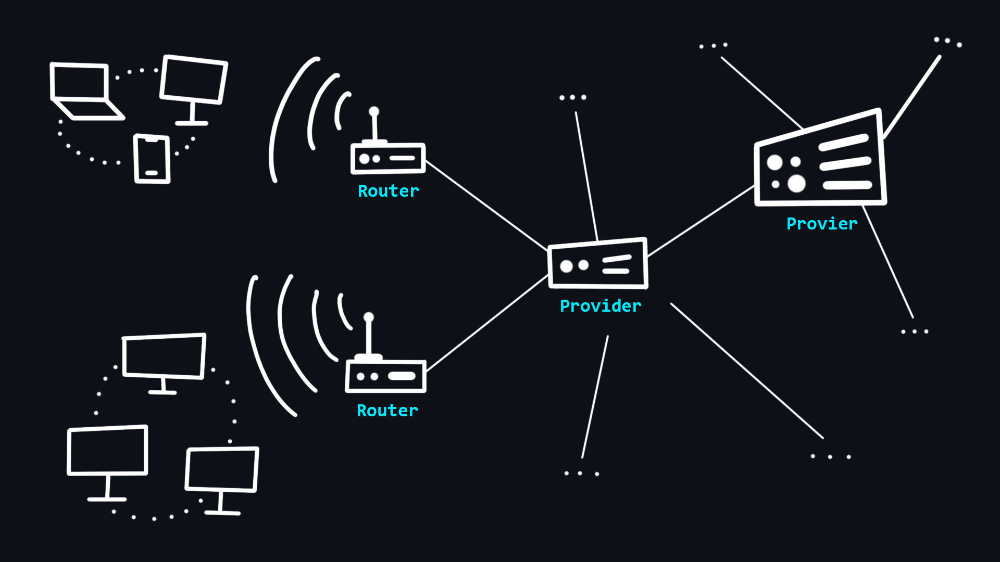</p>

    Ваш компьютер не имеет прямого доступа в Интернет. Вместо этого он имеет доступ к вашей локальной сети, к которой подключены другие устройства через проводное ([Ethernet](https://ru.wikipedia.org/wiki/Ethernet)) или беспроводное (Wi-Fi) соединение. Организатором такой сети является специальный мини-компьютер – [маршрутизатор](https://ru.wikipedia.org/wiki/Маршрутизатор). Это устройство связывает Вас с [интернет-провайдером](https://ru.wikipedia.org/wiki/%D0%98%D0%BD%D1%82%D0%B5%D1%80%D0%BD%D0%B5%D1%82-%D0%BF%D1%80%D0%BE%D0%B2%D0%B0%D0%B9%D0%B4%D0%B5%D1%80), который в свою очередь связан с другими провайдерами более высокого уровня. Таким образом, все эти взаимодействия образуют Интернет, и ваши сообщения всегда проходят транзитом через разные сети, прежде чем достигнут конечного получателя.

    -   [Хост](https://ru.wikipedia.org/wiki/Хост)
        > (Host - принимающий) так называют любое устройство, которое находится в какой-либо сети.
    -   [Сервер](<https://ru.wikipedia.org/wiki/Сервер_(аппаратное_обеспечение)>)
        > (Serve - обслуживать) специальный компьютер в сети, который обслуживает запросы поступающие от других участников.

    <p align="center">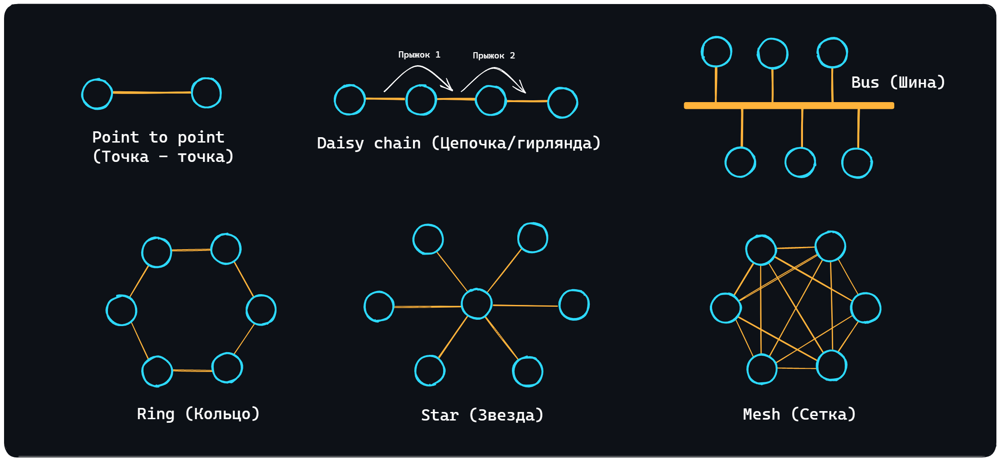</p>

    -   [Сетевые топологии](https://ru.wikipedia.org/wiki/%D0%A1%D0%B5%D1%82%D0%B5%D0%B2%D0%B0%D1%8F_%D1%82%D0%BE%D0%BF%D0%BE%D0%BB%D0%BE%D0%B3%D0%B8%D1%8F)
        > Существует несколько топологий (способов организации сети): [Point to point (Точка-точка)](https://ru.wikipedia.org/wiki/%D0%A1%D0%B5%D1%82%D1%8C_%D1%82%D0%BE%D1%87%D0%BA%D0%B0-%D1%82%D0%BE%D1%87%D0%BA%D0%B0), [Daisy chain (Цепочка/гирлянда)](https://en.wikipedia.org/wiki/Daisy_chain_(electrical_engineering)), [Bus (Шина)](https://ru.wikipedia.org/wiki/%D0%A8%D0%B8%D0%BD%D0%B0_(%D1%82%D0%BE%D0%BF%D0%BE%D0%BB%D0%BE%D0%B3%D0%B8%D1%8F_%D0%BA%D0%BE%D0%BC%D0%BF%D1%8C%D1%8E%D1%82%D0%B5%D1%80%D0%BD%D0%BE%D0%B9_%D1%81%D0%B5%D1%82%D0%B8)), [Ring (Кольцо)](https://ru.wikipedia.org/wiki/%D0%9A%D0%BE%D0%BB%D1%8C%D1%86%D0%BE_(%D1%82%D0%BE%D0%BF%D0%BE%D0%BB%D0%BE%D0%B3%D0%B8%D1%8F_%D0%BA%D0%BE%D0%BC%D0%BF%D1%8C%D1%8E%D1%82%D0%B5%D1%80%D0%BD%D0%BE%D0%B9_%D1%81%D0%B5%D1%82%D0%B8)), [Star (Звезда)](https://ru.wikipedia.org/wiki/%D0%97%D0%B2%D0%B5%D0%B7%D0%B4%D0%B0_(%D1%82%D0%BE%D0%BF%D0%BE%D0%BB%D0%BE%D0%B3%D0%B8%D1%8F_%D0%BA%D0%BE%D0%BC%D0%BF%D1%8C%D1%8E%D1%82%D0%B5%D1%80%D0%BD%D0%BE%D0%B9_%D1%81%D0%B5%D1%82%D0%B8)) и [Mesh (Сетка)](https://ru.wikipedia.org/wiki/%D0%9F%D0%BE%D0%BB%D0%BD%D0%BE%D1%81%D0%B2%D1%8F%D0%B7%D0%BD%D0%B0%D1%8F_%D1%82%D0%BE%D0%BF%D0%BE%D0%BB%D0%BE%D0%B3%D0%B8%D1%8F). Сам Интернет нельзя отнести к какой-то одной топологии, поскольку это невероятно сложная система смешанная разными топологиями.

<details>
    <summary>🔗 <b>Ссылки на материалы</b></summary>

1. 📄 [**Как работает Интернет** – MDN (mozilla.org)](https://developer.mozilla.org/ru/docs/Learn/Common_questions/How_does_the_Internet_work)
2. 📺 [**Основы программирования. Как работают сети?** – YouTube](https://www.youtube.com/watch?v=k_0BAtyaDio&ab_channel=Winderton)
3. 📄 [**Что такое сервер и как он работает**](https://timeweb.com/ru/community/articles/chto-takoe-server-i-kak-on-rabotaet)
4. 📄 [**Как выглядит сервер**](https://thecode.media/server/)
5. 📄 [**Что такое Хост**](https://blog.sk8er.name/wiki/xost/)
6. 📺 [**Топологии сетей** – YouTube](https://youtu.be/z8VmkYahV8M)
7. 📺 [**Сетевые технологии: Топология локальных сетей** – YouTube](https://youtu.be/lnFeG4DOMcE)
</details>

<div align="right"><a href="#top">Содержание ⬆️</a></div>

-   ### Что такое доменное имя

    <p align="center"></p>

    [Доменные имена](https://ru.wikipedia.org/wiki/%D0%94%D0%BE%D0%BC%D0%B5%D0%BD%D0%BD%D0%BE%D0%B5_%D0%B8%D0%BC%D1%8F) - это человеко-читаемые адреса веб-серверов, доступных в Интернете. Они состоят из частей (уровней) разделенных между собой точкой. Каждая из этих частей предоставляет специфическую информацию о доменном имени. Например страну, название сервиса, локализацию и т.д.

    -   Кто владеем доменными именами
        > Корпорация [ICANN](https://ru.wikipedia.org/wiki/ICANN) является основателем распределённой системы регистрации доменов. Она выдаёт аккредитации компаниям, которые хотят заниматься продажей доменов. Таким образом формируется конкурентный доменный рынок. 
    -   Как купить доменное имя
        > Доменное имя нельзя купить навсегда. Оно выдается в аренду на определенный срок. Покупать домены лучше у [аккредитованных регистраторов](https://www.icann.org/en/accredited-registrars?filter-letter=a&sort-direction=asc&sort-param=name&page=1) (найти их можно почти в любой стране).

<details>
    <summary>🔗 <b>Ссылки на материалы</b></summary>

1. 📄 [**Что такое доменные имена** – MDN (mozilla.org)](https://developer.mozilla.org/ru/docs/Learn/Common_questions/What_is_a_domain_name)
2. 📄 [**Как работают домены**](https://temoto.github.io/a/kak-rabotayut-domeny.html)
3. 📄 [**Доменное имя в призме закона** – habr.com](https://habr.com/ru/post/557786/)
</details>

<div align="right"><a href="#top">Содержание ⬆️</a></div>

-   ### IP-адрес

    <p align="center"></p>

    [IP-адрес](https://ru.wikipedia.org/wiki/IP-%D0%B0%D0%B4%D1%80%D0%B5%D1%81) – уникальный числовой адрес, который используется для распознавания того или иного устройства в сети.

    -   Уровни видимости
        > - Внешний и доступный всем IP-адрес, который принадлежит Вашему провайдеру и используется для выхода в интернет сотен других пользователей.
        > - IP-адрес вашего роутера в локальной сети провайдера, той самой, с IP-адресом которой вы выходите в интернет.
        > - IP-адрес вашего компьютера в локальной (домашней) сети, созданной роутером, к которой вы можете подключать свои устройства. Как правило, имеет вид 192.168.XXX.XXX.
        > - Внутренний IP-адрес компьютера, недоступный извне и используемый только для общения между запущенными процессами. У всех он одинаковый – 127.0.0.1 или просто localhost. 
    -   [Порт](https://ru.wikipedia.org/wiki/%D0%9F%D0%BE%D1%80%D1%82_(%D0%BA%D0%BE%D0%BC%D0%BF%D1%8C%D1%8E%D1%82%D0%B5%D1%80%D0%BD%D1%8B%D0%B5_%D1%81%D0%B5%D1%82%D0%B8))
        > На одном устройстве (компьютере) может работать множество приложений, которые используют сеть. Для того, чтобы правильно распознать, куда и какие данные, пришедшие по сети, нужно доставить (в какое из приложений), используется специальный числовой номер – порт.
    -   [IPv4](https://ru.wikipedia.org/wiki/IPv4)
        > 4 версия IP-протокола. Разработана в 1981 году и ограничивает адресное пространство около 4.3 млрд (2^32) возможными уникальными адресами.
    -   [IPv6](https://ru.wikipedia.org/wiki/IPv6)
        > Со временем распределение адресного пространства стало происходить значительно более быстрыми темпами, что вынудило создание новой версии IP-протокола для хранения большего количества адресов. IPv6 способен выдать 2^128 уникальных адресов.

<details>
    <summary>🔗 <b>Ссылки на материалы</b></summary>

1. 📄 [**IP адрес**](https://hackware.ru/?p=11589)
2. 📄 [**Всё об IP адресах и о том, как с ними работать** – habr.com](https://habr.com/ru/post/350878/)
3. 📄 [**Как узнать IP-адрес в Linux**](https://losst.pro/kak-uznat-ip-adres-linux)
4. 📺 [**Порты и перенаправление\открытие портов. Инструкция и объяснения на пальцах** – YouTube](https://www.youtube.com/watch?v=SGmBv_klQ9I)
5. 📄 [**Список зарезервированных портов TCP и UDP** – Википедия](https://ru.wikipedia.org/wiki/%D0%A1%D0%BF%D0%B8%D1%81%D0%BE%D0%BA_%D0%BF%D0%BE%D1%80%D1%82%D0%BE%D0%B2_TCP_%D0%B8_UDP)
6. 📄 [**Протоколы IPv4 и IPv6. В чем разница и что лучше?**](https://bezopasnik.info/%D0%BF%D1%80%D0%BE%D1%82%D0%BE%D0%BA%D0%BE%D0%BB%D1%8B-ipv4-%D0%B8-ipv6-%D0%B2-%D1%87%D0%B5%D0%BC-%D1%80%D0%B0%D0%B7%D0%BD%D0%B8%D1%86%D0%B0-%D0%B8-%D1%87%D1%82%D0%BE-%D0%BB%D1%83%D1%87%D1%88%D0%B5/)
7. 📺 [**Адреса IPv6 | Компьютерные сети. Продвинутые темы** – YouTube](https://youtu.be/KRAKAAJTxTg)
8. 📄 [**IPv6: как организовать миграцию и в чем преимущества перехода**](https://itglobal.com/ru-ru/company/blog/ipv6-migration/)
9. 📺 [**IPv6 - от слов к делу** – YouTube](https://youtu.be/xYQP0iXr3A0)
</details>

<div align="right"><a href="#top">Содержание ⬆️</a></div>

-   ### Что такое DNS

    <p align="center"></p>

    [DNS (Domain Name System)](https://ru.wikipedia.org/wiki/DNS) - это децентрализованная система именования адресов в Интернете, которая позволяет создавать удобные для человека буквеные наименования (доменные имена) соответствующие числовым [IP-адресам](https://ru.wikipedia.org/wiki/IP-%D0%B0%D0%B4%D1%80%D0%B5%D1%81), которые используются компьютерами.

    -   Структура DNS
        > DNS состоит из множества независимых узлов, каждый из которых хранит только те данные, которые входят в его зону ответственности.
    -   DNS Resolver
        > Сервер, который расположен в непосредственной близости от вашего провайдера. Именно он выполняет поиск адресов по доменным именам, а также занимается их кэшированием (временным хранением для быстрой выдачи при последующих обращениях). 
    -   [DNS записи](https://ru.wikipedia.org/wiki/%D0%A2%D0%B8%D0%BF%D1%8B_%D1%80%D0%B5%D1%81%D1%83%D1%80%D1%81%D0%BD%D1%8B%D1%85_%D0%B7%D0%B0%D0%BF%D0%B8%D1%81%D0%B5%D0%B9_DNS)
        > - Запись A – связывает доменное имя с адресом IPv4.
        > - Запись AAAA – связывает доменное имя с адресом IPv6.
        > - Запись CNAME – перенаправляет на другое доменное имя.
        > - и другие – запись MX, запись NS, запись PTR, запись SOA.

<details>
    <summary>🔗 <b>Ссылки на материалы</b></summary>

1. 📄 [**Что такое DNS-сервер простыми словами**](https://guides.hexlet.io/ru/dns/)
2. 📺 [**Система доменных имен DNS** — YouTube](https://www.youtube.com/watch?v=B0J0c0KLtbQ&ab_channel=AndreySozykin)
3. 📄 [**Давайте уже разберемся в DNS** – habr.com](https://habr.com/ru/post/303446/)
4. 📄 [**Как это работает: Пара слов о DNS** – habr.com](https://habr.com/ru/company/1cloud/blog/309018/)
</details>

<div align="right"><a href="#top">Содержание ⬆️</a></div>

-   ### Устройство веб-приложений

    Современные [веб-приложения](https://ru.wikipedia.org/wiki/%D0%92%D0%B5%D0%B1-%D0%BF%D1%80%D0%B8%D0%BB%D0%BE%D0%B6%D0%B5%D0%BD%D0%B8%D0%B5) состоят из двух частей: клиентской (frontend) и серверной (backend). Тем самым реализуя [клиент-серверную архитектуру](https://ru.wikipedia.org/wiki/%D0%9A%D0%BB%D0%B8%D0%B5%D0%BD%D1%82_%E2%80%94_%D1%81%D0%B5%D1%80%D0%B2%D0%B5%D1%80). 

    Задачами клиентской части являются:
    -   Реализация пользовательского интерфейса (внешний вид приложения)
        > - Для создания веб-страниц используется специальный язык разметки – [HTML](https://ru.wikipedia.org/wiki/HTML).
        > - Для стилизации шрифтов, расположения содержимого и т.д. используется язык стилей – [CSS](https://ru.wikipedia.org/wiki/CSS).
        > - Для добавления динамики и интерактивности – язык программирования [JavaScript](https://ru.wikipedia.org/wiki/JavaScript). <br>
        > Как правило в чистом виде эти инструменты используются редко, поскольку для более удобной и быстрой разработки существуют так называемые [фреймворки](https://2020.stateofjs.com/ru-RU/technologies/front-end-frameworks/) и [препроцессоры](https://mrmlnc.gitbooks.io/less-guidebook-for-beginners/content/chapter_1/css-reprocessors.html). <br>
    -   Cоздание функционала для формирования запросов к серверу
        > Как правило это различного вида формы ввода, с которыми можно удобно взаимодействовать. 
    -   Приём данных от сервера и их последующая обработка для вывода на клиент

    Задачи серверной части:
    -   Обработка клиентских запросов
        > Проверка на наличие прав и доступа, разного рода валидации и т.д.
    -   Выполнение бизнес логики
        > Здесь может подразумевается широкий спектр задач: работа с базами данных, обработка информации, вычисления и т.д. Это, так сказать, самое сердце мира Backend. Здесь и происходит все самое важное и интересное.
    -   Формирование ответа и отправка его на клиент

<details>
    <summary>🔗 <b>Ссылки на материалы</b></summary>

1. 📄 [**Как работают веб-приложения** – habr.com](https://habr.com/ru/post/450282)
1. 📺 [**Как устроены веб-приложения? (Frontend/Backend)** – YouTube](https://youtu.be/nQBNH0x4YmI)
1. 📺 [**Архитектура современных WEB приложений. Эволюция от А до Я** – YouTube](https://youtu.be/S0e_5a2WB60)
1. 📄 [**Что такое HTML за 7 минут**](https://youtu.be/MBe1h80ghKA)
1. 📄 [**Базовый курс по фронтенду** – (MDN) mozilla.org](https://developer.mozilla.org/ru/docs/Learn/Front-end_web_developer)
1. 📄 [**Frontend Developer roadmap**](https://roadmap.sh/frontend)
1. 📄 [**Нативные, гибридные и web-приложения в сравнении** – medium.com](https://medium.com/nuances-of-programming/%D0%BD%D0%B0%D1%82%D0%B8%D0%B2%D0%BD%D1%8B%D0%B5-%D0%B3%D0%B8%D0%B1%D1%80%D0%B8%D0%B4%D0%BD%D1%8B%D0%B5-%D0%B8-web-%D0%BF%D1%80%D0%B8%D0%BB%D0%BE%D0%B6%D0%B5%D0%BD%D0%B8%D1%8F-%D0%B2-%D1%81%D1%80%D0%B0%D0%B2%D0%BD%D0%B5%D0%BD%D0%B8%D0%B8-b1360258df2d)
</details>

<div align="right"><a href="#top">Содержание ⬆️</a></div>

-   ### Браузеры и как они работают

    <p align="center"></p>

    [Браузер](https://ru.wikipedia.org/wiki/Браузер) – клиент, с помощью которого можно отправлять запросы на сервер для получения файлов, которые впоследствии используются для отрисовки web-страниц. Если совсем упрощенно, то браузер можно воспринимать как программу для просмотра HTML-файлов, которая так же может искать и скачивать их из интернета. 

    -   Принцип работы
        > Работа с запросами, отрисовка страниц, особенность работы вкладок (для каждой вкладки создается отдельный процесс, чтобы не допустить ситуации, при которой содержимое одной вкладки имеет возможность влиять на содержимое другой).
    -   Расширения ([WebExtensions](https://ru.wikipedia.org/wiki/WebExtensions))
        > Позволяют менять пользовательский интерфейс браузера, модифицировать содержимое вебстраниц, изменять сетевые запросы браузера.
    -   Инструменты разработчика ([DevTools](https://developer.chrome.com/docs/devtools/overview/))
        > Незаменимый инструмент любого веб-разработчика. Позволяет анализировать всю возможную информацию связанную с веб-страницами, мониторить их производительность, логи и, что для нас самое важное, отслеживать информацию о сетевых запросах.

<details>
    <summary>🔗 <b>Ссылки на материалы</b></summary>

1. 📄 [**Как работают браузеры** — MDN (mozilla.org)](https://developer.mozilla.org/ru/docs/Web/Performance/How_browsers_work)
2. 📄 [**Как работают браузеры — введение в безопасность веб-приложений** – habr.com](https://habr.com/ru/company/edison/blog/432870/)
3. 📄 [**Как браузер рисует страницы**](https://doka.guide/js/how-the-browser-creates-pages/)
4. 📄 [**Важные аспекты работы браузера для разработчиков** – habr.com](https://habr.com/ru/company/dataart/blog/304138/)
5. 📄 [**Обзор всех инструментов разработчика Chrome DevTools** – habr.com](https://habr.com/ru/company/simbirsoft/blog/337116/)
6. 📄 [**Что на самом деле происходит, когда пользователь вбивает в браузер адрес google.com** – habr.com](https://habr.com/ru/company/htmlacademy/blog/254825/)
7. 📄 [**Принципы работы современных веб-браузеров**](https://www.html5rocks.com/ru/tutorials/internals/howbrowserswork/)
8. 📄 [**Подробное объяснение того, как работает браузер (под капотом)**](https://russianblogs.com/article/7580365317/)
9. 📺 [**Архитектура браузера. Движки и рендер. Самое подробное видео** – YouTube](https://youtu.be/zDlg64fsQow)
</details>


<div align="right"><a href="#top">Содержание ⬆️</a></div>

-   ### VPN и Proxy

    <p align="center">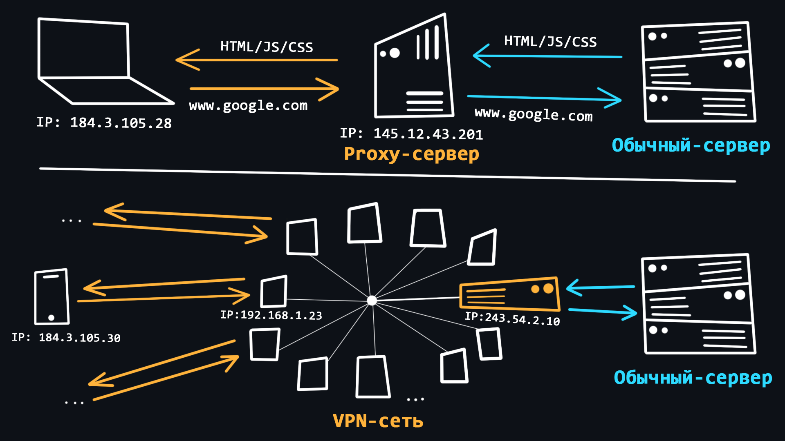</p>

    Использование VPN и Proxy довольно распространённое явление в последние годы. С помощью этих технологий пользователи могут получить базовую анонимность при серфинге в сети, а также обходить различные региональные блокировки.

    -   [VPN (Virtual Private Network)](https://ru.wikipedia.org/wiki/VPN)
        > Технология позволяющая стать участником приватной сети (подобной вашей локальной), где запросы всех участников проходят через единый публичный IP-адрес. Это позволяет Вам смешаться в общей массе запросов от других участников.<br>
        > - Простая процедура подключения и использования. <br>
        > - Надежное шифрование трафика. <br>
        > - Нет гарантии 100% анонимности, поскольку владелец сети знает IP-адреса всех участников. <br>
        > - VPN бесполезны для работы с мультиаккаунтами и некоторыми программами, поскольку все аккаунты, работающие с одного VPN легко обнаруживаются и блокируются. <br>
        > - Бесплатные VPN, как правило, имеют большую нагруженность, что приводит к нестабильной работе и снижению скорости загрузки данных. <br>
    -   [Proxy (прокси-сервер)](https://ru.wikipedia.org/wiki/%D0%9F%D1%80%D0%BE%D0%BA%D1%81%D0%B8-%D1%81%D0%B5%D1%80%D0%B2%D0%B5%D1%80)
        > Прокси это специальный сервер в сети, который выполняет роль посредника между Вами и конечным сервером к которому Вы намереваетесь обратиться. Когда Вы подключены к прокси-серверу все Ваши запросы будут выполняться от имени этого сервера, то есть IP-адрес и местоположение будут подменены. <br>
        > - Возможность использовать индивидуальный IP-адрес, что позволяет работать с мультиаккаунтами. <br>
        > - Стабильность соединения из-за отсутствия высоких нагрузок.<br>
        > - Подключение через прокси предусмотрено в самой ОС и браузере, поэтому доп. ПО не требуется. <br>
        > - Существуют разновидности прокси, которые обеспечивают высокий уровень анонимности. <br>
        > - Ненадежность бесплатных решений, поскольку прокси-сервер может видеть и контролировать всё, что вы делаете в интернете. <br>

<details>
    <summary>🔗 <b>Ссылки на материалы</b></summary>

1. 📄 [**Чем отличается VPN от прокси и что выбрать?**](https://hidemy.name/ru/articles/chem-otlichaetsja-proksi-i-vpn-chto-vybrat-proksi-server-ili-vpn/)
2. 📺 [**Что такое прокси-сервер за 7 минут** – YouTube](https://youtu.be/oeOuaqyYzSY)
3. 📺 [**Всё, что нужно знать о VPN за час** – YouTube](https://youtu.be/ZlaQiys0lcM)
4. 📺 [**Какая разница между Прокси и VPN** – YouTube](https://youtu.be/2QNKtyVwUDo)
5. 📄 [**Защищённые прокси — практичная альтернатива VPN** – habr.com](https://habr.com/ru/post/506356/)
</details>

<div align="right"><a href="#top">Содержание ⬆️</a></div>

-   ### Хостинг

    <p align="center"></p>

    [Хостинг (hosting)](https://ru.wikipedia.org/wiki/%D0%A5%D0%BE%D1%81%D1%82%D0%B8%D0%BD%D0%B3) - специальная услуга, предоставляемая [хостинг-провайдерами](https://ru.wikipedia.org/wiki/%D0%A5%D0%BE%D1%81%D1%82%D0%B8%D0%BD%D0%B3%D0%BE%D0%B2%D0%B0%D1%8F_%D0%BA%D0%BE%D0%BC%D0%BF%D0%B0%D0%BD%D0%B8%D1%8F), которая позволяет арендовать пространство на сервере (который круглосуточно подключён к сети Интернет), где могут храниться ваши данные и файлы. Существуют различные варианты хостинга, где вы можете использовать не только дисковое пространство сервера, но и так же процессорную мощность для работы ваших сетевых приложений.

    -   [Виртуальный хостинг](https://ru.wikipedia.org/wiki/%D0%92%D0%B8%D1%80%D1%82%D1%83%D0%B0%D0%BB%D1%8C%D0%BD%D1%8B%D0%B9_%D1%85%D0%BE%D1%81%D1%82%D0%B8%D0%BD%D0%B3)
        > Один физический сервер, который распределяет свои ресурсы на нескольких арендаторов.
    -   [VPS/VDS](https://ru.wikipedia.org/wiki/VPS)
        > Виртуальные серверы, эмулирующие работу отдельного физического сервера и предоставляемые в аренду клиенту с максимальными привилегиями.
    -   [Выделенный сервер](https://ru.wikipedia.org/wiki/%D0%92%D1%8B%D0%B4%D0%B5%D0%BB%D0%B5%D0%BD%D0%BD%D1%8B%D0%B9_%D1%81%D0%B5%D1%80%D0%B2%D0%B5%D1%80)
        > Аренда полноценного физического сервера с полным доступом ко всем ресурсам. Как правило, это самая дорогая услуга.
    -   [Облачный хостинг](https://ru.wikipedia.org/wiki/%D0%9E%D0%B1%D0%BB%D0%B0%D1%87%D0%BD%D0%B0%D1%8F_%D1%81%D0%B8%D1%81%D1%82%D0%B5%D0%BC%D0%B0_%D1%85%D1%80%D0%B0%D0%BD%D0%B5%D0%BD%D0%B8%D1%8F)
        > Услуга которая использует ресурсы нескольких серверов. При аренде пользователь платит только за используемые по факту ресурсы.
    -   [Колокация](https://ru.wikipedia.org/wiki/%D0%9A%D0%BE%D0%BB%D0%BE%D0%BA%D0%B0%D1%86%D0%B8%D1%8F)
        > Услуга предоставляющая клиенту возможность установить свое оборудование на территории провайдера.

<details>
    <summary>🔗 <b>Ссылки на материалы</b></summary>

1. 📺 [**Что такое хостинг, домен и как устроен интернет на понятном языке** – YouTube](https://youtu.be/v80A1i-82CE)
2. 📄 [**Что такое хостинг и домен сайта простыми словами**](https://guides.hexlet.io/ru/hosting/)
3. 📄 [**Хостинг: что это, зачем и как выбрать**](https://vc.ru/services/74241-hosting-chto-eto-zachem-i-kak-vybrat)
4. 📄 [**Хостинг: варианты, сравнения, пользовательская статистика** — habr.com](https://habr.com/ru/company/ruvds/blog/443522/)
5. 📄 [**VPS-хостинг и облачный хостинг: что выбрать и в чем разница?** – habr.com](https://habr.com/ru/company/ruvds/blog/320880/)
6. 📄 [**Колокейшн: как, зачем и почему** – habr.com](https://habr.com/ru/company/ruvds/blog/325136/)
</details>


<div align="right"><a href="#top">Содержание ⬆️</a></div>

-   ### Сетевая модель OSI

    | № | Уровень                    | Используемые протоколы |
    |---|----------------------------|------------------------|
    | 7 | Прикладной уровень         | HTTP, DNS, FTP, POP3   |
    | 6 | Уровень представления      | SSL, SSH, IMAP, JPEG   |
    | 5 | Сеансовый уровень          | APIs Sockets           |
    | 4 | Транспортный уровень       | TCP, UDP               |     
    | 3 | Сетевой уровень            | IP, ICMP, IGMP         | 
    | 2 | Канальный уровень          | Ethernet, MAC, HDLC    |
    | 1 | Физический уровень         | RS-232, RJ45, DSL      |

    [OSI (The Open Systems Interconnection model)](https://ru.wikipedia.org/wiki/%D0%A1%D0%B5%D1%82%D0%B5%D0%B2%D0%B0%D1%8F_%D0%BC%D0%BE%D0%B4%D0%B5%D0%BB%D1%8C_OSI) – это набор правил, который описывает то, как должны взаимодействовать друг с другом различные сетевые устройства. Модель разделяется на 7 уровней, каждый из которых отвечает за выполнение определенной функции. Все это нужно для того, чтобы процесс обмена информацией в сети происходил по единому шаблону и все устройства, будь-то умный холодильник и смартфон, могли без проблем понять друг друга.

    -   [Физический уровень](https://ru.wikipedia.org/wiki/%D0%A4%D0%B8%D0%B7%D0%B8%D1%87%D0%B5%D1%81%D0%BA%D0%B8%D0%B9_%D1%83%D1%80%D0%BE%D0%B2%D0%B5%D0%BD%D1%8C)
        > На этом уровне происходит кодирование  битов (единиц/нулей) в физические сигналы (ток, свет, радиоволны) и их дальнейшая передача проводным ([Ethernet](https://ru.wikipedia.org/wiki/Ethernet)) или беспроводным ([Wi-Fi](https://ru.wikipedia.org/wiki/Wi-Fi)) способом.
    -   [Канальный уровень](https://ru.wikipedia.org/wiki/%D0%9A%D0%B0%D0%BD%D0%B0%D0%BB%D1%8C%D0%BD%D1%8B%D0%B9_%D1%83%D1%80%D0%BE%D0%B2%D0%B5%D0%BD%D1%8C)
        > Физические сигналы с первого уровня раскодируются обратно в единицы и нули, исправляются ошибки и дефекты, извлекаются [MAC-адреса](https://ru.wikipedia.org/wiki/MAC-%D0%B0%D0%B4%D1%80%D0%B5%D1%81) отправителя и получателя.
    -   [Сетевой уровень](https://ru.wikipedia.org/wiki/%D0%9F%D1%80%D0%BE%D1%82%D0%BE%D0%BA%D0%BE%D0%BB%D1%8B_%D1%81%D0%B5%D1%82%D0%B5%D0%B2%D0%BE%D0%B3%D0%BE_%D1%83%D1%80%D0%BE%D0%B2%D0%BD%D1%8F)
        > Происходит маршрутизация трафика, запросы к DNS и формирование [IP-пакетов](https://ru.wikipedia.org/wiki/IP).
    -   [Транспортный уровень](https://ru.wikipedia.org/wiki/%D0%A2%D1%80%D0%B0%D0%BD%D1%81%D0%BF%D0%BE%D1%80%D1%82%D0%BD%D1%8B%D0%B9_%D1%83%D1%80%D0%BE%D0%B2%D0%B5%D0%BD%D1%8C)
        > Уровень ответственный за передачу данных. Здесь существуют 2 важнейших протокола: <br>
        > - [TCP](https://ru.wikipedia.org/wiki/Transmission_Control_Protocol) - обеспечивающий надежную передачу данных. TCP гарантирует доставку данных и сохранение порядка следования сообщений. Это сказывается на скорости передачи. Данный протокол используется там, где потеря информации недопустима, например при отправки почты или загрузке веб-страниц. <br>
        > - [UDP](https://ru.wikipedia.org/wiki/UDP) – простой протокол с быстрой передачей данных. Он не использует механизмов для гарантирования доставки и порядка следования данных. Используется, например в онлайн-играх, где частичная потеря пакетов не критична, но скорость передачи данных имеет гораздо более важное значение. Так же, запросы к DNS-серверам происходят через UDP протокол.
    -   [Сеансовый уровень](https://ru.wikipedia.org/wiki/%D0%A1%D0%B5%D0%B0%D0%BD%D1%81%D0%BE%D0%B2%D1%8B%D0%B9_%D1%83%D1%80%D0%BE%D0%B2%D0%B5%D0%BD%D1%8C)
        > Отвечает за открытие и закрытие связи (сеансов) между двумя устройствами. Гарантирует, что сеанс будет оставаться открытым достаточно долго для передачи всех необходимых данных, а затем быстро закроется, чтобы избежать траты ресурсов.
    -   [Уровень представления](https://ru.wikipedia.org/wiki/%D0%9F%D1%80%D0%B5%D0%B4%D1%81%D1%82%D0%B0%D0%B2%D0%B8%D1%82%D0%B5%D0%BB%D1%8C%D1%81%D0%BA%D0%B8%D0%B9_%D1%83%D1%80%D0%BE%D0%B2%D0%B5%D0%BD%D1%8C)
        > Трансляция, шифрование/расшифровка и сжатие данных. Именно здесь данные, которые приходят в виде нулей и единиц преобразуются в нужные форматы (PNG, MP3, PDF и т.д.)
    -   [Прикладной уровень](https://ru.wikipedia.org/wiki/%D0%9F%D1%80%D0%BE%D1%82%D0%BE%D0%BA%D0%BE%D0%BB%D1%8B_%D0%BF%D1%80%D0%B8%D0%BA%D0%BB%D0%B0%D0%B4%D0%BD%D0%BE%D0%B3%D0%BE_%D1%83%D1%80%D0%BE%D0%B2%D0%BD%D1%8F)
        > Уровень работы с приложениями. Разрешает приложениям пользователя иметь доступ к сетевым службам, таким как обработчик запросов к базам данных, доступ к файлам, пересылке электронной почты.

<details>
    <summary>🔗 <b>Ссылки на материалы</b></summary>

1. 📺 [**Модель OSI | 7 уровней за 7 минут** – YouTube](https://youtu.be/je0QFU7p5Oo)
1. 📺 [**Модель OSI | Курс "Компьютерные сети"** – YouTube](https://youtu.be/Tt8BTkxz_Vc)
1. 📄 [**Простое пособие по сетевой модели OSI для начинающих** – selectel.ru](https://selectel.ru/blog/osi-for-beginners/)
1. 📄 [**Физика Ethernet для самых маленьких** – habr.com](https://habr.com/ru/post/158177/)
1. 📄 [**Как работает Wi-fi. История беспроводных сетей** – habr.com](https://habr.com/ru/company/timeweb/blog/672494/)
1. 📄 [**Wi-Fi или витая пара — что лучше?** – habr.com](https://habr.com/ru/company/zyxel/blog/503724/)
1. 📄 [**Всё, что вы хотели знать о МАС адресе** — habr.com](https://habr.com/ru/post/483670/)
1. 📺 [**Протокол IP: маршрутизация | Курс "Компьютерные сети"** — YouTube](https://youtu.be/kZqqk1tixfk)
1. 📺 [**Протокол TCP** — YouTube](https://www.youtube.com/watch?v=CKUOb4htnB4&ab_channel=AndreySozykin)
1. 📺 [**Протокол UDP** — YouTube](https://www.youtube.com/watch?v=GBrLfZvRrd8&ab_channel=AndreySozykin)
1. 📺 [**Прикладной уровень | Курс "Компьютерные сети"** — YouTube](https://youtu.be/l_MAOvAbYho)
</details>

-   ### Протокол HTTP

    [HTTP (HyperText Transport Protocol)](https://ru.wikipedia.org/wiki/HTTP) - cамый важный протокол интернета. Используется для передачи данных любого формата. Сам по себе протокол работает по простому принципу: запрос –> ответ.

    -   [Структура HTTP-сообщений](https://developer.mozilla.org/ru/docs/Web/HTTP/Messages#%D0%B7%D0%B0%D0%BF%D1%80%D0%BE%D1%81%D1%8B_http)
        > HTTP-сообщения состоят из заголовка, содержащего метаданные о сообщении, за которым следует необязательное тело сообщения, содержащее отправляемые данные.

    <p align="center">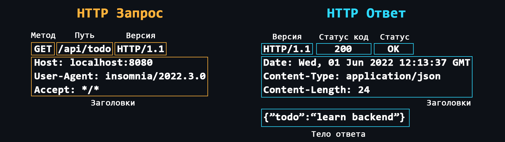</p>

    -   [Заголовки](https://developer.mozilla.org/ru/docs/Web/HTTP/Headers)
        > Дополнительная служебная информация которая отправляется вместе с запросом/ответом. <br>
        > Основные: [Host](https://developer.mozilla.org/ru/docs/Web/HTTP/Headers/Host), [User-Agent](https://developer.mozilla.org/ru/docs/Web/HTTP/Headers/User-Agent), [If-Modified-Since](https://developer.mozilla.org/ru/docs/Web/HTTP/Headers/If-Modified-Since), [Cookie](https://ru.wikipedia.org/wiki/Cookie), [Referer](https://developer.mozilla.org/ru/docs/Web/HTTP/Headers/Referer), [Authorization](https://developer.mozilla.org/ru/docs/Web/HTTP/Headers/Authorization), [Cache-Control](https://developer.mozilla.org/ru/docs/Web/HTTP/Headers/Cache-Control), [Content-Type](https://developer.mozilla.org/en-US/docs/Web/HTTP/Headers/Content-Type), [Content-Length](https://developer.mozilla.org/ru/docs/Web/HTTP/Headers/Content-Length), [Last-Modified](https://developer.mozilla.org/ru/docs/Web/HTTP/Headers/Last-Modified), [Set-Cookie](https://developer.mozilla.org/ru/docs/Web/HTTP/Headers/Set-Cookie), [Content-Encoding](https://developer.mozilla.org/ru/docs/Web/HTTP/Headers/Content-Encoding).
    -   [Методы запросов](https://developer.mozilla.org/ru/docs/Web/HTTP/Methods)
        > Основные: [GET](https://developer.mozilla.org/ru/docs/Web/HTTP/Methods/GET), [POST](https://developer.mozilla.org/ru/docs/Web/HTTP/Methods/POST), [PUT](https://developer.mozilla.org/ru/docs/Web/HTTP/Methods/PUT), [DELETE](https://developer.mozilla.org/en-US/docs/Web/HTTP/Methods/DELETE). <br> Дополнительные: [HEAD](https://developer.mozilla.org/en-US/docs/Web/HTTP/Methods/HEAD), [CONNECT](https://developer.mozilla.org/en-US/docs/Web/HTTP/Methods/CONNECT), [OPTIONS](https://developer.mozilla.org/ru/docs/Web/HTTP/Methods/OPTIONS), [TRACE](https://developer.mozilla.org/en-US/docs/Web/HTTP/Methods/TRACE), [PATCH](https://developer.mozilla.org/en-US/docs/Web/HTTP/Methods/PATCH). <br>
    -   [Коды состояния](https://developer.mozilla.org/ru/docs/Web/HTTP/Status)
        > Каждый ответ от сервера имеет специальный числовой код, который характеризует состояние отправленного запроса. Эти коды делятся на 5 основных классов:
        > -   **1хх** - Служебная информация
        > -   **2хх** - Успешный запрос
        > -   **3хх** - Перенаправление на другой адрес
        > -   **4хх** - Ошибка на стороне клиента
        > -   **5хх** - Ошибка на стороне сервера
    -   [HTTPS](https://ru.wikipedia.org/wiki/HTTPS)
        > Тот же HTTP, но с поддержкой шифрования. Ваши приложения должны использовать HTTPS, чтобы быть безопасными.
    -   [Cookie](https://developer.mozilla.org/ru/docs/Web/HTTP/Cookies)
        > Протокол HTTP не предоставляет возможности сохранять информацию о состояниях предыдущих запросов и ответов. Для решения этой проблемы используются куки. Куки позволяют серверу хранить информацию на стороне клиента, которую клиент может передавать обратно на сервер. Например, куки могут использоваться для авторизации пользователей или для сохранения различных параметров и настроек.
    -   [CORS (Cross origin resource sharing)](https://ru.wikipedia.org/wiki/Cross-origin_resource_sharing)
        > Технология, которая позволяет одному домену получать данные от другого.
    -   [CSP (Content Security Policy)](https://developer.mozilla.org/ru/docs/Web/HTTP/CSP)
        > Специальный заголовок позволяющий распознавать и устранять определённые типы уязвимостей веб-приложения.
    -   [Эволюция HTTP](https://runebook.dev/ru/docs/http/basics_of_http/evolution_of_http)
        > - **HTTP 1.0**: Использует отдельные соединения для каждого запроса/ответа, не поддерживает кэширование, передача сообщений в виде plain текста.
        > - **HTTP 1.1**: Возможность переиспользовать одно соеднинение, конвейеризация, заголовок Host и кодирование передачи данных в виде чанков (кусков).
        > - **HTTP 2**: Поддерживает мультиплексирование, сжатие заголовков, пуш-уведомления и работу с двоичными данными.
        > - **HTTP 3**: Построен поверх [протокола QUIC](https://ru.wikipedia.org/wiki/QUIC), предлагает улучшенное мультиплексирование, стабильность и лучшую производительность в ненадежных сетях.

<details>
    <summary>🔗 <b>Ссылки на материалы</b></summary>

1. 📄 [**Протокол HTTP** – MDN (mozilla.org)](https://developer.mozilla.org/ru/docs/Web/HTTP)
2. 📺 [**Протокол HTTP | Курс компьютерные сети** – YouTube](https://youtu.be/RlccXUx4LVw)
3. 📄 [**Простым языком об HTTP** – habr.com](https://habr.com/ru/post/215117)
4. 📄 [**HTTP-запросы: структура, методы, строка статуса и коды состояния** – selectel.ru](https://selectel.ru/blog/http-request/)
5. 📄 [**Что такое протокол HTTPS, и как он защищает вас в интернете**](https://guides.hexlet.io/ru/https-yandex-guide/)
6. 📄 [**В чем разница протоколов HTTP и HTTPS** – selectel.ru](https://selectel.ru/blog/http-https/)
7. 📺 [**Как работает HTTPS?** – YouTube](https://youtu.be/B3j4SS5P8tM)
8. 📺 [**Что такое cookies браузера** – YouTube](https://youtu.be/Ri3IAb6tdlE)
9. 📄 [**Что такое cookie в браузере и почему на многих сайтах предупреждают об их использовании?**](https://club.dns-shop.ru/blog/t-326-internet/47805-chto-takoe-cookie-v-brauzere-i-pochemu-na-mnogih-saitah-preduprejd)
10. 📄 [**CORS для чайников: история возникновения, как устроен и оптимальные методы работы** – habr.com](https://habr.com/ru/company/macloud/blog/553826/)
11. 📄 [**Улучшение сетевой безопасности с помощью Content Security Policy** – habr.com](https://habr.com/ru/company/nix/blog/271575/?)
12. 📄 [**Путь к HTTP/2** – habr.com](https://habr.com/ru/post/308846/)
13. 📄 [**Evolution of HTTP** – MDN (mozilla.org)](https://developer.mozilla.org/ru/docs/Web/HTTP/Basics_of_HTTP/Evolution_of_HTTP)
</details>

<div align="right"><a href="#top">Содержание ⬆️</a></div>

-   ### Cтек протоколов TCP/IP

    <p align="center">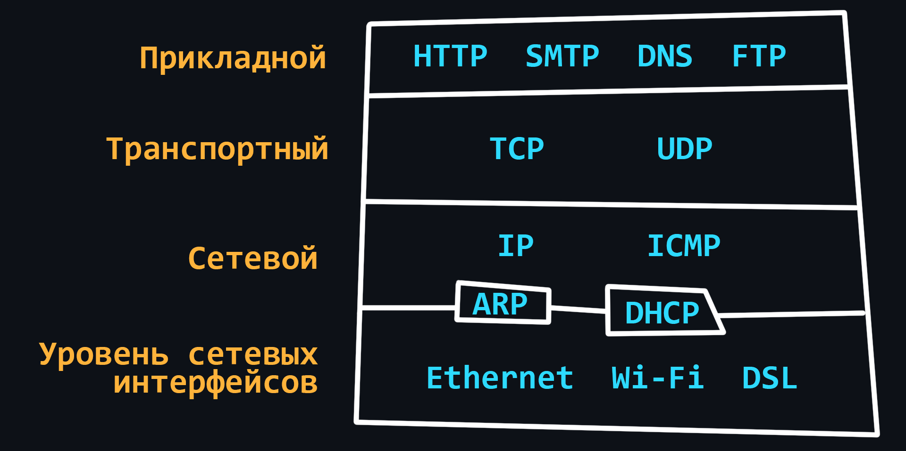</p>

    По сравнению с [моделью OSI](#сетевая-модель-osi) [стек TCP/IP](https://ru.wikipedia.org/wiki/TCP/IP) имеет более простую архитектуру. В целом, модель TCP/IP является более широко используемой и практичной, а модель OSI - более теоретической и детальной. Обе модели описывают одни и те же принципы, но отличаются подходом и протоколами, которые они включают на своих уровнях.

    - [Канальный уровень](https://ru.wikipedia.org/wiki/%D0%9A%D0%B0%D0%BD%D0%B0%D0%BB%D1%8C%D0%BD%D1%8B%D0%B9_%D1%83%D1%80%D0%BE%D0%B2%D0%B5%D0%BD%D1%8C_(TCP/IP))
        > Определяет, как данные передаются по физической среде, такой как кабели или беспроводные сигналы. <br>
        > Протоколы: [Ethernet](https://ru.wikipedia.org/wiki/Ethernet), [Wi-Fi](https://ru.wikipedia.org/wiki/Wi-Fi), [Bluetooth](https://ru.wikipedia.org/wiki/Bluetooth), [оптоволокно](https://ru.wikipedia.org/wiki/%D0%92%D0%BE%D0%BB%D0%BE%D0%BA%D0%BE%D0%BD%D0%BD%D0%BE-%D0%BE%D0%BF%D1%82%D0%B8%D1%87%D0%B5%D1%81%D0%BA%D0%B8%D0%B9_%D0%BA%D0%B0%D0%B1%D0%B5%D0%BB%D1%8C).
    - [Сетевой (межсетевой) уровень](https://ru.wikipedia.org/wiki/TCP/IP#%D0%A1%D0%B5%D1%82%D0%B5%D0%B2%D0%BE%D0%B9_(%D0%BC%D0%B5%D0%B6%D1%81%D0%B5%D1%82%D0%B5%D0%B2%D0%BE%D0%B9)_%D1%83%D1%80%D0%BE%D0%B2%D0%B5%D0%BD%D1%8C)
        > Маршрутизация данных между различными сетями. Он использует IP-адреса для идентификации устройств и направляет пакеты данных к месту назначения. <br>
        > Протоколы: [IP](https://ru.wikipedia.org/wiki/Internet_Protocol), [ARP](https://ru.wikipedia.org/wiki/Address_Resolution_Protocol), [ICMP](https://ru.wikipedia.org/wiki/Internet_Control_Message_Protocol), [IGMP](https://ru.wikipedia.org/wiki/Internet_Group_Management_Protocol)
    - [Транспортный уровень](https://ru.wikipedia.org/wiki/%D0%A2%D1%80%D0%B0%D0%BD%D1%81%D0%BF%D0%BE%D1%80%D1%82%D0%BD%D1%8B%D0%B9_%D1%83%D1%80%D0%BE%D0%B2%D0%B5%D0%BD%D1%8C)
        > Передача данных между двумя устройствами. При этом используются такие протоколы, как [TCP](https://ru.wikipedia.org/wiki/Transmission_Control_Protocol) - надежный, но медленный и [UDP](https://ru.wikipedia.org/wiki/User_Datagram_Protocol) - быстрый, но ненадежный.
    - [Прикладной уровень](https://ru.wikipedia.org/wiki/%D0%9F%D1%80%D0%BE%D1%82%D0%BE%D0%BA%D0%BE%D0%BB%D1%8B_%D0%BF%D1%80%D0%B8%D0%BA%D0%BB%D0%B0%D0%B4%D0%BD%D0%BE%D0%B3%D0%BE_%D1%83%D1%80%D0%BE%D0%B2%D0%BD%D1%8F)
        > Предоставляет услуги конечному пользователю, такие как просмотр веб-страниц, электронная почта и передача файлов. <br>
        > Протоколы: [HTTP](#протокол-http), [FTP](https://ru.wikipedia.org/wiki/File_Transfer_Protocol), [SMTP](https://ru.wikipedia.org/wiki/Simple_Mail_Transfer_Protocol), [DNS](https://ru.wikipedia.org/wiki/Domain_Name_System), [SNMP](https://ru.wikipedia.org/wiki/Simple_Network_Management_Protocol).

<details>
    <summary>🔗 <b>Ссылки на материалы</b></summary>

1. 📺 [**Что такое TCP/IP: Объясняем на пальцах** – YouTube](https://youtu.be/2I1HnSN1H9o)
2. 📄 [**Руководство по стеку протоколов TCP/IP для начинающих** – selectel.ru](https://selectel.ru/blog/tcp-ip-for-beginners/)
3. 📺 [**Модель и стек протоколов TCP/IP** — YouTube](https://youtu.be/UZo4ffQ-aAc)
4. 📺 [**В чем разница между OSI и TCP/IP? Зачем существуют одновременно две сетевые модели?** – YouTube](https://youtu.be/4a2CeSD1yIk)
</details>

<div align="right"><a href="#top">Содержание ⬆️</a></div>

-   ### Проблемы сети

    <p align="center"></p>

    Качество работы сетей, включая Интернет, далеко от идеального. Это связано со сложной структурой сетей и их зависимости от огромного количества факторов. Например, от стабильности соединения между клиентским устройством и его роутером, от качества услуг провайдера, от мощности и производительности сервера, от физического расстояния между клиентом и сервером и т.д.

    -   [Latency (задержка)](https://developer.mozilla.org/ru/docs/Web/Performance/Understanding_latency)
        > Время которое требуется, чтобы пакет данных дошёл от отправителя к получателю. В большей степени зависит от физического расстояния.
    -   [Packet loss (потеря пакетов)](https://en.wikipedia.org/wiki/Packet_loss)
        > Не все пакеты, путешествуя по сети, могут добраться до места назначения. Чаще всего такое происходит при использовании беспроводных сетей или из-за [перегрузок сети](https://ru.wikipedia.org/wiki/%D0%9F%D0%B5%D1%80%D0%B5%D0%B3%D1%80%D1%83%D0%B7%D0%BA%D0%B0_%D1%81%D0%B5%D1%82%D0%B8).
    -   [Round Trip Time (RTT)](https://ru.wikipedia.org/wiki/%D0%9A%D1%80%D1%83%D0%B3%D0%BE%D0%B2%D0%B0%D1%8F_%D0%B7%D0%B0%D0%B4%D0%B5%D1%80%D0%B6%D0%BA%D0%B0)
        > Время, за которое пакет данных доходит до пункта назначения + время на ответ о том, что пакет был получен успешно.
    -   [Jitter](https://ru.wikipedia.org/wiki/%D0%94%D0%B6%D0%B8%D1%82%D1%82%D0%B5%D1%80#%D0%92_%D1%82%D0%B5%D0%BB%D0%B5%D0%BA%D0%BE%D0%BC%D0%BC%D1%83%D0%BD%D0%B8%D0%BA%D0%B0%D1%86%D0%B8%D1%8F%D1%85)
        > Колебания задержки (нестабильный ping, например, то 50ms, то 120ms, то 35ms...).
    -   [Packet reordering](https://wiki.geant.org/display/public/EK/PacketReordering)
        > Протокол IP не гарантирует, что пакеты будут доставляются в том порядке, в котором они были отправлены.

<details>
    <summary>🔗 <b>Ссылки на материалы</b></summary>

1. 📄 [**Лаги, джиттер и потеря пакетов: откуда берутся проблемы с неткодом и как их решать** – habr.com](https://habr.com/ru/company/pixonic/blog/559780/)
1. 📄 [**Внутренние механизмы ТСР, влияющие на скорость загрузки: часть 1** – habr.com](https://habr.com/ru/company/webo/blog/326258/)
1. 📄 [**Внутренние механизмы ТСР, влияющие на скорость загрузки: часть 2** – habr.com](https://habr.com/ru/company/webo/blog/327050/)
</details>

<div align="right"><a href="#top">Содержание ⬆️</a></div>

-   ### Диагностика сети

    <p align="center">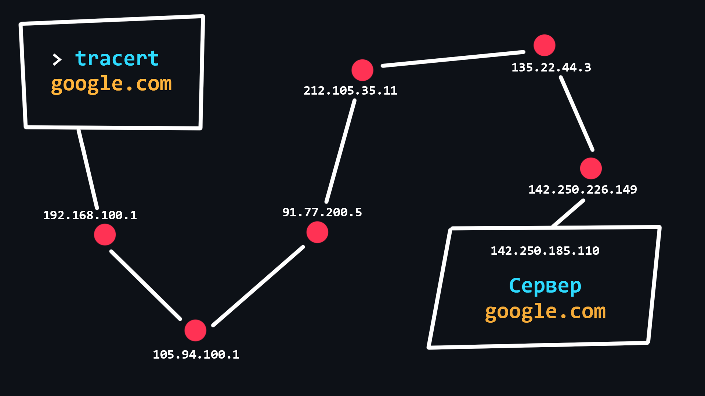</p>

    -   [Трассировка сетевого маршрута](https://ru.wikipedia.org/wiki/Traceroute)
        > Процедура, позволяющая отследить по каким узлам, с какими IP адресами, передаётся отправленный вами пакет прежде чем он достигнет точки назначения. Трассировка может применяться для выявления связанных с работой компьютерной сети проблем, а также для исследования/анализа сети.
    -   [Ping-сканирование](https://ru.wikipedia.org/wiki/Ping)
        > Самый простой способ проверить сервер на работоспособность.
    -   [Проверка на потерю пакетов](https://ru.wikihow.com/%D0%BF%D1%80%D0%BE%D0%B2%D0%B5%D1%80%D0%B8%D1%82%D1%8C-%D0%BF%D0%BE%D1%82%D0%B5%D1%80%D1%8E-%D0%BF%D0%B0%D0%BA%D0%B5%D1%82%D0%BE%D0%B2-%D0%BD%D0%B0-%D0%BA%D0%BE%D0%BC%D0%BF%D1%8C%D1%8E%D1%82%D0%B5%D1%80%D0%B5)
    -   [Wireshark](https://ru.wikipedia.org/wiki/Wireshark)
        > Мощная программа с графическим интерфейсом для анализа всего трафика, проходящего по сети, в режиме реального времени.

<details>
    <summary>🔗 <b>Ссылки на материалы</b></summary>

1. 📄 [**Как находить проблемы с интернетом и кто виноват: часть 1** – habr.com](https://habr.com/ru/post/530324/)
1. 📄 [**Как находить проблемы с интернетом и кто виноват: часть 2** – habr.com](https://habr.com/ru/post/531082/)
1. 📄 [**Прочитай и сделай: проводим сканирование сети самостоятельно** – habr.com](https://habr.com/ru/company/pt/blog/513776/)
1. 📺 [**Основы компьютерных сетей. Диагностика и устранение основных проблем** – YouTube](https://youtu.be/duBeaGZzW7U)
1. 📄 [**Трассировка сетевого маршрута** — hackware.ru](https://hackware.ru/?p=9210#12)
1. 📄 [**Wireshark — приручение акулы** – habr.com](https://habr.com/ru/post/204274/)
1. 📺 [**Протокол HTTPS в WireShark** – YouTube](https://youtu.be/1r1iWq67v3c)
</details>


<div align="right"><a href="#top">Содержание ⬆️</a></div>

## Устройство ПК  

-   ### Основные компоненты (железо)

    - [Материнская плата](https://ru.wikipedia.org/wiki/%D0%9C%D0%B0%D1%82%D0%B5%D1%80%D0%B8%D0%BD%D1%81%D0%BA%D0%B0%D1%8F_%D0%BF%D0%BB%D0%B0%D1%82%D0%B0)
        > Самый важный компонент ПК к которому подключаются все остальные элементы.
        > - [Чипсет](https://ru.wikipedia.org/wiki/%D0%A7%D0%B8%D0%BF%D1%81%D0%B5%D1%82) - набор микросхем, который отвечает за коммуникацию всех элементов материнской платы.
        > - [Сокет](https://ru.wikipedia.org/wiki/%D0%A1%D0%BF%D0%B8%D1%81%D0%BE%D0%BA_%D1%80%D0%B0%D0%B7%D1%8A%D1%91%D0%BC%D0%BE%D0%B2_%D0%BC%D0%B8%D0%BA%D1%80%D0%BE%D0%BF%D1%80%D0%BE%D1%86%D0%B5%D1%81%D1%81%D0%BE%D1%80%D0%BE%D0%B2) - разъем для установки процессора.
        > - [VRM (Voltage Regulator Module)](https://club.dns-shop.ru/blog/t-102-materinskie-platyi/38267-chto-takoe-vrm-materinskoi-platyi) - модуль который преобразовывает поступающие напряжение (как правило 12 В) в более низкое для работы процессора, встроенной графики и оперативной памяти.
        > - Слоты для оперативной памяти.
        > - Слоты расширения [PCI-Express](https://ru.wikipedia.org/wiki/PCI_Express) - предназначены для подключения видеокарт, внешних сетевых/звуковых карт.
        > - Слоты [М.2](https://ru.wikipedia.org/wiki/M.2) / [SATA](https://ru.wikipedia.org/wiki/SATA) - предназначены для подключения жёстких дисков и SSD.
    - [Процессор](https://ru.wikipedia.org/wiki/%D0%A6%D0%B5%D0%BD%D1%82%D1%80%D0%B0%D0%BB%D1%8C%D0%BD%D1%8B%D0%B9_%D0%BF%D1%80%D0%BE%D1%86%D0%B5%D1%81%D1%81%D0%BE%D1%80) (ЦП / CPU)
        > Важнейшее устройство, которое исполняет инструкции (код программы). Процессоры работают только с 1 и 0, поэтому все программы в конечном виде представляют из себя набор двоичного кода.
        > - [Регистры](https://ru.wikipedia.org/wiki/%D0%A0%D0%B5%D0%B3%D0%B8%D1%81%D1%82%D1%80_%D0%BF%D1%80%D0%BE%D1%86%D0%B5%D1%81%D1%81%D0%BE%D1%80%D0%B0) - самая быстрая память в ПК, имеет крайне малый объем, встроена в процессор и предназначена для временного хранения обрабатываемых данных. 
        > - [Кэш (Cache)](https://ru.wikipedia.org/wiki/%D0%9A%D1%8D%D1%88_%D0%BF%D1%80%D0%BE%D1%86%D0%B5%D1%81%D1%81%D0%BE%D1%80%D0%B0) - чуть менее быстрая память, которая так же встроена в процессор и используемая для хранения копии данных из часто используемых ячеек основной памяти.
        > - Процессоры могут иметь разные [архитектуры](https://ru.wikipedia.org/wiki/%D0%90%D1%80%D1%85%D0%B8%D1%82%D0%B5%D0%BA%D1%82%D1%83%D1%80%D0%B0_%D0%BF%D1%80%D0%BE%D1%86%D0%B5%D1%81%D1%81%D0%BE%D1%80%D0%B0). В настоящее время наиболее распространена [архитектура х86](https://ru.wikipedia.org/wiki/X86-64) (настольные ПК и ноутбуки) и [ARM](https://ru.wikipedia.org/wiki/ARM_(%D0%B0%D1%80%D1%85%D0%B8%D1%82%D0%B5%D0%BA%D1%82%D1%83%D1%80%D0%B0)) (мобильные девайсы, а также компьютеры фирмы Apple).
    - [Оперативная память](https://ru.wikipedia.org/wiki/DRAM) (ОЗУ / RAM)
        > Быстрая память небольшого объема (4-16GB), предназначенная для временного хранения кода программы, а также входных, выходных и промежуточных данных, обрабатываемых процессором.
    - [Постоянная память](https://ru.wikipedia.org/wiki/%D0%97%D0%B0%D0%BF%D0%BE%D0%BC%D0%B8%D0%BD%D0%B0%D1%8E%D1%89%D0%B5%D0%B5_%D1%83%D1%81%D1%82%D1%80%D0%BE%D0%B9%D1%81%D1%82%D0%B2%D0%BE)
        > Память большого объема (256GB-1TB), предназначенная для долговременного хранения файлов и установленных программ.
    - [Видеокарта](https://ru.wikipedia.org/wiki/%D0%92%D0%B8%D0%B4%D0%B5%D0%BE%D0%BA%D0%B0%D1%80%D1%82%D0%B0) (GPU)
        > Отдельная плата, занимающаяся переводом и обработкой данных в изображения для вывода их на экран монитора. Такое устройство ещё называют дискретной видеокартой. Обычно нужны для тех, кто занимается 3D моделированием или играет в игры.
        > [Встроенная видеокарта](https://ru.wikipedia.org/wiki/%D0%92%D1%81%D1%82%D1%80%D0%BE%D0%B5%D0%BD%D0%BD%D1%8B%D0%B9_%D0%B3%D1%80%D0%B0%D1%84%D0%B8%D1%87%D0%B5%D1%81%D0%BA%D0%B8%D0%B9_%D0%BF%D1%80%D0%BE%D1%86%D0%B5%D1%81%D1%81%D0%BE%D1%80) – это видеокарта встроенная в процессор. Подходит для повседневной работы.
    - [Сетевая карта](https://ru.wikipedia.org/wiki/%D0%A1%D0%B5%D1%82%D0%B5%D0%B2%D0%B0%D1%8F_%D0%BF%D0%BB%D0%B0%D1%82%D0%B0)
        > Устройство, которое обеспечивает приём и передачу данных от других устройств подключённых к [одной сети](https://ru.wikipedia.org/wiki/%D0%9B%D0%BE%D0%BA%D0%B0%D0%BB%D1%8C%D0%BD%D0%B0%D1%8F_%D0%B2%D1%8B%D1%87%D0%B8%D1%81%D0%BB%D0%B8%D1%82%D0%B5%D0%BB%D1%8C%D0%BD%D0%B0%D1%8F_%D1%81%D0%B5%D1%82%D1%8C).
    - [Звуковая карта](https://ru.wikipedia.org/wiki/%D0%97%D0%B2%D1%83%D0%BA%D0%BE%D0%B2%D0%B0%D1%8F_%D0%BA%D0%B0%D1%80%D1%82%D0%B0)
        > Устройство позволяющее обрабатывать звук, выводить его на другие устройства, записывать с помощью микрофона и т.д.
    - [Блок питания](https://ru.wikipedia.org/wiki/%D0%91%D0%BB%D0%BE%D0%BA_%D0%BF%D0%B8%D1%82%D0%B0%D0%BD%D0%B8%D1%8F_%D0%BA%D0%BE%D0%BC%D0%BF%D1%8C%D1%8E%D1%82%D0%B5%D1%80%D0%B0)
        > Устройство, предназначенное для преобразования напряжения переменного тока от сети в напряжение постоянного тока.

<details>
    <summary>🔗 <b>Ссылки на материалы</b></summary>

1. 📺 [**Устройство Компьютера для чайников** – YouTube](https://youtu.be/QYR_muKHO00)
2. 📺 [**Материнская плата. Из чего она состоит?** – YouTube](https://youtu.be/sABaxhk6hXo)
3. 📄 [**Внутри материнской платы: анализ технологий, лежащих в основе компонентов ПК** – habr.com](https://habr.com/ru/company/pixonic/blog/558602/)
4. 📺 [**Как работает процессор** – YouTube](https://youtu.be/k9wK2FThEsk)
5. 📄 [**Как работает CPU: интерактивный урок** – habr.com](https://habr.com/ru/post/240929/)
6. 📺 [**Как работает кэш процессора** – YouTube](https://youtu.be/7n_8cOBpQrg)
7. 📺 [**Различия компьютерных архитектур** – YouTube](https://youtu.be/vVjvrTnjoVs)
8. 📺 [**ПРОЦЕССОРЫ ARM vs x86: ОБЪЯСНЯЕМ** – YouTube](https://youtu.be/5hBBFnMevvA)
9.  📺 [**Как работает память компьютера** – YouTube](https://youtu.be/Wh22_O8jXVQ)
10. 📄 [**Анатомия оперативной памяти** – habr.com](https://habr.com/ru/post/506470/)
11. 📺 [**Сетевая карта** – YouTube](https://youtu.be/RoL9ro7DWX0)
12. 📄 [**О работе ПК на примере Windows 10 и клавиатуры** – habr.com](https://habr.com/ru/post/483330/)
13. 📄 [**Как работает компьютер: глубокое погружение (на примере Linux)** – habr.com](https://habr.com/ru/articles/755638)
</details>

<div align="right"><a href="#top">Содержание ⬆️</a></div>


-   ### Устройство операционной системы

    <p align="center">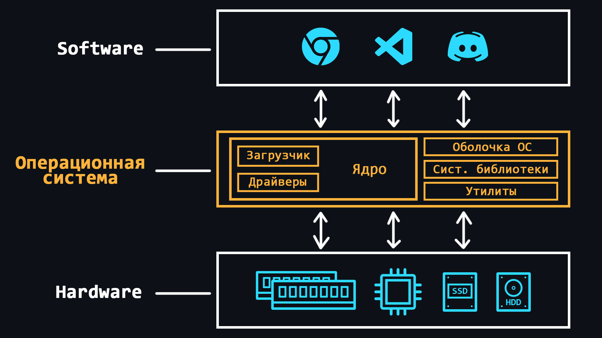</p>

    [Операционная система (ОС)](https://ru.wikipedia.org/wiki/%D0%9E%D0%BF%D0%B5%D1%80%D0%B0%D1%86%D0%B8%D0%BE%D0%BD%D0%BD%D0%B0%D1%8F_%D1%81%D0%B8%D1%81%D1%82%D0%B5%D0%BC%D0%B0) – это комплексная программная система, которая предназначена для управления ресурсами компьютера. Благодаря операционным системам людям не приходится иметь дело непосредственно с процессором, оперативной памятью или другими составляющими ПК. 

    То есть, ОС можно представить как слой абстракции, который управляет железом (hardware) компьютера, тем самым предоставляя простую и удобную среду для работы пользовательского софта (software).

    -   Основные функции
        > - Управление оперативной памятью (выделение пространства для отдельных программ) <br>   
        > - Загрузка программ в оперативную память и их выполнение <br>
        > - Выполнение запросов поступающих от пользовательских программ (ввод и вывод данных, запуск и остановка других программ, высвобождение памяти или выделение дополнительной...) <br>
        > - Взаимодействие с устройствами ввода и вывода (мышь, клавиатура, монитор...) <br>
        > - Взаимодействие с носителями информации (жесткие диски, SSD...) <br>
        > - Предоставление пользовательского интерфейса (консольная оболочка или графичеcкий интерфейс) <br>
        > - Ведение журнала об программных ошибках (сохранение логов)
    -   Дополнительные функции (могут быть не во всех ОС)
        > - Организация [многозадачности](https://ru.wikipedia.org/wiki/%D0%9C%D0%BD%D0%BE%D0%B3%D0%BE%D0%B7%D0%B0%D0%B4%D0%B0%D1%87%D0%BD%D0%BE%D1%81%D1%82%D1%8C) (одновременное выполнение нескольких программ) <br> 
        > - Разграничивание доступа к ресурсам для каждого процесса <br>
        > - [Взаимодействие между процессами](https://ru.wikipedia.org/wiki/%D0%9C%D0%B5%D0%B6%D0%BF%D1%80%D0%BE%D1%86%D0%B5%D1%81%D1%81%D0%BD%D0%BE%D0%B5_%D0%B2%D0%B7%D0%B0%D0%B8%D0%BC%D0%BE%D0%B4%D0%B5%D0%B9%D1%81%D1%82%D0%B2%D0%B8%D0%B5) (обмен данными, синхронизация) <br>
        > - Организация защиты самой ОС от других программ и действий самого пользователя <br>
        > - Предоставление многопользовательского режима и разграничение прав между разными пользователями ОС (админ, гость...)
    -   [Ядро ОС](https://ru.wikipedia.org/wiki/%D0%AF%D0%B4%D1%80%D0%BE_%D0%BE%D0%BF%D0%B5%D1%80%D0%B0%D1%86%D0%B8%D0%BE%D0%BD%D0%BD%D0%BE%D0%B9_%D1%81%D0%B8%D1%81%D1%82%D0%B5%D0%BC%D1%8B)
        > Центральная часть ОС, которая используется наиболее интенсивно. Ядро постоянно находится в памяти, в то время как другие части ОС загружаются в память и выгружаются из неё по мере надобности.
    -   [Загрузчик ОС](https://ru.wikipedia.org/wiki/%D0%97%D0%B0%D0%B3%D1%80%D1%83%D0%B7%D1%87%D0%B8%D0%BA_%D0%BE%D0%BF%D0%B5%D1%80%D0%B0%D1%86%D0%B8%D0%BE%D0%BD%D0%BD%D0%BE%D0%B9_%D1%81%D0%B8%D1%81%D1%82%D0%B5%D0%BC%D1%8B)
        > Системный софт, который обеспечивает подготовку окружения для запуска ОС (приводит аппаратуру в нужное состояние, подготавливает память, загружает туда ядро ОС и передает ему (ядру) управление).
    -   [Драйверы](https://ru.wikipedia.org/wiki/%D0%94%D1%80%D0%B0%D0%B9%D0%B2%D0%B5%D1%80)
        > Специальное ПО, которое позволяет ОС работать с тем или иным оборудованием.

<details>
    <summary>🔗 <b>Ссылки на материалы</b></summary>

1. 📺 [**Что такое операционная система и как она работает** – YouTube](https://www.youtube.com/watch?v=hb9CTGSJm88&t)
1. 📺 [**Плейлист по операционным системам** – YouTube](https://www.youtube.com/playlist?list=PLo6puixMwuSPrKOCsJhrtr-m79mFthit9)
1. 📄 [**Что такое операционная система и как она работает?** – GitHub](https://github.com/Steindvart/My_study/blob/master/docs/source/OS/articles/what_is_os.rst)
1. 📺 [**Что такое ядро операционной системы? Назначение и виды ядер** – YouTube](https://youtu.be/Bdh88Fd--54)
1. 📺 [**Ввод-вывод внутри компьютера** – YouTube](https://youtu.be/JkOB_eOgNXQ)
</details>


<div align="right"><a href="#top">Содержание ⬆️</a></div>

-   ### Процессы и потоки

    <p align="center">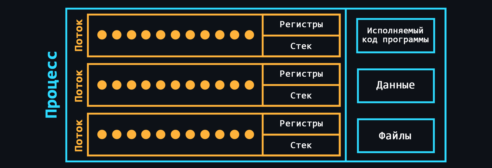</p>

    -   [Процесс](https://ru.wikipedia.org/wiki/%D0%9F%D1%80%D0%BE%D1%86%D0%B5%D1%81%D1%81_(%D0%B8%D0%BD%D1%84%D0%BE%D1%80%D0%BC%D0%B0%D1%82%D0%B8%D0%BA%D0%B0)) 
        > Cвоего рода контейнер, в котором находятся все необходимые ресурсы для работы той или иной программы. Как правило в состав процесса входят:
        > -   Исполняемый код программы <br>
        > -   Входные и выходные данные <br>
        > -   [Стек вызовов](https://ru.wikipedia.org/wiki/%D0%A1%D1%82%D0%B5%D0%BA_%D0%B2%D1%8B%D0%B7%D0%BE%D0%B2%D0%BE%D0%B2) (порядок инструкций для выполнения) <br>
        > -   [Куча](https://ru.wikipedia.org/wiki/%D0%9A%D1%83%D1%87%D0%B0_(%D0%BF%D0%B0%D0%BC%D1%8F%D1%82%D1%8C)) (структура для хранения промежуточных данных, создаваемых во время работы процесса) <br>
        > -   [Дескриптор сегмента](https://ru.wikipedia.org/wiki/%D0%94%D0%B5%D1%81%D0%BA%D1%80%D0%B8%D0%BF%D1%82%D0%BE%D1%80_%D1%81%D0%B5%D0%B3%D0%BC%D0%B5%D0%BD%D1%82%D0%B0) <br>
        > -   [Файловые дескрипторы](https://ru.wikipedia.org/wiki/%D0%A4%D0%B0%D0%B9%D0%BB%D0%BE%D0%B2%D1%8B%D0%B9_%D0%B4%D0%B5%D1%81%D0%BA%D1%80%D0%B8%D0%BF%D1%82%D0%BE%D1%80) <br>
        > -   Информация о наборе допустимых полномочий <br>
        > -   Информация о состоянии процессора
    -   [Поток](https://ru.wikipedia.org/wiki/%D0%9F%D0%BE%D1%82%D0%BE%D0%BA_%D0%B2%D1%8B%D0%BF%D0%BE%D0%BB%D0%BD%D0%B5%D0%BD%D0%B8%D1%8F) 
        > Cущность, в которой выполняются последовательности действий (процедуры) программы. Потоки находятся внутри процесса и используют то же адресное пространство. В одном процессе может быть несколько потоков, что обеспечивает возможность выполнения нескольких задач. Эти задачи, благодаря потокам, могут обмениваться данными, использовать общие данные или результаты других задач.

<details>
    <summary>🔗 <b>Ссылки на материалы</b></summary>

1. 📺 [**Процессы и потоки в операционной системе** – YouTube](https://youtu.be/Xwm_88dDdBQ)
1. 📄 [**Процессы и потоки**](https://learnc.info/c/processes_and_threads.html)
1. 📺 [**Что такое поток?** – YouTube](https://youtu.be/t1JpAC1LOKg)
1. 📄 [**Многозадачность и процессы**](https://doka.guide/tools/multitasking-and-processes/)
</details>


<div align="right"><a href="#top">Содержание ⬆️</a></div>

-   ### Конкурентность и параллелизм

    <p align="center">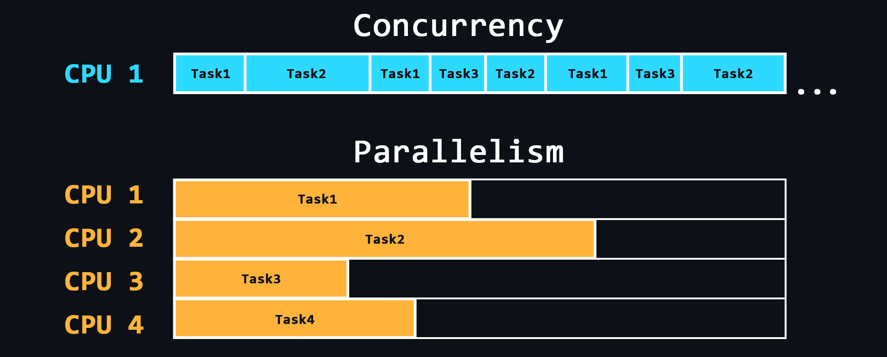</p>

    -   [Параллелизм (Parallelism)](https://ru.wikipedia.org/wiki/%D0%9F%D0%B0%D1%80%D0%B0%D0%BB%D0%BB%D0%B5%D0%BB%D0%B8%D0%B7%D0%BC_(%D0%B8%D0%BD%D1%84%D0%BE%D1%80%D0%BC%D0%B0%D1%82%D0%B8%D0%BA%D0%B0))
        > Способность выполнять несколько задач одновременно используя несколько ядер процессора, где на каждом отдельном ядре выполняется отдельно взятая задача.
    -   [Конкурентность (Concurrency)](https://en.wikipedia.org/wiki/Concurrency_(computer_science))
        > Способность выполнять несколько задач, но используя одно ядро процессора. Это достигается путем разделения задач на отдельные блоки команд, которые выполняются по очереди, но переключение между этими блоками происходит настолько быстро, что для пользователей создается впечатление, будто эти процессы выполняются одновременно.

<details>
    <summary>🔗 <b>Ссылки на материалы</b></summary>

1. 📺 [**Чем отличаются Concurrency и Parallelism** – YouTube](https://youtu.be/4PNneed92lM)
2. 📄 [**Отличие между конкурентностью, параллелизмом и многопоточностью** – GitHub](https://github.com/gm-soft/knowledge-base/blob/master/dot-net/2019-11-06-asynchronous-programming-epm-theory.md)
3. 📄 [**Parallelism vs Concurrency: правильно подбираем инструменты** – habr.com](https://habr.com/ru/company/piter/blog/274569/)
4. 📄 [**Параллелизм против многопоточности против асинхронного программирования: разъяснение** – habr.com](https://habr.com/ru/post/337528/)
</details>

<div align="right"><a href="#top">Содержание ⬆️</a></div>

-   ### Межпроцессорное взаимодействие

    Механизм позволяющий организовать обмен данными между потоками одного или разных процессов. Причем, процессы могут быть запущены как на одном и том же компьютере, так и на разных, соединенных сетью. [Межпроцессорные взаимодействия](https://ru.wikipedia.org/wiki/%D0%9C%D0%B5%D0%B6%D0%BF%D1%80%D0%BE%D1%86%D0%B5%D1%81%D1%81%D0%BD%D0%BE%D0%B5_%D0%B2%D0%B7%D0%B0%D0%B8%D0%BC%D0%BE%D0%B4%D0%B5%D0%B9%D1%81%D1%82%D0%B2%D0%B8%D0%B5) бывают разных типов.

    -   [Файл](https://ru.wikipedia.org/wiki/%D0%A4%D0%B0%D0%B9%D0%BB)
        > Самый простой способ организовать обмен данными. Один процесс записывает данные в определенный файл, другой процесс читает этот же файл и тем самым получает данные от первого процесса.
    -   [Сигнал](https://ru.wikipedia.org/wiki/%D0%A1%D0%B8%D0%B3%D0%BD%D0%B0%D0%BB%D1%8B_(UNIX))
        > Асинхронное уведомление одного процесса о событии произошедшем в другом процессе.
    -   [Сокет](https://ru.wikipedia.org/wiki/%D0%A1%D0%BE%D0%BA%D0%B5%D1%82_(%D0%BF%D1%80%D0%BE%D0%B3%D1%80%D0%B0%D0%BC%D0%BC%D0%BD%D1%8B%D0%B9_%D0%B8%D0%BD%D1%82%D0%B5%D1%80%D1%84%D0%B5%D0%B9%D1%81))
        > В частности для взаимодействия между компьютерами с помощью стека протоколов TCP/IP используются IP-адреса и порты. Эта пара определяет сокет («гнездо», соответствующее адресу и порту).
    -   [Семафор](https://ru.wikipedia.org/wiki/%D0%A1%D0%B5%D0%BC%D0%B0%D1%84%D0%BE%D1%80_(%D0%B8%D0%BD%D1%84%D0%BE%D1%80%D0%BC%D0%B0%D1%82%D0%B8%D0%BA%D0%B0))
        > Счетчик над которым можно проводить только 2 операции: увеличение и уменьшение (причем для 0 операция уменьшения блокируется).
    -   [Сообщения](https://ru.wikipedia.org/wiki/%D0%9E%D0%B1%D0%BC%D0%B5%D0%BD_%D1%81%D0%BE%D0%BE%D0%B1%D1%89%D0%B5%D0%BD%D0%B8%D1%8F%D0%BC%D0%B8) и [очереди сообщений](https://ru.wikipedia.org/wiki/%D0%9E%D1%87%D0%B5%D1%80%D0%B5%D0%B4%D1%8C_%D1%81%D0%BE%D0%BE%D0%B1%D1%89%D0%B5%D0%BD%D0%B8%D0%B9)
    -   [Каналы](https://ru.wikipedia.org/wiki/%D0%9A%D0%BE%D0%BD%D0%B2%D0%B5%D0%B9%D0%B5%D1%80_(Unix)) (akа конвейеры, pipes)
        > Перенаправление выходных данных одного процесса на вход другого процесса (подобие трубы).

<details>
    <summary>🔗 <b>Ссылки на материалы</b></summary>

1. 📺 [**Архитектура ЭВМ. Межпроцессное взаимодействие** – YouTube](https://youtu.be/XAODLLrV3uk)
1. 📺 [**Основы программирования. Межпроцессное взаимодействие** – YouTube](https://youtu.be/Mz7UEdqbEpw)
1. 📄 [**IPC: основы межпроцессного взаимодействия**](https://www.rsdn.org/article/baseserv/ipc.xml)
1. 📺 [**Интерфейс сокетов | Курс "Компьютерные сети"** – YouTube](https://youtu.be/_vAjHdh92YU)
1. 📺 [**Порты, сокеты, статика (для самых маленьких программистов)** – YouTube](https://youtu.be/-bLRj0U-xhc)
1. 📺 [**Разделяемая память. Семафоры** – YouTube](https://youtu.be/g_qco-EJqDM)
</details>

<div align="right"><a href="#top">Содержание ⬆️</a></div>

## Основы Linux

Операционные системы на базе [ядра Linux](https://ru.wikipedia.org/wiki/%D0%AF%D0%B4%D1%80%D0%BE_Linux) это стандарт в мире серверной разработки, поскольку большинство серверов работают именно на таких ОС. Использовать Linux на серверах выгодно, ведь он распространяется бесплатно, имеет открытый исходный код, имеет достаточно высокий уровень безопасности и работает быстро, даже на слабом железе.

Существует огромное количество [дистрибутивов](https://ru.wikipedia.org/wiki/%D0%94%D0%B8%D1%81%D1%82%D1%80%D0%B8%D0%B1%D1%83%D1%82%D0%B8%D0%B2_Linux) (сборок с набором предустановленного ПО) Linux на любой вкус и цвет. Одним из самых популярных является [Ubuntu](https://ru.wikipedia.org/wiki/Ubuntu). Именно с него можно начать своё погружение в серверную разработку.

[Установить Ubuntu](https://ubuntu.com/download/desktop) можно на отдельный ПК или ноутбук. Если такой возможности нет, можно воспользоваться специальной программой [Virtual Box](https://www.virtualbox.org/wiki/Downloads), в которой можно [запускать другие ОС](https://lumpics.ru/how-install-ubuntu-on-virtualbox-virtual-machine/) поверх основной. Так же можно запустить [Docker](https://www.docker.com/products/docker-desktop) [контейнер с образом Ubuntu](https://losst.ru/zapusk-kontejnera-docker) (Docker - это [отдельная тема](#docker), которая рассматривается в этом репозитории).

После этого можно быстро пройти [вводный курс по Linux и Bash](https://younglinux.info/bash/linux).

-   ### Работа с командной оболочкой

    [Командная оболочка](https://ru.wikipedia.org/wiki/%D0%9E%D0%B1%D0%BE%D0%BB%D0%BE%D1%87%D0%BA%D0%B0_%D0%BE%D0%BF%D0%B5%D1%80%D0%B0%D1%86%D0%B8%D0%BE%D0%BD%D0%BD%D0%BE%D0%B9_%D1%81%D0%B8%D1%81%D1%82%D0%B5%D0%BC%D1%8B) (или, как ещё говорят - консоль, терминал) - программа, в которой для управления компьютером используются специальные текстовые команды. Как правило, на серверах отсутствуют [графические оболочки](https://ru.wikipedia.org/wiki/%D0%93%D1%80%D0%B0%D1%84%D0%B8%D1%87%D0%B5%D1%81%D0%BA%D0%B8%D0%B9_%D0%B8%D0%BD%D1%82%D0%B5%D1%80%D1%84%D0%B5%D0%B9%D1%81_%D0%BF%D0%BE%D0%BB%D1%8C%D0%B7%D0%BE%D0%B2%D0%B0%D1%82%D0%B5%D0%BB%D1%8F), поэтому вам обязательно понадобятся навыки работы с терминалом. Существуют разные [UNIX-подобные командные оболочки](https://ru.wikipedia.org/wiki/%D0%9A%D0%BE%D0%BC%D0%B0%D0%BD%D0%B4%D0%BD%D0%B0%D1%8F_%D0%BE%D0%B1%D0%BE%D0%BB%D0%BE%D1%87%D0%BA%D0%B0_Unix), но большинство дистрибутивов Linux поставляются с [оболочкой Bash](https://ru.wikipedia.org/wiki/Bash) по умолчанию.

    -   Основные команды для навигации по файловой системе
        ```sh
        ls # просмотр содержимого директории
        cd [ПУТЬ] # переход в указанный каталог
        cd .. # переход на уровень выше (в родительский каталог)
        touch [ФАЙЛ] # создание файла
        cat > [ФАЙЛ] # ввод текста в файл из консоли (перезапись)
        cat >> [ФАЙЛ] # ввод текста в конец файла (добавление)
        cat/more/less [ФАЙЛ] # просмотр содержимого файла
        head/tail [ФАЙЛ] # просмотр первых/последних строк файла
        pwd # вывести абсолютный путь к текущей директории
        mkdir [ИМЯ] # создать директорию
        rmdir [ИМЯ] # удалить директорию
        cp [ФАЙЛ] [ПУТЬ] # копировать файл или директорию
        mv [ФАЙЛ] [ПУТЬ] # перемещение или переименование
        rm [ФАЙЛ] # удаление файла или директории
        find [СТРОКА] # поиск в файловой системе
        du [ФАЙЛ] # вывод размера файла или каталога
        grep [ПАТТЕРН] [ФАЙЛ] # вывести строки соответствующие паттерну
        ```
    -   Команды для получения справочной информации
        ```sh
        man [КОМАНДА] # позволяет посмотреть руководство по любой команде
        apropos [СТРОКА] # поиск команды с описанием имеющим указанную строку
        man -k [СТРОКА] # аналогично команде выше
        whatis [КОМАНДА] # краткое описание команды
        ```
    -   [Права суперпользователя](https://ru.wikipedia.org/wiki/Sudo)
        > Аналог запуска от имени администратора в Windows
        ```sh
        sudo [КОМАНДА] # выполняет команду с правами суперпользователя
        ```
    -   Текстовый редактор
        > Изучите любой для того чтобы свободно читать и редактировать файлы через терминал.
        > Самый простой – [nano](https://habr.com/ru/post/106471/).
        > Что-то среднее – [micro](https://micro-editor.github.io/).
        > Самый продвинутый – [Vim](https://habr.com/ru/company/ruvds/blog/544160/).

<details>
    <summary>🔗 <b>Ссылки на материалы</b></summary>

1. 📺 [**Linux для Начинающих (Плейлист)** – YouTube](https://youtube.com/playlist?list=PLg5SS_4L6LYuE4z-3BgLYGkZrs-cF4Tep)
2. 📄 [**Основные linux-команды для новичка** – habr.com](https://habr.com/ru/post/501442/)
3. 📄 [**44 команды Linux которые вы должны знать** – losst.ru](https://losst.ru/42-komandy-linux-kotorye-vy-dolzhny-znat)
4. 📄 [**Основные команды Linux: (почти) полное руководство с примерами** – selectel.ru](https://selectel.ru/blog/basic-linux-commands/)
5. 📄 [**Шпаргалка для редактора Nano**](https://www.nano-editor.org/dist/latest/cheatsheet.html)
6. 📄 [**Документация для редактора Micro на русском**](https://akawah.ru/linux/micro.html)
7. 📄 [**Основы редактора Vim (Плейлист)** – YouTube](https://youtube.com/playlist?list=PLcjongJGYetkY4RFSVftH43F91vgzqB7U)
8. 📄 [**Изучение терминала через прохождение челленджей**](https://overthewire.org/wargames/)
</details>

<div align="right"><a href="#top">Содержание ⬆️</a></div>

-   ### Менеджер пакетов

    Менеджер пакетов – это утилита позволяющая устанавливать/обновлять программные пакеты с помощью терминала.

    Linux дистрибутивы можно разделить на несколько групп, в зависимости от того, какой в них используется менеджер пакетов: [apt](https://ru.wikipedia.org/wiki/Advanced_Packaging_Tool) (в дистрибутивах на основе [Debian](https://ru.wikipedia.org/wiki/Debian)), [RPM](https://ru.wikipedia.org/wiki/RPM) (система управления пакетами [Red Hat](https://ru.wikipedia.org/wiki/Red_Hat)) и [Pacman](https://ru.wikipedia.org/wiki/Pacman_(%D1%81%D0%B8%D1%81%D1%82%D0%B5%D0%BC%D0%B0_%D1%83%D0%BF%D1%80%D0%B0%D0%B2%D0%BB%D0%B5%D0%BD%D0%B8%D1%8F_%D0%BF%D0%B0%D0%BA%D0%B5%D1%82%D0%B0%D0%BC%D0%B8)) (менеджер пакетов в [Arch-подобных дистрибутивах](https://ru.wikipedia.org/wiki/Arch_Linux))

    Ubuntu основан на Debian, поэтому там используется менеджер пакетов apt (advanced packaging tool).

    -   Базовые команды
        ```sh
        apt install [имя_пакета] # установить пакет
        apt remove [имя_пакета] # удалить пакет, но оставить конфигурацию
        apt purge [имя_пакета] # удалить пакет вместе с конфигурацией
        apt update # обновление информации о новых версиях пакетов
        apt upgrade # обновление пакетов, установленных в системе
        apt list --installed # список установленных в системе пакетов
        apt list --upgradable # список пакетов, которые требуют обновления
        apt search [имя] # поиск пакетов по имени в сети
        apt show [имя_пакета] # информация о пакете
        ```
    -   [aptitude](https://ru.wikipedia.org/wiki/Aptitude)
        > Интерактивная консольная утилита для удобного просмотра пакетов для их установки, обновления и удаления.
    -   Управление репозиториями пакетов
        > Менеджеры пакетов обычно работают с удаленными репозиториями. Эти репозитории содержат коллекцию программных пакетов, которые поддерживаются и предоставляются сообществом дистрибутива или официальными источниками.
        ```sh
        add-apt-repository [ССЫЛКА] # подключить новый репозиторий
        add-apt-repository --remove [ССЫЛКА] # отключить репозиторий
            # не забывайте обновлять информацию о пакетах - apt update
        ```
        ```sh
        /etc/apt/sources.list # файл содержащий ссылки на репозитории
        /etc/apt/sources.list.d # каталог содержащий файлы со сторонними репозиториями
        ```
    -   [dpkg](https://ru.wikipedia.org/wiki/Dpkg)
        > Низкоуровневый инструмент для управления пакетов Debian.

<details>
    <summary>🔗 <b>Ссылки на материалы</b></summary>

1. 📄 [**Как пользоваться apt** – losst.ru](https://losst.ru/kak-polzovatsya-apt)
2. 📄 [**Использование APT. Команды apt и apt-get** – pingvinus.ru](https://pingvinus.ru/note/apt)
</details>

<div align="right"><a href="#top">Содержание ⬆️</a></div>

-   ### Скрипты Bash

    С помощью скриптов (сценариев) можно автоматизировать последовательный ввод любого количества команд. В [Bash](https://ru.wikipedia.org/wiki/Bash#%D0%A1%D0%BA%D1%80%D0%B8%D0%BF%D1%82%D1%8B) можно создавать различные условия (разветвления), циклы, таймеры и т.д. для выполнения всевозможных действий связанных с вводом в терминал.

    -   [Основы Bash скриптов](https://github.com/cheatsnake/bash-scripts-by-example/blob/master/README_RUS.md)
        > Самые базовые и часто используемые возможности такие как: переменные, ввод/вывод, циклы, условия и т.д. 
    -   Практика
        > Решайте задания на таких сайтах как [HackerRank](https://www.hackerrank.com/domains/shell) и [Codewars](https://www.codewars.com/join?language=shell). <br>
        > Начните использовать Bash для автоматизации рутинных действий на своем компьютере. Если вы уже занимаетесь программированием, создавайте скрипты для удобной сборки вашего проекта, для установки настроек и так далее.
    -   [ShellCheck](https://github.com/koalaman/shellcheck) инструмент для анализа скриптов
        > Укажет Вам на возможные ошибки и научит лучшим практикам написания действительно качественных скриптов.
    -   Дополнительные ресурсы
        > В таких репозиториях, как [awesome bash](https://github.com/awesome-lists/awesome-bash) и [awesome shell](https://github.com/alebcay/awesome-shell) собраны целые коллекции полезных ресурсов и инструментов, которые помогут развить ещё больше навыков работы с Bash и терминалом в общем.

<details>
    <summary>🔗 <b>Ссылки на материалы</b></summary>

1. 📺 [**Основы работы с Bash** – YouTube](https://youtube.com/playlist?list=PLR-hhxrErPAXqI1b4paqCKhWPoXMRLj_G)
2. 📄 [**Интерактивный онлайн-тренажёр по основам Bash**](https://www.learnshell.org/)
3. 📄 [**Bash-скрипты: начало** – habr.com](https://habr.com/ru/company/ruvds/blog/325522/)
4. 📄 [**Шпаргалка по Bash** – Learn X in Y minutes](https://learnxinyminutes.com/docs/ru-ru/bash-ru/)
5. 📄 [**Шпаргалка оп Bash** – quickref.me](https://quickref.me/bash)
6. 📄 [**Страница Bash на Reddit** – reddit.com](https://www.reddit.com/r/bash/)
7. 📄 [**Лучшие практики Bash скриптов** – habr.com](https://habr.com/ru/company/vk/blog/513064/)
8. 📄 [**Как работает bash: разбираемся в деталях** – VK Cloud](https://mcs.mail.ru/blog/detali-raboty-bash)
</details>

<div align="right"><a href="#top">Содержание ⬆️</a></div>

-   ### Пользователи, группы и права доступа

    ОС на базе Linux являются многопользовательскими. Это означает, что несколько людей могут запускать множество различных приложений одновременно на одном и том же компьютере. Чтобы система Linux смогла «узнать» пользователя, он должен войти в систему, соответственно каждый пользователь должен иметь уникальное имя и секретный пароль.

    -   Работа с пользователями
        ```sh
        useradd [имя] [ключи] # создать нового пользователя
        passwd [имя] # установить пароль пользователю
        usermod [имя] [ключи] # редактировать пользователя
        usermod -L [имя] # заблокировать пользователя
        usermod -U [имя] # разблокировать пользователя
        userdel [имя] [ключи] # удалить пользователя
        su [имя] # переключиться на другого пользователя
        ```
    -   Работа с группами
        ```sh
        groupadd [группа] [ключи] # создать группу
        groupmod [группа] [опции] # редактировать группу
        groupdel [группа] [опции] # удалить группу
        usermod -a -G [группы] [пользователь] # добавить пользователя в группы
        gpasswd --delete [пользователь] [группы] # удалить пользователя из групп
        ```
    -   Системные файлы
        ```sh
        /etc/passwd # файл содержащий основную информацию о пользователях
        /etc/shadow # файл содержащий зашифрованные пароли
        /etc/group # файл содержащий основную информацию о группах
        /etc/gshadow # файл содержащий шифрованные пароли групп
        ```

    В Linux можно разделять привилегии между пользователями, ограничить доступ к нежелательным файлам или возможностям, контролировать доступные действия для сервисов и многое другое. В Linux существует всего три вида прав - право на чтение, запись и выполнение, а также три категории пользователей, к которым они могут применяться - владелец файла, группа файла и все остальные.

    <p align="center">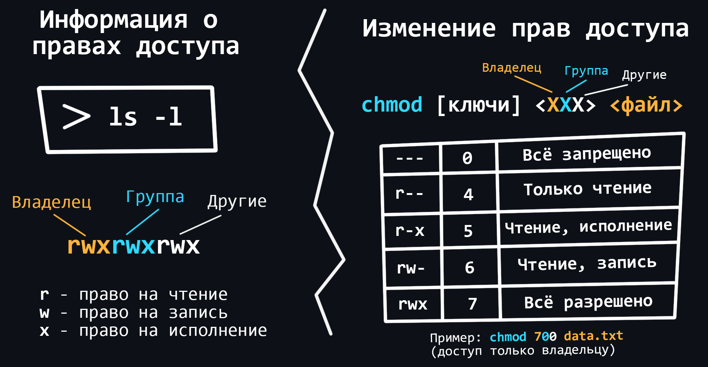</p>

    -   Основные команды для работы с правами
        ```sh
        chown <пользователь> [файл] # изменяет владельца и/или группу для указанных файлов
        chmod <права> [файл] # изменяет права доступа к файлам и каталогам
        chgrp <группа> [файл] # позволяет пользователям изменять группы
        ```
    -   Расширенные права [SUID](https://ru.wikipedia.org/wiki/Suid), [GUID](https://ru.wikipedia.org/wiki/Suid) и [sticky bit](https://ru.wikipedia.org/wiki/Sticky_bit)
    -   [ACL (Access control list)](https://help.ubuntu.ru/wiki/access_control_list)
        > Продвинутая подсистема для управления правами доступа.

<details>
    <summary>🔗 <b>Ссылки на материалы</b></summary>

1. 📄 [**Пользователи в Linux: добавление, изменение, удаление**](https://host-consult.ru/polzovateli-v-linux/)
2. 📄 [**Группы и пользователи в Linux**](https://sysadminium.ru/groups_and_users_in_linux/)
3. 📄 [**Права доступа в Linux** – younglinux.info](https://younglinux.info/bash/rwx)
4. 📄 [**Управление доступом в Linux**](https://zinvapel.github.io/it/tools/2018/01/10/linux-users/)
5. 📄 [**Команда chmod – изменение прав доступа** – younglinux.info](https://younglinux.info/bash/chmod)
6. 📄 [**Права в Linux (chown, chmod, SUID, GUID, sticky bit, ACL, umask)** – habr.com](https://habr.com/ru/post/469667/)
7. 📄 [**Быть или не быть ACL в администрировании Linux** – habr.com](https://habr.com/ru/company/southbridge/blog/673570/)
</details>

<div align="right"><a href="#top">Содержание ⬆️</a></div>

-   ### Работа с процессами

    Процессы в Linux можно описать как контейнеры, в которых хранится вся информация о состоянии выполняемой программы. Иногда программы могут зависнуть и чтобы их принудительно закрыть или перезапустить необходимо уметь управлять процессами.

    -   Базовые команды
        ```sh
        ps # вывести 'снимок' процессов всех пользователей
        top # диспетчер задач в реальном времени
        [команда] & # запуск процесса в фоновом режиме, (не блокируя ввод в терминал)
        jobs # список запущенных в фоновом режиме процессов
        fg [номер/PID] # вернуть процесс обратно в активный режим по его номеру
        bg [номер/PID] # запуск остановленного процесса в фоновый режим
        kill [id процесса] # завершить процесс по id
        killall [программа] # завершить все процессы связанные с одной программой
        ```

<details>
    <summary>🔗 <b>Ссылки на материалы</b></summary>

1. 📺 [**Работа с процессами в Linux** – YouTube](https://www.youtube.com/watch?v=Y4W_rJStNSA)
2. 📄 [**Шпаргалка по работе процессами в Linux**](https://www.dmosk.ru/miniinstruktions.php?mini=processes-linux)
</details>

<div align="right"><a href="#top">Содержание ⬆️</a></div>

-   ### Работа с SSH

    [Служба SSH](https://ru.wikipedia.org/wiki/SSH) позволяет получить удаленный доступ к терминалу другого компьютера. В случае с персональным компьютером, это может понадобиться для срочного решения какой-либо проблемы, а в случае работы с сервером удаленный доступ через SSH является неотъемлемой и регулярно используемой практикой.

    -   Базовые команды
        ```sh
        apt install openssh-server # установка SSH (хотя он почти везде стоит из коробки)
        service ssh start # запуск SSH
        service ssh stop # остановка SSH
        ssh -p [порт] [user]@[remotehost] # подключение к удаленному ПК через SSH
        ```
    -   [Подключение без пароля](https://wiki.merionet.ru/articles/kak-nastroit-ssh-vxod-bez-parolya/)
        ```sh
        ssh-keygen -t rsa # генерация RSA-ключа для беспарольного входа
        ssh-copy-id -i ~/.ssh/id_rsa [user]@[remotehost] # копирование ключа на удаленную машину
        ```
    -   Файлы конфигураций
        ```sh
        /etc/ssh/sshd_config # глобальные настройки ssh сервера
        ~/.ssh/config # локальные настройки ssh сервера
        ~/.ssh/authorized_keys # файл с сохраненными публичными ключами
        ```

<details>
    <summary>🔗 <b>Ссылки на материалы</b></summary>

1. 📄 [**Что такое протокол SSH**](https://guides.hexlet.io/ru/ssh/)
2. 📄 [**Как пользоваться SSH**](https://losst.ru/kak-polzovatsya-ssh)
3. 📄 [**Удалённое управление по SSH**](https://doka.guide/tools/ssh/)
4. 📺 [**Настраиваем аутентификацию SSH по ключу в Linux** – YouTube](https://youtu.be/IVHv3eVQa14)
5. 📄 [**Почему SSH-ключ — безопасная альтернатива паролю** – selectel.ru](https://selectel.ru/blog/ssh-keys/)
6. 📄 [**SSH-туннели: практические примеры использования и важные функции** – selectel.ru](https://selectel.ru/blog/ssh-tunnels/)
</details>

<div align="right"><a href="#top">Содержание ⬆️</a></div>

-   ### Сетевые утилиты

    Для Linux существует множество, как встроенных, так и сторонних утилит, которые помогут настроить сеть, проанализировать её или устранить возможные проблемы.

    -   Базовые утилиты
        ```sh
        ip address # показать информацию об IPv4 и IPv6 адресах ваших устройств
        ip monitor # мониторинг состояния устройств в режиме реального времени
        ifconfig # параметры сетевого адаптера и IP-протокола
        traceroute <host> # показать маршрут, пройденный пакетами для достижения хоста
        tracepath <host> # отслеживает значения MTU до указанного хоста
        ping <host> # проверка соединения с хостом
        ss -at # показать список всех прослушиваемых TCP-соединений
        dig <host> # показать информацию о сервере имен DNS
        host <host | ip-address> # показать IP-адрес указанного домена
        mtr <host | ip-address> # комбинация утилит ping и traceroute
        nslookup # интерактивный запрос к серверам DNS
        whois <host> # показать информацию о регистрации домена
        ifplugstatus # определение состояния локальных устройств
        iftop # информация о пропускной способности
        ethtool <device name> # показать подробную информацию о устройстве
        nmap # инструмент для изучения и аудита безопасности сети
        bmon # монитор пропускной способности и скорости сети
        firewalld # добавление, настройка и удаление правил брандмауэра
        ipref # измерение и настройка производительности сети
        speedtest-cli # информация о скорости сети
        wget <link> # скачать файл из Интернета
        ```
    -   [`tcpdump`](https://ru.wikipedia.org/wiki/Tcpdump)
        > Консольная утилита, позволяющая перехватывать и анализировать весь сетевой трафик, проходящий через ваш компьютер.
    -   [`netcat`](https://ru.wikipedia.org/wiki/Netcat)
        > Утилита позволяющая устанавливать соединения по TCP и UDP, принимать оттуда данные и передавать их. Может выполнять сканирование портов, передачу файлов и прослушивание портов: как и любой сервер, она может быть использована как [Бэкдор](https://ru.wikipedia.org/wiki/%D0%91%D1%8D%D0%BA%D0%B4%D0%BE%D1%80).
    -   [`iptables`](https://ru.wikipedia.org/wiki/Iptables)
        > Пользовательская утилита, позволяющая настраивать правила фильтрации IP-пакетов брандмауэра ядра Linux. Фильтры организованы в виде таблиц, которые содержат цепочки правил обработки пакетов сетевого трафика.
    -   [`nftables`](https://ru.wikipedia.org/wiki/Nftables)
        > Является современной заменой для `iptables`, а также объединяет в себе ряд других пакетов.
    -   [`curl`](https://ru.wikipedia.org/wiki/CURL)
        > Инструмент командной строки для передачи данных с использованием различных сетевых протоколов.

<details>
    <summary>🔗 <b>Ссылки на материалы</b></summary>

1. 📺 [**Linux для Начинающих - Сетевые комманды** – YouTube](https://youtu.be/MjItfiOG0cs)
2. 📄 [**Шпаргалка по сетевым инструментам Linux** – habr.com](https://habr.com/ru/company/ruvds/blog/417485/)
3. 📄 [**7 важных сетевых Linux-команд** – habr.com](https://habr.com/ru/company/ruvds/blog/567156/)
4. 📄 [**Используем tcpdump для анализа и перехвата сетевого трафика** – habr.com](https://habr.com/ru/company/alexhost/blog/531170/)
5. 📄 [**Что такое Netcat? Bind Shell и Reverse Shell в действии** – habr.com](https://habr.com/ru/post/657613/)
6. 📄 [**Переход с iptables на nftables. Краткий справочник** – habr.com](https://habr.com/ru/company/ruvds/blog/580648/)
7. 📄 [**Что такое curl? Как работает эта команда?** – habr.com](https://highload.today/curl/)
8. 📄 [**Шпаргалка по метрикам производительности cURL** – habr.com](https://habr.com/ru/company/ruvds/blog/568614/)
</details>

<div align="right"><a href="#top">Содержание ⬆️</a></div>

-   ### Планировщик задач

    <p align="center"></p>

    Благодаря планировщикам можно гибко управлять отложенным запуском команд и скриптов. В Linux есть встроенный планировщик [cron](https://ru.wikipedia.org/wiki/Cron), с помощью которого можно легко выполнять необходимые действия через определенные интервалы времени.

    -   Основные команды
        ```sh
        crontab -e # редактирование файла cron текущего пользователя
        crontab -l # вывод содержимого текущего файла расписания
        crontab -r # удаление текущего файла расписания
        ```
    -   Конфигурационные файлы
        ```sh
        /etc/crontab # основной конфиг
        /etc/cron.d/ # дополнительная директория для хранения файлов cron

         # каталоги, в которых можно хранить скрипты запускаемые:
        /etc/cron.daily/ # ежедневно
        /etc/cron.weekly/ # еженедельно
        /etc/cron.monthly/ # ежемесячно
        ```
        
<details>
    <summary>🔗 <b>Ссылки на материалы</b></summary>

1. 📄 [**Использование Cron для автоматизации задач** – Digital Ocean](https://www.digitalocean.com/community/tutorials/how-to-use-cron-to-automate-tasks-ubuntu-1804-ru)
2. 📺 [**Crontab: запуск задач по расписанию** – YouTube](https://youtu.be/52-eyCp56ew)
3. 📄 [**Удобный онлайн-редактор для crontab**](https://crontab.guru/)
</details>

<div align="right"><a href="#top">Содержание ⬆️</a></div>

-   ### Системные логи

    [Файлы журнала (логи)](https://ru.wikipedia.org/wiki/%D0%A4%D0%B0%D0%B9%D0%BB_%D0%B6%D1%83%D1%80%D0%BD%D0%B0%D0%BB%D0%B0) - cпециальные текстовые файлы, в которые заносится вся информация о работе компьютера, программы или пользователя. Они особенно полезны при возникновении багов и ошибок в работе программы или сервера. Рекомендуется периодически просматривать логи, даже если ничего подозрительного не происходит.

    -   Основные лог файлы
        ```sh
        /var/log/syslog или /var/log/messages # информация о ядре, различных службах, обнаруженных
        # устройствах, сетевых интерфейсах и т.д. 
        /var/log/auth.log или /var/log/secure # информация об авторизации пользователей
        /var/log/faillog # неудачные попытки входа в систему
        /var/log/dmesg # информация о драйверах устройств
        /var/log/boot.log # информация о загрузке операционной системы
        /var/log/cron # отчёт о работе планировщика задач cron
        ```
    -   [Утилита lnav](https://lnav.org/)
        > Предназначена для удобного просмотра лог файлов (подсветка, чтение разных форматов, поиск и т.д.)
    -   Ротация логов с помощью [logrotate](https://github.com/logrotate/logrotate)
        > Позволяет настроить автоматическое удаление (чистку) лог-файлов, чтобы не забивать память.
    -   [Демон journald](https://manpages.ubuntu.com/manpages/bionic/man1/journalctl.1.html)
        > Cобирает данные из всех доступных источников и сохраняет их в двоичном формате для удобного и динамичного управления

<details>
    <summary>🔗 <b>Ссылки на материалы</b></summary>

1. 📄 [**Что такое логирование**](https://guides.hexlet.io/ru/logging/)
1. 📄 [**Как посмотреть логи в Linux** – losst.ru](https://losst.ru/kak-posmotret-logi-v-linux)
1. 📄 [**Лог файлы Linux по порядку** – habr.com](https://habr.com/ru/post/332502/)
1. 📄 [**Что такое «управление конфигурацией»**](https://guides.hexlet.io/ru/configuration-management/)
1. 📄 [**Туториал по системным логам Linux**](https://proglib.io/p/pomedlennee-ya-zapisyvayu-tutorial-po-sistemnym-logam-linux-2020-07-09)
1. 📄 [**Документация по lnav на русском**](https://akawah.ru/linux/lnav.html)
1. 📄 [**Ротация логов в Linux с помощью logrotate**](https://www.dmosk.ru/miniinstruktions.php?mini=logrotate-linux)
1. 📄 [**Использование journalctl для просмотра и анализа логов: подробный гайд** – habr.com](https://habr.com/ru/company/ruvds/blog/533918/)
</details>

<div align="right"><a href="#top">Содержание ⬆️</a></div>

-   ### Основные проблемы в Linux

    -   Проблемы с установкой/обновлением пакетов
        > - [Ошибки зависимостей и различные конфликты](https://askubuntu.com/questions/739450/how-to-solve-package-conflicts).
        > - [Неразрешенные зависимости](https://losst.pro/neudovletvorennye-zavisimosti-ubuntu).
    -   [Проблемы с драйверами](https://driverlib.ru/ubuntu-problema-s-drayverami/)
        > Все свободные драйвера Linux встроены прямо в его ядро. Поэтому после установки системы все должно работать "прямо из коробки" (проблемы могут быть с совсем новым оборудованием). Драйвера, исходный код, которых закрыт, считаются проприетарными и не включаются в ядро, а доустанавливаются вручную (например, драйвера для видеокарт Nvidia).
    -   Проблемы с файловой системой
        > - Проверьте доступность дискового пространства с помощью команды `df` и убедитесь, что критические разделы не заполнены.
        > - Используйте команду `fsck` для проверки и устранения несоответствий в файловой системе.
        > - В случае потери или случайного удаления данных используйте такие инструменты восстановления данных, как [`extundelete`](https://extundelete.sourceforge.net/) или [`testdisk`](https://github.com/cgsecurity/testdisk).
    -   Производительность и использование ресурсов
        > - Проверяйте использование системных ресурсов, включая процессор, память и дисковое пространство, с помощью команд `free`, `df` или `du`.
        > - Определите ресурсоемкие процессы с помощью команд `top`, `htop` или `systemd-cgtop`.
        > - Отключайте ненужные службы запуска и фоновые процессы при старте системы.
    -   Проблемы с подключением к сети
        > - Используйте команду `ping` для проверки сетевого подключения к определенному узлу или IP-адресу.
        > - Проверяйте [сетевые настройки](https://losst.pro/nastrojka-seti-iz-konsoli-ubuntu), такие как конфигурация IP, [настройки DNS](https://losst.pro/nastrojka-dns-v-ubuntu) и [правила фаервола](https://losst.pro/nastrojka-ufw-ubuntu).
    -   Проблемы с ядром
        > [Kernel panic](https://ru.wikipedia.org/wiki/Kernel_panic) может возникать из-за ошибки при монтировании корневой файловой системы. <br>
        > Тут лучше всего поможет навык чтения логов для выявления проблем (команда `dmesg`).

<details>
    <summary>🔗 <b>Ссылки на материалы</b></summary>

1. 📄 [**Исправление ошибок в Linux** – losst.ru](https://losst.ru/ispravlenie-oshibok-linux)
2. 📄 [**Установка драйверов в Linux** – losst.ru](https://losst.pro/ustanovka-drajverov-v-linux)
3. 📄 [**Segmentation Fault (распределение памяти компьютера)** – habr.com](https://habr.com/ru/company/nix/blog/277759/)
</details>

<div align="right"><a href="#top">Содержание ⬆️</a></div>

## Общие знания

-   ### Системы счисления

    [Система счисления (СС)](https://ru.wikipedia.org/wiki/%D0%A1%D0%B8%D1%81%D1%82%D0%B5%D0%BC%D0%B0_%D1%81%D1%87%D0%B8%D1%81%D0%BB%D0%B5%D0%BD%D0%B8%D1%8F) представляет собой совокупность символов и правил для обозначения чисел. В информатике принято выделять четыре основных системы счисления: двоичная, восьмеричная, десятичная, шестнадцатеричная. Связано это, в первую очередь, с их использованием в различных отраслях программирования.

    -   [Двоичная СС](https://ru.wikipedia.org/wiki/%D0%94%D0%B2%D0%BE%D0%B8%D1%87%D0%BD%D0%B0%D1%8F_%D1%81%D0%B8%D1%81%D1%82%D0%B5%D0%BC%D0%B0_%D1%81%D1%87%D0%B8%D1%81%D0%BB%D0%B5%D0%BD%D0%B8%D1%8F)
        > Самая важная СС для вычислительной техники. Её использование обосновано тем, что логика работы процессора построена на основе всего двух состояний (включено/выключено, открыто/закрыто, высокий/низкий, истина/ложь, да/нет, больше/меньше).

    <p align="center"></p>

    -   [Восьмеричная СС](https://ru.wikipedia.org/wiki/%D0%92%D0%BE%D1%81%D1%8C%D0%BC%D0%B5%D1%80%D0%B8%D1%87%D0%BD%D0%B0%D1%8F_%D1%81%D0%B8%D1%81%D1%82%D0%B5%D0%BC%D0%B0_%D1%81%D1%87%D0%B8%D1%81%D0%BB%D0%B5%D0%BD%D0%B8%D1%8F)
        > Используется, например, в Linux-системах для выдачи прав доступа.

    <p align="center"></p>

    -   [Десятичная СС](https://ru.wikipedia.org/wiki/%D0%94%D0%B5%D1%81%D1%8F%D1%82%D0%B8%D1%87%D0%BD%D0%B0%D1%8F_%D1%81%D0%B8%D1%81%D1%82%D0%B5%D0%BC%D0%B0_%D1%81%D1%87%D0%B8%D1%81%D0%BB%D0%B5%D0%BD%D0%B8%D1%8F)
        > СС которая удобная для восприятия большинству людей. 
    -   [Шестнадцатеричная СС](https://ru.wikipedia.org/wiki/%D0%A8%D0%B5%D1%81%D1%82%D0%BD%D0%B0%D0%B4%D1%86%D0%B0%D1%82%D0%B5%D1%80%D0%B8%D1%87%D0%BD%D0%B0%D1%8F_%D1%81%D0%B8%D1%81%D1%82%D0%B5%D0%BC%D0%B0_%D1%81%D1%87%D0%B8%D1%81%D0%BB%D0%B5%D0%BD%D0%B8%D1%8F)
        > Для записи используются дополнительно буквы: A, B, C, D, E, F. Широко используется в низкоуровневом программировании и компьютерной документации из-за, того что минимальной адресуемой единицей памяти является 8-битный байт, значения которого удобно записывать двумя шестнадцатеричными цифрами.

    <p align="center"></p>

    -   Перевод из одной СС в другую
        > Для лучшего понимания можно попробовать [онлайн конвертер](https://cheatsnake.github.io/NSConverter/)

    <br>

<details>
    <summary>🔗 <b>Ссылки на материалы</b></summary>

1. 📄 [**Системы счисления: полный гайд**](https://guides.hexlet.io/ru/numeral-systems/)
1. 📺 [**Двоичная система счисления. Самое простое объяснение** – YouTube](https://youtu.be/RcxvcLl1nAs)
1. 📺 [**Системы счисления с нуля | Основы программирования** – YouTube](https://youtu.be/kG_ipMygRUc)
1. 📺 [**Перевод чисел между системами счисления** – YouTube](https://youtu.be/fAmuiQxqWZs)
</details>

<div align="right"><a href="#top">Содержание ⬆️</a></div>

-   ### Логические операции

    [Логические операции](https://ru.wikipedia.org/wiki/%D0%9B%D0%BE%D0%B3%D0%B8%D1%87%D0%B5%D1%81%D0%BA%D0%B0%D1%8F_%D0%BE%D0%BF%D0%B5%D1%80%D0%B0%D1%86%D0%B8%D1%8F) широко используются в программировании для работы с булевыми типами (true/false или 1/0). Результатом логического выражения также является значение булевого типа.

    <table>
    <tr><td width=33% valign=top>
    
    И (AND)
    | a | b | a AND b |
    |---|---|:-------:|
    | 0 | 0 | 0       |
    | 0 | 1 | 0       |
    | 1 | 0 | 0       |
    | 1 | 1 | 1       |
    
    </td><td width=33% valign=top>

    ИЛИ (OR)
    | a | b | a OR b |
    |---|---|:-------:|
    | 0 | 0 | 0       |
    | 0 | 1 | 1       |
    | 1 | 0 | 1       |
    | 1 | 1 | 1       |
    </td><td valign=top>

    Исключающее ИЛИ (XOR)
    | a | b | a XOR b |
    |---|---|:-------:|
    | 0 | 0 | 0       |
    | 0 | 1 | 1       |
    | 1 | 0 | 1       |
    | 1 | 1 | 0       |
    </td></tr>
    </table>

    -   Простейшие логические операции
        > Лежат в основе других всевозможных операций. <br>
        > Всего их 3: [Операция И (AND, &&, Конъюнкция)](https://ru.wikipedia.org/wiki/%D0%9A%D0%BE%D0%BD%D1%8A%D1%8E%D0%BD%D0%BA%D1%86%D0%B8%D1%8F), [операция ИЛИ (OR, ||, Дизъюнкция)](https://ru.wikipedia.org/wiki/%D0%94%D0%B8%D0%B7%D1%8A%D1%8E%D0%BD%D0%BA%D1%86%D0%B8%D1%8F), [операция НЕ (NOT, !)](https://ru.wikipedia.org/wiki/%D0%9B%D0%BE%D0%B3%D0%B8%D1%87%D0%B5%D1%81%D0%BA%D0%B8%D0%B5_%D1%8D%D0%BB%D0%B5%D0%BC%D0%B5%D0%BD%D1%82%D1%8B#%D0%9E%D1%82%D1%80%D0%B8%D1%86%D0%B0%D0%BD%D0%B8%D0%B5_(%D0%B8%D0%BD%D0%B2%D0%B5%D1%80%D1%81%D0%B8%D1%8F)._%D0%9E%D0%BF%D0%B5%D1%80%D0%B0%D1%86%D0%B8%D1%8F_%C2%AB%D0%9D%D0%95%C2%BB).
    -   Операция [`Исключающее  ИЛИ (XOR, Сложение по модулю 2)`](https://ru.wikipedia.org/wiki/%D0%98%D1%81%D0%BA%D0%BB%D1%8E%D1%87%D0%B0%D1%8E%D1%89%D0%B5%D0%B5_%C2%AB%D0%B8%D0%BB%D0%B8%C2%BB)
        > Важная операция, которая является фундаментальной в области шифрования информации. 
    -   [Таблицы истинности](https://ru.wikipedia.org/wiki/%D0%A2%D0%B0%D0%B1%D0%BB%D0%B8%D1%86%D0%B0_%D0%B8%D1%81%D1%82%D0%B8%D0%BD%D0%BD%D0%BE%D1%81%D1%82%D0%B8)
        > Для логических операций существуют специальные таблицы, которые описывают входные данные и возвращаемый результат.
    -   Приоритет операций
        > Наибольший приоритет имеет оператор `НЕ`, за ним следует оператор `И`, а затем оператор `ИЛИ`. С помощью скобок это поведение можно изменить.

<details>
    <summary>🔗 <b>Ссылки на материалы</b></summary>

1. 📺 [**Конъюнкция, дизъюнкция, импликация, эквиваленция, отрицание. На примерах из жизни** – YouTube](https://youtu.be/IF7Blq2TT6s)
2. 📄 [**Логические основы алгоритмизации** – GitHub](https://github.com/kolei/OAP/blob/master/articles/t1l3.md)
3. 📺 [**Основы программирования. Логические операции** – YouTube](https://youtu.be/UZetH9129Lw)
</details>

<div align="right"><a href="#top">Содержание ⬆️</a></div>

-   ### Структуры данных

    [Структуры данных (СД)](https://ru.wikipedia.org/wiki/%D0%A1%D1%82%D1%80%D1%83%D0%BA%D1%82%D1%83%D1%80%D0%B0_%D0%B4%D0%B0%D0%BD%D0%BD%D1%8B%D1%85) – это контейнеры в которых данные хранятся по определенным правилам. В зависимости от этих правил структура данных будет эффективна в одних задачах и неэффективна в других. Поэтому необходимо понимать, когда и где использовать ту или иную структуру.
    -   [Массив](https://ru.wikipedia.org/wiki/%D0%9C%D0%B0%D1%81%D1%81%D0%B8%D0%B2_(%D1%82%D0%B8%D0%BF_%D0%B4%D0%B0%D0%BD%D0%BD%D1%8B%D1%85))
        > СД, которая позволяет хранить данные одинакового типа, где каждому элементу присваивается свой порядковый номер.

    <p align="center"></p>

    -   [Связный список](https://ru.wikipedia.org/wiki/%D0%A1%D0%B2%D1%8F%D0%B7%D0%BD%D1%8B%D0%B9_%D1%81%D0%BF%D0%B8%D1%81%D0%BE%D0%BA)
        > СД где все элементы, помимо данных, содержат ссылки на последующий и/или предыдущий элемент. Существуют 3 разновидности: 
        > - Односвязный список – СД, где каждый элемент хранит ссылку только на следующий (одно направление).
        > - Двусвязный список – СД, где элементы содержат ссылки, как на следующий элемент, так и на предыдущий (два направления).
        > - Кольцевой список – разновидность двусвязного списка, где последний элемент кольцевого списка содержит указатель на первый, а первый — на последний.

    <p align="center"></p>

    -   [Стек](https://ru.wikipedia.org/wiki/%D0%A1%D1%82%D0%B5%D0%BA)
        > СД где хранение данных работает по принципу "последним пришел – первым вышел".

    <p align="center">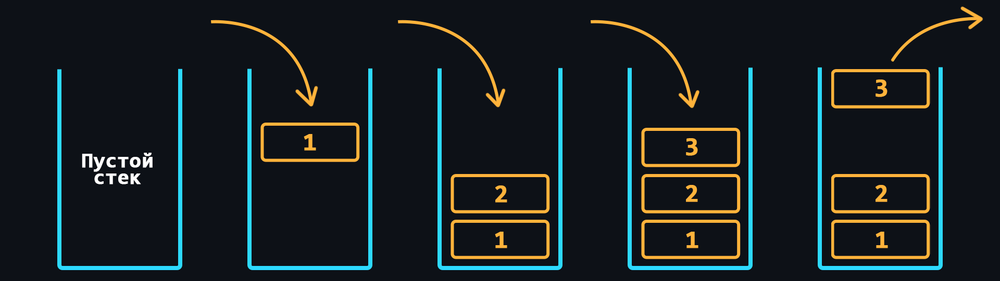</p>

    -   [Очередь](https://ru.wikipedia.org/wiki/%D0%9E%D1%87%D0%B5%D1%80%D0%B5%D0%B4%D1%8C_(%D0%BF%D1%80%D0%BE%D0%B3%D1%80%D0%B0%D0%BC%D0%BC%D0%B8%D1%80%D0%BE%D0%B2%D0%B0%D0%BD%D0%B8%D0%B5))
        > СД где хранение данных происходит по принципу "первым пришел – первым вышел".

    <p align="center"></p>

    -   [Хеш-таблица](https://ru.wikipedia.org/wiki/%D0%A5%D0%B5%D1%88-%D1%82%D0%B0%D0%B1%D0%BB%D0%B8%D1%86%D0%B0)
        > По другому ассоциативный массив. Здесь для обращения к каждому из элементов используется соответствующее ключевое значение, которое вычисляется с помощью [хеш-функции](https://ru.wikipedia.org/wiki/%D0%A5%D0%B5%D1%88-%D1%84%D1%83%D0%BD%D0%BA%D1%86%D0%B8%D1%8F) по определенному алгоритму.

    <p align="center">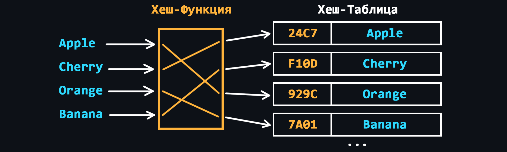</p>

    -   [Дерево](https://ru.wikipedia.org/wiki/%D0%94%D0%B5%D1%80%D0%B5%D0%B2%D0%BE_(%D1%81%D1%82%D1%80%D1%83%D0%BA%D1%82%D1%83%D1%80%D0%B0_%D0%B4%D0%B0%D0%BD%D0%BD%D1%8B%D1%85))
        > СД с иерархической моделью, в виде набора связанных между собой элементов, как правило, никак не упорядоченных.

    <p align="center"></p>

    -   [Куча](https://ru.wikipedia.org/wiki/%D0%9A%D1%83%D1%87%D0%B0_(%D1%81%D1%82%D1%80%D1%83%D0%BA%D1%82%D1%83%D1%80%D0%B0_%D0%B4%D0%B0%D0%BD%D0%BD%D1%8B%D1%85))
        > Аналогична дереву, но в куче, элементы с наибольшим ключом, является корневым узлом (max-куча). Но может быть и наоборот, тогда это min-кучи.

    <p align="center"></p>

    -   [Граф](https://ru.wikipedia.org/wiki/%D0%93%D1%80%D0%B0%D1%84_(%D0%BC%D0%B0%D1%82%D0%B5%D0%BC%D0%B0%D1%82%D0%B8%D0%BA%D0%B0)#%D0%A1%D0%BF%D0%BE%D1%81%D0%BE%D0%B1%D1%8B_%D0%BF%D1%80%D0%B5%D0%B4%D1%81%D1%82%D0%B0%D0%B2%D0%BB%D0%B5%D0%BD%D0%B8%D1%8F_%D0%B3%D1%80%D0%B0%D1%84%D0%B0_%D0%B2_%D0%B8%D0%BD%D1%84%D0%BE%D1%80%D0%BC%D0%B0%D1%82%D0%B8%D0%BA%D0%B5)
        > Структура, которая предназначена для работы с большим количеством связей.

    <p align="center">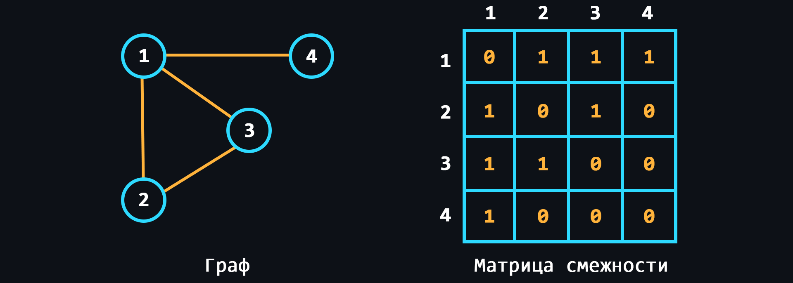</p>

<details>
    <summary>🔗 <b>Ссылки на материалы</b></summary>

1. 📄 [**Структуры данных для самых маленьких** – habr.com](https://habr.com/ru/post/310794/)
1. 📄 [**Обзор наиболее часто используемых структур данных** – habr.com](https://habr.com/ru/post/128457/)
1. 📺 [**Вся правда о массивах** – YouTube](https://youtu.be/47_LhSf-ago)
1. 📺 [**Как работает стек** – YouTube](https://www.youtube.com/watch?v=MXoMuymbfo8)
1. 📺 [**Как работают деревья** – YouTube](https://youtu.be/0BUX_PotA4c)
1. 📺 [**Хэш-таблицы за 10 минут** – YouTube](https://youtu.be/0UX4MIfOMEs)
1. 📺 [**Как работают хэш-таблицы** – YouTube](https://youtu.be/cWbuK7C13HQ) 
1. 📺 [**Как работают графы** – YouTube](https://youtu.be/VehB3eglQMQ) 
</details>

<div align="right"><a href="#top">Содержание ⬆️</a></div>

-   ### Базовые алгоритмы

    [Алгоритмы](https://ru.wikipedia.org/wiki/%D0%90%D0%BB%D0%B3%D0%BE%D1%80%D0%B8%D1%82%D0%BC) подразумевают под собой наборы последовательных инструкций (шагов), которые приводят к решению поставленной задачи. За всю человеческую историю было придумано огромное количество алгоритмов, которые позволяют решать определенные задачи максимально эффективным способом. Соответственно правильный выбор алгоритмов в программировании позволит создавать максимально быстрые и ресурсоемкие решения.
    > Существует очень хорошая книжка по алгоритмам – [Грокаем алгоритмы](https://github.com/mduisenov/GrokkingAlgorithms). С ней можно параллельно начать [изучение языка программирования](#язык-программирования).

    <br>

    -   [Двоичный поиск](https://ru.wikipedia.org/wiki/%D0%94%D0%B2%D0%BE%D0%B8%D1%87%D0%BD%D1%8B%D0%B9_%D0%BF%D0%BE%D0%B8%D1%81%D0%BA)
        > Максимально эффективный алгоритм поиска для отсортированных списков.
    -   [Сортировка выбором](https://ru.wikipedia.org/wiki/%D0%A1%D0%BE%D1%80%D1%82%D0%B8%D1%80%D0%BE%D0%B2%D0%BA%D0%B0_%D0%B2%D1%8B%D0%B1%D0%BE%D1%80%D0%BE%D0%BC)
        > На каждом шаге алгоритма происходит поиск минимального элемента и затем он меняется местами с текущим элементом итерации.
    -   [Рекурсия](https://ru.wikipedia.org/wiki/%D0%A0%D0%B5%D0%BA%D1%83%D1%80%D1%81%D0%B8%D1%8F#%D0%92_%D0%BF%D1%80%D0%BE%D0%B3%D1%80%D0%B0%D0%BC%D0%BC%D0%B8%D1%80%D0%BE%D0%B2%D0%B0%D0%BD%D0%B8%D0%B8)
        > Когда функция может вызывать сама себя и так до бесконечности. С одной стороны решения на основе рекурсии выглядят очень элегантно, а с другой стороны такой подход очень быстро приводит к переполнению стека и его рекомендуют избегать.
    -   [Сортировка пузырьком](https://ru.wikipedia.org/wiki/%D0%A1%D0%BE%D1%80%D1%82%D0%B8%D1%80%D0%BE%D0%B2%D0%BA%D0%B0_%D0%BF%D1%83%D0%B7%D1%8B%D1%80%D1%8C%D0%BA%D0%BE%D0%BC)
        > На каждой итерации последовательно сравниваются соседние элементы, и, если порядок в паре неверный, то элементы меняют местами.
    -   [Быстрая сортировка](https://ru.wikipedia.org/wiki/%D0%91%D1%8B%D1%81%D1%82%D1%80%D0%B0%D1%8F_%D1%81%D0%BE%D1%80%D1%82%D0%B8%D1%80%D0%BE%D0%B2%D0%BA%D0%B0)
        > Усовершенствованный метод пузырьковой сортировки.
    -   [Поиск в ширину](https://ru.wikipedia.org/wiki/%D0%9F%D0%BE%D0%B8%D1%81%D0%BA_%D0%B2_%D1%88%D0%B8%D1%80%D0%B8%D0%BD%D1%83)
        > Позволяет находить все кратчайшие пути от заданной вершины графа.
    -   [Алгоритм Дейкстры](https://ru.wikipedia.org/wiki/%D0%90%D0%BB%D0%B3%D0%BE%D1%80%D0%B8%D1%82%D0%BC_%D0%94%D0%B5%D0%B9%D0%BA%D1%81%D1%82%D1%80%D1%8B)
        > Находит кратчайшие пути между всеми вершинами графа и их длину.
    -   [Жадный алгоритм](https://ru.wikipedia.org/wiki/%D0%96%D0%B0%D0%B4%D0%BD%D1%8B%D0%B9_%D0%B0%D0%BB%D0%B3%D0%BE%D1%80%D0%B8%D1%82%D0%BC)
        > Алгоритм, который на каждом шагу делает локально наилучший выбор в надежде, что итоговое решение будет оптимальным.

    <br>

<details>
    <summary>🔗 <b>Ссылки на материалы</b></summary>

1. 📺 [**Алгоритмы и структуры данных. Подготовительный курс (плейлист)** – YouTube](https://youtube.com/playlist?list=PLrCZzMib1e9pDxHYzmEzMmnMMUK-dz0_7)
2. 📺 [**Алгоритмы и структуры данных на JavaScript** – YouTube](https://youtu.be/NErrGZ64OdE)
3. 📄 [**Алгоритмы и структуры данных (лекции и примеры кода)** – GitHub](https://github.com/HowProgrammingWorks/Index/blob/master/Courses/AlgAndData.md)
4. 📺 [**Как работают сортировки** – YouTube](https://youtu.be/PF7AqefS4MU)
5. 📄 [**Сортировки выбором** – habr.com](https://habr.com/ru/post/422085/)
6. 📺 [**Сортировка выбором** – YouTube](https://youtu.be/KZxP5JqtKKA)
7. 📄 [**Рекурсия. Занимательные задачки** – habr.com](https://habr.com/ru/post/275813/)
8. 📄 [**Пузырьковая сортировка и все-все-все** – habr.com](https://habr.com/ru/post/204600/)
9. 📄 [**Алгоритм Дейкстры** – habr.com](https://habr.com/ru/post/111361/)
10. 📄 [**Жадные алгоритмы** – habr.com](https://habr.com/ru/post/120343/)
11. 📄 [**Визуализация алгоритмов сортировки**](https://www.cs.usfca.edu/~galles/visualization/ComparisonSort.html)
12. 📄 [**Сайт с алгоритмами и структурами данных**](https://ru.algorithmica.org)
13. 📄 [**Крупнейшая библиотека алгоритмов на разных языках**](https://the-algorithms.com/ru)
14. 📄 [**Большая коллекция алгоритмов** – GitHub](https://github.com/trekhleb/javascript-algorithms)
15. 📘 [**Алгоритмы. Руководство по разработке** – Скиена Стивен С., 2011](https://static-ru.insales.ru/files/1/445/10019261/original/935462548.pdf?1566571639)
</details>

<div align="right"><a href="#top">Содержание ⬆️</a></div>

-   ### Оценка сложности алгоритмов

    <p align="center">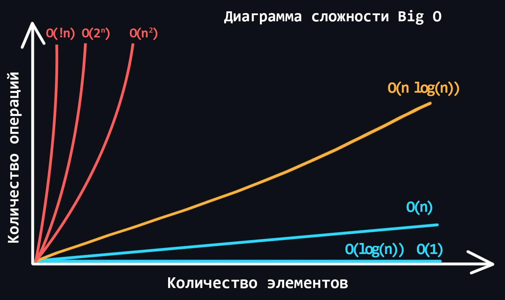</p>

    В мире программирования существует специальная единица измерения [Большое О (Big O, О-нотация)](https://ru.wikipedia.org/wiki/%C2%ABO%C2%BB_%D0%B1%D0%BE%D0%BB%D1%8C%D1%88%D0%BE%D0%B5_%D0%B8_%C2%ABo%C2%BB_%D0%BC%D0%B0%D0%BB%D0%BE%D0%B5). Оно описывает то, как сложность алгоритма растёт с увеличением количества входных данных. Большое О оценивает то, сколько действий (шагов/итераций) необходимо совершить для выполнения алгоритма, при этом всегда показывая худший вариант развития событий. 

    -   Основные разновидности сложности алгоритмов
        > - Константная - O(1) <br>
        > - Линейная - O(n) <br>
        > - Логарифмическая - O(log n) <br>
        > - Линеарифметическая - O(n * log n) <br>
        > - Квадратичная - O(n^2) <br>
        > - Степенная - О(2^n) <br>
        > - Факториальная - O(n!) <br>
    -   [Временная сложность](https://ru.wikipedia.org/wiki/%D0%92%D1%80%D0%B5%D0%BC%D0%B5%D0%BD%D0%BD%D0%B0%D1%8F_%D1%81%D0%BB%D0%BE%D0%B6%D0%BD%D0%BE%D1%81%D1%82%D1%8C_%D0%B0%D0%BB%D0%B3%D0%BE%D1%80%D0%B8%D1%82%D0%BC%D0%B0)
        > Когда вы заранее знаете, на какой машине будет выполняться алгоритм, вы можете измерить время выполнения алгоритма. Опять же, на очень хорошем железе время выполнения алгоритма может быть вполне приемлемым, но тот же алгоритм на более слабой машине может выполняться сотни миллисекунд или даже несколько секунд. Такие задержки будут очень чувствительны, если ваше приложение обрабатывает запросы пользователей по сети.
    -   [Пространственная сложность](https://ru.wikipedia.org/wiki/%D0%92%D1%8B%D1%87%D0%B8%D1%81%D0%BB%D0%B8%D1%82%D0%B5%D0%BB%D1%8C%D0%BD%D0%B0%D1%8F_%D1%81%D0%BB%D0%BE%D0%B6%D0%BD%D0%BE%D1%81%D1%82%D1%8C#%D0%92%D1%80%D0%B5%D0%BC%D0%B5%D0%BD%D0%BD%D0%B0%D1%8F_%D0%B8_%D0%BF%D1%80%D0%BE%D1%81%D1%82%D1%80%D0%B0%D0%BD%D1%81%D1%82%D0%B2%D0%B5%D0%BD%D0%BD%D0%B0%D1%8F_%D1%81%D0%BB%D0%BE%D0%B6%D0%BD%D0%BE%D1%81%D1%82%D0%B8)
        > Помимо времени, необходимо учитывать, сколько памяти тратится на работу алгоритма. Это важно, поскольку вы всегда работаете с ограниченными ресурсами.

<details>
    <summary>🔗 <b>Ссылки на материалы</b></summary>

1. 📄 [**Сложность алгоритмов. Big O. Основы**](https://bimlibik.github.io/posts/complexity-of-algorithms/)
2. 📺 [**Вся сложность алгоритмов за 11 минут** – YouTube](https://youtu.be/cXCuXNwzdfY)
3. 📄 [**Шпаргалка по Big O**](https://www.bigocheatsheet.com/)
4. 📄 [**Шпаргалка по Big O** – Learn X in Y minutes](https://learnxinyminutes.com/docs/ru-ru/asymptotic-notation-ru/)
5. 📄 [**Нотация «О» большое: объяснение на примерах**](https://techrocks.ru/2021/04/02/big-o-notation-examples/) 
</details>

<div align="right"><a href="#top">Содержание ⬆️</a></div>

-   ### Форматы хранения данных

    Для хранения и передачи данных по сети используются различные форматы файлов. Текстовые файлы представляют удобочитаемый формат для человека и обычно применяются, например, для файлов конфигурации. Однако, передача данных в текстовом формате по сети не всегда является оптимальным выбором, так как такие файлы занимают больше места по сравнению с соответствующими файлами в двоичном формате.

    -   Текстовые форматы
        -   [JSON (JavaScript Object Notation)](https://ru.wikipedia.org/wiki/JSON)
            > Представляет из себя объект, в котом данные хранятся в виде пар ключ-значение.
        -   [YAML (Yet Another Markup Language)](https://ru.wikipedia.org/wiki/YAML)
            > Формат близкий к языкам разметки по типу HTML. Минималистичный, поскольку не имеет открывающих и закрывающих тегов. Удобный для редактирования.
        -   [XML (eXtensible Markup Language)](https://ru.wikipedia.org/wiki/XML)
            > Формат более близкий к HTML. Здесь данные оборачиваются в открывающие и закрывающие теги.
        -   [TOML (Tom's Obvious Minimal Language)](https://ru.wikipedia.org/wiki/TOML)
            > Простой формат для создания конфигурационных файлов.

    -   Двоичные форматы
        -   [Message Pack](https://msgpack.org/)
            > Бинарный аналог JSON. Позволяет упаковывать данные на 15-20% эффективнее.
        -   [BSON (Binary JavaScript Object Notation)](https://ru.wikipedia.org/wiki/BSON)
            > Является надмножеством JSON, включая дополнительно регулярные выражения, двоичные данные и даты. 
        -   [ProtoBuf (Protocol Buffers)](https://ru.wikipedia.org/wiki/Protocol_Buffers)
            > Бинарная альтернатива текстовому формату XML. Проще, компактнее и быстрее. 
    
    -   Форматы изображений
        -   [JPEG (Joint Photographic Experts Group)](https://ru.wikipedia.org/wiki/JPEG)
            > Подходит для фотографий и сложных изображений с широкой палитрой цветов. Формат обеспечивает высокие коэффициенты сжатия, при этом сохраняя хорошее качество изображения. Однако, повторное редактирование и сохранение JPEG-изображений может привести к деградации качества.
        -   [PNG (Portable Network Graphics)](https://ru.wikipedia.org/wiki/PNG)
            > Используется для изображений с четкими краями, логотипов, иконок и изображений, требующих прозрачности. Размер файлов в формате PNG может быть больше по сравнению с JPEG, но они сохраняют отличное качество без деградации при повторном сохранении.
        -   [GIF (Graphics Interchange Format)](https://ru.wikipedia.org/wiki/GIF)
            > Используется для простых анимаций, изображений с низким разрешением и ограниченной палитрой цветов. Формат поддерживает прозрачность и может воспроизводить анимации путем отображения последовательности кадров.
        -   [SVG (Scalable Vector Graphics)](https://ru.wikipedia.org/wiki/SVG)
            > Формат векторных изображений на основе XML, определенных с помощью математических уравнений, а не пикселей. Изображения SVG могут масштабироваться до любого размера без потери качества и хорошо подходят для логотипов, иконок и графических элементов.
        -   [WebP](https://ru.wikipedia.org/wiki/WebP)
            > Современный формат изображений, разработанный компанией Google. Он поддерживает сжатие с потерями и без, обеспечивая хорошее качество изображения при более низком размере файла по сравнению с форматами JPEG и PNG. Изображения WebP оптимизированы для использования на веб-сайтах и могут включать прозрачность и анимацию.

    -   Видеоформаты
        -   [MP4 (MPEG-4 Part 14)](https://ru.wikipedia.org/wiki/MPEG-4_Part_14)
            > Широко используемый формат, который поддерживает высокий уровень сжатия, что делает его подходящим для потоковой передачи и хранения видео. Файлы MP4 могут содержать как видео, так и аудио.
        -   [AVI (Audio Video Interleave)](https://ru.wikipedia.org/wiki/Audio_Video_Interleave)
            > Мультимедийный контейнерный формат, разработанный компанией Microsoft. Он может хранить аудио- и видеоданные в одном файле. Однако такие файлы обычно имеют больший размер по сравнению с более современными форматами.
        -   [MOV (QuickTime Movie)](https://www.adobe.com/creativecloud/video/hub/guides/what-is-an-mov-video.html)
            > Формат разработанный компанией Apple для использования с их медиаплеером QuickTime. Он широко используется с устройствами Mac и iOS. Файлы MOV могут содержать как видео, так и аудио, и они обеспечивают хорошее сжатие и качество.
        -   [WEBM](https://ru.wikipedia.org/wiki/WebM)
            > Лучший форамт для встраивания видео на вашем личном или деловом веб-сайте. Оптимизирован и создан специально для веб-страниц.
        
    -   Аудиоформаты
        -   [MP3 (MPEG-1 Audio Layer 3)](https://ru.wikipedia.org/wiki/MP3)
            > Самый популярный аудиоформат, известный высоким уровнем сжатия и небольшими размерами файлов. Это достигается путем удаления некоторых аудиоданных, которые могут быть менее заметны для человеческого слуха.
        -   [WAV (Waveform Audio File Format)](https://ru.wikipedia.org/wiki/WAV)
            > Хранит аудиоданные без потерь, обеспечивая высокое качество звукового воспроизведения. Файлы WAV широко используются в профессиональном аудио-производстве и редактировании благодаря своей точности. Однако, они имеют больший размер.
        -   [AAC (Advanced Audio Coding)](https://ru.wikipedia.org/wiki/Advanced_Audio_Coding)
            > Aудиоформат, известный своим эффективным сжатием и хорошим качеством звука. Он предлагает лучшее воспроизведение звука при более низких битрейтах по сравнению с форматом MP3. 
        
<details>
    <summary>🔗 <b>Ссылки на материалы</b></summary>

1. 📄 [**Форматы сериализации данных** – habr.com](https://habr.com/ru/company/infowatch/blog/312320/)
2. 📄 [**Введение в JSON** – medium.org](https://medium.com/@stasonmars/%D0%B2%D0%B2%D0%B5%D0%B4%D0%B5%D0%BD%D0%B8%D0%B5-%D0%B2-json-c798d2723107)
3. 📄 [**Работа с JSON** – (MDN) mozilla.org](https://developer.mozilla.org/ru/docs/Learn/JavaScript/Objects/JSON)
4. 📄 [**Шпаргалка по JSON** – Learn X in Y Minutes](https://learnxinyminutes.com/docs/ru-ru/json-ru/)
5. 📄 [**Шпаргалка по YAML** – Learn X in Y Minutes](https://learnxinyminutes.com/docs/ru-ru/yaml-ru/)
6. 📄 [**Шпаргалка по XML** – Learn X in Y Minutes](https://learnxinyminutes.com/docs/ru-ru/xml-ru/)
7. 📄 [**Краткое руководство по XML**](https://xml.readthedocs.io/xml-intro.html)
8. 📄 [**YAML за 5 минут: синтаксис и основные возможности** – tproger.ru](https://tproger.ru/translations/yaml-za-5-minut-sintaksis-i-osnovnye-vozmozhnosti/)
9. 📄 [**Universal Binary JSON — ещё один бинарный JSON** – habr.com](https://habr.com/ru/post/130112/)
</details>

<div align="right"><a href="#top">Содержание ⬆️</a></div>

-   ### Кодировки текста

    Компьютеры работают только с числами, а если точнее только с 0 и 1. Как преобразовывать числа из разных систем счисления в двоичную, уже понятно. Но с текстом производить такие преобразования не получится. Именно поэтому были придуманы специальные таблицы, называемые [кодировками](https://ru.wikipedia.org/wiki/%D0%9D%D0%B0%D0%B1%D0%BE%D1%80_%D1%81%D0%B8%D0%BC%D0%B2%D0%BE%D0%BB%D0%BE%D0%B2), в которых текстовым символам присваиваются числовые эквиваленты.

    -   [ASCII (American standard code for information interchange)](https://ru.wikipedia.org/wiki/ASCII)
        > Самая простая кодировка, созданная специально для американского алфавита. Состоит из 128 символов.
    -   [Unicode](https://ru.wikipedia.org/wiki/%D0%AE%D0%BD%D0%B8%D0%BA%D0%BE%D0%B4)
        > Это международная таблица символов, которая помимо английского алфавита, содержит алфавиты почти всех стран. Способна вместить в себя более миллиона различных символов (на данный момент таблица заполнена не полностью).
    -   [UTF-8 (Unicode Transformation Format)](https://ru.wikipedia.org/wiki/UTF-8)
        > Unicode-кодировка переменной длинны, с помощью которой можно представить любой символ unicode.
    -   [UTF-16](https://ru.wikipedia.org/wiki/UTF-16)
        > Главное ее отличие от UTF-8 состоит в том что структурной единицей в ней является не один а два байта.

<details>
    <summary>🔗 <b>Ссылки на материалы</b></summary>

1. 📄 [**Что такое кодировки**](https://guides.hexlet.io/ru/encoding/)
2. 📄 [**Как работают кодировки текста. Откуда появляются «кракозябры»** – habr.com](https://habr.com/ru/post/478636)
3. 📄 [**Что нужно знать каждому разработчику о кодировках и наборах символов для работы с текстом** – habr.com](https://habr.com/ru/post/158639/)
4. 📄 [**Символы Unicode: о чём должен знать каждый разработчик** – habr.com](https://habr.com/ru/company/vk/blog/547084/)
</details>

<div align="right"><a href="#top">Содержание ⬆️</a></div>

## Язык программирования

На этом этапе Вам предстоит выбрать для изучения один из языков программирования. В открытом доступе полно информации по различным языкам, (книги, курсы, тематические сайты и т.д.) поэтому у Вас не должно возникнуть проблем.

> Ниже приведен список конкретных языков, которые [лично по моему мнению](https://github.com/cheatsnake) хорошо подходят для backend-разработки (⚠️ может не совпадать с мнением других людей, в том числе более компетентных в этом вопросе). 

-   [Python](https://ru.wikipedia.org/wiki/Python)
    > Очень популярный язык с широким спектром применений. Лёгкий в изучении, благодаря простому синтаксису.
-   [JavaScript](https://ru.wikipedia.org/wiki/JavaScript)
    > Не менее популярный и практический единственный язык для полноценной Web-разработки. Благодаря платформе [Node.js](https://nodejs.org) последнее несколько лет набирает популярность и в области backend-разработки.
-   [Go](https://ru.wikipedia.org/wiki/Go)
    > Язык созданный внутри компании Google. Создавался специально для высоконагруженной серверной разработки. Минималистичный синтаксис, высокая производительность и богатая стандартная библиотека. 
-   [Kotlin](https://ru.wikipedia.org/wiki/Kotlin)
    > Этакая современная версия [Java](https://ru.wikipedia.org/wiki/Java). Более простой и лаконичный синтаксис, лучшая типобезопасность, наличие встроенных инструментов для многопоточности. Один из лучших выборов для разработки под Android.
    
Найти хорошую книгу или онлайн-учебник на русском можно в [этом репозитории](https://github.com/EbookFoundation/free-programming-books/blob/main/books/free-programming-books-ru.md). Там собрана большая коллекция под разные ЯП и фреймворки. 

Поищите специальный [awesome-репозиторий](https://github.com/sindresorhus/awesome#programming-languages) – ресурс в котором собрано огромное количество полезных ссылок на материалы под Ваш ЯП (библиотеки, шпаргалки, блоги и другие различные ресурсы). 

<div align="right"><a href="#top">Содержание ⬆️</a></div>

-   ### Классификация языков программирования

    Языков программирования много. Все они созданы не просто так. Некоторые языки могут быть совсем специфическими и использоваться только для определенных целей. Также, разные языки могут использовать разные подходы к написанию программ. А могут вообще по разному исполняться на компьютере. В общем существует множество различных [классификаций](https://ru.wikipedia.org/wiki/%D0%AF%D0%B7%D1%8B%D0%BA_%D0%BF%D1%80%D0%BE%D0%B3%D1%80%D0%B0%D0%BC%D0%BC%D0%B8%D1%80%D0%BE%D0%B2%D0%B0%D0%BD%D0%B8%D1%8F#%D0%9A%D0%BB%D0%B0%D1%81%D1%81%D0%B8%D1%84%D0%B8%D0%BA%D0%B0%D1%86%D0%B8%D1%8F), в которых было бы полезно разобраться.

    -   В зависимости от [уровня языка](https://ru.wikipedia.org/wiki/%D0%AF%D0%B7%D1%8B%D0%BA_%D0%BF%D1%80%D0%BE%D0%B3%D1%80%D0%B0%D0%BC%D0%BC%D0%B8%D1%80%D0%BE%D0%B2%D0%B0%D0%BD%D0%B8%D1%8F#%D0%AF%D0%B7%D1%8B%D0%BA%D0%B8_%D0%BD%D0%B8%D0%B7%D0%BA%D0%BE%D0%B3%D0%BE_%D0%B8_%D0%B2%D1%8B%D1%81%D0%BE%D0%BA%D0%BE%D0%B3%D0%BE_%D1%83%D1%80%D0%BE%D0%B2%D0%BD%D1%8F)
        - Языки низкого уровня 
            > Близкие к [машинному коду](https://ru.wikipedia.org/wiki/%D0%9C%D0%B0%D1%88%D0%B8%D0%BD%D0%BD%D1%8B%D0%B9_%D0%BA%D0%BE%D0%B4), сложные в написании, но максимально производительные. Как правило предоставляют доступ ко всем ресурсам компьютера.
        - Языки высокого уровня
            > Имеют достаточно большой уровень абстракции, за счет чего достигается простота и удобство написания. Как правило безопаснее, поскольку не предоставляют доступ ко всем ресурсам компьютера. 
    -   В зависимости от [способа выполнения кода](https://ru.wikipedia.org/wiki/%D0%AF%D0%B7%D1%8B%D0%BA_%D0%BF%D1%80%D0%BE%D0%B3%D1%80%D0%B0%D0%BC%D0%BC%D0%B8%D1%80%D0%BE%D0%B2%D0%B0%D0%BD%D0%B8%D1%8F#%D0%9A%D0%BE%D0%BC%D0%BF%D0%B8%D0%BB%D0%B8%D1%80%D1%83%D0%B5%D0%BC%D1%8B%D0%B5,_%D0%B8%D0%BD%D1%82%D0%B5%D1%80%D0%BF%D1%80%D0%B5%D1%82%D0%B8%D1%80%D1%83%D0%B5%D0%BC%D1%8B%D0%B5_%D0%B8_%D0%B2%D1%81%D1%82%D1%80%D0%B0%D0%B8%D0%B2%D0%B0%D0%B5%D0%BC%D1%8B%D0%B5_%D1%8F%D0%B7%D1%8B%D0%BA%D0%B8)
        - [Компиляция](https://ru.wikipedia.org/wiki/%D0%9A%D0%BE%D0%BC%D0%BF%D0%B8%D0%BB%D0%B8%D1%80%D1%83%D0%B5%D0%BC%D1%8B%D0%B9_%D1%8F%D0%B7%D1%8B%D0%BA_%D0%BF%D1%80%D0%BE%D0%B3%D1%80%D0%B0%D0%BC%D0%BC%D0%B8%D1%80%D0%BE%D0%B2%D0%B0%D0%BD%D0%B8%D1%8F) 
            > Позволяет преобразовать исходный код программы в исполняемый файл.
        - [Интерпретация](https://ru.wikipedia.org/wiki/%D0%98%D0%BD%D1%82%D0%B5%D1%80%D0%BF%D1%80%D0%B5%D1%82%D0%B8%D1%80%D1%83%D0%B5%D0%BC%D1%8B%D0%B9_%D1%8F%D0%B7%D1%8B%D0%BA_%D0%BF%D1%80%D0%BE%D0%B3%D1%80%D0%B0%D0%BC%D0%BC%D0%B8%D1%80%D0%BE%D0%B2%D0%B0%D0%BD%D0%B8%D1%8F) 
            > Исходный код программы транслируется и сразу выполняется (интерпретируется) с помощью специальной программы-интерпретатора.
        - [Виртуальная машина](https://ru.wikipedia.org/wiki/%D0%92%D0%B8%D1%80%D1%82%D1%83%D0%B0%D0%BB%D1%8C%D0%BD%D0%B0%D1%8F_%D0%BC%D0%B0%D1%88%D0%B8%D0%BD%D0%B0)
            > При таком подходе программа компилируется не в машинный язык, а в машинно-независимый код низкого уровня, [байт-код](https://ru.wikipedia.org/wiki/%D0%91%D0%B0%D0%B9%D1%82-%D0%BA%D0%BE%D0%B4). Далее этот байт-код выполняется уже самой виртуальной машиной.
    -   [В зависимости от парадигмы программирования](https://ru.wikipedia.org/wiki/%D0%AF%D0%B7%D1%8B%D0%BA_%D0%BF%D1%80%D0%BE%D0%B3%D1%80%D0%B0%D0%BC%D0%BC%D0%B8%D1%80%D0%BE%D0%B2%D0%B0%D0%BD%D0%B8%D1%8F#%D0%9F%D0%B0%D1%80%D0%B0%D0%B4%D0%B8%D0%B3%D0%BC%D0%B0_%D0%BF%D1%80%D0%BE%D0%B3%D1%80%D0%B0%D0%BC%D0%BC%D0%B8%D1%80%D0%BE%D0%B2%D0%B0%D0%BD%D0%B8%D1%8F)
        -   [Императивная парадигма](https://ru.wikipedia.org/wiki/%D0%98%D0%BC%D0%BF%D0%B5%D1%80%D0%B0%D1%82%D0%B8%D0%B2%D0%BD%D0%BE%D0%B5_%D0%BF%D1%80%D0%BE%D0%B3%D1%80%D0%B0%D0%BC%D0%BC%D0%B8%D1%80%D0%BE%D0%B2%D0%B0%D0%BD%D0%B8%D0%B5)
            > Базируется на описании конкретных шагов для решения проблемы с помощью последовательности утверждений или команд.
        -   [Декларативная парадигма](https://ru.wikipedia.org/wiki/%D0%94%D0%B5%D0%BA%D0%BB%D0%B0%D1%80%D0%B0%D1%82%D0%B8%D0%B2%D0%BD%D0%BE%D0%B5_%D0%BF%D1%80%D0%BE%D0%B3%D1%80%D0%B0%D0%BC%D0%BC%D0%B8%D1%80%D0%BE%D0%B2%D0%B0%D0%BD%D0%B8%D0%B5)
            > Базируется на описании того, что должна делать программа, а не на том, как она должна это делать. Примерами декларативных языков являются SQL и HTML.
        -   [Функциональная парадигма](https://ru.wikipedia.org/wiki/%D0%A4%D1%83%D0%BD%D0%BA%D1%86%D0%B8%D0%BE%D0%BD%D0%B0%D0%BB%D1%8C%D0%BD%D0%BE%D0%B5_%D0%BF%D1%80%D0%BE%D0%B3%D1%80%D0%B0%D0%BC%D0%BC%D0%B8%D1%80%D0%BE%D0%B2%D0%B0%D0%BD%D0%B8%D0%B5)
            > Основана на идее рассматривать вычисления в виде математических функций. Она подразумевает [иммутабельность данных](https://ru.wikipedia.org/wiki/%D0%9D%D0%B5%D0%B8%D0%B7%D0%BC%D0%B5%D0%BD%D1%8F%D0%B5%D0%BC%D1%8B%D0%B9_%D0%BE%D0%B1%D1%8A%D0%B5%D0%BA%D1%82), избежание [побочных эффектов](https://ru.wikipedia.org/wiki/%D0%9F%D0%BE%D0%B1%D0%BE%D1%87%D0%BD%D1%8B%D0%B9_%D1%8D%D1%84%D1%84%D0%B5%D0%BA%D1%82_(%D0%BF%D1%80%D0%BE%D0%B3%D1%80%D0%B0%D0%BC%D0%BC%D0%B8%D1%80%D0%BE%D0%B2%D0%B0%D0%BD%D0%B8%D0%B5)) и использование [функций высшего порядка](https://ru.wikipedia.org/wiki/%D0%A4%D1%83%D0%BD%D0%BA%D1%86%D0%B8%D1%8F_%D0%B2%D1%8B%D1%81%D1%88%D0%B5%D0%B3%D0%BE_%D0%BF%D0%BE%D1%80%D1%8F%D0%B4%D0%BA%D0%B0). Примерами функциональных языков являются Haskell, Lisp и Clojure.
        -   [Объектно-ориентированная парадигма](https://ru.wikipedia.org/wiki/%D0%9E%D0%B1%D1%8A%D0%B5%D0%BA%D1%82%D0%BD%D0%BE-%D0%BE%D1%80%D0%B8%D0%B5%D0%BD%D1%82%D0%B8%D1%80%D0%BE%D0%B2%D0%B0%D0%BD%D0%BD%D0%BE%D0%B5_%D0%BF%D1%80%D0%BE%D0%B3%D1%80%D0%B0%D0%BC%D0%BC%D0%B8%D1%80%D0%BE%D0%B2%D0%B0%D0%BD%D0%B8%D0%B5)
            > Базируется вокруг создания объектов, которые содержат как данные, так и поведение, с целью моделирования вещей реального мира. Примерами объектно-ориентированных языков являются Java, Python и C++.
        -   [Параллельные вычисления](https://ru.wikipedia.org/wiki/%D0%9F%D0%B0%D1%80%D0%B0%D0%BB%D0%BB%D0%B5%D0%BB%D1%8C%D0%BD%D1%8B%D0%B5_%D0%B2%D1%8B%D1%87%D0%B8%D1%81%D0%BB%D0%B5%D0%BD%D0%B8%D1%8F)
            > Ориентированы на одновременную обработку нескольких задач или потоков. Используются в системах, требующих высокой производительности и быстроты реакции. Примерами параллельных языков являются Go и Erlang.

<details>
    <summary>🔗 <b>Ссылки на материалы</b></summary>

1. 📺 [**Языки программирования: что нужно знать** – YouTube](https://youtu.be/PS4S8BnURYU)
2. 📺 [**Языки программирования: критерии выбора** – YouTube](https://youtu.be/T70qJndjYi0)
3. 📺 [**Компиляция и интерпретация за 10 минут** – YouTube](https://youtu.be/kIsDOw5safA)
4. 📺 [**Почему языков программирования так много?** – YouTube](https://youtu.be/2YMrV-e5rZQ)
5. 📄 [**Что такое компилятор**](https://guides.hexlet.io/ru/compiler/)
6. 📄 [**Что такое интерпретатор**](https://guides.hexlet.io/ru/interpreter/)
7. 📄 [**Методы программирования** – GitHub](https://github.com/kolei/OAP/blob/master/articles/t2l2.md)
8. 📄 [**Парадигмы программирования**](https://doka.guide/js/programming-paradigms/)
9. 📄 [**Парадигмы программирования (лекции и примеры кода на Node.js)** – GitHub](https://github.com/HowProgrammingWorks/Index/blob/master/Courses/Paradigms.md)
</details>

<div align="right"><a href="#top">Содержание ⬆️</a></div>

-   ### Основы языка

    Под основами подразумеваются некоторые фундаментальные идеи, присутствующие в каждом ЯП.

    -   Переменные и константы
        > Имена, присваиваемые участку памяти в программе для хранения некоторых данных.
    -   Типы данных
        > Определяют какого рода значения могут храниться в переменной. Основными типами данных являются целые числа, числа с плавающей запятой, символы, строки и логические типы (boolean).
    -   Операторы
        > Используются для выполнения операций над переменными. К общим операторам относятся арифметические операторы, операторы сравнения, логические операторы и операторы присваивания.
    -   Управление потоком
        > Циклы, условия `if else` и `switch case`.
    -   Функции
        > Это блоки кода, которые могут многократно переиспользоваться в программе. Функции являются важной концепцией для понимания области видимости переменных.
    -   Структуры данных 
        > Специальные контейнеры, в которых данные хранятся по определенным правилам. Основные структуры данных: массивы, карты (словари), деревья, графы.
    -   Стандартная библиотека
        > Встроенные в язык возможности для манипуляции над структурами данных, работы с файловой системой, сетью, криптографией и т.д.
    -   Обработка ошибок
        > Важный концепт для обработки непредвиденных событий, которые могут произойти во время выполнения программы. 
    -   [Регулярные выражения](https://github.com/cheatsnake/regex-by-example/blob/master/README_RUS.md)
        > Мощный инструмент для работы со строками. Обязательно ознакомьтесь с этим в своем ЯП, хотя бы на базовом уровне.
    -   Модули
        > Писать код всей программы в одном файле совсем не удобно. Гораздо читабельнее будет если разбить его на небольшие модули и импортировать их в нужные места.
    -   Пакетный менеджер
        > Рано или поздно, возникнет желание воспользоваться сторонними библиотеками.

    После освоения минимальной базы для написания простейших программ нет особого смысла продолжать изучение без наличия конкретных целей (без практики все забудется). Вам необходимо придумать/найти что-то, что вы хотели бы создать самостоятельно (игра, чат-бот, сайт, мобильное/десктопное приложение, что угодно). Для вдохновения посмотрите эти репозитории: [Build your own x](https://github.com/codecrafters-io/build-your-own-x) и [Project based learning](https://github.com/practical-tutorials/project-based-learning). 

    На этом моменте начинается самая продуктивная часть обучения: Вы просто ищите всевозможную информацию для реализации вашего проекта. Вашими лучшими друзьями становиться Google, YouTube и Stack Overflow.

<details>
    <summary>🔗 <b>Ссылки на материалы</b></summary>

1. 📄 [**Metanit** – русскоязычный учебный ресурс по основам разных ЯП](https://metanit.com/)
2. 📄 [**Руководство по языку Python на русском** – pydocs.ru](https://pydocs.ru/osnovy-yazyka-python/)
3. 📄 [**Шпаргалка по основам Python** – Learn X in Y minutes](https://learnxinyminutes.com/docs/ru-ru/python-ru/)
4. 📄 [**Шпаргалка по основам Python** – quickref.me](https://quickref.me/python)
5. 📄 [**Современный учебник JavaScript на русском** – learn.javascript.ru](https://learn.javascript.ru/)
6. 📄 [**Шпаргалка по основам JavaScript** – Learn X in Y minutes](https://learnxinyminutes.com/docs/ru-ru/javascript-ru/)
7. 📄 [**Шпаргалка по основам JavaScript** – quickref.me](https://quickref.me/javascript)
8. 📄 [**Руководство по Go на русском** – golangify.com](https://golangify.com/)
9. 📄 [**Шпаргалка по основам Go** – Learn X in Y minutes](https://learnxinyminutes.com/docs/ru-ru/go-ru/)
10. 📄 [**Шпаргалка по основам Go** – quickref.me](https://quickref.me/golang)
11. 📄 [**Изучение Go на примерах**](https://golangbyexample.com/)
12. 📄 [**Руководство по языку Kotlin на русском** – kotlinlang.ru](https://kotlinlang.ru/)
13. 📄 [**Шпаргалка по основам Kotlin** – Learn X in Y minutes](https://learnxinyminutes.com/docs/ru-ru/kotlin-ru/)
14. 📄 [**Шпаргалка по основам Kotlin** – devhints.io](https://devhints.io/kotlin)
15. 📄 [**Интерактивный курс по регулярным выражениям**](https://regexlearn.com/ru)
16. 📄 [**Список книг для программиста (70+ на разные темы)**](https://botanim.to.digital/#popup:books)
</details>

<div align="right"><a href="#top">Содержание ⬆️</a></div>

-   ### Объектно ориентированное программирование

    [ООП](https://ru.wikipedia.org/wiki/%D0%9E%D0%B1%D1%8A%D0%B5%D0%BA%D1%82%D0%BD%D0%BE-%D0%BE%D1%80%D0%B8%D0%B5%D0%BD%D1%82%D0%B8%D1%80%D0%BE%D0%B2%D0%B0%D0%BD%D0%BD%D0%BE%D0%B5_%D0%BF%D1%80%D0%BE%D0%B3%D1%80%D0%B0%D0%BC%D0%BC%D0%B8%D1%80%D0%BE%D0%B2%D0%B0%D0%BD%D0%B8%D0%B5) – это один из наиболее удачных и удобных подходов для моделирования предметов реального мира. Этот подход сочетает в себе несколько очень важных принципов, которые позволяют писать модульный, расширяемый и слабо-связанный код.

    -   Понятие [класса](https://ru.wikipedia.org/wiki/%D0%9A%D0%BB%D0%B0%D1%81%D1%81_(%D0%BF%D1%80%D0%BE%D0%B3%D1%80%D0%B0%D0%BC%D0%BC%D0%B8%D1%80%D0%BE%D0%B2%D0%B0%D0%BD%D0%B8%D0%B5))
        > Класс можно понимать как кастомный тип данных (своего рода шаблон), в котором Вы описываете структуру будущих объектов, которые будут реализовывать данный класс. Классы могут содержать `свойства` (это конкретные поля, в которых могут храниться данные определенного типа данных) и `методы` (это функции, которые имеют доступ к свойствам и возможность ими манипулировать, изменять).
    -   Понятие [объекта](https://ru.wikipedia.org/wiki/%D0%9E%D0%B1%D1%8A%D0%B5%D0%BA%D1%82_(%D0%BF%D1%80%D0%BE%D0%B3%D1%80%D0%B0%D0%BC%D0%BC%D0%B8%D1%80%D0%BE%D0%B2%D0%B0%D0%BD%D0%B8%D0%B5))
        > Объект – это конкретная реализация класса. Если в классе, например, описано свойство _name_ с типом _string_, то объект будет иметь конкретное значение для этого поля, например _"Alex"_.
    -   [Принцип наследования](https://ru.wikipedia.org/wiki/%D0%9D%D0%B0%D1%81%D0%BB%D0%B5%D0%B4%D0%BE%D0%B2%D0%B0%D0%BD%D0%B8%D0%B5_(%D0%BF%D1%80%D0%BE%D0%B3%D1%80%D0%B0%D0%BC%D0%BC%D0%B8%D1%80%D0%BE%D0%B2%D0%B0%D0%BD%D0%B8%D0%B5))
        > Возможность создавать новые классы, которые наследуют свойства и методы своих родителей. Это позволяет повторно использовать код и создавать иерархию классов.
    -   [Принцип инкапсуляции](https://ru.wikipedia.org/wiki/%D0%98%D0%BD%D0%BA%D0%B0%D0%BF%D1%81%D1%83%D0%BB%D1%8F%D1%86%D0%B8%D1%8F_(%D0%BF%D1%80%D0%BE%D0%B3%D1%80%D0%B0%D0%BC%D0%BC%D0%B8%D1%80%D0%BE%D0%B2%D0%B0%D0%BD%D0%B8%D0%B5))
        > Возможность скрывать определенные свойства/методы от доступа из вне, оставляя только упрощенный интерфейс для взаимодействия с объектом. 
    -   [Принцип полиморфизма](https://ru.wikipedia.org/wiki/%D0%9F%D0%BE%D0%BB%D0%B8%D0%BC%D0%BE%D1%80%D1%84%D0%B8%D0%B7%D0%BC_(%D0%B8%D0%BD%D1%84%D0%BE%D1%80%D0%BC%D0%B0%D1%82%D0%B8%D0%BA%D0%B0))
        > Возможность реализовывать один и тот же метод по разному в классах наследниках.
    -   [Композиция](https://github.com/f3ath/translations/blob/master/composition-vs-inheritance.md) вместо наследования
        > Часто принцип `наследования` может усложнить и запутать Вашу программу, если хорошенько не поразмыслить над тем, как выстраивать будущую иерархию. Поэтому существует альтернативный (более гибкий) подход, который называют композицией. В частности, в языке Go отсутствуют классы и многие ООП принципы, но широко [используется композиция](https://golangbyexample.com/oop-inheritance-golang-complete).
    -   [Dependency injection (внедрение зависимости)](https://ru.wikipedia.org/wiki/%D0%92%D0%BD%D0%B5%D0%B4%D1%80%D0%B5%D0%BD%D0%B8%D0%B5_%D0%B7%D0%B0%D0%B2%D0%B8%D1%81%D0%B8%D0%BC%D0%BE%D1%81%D1%82%D0%B8)
        > Популярный ООП паттерн, позволяющий объектам получать свои зависимости (другие объекты) извне, а не создавать их внутри. Это делает код более модульным, удобным для сопровождения и тестирования.

<details>
    <summary>🔗 <b>Ссылки на материалы</b></summary>

1. 📺 [**ООП на простых примерах** – YouTube](https://youtu.be/-6DWwR_R4Xk)
2. 📄 [**Объектно-ориентированное программирование на примере**](https://doka.guide/js/oop/)
3. 📄 [**Лекции и примеры кода по ООП**](https://github.com/HowProgrammingWorks/Index/blob/master/Courses/OOP.md)
4. 📺 [**Первые шаги в ООП: класс, объект, self в Python** – YouTube](https://youtu.be/odY5dlZifFE)
5. 📺 [**Просто о ООП на примерах для TypeScript/JavaScript** – YouTube](https://youtu.be/VjGdjqyXbhg)
6. 📺 [**ООП на примерах для Kotlin** – YouTube](https://youtu.be/3e8ZEO9ADrc)
7. 📄 [**Краткое введение во внедрение зависимостей: что это и когда это необходимо использовать** – medium.com](https://xufocoder.medium.com/a-quick-intro-to-dependency-injection-what-it-is-and-when-to-use-it-de1367295ba8)
</details>

<div align="right"><a href="#top">Содержание ⬆️</a></div>

-   ### Разработка серверов

    -   Понимание сокетов
        > Сокет – это специальный интерфейс обеспечивающий возможность обмена данными между разными процессами. Вам необходимо знать, как создавать, подключаться, отправлять и получать данные через сокеты.
    -   Создание и запуск локальных TCP, UDP и HTTP серверов
        > Эти протоколы являются самыми важными, необходимо понимать тонкости работы с каждым из них.
    -   Раздача статических файлов
        > Необходимо уметь поднимать HTML-страницы, хостить картинки, PDF-документы, аудио/видео файлы и т.д.
    -   Маршрутизация
        > Создание эндпоинтов (URL-адресов) при обращении к которым на сервере будет вызывается соответствующий обработчик.
    -   Обработка запросов
        > Как правило в HTTP-обработчиках имеется специальный объект в который приходит вся информация о запросе пользователя (заголовки, метод, тело-запроса, полный url с параметрами и т.д.)
    -   Обработка ответов
        > Отправка соответствующего сообщения на поступивший запрос (HTTP-статус и код, тело-ответа, заголовки и т.д.)
    -   Обработка ошибок
        > Всегда нужно быть готовым к тому, что что-то пойдет не так: пользователь отправит некорректные данные, база данных не выполнит операцию или просто в приложении произойдёт непредвиденная ошибка. Необходимо, чтобы сервер не падал, а отсылал ответ с информацией об ошибке.
    -   [Middleware (промежуточное ПО)](https://aws.amazon.com/ru/what-is/middleware/)
        > Промежуточный компонент между приложением и сервером. Он может использоваться для аутентификации пользователей, валидации параметров, кэширования данных, логирования запросов и так далее.
    -   Отправка запросов
        > Часто внутри одного приложения вам придется обращаться по сети к другому. Поэтому важно уметь отправлять HTTP-запросы используя встроенные возможности ЯП.
    -   [Шаблонизатор](https://ru.wikipedia.org/wiki/%D0%A8%D0%B0%D0%B1%D0%BB%D0%BE%D0%BD%D0%B8%D0%B7%D0%B0%D1%82%D0%BE%D1%80)
        > Представляет собой специальный модуль, использующий более удобный синтаксис для формирования HTML на основе динамических данных.

<details>
    <summary>🔗 <b>Ссылки на материалы</b></summary>

1. 📄 [**Руководство по веб-фреймворку Django (Python)** – metanit.com](https://metanit.com/python/django/)
2. 📺 [**Node JS фундаментальный курс от А до Я** – YouTube](https://youtu.be/243pQXC5Ebs)
3. 📄 [**Руководство по Node.js (JavaScript)** – metanit.com](https://metanit.com/web/nodejs/)
4. 📄 [**Документация Node.js на русском**](https://nodejsdev.ru)
5. 📄 [**Руководство по веб-фреймворку Express (JavaScript)**](https://nodejsdev.ru/expressjs4/)
6. 📄 [**Создание веб-приложения на Go** – golangify.com](https://golangify.com/go/web-app-go)
7. 📄 [**Разработка веб-серверов на Golang — от простого к сложному** – habr.com](https://habr.com/ru/company/skillbox/blog/446454/)
8. 📄 [**Разработка серверных приложений на Kotlin** – kotlinlang.ru](https://kotlinlang.ru/docs/server-overview.html)
</details>

<div align="right"><a href="#top">Содержание ⬆️</a></div>

-   ### Асинхронное программирование

    [Асинхронное программирование](https://ru.wikipedia.org/wiki/%D0%90%D1%81%D0%B8%D0%BD%D1%85%D1%80%D0%BE%D0%BD%D0%BD%D0%BE%D0%B5_%D0%BF%D1%80%D0%BE%D0%B3%D1%80%D0%B0%D0%BC%D0%BC%D0%B8%D1%80%D0%BE%D0%B2%D0%B0%D0%BD%D0%B8%D0%B5) позволяет писать эффективные программы с большим количеством [операций ввода/вывода](https://ru.wikipedia.org/wiki/%D0%92%D0%B2%D0%BE%D0%B4-%D0%B2%D1%8B%D0%B2%D0%BE%D0%B4). Такие операции могут подразумевать чтение файлов, обращение к базе данных или удаленному серверу, чтение пользовательского ввода и так далее. В этих случаях программа тратит много времени на ожидание ответа от внешних источников, а асинхронное программирование позволяет программе выполнять другие задачи в моменты этих ожидании.

    -   [Функция обратного вызова (callback)](https://ru.wikipedia.org/wiki/Callback_(%D0%BF%D1%80%D0%BE%D0%B3%D1%80%D0%B0%D0%BC%D0%BC%D0%B8%D1%80%D0%BE%D0%B2%D0%B0%D0%BD%D0%B8%D0%B5))
        > Это функция, которая передается в качестве аргумента другой функции и предназначена для вызова этой функцией в более позднее время. Цель обратного вызова - позволить вызывающей функции продолжать выполнение, пока вызываемая функция выполняет трудоемкую или асинхронную задачу. Как только задача будет выполнена, вызываемая функция вызовет функцию обратного вызова, передав ей в качестве аргументов все необходимые данные.
    -   [Событийно-ориентированная архитектура](https://ru.wikipedia.org/wiki/%D0%A1%D0%BE%D0%B1%D1%8B%D1%82%D0%B8%D0%B9%D0%BD%D0%BE-%D0%BE%D1%80%D0%B8%D0%B5%D0%BD%D1%82%D0%B8%D1%80%D0%BE%D0%B2%D0%B0%D0%BD%D0%BD%D0%B0%D1%8F_%D0%B0%D1%80%D1%85%D0%B8%D1%82%D0%B5%D0%BA%D1%82%D1%83%D1%80%D0%B0) (event-driven architecture, EDA)
        > Популярный подход к написанию асинхронных программ. Основной принцип заключается в ожидании определенных событий и их обработке по мере поступления. Это может быть полезно в веб-приложениях, которым необходимо обрабатывать большое количество одновременных соединений, например, в чат-приложениях.
    -   Асинхронность в конкретных языках
        > - В JavaScript асинхронное программирование обычно достигается за счет использования [promises](https://learn.javascript.ru/promise-basics), [callbacks](https://learn.javascript.ru/callbacks), [async/await syntax](https://learn.javascript.ru/async-await) и [event loop](https://learn.javascript.ru/event-loop).
        > - В Python асинхронные программы можно писать с помощью модуля [asyncio](https://docs.python.org/3/library/asyncio.html), который предоставляет цикл событий и API на основе корутин для параллелизма. Существуют и сторонние библиотеки, такие как [Twisted](https://github.com/twisted/twisted) и [Tornado](https://github.com/tornadoweb/tornado), которые предоставляют асинхронные возможности.
        > - Go имеет встроенную поддержку параллелизма через [goroutines и channels](https://go.dev/tour/concurrency/1), которые позволяют писать асинхронный код, который может взаимодействовать и синхронизироваться в нескольких потоках.
        > - Kotlin предоставляет [coroutines](https://kotlinlang.org/docs/coroutines-overview.html), похожие на async/await в JavaScript и asyncio в Python, и могут использоваться с различными библиотеками и фреймворками.

<details>
    <summary>🔗 <b>Ссылки на материалы</b></summary>

1. 📄 [**Асинхронность в программировании** – habr.com](https://habr.com/ru/companies/jugru/articles/446562/)
2. 📄 [**Асинхронное программирование (лекции и примеры кода на Node.js)** – GitHub](https://github.com/HowProgrammingWorks/Index/blob/master/Courses/Asynchronous.md)
3. 📺 [**Python - Асинхронное программирование** – YouTube](https://www.youtube.com/live/rMh5O4eZrug?feature=share)
4. 📺 [**Асинхронность в Python (playlist)** – YouTube](https://youtube.com/playlist?list=PLlWXhlUMyooawilqK4lPXRvxtbYiw34S8)
5. 📄 [**Коллбэк в JavaScript… Что за зверь?** – habr.com](https://habr.com/ru/companies/ruvds/articles/330880/)
6. 📄 [**Промисы в JavaScript на примере бургер-вечеринки** – habr.com](https://habr.com/ru/companies/nix/articles/323066/)
7. 📄 [**У нас проблемы с промисами в JavaScript** – habr.com](https://habr.com/ru/companies/vk/articles/269465/)
8. 📺 [**Асинхронное программирование с примерами на JavaScript (playlist)** – YouTube](https://youtube.com/playlist?list=PLHhi8ymDMrQZ0MpTsmi54OkjTbo0cjU1T)
9. 📺 [**Android - Потоки и асинхронность** – YouTube](https://www.youtube.com/live/M5Jl643cP34?feature=share)
</details>

<div align="right"><a href="#top">Содержание ⬆️</a></div>

-   ### Многозадачность

    Сегодня компьютеры оснащены процессорами с несколькими физическими и виртуальными ядрами, а если учесть серверные машины, то их количество может достигать сотен. Все эти доступные ресурсы хорошо бы использовать по максимуму, для достижения максимальной производительности приложений. Именно поэтому современная разработка серверов не обходоится без внедрения [многозадачности](https://ru.wikipedia.org/wiki/%D0%9C%D0%BD%D0%BE%D0%B3%D0%BE%D0%B7%D0%B0%D0%B4%D0%B0%D1%87%D0%BD%D0%BE%D1%81%D1%82%D1%8C) и [распараллеливания](https://ru.wikipedia.org/wiki/%D0%9F%D0%B0%D1%80%D0%B0%D0%BB%D0%BB%D0%B5%D0%BB%D1%8C%D0%BD%D1%8B%D0%B5_%D0%B2%D1%8B%D1%87%D0%B8%D1%81%D0%BB%D0%B8%D1%82%D0%B5%D0%BB%D1%8C%D0%BD%D1%8B%D0%B5_%D1%81%D0%B8%D1%81%D1%82%D0%B5%D0%BC%D1%8B).

    -   Как это работает
        > Многозадачность означает одновременное выполнение нескольких [потоков](#процессы-и-потоки) управления в рамках одной программы. Поток - это легкий процесс, который выполняется в контексте полноценного [процесса](#процессы-и-потоки) и имеет свой собственный стек, программный счетчик и набор регистров. Несколько потоков могут совместно использовать ресурсы одного процесса, такие как память, файлы и устройства ввода-вывода. Каждый поток работает независимо и может выполнять отдельную задачу или часть задачи.
    -   Типы многозадачности
        > - Кооперативная многозадачность: каждая программа или задача отвечает за передачу контроля другим программам или задачам в соответствующее время. Этот подход требует, чтобы программы или задачи были организованы таким образом, чтобы не занимать все ресурсы процессора. Если программа или задача не уступает управление добровольно, это может привести к тому, что вся система перестанет функционировать. Кооперативная многозадачность широко использовалась в ранних операционных системах и до сих пор используется в некоторых встроенных системах или операционных системах реального времени.
        > - [Вытесняющая многозадачность](https://ru.wikipedia.org/wiki/%D0%92%D1%8B%D1%82%D0%B5%D1%81%D0%BD%D1%8F%D1%8E%D1%89%D0%B0%D1%8F_%D0%BC%D0%BD%D0%BE%D0%B3%D0%BE%D0%B7%D0%B0%D0%B4%D0%B0%D1%87%D0%BD%D0%BE%D1%81%D1%82%D1%8C): операционная система принудительно прерывает выполнение программ или задач через регулярные промежутки времени, чтобы дать возможность выполнить другие программы или задачи. ОС отвечает за управление процессором и обеспечение того, чтобы каждая программа или задача получила справедливую долю процессорного времени. Этот подход более надежен, чем кооперативная многозадачность, и может справиться с плохо ведущими себя программами или задачами, которые могут не уступать управление другим. Вытесняющая многозадачность используется в современных операционных системах, таких как Windows, macOS, Linux и Android.
    -   Основные проблемы и трудности
        > - [Состояния гонки (race conditions)](https://ru.wikipedia.org/wiki/%D0%A1%D0%BE%D1%81%D1%82%D0%BE%D1%8F%D0%BD%D0%B8%D0%B5_%D0%B3%D0%BE%D0%BD%D0%BA%D0%B8): когда несколько потоков одновременно обращаются к общим данным и изменяют их, могут возникнуть условия гонки, что приведет к непредсказуемому поведению или неправильным результатам.
        > - [Взаимные блокировки (deadlocks)](https://ru.wikipedia.org/wiki/%D0%92%D0%B7%D0%B0%D0%B8%D0%BC%D0%BD%D0%B0%D1%8F_%D0%B1%D0%BB%D0%BE%D0%BA%D0%B8%D1%80%D0%BE%D0%B2%D0%BA%D0%B0): возникают, когда два или более потока блокируются в ожидании ресурсов, которые находятся у других потоков, что приводит к тупиковой ситуации.
        > - Отладка: поиск ошибок в многозадачных программах может быть затруднен из-за их сложности и недетерминированного поведения. Для диагностики и устранения проблем необходимо использовать продвинутые инструменты и методы отладки, такие как дампы потоков, профилировщики и протоколирование.
    -   Примитивы синхронизации
        > Необходимы для безопасного обмена данными между различными потоками.
        > - [Семафор (semaphore)](https://ru.wikipedia.org/wiki/%D0%A1%D0%B5%D0%BC%D0%B0%D1%84%D0%BE%D1%80_(%D0%BF%D1%80%D0%BE%D0%B3%D1%80%D0%B0%D0%BC%D0%BC%D0%B8%D1%80%D0%BE%D0%B2%D0%B0%D0%BD%D0%B8%D0%B5)): по сути, это счетчик, который отслеживает количество доступных ресурсов и может блокировать потоки или процессы, которые пытаются получить больше ресурсов, чем можно.
        > - [Мьютекс (mutex)](https://ru.wikipedia.org/wiki/%D0%9C%D1%8C%D1%8E%D1%82%D0%B5%D0%BA%D1%81): (взаимное исключение) позволяет только одному потоку или процессу одновременно обращаться к ресурсу, гарантируя отсутствие конфликтов или условий гонки.
        > - [Атомарные операции (atomic operations)](https://ru.wikipedia.org/wiki/%D0%90%D1%82%D0%BE%D0%BC%D0%B0%D1%80%D0%BD%D0%B0%D1%8F_%D0%BE%D0%BF%D0%B5%D1%80%D0%B0%D1%86%D0%B8%D1%8F): операции, которые выполняются как единое, неделимое целое, без возможности прерывания или вмешательства со стороны других потоков или процессов.
        > - [Переменные условий (condition variables)](https://ru.wikipedia.org/wiki/%D0%9C%D0%BE%D0%BD%D0%B8%D1%82%D0%BE%D1%80_(%D1%81%D0%B8%D0%BD%D1%85%D1%80%D0%BE%D0%BD%D0%B8%D0%B7%D0%B0%D1%86%D0%B8%D1%8F)): позволяют потокам ждать, пока определенное условие станет истинным, прежде чем продолжить выполнение. Они часто используется в сочетании с мьютексами, чтобы избежать долгих ожиданий и повысить эффективность.
    -   Работа с конкретным языком программирования
        > - В Python вы можете использовать [threading](https://docs.python.org/3/library/threading.html) и [multiprocessing](https://docs.python.org/3/library/multiprocessing.html) модули.
        > - В Node.js вы можете работать с [worker threads](https://nodejs.org/api/worker_threads.html#worker-threads), [cluster модулем](https://nodejs.org/api/cluster.html#cluster) и [shared array buffers](https://developer.mozilla.org/ru/docs/Web/JavaScript/Reference/Global_Objects/SharedArrayBuffer).
        > - Go имеет невероятные [горутины и каналы](https://go.dev/tour/concurrency/1).
        > - Kotlin предоставляет [корутины](https://kotlinlang.org/docs/coroutines-overview.html).

<details>
    <summary>🔗 <b>Ссылки на материалы</b></summary>

1. 📄 [**Race condition в веб-приложениях** – habr.com](https://habr.com/ru/post/460339/)
2. 📄 [**Знакомство с уровнями распараллеливания** – ](https://habr.com/ru/company/intel/blog/80342/)
3. 📄 [**Атомарные и неатомарные операции** – habr.com](https://habr.com/ru/post/244881/)
4. 📄 [**Многопоточность, общие данные и мьютексы** – habr.com](https://habr.com/ru/post/72929/)
5. 📺 [**Многопроцессность, многопоточность, асинхронность в Python и не только** – YouTube](https://youtu.be/JIp14T9bvvc)
6. 📺 [**Worker threads. Многопоточность в Node.js** – YouTube](https://youtu.be/96naNd2xbpA)
7. 📄 [**Параллельное программирование (лекции и примеры кода на Node.js)** – GitHub](https://github.com/HowProgrammingWorks/Index/blob/master/Courses/Parallel.md)
8. 📺 [**Всё про конкурентность в Go** – YouTube](https://youtu.be/mvUiw9ilqn8)
</details>

<div align="right"><a href="#top">Содержание ⬆️</a></div>

-   ### Продвинутые темы

    -   [Сборщик мусора (garbage collector)](https://ru.wikipedia.org/wiki/%D0%A1%D0%B1%D0%BE%D1%80%D0%BA%D0%B0_%D0%BC%D1%83%D1%81%D0%BE%D1%80%D0%B0)
        > Процесс благодаря которому сильно популяризировались языки высокого уровня – позволяет программисту не заботится о выделении и очистке памяти. Обязательно ознакомьтесь с тонкостями его работы в своем ЯП.
    -   [Отладчик кода (debugger)](https://ru.wikipedia.org/wiki/%D0%9E%D1%82%D0%BB%D0%B0%D0%B4%D0%BA%D0%B0_%D0%BF%D1%80%D0%BE%D0%B3%D1%80%D0%B0%D0%BC%D0%BC%D1%8B)
        > Удобный инструмент для анализа работы кода программы и выявления ошибок.
    -   [Компиляторы](https://ru.wikipedia.org/wiki/%D0%9A%D0%BE%D0%BC%D0%BF%D0%B8%D0%BB%D1%8F%D1%82%D0%BE%D1%80), [интерпретаторы](https://ru.wikipedia.org/wiki/%D0%98%D0%BD%D1%82%D0%B5%D1%80%D0%BF%D1%80%D0%B5%D1%82%D0%B0%D1%82%D0%BE%D1%80) и [виртуальные машины](https://ru.wikipedia.org/wiki/%D0%92%D0%B8%D1%80%D1%82%D1%83%D0%B0%D0%BB%D1%8C%D0%BD%D0%B0%D1%8F_%D0%BC%D0%B0%D1%88%D0%B8%D0%BD%D0%B0)
        > В зависимости от того, какой язык вы используете, вы можете подробно изучить процесс преобразования написанного вами кода в машинный код (набор нулей и единиц). Как правило, процессы компиляции/интерпретации/виртуализации состоят из нескольких этапов. Понимая их, вы сможете оптимизировать свои программы для более быстрой сборки и эффективного выполнения.

<details>
    <summary>🔗 <b>Ссылки на материалы</b></summary>

1. 📺 [**Python Memory Management на пальцах** – YouTube](https://youtu.be/8GpI0PAGniA)
2. 📺 [**Управление памятью в python** – YouTube](https://youtu.be/4KhVCga8guc)
3. 📺 [**Утечки памяти в Node.js и JavaScript, сборка мусора и профилирование** – YouTube](https://youtu.be/0oZa64SB2wM)
4. 📺 [**Примеры утечек памяти в JavaScript** – YouTube](https://youtu.be/HJSnq0z_cOE)
5. 📺 [**Как устроена сборка мусора в Go** – YouTube](https://youtu.be/ZZJBu2o-NBU)
6. 📺 [**Потребление оперативной памяти в языке Go: проблемы и пути решения** – YouTube](https://youtu.be/_BbhmaZupqs)
</details>

<div align="right"><a href="#top">Содержание ⬆️</a></div>

-   ### Качество кода

    За эти долгие годы, что существует программирование было написано огромное количество кода, программ и целых систем. Ну и как следствие, при разработке всего этого возникали разного рода проблемы. В первую очередь они были связаны с масштабированием, поддержкой, а также порогом входа для новых разработчиков. Умные люди, естественно, не сидели на месте и начали решать эти проблемы, тем самым создавая так называемые паттерны/принципы/подходы для написания качественного кода. 

    Изучив лучшие практики программирования, вы не только сделаете лучше для себя, но и для других, поскольку с вашим кодом будут работать другие разработчики.

    - [DRY (Don't Repeat Yourself)](https://ru.wikipedia.org/wiki/Don%E2%80%99t_repeat_yourself)
    - [KISS (Keep It Simple, Stupid)](https://ru.wikipedia.org/wiki/KISS_(%D0%BF%D1%80%D0%B8%D0%BD%D1%86%D0%B8%D0%BF))
    - [YAGNI (You Aren't Gonna Need It)](https://ru.wikipedia.org/wiki/YAGNI)
    - [SOLID принципы](https://ru.wikipedia.org/wiki/SOLID_(%D0%BE%D0%B1%D1%8A%D0%B5%D0%BA%D1%82%D0%BD%D0%BE-%D0%BE%D1%80%D0%B8%D0%B5%D0%BD%D1%82%D0%B8%D1%80%D0%BE%D0%B2%D0%B0%D0%BD%D0%BD%D0%BE%D0%B5_%D0%BF%D1%80%D0%BE%D0%B3%D1%80%D0%B0%D0%BC%D0%BC%D0%B8%D1%80%D0%BE%D0%B2%D0%B0%D0%BD%D0%B8%D0%B5))
    - [GRASP (General Responsibility Assignment Software Patterns)](https://ru.wikipedia.org/wiki/GRASP)

    Для многих языков существуют специальные руководства по стилю и соглашения по написанию кода. В них обычно сравнивается правильный и неправильный способ написания кода и объясняется, почему это так.

    -   [Python руководство по стилю от Google](https://github.com/google/styleguide/blob/gh-pages/pyguide.md)
    -   [Python лучшие практики guidebook](https://github.com/realpython/python-guide)
    -   [JavaScript руководство по стилю от Airbnb](https://github.com/airbnb/javascript)
    -   [Node.js сборник лучших практик](https://github.com/goldbergyoni/nodebestpractices)
    -   [Effective Go - официальные соглашения по написанию кода](https://go.dev/doc/effective_go)
    -   [Go руководство по стилю от Uber](https://github.com/uber-go/guide)
    -   [Kotlin официальные соглашения по написанию кода](https://kotlinlang.org/docs/coding-conventions.html)
    -   [и другие...](https://github.com/kciter/awesome-style-guide)

<details>
    <summary>🔗 <b>Ссылки на материалы</b></summary>

1. 📄 [**Практика хорошего кода** – habr.com](https://habr.com/ru/post/206868/)
2. 📄 [**Принципы для разработки: KISS, DRY, YAGNI...** – habr.com](https://habr.com/ru/company/itelma/blog/546372/)
3. 📺 [**SOLID принципы простым языком (много примеров)** – YouTube](https://youtu.be/TxZwqVTaCmA)
4. 📄 [**Простое объяснение принципов SOLID** – habr.com](https://habr.com/ru/company/vk/blog/412699/)
5. 📄 [**Принципы SOLID, о которых должен знать каждый разработчик** – medium.com](https://medium.com/webbdev/solid-4ffc018077da)
6. 📄 [**GRASP паттерны проектирования** – habr.com](https://habr.com/ru/post/92570/)
7. 📄 [**Google style guides** – GitHub](https://github.com/google/styleguide)
</details>

<div align="right"><a href="#top">Содержание ⬆️</a></div>

## Базы данных

[База данных (БД)](https://ru.wikipedia.org/wiki/%D0%91%D0%B0%D0%B7%D0%B0_%D0%B4%D0%B0%D0%BD%D0%BD%D1%8B%D1%85) – набор данных, которые организованы по определённым правилам. Например, библиотека является базой данных для книг.

[Система управления базой данных (СУБД)](https://ru.wikipedia.org/wiki/%D0%A1%D0%B8%D1%81%D1%82%D0%B5%D0%BC%D0%B0_%D1%83%D0%BF%D1%80%D0%B0%D0%B2%D0%BB%D0%B5%D0%BD%D0%B8%D1%8F_%D0%B1%D0%B0%D0%B7%D0%B0%D0%BC%D0%B8_%D0%B4%D0%B0%D0%BD%D0%BD%D1%8B%D1%85) – программное обеспечение, которое позволяет создать БД и удобно ей манипулировать (выполнять различные операции над данными). Примером СУБД может являться библиотекарь. Он может легко и эффективно работать с книгами в библиотеке: выдавать запрашиваемые книги, принимать их обратно, добавлять новые и т.д. 

-   ### Классификация баз данных
    
    БД могут существенно отличаться друг от друга и соответственно иметь разные области применения. Для понимания какая БД подойдёт для той или иной задачи, необходимо разобраться с классификацией.

    - [Реляционные БД](https://ru.wikipedia.org/wiki/%D0%A0%D0%B5%D0%BB%D1%8F%D1%86%D0%B8%D0%BE%D0%BD%D0%BD%D0%B0%D1%8F_%D0%BC%D0%BE%D0%B4%D0%B5%D0%BB%D1%8C_%D0%B4%D0%B0%D0%BD%D0%BD%D1%8B%D1%85) (relation – отношение, связь)
        > Представляют из себя хранилища, где данные организованны в виде набора таблиц (со строками и столбцами). Взаимодействия между данными организуются на основе связей между этими таблицами. БД такого типа обеспечивает быстрый и эффективный доступ к структурированной информации. 
    - [Объектно-ориентированные БД](https://ru.wikipedia.org/wiki/%D0%9E%D0%B1%D1%8A%D0%B5%D0%BA%D1%82%D0%BD%D0%BE-%D0%BE%D1%80%D0%B8%D0%B5%D0%BD%D1%82%D0%B8%D1%80%D0%BE%D0%B2%D0%B0%D0%BD%D0%BD%D0%B0%D1%8F_%D0%B1%D0%B0%D0%B7%D0%B0_%D0%B4%D0%B0%D0%BD%D0%BD%D1%8B%D1%85)
        > Здесь данные представляются в виде объектов с набором атрибутов и методов. Подходят для тех случаев, когда требуется высокопроизводительная обработка данных, имеющих сложную структуру.
    - [Распределенные](https://ru.wikipedia.org/wiki/%D0%A0%D0%B0%D1%81%D0%BF%D1%80%D0%B5%D0%B4%D0%B5%D0%BB%D1%91%D0%BD%D0%BD%D0%B0%D1%8F_%D0%B1%D0%B0%D0%B7%D0%B0_%D0%B4%D0%B0%D0%BD%D0%BD%D1%8B%D1%85)
        > Состоят из нескольких частей, расположенных на разных компьютерах (серверах). Такие БД могут полностью исключать дублирование информации, либо полностью её дублировать в каждой распределенной копии (например, как [блокчейн](https://ru.wikipedia.org/wiki/%D0%91%D0%BB%D0%BE%D0%BA%D1%87%D0%B5%D0%B9%D0%BD))
    - [Не реляционные (NoSQL)](https://ru.wikipedia.org/wiki/NoSQL)
        > Хранят и обрабатывают неструктурированные или слабоструктурированные данные. Этот тип БД подразделяется на подтипы:
        > -   [Модель ключ-значение](https://ru.wikipedia.org/wiki/%D0%91%D0%B0%D0%B7%D0%B0_%D0%B4%D0%B0%D0%BD%D0%BD%D1%8B%D1%85_%C2%AB%D0%BA%D0%BB%D1%8E%D1%87-%D0%B7%D0%BD%D0%B0%D1%87%D0%B5%D0%BD%D0%B8%D0%B5%C2%BB) <br>
        > -   [Семейство столбцов](https://ru.wikipedia.org/wiki/NoSQL#%D0%A1%D0%B5%D0%BC%D0%B5%D0%B9%D1%81%D1%82%D0%B2%D0%BE_%D1%81%D1%82%D0%BE%D0%BB%D0%B1%D1%86%D0%BE%D0%B2) (строки и столбцы используются как ключи) <br>
        > -   [Документо-ориентированные](https://ru.wikipedia.org/wiki/%D0%94%D0%BE%D0%BA%D1%83%D0%BC%D0%B5%D0%BD%D1%82%D0%BE%D0%BE%D1%80%D0%B8%D0%B5%D0%BD%D1%82%D0%B8%D1%80%D0%BE%D0%B2%D0%B0%D0%BD%D0%BD%D0%B0%D1%8F_%D0%A1%D0%A3%D0%91%D0%94) (хранят данные в виде иерархии документов) <br>
        > -   [Графовые](https://ru.wikipedia.org/wiki/%D0%93%D1%80%D0%B0%D1%84%D0%BE%D0%B2%D0%B0%D1%8F_%D0%B1%D0%B0%D0%B7%D0%B0_%D0%B4%D0%B0%D0%BD%D0%BD%D1%8B%D1%85) (применяются для данных с большим количеством связей) <br>

<details>
    <summary>🔗 <b>Ссылки на материалы</b></summary>

1. 📄 [**Зачем нужны базы данных**](https://thecode.media/db/)
1. 📄 [**Виды баз данных** – selectel.ru](https://selectel.ru/blog/databases-types/)
1. 📄 [**Выбираем базу данных** – medium.com](https://medium.com/nuances-of-programming/%D0%BA%D0%B0%D0%BA-%D0%B2%D1%8B%D0%B1%D1%80%D0%B0%D1%82%D1%8C-%D0%BF%D1%80%D0%B0%D0%B2%D0%B8%D0%BB%D1%8C%D0%BD%D1%83%D1%8E-%D0%B1%D0%B0%D0%B7%D1%83-%D0%B4%D0%B0%D0%BD%D0%BD%D1%8B%D1%85-62b0747f7f47)
1. 📄 [**Базы данных: большой обзор типов и подходов** – habr.com](https://habr.com/ru/company/yandex/blog/522164/?)
1. 📺 [**Курс: Использование баз данных (плейлист)** – YouTube](https://youtube.com/playlist?list=PLrCZzMib1e9reQb3ZXLWVaEu2CM3R54ho)
1. 📺 [**Курс: Базы данных (плейлист)** – YouTube](https://youtube.com/playlist?list=PLrCZzMib1e9o-2km1HniylB-ZZteznvLb)
1. 📺 [**Базы данных для программиста** – YouTube](https://www.youtube.com/playlist?list=PLmqFxxywkatS8Hfj6-aYgXfrpvV6OoKSc)
</details>


<div align="right"><a href="#top">Содержание ⬆️</a></div>

-   ### Реляционная база данных
    
    Наиболее популярные реляционные БД: [MySQL](https://ru.wikipedia.org/wiki/MySQL), [PostgreSQL](https://ru.wikipedia.org/wiki/PostgreSQL), [MariaDB](https://ru.wikipedia.org/wiki/MariaDB), [Oracle](https://ru.wikipedia.org/wiki/Oracle_Database). Для работы с ними используется специальный язык – [SQL (Structured Query Language)](https://postgrespro.ru/docs/postgresql/14/sql). Он довольно простой и интуитивно понятный.

    -   [Основы SQL](https://github.com/cheatsnake/sql-by-example/blob/master/README_RUS.md)
        > Изучите основной цикл операций по созданию/получению/обновлению/удалению данных. Всё остальное по мере надобности.
    -   Объединение таблиц
        - Запрос данных из нескольких таблиц
            > Оператор `JOIN`; Комбинации с другими операторами; типы `JOIN`: (внешние/внутренние, левое/правое, перекрёстные, полные) 
        - Связи между таблицами
            > Ссылки из одной таблицы на другую; внешние ключи (FOREIGN KEY)
    -   [Подзапросы](https://postgrespro.ru/docs/postgresql/14/functions-subquery) 
        > Запрос внутри другого запроса SQL
    -   [Индексы](https://postgrespro.ru/docs/postgresql/14/indexes-intro)
        > Структура данных, позволяющая быстро определить положение интересующих данных в базе.
    -   [Транзакции](https://postgrespro.ru/docs/postgresql/14/tutorial-transactions) 
        > Последовательности команд, которые должны быть выполнены полностью, либо не выполнены вообще.
        - Команда `START TRANSACTION`
        - Команды `COMMIT` и `ROLLBACK` 
    -   Работа с языком программирования
        > Для этого необходимо установить драйвер (адаптер) базы данных под ваш ЯП. <br> Например [psycopg2 ](https://github.com/psycopg/psycopg2) для Python, [node-postgres](https://github.com/brianc/node-postgres) для Node.js, [pgx](https://github.com/jackc/pgx) для Go.
    -   [ORM (Object-Relational Mapping)](https://ru.wikipedia.org/wiki/ORM) библиотеки
        > Писать SQL-запросы в коде трудно. В них легко допускать ошибки и опечатки, поскольку это просто строки которые никак не валидируются. Для решения этой проблемы существуют так называемые ORM-библиотеки, которые позволяют выполнять SQL-запросы, как если бы вы просто вызывали методы у объекта. К сожалению и с ними не все так гладко, поскольку "под капотом" запросы, которые генерируются этими библиотеками далеко не самые оптимальные в плане производительности (поэтому будьте готовы работать как с ORM, так и с чистым SQL). <br> Популярныме ORM: [SQLAlchemy](https://github.com/sqlalchemy/sqlalchemy) для Python, [Prisma](https://github.com/prisma/prisma) для Node.js, [GORM](https://github.com/go-gorm/gorm) для Go.
    -   [Оптимизация и производительность](https://postgrespro.ru/docs/postgresql/14/performance-tips)

<details>
    <summary>🔗 <b>Ссылки на материалы</b></summary>

1. 📺 [**Базы данных SQL уроки для начинающих** – YouTube](https://youtu.be/IK6e1SFCdow)
2. 📺 [**Что такое SQL и реляционные базы данных** – YouTube](https://youtu.be/GQfC0nYrto8)
3. 📺 [**Базы данных (плейлист)** – YouTube](https://youtube.com/playlist?list=PLf30vI0hEi1v435cBmZSHkr1QAJdOk9mb)
4. 📺 [**Основы SQL (плейлист)** – YouTube](https://youtube.com/playlist?list=PLtPJ9lKvJ4oh5SdmGVusIVDPcELrJ2bsT)
5. 📘 [**Изучаем SQL** – Алан Бьюли, 2017](https://www.r-5.org/files/books/computers/languages/sql/mysql/Alan_Beaulieu-Learning_SQL-RU.pdf)
6. 📺 [**Практика SQL (плейлист)** – YouTube](https://www.youtube.com/playlist?list=PLtPJ9lKvJ4oiwv4Ps-R8jcycN-YrwZGNl)
7. 📄 [**Онлайн-тренажёр по SQL**](https://sql-academy.org/ru/trainer?sort=byId)
8. 📘 [**SQL Сборник рецептов** – Энтони Молинаро, 2009](https://library-it.com/wp-content/uploads/2021/04/sql-sbornik_retseptov_o_39_reilly.pdf)
9. 📺 [**Расширенные возможности SQL (плейлист)** – YouTube](https://youtube.com/playlist?list=PLKl9v2TQvIkqHEOvM1sLX3rNJ3WZJRKQ9)
10. 📄 [**8 книг по PostgreSQL для новичков и профессионалов** – selectel.ru](https://selectel.ru/blog/postgresql-books/)
11. 📺 [**Что такое SQL ИНДЕКСЫ за 10 минут: Объяснение с примерами** – YouTube](https://youtu.be/LpEwssOYRKA)
12. 📄 [**Индексы в PostgreSQL** – habr.com](https://habr.com/ru/company/postgrespro/blog/326096/)
13. 📺 [**PostgreSQL. Индексы: то, что вы всегда хотели узнать, но боялись спросить** – YouTube](https://youtu.be/-5_U5liPNTU)
14. 📺 [**Вся правда об индексах в PostgreSQL** – YouTube](https://youtu.be/G9hWF0N5hkQ)
15. 📺 [**Лекция - Что такое ORM? Почему стоит использовать ORM?** – YouTube](https://youtu.be/9wONUQCMOQQ)
</details>

<div align="right"><a href="#top">Содержание ⬆️</a></div>

-   ### MongoDB
    
    [MongoDB](https://ru.wikipedia.org/wiki/MongoDB) - это популярная [NoSQL](https://ru.wikipedia.org/wiki/NoSQL) база данных, которая хранит данные в гибких, JSON-подобных документах, что позволяет создавать динамические и масштабируемые структуры данных. Она обеспечивает высокую производительность, горизонтальную масштабируемость и мощный язык запросов.

    - [Основные команды](./files/databases/mongodb-cheatsheet.md)
        > Изучите основной цикл операций по созданию/получению/обновлению/удалению данных. Всё остальное по мере надобности.
    - [Агрегации](https://www.mongodb.com/docs/manual/aggregation)
        > MongoDB предоставляет конвейеры агрегации для выполнения сложных запросов и вычислений.
    - Работа с [индексами](https://www.mongodb.com/docs/manual/indexes)
        > Индексирование является важной концепцией в MongoDB для повышения производительности.
    - Работа с языком программирования
        > Для этого необходимо установить [драйвер MongoDB]() под ваш ЯП.
    - Изучите [лучшие практики](https://www.mongodb.com/developer/products/mongodb/mongodb-schema-design-best-practices/)
        > Узнайте о лучших практиках проектирования схем, индексирования и оптимизации запросов. Ознакомьтесь с ними, чтобы обеспечить производительность и масштабируемость ваших приложений.
    - [Масштабирование](https://www.mongodb.com/basics/scaling)
        > Узнайте о масштабировании для работы с большими массивами данных и высоким трафиком. MongoDB предоставляет шардинг и наборы реплик для горизонтального и вертикального масштабирования.

<details>
    <summary>🔗 <b>Ссылки на материалы</b></summary>

1. 📺 [**Что такое NoSQL за 6 минут** – YouTube](https://youtu.be/Xu4S2OX8Gb4)
2. 📺 [**Основы Mongo DB за 20 минут** – YouTube](https://youtu.be/LNvmI8a9jwY)
3. 📄 [**Руководство по MongoDB** – metanit.com](https://metanit.com/nosql/mongodb/)
4. 📄 [**Большой курс по MongoDB: Агрегация** – medium.com](https://merrick-krg.medium.com/%D0%B1%D0%BE%D0%BB%D1%8C%D1%88%D0%BE%D0%B9-%D0%BA%D1%83%D1%80%D1%81-%D0%BF%D0%BE-mongodb-cab518a8f2fe)
5. 📄 [**Большой курс по MongoDB: Индексация** – medium.com](https://merrick-krg.medium.com/%D0%B1%D0%BE%D0%BB%D1%8C%D1%88%D0%BE%D0%B9-%D1%82%D1%83%D1%82%D0%BE%D1%80%D0%B8%D0%B0%D0%BB-%D0%BF%D0%BE-mongodb-c0ab21a16d71)
6. 📘 [**MongoDB полное руководство** – Ш. Брэдшоу, 2020](https://www.rulit.me/data/programs/resources/pdf/MongoDB-polnoe-rukovodstvo_RuLit_Me_643188.pdf)
</details>

<div align="right"><a href="#top">Содержание ⬆️</a></div>

-   ### Redis

    [Redis](https://redis.io/) – быстрое хранилище данных работающее со структурами типа _ключ-значение_. Может использоваться в качестве базы данных, кэша, брокера сообщений или очереди.

    -   Типы данных
        > Строки / Списки / Множества (sets) / Хэш-таблицы (hashes) / Упорядоченные множества (sorted sets)
    -   Базовые операции
        ```bash
        SET key "value" # установка ключа key со значение "value"
        GET key # получить значение по указанному ключу
        SETNX key "data" # установка значения / создания ключа
        MSET key1 "1" key2 "2" key3 "3" # установка нескольких ключей
        MGET key1 key2 key3 # получение значений сразу по нескольким ключам
        DEL key # удалить пару ключ-значение
        INCR someNumber # увеличение числового значения по ключу на 1
        DECR someNumber # уменьшение числового значения по ключу на 1
        EXPIRE key 1000 # установить таймер жизни ключа 1000 секунд
        TTL key # получить информацию о времени жизни пары ключ-значение
            # -1 ключ существует, но не имеет срока действия
            # -2 ключ не существует
            # <другое число> время жизни ключа в секундах
        SETEX key 1000 "value" # объединение команды SET и EXPIRE
        ```
    -   Транзакции
        > `MULTI` — начать запись команд для транзакции. <br>
        > `EXEC` — выполнить записанные команды. <br>
        > `DISCARD` — удалить все записанные команды. <br>
        > `WATCH` — команда, обеспечивающая выполнение только в случае, если другие клиенты не изменили значение переменной. Иначе EXEC не выполнит записанные команды.


<details>
    <summary>🔗 <b>Ссылки на материалы</b></summary>

1. 📄 [**Что такое Redis** – Amazon](https://aws.amazon.com/ru/redis/)
1. 📺 [**Redis - основы и практическое использование** – YouTube](https://youtu.be/AimUYjKs3pQ)
1. 📄 [**Структуры данных, используемые в Redis** – harb.com](https://habr.com/ru/post/144054/)
1. 📺 [**Базы данных. NoSQL. Redis** – YouTube](https://youtu.be/cSghexeHlDI)
1. 📺 [**HighLoad: Успехи и провалы с Redis** – YouTube](https://youtu.be/JBIm4sglyQU)
1. 📄 [**Опыт использования Redis в качестве главного хранилища** – habr.com](https://habr.com/ru/post/178525/)
</details>

<div align="right"><a href="#top">Содержание ⬆️</a></div>

-   ### Требования ACID

    [ACID](https://ru.wikipedia.org/wiki/ACID) – это аббревиатура состоящая из названий четырёх основных свойств, которые гарантируют надежность транзакций в БД.

    -   [Atomicity (атомарность)](https://ru.wikipedia.org/wiki/ACID#Atomicity_%E2%80%94_%D0%90%D1%82%D0%BE%D0%BC%D0%B0%D1%80%D0%BD%D0%BE%D1%81%D1%82%D1%8C)
        > Гарантирует, что транзакция будет выполнена полностью, либо не выполнена вообще.
    -   [Consistency (согласованность)](https://ru.wikipedia.org/wiki/ACID#Consistency_%E2%80%94_%D0%A1%D0%BE%D0%B3%D0%BB%D0%B0%D1%81%D0%BE%D0%B2%D0%B0%D0%BD%D0%BD%D0%BE%D1%81%D1%82%D1%8C)
        > Гарантирует, что каждая успешная транзакция фиксирует только допустимые результаты (какие-либо несоответствия исключены).
    -   [Isolation (изолированность)](https://ru.wikipedia.org/wiki/ACID#Isolation_%E2%80%94_%D0%98%D0%B7%D0%BE%D0%BB%D0%B8%D1%80%D0%BE%D0%B2%D0%B0%D0%BD%D0%BD%D0%BE%D1%81%D1%82%D1%8C)
        > Гарантирует, что одна транзакция никак не может повлиять на другую. 
    -   [Durability (стойкость)](https://ru.wikipedia.org/wiki/ACID#Durability_%E2%80%94_%D0%9D%D0%B0%D0%B4%D0%B5%D0%B6%D0%BD%D0%BE%D1%81%D1%82%D1%8C)
        > Гарантирует сохранение изменений внесённые транзакцией.

<details>
    <summary>🔗 <b>Ссылки на материалы</b></summary>

1. 📺 [**Что такое ACID за 9 минут** – YouTube](https://youtu.be/vFmajCQ7Wuc)
1. 📄 [**Как бы я сейчас объяснил молодому себе… зачем существуют требования ACID для баз данных?** – habr.com](https://habr.com/ru/post/535616/)
1. 📺 [**Что такое ACID? | Самый частый вопрос бэкендеру** – YouTube](https://youtu.be/gOB3hpAVIIQ)
1. 📺 [**Использование баз данных. ACID. | Технострим** – YouTube](https://youtu.be/zGwYCPE-TRQ)
</details>

<div align="right"><a href="#top">Содержание ⬆️</a></div>

-   ### Проектирование баз данных

    [Проектирование баз данных](https://ru.wikipedia.org/wiki/%D0%9F%D1%80%D0%BE%D0%B5%D0%BA%D1%82%D0%B8%D1%80%D0%BE%D0%B2%D0%B0%D0%BD%D0%B8%D0%B5_%D0%B1%D0%B0%D0%B7_%D0%B4%D0%B0%D0%BD%D0%BD%D1%8B%D1%85) очень важная тема, которая часто упускается из виду. Грамотно спроектированная БД обеспечит долговременную масштабируемость и простоту обслуживания данных. Можно выделить несколько основных этапов при проектировании:

    - Определение сущностей
        > Сущность - это объект, понятие или событие, имеющее свой собственный набор атрибутов. Например, если вы разрабатываете базу данных для библиотеки, сущностями могут в ней могут быть книги, авторы, издатели и т.д.
    - Определение атрибутов для каждой сущности
        > Каждая сущность должна иметь как минимум один атрибут. Например, атрибуты книги могут включать ее название, автора, ISBN и дату публикации. Каждый атрибут имеет определенный тип данных, будь то строка, целое число, логический тип и т.д.
    - Определение ограничений
        > Значения атрибутов могут иметь определенные ограничения. Например, строки должны быть только уникальными или иметь ограничение на максимальное количество символов. 
    - Определите отношения
        > Сущности могут быть связаны друг с другом одним из типов отношений: [один к одному, один ко многим или многие ко многим](https://habr.com/ru/articles/488054/). Например, у книги может быть один или несколько авторов, а автор может написать одну или несколько книг. Вы можете представить эти отношения, создав внешний ключ в одной таблице, который ссылается на первичный ключ в другой таблице. 
    - [Нормализация](https://ru.wikipedia.org/wiki/%D0%9D%D0%BE%D1%80%D0%BC%D0%B0%D0%BB%D1%8C%D0%BD%D0%B0%D1%8F_%D1%84%D0%BE%D1%80%D0%BC%D0%B0)
        > Это процесс разделения данных по отдельным связанным таблицам. Нормализация устраняет избыточность данных ([data redundancy](https://en.wikipedia.org/wiki/Data_redundancy)) и тем самым позволяет избежать нарушения целостности данных при их изменении.
    - Оптимизация производительности
        > Создайте индексы для часто запрашиваемых столбцов, настройте конфигурацию базы данных под ваше приложение и оптимизируйте запросы, которые используются для доступа к данным.

<details>
    <summary>🔗 <b>Ссылки на материалы</b></summary>

1. 📄 [**Основы проектирования баз данных.** – GitHub](https://github.com/kolei/PiRIS/blob/master/articles/5_1_1_1_erd2.md?ysclid=l5ifuzaqwv333337576)
2. 📄 [**Руководство по проектированию реляционных баз данных** – metanit.com](https://metanit.com/sql/tutorial/?ysclid=l5igv5l5n558653929)
3. 📺 [**Базы данных. Проектирование** – YouTube](https://youtu.be/HnRXzrg3Sd4)
4. 📺 [**Лекция по проектированию схем базы данных** – YouTube](https://youtu.be/TOo7z_eM2Sg)
5. 📺 [**Проектирование баз данных за 40 минут. Практика** – YouTube](https://youtu.be/8cP6x9pTIy0)
6. 📄 [**Руководство по проектированию реляционных баз данных** – habr.com](https://habr.com/ru/post/193136/?ysclid=l5ifprukf2149330466)
7. 📄 [**Основы современных баз данных**](http://citforum.ru/database/osbd/contents.shtml)
8. 📄 [**Проектирование баз данных (лекции и примеры кода на Node.js)** – GitHub](https://github.com/HowProgrammingWorks/Index/blob/master/Courses/Databases.md)
</details>

<div align="right"><a href="#top">Содержание ⬆️</a></div>

## Разработка API

[API (Application Programming Interface)](https://ru.wikipedia.org/wiki/API) – программный интерфейс, который описывает определенный набор правил, по которым различные программы (приложения, боты, сайты...) могут взаимодействовать друг с другом. С помощью вызовов API можно выполнить определённые функции программы не зная, как она работает. 

При разработке серверных приложений могут использоваться разные форматы API, в зависимости от поставленных задач и требований.

-   ### REST API

    [REST (Representational State Transfer)](https://ru.wikipedia.org/wiki/REST) – архитектурный подход, который описывает набор правил того, как программисту организовать написание кода серверного приложения, чтобы все системы легко обменивались данными и приложение можно было легко масштабировать. При построении REST API широко используются методы HTTP-протокола.

    Основные правила написания хорошего REST API:
    -   Использование HTTP-методов
        > Как правило, для работы над определенной моделью данных используется единый URL-маршрут (например для пользователей – `/api/user`). Для выполнения разных операций (получение/создание/изменение/удаление) этот маршрут должен реализовывать обработчики на соответствующие HTTP-методы (GET/POST/PUT/DELETE).
    -   Использование множественных названий
        > Например, URL-маршрут на получение одного пользователя по id выглядит так: `/user/42`, а на получение всех пользователей так: `/users`.
    -   Отправка соответствующих HTTP-кодов ответа
        > Самые часто используемые: [200](https://developer.mozilla.org/ru/docs/Web/HTTP/Status/200), [201](https://developer.mozilla.org/ru/docs/Web/HTTP/Status/201), [204](https://developer.mozilla.org/ru/docs/Web/HTTP/Status/204), [304](https://developer.mozilla.org/ru/docs/Web/HTTP/Status/304), [400](https://developer.mozilla.org/ru/docs/Web/HTTP/Status/400), [401](https://developer.mozilla.org/ru/docs/Web/HTTP/Status/401), [403](https://developer.mozilla.org/ru/docs/Web/HTTP/Status/403), [404](https://developer.mozilla.org/ru/docs/Web/HTTP/Status/404), [405](https://developer.mozilla.org/ru/docs/Web/HTTP/Status/405), [410](https://developer.mozilla.org/ru/docs/Web/HTTP/Status/410), [415](https://developer.mozilla.org/ru/docs/Web/HTTP/Status/415), [422](https://developer.mozilla.org/ru/docs/Web/HTTP/Status/422), [429](https://developer.mozilla.org/ru/docs/Web/HTTP/Status/429).
    -   [Использование версионности](https://github.com/DoctorLines/translate_build_api/blob/master/13.api_versioning.md) 
        > Со временем у Вас может возникнуть желание или необходимость кардинально изменить принцип работы вашего REST API сервиса. Чтобы не ломать приложения использующие текущую версию, можно оставить её на прежнем месте, а новую версию реализовать поверх другого URL-маршрута, например `/api/v2`. 

    [Проектирование API](https://twirl.github.io/The-API-Book/index.ru.html)
    > Разработка и проектирование API - очень важный и ответственный момент, поскольку функционал вашего API будет использоваться другими разработчиками и системами для интеграции с вашим сервисом. Ошибки допущенные при проектировании могут негативно сказаться не только на возможностях роста вашего сервиса, но и многих других, которые зависят от вашего.

<details>
    <summary>🔗 <b>Ссылки на материалы</b></summary>

1. 📄 [**Что такое API**](https://guides.hexlet.io/ru/http-api/)
2. 📄 [**Что такое REST API**](https://guides.hexlet.io/ru/rest-api/)
3. 📺 [**Что такое REST API** – YouTube](https://www.youtube.com/watch?v=J4Fy6lmLBr0)
4. 📺 [**Что такое CRUD за 6 минут** – YouTube](https://youtu.be/vD0X5Zm9Gjo)
5. 📄 [**Введение в REST API**](https://starkovden.github.io/about-first-module.html)
6. 📄 [**Используем API как разработчики**](https://starkovden.github.io/about-second-module.html)
7. 📄 [**Основы REST: теория и практика** – tproger.ru](https://tproger.ru/articles/osnovy-rest-teorija-i-praktika/)
8. 📄 [**Глоссарий API и источники**](https://starkovden.github.io/about-tenth-module.html)
9. 📄 [**REST API Best Practices** – habr.com](https://habr.com/ru/post/351890/)
10. 📄 [**Версионирование API или единая кодовая база для всех версий** – habr.com](https://habr.com/ru/company/superjob/blog/577650/)
11. 📄 [**JSON API – работаем по спецификации** – habr.com](https://habr.com/ru/company/oleg-bunin/blog/433322/)
</details>

<div align="right"><a href="#top">Содержание ⬆️</a></div>

-   ### GraphQL

    [GraphQL](https://ru.wikipedia.org/wiki/GraphQL) это язык запросов и серверная среда выполнения API, которая позволяет получать и изменять данные с сервера с помощью единого URL-маршрута. Он обеспечивает ряд преимуществ, включая возможность получения только необходимых данных (снижения потребления трафика), агрегирование данных из нескольких источников и строгую систему типов для описания данных. 

    -   [Схема и типы данных](https://graphql.org/learn/schema/)
        > Изучите, как описывать данные с помощью схемы GraphQL и базовых типов.
    -   [Queries (запросы) и Mutations (мутации)](https://graphql.org/learn/queries/)
        > Запросы используются для получения данных с сервера, тогда как мутации используются для изменения (создания, обновления или удаления) данных на сервере.
    -   [Resolvers (резолверы)](https://www.apollographql.com/docs/apollo-server/data/resolvers/)
        > Это функции, которые определяют, как получить данные для определенного поля в схеме GraphQL.
    -   [Data sources](https://www.apollographql.com/docs/apollo-server/v2/data/data-sources/)
        > Это места, откуда вы получаете данные, например, базы данных или стороннего API. Источники данных подключаются к серверу GraphQL через резолверы.
    -   [Оптимизация производительности](https://www.toptal.com/graphql/graphql-internal-api-optimization)
    -   [Лучшие практики](https://graphql.org/learn/best-practices/)

<details>
    <summary>🔗 <b>Ссылки на материалы</b></summary>

1. 📄 [**Что же такое этот GraphQL?** – habr.com](https://habr.com/ru/post/326986/)
2. 📄 [**Что такое GraphQL: с основ до первых запросов**](https://ru.hexlet.io/blog/posts/chto-takoe-graphql-s-osnov-do-pervyh-zaprosov)
3. 📺 [**GraphQL vs REST - кто круче?** – YouTube](https://youtu.be/7fPcRouBVqo)
4. 📺 [[ENG] **GraphQL + Python туториал. CRUD приложение** – YouTube](https://youtu.be/ZUrNFhG3LK4)
5. 📺 [[ENG] **Все о GraphQL на Node.js за 40 минут** – YouTube](https://youtu.be/ZQL7tL2S0oQ)
6. 📺 [[ENG] **GraphQL на Go – быстрый старт** – YouTube](https://youtu.be/RroLKn54FzE)
</details>


<div align="right"><a href="#top">Содержание ⬆️</a></div>

-   ### WebSockets

    [Веб-сокеты](https://ru.wikipedia.org/wiki/WebSocket) это продвинутая технология, позволяющая открыть постоянное двунаправленное сетевое соединение между клиентом и сервером. С помощью его API вы можете отправить сообщение на сервер и получить ответ без выполнения HTTP-запроса, тем самым реализуя real-time взаимодействие. 

    Основная идея в том, что вам ненужно посылать запросы на сервер для получения новой информации. Когда соединение установлено, сервер сам будет отправлять новую порцию данных подключенным клиентам, как только эти данные появятся. Веб-сокеты широко используются для создания чатов, онлайн-игр, трейдерских приложений и т.д.

    -   Открытие веб-сокета
        > Отправка HTTP-запроса с определенным набором заголовков: `Connection: Upgrade`, `Upgrade: websocket`, `Sec-WebSocket-Key`, `Sec-WebSocket-Version`.
    -   Состояния соединения
        > `CONNECTING`, `OPEN`, `CLOSING`, `CLOSED`.
    -   События
        > `Open`, `Message`, `Error`, `Close`.
    -   Коды закрытия соединения
        > `1000`, `1001`, `1006`, `1009`, `1011` [и т.д.](https://github.com/Luka967/websocket-close-codes)

<details>
    <summary>🔗 <b>Ссылки на материалы</b></summary>

1. 📺 [**Что такое веб-сокеты за 4 минуты** – YouTube](https://youtu.be/WtF-wMzPtuM)
1. 📺 [**Что такое Websocket? Websockets простыми словами** – YouTube](https://www.youtube.com/watch?v=SxMvxIHBahU)
1. 📺 [**Web сокеты | Компьютерные сети. Продвинутые темы** – YouTube](https://www.youtube.com/watch?v=TxVriqBkqbM&t)
1. 📄 [**Использование WebSockets в браузере** – learn.javascript.ru](https://learn.javascript.ru/websockets)
1. 📺 [**Пример использования WebSocket на Python** – YouTube](https://youtu.be/Na_8D9FpKtQ)
1. 📺 [[ENG] **Все об WebSocket на Node.js за 30 минут** – YouTube](https://youtu.be/ZKEqqIO7n-k)
1. 📺 [[ENG] **Приложение с WebSocket на Go** – YouTube](https://youtu.be/-s2ydxHES9U)
1. 📄 [**WebSocket и HTTP/2+SSE. Что выбрать?** – habr.com](https://habr.com/ru/company/ruvds/blog/342346/)
</details>

<div align="right"><a href="#top">Содержание ⬆️</a></div>

-   ### RPC (Remote Procedure Call)

    [RPC](https://ru.wikipedia.org/wiki/%D0%A3%D0%B4%D0%B0%D0%BB%D1%91%D0%BD%D0%BD%D1%8B%D0%B9_%D0%B2%D1%8B%D0%B7%D0%BE%D0%B2_%D0%BF%D1%80%D0%BE%D1%86%D0%B5%D0%B4%D1%83%D1%80) – технология удаленного вызова процедур. Фактически, это просто вызов функции на сервере с набором определенных аргументов, который ответом отдает результат вызова этой функции. Существует несколько протоколов, которые реализуют RPC. 

    -   Протоколы на основе XML
        > Существует два основных: [XML-RPC](https://ru.wikipedia.org/wiki/XML-RPC) и [SOAP (Simple Object Access Protocol)](https://ru.wikipedia.org/wiki/SOAP) <br>
        > Они считаются устаревшими и не рекомендуются для новых проектов, поскольку потребляют много трафика и сложнее в реализации по сравнению с более новыми альтернативами, такими как REST, GraphQL и другими RPC-протоколами.
    -   [JSON-RPC](https://ru.wikipedia.org/wiki/JSON-RPC)
        > Протокол с очень простой [спецификацией](https://www.jsonrpc.org/specification). Все запросы и ответы сериализуются в формате JSON.
        > - Запрос к серверу включает в себя: `method` - имя вызываемого метода; `params` - объект или массив значений, передаваемых в качестве параметров определенному методу; `id` - идентификатор, используемый для сопоставления ответа с запросом.
        > - Ответ включает в себя: `result` - данные, возвращенные вызванным методом; `error` - объект с ошибкой или null при успехе; `id` - тот же, что и в запросе.
    -   [gRPC](https://ru.wikipedia.org/wiki/GRPC)
        > RPC-фреймворк, разработанный компанией Google. Работает на основе [Protocol Buffers](https://ru.wikipedia.org/wiki/Protocol_Buffers), языкового формата двоичной сериализации, который генерируется в код клиента и сервера для различных языков программирования.

<details>
    <summary>🔗 <b>Ссылки на материалы</b></summary>

1. 📺 [**Что такое gRPC за 10 минут** – YouTube](https://youtu.be/bfdF4AJELDc)
2. 📄 [**RPC и REST — в чём разница? Часть 1: RPC** – habr.com](https://youtu.be/vmGdIkn0CK8)
3. 📄 [**Введение в основы RPC: принципы и простые примеры**](https://russianblogs.com/article/9856396913/)
4. 📄 [**Сравнение архитектурных стилей API: SOAP vs REST vs GraphQL vs RPC** – medium.com](https://medium.com/nuances-of-programming/%D1%81%D1%80%D0%B0%D0%B2%D0%BD%D0%B5%D0%BD%D0%B8%D0%B5-%D0%B0%D1%80%D1%85%D0%B8%D1%82%D0%B5%D0%BA%D1%82%D1%83%D1%80%D0%BD%D1%8B%D1%85-%D1%81%D1%82%D0%B8%D0%BB%D0%B5%D0%B9-api-soap-vs-rest-vs-graphql-vs-rpc-68855deb3f4)
</details>

<div align="right"><a href="#top">Содержание ⬆️</a></div>

-   ### WebRTC

    [WebRTC](https://ru.wikipedia.org/wiki/WebRTC) – open-source проект для организации передачи потоковых данных (видео, звука) в браузере. Работа WebRTC основана на [peer to peer соединении](https://ru.wikipedia.org/wiki/%D0%9E%D0%B4%D0%BD%D0%BE%D1%80%D0%B0%D0%BD%D0%B3%D0%BE%D0%B2%D0%B0%D1%8F_%D1%81%D0%B5%D1%82%D1%8C), однако существуют реализации позволяющие организовывать сложные групповые сеансы. Например, сервис видео-звонков Google Meet широко использует WebRTC.

<details>
    <summary>🔗 <b>Ссылки на материалы</b></summary>

1. 📄 [**WebRTC для всех и каждого** – habr.com](https://habr.com/ru/company/timeweb/blog/656947)
1. 📄 [**WebRTC API** – MDN (mozilla.org)](https://developer.mozilla.org/ru/docs/Web/API/WebRTC_API)
1. 📄 [**Оффициальный GitHub-репозиторий WebRTC** – GitHub](https://github.com/webrtc)
</details>

<div align="right"><a href="#top">Содержание ⬆️</a></div>

## Программное обеспечение

-   ### Система контроля версий Git

    [Git](https://ru.wikipedia.org/wiki/Git) - специальная система для управления историей изменения исходного кода. Любые изменения которые вносятся в Git могут быть сохранены, что позволяет откатываться (возвращаться) на ранее сохраненную копию проекта. На данный момент Git является стандартом для разработки.

    -   [Базовые команды](https://github.com/cheatsnake/quick-git/blob/master/README_RUS.md#%D0%B1%D0%B0%D0%B7%D0%BE%D0%B2%D1%8B%D0%B5-%D0%BA%D0%BE%D0%BC%D0%B0%D0%BD%D0%B4%D1%8B)
    -   [Вывод информации о коммитах и логах](https://github.com/cheatsnake/quick-git/blob/master/README_RUS.md#%D0%B2%D1%8B%D0%B2%D0%BE%D0%B4-%D0%B8%D0%BD%D1%84%D0%BE%D1%80%D0%BC%D0%B0%D1%86%D0%B8%D0%B8-%D0%BE-%D0%BA%D0%BE%D0%BC%D0%BC%D0%B8%D1%82%D0%B0%D1%85)
        > Коммит (Commit) это запись в истории репозитория, которая представляет информацию об изменениях в файлах.
    -   [Работа с ветками](https://github.com/cheatsnake/quick-git/blob/master/README_RUS.md#%D1%80%D0%B0%D0%B1%D0%BE%D1%82%D0%B0-%D1%81-%D0%B2%D0%B5%D1%82%D0%BA%D0%B0%D0%BC%D0%B8)
        > Ветка (Branch) это последовательность коммитов.
    -   [Удаленные репозитории](https://github.com/cheatsnake/quick-git/blob/master/README_RUS.md#%D1%83%D0%B4%D0%B0%D0%BB%D0%B5%D0%BD%D0%BD%D1%8B%D0%B5-%D1%80%D0%B5%D0%BF%D0%BE%D0%B7%D0%B8%D1%82%D0%BE%D1%80%D0%B8%D0%B8)
        > Репозиторий (Repository) - место, где хранится исходный код и история изменений (коммиты) вашего проекта.
    -   [Удаления коммитов и откаты](https://github.com/cheatsnake/quick-git/blob/master/README_RUS.md#%D1%83%D0%B4%D0%B0%D0%BB%D0%B5%D0%BD%D0%B8%D1%8F-%D0%BA%D0%BE%D0%BC%D0%BC%D0%B8%D1%82%D0%BE%D0%B2-%D0%B8-%D0%BE%D1%82%D0%BA%D0%B0%D1%82%D1%8B)
    -   [Конфликт слияния (Merge conflict)](https://habr.com/ru/articles/323234/)
        > Ситуация, когда две ветки имеют разные изменения в одном и том же месте, и Git не может автоматически объединить их.
    -   [.gitignore](https://docs.github.com/ru/get-started/getting-started-with-git/ignoring-files)
        > Специальный файл для исключения из отслеживания определенных файлов или шаблонов (например, артефактов сборки).
    -   [Git style guide](https://github.com/alik0211/git-style-guide)
        > Изучите лучшие практики работы с Git, которые широко используются среди других разработчиков.

<details>
    <summary>🔗 <b>Ссылки на материалы</b></summary>

1. 📄 [**Что такое Git и для чего он нужен**](https://guides.hexlet.io/ru/git-guide/)
2. 📺 [**Основы Git, GitHub и GitHub Actions** – YouTube](https://www.youtube.com/playlist?list=PLg5SS_4L6LYstwxTEOU05E0URTHnbtA0l)
3. 📺 [**Git. Большой практический выпуск** – YouTube](https://youtu.be/SEvR78OhGtw)
4. 📄 [**Учебное руководство по Git**](https://www.atlassian.com/ru/git/tutorials)
5. 📄 [**30 основных команд Git** – habr.com](https://habr.com/ru/companies/ruvds/articles/599929)
6. 📄 [**Шпаргалка по консольным командам Git** – GitHub](https://github.com/cyberspacedk/Git-commands)
7. 📄 [**Полная книга про Git на русском**](https://git-scm.com/book/ru/v2)
</details>

<div align="right"><a href="#top">Содержание ⬆️</a></div>

-   ### Docker

    [Docker](https://ru.wikipedia.org/wiki/Docker) - специальная программа, которая позволяет запускать изолированные песочницы (контейнеры) с различным предустановленным окружением (будь то определенная операционная система, база данных и т.д.). Технология [контейнеризации](https://ru.wikipedia.org/wiki/%D0%9A%D0%BE%D0%BD%D1%82%D0%B5%D0%B9%D0%BD%D0%B5%D1%80%D0%B8%D0%B7%D0%B0%D1%86%D0%B8%D1%8F), которую предоставляет Docker, схожа с виртуальными машинами, но в отличие от виртуальных машин, контейнеры используют ядро хостовой ОС, что требует гораздо меньших ресурсов.

    -   Образ (image)
        > Специальный фиксированный шаблон, в котором содержится описание среды для запуска приложения (ОС, исходный код, библиотеки, переменные окружения, файлы конфигурации и т.д.). Образы можно скачивать с [официального сайта](https://hub.docker.com/search?type=image) и на их основе создавать свои.
    -   Контейнер (container)
        > Изолированная среда, созданная на основе какого-либо образа. По сути это является запущенным процессом на компьютере, который внутри содержит то окружение, которое описано в образе.
    -   Основные команды
        ```bash
        docker pull [имя_образа] # Загрузить образ из сети
        docker images  # Список доступных образов 
        docker run [id_образа] # Запуск контейнера на основе выбранного образа
            # Некоторые флаги для команды run:
            -d # Запуск с возвратом в консоль
            --name [имя] # Задать имя контейнеру
            --rm # Удалить контейнер после остановки
            -p [локальный_порт][порт_внутри_контейнера] # Проброс портов
        docker build [путь_к_Dockerfile] # Создание образа на основе Dockerfile
        docker ps # Список запущенных контейнеров
        docker ps -a # Список всех контейнеров
        docker stop [id/имя_контейнера] # Остановить контейнер
        docker start [id/имя_контейнера] # Запустить существующий контейнер
        docker attach [id/имя_контейнера] # Подключится к консоли контейнера
        docker logs [id/имя_контейнера] # Вывести логи контейнера
        docker rm [id/имя_контейнера] # Удалить контейнер
        docker container prune # Удалить все контейнеры
        docker rmi [id_образа] # Удалить образ
        ```
    -   Инструкции Dockerfile
        > Dockerfile представляет собой файл с набором инструкций и аргументов для создания образов.
        ```bash
        FROM [имя_образа] # Задание базового образа
        WORKDIR [путь] # Задание корневой директории внутри контейнера
        COPY [путь_относительно_Dockefile] [путь_в_контейнере] # Копирование файлов
        ADD [путь] [путь] # Аналогично команде выше
        RUN [команда] # Команда которая запускается только при инициализации образа
        CMD ["команда"] # Команда которая отрабатывает каждый раз при запуске контейнера
        ENV КЛЮЧ="ЗНАЧЕНИЕ" # Установка переменных окружения
        ARG ИМЯ=ЗНАЧЕНИЕ # Задание переменных для передачи Docker во время сборки образа
        ENTRYPOINT ["команда"] # Команда которая запускается во время работы контейнера
        EXPOSE порт/протокол # Указывает на необходимость открыть порт
        VOLUME ["путь"] # Создаёт точку монтирования для работы с постоянным хранилищем
        ```
    -   Docker-compose
        > Специальный инструмент позволяющий одновременно запускать несколько контейнеров с разной инфраструктурой. В каком-то смысле это Dockerfile на максималках.

<details>
    <summary>🔗 <b>Ссылки на материалы</b></summary>

1. 📄 [**Что такое виртуализация и для чего она нужна**](https://guides.hexlet.io/ru/virtualization/)
1. 📄 [**Что такое Docker: для чего он нужен и где используется** – selectel.ru](https://selectel.ru/blog/what-is-docker/)
1. 📄 [**Как и для чего использовать Docker**](https://guides.hexlet.io/ru/docker/)
1. 📺 [**Docker. Полный курс Docker для начинающих за 3 часа** – YouTube](https://youtu.be/_uZQtRyF6Eg)
1. 📺 [**Docker для Начинающих. Полный Курс** – YouTube](https://youtu.be/n9uCgUzfeRQ)
1. 📄 [**Полное практическое руководство по Docker** – habr.com](https://habr.com/ru/post/310460/)
1. 📄 [**Изучаем Docker: файлы Dockerfile** – habr.com](https://habr.com/ru/company/ruvds/blog/439980/)
1. 📄 [**Руководство по Docker Compose для начинающих** – habr.com](https://habr.com/ru/company/ruvds/blog/450312)
1. 📄 [**Установка и настройка PostgreSQL в Docker** – selectel.ru](https://selectel.ru/blog/postgresql-docker-setup/)

</details>

<div align="right"><a href="#top">Содержание ⬆️</a></div>

-   ### Postman/Insomnia

    При создании серверной части приложения, возникает необходимость в тестировании его работоспособности. Это можно сделать разными способами. Один из самых простых – это воспользоваться консольной утилитой [curl](https://ru.wikipedia.org/wiki/CURL). Но такой способ годится для совсем простых приложений. Намного эффективнее использовать специальное ПО для тестирования, которое имеют удобный интерфейс и весь необходимый функционал для создания коллекций запросов.

    -   [Postman](https://www.postman.com/)
        > Очень популярная и многофункциональная программа. Здесь точно есть всё, что Вам может пригодиться и даже больше: начиная от банального создания коллекций до поднятия mock-серверов. Основной функционал приложения предоставляется бесплатно.
    -   [Insomnia](https://insomnia.rest/)
        > Не такой популярный, но очень приятный инструмент. Интерфейс в Insomnia, минималистичный и понятный. Здесь поменьше функционала, но все самое необходимое есть: коллекции, переменные, работа с GraphQL, gRPC, WebSocket и т.д. Имеется возможность установки сторонних плагинов.

<details>
    <summary>🔗 <b>Ссылки на материалы</b></summary>

1. 📺 [**Уроки по тестированию в Postman (плейлист)** – YouTube](https://www.youtube.com/playlist?list=PLZqgWWF4O-zhpYUPLjpe2yfg93s1olElm)
2. 📺 [**Insomnia. Инструмент для API тестирования** – YouTube](https://youtu.be/aXa_nQtDjUI)
</details>

<div align="right"><a href="#top">Содержание ⬆️</a></div>

-   ### Веб-сервера

    <p align="center">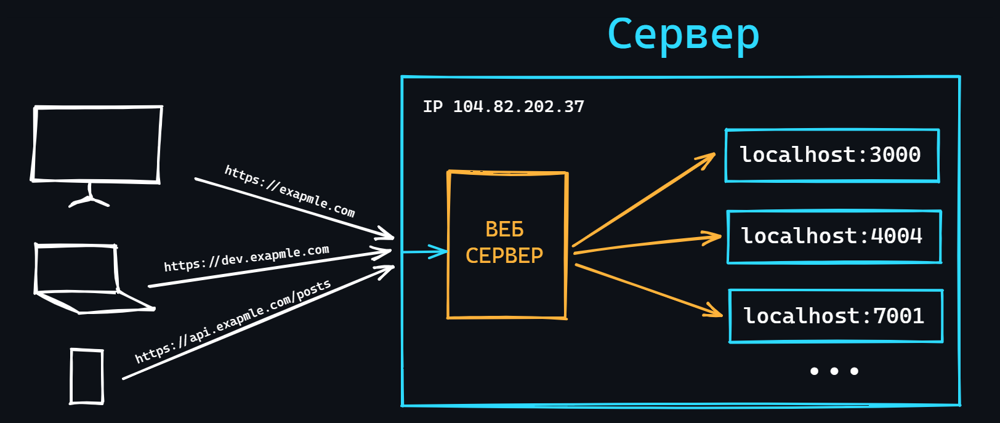</p>

    [Веб-сервер](https://ru.wikipedia.org/wiki/%D0%92%D0%B5%D0%B1-%D1%81%D0%B5%D1%80%D0%B2%D0%B5%D1%80) – это программа предназначенная для обработки входящих запросов по протоколу HTTP. Также он может вести журналы ошибок (логи), производить аунтефикацию и авторизацию, хранить правила на обработку файлов и т.д. 
    
    -   Зачем нужен?
        > 1. Не все языки могут иметь встроенный веб-сервер (например PHP). Поэтому для запуска веб-приложений, написанных на таких языках, необходим сторонний.
        > 2. На одном сервере (виртуальном или выделенном) может быть запущенно несколько приложений, но внешний IP-адрес только один. Сконфигурированный веб-сервер способен перенаправлять поступающие запросы в нужные приложения.
    -   Популярные веб-серверы
        > - [Nginx](https://ru.wikipedia.org/wiki/Nginx) – самый популярный на данный момент.
        > - [Apache](https://ru.wikipedia.org/wiki/Apache_HTTP_Server) – тоже популярный, но уже сдает свои позиции.
        > - [Caddy](https://en.wikipedia.org/wiki/Caddy_(web_server)) – довольно молодой веб-сервер с большим потенциалом.

<details>
    <summary>🔗 <b>Ссылки на материалы</b></summary>

1. 📺 [**Что такое веб сервер и для чего он нужен?** – YouTube](https://youtu.be/uFWyAn6E4BU)
2. 📄 [**Веб-сервер: краткий обзор**](https://doka.guide/tools/web-server/)
3. 📄 [**Что такое Nginx**](https://eternalhost.net/blog/sozdanie-saytov/chto-takoe-nginx)
4. 📄 [**Веб-сервер Nginx: краткий обзор**](https://doka.guide/tools/nginx-web-server/)
5. 📺 [**Основы Nginx (плейлист)** – YouTube](https://youtube.com/playlist?list=PLhgRAQ8BwWFa7ulOkX0qi5UfVizGD_-Rc)
6. 📄 [**NGINX изнутри: рожден для производительности и масштабирования** – habr.com](https://habr.com/ru/post/260065/)
7. 📄 [**Что такое Apache**](https://eternalhost.net/blog/hosting/web-server-apache)
8. 📄 [**Веб-сервер Apache: краткий обзор**](https://doka.guide/tools/apache-web-server/)
9. 📄 [**Apache vs Nginx: практический взгляд** – habr.com](https://habr.com/ru/post/267721/)
10. 📺 [**Установка web-сервера Apache на Linux Ubuntu и публикация web-сайта** – YouTube](https://youtu.be/XmN7FUIYycA)
11. 📺 [**Web-технологии. Web сервера | Технострим** – YouTube](https://youtu.be/1Tp5TV3BVWE)
12. 📺 [**Веб-сервер на Ubuntu 18 с нуля: nginx, HTTP/2, Brotli и HTTPS** – YouTube](https://youtu.be/oanbIqkS9LM)
</details>

<div align="right"><a href="#top">Содержание ⬆️</a></div>

-   ### Брокеры сообщений

    <p align="center">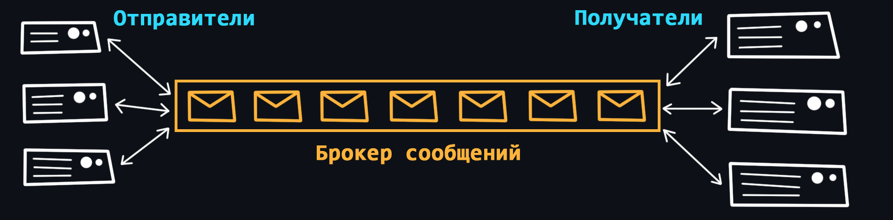</p>

    При создании масштабной backend-системы может возникать проблема коммуникации между большим количеством микросервисов. Чтобы не усложнять уже имеющиеся сервисы (налаживать надёжную систему коммуникации, распределять нагрузку, предусматривать различные ошибки и т.д.) можно использовать отдельный сервис, который называется [брокером сообщений (очередью сообщений)](https://ru.wikipedia.org/wiki/%D0%91%D1%80%D0%BE%D0%BA%D0%B5%D1%80_%D1%81%D0%BE%D0%BE%D0%B1%D1%89%D0%B5%D0%BD%D0%B8%D0%B9). 

    Брокер берет на себя ответственность создания надежной и отказоустойчивой системы коммуникации между сервисами (выполняет балансировку, гарантирует доставки, мониторит получателей, ведёт логи, буферизацию и т.д.)

    Под сообщением понимается обычный HTTP запрос/ответ с данными определенного формата.

    -   [RabbitMQ](https://ru.wikipedia.org/wiki/RabbitMQ)
    -   [Apache Kafka](https://ru.wikipedia.org/wiki/Apache_Kafka)
    -   [NATS](https://nats.io/)

<details>
    <summary>🔗 <b>Ссылки на материалы</b></summary>

1. 📺 [**Системы доставки сообщений, для чего они нужны?** – YouTube](https://youtu.be/ygZ9LsJG7Dw)
1. 📄 [**Что такое очередь сообщений?** – Amazon)](https://aws.amazon.com/ru/message-queue/)
1. 📄 [**Понимание брокеров сообщений. Изучение механики обмена сообщениями** – habr.com](https://habr.com/ru/post/466385/)
1. 📺 [**Микросервисы: Коммуникации через очередь сообщений** – YouTube](https://youtu.be/pCF-AeplALc)
1. 📺 [**RabbitMQ Tutorial на русском (плейлист)** – YouTube](https://youtube.com/playlist?list=PLCpsrvs6hImZShRjUbqewZWgjJgU6SIvU)
1. 📄 [**Что такое Apache Kafka за 5 минут** – YouTube](https://youtu.be/Mw9YFay8-WM)
1. 📄 [**Apache Kafka: основы технологии** – habr.com](https://habr.com/ru/company/southbridge/blog/550934/)
1. 📺 [**Про Kafka (основы)** – YouTube](https://youtu.be/-AZOi3kP9Js)
1. 📺 [**Брокер сообщений Kafka в условиях повышенной нагрузки** – YouTube](https://youtu.be/BtmYjTO1EpI)
1. 📄 [**Выбор MQ для высоконагруженного проекта** – habr.com](https://habr.com/ru/post/326880/)
</details>

<div align="right"><a href="#top">Содержание ⬆️</a></div>

-   ### Ngrok

    [Ngrok](https://ngrok.com/) - это инструмент для создания общедоступных [туннелей](https://ru.wikipedia.org/wiki/%D0%A2%D1%83%D0%BD%D0%BD%D0%B5%D0%BB%D0%B8%D1%80%D0%BE%D0%B2%D0%B0%D0%BD%D0%B8%D0%B5_(%D0%BA%D0%BE%D0%BC%D0%BF%D1%8C%D1%8E%D1%82%D0%B5%D1%80%D0%BD%D1%8B%D0%B5_%D1%81%D0%B5%D1%82%D0%B8)) в интернет, который позволяет локальным сетевым приложениям (веб-серверам, веб-сервисам и т.д.) стать доступными извне.

    -   Как это работает?
        > Ngrok создает временный публичный URL-адрес, который может быть использован для доступа к вашему локальному серверу из Интернета. После запуска Ngrok вы получаете доступ к консоли, где можно наблюдать за запросами, обработкой и ответами на эти запросы, а также настраивать дополнительные функции, такие как аутентификация и шифрование.
    -   Для чего это использовать?
        > Например, для тестирования веб-сайтов и API-интерфейсов, демонстрации работающих приложений на локальном сервере, доступа к локальным сетевым приложениям через Интернет без необходимости настройки маршрутизатора, прокси-сервера и т.д.

<details>
    <summary>🔗 <b>Ссылки на материалы</b></summary>

1. 📄 [**Одна команда в терминале делает ваш локальный сервер доступным в Интернете**](https://tproger.ru/articles/ngrok-tutorial/)
2. 📄 [**Ngrokking. Организация удаленного доступа без белого IP** – habr.com)](https://habr.com/ru/articles/674070/)
</details>

<div align="right"><a href="#top">Содержание ⬆️</a></div>

-   ### Инструменты ИИ

    Системы искусственного интеллекта (ИИ) в последнее время совершили невероятный скачок. С каждым днем появляется все больше инструментов, которые могут писать за вас код, генерировать документацию, проводить код-ревью, помогать изучать новые технологии и так далее. Многие люди все еще скептически относятся к возможностям и качеству контента, который создает ИИ. Но, по крайней мере, уже сейчас можно сэкономить много времени и ресурсов для повышения производительности любого разработчика.

    -   [ChatGPT](https://ru.wikipedia.org/wiki/ChatGPT)
        > Самая качественная [языковая модель](https://ru.wikipedia.org/wiki/%D0%AF%D0%B7%D1%8B%D0%BA%D0%BE%D0%B2%D0%B0%D1%8F_%D0%BC%D0%BE%D0%B4%D0%B5%D0%BB%D1%8C) на данный момент. Работает как обычный чат-бот и без проблем понимает человеческую речь на нескольких языках.
    -   [Bard](https://ru.wikipedia.org/wiki/Bard_(%D1%87%D0%B0%D1%82-%D0%B1%D0%BE%D1%82))
        > Разработан компанией Goolge в качестве альтернативы и прямого конкурента ChatGPT.
    -   [GitHub Copilot](https://ru.wikipedia.org/wiki/GitHub_Copilot)
        > Инструмент для авто-заполнения кода на основе искусственного интеллекта, разработанный в GitHub в сотрудничестве с разработчиками ChatGPT. Он интегрируется с популярными текстовыми редакторами и предоставляет предложения и дополнения к коду в режиме реального времени по мере его написания.
    -   [Tabnine](https://www.tabnine.com/)
        > Альтернатива GitHub Copilot, которая предоставляет контекстно-зависимые предложения по коду на основе шаблонов, полученных из миллионов общедоступных репозиториев.

<details>
    <summary>🔗 <b>Ссылки на материалы</b></summary>

1. 📄 [**Как пользоваться ChatGPT**](https://rogozinushka.github.io/chatgpt_manual/pages/ChatGPT_usage.html)
2. 📄 [**Как правильно задавать вопросы ChatGPT**](https://vc.ru/chatgpt/727926-kak-pravilno-zadavat-voprosy-chatgpt)
</details>

<div align="right"><a href="#top">Содержание ⬆️</a></div>

## Безопасность

-   ### Уязвимости веб-приложений

    -   [Межсайтовый скриптинг (XSS)](https://ru.wikipedia.org/wiki/%D0%9C%D0%B5%D0%B6%D1%81%D0%B0%D0%B9%D1%82%D0%BE%D0%B2%D1%8B%D0%B9_%D1%81%D0%BA%D1%80%D0%B8%D0%BF%D1%82%D0%B8%D0%BD%D0%B3)
        > Атака, которая позволяют злоумышленнику внедрять вредоносный код через веб-сайт в браузеры других пользователей. 
    -   [SQL-инъекций](https://ru.wikipedia.org/wiki/%D0%92%D0%BD%D0%B5%D0%B4%D1%80%D0%B5%D0%BD%D0%B8%D0%B5_SQL-%D0%BA%D0%BE%D0%B4%D0%B0)
        > Атака может быть возможна если, пользовательский ввод, который передаётся в SQL-запрос, способен изменить смысл оператора или добавить туда другой запрос.
    -   [Подделка межсайтовых запросов (CSRF)](https://ru.wikipedia.org/wiki/%D0%9C%D0%B5%D0%B6%D1%81%D0%B0%D0%B9%D1%82%D0%BE%D0%B2%D0%B0%D1%8F_%D0%BF%D0%BE%D0%B4%D0%B4%D0%B5%D0%BB%D0%BA%D0%B0_%D0%B7%D0%B0%D0%BF%D1%80%D0%BE%D1%81%D0%B0)
        > Когда на сайте для выполнения какой-либо операции используется POST-запрос, злоумышленник может подделать форму, например в электронном письме и отправить его жертве. Затем жертва, являющаяся авторизованным пользователем, взаимодействую с этим письмом, не зная того, может отправить запрос на сайт с данными, которые задал злоумышленник.
    -   [Кликджекинг (Clickjacking)](https://ru.wikipedia.org/wiki/%D0%9A%D0%BB%D0%B8%D0%BA%D0%B4%D0%B6%D0%B5%D0%BA%D0%B8%D0%BD%D0%B3)
        > Принцип основан на том, что поверх видимой веб-страницы располагается невидимый слой, в который и загружается нужная злоумышленнику страница, при этом элемент управления (кнопка, ссылка), необходимый для осуществления требуемого действия, совмещается с видимой ссылкой или кнопкой, нажатие на которую ожидается от пользователя.
    -   [DoS-атака (Denial of Service)](https://ru.wikipedia.org/wiki/DoS-%D0%B0%D1%82%D0%B0%D0%BA%D0%B0)
        > Хакерская атака, которая приводит к перегрузке сервера, на котором работает веб-приложение, за счет отправки огромного количества запросов.
    -   [Man-in-the-Middle (человек посередине)](https://ru.wikipedia.org/wiki/%D0%90%D1%82%D0%B0%D0%BA%D0%B0_%D0%BF%D0%BE%D1%81%D1%80%D0%B5%D0%B4%D0%BD%D0%B8%D0%BA%D0%B0)
        > Тип атаки при которой злоумышленник попадает в цепь между двумя (или более) общающимися сторонами, чтобы перехватить разговор или передачу данных.
    -   Неверная конфигурация безопасности
        > Использование параметров конфигурации по умолчанию может быть опасным, поскольку это общеизвестная информация. К примеру, частой уязвимостью является то, что сетевые администраторы оставляют стандартные логины и пароли _admin:admin_.

<details>
    <summary>🔗 <b>Ссылки на материалы</b></summary>

1. 📄 [**Веб-безопасность** – (MDN) mozilla.org](https://developer.mozilla.org/ru/docs/Learn/Server-side/First_steps/Website_security)
1. 📄 [**Безопасность веб-приложений: от уязвимостей до мониторинга** – habr.com](https://habr.com/ru/company/pentestit/blog/526878/)
1. 📺 [**Безопасность: уязвимости вашего приложения** – YouTube](https://youtu.be/2gthjl2Lks4)
1. 📺 [**Самые популярные уязвимости Web-приложений в контексте Golang** – YouTube](https://youtu.be/UfeZ-bPFs10)
1. 📄 [**Как защитить веб-приложение: основные советы, инструменты, полезные ссылки** – tproger.ru](https://tproger.ru/translations/webapp-security/)
1. 📄 [**Что такое XSS-уязвимость и как тестировщику не пропустить ее** – habr.com](https://habr.com/ru/post/511318/)
1. 📄 [**DDoS-атаки: что это, происхождение, виды и способы защиты** – selectel.ru](https://selectel.ru/blog/ddos-attacks/)
1. 📄 [**DDoS-атаки: нападение и защита** – habr.com](https://habr.com/ru/company/ruvds/blog/321992/)
1. 📄 [**Man-in-the-Middle: советы по обнаружению и предотвращению**](https://habr.com/ru/company/varonis/blog/526632/)
1. 📺 [**Безопасность Web-приложений (плейлист)** – YouTube](https://youtube.com/playlist?list=PLp2kHCN7pLe1azEbJa5ucnLpD0nGex0tg)
1. 📺 [**Безопасность интернет-приложений (плейлист)** – YouTube](https://youtube.com/playlist?list=PLrCZzMib1e9oopXP4-aumUxkbz_56Czon)
1. 📄 [**Аналитика уязвимостей и угроз веб-приложений за 2019 год**](https://www.ptsecurity.com/ru-ru/research/analytics/web-vulnerabilities-2020/)
</details>

<div align="right"><a href="#top">Содержание ⬆️</a></div>

-   ### Переменные окружения

    Часто в ваших приложениях могут использоваться различные токены (например для доступа к стороннему платному API), логины и пароли (для подключения к базе данных), различные секретные ключи для подписей и так далее. Все эти данные не должны быть известны и доступны посторонним людям, соответственно оставлять их в коде программы ни в коем случае нельзя. Для решения этой проблемы существуют переменные окружения. 

    -   Файл `.env`
        > Специальный файл в котором можно хранить все переменные окружения.
    -   Парсинг `.env` файла
        > Переменные передаются в программу с помощью аргументов командной строки. Чтобы сделать подобное с `.env` файлом необходимо воспользоваться специальной библиотекой под ваш ЯП.
    -   Хранение и передача
        > Изучите как загружать `.env` файлы на хостинг сервисы, а так же помните, что такие файлы нельзя коммитить в удаленные репозитории, поэтому не забывайте добавлять их в исключения через файл `.gitignore`.

<details>
    <summary>🔗 <b>Ссылки на материалы</b></summary>

1. 📺 [**Как хранить пароли и ключи в коде проектов? Всё о переменных окружения** – YouTube](https://youtu.be/Y9MRCxq4DIc)
2. 📄 [**Переменные окружения для Python проектов** – habr.com](https://habr.com/ru/post/472674/)
3. 📄 [**Использование переменных окружения в Node.js** – habr.com](https://habr.com/ru/company/ruvds/blog/351254/)
4. 📺 [**Изучаем Go. Переменные окружения в Golang** – YouTube](https://youtu.be/l2BpOaAinDg)
</details>

<div align="right"><a href="#top">Содержание ⬆️</a></div>

-   ### Хеширование

    <p align="center"></p>

    Для обеспечения безопасности в сети широко используется криптографические алгоритмы на основе [хеш-функций](https://ru.wikipedia.org/wiki/%D0%A5%D0%B5%D1%88-%D1%84%D1%83%D0%BD%D0%BA%D1%86%D0%B8%D1%8F).

    Основные понятия:
    -   Хеширование  
        > Процесс преобразования массива информации (от одной буквы и хоть до целого литературного произведения) в некую уникальную короткую строку символов (называемую хэшем), которая присуща только этому массиву информации. Причем если в этом массиве информации изменить хоть один символ, то новый хэш будет отличатся кардинально. <br>
        > Хеширование является необратимым процессом, то есть по полученному хэшу невозможно восстановить изначальные данные.
    -   [Контрольные суммы](https://ru.wikipedia.org/wiki/%D0%9A%D0%BE%D0%BD%D1%82%D1%80%D0%BE%D0%BB%D1%8C%D0%BD%D0%B0%D1%8F_%D1%81%D1%83%D0%BC%D0%BC%D0%B0)
        > Хэши могут использоваться как контрольные суммы, которые служат доказательством целостности данных.
    -   [Коллизии](https://ru.wikipedia.org/wiki/%D0%9A%D0%BE%D0%BB%D0%BB%D0%B8%D0%B7%D0%B8%D1%8F_%D1%85%D0%B5%D1%88-%D1%84%D1%83%D0%BD%D0%BA%D1%86%D0%B8%D0%B8)
        > Cлучаи когда хеширование разного набора информации приводит к одинаковым хэшам.
    -   [Соль (в криптографии)](https://ru.wikipedia.org/wiki/%D0%A1%D0%BE%D0%BB%D1%8C_(%D0%BA%D1%80%D0%B8%D0%BF%D1%82%D0%BE%D0%B3%D1%80%D0%B0%D1%84%D0%B8%D1%8F))
        > Случайная строка данных, которая добавляется к входным данным перед хешированием, для вычисления хэша. Это необходимо для усложнения взлома методом перебора.

    Основные алгоритмы хеширования:
    -   [Семейство SHA (Secure Hash Algorithm)](https://en.wikipedia.org/wiki/Secure_Hash_Algorithms)
        > [SHA-256](https://ru.wikipedia.org/wiki/SHA-2) наиболее популярный алгоритм шифрования. Используется, например, в [Bitcoin](https://ru.wikipedia.org/wiki/%D0%91%D0%B8%D1%82%D0%BA%D0%BE%D0%B9%D0%BD).
    -   Семейство MD (Message Digest)
        > Наиболее популярный алгоритм семейства – [MD5](https://ru.wikipedia.org/wiki/MD5). Сейчас считается очень уязвимым к коллизиям (существуют даже генераторы коллизий для MD5).
    -   [CRC (Cyclic redundancy check)](https://ru.wikipedia.org/wiki/%D0%A6%D0%B8%D0%BA%D0%BB%D0%B8%D1%87%D0%B5%D1%81%D0%BA%D0%B8%D0%B9_%D0%B8%D0%B7%D0%B1%D1%8B%D1%82%D0%BE%D1%87%D0%BD%D1%8B%D0%B9_%D0%BA%D0%BE%D0%B4)
        > Алгоритм нахождения контрольной суммы, предназначенный для проверки целостности данных.

<details>
    <summary>🔗 <b>Ссылки на материалы</b></summary>

1. 📄 [**Хеш-функция, что это такое?** – habr.com](https://habr.com/ru/post/534596/)
1. 📺 [**Что такое ХЭШ функция? | Хеширование** – YouTube](https://youtu.be/Bul0XYMa8Jg)
2. 📺 [**Как работает хэширование** – YouTube](https://youtu.be/xV8USnjKGCU)
3. 📺 [**Hash/Хеш - просто о сложном** – YouTube](https://youtu.be/oPknb1k4elE)
4. 📺 [**Как работает SHA256** – YouTube](https://youtu.be/8vg5B2O4RPk)
5. 📄 [**«Привет, мир»: разбираем каждый шаг хэш-алгоритма SHA-256** – habr.com](https://habr.com/ru/company/selectel/blog/530262/)
6. 📄 [**Все методы взлома MD5**](https://xakep.ru/2013/10/13/md5-hack/)
7. 📄 [**CRC: как защитить программу**](https://xakep.ru/2004/03/30/21788/)
8. 📄 [**Простой расчет контрольной суммы** – habr.com](https://habr.com/ru/post/278171/)
</details>

<div align="right"><a href="#top">Содержание ⬆️</a></div>

-   ### Аутентификация и авторизация

    > Важно понимать отличие между двумя этими понятиями.

    [Аутентификация](https://ru.wikipedia.org/wiki/%D0%90%D1%83%D1%82%D0%B5%D0%BD%D1%82%D0%B8%D1%84%D0%B8%D0%BA%D0%B0%D1%86%D0%B8%D1%8F) – процедура проверки подлинности пользователя. Как правило выполняется путем сравнения введенного пользователем пароля с паролем, сохраненным в базе данных. 
    Так же, в это понятие часто включают и [идентификацию](https://ru.wikipedia.org/wiki/%D0%98%D0%B4%D0%B5%D0%BD%D1%82%D0%B8%D1%84%D0%B8%D0%BA%D0%B0%D1%86%D0%B8%D1%8F_(%D0%B8%D0%BD%D1%84%D0%BE%D1%80%D0%BC%D0%B0%D1%86%D0%B8%D0%BE%D0%BD%D0%BD%D1%8B%D0%B5_%D1%81%D0%B8%D1%81%D1%82%D0%B5%D0%BC%D1%8B)) – процедуру выявления пользователя по его уникальному идентификатору (как правило это обычный логин или email). Это нужно, чтобы точно знать для какого пользователя выполняется проверка подлинности.

    [Авторизация](https://ru.wikipedia.org/wiki/%D0%90%D0%B2%D1%82%D0%BE%D1%80%D0%B8%D0%B7%D0%B0%D1%86%D0%B8%D1%8F) – процедура выдачи прав доступа определенному пользователю на выполнение определенных операций. Например обычные пользователи интернет-магазина могут просматривать товары, добавлять их в корзину. А вот добавлять новые товары или удалять уже имеющиеся могут только администраторы.

    -   [Basic Authentication](https://developer.mozilla.org/ru/docs/Web/HTTP/Authentication#basic_authentication_scheme)
        > Наиболее простая схема аутентификации, при которой username и password пользователя передаются в заголовке [Authorization](https://developer.mozilla.org/ru/docs/Web/HTTP/Headers/Authorization) в незашифрованном виде (base64-encoded). При использовании HTTPS является относительно безопасным.
    -   [SSO (Single Sign-On)](https://ru.wikipedia.org/wiki/%D0%A2%D0%B5%D1%85%D0%BD%D0%BE%D0%BB%D0%BE%D0%B3%D0%B8%D1%8F_%D0%B5%D0%B4%D0%B8%D0%BD%D0%BE%D0%B3%D0%BE_%D0%B2%D1%85%D0%BE%D0%B4%D0%B0)
        > Технология реализующая возможность перехода из одного сервиса в другой (не связанный с первым), без повторной аутентификации.
    -   [OAuth / OAuth 2.0](https://ru.wikipedia.org/wiki/OAuth)
        > Протокол авторизации благодаря которому можно зарегистрироваться в различных приложениях с помощью популярных сервисов (Google, Facebook, GitHub и т.д.)
    -   [OpenID](https://ru.wikipedia.org/wiki/OpenID)
        > Открытый стандарт, позволяющий создавать единую учётную запись для аутентификации на множестве не связанных друг с другом сервисов.
    -   [JWT (Json Web Token)](https://ru.wikipedia.org/wiki/JSON_Web_Token)
        > Стандарт аутентификации работающий на основе токенов доступа. Токены создаются сервером, подписываются секретным ключом и передаются клиенту, который в дальнейшем использует данный токен для подтверждения своей личности.

<details>
    <summary>🔗 <b>Ссылки на материалы</b></summary>

1. 📄 [**Аутентификация и авторизация в микросервисных приложениях** – habr.com](https://habr.com/ru/company/dataart/blog/311376/)
1. 📄 [**Обзор способов и протоколов аутентификации в веб-приложениях** – habr.com](https://habr.com/ru/company/dataart/blog/262817/)
1. 📄 [**Как работает single sign-on (технология единого входа)?** – habr.com](https://habr.com/ru/company/nixys/blog/563244/)
1. 📄 [**OAuth 2: введение в протокол авторизации** – selectel.ru](https://selectel.ru/blog/oauth-2/)
1. 📺 [**Как работает OAuth 2 - введение (просто и понятно)** – YouTube](https://youtu.be/DilydjvgVbo)
1. 📄 [**OAuth 2.0 простым и понятным языком** – habr.com](https://habr.com/ru/company/vk/blog/115163/)
1. 📺 [**OpenID Connect. Теория** – YouTube](https://youtu.be/KkIsn7bvUbQ)
1. 📄 [**OpenID Connect простыми словами** – habr.com](https://habr.com/ru/company/nixys/blog/566910/)
1. 📄 [**Пять простых шагов для понимания JSON Web Tokens (JWT)** – habr.com](https://habr.com/ru/post/340146/)
1. 📺 [**Виды авторизации: сессии, JWT-токены. Для чего нужны сессии? Как работает JWT?** – YouTube](https://youtu.be/q0u4yRUSDzI)
1. 📺 [**JWT. Часть 1. Теория** – YouTube](https://youtu.be/vQldMjSJ6-w)
</details>

<div align="right"><a href="#top">Содержание ⬆️</a></div>

-   ### SSL/TLS

    [SSL (Secure Socket Layer)](https://ru.wikipedia.org/wiki/SSL) и [TLS (Transport Layer Security)](https://ru.wikipedia.org/wiki/TLS) – это криптографические протоколы, которые обеспечивают защищённую передачу данных между двумя компьютерами в сети. По сути эти протоколы работают одинаково и отличий у них нет. SSL считается устаревшим, хотя все еще используется для поддержки старых устройств.

    -   [Центр сертификации](https://ru.wikipedia.org/wiki/%D0%A6%D0%B5%D0%BD%D1%82%D1%80_%D1%81%D0%B5%D1%80%D1%82%D0%B8%D1%84%D0%B8%D0%BA%D0%B0%D1%86%D0%B8%D0%B8)
        > TLS/SSL использует цифровые сертификаты, выдаваемые центром сертификации. Одним из самых популярных является [Let’s Encrypt](https://ru.wikipedia.org/wiki/Let%E2%80%99s_Encrypt).
    -   Конфигурация и установка сертификатов
        > Необходимо уметь генерировать сертификаты и правильно их устанавливать, чтобы Ваш сервер работал по HTTPS.
    -   [Процесс рукопожатия (handshake)](https://ru.wikipedia.org/wiki/TLS#%D0%9F%D1%80%D0%BE%D1%86%D0%B5%D0%B4%D1%83%D1%80%D0%B0_%D0%BF%D0%BE%D0%B4%D1%82%D0%B2%D0%B5%D1%80%D0%B6%D0%B4%D0%B5%D0%BD%D0%B8%D1%8F_%D1%81%D0%B2%D1%8F%D0%B7%D0%B8_%D0%B2_TLS_%D0%B2_%D0%B4%D0%B5%D1%82%D0%B0%D0%BB%D1%8F%D1%85)
        > Чтобы установить безопасное соединение между клиентом и сервером, должен произойти специальный процесс, который включает в себя обмен ключами и информацией об алгоритмах шифрования. 

<details>
    <summary>🔗 <b>Ссылки на материалы</b></summary>

1. 📺 [**Протоколы TLS/SSL | Защищенные сетевые протоколы** – YouTube](https://youtu.be/LTLqazCztnc)
2. 📄 [**Как это работает: знакомство с SSL/TLS** – habr.com](https://habr.com/ru/company/1cloud/blog/326292/)
3. 📄 [**Что такое TLS** – habr.com](https://habr.com/ru/post/258285/)
4. 📺 [**TLS/SSL сертификаты и с чем их едят** – YouTube](https://youtu.be/W9M40MdlvSg)
5. 📄 [**Как HTTPS обеспечивает безопасность соединения** – habr.com](https://habr.com/ru/post/188042/)
6. 📺 [**Шифрование в TLS/SSL | Защищенные сетевые протоколы** – YouTube](https://youtu.be/kCkQRH5eweg)
7. 📺 [**Как получить и настроить LetsEncrypt SSL сертификат для сайта?** – YouTube](https://youtu.be/1wnOw1vwPEo)
8. 📺 [**Криптография с нуля** – YouTube](https://youtu.be/7mn4uq4DBJo)
</details>
 
<div align="right"><a href="#top">Содержание ⬆️</a></div>

## Тестирование

Тестирование — это процесс оценки того, что все части программы ведут себя так, как от них это ожидается. Покрытие продукта должным количеством тестов, позволяет в дальнейшем проводить быстрые проверки на то, не сломалось ли что-нибудь в приложении, после добавления нового или изменения старого функционала.

-   ### Unit-тесты

    Самый простой вид тестов. Как правило, около 70-80% от всех тестов занимают именно [unit-тесты](https://ru.wikipedia.org/wiki/%D0%9C%D0%BE%D0%B4%D1%83%D0%BB%D1%8C%D0%BD%D0%BE%D0%B5_%D1%82%D0%B5%D1%81%D1%82%D0%B8%D1%80%D0%BE%D0%B2%D0%B0%D0%BD%D0%B8%D0%B5). «Unit» означает, что тестируется не вся система в целом, а небольшие и отдельные её части (функции, методы, компоненты и т.д.) в изоляции от других. Всё зависимое внешнее окружение, как правило, покрывается [моками (mocks)](https://gist.github.com/vertigra/696e9d92dc72070584e556e2169e850d).

    - Какая польза от Unit-тестов?
        > Для примера представим автомобиль. Его «юниты» — это двигатель, тормоза, приборная панель и т.д. Их можно проверить по отдельности перед сборкой и, в случае чего заменить или починить. А можно собрать автомобиль, не протестировав юниты, — и он не поедет. Придётся всё разбирать и проверять каждую деталь.
    - Что нужно чтобы начать писать Unit-тесты?
        > Как правило, средств стандартной библиотеки языка достаточно, чтобы писать качественные тесты. Но для более удобного и быстрого написания тестов, лучше использовать сторонние инструменты. Например:
        > - Для Python используется [pytest](https://docs.pytest.org), хотя для начала хватит и стандартного [unittest](https://docs.python.org/3/library/unittest.html).
        > - Для JavaScript/TypeScript лучший выбор – это [Jest](https://jestjs.io/).
        > - Для Go – [testify](https://github.com/stretchr/testify).
        > - [И так далее...](https://github.com/atinfo/awesome-test-automation#awesome-test-automation)

<details>
    <summary>🔗 <b>Ссылки на материалы</b></summary>

1. 📄 [**Юнит-тестирование для чайников** – habr.com](https://habr.com/ru/post/169381/)
2. 📺 [**Unit tests - модульное тестирование** – YouTube](https://youtu.be/6whsUwWYYVk)
3. 📺 [**Python – юнит-тестирование. Использование unittest и coverage** – YouTube](https://youtu.be/YD7aYJh3k-w)
4. 📺 [**Jest. Unit Тестирование в JavaScript** – YouTube](https://youtu.be/IEDe8jl5efU)
5. 📄 [**Качество, тестирование и надежность ПО (лекции и примеры кода на Node.js)** – GitHub](https://github.com/HowProgrammingWorks/Index/blob/master/Courses/Quality.md)
6. 📺 [**Тестирование в Go: от плохого к хорошему** – YouTube](https://youtu.be/iJK99AQqKZY)
7. 📄 [**Когда использовать mocks в юнит-тестировании** – habr.com](https://habr.com/ru/post/577424/)
</details>

<div align="right"><a href="#top">Содержание ⬆️</a></div>

-   ### Интеграционные тесты

    [Интеграционное тестирование](https://ru.wikipedia.org/wiki/%D0%98%D0%BD%D1%82%D0%B5%D0%B3%D1%80%D0%B0%D1%86%D0%B8%D0%BE%D0%BD%D0%BD%D0%BE%D0%B5_%D1%82%D0%B5%D1%81%D1%82%D0%B8%D1%80%D0%BE%D0%B2%D0%B0%D0%BD%D0%B8%D0%B5) подразумевает тестирование отдельных модулей (компонентов) в связке с другими (то есть, в интеграции). То, что при Unit-тестировании закрывалось заглушкой – теперь является реальным компонентом или целым модулем.

    -   Зачем это нужно?
        > Интеграционные тесты это следующий этап после юнитов. Протестировав каждый компонент по отдельности мы еще не можем сказать, что основной функционал программы работает без ошибок. Потенциально, еще может существовать множество проблем, которые всплывут только после взаимодействия различных частей программы между собой.
    -   Стратегии написания интеграционных тестов
        > - **Большой Взрыв**: большинство разработанных модулей соединяются вместе, образуя либо всю необходимую систему либо её большую часть. Если всё работает, то таким спобом можно сэкономить много времени.
        > - **Инкрементальный подход**: выполняется путем соединения двух или более логически связанных модулей и затем постепенно подключаются всё новые модули, пока не будет протестирована вся система.
        > - **Подход снизу вверх**: каждый модуль на более низких уровнях тестируется с помощью модулей следующего более высокого уровня , пока не будут протестированы все модули.

<details>
    <summary>🔗 <b>Ссылки на материалы</b></summary>

1. 📄 [**Для чего нужно интеграционное тестирование?** – habr.com](https://habr.com/ru/post/556002/)
2. 📄 [**Интеграционное тестирование: полный обзор**](https://www.andreyolegovich.ru/qa/theory/integration.php)
3. 📺 [**Доклад: Интеграционное тестирование** – YouTube](https://youtu.be/BzDzFrhWEHE)
</details>

<div align="right"><a href="#top">Содержание ⬆️</a></div>

-   ### E2E тесты

    <p align="center">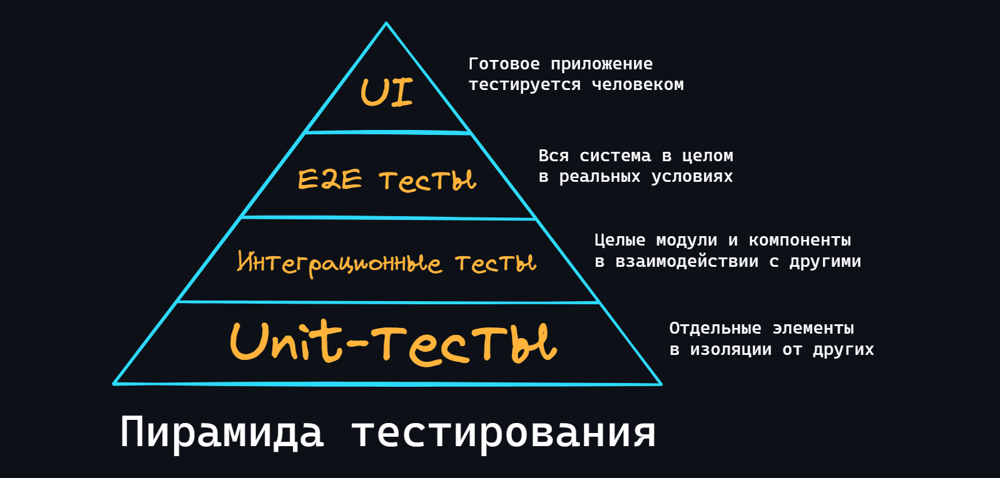</p>

    End-to-end (E2E, сквозные) тесты подразумевают тестирование работы всей системы в целом. При этом виде тестирования, реализуется среда максимально близкая к реальным условиям. Можно провести аналогию, что за компьютером сидит робот и нажимает кнопки в указанном порядке, как это делал бы реальный пользователь.

    - Когда использовать?
        > E2E это самый сложный вид тестов. Они требуют много времени, как для написания, так и для выполнения, поскольку задействуют всё приложение. Поэтому, если ваше приложение небольшое (например, его разрабатываете только Вы), то скорее всего будет достаточно написания Unit и некоторого кол-ва интеграционных тестов.

<details>
    <summary>🔗 <b>Ссылки на материалы</b></summary>

1. 📄 [**Сквозное тестирование (end-to-end): что, зачем, почему** – habr.com](https://habr.com/ru/post/417395/)
2. 📄 [**Про пользу E2E тестирования** – habr.com](https://habr.com/ru/post/525934/)
3. 📺 [**Доклад: End to End – the right way!** – YouTube](https://youtu.be/FlQLUsczSLQ)
</details>

<div align="right"><a href="#top">Содержание ⬆️</a></div>

-   ### Нагрузочное тестирование

    Когда вы создаете большое приложение, которое должно обслуживать большое количество запросов, возникает необходимость в тестировании этой самой возможности выдерживать большие нагрузки. Для создания [искусственной нагруженности](https://ru.wikipedia.org/wiki/%D0%9D%D0%B0%D0%B3%D1%80%D1%83%D0%B7%D0%BE%D1%87%D0%BD%D0%BE%D0%B5_%D1%82%D0%B5%D1%81%D1%82%D0%B8%D1%80%D0%BE%D0%B2%D0%B0%D0%BD%D0%B8%D0%B5) существует множество утилит.

    -   [JMeter](https://ru.wikipedia.org/wiki/JMeter)
        > Удобный интерфейс, кроссплатформенность, поддержка многопоточности, расширяемость, отличные возможности по созданию отчётов, поддержка многих протоколов для запросов.
    -   [LoadRunner](https://ru.wikipedia.org/wiki/HP_LoadRunner)
        > Имеет интересную функцию виртуальных пользователей, которые параллельно что-то делают с тестируемым приложением. Это позволяет понять как влияет работа одних пользователей, активно что-то делающих с сервисом, на работу других.
    -   [Gatling](https://en.wikipedia.org/wiki/Gatling_(software))
        > Очень мощный инструмент ориентированный уже не более опытных пользователей. Для описания сценариев используется Scala.
    -   [Taurus](https://gettaurus.org/)
        > Целый фреймворк для более удобной работы над JMeter, Gatling и так далее. Для описания тестов используется JSON или YAML.

<details>
    <summary>🔗 <b>Ссылки на материалы</b></summary>

1. 📄 [**Поговорим о нагрузочном тестировании** – habr.com](https://habr.com/ru/company/veeam/blog/578942/)
1. 📺 [**Использование непрерывного нагрузочного тестирования для оценки ёмкости и ресурсов** – YouTube](https://youtu.be/VHBBOgIiUgA)
1. 📄 [**Обзор инструментария для нагрузочного и перформанс-тестирования** – habr.com](https://habr.com/ru/company/jugru/blog/337928/)
1. 📄 [**Приручаем JMeter** – habr.com](https://habr.com/ru/post/261483/)
1. 📄 [**Нагрузочное тестирование на Gatling — Полное руководство** – habr.com](https://habr.com/ru/company/otus/blog/552846/)
</details>

<div align="right"><a href="#top">Содержание ⬆️</a></div>

-   ### Регрессионное тестирование

    [Регрессионное тестирование](https://ru.wikipedia.org/wiki/%D0%A0%D0%B5%D0%B3%D1%80%D0%B5%D1%81%D1%81%D0%B8%D0%BE%D0%BD%D0%BD%D0%BE%D0%B5_%D1%82%D0%B5%D1%81%D1%82%D0%B8%D1%80%D0%BE%D0%B2%D0%B0%D0%BD%D0%B8%D0%B5) (regression - движение назад) – вид тестирования, направленный на обнаружение ошибок в уже протестированных участках исходного кода. 

    - Зачем нужно?
        > По статистике, повторное появление одних и тех же ошибок в коде - довольно частое явление. И, что самое интересное, выпускаемые для них патчи/фиксы со временем также перестают работать. Поэтому считается хорошей практикой при исправлении ошибки создать тест на неё и регулярно прогонять его при последующих изменениях.

<details>
    <summary>🔗 <b>Ссылки на материалы</b></summary>

1. 📺 [**Регрессионное тестирование** – YouTube](https://youtu.be/1f3yfUnji8o)
2. 📄 [**Что нужно знать о регрессионном тестировании**](https://otus.ru/journal/chto-nuzhno-znat-o-regressionnom-testirovanii/)
</details>

<div align="right"><a href="#top">Содержание ⬆️</a></div>

## Развертывание (CI/CD)

-   ### Облачные сервисы

    Прежде чем запустить приложение в сети, необходимо решить, где вы хотите его разместить. Вы можете арендовать собственный сервер или воспользоваться услугами облачных провайдеров, которые обладают большим функционалом для автоматизации процессов, мониторинга, балансировки нагрузки, хранения данных и т.д.

    -   [AWS (Amazon Web Services)](https://docs.aws.amazon.com/whitepapers/latest/aws-overview/introduction.html)
        > Предоставляет широкий спектр услуг: хранение данных, управление базами данных, создание сетей, обеспечение безопасности и т.д. AWS - один из старейших и наиболее авторитетных поставщиков облачных услуг.
    -   [Google Cloud](https://cloud.google.com/docs/overview)
        > Ориентирован на машинное обучение и искусственный интеллект, имеет интеграции с другими сервисами Google, такими как Google Analytics и Google Maps.
    -   [Microsoft Azure](https://azure.microsoft.com/en-us/explore)
        > Azure известен своей интеграцией с другими сервисами Microsoft, такими как Office 365 и Dynamics 365, а также поддержкой широкого спектра языков программирования и фреймворков.
    -   [Digital Ocean](https://www.digitalocean.com/)
        > Предоставляет виртуальные частные серверы (VPS) для разработчиков и малого бизнеса. Известен своей простотой и удобством использования, а также низкими ценами.
    -   [Heroku](https://www.heroku.com/what)
        > Одна из первых PaaS-платформ. Поддерживает большой спектр языков программирования. До недавнего времени Heroku являлся наиболее популярным сервисом для размещения open-source проектов, поскольку имел бесплатный тарифный план (сейчас его убрали).

    Как правило, все эти сервисы имеют интуитивно понятный простой интерфейс, подробную документацию, а также множество видеоуроков на YouTube.

<details>
    <summary>🔗 <b>Ссылки на материалы</b></summary>

1. 📺 [**AWS на русском языке (playlist)** – YouTube](https://youtube.com/playlist?list=PLg5SS_4L6LYsxrZ_4xE_U95AtGsIB96k9)
2. 📄 [**Подкасты об AWS на русском языке** – Google](https://podcasts.google.com/feed/aHR0cHM6Ly9mZWVkLnBvZGJlYW4uY29tL2F3c25hcnVzc2tvbS9mZWVkLnhtbA)
3. 📺 [**Google cloud на русском языке (playlist)** – YouTube](https://youtube.com/playlist?list=PLg5SS_4L6LYs5IZZSY0viHRQFPa2P-R8H)
4. 📺 [**Уроки по Microsoft Azure (playlist)** – YouTube](https://youtube.com/playlist?list=PL_1ck0dfZvvCk7QCuYNCE_fWZIEY-Xae8)
 </details>

<div align="right"><a href="#top">Содержание ⬆️</a></div>

-   ### Управление контейнерами

    Оркестровка контейнеров (container orchestration) - это процесс управления, автоматизации развертывания, масштабирования и обслуживания контейнерных приложений и зависимостей в кластере серверов.

    -   Docker в рабочей среде
        > Самый простой способ управления контейнерами - использовать непосредственно Docker, следуя списку правил для обеспечения стабильности и безопасности приложений.
        > - Храните свои образы Docker в частном реестре для предотвращения несанкционированного доступа.
        > - Используйте надежные механизмы аутентификации для доступа к реестру Docker и применяйте меры безопасности, такие как правила брандмауэра.
        > - Ужимайте размер контейнеров до минимума, убирая ненужные пакеты и зависимости.
        > - Используйте отдельные контейнеры для различных служб (например для сервера приложения, базы данных, хранилища кэша, метрики и т.д.).
        > - Используйте Docker Volumes для хранения постоянных данных, таких как файлы баз данных, журналы и файлы конфигурации.
    -   [Docker swarm](https://docs.docker.com/engine/swarm/)
        > Это собственный инструмент оркестровки Docker для управления, масштабирования и автоматизации таких задач, как обновление контейнеров, восстановление, балансировка трафика, [service discovery](https://devopscube.com/service-discovery-explained/) и так далее.
    -   [Kubernetes](https://en.wikipedia.org/wiki/Kubernetes) (K8s)
        > Это очень популярная платформа оркестровки, которая может работать с различными [контейнерными рантаймами](https://kubernetes.io/docs/setup/production-environment/container-runtimes/), включая Docker. Kubernetes предлагает более обширный набор функций (чем Docker swarm), включая расширенное планирование, оркестровку хранилищ и возможности продвинутого самовосстановления.

<details>
    <summary>🔗 <b>Ссылки на материалы</b></summary>

1. 📄 [**Docker Swarm для самых маленьких** – habr.com](https://habr.com/ru/articles/659813/)
2. 📺 [**Запускаем Docker Swarm в продакшене** – YouTube](https://www.youtube.com/live/2FPL6jfXqOM?feature=share)
3. 📺 [**Вебинар «Docker Swarm vs K8s. Уйти нельзя остаться** – YouTube](https://youtu.be/NX2OGJLJP6Y)
4. 📄 [**K8S для начинающих** – habr.com](https://habr.com/ru/articles/589415/)
5. 📺 [**Введение в Kubernetes на примере Minikube** – YouTube](https://youtu.be/sLQefhPfwWE)
6. 📺 [**Kubernetes на русском языке (playlist)** – YouTube](https://youtube.com/playlist?list=PLg5SS_4L6LYvN1RqaVesof8KAf-02fJSi)
</details>

<div align="right"><a href="#top">Содержание ⬆️</a></div>

-   ### Инструменты автоматизации

    Процесс развертывания ПО включает в себя множество этапов: тестирование, минимизация, сборка, установка зависимостей, интеграции с другими инструментами (репозитории, мониторинг и т.д.), установка переменных окружения, контейнеризация и так далее. Чтобы упростить этот трудоемкий пайплайн, можно прибегнуть к инструментам автоматизации.

    -   [Github Actions](https://docs.github.com/en/actions)
        > Инструмент CI/CD, встроенный в платформу Github, который позволяет разработчикам автоматизировать рабочие процессы для своих репозиториев. Отличный выбор, если вы уже используете GitHub. Имеется большое количество предварительно созданных прессетов для разных языков и платформ. Одна из самых полезных функций - возможность запускать рабочие процессы на основе различных событий, например на отправку пулл реквестов.
    -   [Jenkins](https://ru.wikipedia.org/wiki/Jenkins_(%D0%BF%D1%80%D0%BE%D0%B3%D1%80%D0%B0%D0%BC%D0%BC%D0%BD%D0%BE%D0%B5_%D0%BE%D0%B1%D0%B5%D1%81%D0%BF%D0%B5%D1%87%D0%B5%D0%BD%D0%B8%D0%B5))
        > Мощный инструмент с открытым исходным кодом с большой экосистемой плагинов, доступных для настройки его функциональности. Jenkins может использоваться в различных средах, включая локальные, облачные и гибридные системы.
    -   [Circle CI](https://en.wikipedia.org/wiki/CircleCI)
        > Это облачная платформа CI/CD, разработанная для быстрой и простой настройки с упором на экономию времени разработчиков. Circle CI интегрируется с различными облачными сервисами, такими как AWS, Google Cloud и Microsoft Azure. Вы также можете разместить ее локально в своей сети.
    -   [Travis CI](https://ru.wikipedia.org/wiki/Travis_CI)
        > Это также облачная платформа CI/CD. Ее можно легко интегрировать с GitHub или Bitbucket. Travis CI поддерживает множество языков программирования и фреймворков. Она также может быть развернута в качестве вашей локальной платформы.

<details>
    <summary>🔗 <b>Ссылки на материалы</b></summary>

1. 📄 [**38 лучших CI/CD-инструментов в 2022 году** – habr.com](https://habr.com/ru/companies/southbridge/articles/706646/)
2. 📺 [**Github Actions - Введение в CI/CD** – YouTube](https://youtu.be/e0A2hDObLmg)
3. 📺 [**Jenkins на русском языке (плейлист)** – YouTube](https://youtube.com/playlist?list=PLg5SS_4L6LYvQbMrSuOjTL1HOiDhUE_5a)
</details>

<div align="right"><a href="#top">Содержание ⬆️</a></div>

-   ### Мониторинг и логи

    Логи фиксируют подробную информацию о событиях, ошибках и действиях в ваших приложениях, облегчая процесс устранения неисправностей и отладки. Они обеспечивают ведение истории поведения системы, позволяя вам находить проблемы, понимать их причины, чтобы повысить общую надежность и стабильность системы.

    -   Библиотеки для вашего языка
        > Самый простой способ логирования - использовать инструменты стандартной библиотеки языка или пакеты сторонних разработчиков. Например, в Python вы можете использовать [модуль logging](https://docs.python.org/3/library/logging.html) или [Loguru](https://github.com/Delgan/loguru). В Node.js – [Winston](https://github.com/winstonjs/winston), [Pino](https://github.com/pinojs/pino). В языке Go – [пакет log](https://pkg.go.dev/log), [Logrus](https://github.com/sirupsen/logrus).
    -   [Loki](https://go2.grafana.com/loki-grafana-cloud.html)
        > Предназначен для сбора данных логов из различных источников и обеспечивает возможности быстрого поиска и фильтрации.
    -   [Graylog](https://github.com/Graylog2/graylog2-server)
        > Комплексная платформа управления логами, которая также централизует данные журналов из различных источников. Graylog предлагает такие функции, как прием, индексирование, поиск и анализ журналов.
    -   Стэк ELK ([Elasticsearch](https://ru.wikipedia.org/wiki/Elasticsearch), [Logstash](https://www.elastic.co/logstash/), [Kibana](https://www.elastic.co/kibana/))
        > Это сочетание трех инструментов с открытым исходным кодом, используемых для управления и анализа журналов. Elasticsearch - это распределенный поисковый и аналитический механизм, который хранит и индексирует журналы. Logstash - это конвейер ввода и обработки журналов, который собирает, фильтрует и преобразует данные журналов. Kibana - это веб-интерфейс, который позволяет искать, визуализировать и анализировать журналы, хранящиеся в Elasticsearch.

    Метрики помогают отслеживать ключевые показатели производительности, использование ресурсов и поведение системы, позволяя выявлять узкие места, оптимизировать и обеспечивать эффективное распределение ресурсов.

    -   [Prometheus](https://en.wikipedia.org/wiki/Prometheus_(software))
        > Система мониторинга с открытым исходным кодом, которая может собирать метрические данные из различных источников. В ней используется модель, основанная на принципе "вытягивания", при которой периодически производится "соскабливание" целей для сбора метрик. Собранные данные хранятся в специальной базе данных, что позволяет выполнять мощные запросы и анализ. Prometheus предоставляет гибкий язык запросов и удобный интерфейс для визуализации и мониторинга метрик. Он также включает систему оповещения на основе заданных правил и пороговых значений.
    -   [Grafana](https://ru.wikipedia.org/wiki/Grafana)
        > Инструмент для визуализации и мониторинга. Он позволяет создавать визуально красивые панели и диаграммы для анализа и мониторинга метрических данных из различных источников, включая базы данных и системы мониторинга, такие как Prometheus и InfluxDB.
    -   [InfluxDB](https://ru.wikipedia.org/wiki/InfluxDB)
        > База данных, разработанная специально для хранения метрик и событий. Предлагает простой и гибкий язык запросов для извлечения ценной информации из хранящихся данных. InfluxDB позволяет легко агрегировать, сокращать выборку и применять различные политики хранения.

<details>
    <summary>🔗 <b>Ссылки на материалы</b></summary>

1. 📄 [**Loki — сбор логов, используя подход Prometheus** – habr.com](https://habr.com/ru/companies/otus/articles/487118)
2. 📄 [**Изучаем ELK. Часть I — Установка Elasticsearch** – habr.com](https://habr.com/ru/articles/538840)
3. 📄 [**Основы мониторинга (обзор Prometheus и Grafana)** – habr.com](https://habr.com/ru/articles/709204)
4. 📄 [**Долгосрочное хранение метрик Prometheus** – habr.com](https://habr.com/ru/articles/441136)
5. 📄 [**Grafana как еще один инструмент для технического мониторинга** – habr.com](https://habr.com/ru/companies/southbridge/articles/431122)
</details>

## Оптимизация

-   ### Профилирование 

    [Профилирование](https://ru.wikipedia.org/wiki/%D0%9F%D1%80%D0%BE%D1%84%D0%B8%D0%BB%D0%B8%D1%80%D0%BE%D0%B2%D0%B0%D0%BD%D0%B8%D0%B5_(%D0%B8%D0%BD%D1%84%D0%BE%D1%80%D0%BC%D0%B0%D1%82%D0%B8%D0%BA%D0%B0)) – это анализ производительности программы, который позволяет обнаружить узкие места в которых происходит наибольшая нагрузка на процессор и/или память.
    -   Для чего это нужно?
        > Информация полученая после профилирования может оказаться очень полезной для оптимизации производительности. Также, профилирование может быть полезно при отладке программы для поиска багов и ошибок.
    -   Когда этим нужно заниматься?
        > По мере потребности – когда есть явные проблемы или подозрения.
    -   Какие конкретные инструменты для этого есть?
        > Для Python используется: [cProfile](https://docs.python.org/3/library/profile.html), [line_profiler](https://github.com/pyutils/line_profiler). <br>
        > Для Node.js: [встроенный Profiler](https://nodejs.org/en/docs/guides/simple-profiling/), [Clinic.js](https://github.com/clinicjs/node-clinic), [модуль Trace events](https://nodejs.org/api/tracing.html). <br>
        > Для Go: [пакет runtime/pprof](https://go.dev/blog/pprof), [утилита trace](https://go.dev/doc/diagnostics#tracing).

<details>
    <summary>🔗 <b>Ссылки на материалы</b></summary>

1. 📄 [**Профилирование кода к Python**](https://python-scripts.com/cprofile-code-profiling)
2. 📄 [**Профилировщики Python**](https://digitology.tech/docs/python_3/library/profile.html)
3. 📺 [**Утечки памяти в Node.js и JavaScript, сборка мусора и профилирование** – YouTube](https://youtu.be/0oZa64SB2wM)
4. 📺 [**Профилирование JS: увидеть самое важное и не утонуть в море чисел** – YouTube](https://youtu.be/rKtWxCYBFP4)
5. 📄 [**Простое профилирование Node.js приложений**](https://nodejs.org/ru/docs/guides/simple-profiling/)
6. 📄 [**Профилирование и оптимизация программ на Go**](https://habr.com/ru/company/badoo/blog/301990/)
7. 📄 [**Профилирование в Go**](https://golangforall.com/ru/post/profiling.html)
8. 📄 [**Kotlin performance on Android**](https://habr.com/ru/company/oleg-bunin/blog/420143/)
</details>

<div align="right"><a href="#top">Содержание ⬆️</a></div>

-   ### Бенчмарки

    [Бенчмарк](https://ru.wikipedia.org/wiki/%D0%A2%D0%B5%D1%81%D1%82_%D0%BF%D1%80%D0%BE%D0%B8%D0%B7%D0%B2%D0%BE%D0%B4%D0%B8%D1%82%D0%B5%D0%BB%D1%8C%D0%BD%D0%BE%D1%81%D1%82%D0%B8) (в контексте программирования) – это инструмент, который используется для измерения времени выполнения программного кода. Обычно, для измерения производительности, один и тот же код (или его определенная часть) запускается многократно, и затем вычисляется среднее время выполнения. Кроме того, этот инструмент может также предоставлять информацию о количестве выполненных операций и объеме используемой памяти.

    -   Для чего это нужно?
        > Бенчмарки полезны, как для оценки производительности, так и для выбора наиболее эффективного решения поставленной задачи. 
    -   Какие конкретные инструменты для этого есть?
        > Для Python: [timeit](https://docs.python.org/3/library/timeit.html), [pytest-benchmark](https://github.com/ionelmc/pytest-benchmark). <br>
        > Для Node.js: [console.time](https://nodejs.org/api/console.html#consoletimelabel), [Artillery](https://github.com/artilleryio/artillery). <br>
        > Для Go: [testing.B](https://pkg.go.dev/testing#hdr-Benchmarks), [Benchstat](https://pkg.go.dev/golang.org/x/perf/cmd/benchstat).

    Существуют бенчмарки для измерения производительности сетевых приложений, где можно получить подробную информацию о среднем времени обработки запросов, максимальном количестве поддерживаемых подключений, скорости передачи данных и так далее ([см. список HTTP бенчмарков](https://github.com/denji/awesome-http-benchmark)).

<details>
    <summary>🔗 <b>Ссылки на материалы</b></summary>

1. 📄 [**Быстрый тест производительности Python для вычислительных задач** – habr.com](https://habr.com/ru/post/336684/)
2. 📄 [**Тестирование производительности веб-сервиса** – habr.com](https://habr.com/ru/company/yandex/blog/425867/)
3. 📄 [**Миллион одновременных соединений** – habr.com](https://habr.com/ru/post/661169/)
</details>

<div align="right"><a href="#top">Содержание ⬆️</a></div>

-   ### Кэширование

    [Кэширование](https://aws.amazon.com/ru/caching/) является одним из самых действенных решений по оптимизации работы веб-приложений. Благодаря кэшированию можно повторно использовать ранее полученные ресурсы (статические файлы), тем самым сокращая задержку, снижая сетевой трафик и уменьшая время, необходимое для полной загрузки контента.

    <p align="center">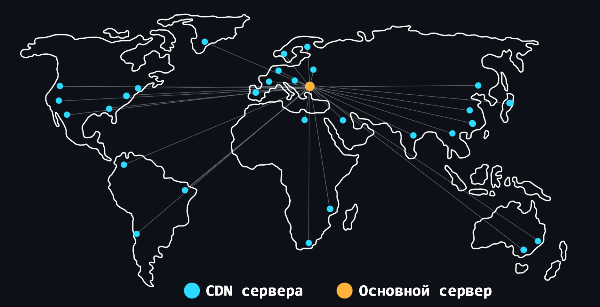</p>

    -   [CDN (Content Delivery Network)](https://ru.wikipedia.org/wiki/Content_Delivery_Network) 
        > Система серверов расположенная по всему миру. Такие сервера позволяют хранить дубликаты статического контента и доставлять его намного быстрее тем пользователям, которые находятся в непосредственной географической близости. Так же при использовании CDN снижается нагрузка на главный сервер. 
    -   Браузерное (клиентское) кэширование 
        > Основано на загрузке страниц и других статических данных из локального кэша. Для этого браузеру (клиенту) отдается специальные заголовки: [304 Not Modified](https://developer.mozilla.org/ru/docs/Web/HTTP/Status/304), [Expires](https://developer.mozilla.org/ru/docs/Web/HTTP/Headers/Expires), [Strict-Transport-Security](https://developer.mozilla.org/ru/docs/Web/HTTP/Headers/Strict-Transport-Security).
    -   [Memcached](https://ru.wikipedia.org/wiki/Memcached) 
        > Программа-демон которая реализует высокопроизводительное кэширование в оперативной памяти на основе пар _ключ-значение_. В отличие от [Redis](#redis) не может являться надёжным и долговременным хранилищем, поэтому подходит только для кэша.

<details>
    <summary>🔗 <b>Ссылки на материалы</b></summary>

1. 📄 [**Что такое CDN и как это работает?** – habr.com](https://habr.com/ru/company/selectel/blog/463915)
2. 📄 [**CDN: что такое и как это работает** – selectel.ru](https://selectel.ru/blog/review-cdn/)
3. 📄 [**Что такое CDN и как работает данная технология**](https://timeweb.com/ru/community/articles/chto-takoe-cdn-i-zachem-on-nuzhen)
4. 📺 [**CDN своими руками** – YouTube](https://youtu.be/YSyQb2BKW9I)
5. 📄 [**Учебное пособие по кэшированию** – habr.com](https://habr.com/ru/post/203548/)
6. 📄 [**Кэширование и производительность веб-приложений** – habr.com](https://habr.com/ru/company/ruvds/blog/350310/)
7. 📄 [**Основы кеширования веб-приложений**](https://dev-gang.ru/article/osnovy-keshirovanija-vebprilozhenii-3hwgeivhpg/)
8. 📄 [**HTTP-кеширование** – (MDN) mozilla.org](https://developer.mozilla.org/ru/docs/Web/HTTP/Caching)
9. 📄 [**Четыре уровня кэширования в сети: клиентский, сетевой, серверный и уровень приложения** – tproger.ru](https://tproger.ru/translations/cache-levels-on-the-web/)
10. 📄 [**«HTTP Strict-Transport-Security» или как обезопасить себя от атак «man-in-the-middle» и заставить браузер всегда использовать HTTPS** – habr.com](https://habr.com/ru/post/216751/)
11. 📄 [**Что такое Memcached?** – Amazon](https://aws.amazon.com/ru/memcached/)
12. 📺 [**Сравниваем Redis и Memcached, плюсы и минусы этих решений** – YouTube](https://youtu.be/sYamcfYati8)
</details>

<div align="right"><a href="#top">Содержание ⬆️</a></div>

-   ### Балансировка нагрузки

    <p align="center">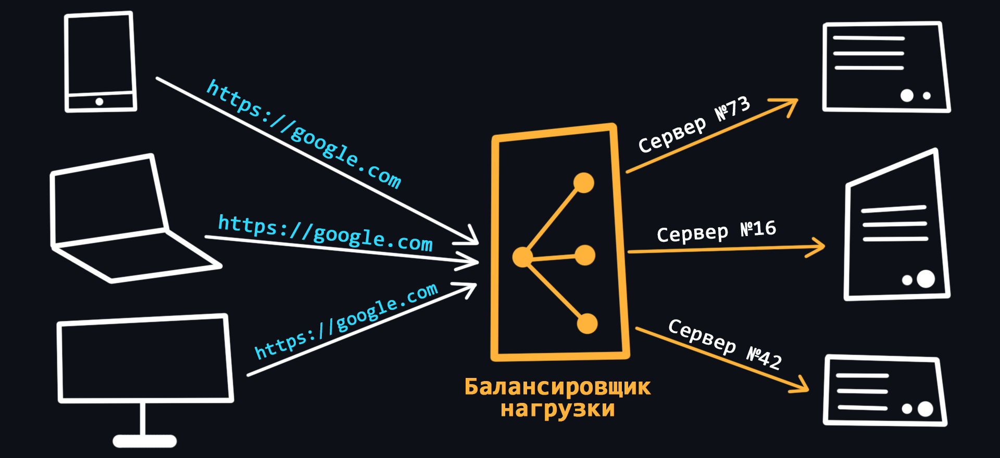</p>

    Когда весь код приложения максимально оптимизирован и наращивание мощности сервера подходит к пределу, а нагрузка всё растёт и растёт – приходится прибегать к механизмам [кластеризации](https://ru.wikipedia.org/wiki/%D0%9A%D0%BB%D0%B0%D1%81%D1%82%D0%B5%D1%80_(%D0%B3%D1%80%D1%83%D0%BF%D0%BF%D0%B0_%D0%BA%D0%BE%D0%BC%D0%BF%D1%8C%D1%8E%D1%82%D0%B5%D1%80%D0%BE%D0%B2)) и [балансировки](https://ru.wikipedia.org/wiki/%D0%91%D0%B0%D0%BB%D0%B0%D0%BD%D1%81%D0%B8%D1%80%D0%BE%D0%B2%D0%BA%D0%B0_%D0%BD%D0%B0%D0%B3%D1%80%D1%83%D0%B7%D0%BA%D0%B8). Суть заключается в объединении групп серверов в кластера, где нагрузка между ними распределяется при помощи специальных методов и алгоритмов, называемых балансировкой. 

    -   Балансировка на сетевом уровне
        > - **DNS-балансировка**. На одно доменное имя выделяется несколько IP-адресов и сервер на который будет перенаправлен запрос определяется по алгоритму [Round Robin](https://ru.wikipedia.org/wiki/Round-robin_(%D0%B0%D0%BB%D0%B3%D0%BE%D1%80%D0%B8%D1%82%D0%BC)).
        > - **Построение [NLB-кластера](https://learn.microsoft.com/ru-ru/windows-server/networking/technologies/network-load-balancing)**. Используется для управления двумя или более серверами в качестве одного виртуального кластера.
        > - **Балансировка по территориальному признаку**. Примером может служить [метод рассылки Anycast](https://ru.wikipedia.org/wiki/Anycast).
    -   Балансировка на транспортном уровне
        > Общение с клиентом замыкается на балансировщике, который работает как прокси. Он взаимодействует с серверами от своего имени, передавая информацию о клиенте в дополнительных данных и заголовках. Пример – [HAProxy](https://ru.wikipedia.org/wiki/HAProxy).
    -   Балансировка на прикладном уровне
        > Балансировщик анализирует клиентские запросы и перенаправляет их на разные серверы в зависимости от характера запрашиваемого контента. Примером может служить [модуль Upstream в Nginx](https://www.digitalocean.com/community/tutorials/how-to-set-up-nginx-load-balancing) (который отвечает за балансировку) и [pgpool](https://docs.nextgis.ru/docs_ngweb/source/replication.html) из базы данных PostgreSQL (например, c его помощью можно распределять запросы на чтение на один сервер, а запросы на запись — на другой).
    -   Алгоритмы балансировки
        > - [**Round Robin**](https://ru.wikipedia.org/wiki/Round-robin_(%D0%B0%D0%BB%D0%B3%D0%BE%D1%80%D0%B8%D1%82%D0%BC)). Каждый запрос направляется поочередно на каждый сервер (сначала на первый, потом на второй и так по кругу).
        > - [**Weighted Round Robin**](https://en.wikipedia.org/wiki/Weighted_round_robin). Улучшенный алгоритм Round Robin, который учитывает еще и производительность сервера.
        > - [**Least Connections**](https://nginx.org/en/docs/http/load_balancing.html). Каждый последующий запрос направляется на сервер с наименьшим количеством поддерживаемых подключений.
        > - **Destination Hash Scheduling**. Сервер, обрабатывающий запрос, выбирается из статической таблицы по IP-адресу получателя.
        > - **Source Hash Scheduling**. Сервер, который будет обрабатывать запрос, выбирается из таблицы по IP-адресу отправителя.
        > - [**Sticky Sessions**](https://habr.com/ru/company/domclick/blog/548610/). Запросы распределяются в зависимости от IP-адреса пользователя. Sticky Sessions предполагает, что обращения от одного клиента будут направляться на один и тот же сервер, а не скакать в пуле.

<details>
    <summary>🔗 <b>Ссылки на материалы</b></summary>

1. 📄 [**Как устроен балансировщик нагрузки: алгоритмы, методы и задачи** – selectel.ru](https://selectel.ru/blog/load-balancer-review/)
2. 📄 [**Балансировка нагрузки: основные алгоритмы и методы** – habr.com](https://habr.com/ru/company/selectel/blog/250201/)
3. 📄 [**Введение в современную балансировку сетевой нагрузки и проксирование** – medium.com](https://medium.com/southbridge/introduction-to-modern-network-load-balancing-and-proxying-52e8ca36adde)
4. 📄 [**Балансировка и распределение нагрузки**](https://linkmeup.gitbook.io/sdsm/8.-bgp-i-ip-sla/2.-bgp/4.-balansirovka-nagruzki)
5. 📺 [**Балансировка нагрузки при помощи NGINX** – YouTube](https://youtu.be/XGIqSHpScrI)
6. 📺 [**HAProxy - бесплатный LoadBalancer. Установка и конфигурация** – YouTube](https://youtu.be/FmV_GMC_Sw8)
</details>

<div align="right"><a href="#top">Содержание ⬆️</a></div>

## Документирование

-   ### Markdown

    Стандарт в мире разработки. Невероятно простой, но в тоже время мощный язык разметки для описания Ваших проектов. Собственно говоря, ресурс, который Вы сейчас читаете, написан с помощью [Markdown](https://ru.wikipedia.org/wiki/Markdown).

    -   [Markdown cheatsheet](https://github.com/sandino/Markdown-Cheatsheet)
        > Шпаргалка по всем синтаксически возможностям языка.
    -   [Awesome Markdown](https://github.com/BubuAnabelas/awesome-markdown)
        > Сборник различных ресурсов для работы с Markdown.
    -   [Awesome README](https://github.com/matiassingers/awesome-readme)
        > Сборник красивых README.md файлов (это главный файл любого репозитория на GitHub, использующий Markdown). 
    -   Конспекты и заметки
        > Markdown используются не только для написания документации. Этот невероятный инструмент отлично подходит для обучения – создания электронных конспектов и различных заметок. Лично я использую [редактор Obsidian](https://obsidian.md/) для конспектирования нового материала.

<details>
    <summary>🔗 <b>Ссылки на материалы</b></summary>

1. 📺 [**Markdown - Обзор языка разметки** – YouTube](https://youtu.be/xaOHsJ5Igys)
1. 📄 [**Шпаргалка по Markdown** – Learn X in Y Minutes](https://learnxinyminutes.com/docs/ru-ru/markdown-ru/)
1. 📺 [**README – документирование проекта на GitHub** – YouTube](https://youtu.be/rnsIMha15KU)
1. 📄 [**Оформляем README-файл профиля на GitHub** – habr.com](https://habr.com/ru/post/649363/)
1. 📺 [**Курс по Obsidian** – YouTube](https://youtube.com/playlist?list=PLrRc3UisLr6KVOYhzpSnywtHkCi2PEza5)
</details>

<div align="right"><a href="#top">Содержание ⬆️</a></div>

-   ### Документация внутри кода

    Для каждого современного языка программирования существуют [специальные инструменты](https://ru.wikipedia.org/wiki/%D0%93%D0%B5%D0%BD%D0%B5%D1%80%D0%B0%D1%82%D0%BE%D1%80_%D0%B4%D0%BE%D0%BA%D1%83%D0%BC%D0%B5%D0%BD%D1%82%D0%B0%D1%86%D0%B8%D0%B8) которые позволяют писать документацию прямо в коде программы. Благодаря этому Вы можете читать описание методов, функций, структур и так далее прямо внутри вашей IDE. Как правило, такого рода документация выполняется в виде обычных комментариев с учётом некоторых синтаксических особенностей.

    - Зачем нужно?
        > Чтобы сделать свою работу и работу других разработчиков проще. В долгосрочной перспективе это сэкономит больше времени, чем _путешествия по коду_ с целью понять как все работает, какие параметры передать функции или узнать какие вообще методы есть у того или иного класса. Со временем вы неизбежно будете забывать свой же код, поэтому уже написанная документация будет полезна и Вам лично.
    - Что нужно чтобы начать?
        > Для каждого языка все индивидуально. Во многих есть свои устоявшиеся подходы:
        > - [Docstring](https://peps.python.org/pep-0257/) для Python.
        > - [JSDoc](https://github.com/jsdoc/jsdoc) для JavaScript.
        > - [Godoc](https://go.dev/doc/comment) для Go.
        > - [KDoc и Dokka](https://kotlinlang.org/docs/kotlin-doc.html) для Kotlin.
        > - [Javadoc](https://ru.wikipedia.org/wiki/Javadoc) для Java.
        > - И другие ищите по запросу: `documentation engine for <ваш язык>`.

<details>
    <summary>🔗 <b>Ссылки на материалы</b></summary>

1. 📄 [**Документирование кодовой базы. Зачем и как?** – habr.com](https://habr.com/ru/post/565342/)
2. 📄 [**Документация кода**](https://starkovden.github.io/about-eleventh-module.html)
</details>

<div align="right"><a href="#top">Содержание ⬆️</a></div>

-   ### Документирование API

    Удобная и понятная документация позволит другим пользователям быстрее разобраться и начать использовать ваш продукт. Писать документацию с нуля – это утомительный процесс. Для решения этой проблемы существуют общепринятые спецификации и инструменты автогенерации.

    -   [OpenAPI](https://ru.wikipedia.org/wiki/OpenAPI_(%D1%81%D0%BF%D0%B5%D1%86%D0%B8%D1%84%D0%B8%D0%BA%D0%B0%D1%86%D0%B8%D1%8F))
        > Спецификация, которая описывает, то как необходимо документировать API, чтобы он был читаем как для людей, так и для машин.
    -   [Swagger](https://swagger.io/)
        > Набор инструментов который позволяет создавать удобную документацию API на основе той самой спецификации OpenAPI.
    -   [Swagger UI](https://swagger.io/tools/swagger-ui/)
        > Инструмент позволяющий автоматически генерировать интерактивную документацию, которую можно не только читать, но и активно с ней взаимодействовать (отправлять HTTP-запросы).
    -   [Swagger editor](https://editor.swagger.io/)
        > Этакий playground в котором можно писать документацию и сразу видеть результат сгенерированной странички. Для этого используется файл YAML или JSON формата.
    -   [Swagger codegen](https://swagger.io/tools/swagger-codegen/)
        > Позволяет автоматически создавать клиентские библиотеки API, заглушки сервера и документацию.

<details>
    <summary>🔗 <b>Ссылки на материалы</b></summary>

1. 📄 [**Документирование конечных точек**](https://starkovden.github.io/about-third-module.html)
1. 📺 [**Что такое Swagger и OpenAPI за 3 минуты** – YouTube](https://youtu.be/aaFDBgPdXw4)
1. 📄 [**Swagger – умная документация вашего RESTful web-API** – habr.com](https://habr.com/ru/post/434798/)
1. 📄 [**В чем польза формальных спецификаций вроде OpenAPI?** – habr.com](https://habr.com/ru/company/typeable/blog/573420/)
1. 📄 [**Спецификация OpenAPI и Swagger**](https://starkovden.github.io/about-fourth-module.html)
1. 📺 [**API + Swagger. Доклад Яндекса** – YouTube](https://youtu.be/lYjm2w8-ERI)
1. 📄 [**Итак, вам нужно документировать API...**](https://protext.su/pro/itak-vam-nuzhno-dokumentirovat-api/)
1. 📄📺 [**Специфицируй это. Доклад Яндекса** – habr.com](https://habr.com/ru/company/yandex/blog/501088/)
1. 📄 [**Тестирование документации**](https://starkovden.github.io/about-fifth-module.html)
</details>

<div align="right"><a href="#top">Содержание ⬆️</a></div>

-   ### Генераторы статики

    Со временем, когда Ваш проект разрастается и у него появляется множество модулей, одной странички README на GitHub может быть не достаточно. Уместно будет создать отдельный сайт для документации вашего проекта. Для этого совсем не обязательно учиться верстать, поскольку существует множество сайтов-генераторов для создания красивой и удобной документации.

    -   [GitBook](https://www.gitbook.com/)
        > Наверное самый популярный генератор документации с использованием GitHub/Git и Markdown.
    -   [Docusaurus](https://docusaurus.io/)
        > Open-source генератор от компании Facebook (Meta).
    -   [MkDocs](https://www.mkdocs.org/)   
        > Простой и широко кастомизируемый генератор документации в формате Markdown.
    -   [Slate](https://slatedocs.github.io/slate)
        > Минималистичный генератор документации для REST API.
    -   [Docsify](https://docsify.js.org/#/ru-ru/)
        > Ещё один простой, легкий и минималистичный генератор статики.
    -   [Astro](https://astro.build/)
        > Генератор с современным и продвинутым дизайном.
    -   [mdBook](https://rust-lang.github.io/mdBook/)
        > Статический генератор от разработчиков языка Rust.
    -   [И другие...](https://jamstack.org/generators/)

<details>
    <summary>🔗 <b>Ссылки на материалы</b></summary>

1. 📺 [**GitBook для документации, портфолио и личных записей** – YouTube](https://youtu.be/z_mtp_uM4eI)
1. 📄 [**Пошаговая инструкция как использовать MkDocs для создания сайта с документацией продукта** – habr.com](https://habr.com/ru/company/rostelecom/blog/570098/)
1. 📄 [**Как писать хорошую документацию** – habr.com](https://habr.com/ru/company/plesk/blog/562960/)
1. 📄 [**Публикация документации**](https://starkovden.github.io/about-seventh-module.html)
</details>

<div align="right"><a href="#top">Содержание ⬆️</a></div>

## Построение архитектуры

-   ### Архитектурные шаблоны

    -   [Layered (многоуровневый)](https://ducmanhphan.github.io/2020-02-20-Layered-architecture-pattern/)
        > Используется для структурирования программ, которые могут быть разложены на группы подзадач, каждая из которых находится на определенном уровне абстракции. Каждый уровень предоставляет услуги следующему более высокому уровню.
    -   [Client-server](https://ru.wikipedia.org/wiki/%D0%9A%D0%BB%D0%B8%D0%B5%D0%BD%D1%82_%E2%80%94_%D1%81%D0%B5%D1%80%D0%B2%D0%B5%D1%80)
        > Классический шаблон, где клиенты обращаются за данными и услугами к серверу, а сервер эффективно обрабатывает эти запросы.
    -   [Master-slave (ведущий-ведомый)](https://ru.wikipedia.org/wiki/%D0%92%D0%B5%D0%B4%D1%83%D1%89%D0%B8%D0%B9_%E2%80%94_%D0%B2%D0%B5%D0%B4%D0%BE%D0%BC%D1%8B%D0%B9)
        > Ведущий компонент распределяет работу между идентичными ведомыми компонентами и вычисляет конечный результат из результатов, которые возвращают ведомые компоненты.
    -   [Pipe-filter (канал-фильтр)](https://learn.microsoft.com/en-us/azure/architecture/patterns/pipes-and-filters)
        > Каждый этап обработки заключен в компонент фильтра. Данные, подлежащие обработке, передаются по каналам. Эти каналы могут использоваться для буферизации или для синхронизации.
    -   [Broker pattern (посредник)](https://en.wikipedia.org/wiki/Broker_pattern)
        > Компонент посредника отвечает за координацию связи между всеми компонентами.
    -   [Peer-to-peer (одноранговый)](https://ru.wikipedia.org/wiki/%D0%9E%D0%B4%D0%BD%D0%BE%D1%80%D0%B0%D0%BD%D0%B3%D0%BE%D0%B2%D0%B0%D1%8F_%D1%81%D0%B5%D1%82%D1%8C)
        > Компоненты могут функционировать как в качестве клиента, запрашивая услуги у других компонентов, так и в качестве сервера, предоставляя услуги другим компонентам. Компонент может действовать как клиент, как сервер или как оба, а также может динамически менять свою роль со временем.
    -   [Event-bus (шина событий)](https://medium.com/elixirlabs/event-bus-implementation-s-d2854a9fafd5)
        > Имеет 4 основных компонента: источник событий, слушатель событий, канал и шина событий. Источники публикуют сообщения в определенные каналы на шине событий.
    -   [Blackboard (доска)](<https://en.wikipedia.org/wiki/Blackboard_(design_pattern)>)
        > Применяется для решения задач, для которых не известны [детерминированные](https://ru.wikipedia.org/wiki/%D0%94%D0%B5%D1%82%D0%B5%D1%80%D0%BC%D0%B8%D0%BD%D0%B8%D1%80%D0%BE%D0%B2%D0%B0%D0%BD%D0%BD%D0%BE%D1%81%D1%82%D1%8C) стратегии решения.
    -   [Interpreter (интерпретатор)](https://ru.wikipedia.org/wiki/%D0%98%D0%BD%D1%82%D0%B5%D1%80%D0%BF%D1%80%D0%B5%D1%82%D0%B0%D1%82%D0%BE%D1%80_(%D1%88%D0%B0%D0%B1%D0%BB%D0%BE%D0%BD_%D0%BF%D1%80%D0%BE%D0%B5%D0%BA%D1%82%D0%B8%D1%80%D0%BE%D0%B2%D0%B0%D0%BD%D0%B8%D1%8F))
        > Используется для разработки компонента, который интерпретирует программы, написанные на специальном языке.
    -   [Model-view-controller](https://en.wikipedia.org/wiki/Model%E2%80%93view%E2%80%93controller)
    -   [MVP (Modev-View-Presenter)](https://ru.wikipedia.org/wiki/Model-View-Presenter)
    -   [MVVM (Model-View-ViewModel)](https://ru.wikipedia.org/wiki/Model-View-ViewModel)
    -   [DDD (Domain-Driven Design)](https://ru.wikipedia.org/wiki/%D0%9F%D1%80%D0%B5%D0%B4%D0%BC%D0%B5%D1%82%D0%BD%D0%BE-%D0%BE%D1%80%D0%B8%D0%B5%D0%BD%D1%82%D0%B8%D1%80%D0%BE%D0%B2%D0%B0%D0%BD%D0%BD%D0%BE%D0%B5_%D0%BF%D1%80%D0%BE%D0%B5%D0%BA%D1%82%D0%B8%D1%80%D0%BE%D0%B2%D0%B0%D0%BD%D0%B8%D0%B5)
    -   [Event-Driven Architecture](https://ru.wikipedia.org/wiki/%D0%A1%D0%BE%D0%B1%D1%8B%D1%82%D0%B8%D0%B9%D0%BD%D0%BE-%D0%BE%D1%80%D0%B8%D0%B5%D0%BD%D1%82%D0%B8%D1%80%D0%BE%D0%B2%D0%B0%D0%BD%D0%BD%D0%B0%D1%8F_%D0%B0%D1%80%D1%85%D0%B8%D1%82%D0%B5%D0%BA%D1%82%D1%83%D1%80%D0%B0)

<details>
    <summary>🔗 <b>Ссылки на материалы</b></summary>

1. 📺 [**Архитектура ПО. Что это и зачем?** – YouTube](https://youtu.be/JXI2CsT2ZZQ)
2. 📄 [**Краткий обзор 10 популярных архитектурных шаблонов приложений** – medium](https://medium.com/nuances-of-programming/%D0%BA%D1%80%D0%B0%D1%82%D0%BA%D0%B8%D0%B9-%D0%BE%D0%B1%D0%B7%D0%BE%D1%80-10-%D0%BF%D0%BE%D0%BF%D1%83%D0%BB%D1%8F%D1%80%D0%BD%D1%8B%D1%85-%D0%B0%D1%80%D1%85%D0%B8%D1%82%D0%B5%D0%BA%D1%82%D1%83%D1%80%D0%BD%D1%8B%D1%85-%D1%88%D0%B0%D0%B1%D0%BB%D0%BE%D0%BD%D0%BE%D0%B2-%D0%BF%D1%80%D0%B8%D0%BB%D0%BE%D0%B6%D0%B5%D0%BD%D0%B8%D0%B9-81647be5c46f)
3. 📺 [**Что такое MVC за 4 минуты** – YouTube](https://youtu.be/NDOPFWOId28)
4. 📺 [**MVC, MVVM Архитектура. Наглядная теория и примеры** – YouTube](https://youtu.be/X85soC5evw0)
5. 📄 [**Самые важные архитектурные шаблоны, которые нужно знать** – habr.com](https://habr.com/ru/company/alconost/blog/522662/)
6. 📄 [**Архитектурные шаблоны** – github.com](https://github.com/Max-Starling/Notes/blob/master/Architecture-Design.md)
7. 📄 [**Чистая архитектура** – habr.com](https://habr.com/ru/post/269589/)
8. 📄 [**Что можно узнать о Domain Driven Design за 10 минут?** – habr.com](https://habr.com/ru/company/dododev/blog/489352/)
9. 📺 [**Доклад про Domain Driven Design** – YouTube](https://youtu.be/_CK5Kag7enw)
</details>

<div align="right"><a href="#top">Содержание ⬆️</a></div>

-   ### Паттерны проектирования

    -   Порождающие паттерны
        > Отвечают за удобное и безопасное создание новых объектов или даже целых семейств объектов
        -   [Factory (Фабрика)](https://refactoring.guru/ru/design-patterns/factory-method)
        -   [Abstract factory (Абстрактная фабрика)](https://refactoring.guru/ru/design-patterns/abstract-factory)
        -   [Builder (Строитель)](https://refactoring.guru/ru/design-patterns/builder)
        -   [Prototype (Прототип)](https://refactoring.guru/ru/design-patterns/prototype)
        -   [Singleton (Одиночка)](https://refactoring.guru/ru/design-patterns/singleton)
    -   Структурные паттерны
        > Отвечают за построение удобных в поддержке иерархий классов
        -   [Adapter (Адаптер)](https://refactoring.guru/ru/design-patterns/adapter)
        -   [Bridge (Мост)](https://refactoring.guru/ru/design-patterns/bridge)
        -   [Composite (Компоновщик)](https://refactoring.guru/ru/design-patterns/composite)
        -   [Decorator (Декоратор)](https://refactoring.guru/ru/design-patterns/decorator)
        -   [Facade (Фасад)](https://refactoring.guru/ru/design-patterns/facade)
        -   [Flyweight (Легковес)](https://refactoring.guru/ru/design-patterns/flyweight)
        -   [Proxy (Заместитель)](https://refactoring.guru/ru/design-patterns/proxy)
    -   Поведенческие паттерны
        > Решают задачи эффективного и безопасного взаимодействия между объектами программы
        -   [Chain of Responsibility (Цепочка обязонностей)](https://refactoring.guru/ru/design-patterns/chain-of-responsibility)
        -   [Command (Команда)](https://refactoring.guru/ru/design-patterns/command)
        -   [Iterator (Итератор)](https://refactoring.guru/ru/design-patterns/iterator)
        -   [Mediator (Посредник)](https://refactoring.guru/ru/design-patterns/mediator)
        -   [Memento (Снимок)](https://refactoring.guru/ru/design-patterns/memento)
        -   [Observer (Наблюдатель)](https://refactoring.guru/ru/design-patterns/observer)
        -   [State (Состояние)](https://refactoring.guru/ru/design-patterns/state)
        -   [Strategy (Стратегия)](https://refactoring.guru/ru/design-patterns/strategy)
        -   [Template (Шаблон)](https://refactoring.guru/ru/design-patterns/template-method)
        -   [Visitor (Посетитель)](https://refactoring.guru/ru/design-patterns/visitor)
<details>
    <summary>🔗 <b>Ссылки на материалы</b></summary>

1. 📄 [**Паттерны ООП в метафорах** – habr.com](https://habr.com/ru/post/136766/)
2. 📄 [**Шаблоны проектирования (лекции и примеры кода на Node.js)** – GitHub](https://github.com/HowProgrammingWorks/Index/blob/master/Courses/Patterns.md)
3. 📄 [**Шпаргалка по шаблонам проектирования** – habr.com](https://habr.com/ru/post/210288/)
4. 📺 [**Паттерны проектирования на языке Python (playlist)** – YouTube](https://youtube.com/playlist?list=PLKP3l9fd3KUHYXVsSy37WXSkvunqenNhS)
5. 📺 [**JavaScript Паттерны. Шаблоны проектирования. 17 Примеров** – YouTube](https://youtu.be/YJVj4XNASDk)
6. 📺 [**Паттерны проектирования на языке Go (playlist)** – YouTube](https://youtube.com/playlist?list=PLxj7Nz8YYkVW5KHnsb9qWUDP2eD1TXl1N)
7. 📄 [**Паттерны проектирования** – metanit.com](https://metanit.com/sharp/patterns/)
</details>

<div align="right"><a href="#top">Содержание ⬆️</a></div>

-   ### Монолитная и микросервисная архитектура

    <p align="center">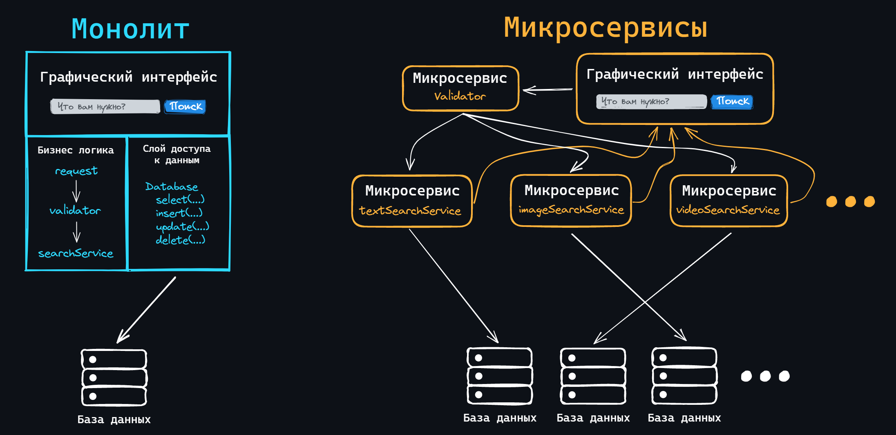</p>

    Монолит – это полноценное приложение, которое содержит единую кодовую базу (написана на одном стеке технологий и хранится в одном репозитории) и имеет единую точку входа для запуска всего приложения. Это самый распространенный подход для создания приложений в одиночку или небольшой командой.

    -   Достоинства
        > - Простота разработки (все в одном стиле и в одном месте). <br>
        > - Простота развертывания. <br>
        > - Легко масштабируется на начальном этапе.
    -   Недостатки
        > - Нарастающая сложность (с ростом проекта увеличивается порог входа для новых разработчиков). <br>
        > - Растет время на сборку и запуск. <br>
        > - Усложняется добавление нового функционала, который затрагивает старый. <br>
        > - Сложно (или невозможно) применение новых технологий.

    Микросервис – это полноценное приложение с единой кодовой базой. Но, в отличие от монолита, такое приложение отвечает лишь за одну функциональную единицу. То есть это маленький сервис, который решает только одну задачу, но хорошо.

    -   Достоинства
        > - Каждый отдельный микросервис может иметь свой стек технологий и разрабатываться не зависимо. <br>
        > - Легко добавлять новый функционал (просто создайте новый микросервис). <br>
        > - Меньше порог входа для новых разработчиков. <br>
        > - Малые затраты времени на сборку и запуск.
    -   Недостатки
        > - Сложность реализации взаимодействия между всеми микросервисами. <br>
        > - Сложнее в эксплуатации, чем несколько экземпляров монолита. <br>
        > - Сложность выполнения транзакций. <br>
        > - Изменения, затрагивающие несколько микросервисов, должны координироваться.

<details>
    <summary>🔗 <b>Ссылки на материалы</b></summary>

1. 📄 [**Что такое микросервисы**](https://doka.guide/tools/microservices/)
2. 📄 [**Сравнение микросервисной и монолитной архитектур**](https://www.atlassian.com/ru/microservices/microservices-architecture/microservices-vs-monolith)
3. 📺 [**Архитектура приложений. Монолит VS Микросервисы** – YouTube](https://youtu.be/pzwbFUzj5R8)
4. 📺 [**Что такое микросервисы. Основные принципы и паттерны** – YouTube](https://youtu.be/uKtRSmO8ALk)
5. 📄 [**Модули, монолиты и микросервисы** – habr.com](https://habr.com/ru/company/flant/blog/572414/)
</details>

<div align="right"><a href="#top">Содержание ⬆️</a></div>

-   ### Горизонтальное и вертикальное масштабирование

    <p align="center">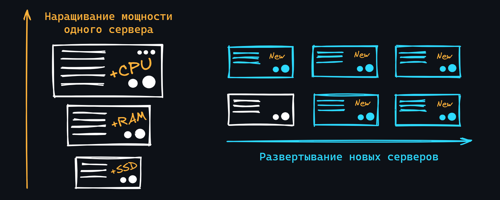</p>

    Со временем, когда нагрузка на Ваше приложение начинает расти (приходит больше пользователей, появляется новый функционал и, как следствие, задействуется больше процессорного времени), становится необходимым увеличивать мощность сервера. Для этого есть [2 основных подхода](https://ru.wikipedia.org/wiki/%D0%9C%D0%B0%D1%81%D1%88%D1%82%D0%B0%D0%B1%D0%B8%D1%80%D1%83%D0%B5%D0%BC%D0%BE%D1%81%D1%82%D1%8C):

    -   Вертикальное масштабирование
        > Подразумевает увеличение мощности уже существующего сервера. К примеру, сюда можно отнести увеличение размера оперативной памяти, установка более быстрого накопителя или увеличение его объема, а также покупка нового процессора с большой тактовой частотой и/или большим количеством ядер и потоков. Вертикальное масштабирование имеет свой предел, поскольку мы не можем долго наращивать мощности одного сервера.
    -   Горизонтальное масштабирование
        > Процесс развертывания новых серверов. Данный подход требует построения надёжной и масштабируемой архитектуры, которая позволит разнести логику работы всего приложения (или уже правильнее сказать сервиса) на несколько физических машин.

<details>
    <summary>🔗 <b>Ссылки на материалы</b></summary>

1. 📺 [**Собираем масштабируемую архитектуру веб-приложения. Горизонтальное и вертикальное масштабирование** – YouTube](https://youtu.be/kclYmb47LTg)
1. 📄 [**Вертикальное и горизонтальное масштабирование** – microsoft.com](https://azure.microsoft.com/ru-ru/solutions/scaling-out-vs-scaling-up/#overview)
1. 📺 [**Как горизонтально масштабироваться и не взрывать продакшн** – YouTube](https://youtu.be/Er9ISG13iLY)
1. 📄 [**Как масштабировать WebSocket?**](https://dev-gang.ru/article/kak-masshtabirovat-websocket-7qc8oecpbl/)
</details>

<div align="right"><a href="#top">Содержание ⬆️</a></div>

## Дополнительные и похожие ресурсы

-   [Backend Developer Roadmap: Learn to become a modern backend developer](https://roadmap.sh/backend)
-   [Профессия: бэкенд-разработчик](https://habr.com/ru/company/ruvds/blog/488340/)
-   [Backend Roadmap (from Junior to Senior)](https://github.com/bzick/oh-my-backend)
-   [A curated and opinionated list of resources (English & Russian) for Backend developers](https://github.com/zhashkevych/awesome-backend)
-   [Timur Shemsedinov – открытые лекции, конференции, митапы по программной инженерии](https://www.youtube.com/c/TimurShemsedinov)
-   [Hussein Nasser – один из лучших англоязычных каналов на YouTube по серверной разработке](https://www.youtube.com/c/HusseinNasser-software-engineering)
-   [Курс по компьютерным сетям начального уровня](https://www.asozykin.ru/courses/networks_online)
-   [Как освоить бэкенд-разработку в 2022 году: дорожная карта](https://tproger.ru/articles/backend-roadmap-2021/)
-   [Backend Roadmap для самоучек](https://youtu.be/2_4WBH-Si0w)
-   [Max-Starling/Notes - Заметки Full Stack разработчика](https://github.com/Max-Starling/Notes)
-   [Что должен знать Junior Backend разработчик? Подробный план](https://youtu.be/VR9EPKz8aXk)
-   [Сети для самых маленьких – серия статей о сетях, их настройке и администрировании](https://linkmeup.gitbook.io/sdsm/)

<p></p>
<div align="center">Made with 💙</div>
<div align="center"><a href="https://github.com/cheatsnake/backend-cheats/blob/master/LICENSE">LICENSE</a> 2022-Present</div>
